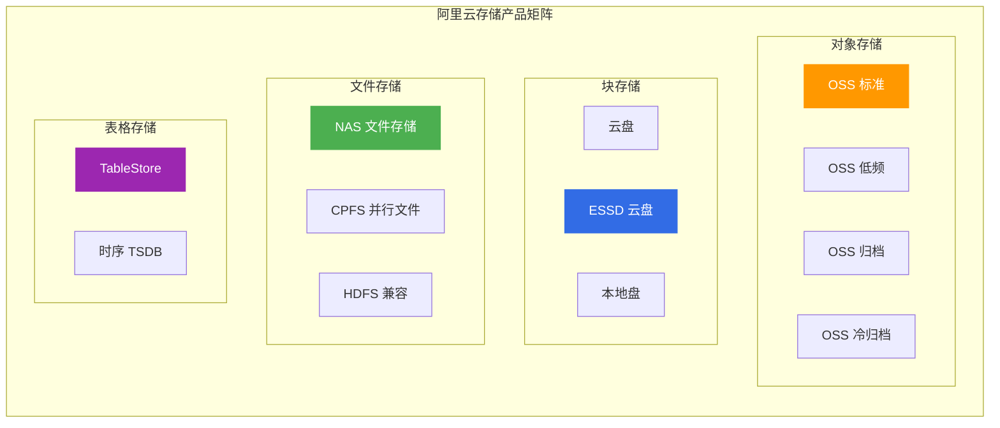
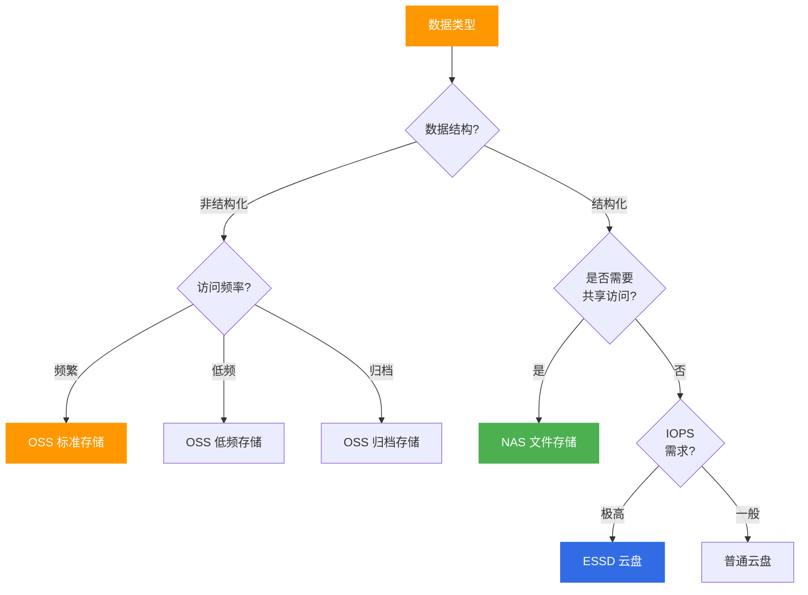
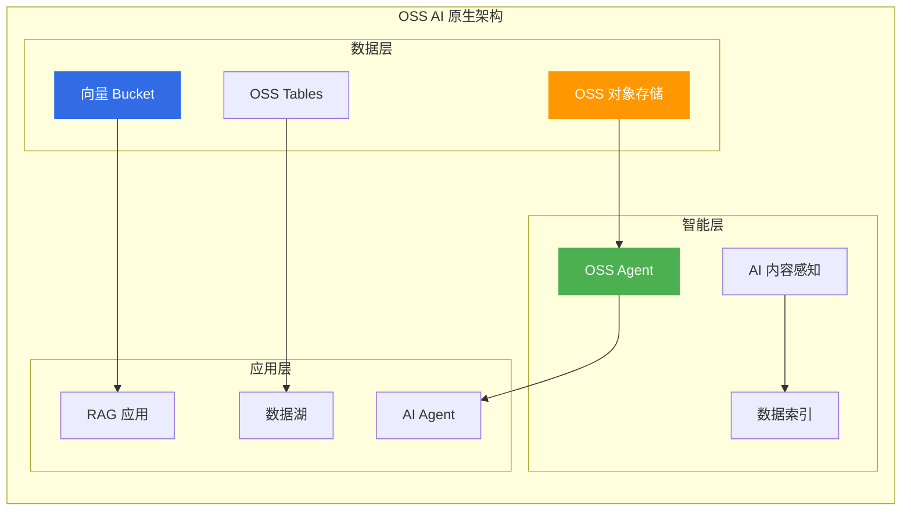
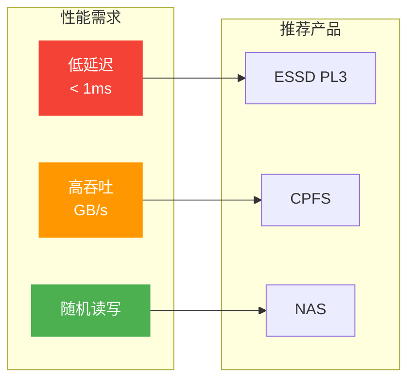
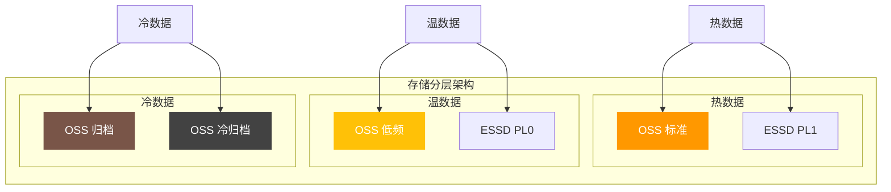

# 阿里云存储产品选型指南

> 面向架构师的存储产品选型决策框架，覆盖对象存储、块存储、文件存储、表格存储等全品类。

## 存储产品矩阵

---

## 一、产品对比矩阵

### 1.1 核心维度对比

| 产品 | 存储类型 | 访问协议 | 延迟 | 吞吐量 | 成本 | 适用数据 |
|------|----------|----------|------|--------|------|----------|
| **OSS** | 对象 | HTTP/SDK | 毫秒级 | 高 | 低 | 非结构化数据 |
| **NAS** | 文件 | NFS/SMB | 毫秒级 | 中 | 中 | 共享文件 |
| **ESSD** | 块 | iSCSI | 微秒级 | 极高 | 高 | 数据库、系统盘 |
| **TableStore** | 宽表 | API | 毫秒级 | 极高 | 中 | IoT、社交 |
| **CPFS** | 并行文件 | POSIX | 微秒级 | 极高 | 极高 | HPC、AI训练 |

### 1.2 存储类型决策树

---

## 二、产品深度分析

### 2.1 对象存储 OSS

**核心定位**: 海量非结构化数据存储服务

| 存储类型 | 访问频率 | 最低存储时间 | 成本 | 适用场景 |
|----------|----------|--------------|------|----------|
| **标准存储** | 频繁 | 无 | 高 | 热点数据、Web应用 |
| **低频存储** | 月级 | 30天 | 中 | 日志、历史数据 |
| **归档存储** | 年级 | 60天 | 低 | 合规归档、备份 |
| **冷归档** | 多年级 | 180天 | 极低 | 7年以上归档 |

**OSS 生命周期管理**:

**选型要点**:
- ✅ 图片、视频、文档等非结构化数据
- ✅ 大数据湖、机器学习数据集
- ✅ 备份、归档、合规存储
- ❌ 不适合频繁修改的数据
- ❌ 不适合需要POSIX文件系统访问

---

### 2.5 OSS AI 原生能力（2025-2026 新特性）

| 特性 | 说明 | 适用场景 |
|------|------|----------|
| **OSS Agent** | 智能体服务，支持自然语言完成 Bucket 管理、异常诊断、健康巡检、费用分析，以及多模态数据语义检索 | 运维管理、智能诊断 |
| **OSS Tables** | 面向数据湖与 AI 场景的结构化数据存储，原生支持 Apache Iceberg，内置 REST Catalog，TPS 提升 10 倍 | 数据湖、AI 数据底座 |
| **向量 Bucket** | 低成本向量数据存储和检索，支持 RAG 多模态检索、AI Agent、知识库 | AI 应用、向量检索 |
| **AI 内容感知** | 支持图片、音视频、文档等多媒体文件智能处理，包括内容提取、识别与聚类 | 多媒体处理、内容理解 |
| **数据索引** | 对特定前缀下的文件进行多条件检索，并支持 AI 向量检索 | 数据统计、数据分析 |

**OSS AI 原生架构**:

---

### 2.2 文件存储 NAS

**核心定位**: 共享文件存储服务

| 类型 | 协议 | 性能 | 适用场景 |
|------|------|------|----------|
| **通用型 NAS** | NFS/SMB | 中 | 办公文档、Web应用 |
| **极速型 NAS** | NFS | 高 | 企业应用、数据库 |
| **CPFS** | POSIX | 极高 | HPC、AI训练 |

**NAS vs OSS 对比**:

| 维度 | NAS | OSS |
|------|-----|-----|
| **访问方式** | 文件系统挂载 | HTTP/SDK |
| **并发访问** | 多机共享 | 海量并发 |
| **随机读写** | 支持 | 不支持 |
| **成本** | 中 | 低 |
| **适用场景** | 传统应用迁移 | 云原生应用 |

**选型要点**:
- ✅ 多台服务器共享文件
- ✅ 传统应用迁移(需要NFS)
- ✅ 容器持久化存储
- ❌ 海量非结构化数据(用OSS)
- ❌ 高性能计算(用CPFS)

---

### 2.3 块存储 ESSD

**核心定位**: 高性能块存储服务

| 等级 | IOPS | 吞吐 | 延迟 | 适用场景 |
|------|------|------|------|----------|
| **ESSD PL0** | 10,000 | 180MB/s | 0.2ms | 一般业务 |
| **ESSD PL1** | 50,000 | 350MB/s | 0.1ms | 核心业务 |
| **ESSD PL2** | 100,000 | 750MB/s | 0.1ms | 高性能数据库 |
| **ESSD PL3** | 1,000,000 | 4,000MB/s | 0.1ms | 极致性能 |

**选型要点**:
- ✅ 数据库系统盘和数据盘
- ✅ 高IOPS应用(OLTP)
- ✅ 需要低延迟的存储
- ❌ 海量数据存储(用OSS)
- ❌ 多机共享(用NAS)

---

### 2.4 表格存储 TableStore

**核心定位**: NoSQL宽表存储服务

| 功能 | 说明 | 适用场景 |
|------|------|----------|
| **宽表模型** | 灵活Schema | 社交、游戏、IoT |
| **时序模型** | 时序数据 | 监控、IoT时序 |
| **GlobalIndex** | 二级索引 | 多维度查询 |
| **TTL** | 数据过期 | 日志、临时数据 |

**TableStore vs MongoDB 对比**:

| 维度 | TableStore | MongoDB |
|------|------------|---------|
| **模型** | 宽表 | 文档 |
| **扩展** | 自动分片 | 手动分片 |
| **一致性** | 强一致 | 最终一致 |
| **成本** | 按量计费 | 实例计费 |
| **适用** | IoT、日志 | 内容管理 |

**选型要点**:
- ✅ IoT设备数据、时序数据
- ✅ 社交、游戏等海量数据
- ✅ 需要自动扩展和TTL
- ❌ 复杂关系查询(用RDS)
- ❌ 需要事务支持(用PolarDB)

---

## 三、选型决策矩阵

### 3.1 按数据类型选型

| 数据类型 | 推荐产品 | 存储类型 | 成本优化 |
|----------|----------|----------|----------|
| **图片/视频** | OSS | 标准→低频→归档 | 生命周期策略 |
| **数据库文件** | ESSD | PL1/PL2 | 预留容量 |
| **日志文件** | OSS + NAS | 低频存储 | 压缩+归档 |
| **共享配置** | NAS | 通用型 | 按需扩容 |
| **IoT数据** | TableStore | 宽表+TTL | 自动过期 |
| **AI训练数据** | OSS + CPFS | 标准+并行 | 数据分层 |

### 3.2 按性能需求选型

---

## 四、成本优化策略

### 4.1 存储分层策略

### 4.2 成本对比

| 产品 | 标准价格(元/GB/月) | 低频价格 | 归档价格 | 冷归档价格 |
|------|---------------------|----------|----------|------------|
| **OSS** | 0.12 | 0.08 | 0.033 | 0.015 |
| **NAS 通用** | 0.35 | - | - | - |
| **ESSD PL1** | 1.0 | - | - | - |

---

## 五、架构师面试要点

### 5.1 高频面试题

1. **OSS vs NAS 如何选择?**
   - 访问方式：HTTP/SDK vs 文件系统挂载
   - 并发需求：海量并发 vs 多机共享
   - 数据特征：非结构化 vs 传统文件

2. **如何设计存储分层策略?**
   - 生命周期管理
   - 访问频率分析
   - 成本效益计算

3. **数据库存储如何选型?**
   - OLTP：ESSD高IOPS
   - OLAP：OSS数据湖
   - 缓存：Redis内存

---

## 六、相关文档

- [09-计算产品选型.md](09-计算产品选型.md) — 计算产品对比
- [11-数据库产品选型.md](11-数据库产品选型.md) — 数据库选型
- [[18-云厂商/09-阿里云云原生/README.md|阿里云云原生产品全景]] — 全产品线清单

---

> **文档版本**: v1.0  
> **最后更新**: 2026-08-22  
> **适用对象**: 云原生架构师、SRE、技术决策者
