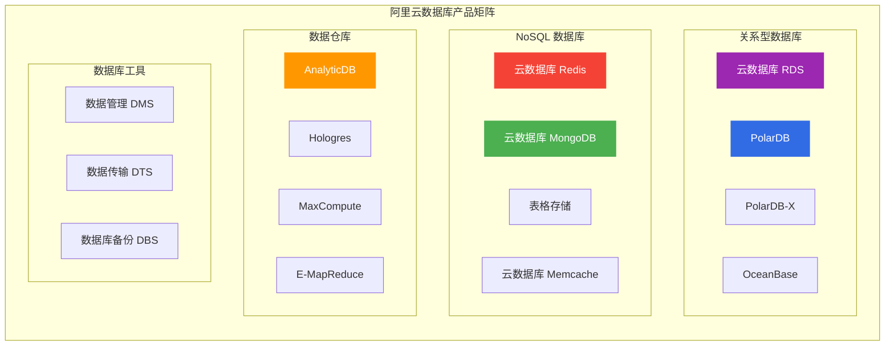
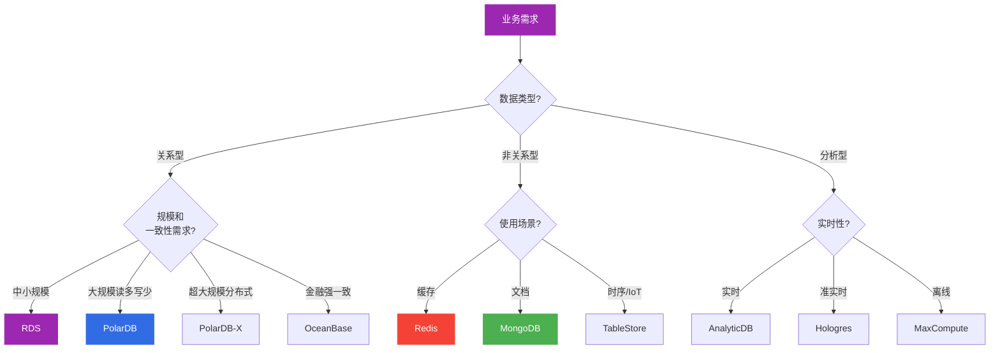
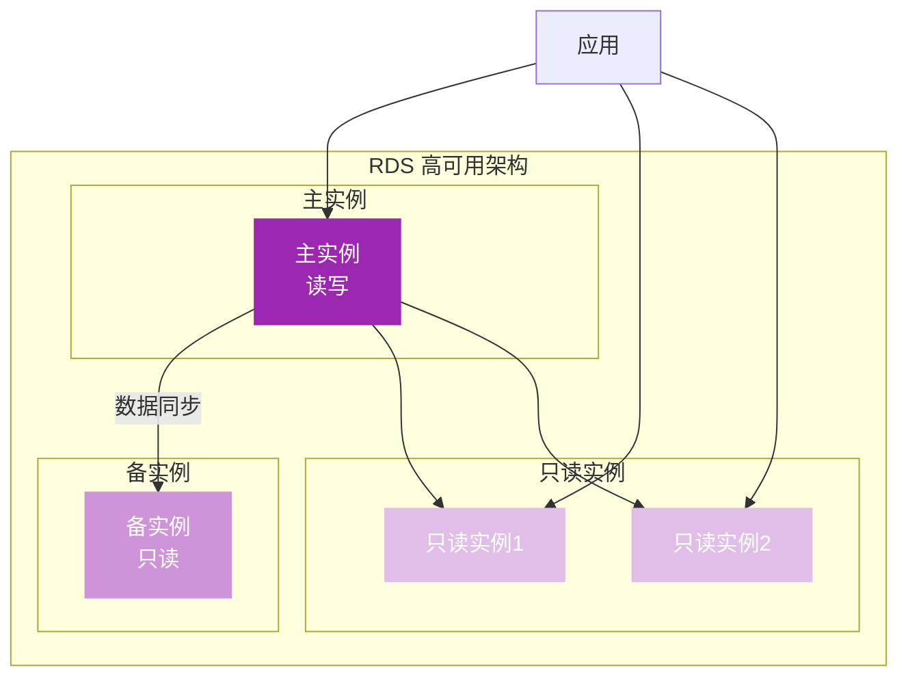
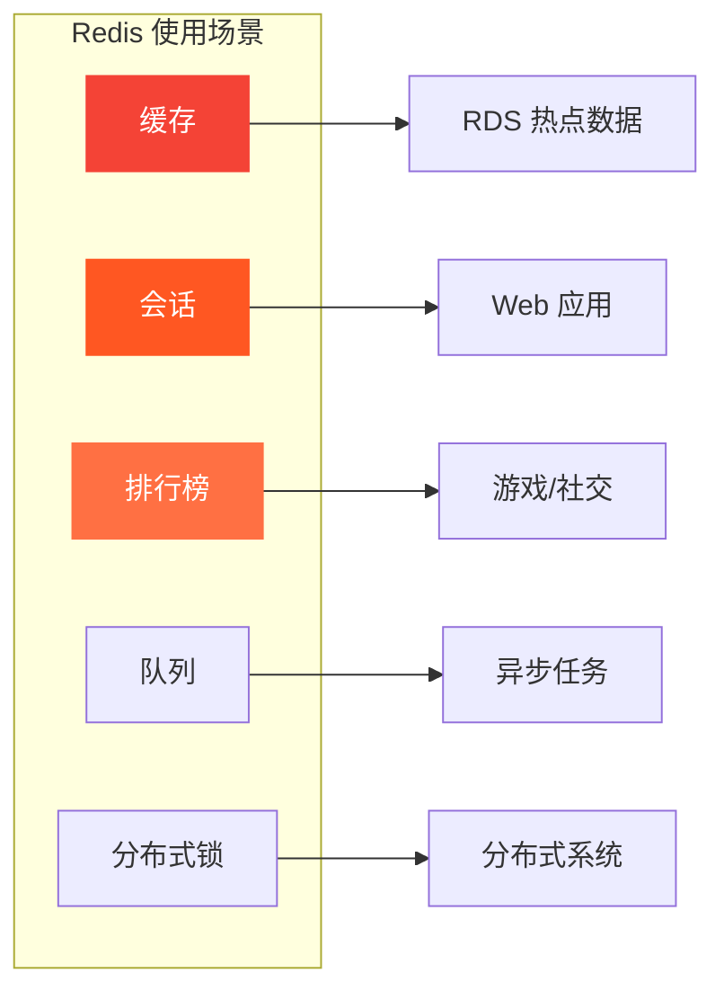
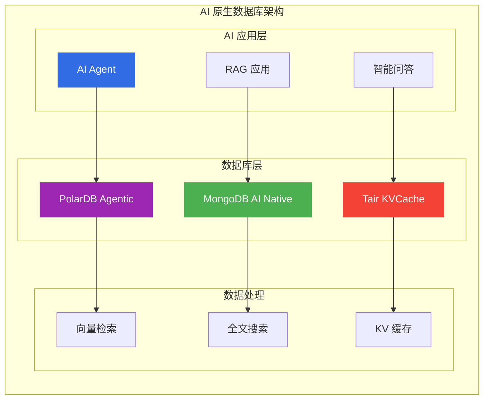
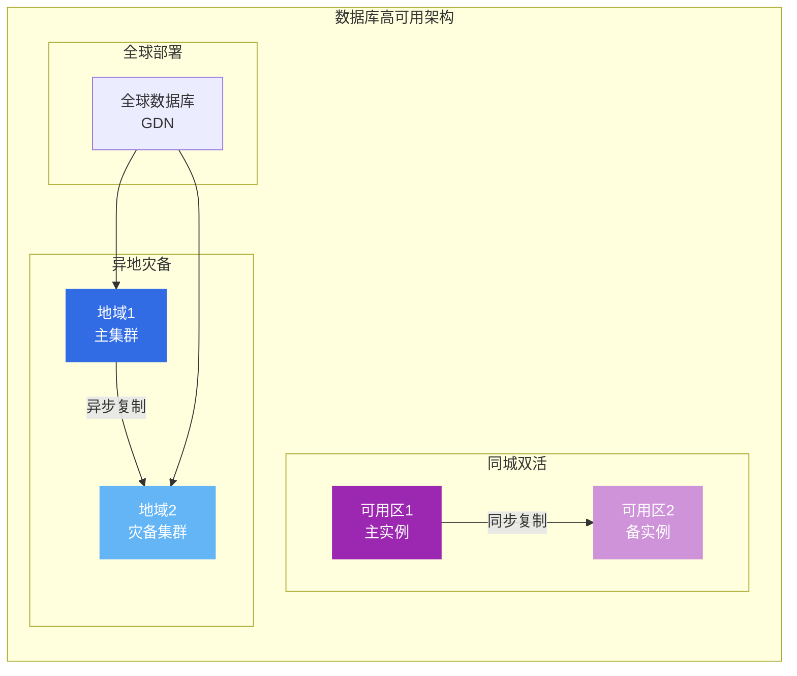

# 阿里云数据库产品选型指南

> 面向架构师的数据库产品选型决策框架，覆盖关系型、NoSQL、数据仓库、缓存等全品类。

## 数据库产品矩阵

---

## 一、产品对比矩阵

### 1.1 关系型数据库对比

| 产品 | 架构 | 扩展方式 | 适用场景 | 成本 |
|------|------|----------|----------|------|
| **RDS** | 主备 | 垂直扩展 | 传统应用、中小规模 | 低 |
| **PolarDB** | 共享存储 | 读写分离 | 高并发、大规模 | 中 |
| **PolarDB-X** | 分布式 | 水平拆分 | 超大规模、全球部署 | 高 |
| **OceanBase** | 分布式 | 水平扩展 | 金融核心、强一致 | 高 |

### 1.2 NoSQL数据库对比

| 产品 | 数据模型 | 适用场景 | 数据结构 | 持久化 |
|------|----------|----------|----------|--------|
| **Redis** | K-V | 缓存、会话、排行榜 | String/Hash/List/Set | RDB/AOF |
| **MongoDB** | 文档 | 内容管理、社交 | JSON文档 | WiredTiger |
| **TableStore** | 宽表 | IoT、日志 | 行列模型 | 自动 |
| **Memcache** | K-V | 简单缓存 | Key-Value | 内存 |

### 1.3 数据仓库对比

| 产品 | 架构 | 适用场景 | 查询延迟 | 成本 |
|------|------|----------|----------|------|
| **AnalyticDB** | MPP | 实时分析、BI | 秒级 | 高 |
| **Hologres** | 实时数仓 | 实时分析、联邦查询 | 秒级 | 高 |
| **MaxCompute** | 离线计算 | 大规模ETL、数据湖 | 分钟级 | 低 |
| **EMR** | Hadoop | Spark、Hive | 分钟级 | 中 |

---

## 二、选型决策树

---

## 三、产品深度分析

### 3.1 云数据库 RDS

**核心定位**: 托管关系型数据库服务

| 引擎 | 版本 | 适用场景 |
|------|------|----------|
| **MySQL** | 5.7/8.0 | Web应用、企业应用 |
| **PostgreSQL** | 11/13/14 | 地理空间、JSON数据 |
| **SQL Server** | 2016/2019 | 企业应用、.NET |
| **MariaDB** | 10.3 | MySQL兼容 |

**高可用架构**:

**选型要点**:
- ✅ 传统应用、中小规模业务
- ✅ 需要MySQL/PostgreSQL/SQL Server
- ✅ 成本敏感、运维简单
- ❌ 超大规模数据(用PolarDB)
- ❌ 需要水平拆分(用PolarDB-X)

---

### 3.2 云原生数据库 PolarDB

**核心定位**: 云原生关系型数据库

**架构特点**:
- 共享存储架构
- 计算存储分离
- 一写多读
- 秒级弹性

**PolarDB vs RDS 对比**:

| 维度 | PolarDB | RDS |
|------|---------|-----|
| **架构** | 共享存储 | 本地存储 |
| **扩展** | 添加只读节点 | 只读实例 |
| **弹性** | 秒级 | 分钟级 |
| **存储** | 按实际使用 | 预分配 |
| **成本** | 中 | 低 |

**选型要点**:
- ✅ 高并发、大规模读多写少
- ✅ 需要快速弹性扩展
- ✅ 想要MySQL/PostgreSQL兼容
- ❌ 成本敏感(用RDS)
- ❌ 需要分布式事务(用PolarDB-X)

---

### 3.3 云数据库 Redis

**核心定位**: 高性能缓存和NoSQL数据库

| 架构 | 适用场景 | 数据可靠性 |
|------|----------|------------|
| **标准版** | 简单缓存 | 低 |
| **集群版** | 大数据量缓存 | 中 |
| **读写分离版** | 读多写少 | 高 |

**Redis 使用场景**:

**选型要点**:
- ✅ 热点数据缓存、会话管理
- ✅ 排行榜、计数器
- ✅ 分布式锁、消息队列
- ❌ 大数据量持久化(用MongoDB)
- ❌ 复杂查询(用RDS)

---

### 3.4 云数据库 MongoDB

**核心定位**: 文档型NoSQL数据库

**使用场景**:
- 内容管理系统(CMS)
- 社交网络、游戏
- 物联网数据
- 移动应用后端

**MongoDB vs TableStore 对比**:

| 维度 | MongoDB | TableStore |
|------|---------|------------|
| **模型** | 文档(JSON) | 宽表 |
| **查询** | 丰富查询语言 | 主键查询 |
| **扩展** | 手动分片 | 自动分片 |
| **成本** | 实例计费 | 按量计费 |
| **适用** | 内容管理 | IoT、日志 |

**选型要点**:
- ✅ 灵活Schema、JSON文档
- ✅ 内容管理、社交应用
- ✅ 需要丰富查询能力
- ❌ 简单K-V(用Redis)
- ❌ 时序数据(用TableStore)

---

### 3.5 AI 原生数据库能力（2025-2026 新特性）

| 产品/特性 | 说明 | 适用场景 |
|-----------|------|----------|
| **PolarDB Agentic Database** | 支持 AI Agent 的数据库，内置向量检索、全文搜索 | AI 应用、RAG |
| **Data Agent** | 数据智能体，支持自然语言查询数据库 | 数据分析、自助查询 |
| **RDS Agent** | 兼容 OpenClaw/Hermes 协议的数据库 Agent | AI 应用集成 |
| **MongoDB 8.3 AI Native** | 原生支持向量搜索、AI 应用集成 | AI 应用、知识库 |
| **Tair KVCache** | 分布式动态分级缓存，AI 推理加速 | LLM 推理、KV 缓存 |
| **Lindorm** | 多模数据库（宽表+时序+搜索+文件） | IoT、监控、日志 |
| **ClickHouse** | 列式分析数据库，实时 OLAP | 日志分析、实时报表 |
| **SelectDB** | 云原生实时数据仓库 | 实时分析、BI |
| **RDS MySQL DuckDB** | DuckDB 分析实例，HTAP 混合负载 | 实时分析、数据探索 |

**AI 原生数据库架构**:

**选型要点**:
- ✅ AI Agent 数据库交互
- ✅ RAG 向量检索
- ✅ LLM 推理 KV 缓存
- ❌ 传统 OLTP 场景(用标准 RDS/PolarDB)

---

## 四、高可用架构设计

### 4.1 数据库高可用方案

### 4.2 数据库备份策略

| 策略 | RPO | RTO | 适用场景 |
|------|-----|-----|----------|
| **自动备份** | 24小时 | 小时级 | 一般业务 |
| **实时备份** | 秒级 | 分钟级 | 核心业务 |
| **跨地域备份** | 小时级 | 小时级 | 灾难恢复 |
| **逻辑备份** | 按需 | 分钟级 | 数据迁移 |

---

## 五、成本优化策略

### 5.1 计费模式选择

| 计费模式 | 适用场景 | 成本节省 |
|----------|----------|----------|
| **包年包月** | 稳定负载 | 30-50% |
| **按量付费** | 测试环境 | 按需使用 |
| **Serverless** | 波动负载 | 按实际使用 |

### 5.2 存储优化

| 优化策略 | 效果 | 适用产品 |
|----------|------|----------|
| **读写分离** | 降低主库压力 | RDS、PolarDB |
| **数据压缩** | 节省存储空间 | MongoDB、TableStore |
| **冷热分离** | 降低存储成本 | 全部产品 |
| **索引优化** | 提升查询性能 | 全部产品 |

---

## 六、架构师面试要点

### 6.1 高频面试题

1. **MySQL vs PostgreSQL 如何选择?**
   - MySQL：Web应用、社区生态
   - PostgreSQL：地理空间、JSON、复杂查询

2. **Redis 缓存穿透/击穿/雪崩如何解决?**
   - 穿透：布隆过滤器、空值缓存
   - 击穿：互斥锁、永不过期
   - 雪崩：随机过期、限流降级

3. **数据库分库分表如何设计?**
   - 分片键选择
   - 跨分片查询
   - 数据迁移

### 6.2 架构决策要点

| 决策维度 | 关键问题 |
|----------|----------|
| **一致性** | 强一致 vs 最终一致 |
| **可用性** | 主备 vs 多活 |
| **扩展性** | 垂直 vs 水平 |
| **成本** | 实例 vs Serverless |

---

## 七、相关文档

- [09-计算产品选型.md](09-计算产品选型.md) — 计算产品对比
- [10-存储产品选型.md](10-存储产品选型.md) — 存储产品对比
- [12-网络产品选型.md](12-网络产品选型.md) — 网络架构设计
- [[18-云厂商/09-阿里云云原生/README.md|阿里云云原生产品全景]] — 全产品线清单

---

> **文档版本**: v1.0  
> **最后更新**: 2026-08-22  
> **适用对象**: 云原生架构师、SRE、技术决策者
