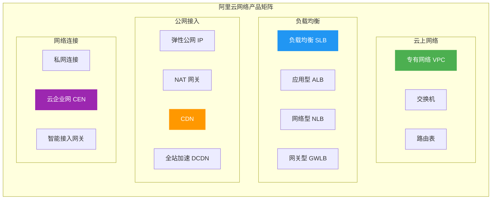
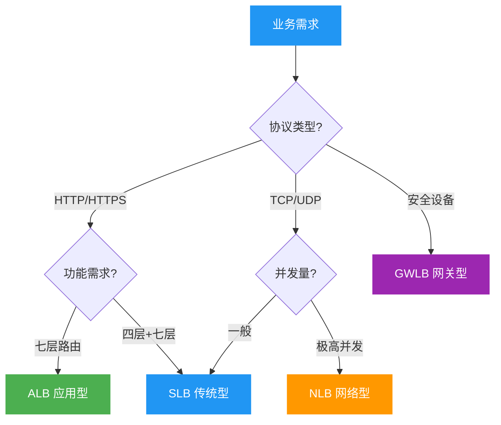
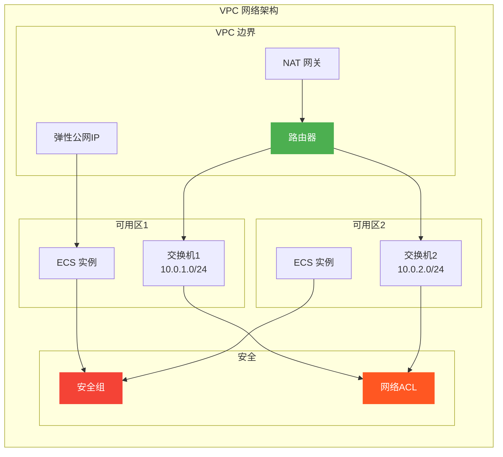
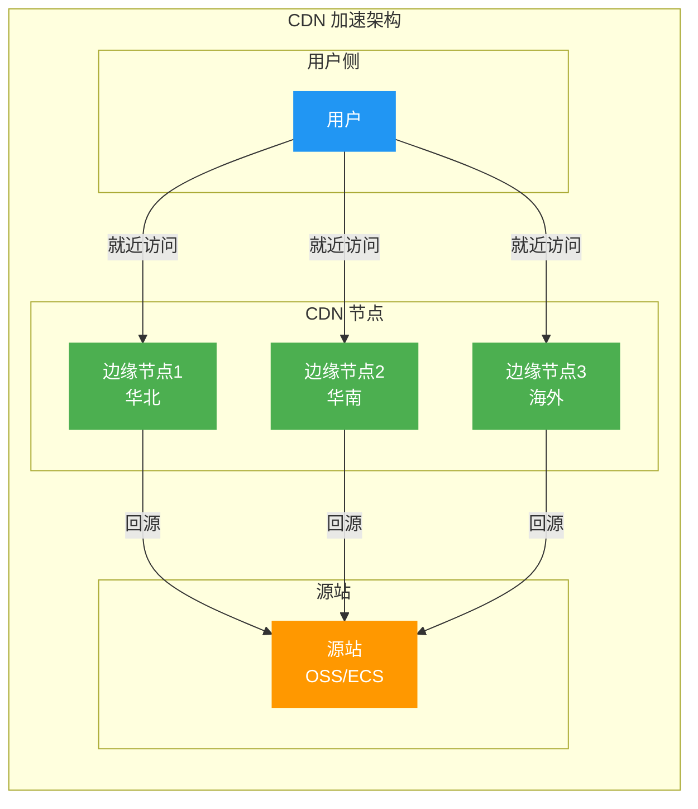
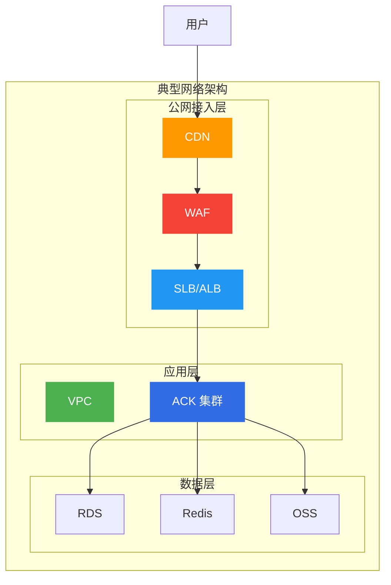
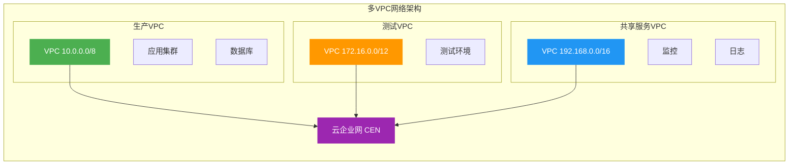
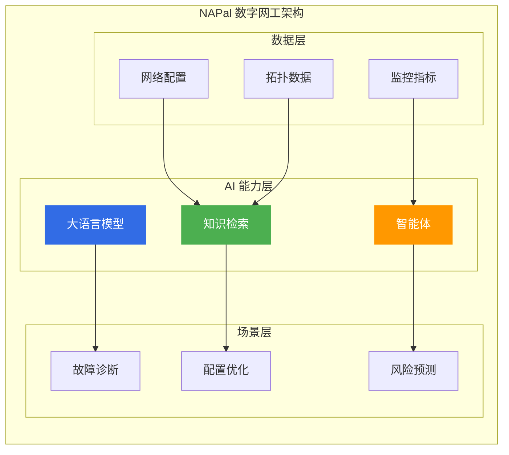

# 阿里云网络产品选型指南

> 面向架构师的网络产品选型决策框架，覆盖 VPC、负载均衡、CDN、NAT 网关等全品类。

## 网络产品矩阵

---

## 一、产品对比矩阵

### 1.1 负载均衡产品对比

| 产品 | 协议层 | 协议支持 | 适用场景 | 性能 |
|------|--------|----------|----------|------|
| **SLB** | 四层/七层 | TCP/UDP/HTTP/HTTPS | 通用负载均衡 | 中 |
| **ALB** | 七层 | HTTP/HTTPS/WebSocket | HTTP流量 | 高 |
| **NLB** | 四层 | TCP/UDP/TLS | 高并发TCP | 极高 |
| **GWLB** | 三层 | IP | 安全设备透明代理 | 高 |

### 1.2 负载均衡选型决策树

---

## 二、产品深度分析

### 2.1 专有网络 VPC

**核心定位**: 隔离的云上私有网络

**VPC 架构组件**:

**VPC 规划最佳实践**:

| 规划项 | 建议 | 原因 |
|--------|------|------|
| **CIDR** | 10.0.0.0/8 或 172.16.0.0/12 | 预留扩展空间 |
| **子网** | 按可用区划分 | 高可用 |
| **路由** | 最小化路由表 | 简化管理 |
| **安全组** | 最小权限原则 | 安全 |

---

### 2.2 负载均衡 SLB/ALB/NLB

**SLB 核心特性**:
- 四层(TCP/UDP)和七层(HTTP/HTTPS)负载均衡
- 健康检查和会话保持
- 证书管理和HTTPS卸载
- 访问控制和限流

**ALB 核心特性**:
- 七层负载均衡
- 基于内容的路由
- WebSocket 支持
- gRPC 支持

**NLB 核心特性**:
- 四层负载均衡
- 超高并发(千万级)
- 超低延迟
- 连接型业务

**负载均衡对比表**:

| 特性 | SLB | ALB | NLB |
|------|-----|-----|-----|
| **协议** | 四/七层 | 七层 | 四层 |
| **并发** | 百万级 | 百万级 | 千万级 |
| **延迟** | 中 | 中 | 低 |
| **路由** | 基础 | 内容路由 | 无 |
| **WebSocket** | 支持 | 优化 | 支持 |
| **gRPC** | 不支持 | 支持 | 支持 |

---

### 2.3 CDN 与边缘

**产品矩阵**:

| 产品 | 定位 | 适用场景 |
|------|------|----------|
| **CDN** | 静态加速 | 网站、下载、点播 |
| **DCDN** | 全站加速 | 动静分离、API加速 |
| **SCDN** | 安全加速 | DDoS防护+CDN |
| **ENS** | 边缘计算 | 低延迟、IoT |

**CDN 加速架构**:

---

### 2.4 NAT 网关

**核心定位**: 网络地址转换服务

**NAT 网关类型**:

| 类型 | 性能 | 适用场景 |
|------|------|----------|
| **公网NAT** | 中 | ECS公网访问 |
| **私网NAT** | 高 | VPC间通信 |

**NAT 网关 vs EIP 对比**:

| 维度 | NAT 网关 | EIP |
|------|----------|-----|
| **IP数量** | 共享 | 独占 |
| **成本** | 低 | 高 |
| **安全** | 高 | 低 |
| **适用** | 多台ECS | 单台ECS |

---

## 三、网络架构设计

### 3.1 典型网络架构

### 3.2 多VPC网络架构

---

## 四、选型决策矩阵

### 4.1 按业务场景选型

| 业务场景 | 推荐产品 | 关键考虑 |
|----------|----------|----------|
| **Web应用** | ALB + CDN | HTTP路由、静态加速 |
| **游戏服务器** | NLB | 高并发、低延迟 |
| **API网关** | ALB + API Gateway | 内容路由、限流 |
| **混合云** | CEN + SAG | 多地域互联 |
| **IoT边缘** | ENS + NLB | 低延迟、就近接入 |

### 4.2 按性能需求选型

| 性能需求 | 推荐产品 | 性能指标 |
|----------|----------|----------|
| **高并发** | NLB | 千万级连接 |
| **低延迟** | NLB | 微秒级延迟 |
| **高吞吐** | SLB | 百Gbps |
| **全球加速** | DCDN + GA | 全球就近接入 |

---

## 五、成本优化策略

### 5.1 带宽优化

| 优化策略 | 效果 | 适用场景 |
|----------|------|----------|
| **共享带宽** | 降低40% | 多EIP场景 |
| **CDN加速** | 降低70% | 静态资源 |
| **NAT网关** | 降低50% | 多ECS公网 |
| **流量包** | 降低30% | 稳定流量 |

### 5.2 计费模式选择

| 计费模式 | 适用场景 | 成本 |
|----------|----------|------|
| **按量付费** | 波动流量 | 按需 |
| **带宽包** | 稳定流量 | 低 |
| **流量包** | 不定流量 | 中 |

---

## 六、网络智能运维（2025-2026 新特性）

### 6.1 NAPal 数字网工

**核心定位**: AI 智能网络运维平台

| 能力 | 说明 | 适用场景 |
|------|------|----------|
| **智能诊断** | AI 自动定位网络故障 | 网络排障 |
| **配置优化** | 自动生成最优配置 | 性能调优 |
| **风险预警** | 提前发现潜在风险 | 主动运维 |
| **知识问答** | 自然语言查询网络知识 | 运维培训 |

**NAPal 架构图**:

### 6.2 AI Agent 网络白皮书

| 白皮书 | 核心内容 | 适用对象 |
|--------|----------|----------|
| **AI Agent 网络白皮书** | Agent 时代网络架构设计 | AI 应用开发者 |
| **具身智能网络白皮书** | 机器人网络低延迟方案 | 机器人厂商 |
| **算力网络白皮书** | 算力调度与网络协同 | 算力服务商 |

### 6.3 网络产品新特性

| 产品/特性 | 说明 | 适用场景 |
|-----------|------|----------|
| **ALB 扩展版** | 支持更多协议和路由规则 | 复杂应用 |
| **CDT 2.0** | 云数据传输服务升级 | 数据迁移 |
| **NAT 网关 10Gbps** | 默认弹性提升至 10Gbps | 高带宽场景 |
| **GA 全球加速** | 全球就近接入优化 | 跨国业务 |

---

## 七、架构师面试要点

### 6.1 高频面试题

1. **SLB vs ALB vs NLB 如何选择?**
   - SLB：四七层混合、传统应用
   - ALB：HTTP路由、内容路由
   - NLB：高并发TCP、游戏服务器

2. **如何设计高可用网络架构?**
   - 多可用区部署
   - 负载均衡冗余
   - CDN加速+容灾

3. **VPC 网络如何规划?**
   - CIDR规划和预留
   - 子网划分策略
   - 路由表设计

### 6.2 架构决策要点

| 决策维度 | 关键问题 |
|----------|----------|
| **性能** | 并发量、延迟、吞吐 |
| **可用性** | 多可用区、容灾 |
| **安全** | WAF、DDoS、ACL |
| **成本** | 带宽、流量、计费模式 |

---

## 七、相关文档

- [09-计算产品选型.md](09-计算产品选型.md) — 计算产品对比
- [13-安全产品选型.md](13-安全产品选型.md) — 安全产品对比
- [[18-云厂商/01-阿里云/公有云-ACK/003-ack-slb-nlb-alb.md|ACK SLB/NLB/ALB]] — 负载均衡详细配置
- [[18-云厂商/09-阿里云云原生/README.md|阿里云云原生产品全景]] — 全产品线清单

---

> **文档版本**: v2.0  
> **最后更新**: 2026-08-23  
> **适用对象**: 云原生架构师、SRE、技术决策者
