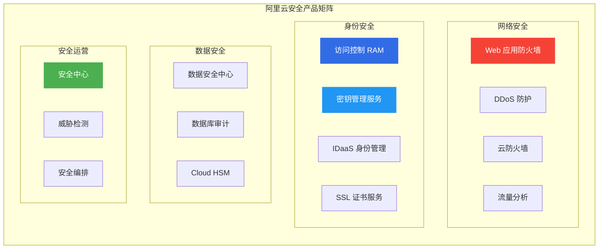
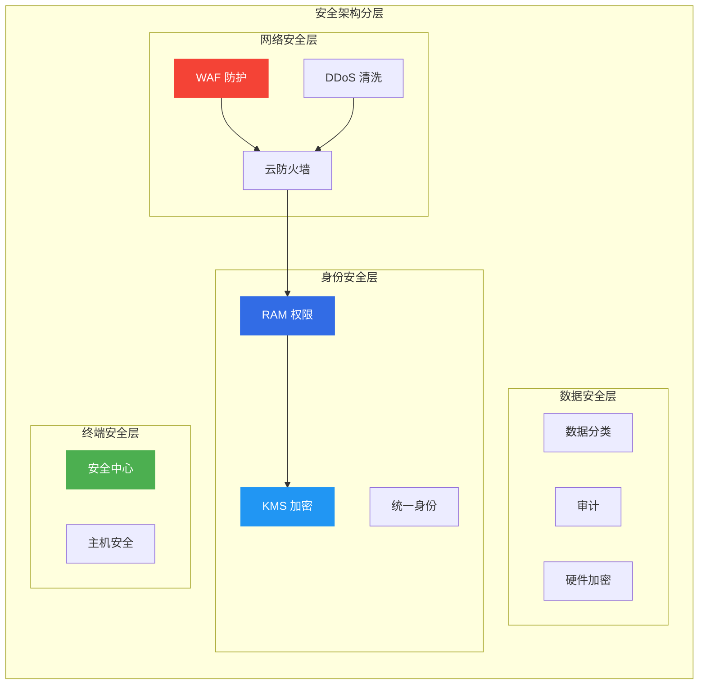
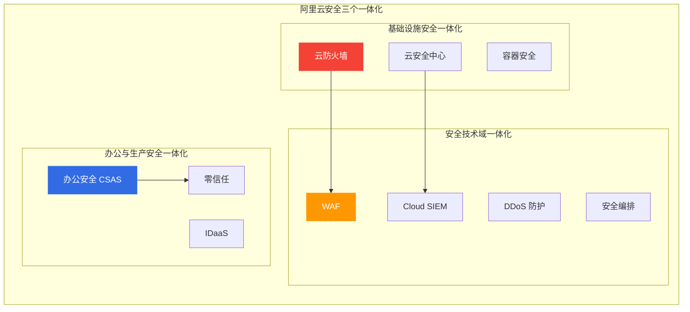
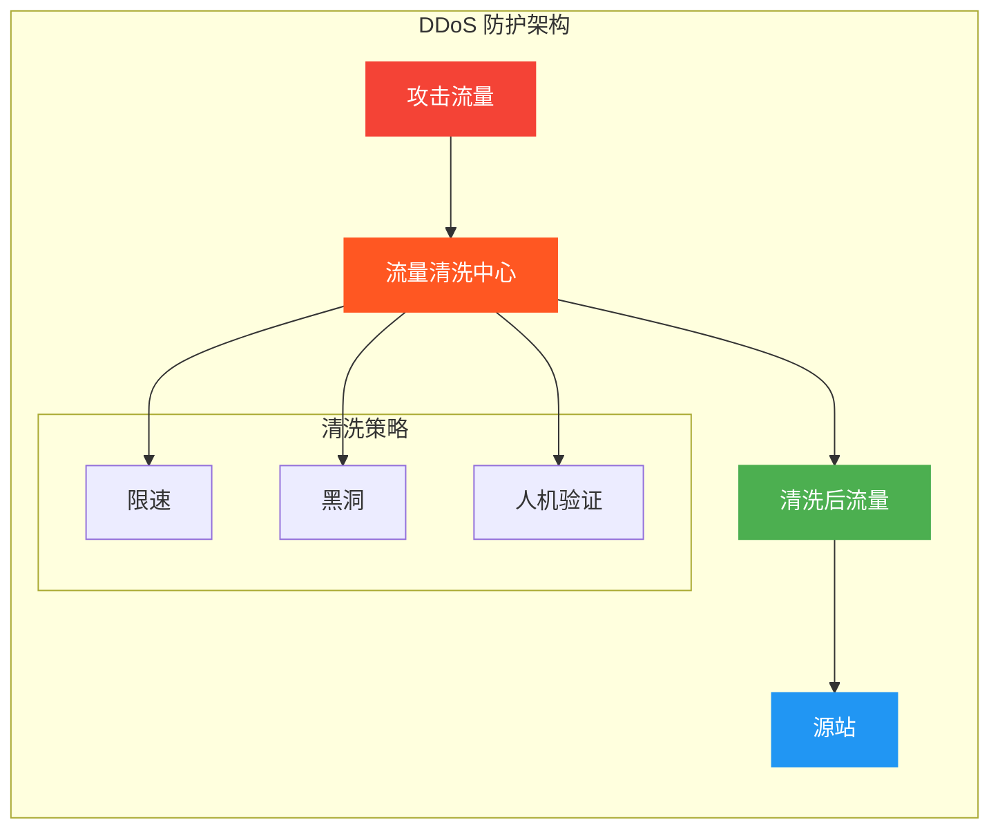
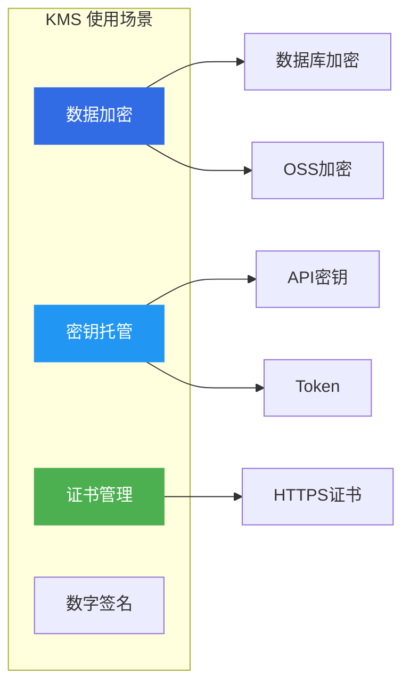
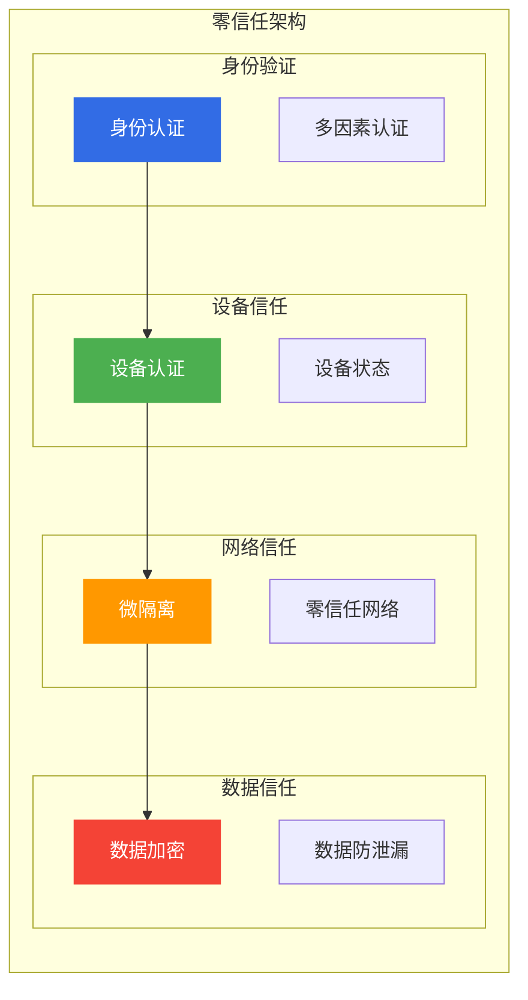
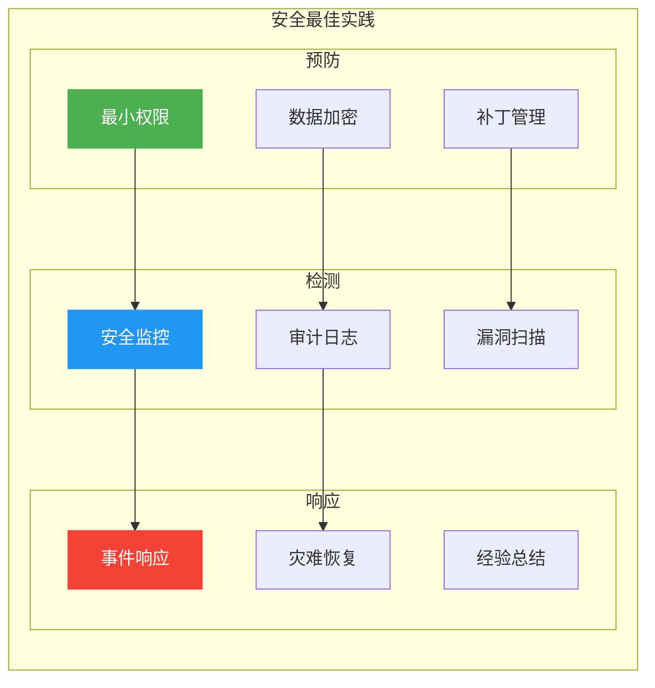

# 阿里云安全产品选型指南

> 面向架构师的安全产品选型决策框架，覆盖网络安全、身份安全、数据安全、安全运营等全品类。

## 安全产品矩阵

---

## 一、安全架构分层

---

## 二、产品深度分析

### 2.1 阿里云安全「三个一体化」战略（2026 最新）

阿里云安全基于多年经验，创新性提出「三体」安全建设思路，将「一体化」贯彻进安全运营中：

| 一体化维度 | 说明 | 核心能力 |
|------------|------|----------|
| **基础设施安全一体化** | 安全能力深度集成到云基础设施 | 云平台原生安全、自动化防护 |
| **安全技术域一体化** | 打通网络安全、主机安全、应用安全 | 统一安全运营、威胁情报共享 |
| **办公与生产安全一体化** | 企业办公网与云上生产网统一防护 | 零信任架构、SASE、统一身份 |

**安全产品全景图**：

---

### 2.2 Web 应用防火墙 WAF

**核心定位**: Web 应用层安全防护

| 防护能力 | 说明 | 适用场景 |
|----------|------|----------|
| **OWASP Top 10** | SQL注入、XSS、CSRF等 | Web应用 |
| **Bot管理** | 爬虫防护、恶意Bot | 电商、API |
| **API安全** | API鉴权、限流 | API网关 |
| **CC攻击** | HTTP Flood防护 | 网站 |

**WAF 部署模式**:

| 模式 | 适用场景 | 特点 |
|------|----------|------|
| **云WAF** | 云上应用 | 简单易用 |
| **独享WAF** | 高安全需求 | 独立资源 |
| **混合云WAF** | 混合架构 | 统一管理 |

**选型要点**:
- ✅ Web应用、API安全
- ✅ 需要OWASP Top 10防护
- ✅ Bot管理和反爬虫
- ❌ 非Web流量(用DDoS)

---

### 2.2 DDoS 防护

**核心定位**: 分布式拒绝服务攻击防护

| 产品 | 防护能力 | 适用场景 |
|------|----------|----------|
| **DDoS基础防护** | 5Gbps | 默认防护 |
| **DDoS高防** | Tbps级 | 大流量攻击 |
| **游戏盾** | 游戏行业 | 游戏服务器 |
| **DDoS原生防护** | 原生防护 | 云上ECS |

**DDoS 防护架构**:

**选型要点**:
- ✅ 大流量攻击防护
- ✅ 游戏、金融等高安全行业
- ✅ 需要Tbps级防护
- ❌ Web应用层攻击(用WAF)

---

### 2.3 访问控制 RAM

**核心定位**: 身份和访问管理

**核心功能**:
- 用户和用户组管理
- 策略和权限管理
- 角色和身份联邦
- 资源授权

**RAM 最佳实践**:

| 实践 | 说明 |
|------|------|
| **最小权限** | 只授予必需权限 |
| **职责分离** | 不同角色不同权限 |
| **多因素认证** | MFA增强安全 |
| **定期审计** | 审查权限和访问 |

**选型要点**:
- ✅ 多租户权限管理
- ✅ 最小权限原则
- ✅ SSO和身份联邦
- ❌ 密钥管理(用KMS)

---

### 2.4 密钥管理服务 KMS

**核心定位**: 密钥托管和加密服务

**核心功能**:
- 密钥生成和管理
- 数据加密/解密
- 密钥轮换
- 证书管理

**KMS 使用场景**:

**选型要点**:
- ✅ 数据加密和密钥管理
- ✅ 合规和金融级加密
- ✅ 证书托管和管理
- ❌ 硬件加密(用Cloud HSM)

---

### 2.5 安全中心

**核心定位**: 统一安全运营中心

**核心能力**:
- 资产安全管理
- 漏洞检测和修复
- 入侵检测和告警
- 基线检查和合规

**安全中心功能矩阵**:

| 功能 | 说明 | 适用场景 |
|------|------|----------|
| **漏洞管理** | 漏洞扫描和修复 | 所有资产 |
| **入侵检测** | 异常行为检测 | 运行时安全 |
| **基线检查** | 安全配置检查 | 合规审计 |
| **威胁情报** | 威胁情报分析 | 高级威胁 |

**选型要点**:
- ✅ 统一安全管理
- ✅ 漏洞和入侵检测
- ✅ 合规和基线检查
- ❌ 高级威胁检测(用威胁检测服务)

---

### 2.7 办公安全 CSAS（2026 新增）

**核心定位**: 企业办公安全访问服务（SASE 架构）

| 能力 | 说明 | 适用场景 |
|------|------|----------|
| **安全访问代理** | 轻量化 Agent 代理内部应用访问 | 远程办公 |
| **就近安全接入** | 全球 POP 接入点就近转发 | 分支机构 |
| **统一身份校验** | 统一管控企业身份体系 | 多云环境 |
| **应用安全管理** | 应用接入和隐身，暴露面收敛 | 零信任 |
| **动态持续分析** | 行为和登录状态动态风险分析 | 高安全需求 |

**选型要点**:
- ✅ 远程办公安全接入
- ✅ 分支机构安全互联
- ✅ 零信任架构落地
- ❌ 传统 VPN 替代方案

---

### 2.8 密评合规安全解决方案（2026 新增）

**核心定位**: 一站式商用密码合规方案

| 阶段 | 服务内容 | 交付物 |
|------|----------|--------|
| **差距分析** | 现有密码应用评估 | 差距分析报告 |
| **方案设计** | 密评合规方案设计 | 技术方案 |
| **建设整改** | 密码产品部署和配置 | 部署文档 |
| **密码测评** | 第三方测评机构测评 | 测评报告 |
| **密评备案** | 密评备案申请 | 备案证书 |

**选型要点**:
- ✅ 等保合规要求
- ✅ 商用密码应用
- ✅ 政企、金融行业
- ❌ 非密评场景(用标准安全产品)

---

## 三、安全架构设计

### 3.1 零信任架构

### 3.2 安全架构层次

| 层次 | 产品 | 防护能力 |
|------|------|----------|
| **网络层** | DDoS + 云防火墙 | 流量清洗、访问控制 |
| **应用层** | WAF + API Gateway | Web攻击、API安全 |
| **身份层** | RAM + IDaaS | 身份认证、权限管理 |
| **数据层** | KMS + DSC | 数据加密、分类分级 |
| **终端层** | 安全中心 | 主机安全、入侵检测 |

---

## 四、选型决策矩阵

### 4.1 按安全需求选型

| 安全需求 | 推荐产品 | 关键考虑 |
|----------|----------|----------|
| **Web安全** | WAF + DDoS | OWASP防护、流量清洗 |
| **身份安全** | RAM + KMS | 权限管理、密钥加密 |
| **数据安全** | DSC + KMS | 数据分类、加密存储 |
| **合规安全** | 安全中心 + 审计 | 基线检查、审计日志 |

### 4.2 按行业选型

| 行业 | 重点安全需求 | 推荐产品 |
|------|--------------|----------|
| **金融** | 强合规、数据加密 | KMS + HSM + 审计 |
| **电商** | Web安全、反爬虫 | WAF + Bot管理 |
| **游戏** | DDoS防护 | 游戏盾 + 高防 |
| **政企** | 等保合规 | 安全中心 + 堡垒机 |

---

## 五、合规与认证

### 5.1 合规认证

| 认证 | 说明 | 适用行业 |
|------|------|----------|
| **等保三级/四级** | 信息安全等级保护 | 政企、金融 |
| **ISO 27001** | 信息安全管理体系 | 所有行业 |
| **PCI DSS** | 支付卡行业标准 | 金融、电商 |
| **SOC 2** | 服务组织控制 | SaaS服务商 |

### 5.2 安全最佳实践

---

## 六、成本优化策略

### 6.1 安全产品计费

| 产品 | 计费模式 | 成本优化 |
|------|----------|----------|
| **WAF** | 按域名/请求量 | 选择合适规格 |
| **DDoS** | 按防护峰值 | 弹性防护 |
| **KMS** | 按密钥数量 | 密钥复用 |
| **安全中心** | 按资产数量 | 按需开通 |

---

## 七、架构师面试要点

### 7.1 高频面试题

1. **如何设计安全架构?**
   - 纵深防御：多层防护
   - 最小权限：权限最小化
   - 零信任：持续验证

2. **WAF vs DDoS 如何选择?**
   - WAF：应用层攻击
   - DDoS：流量层攻击
   - 通常组合使用

3. **数据加密方案如何设计?**
   - 传输加密：HTTPS/TLS
   - 存储加密：KMS托管
   - 密钥管理：轮换策略

### 7.2 架构决策要点

| 决策维度 | 关键问题 |
|----------|----------|
| **合规** | 等保、ISO、PCI |
| **风险** | 威胁评估、漏洞管理 |
| **成本** | 安全投入、ROI |
| **运维** | 安全运营、事件响应 |

---

## 八、相关文档

- [12-网络产品选型.md](12-网络产品选型.md) — 网络架构设计
- [15-中间件产品选型.md](15-中间件产品选型.md) — 中间件选型
- [[18-云厂商/09-阿里云云原生/README.md|阿里云云原生产品全景]] — 全产品线清单

---

> **文档版本**: v1.0  
> **最后更新**: 2026-08-22  
> **适用对象**: 云原生架构师、SRE、技术决策者
