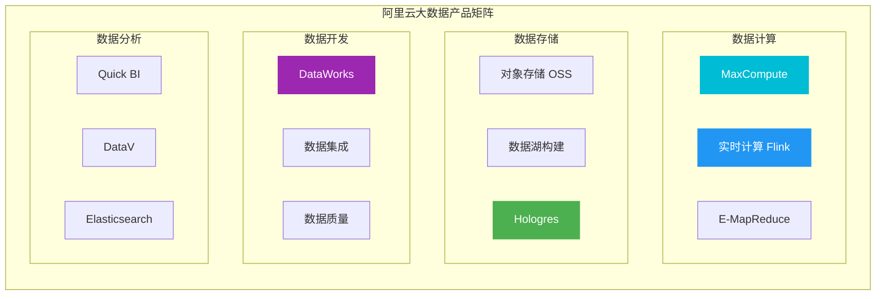
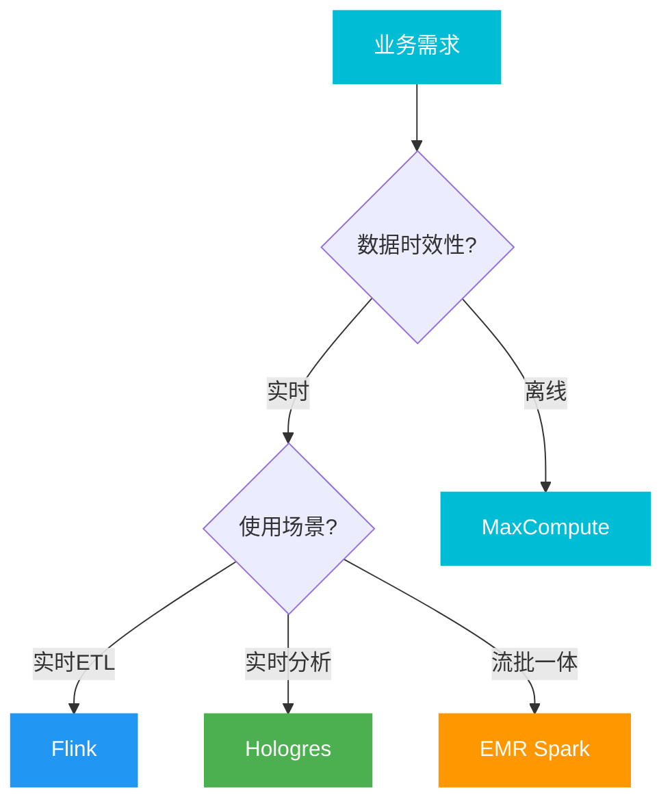
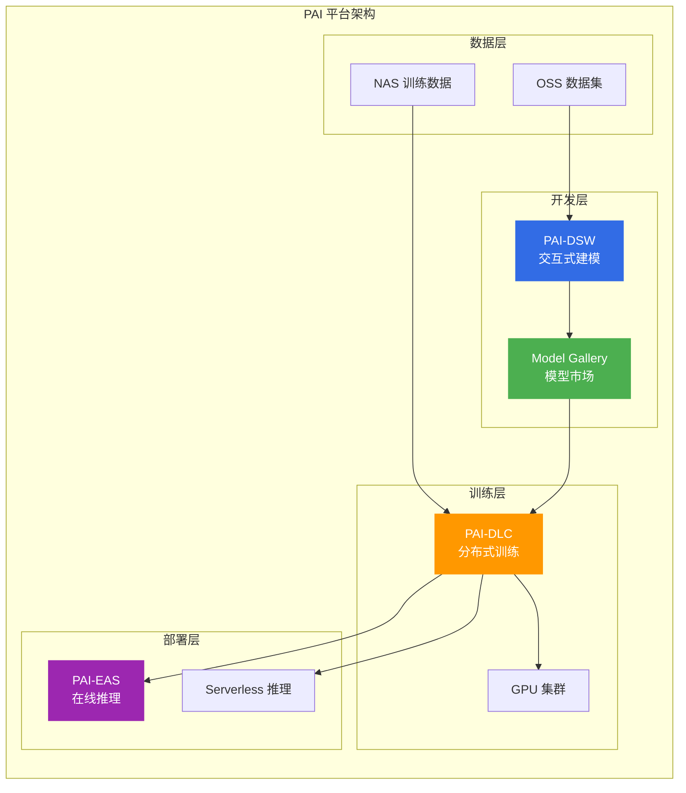
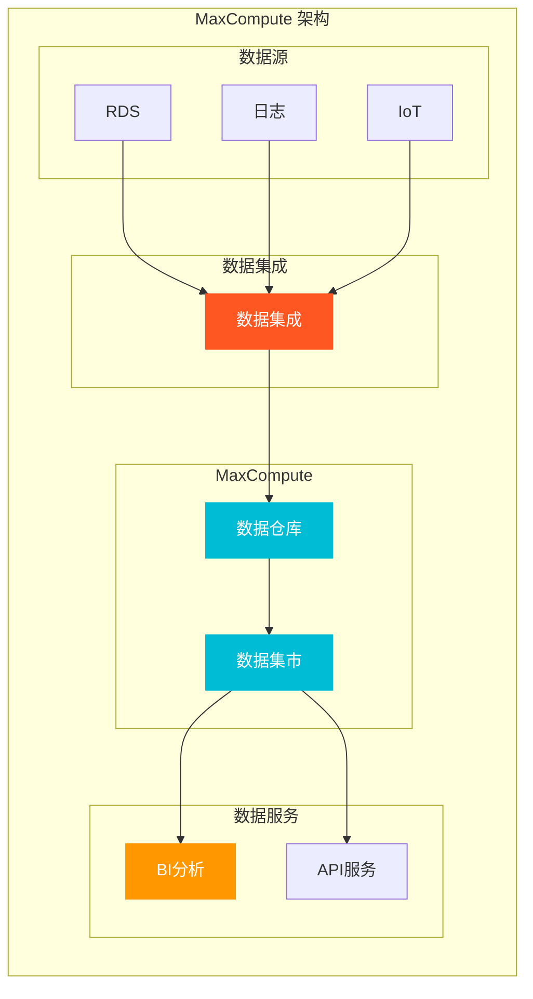
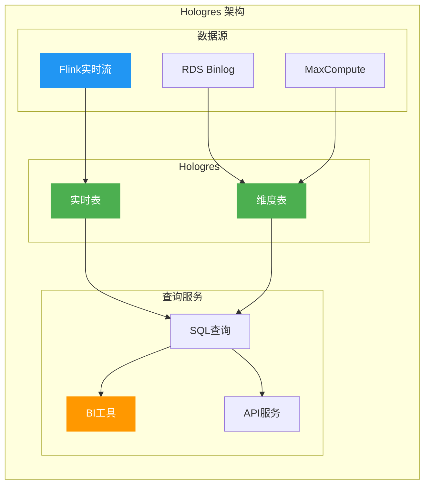
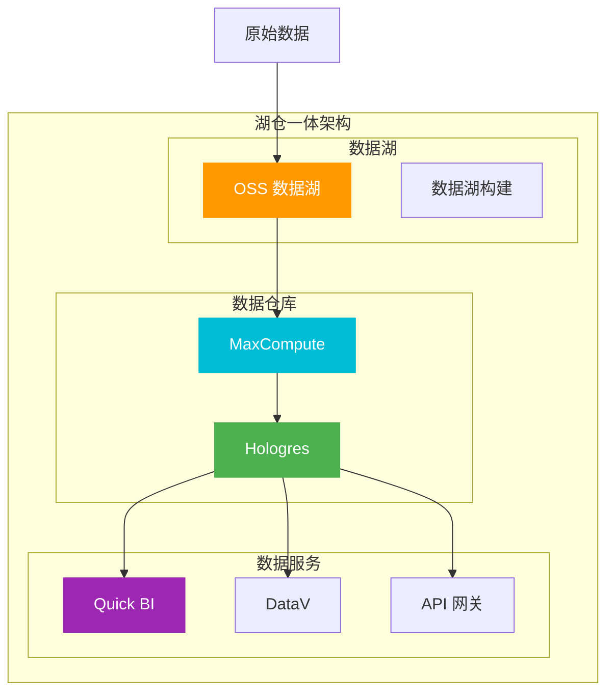
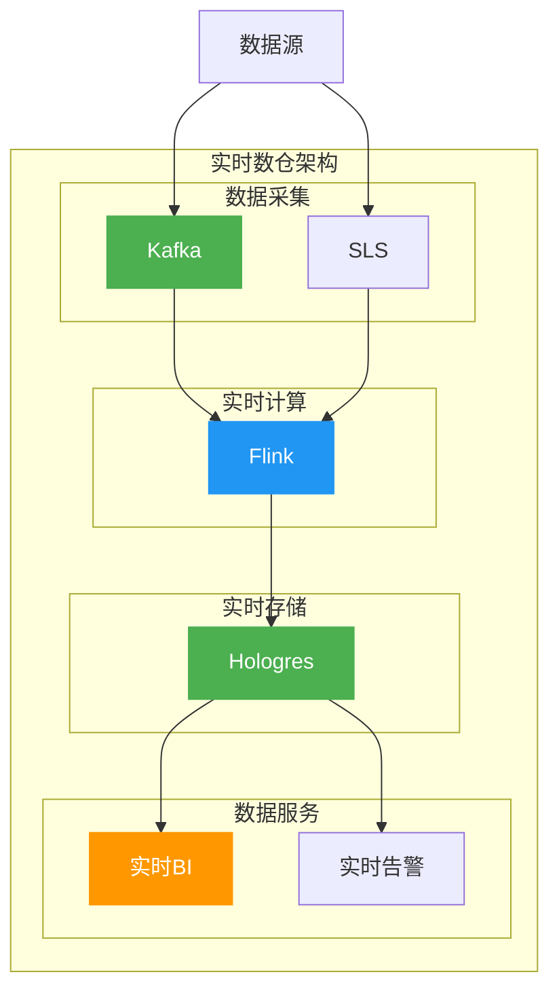

# 阿里云大数据产品选型指南

> 面向架构师的大数据产品选型决策框架，覆盖离线计算、实时计算、数据仓库、数据分析等全品类。

## 大数据产品矩阵

---

## 一、产品对比矩阵

### 1.1 数据计算产品对比

| 产品 | 计算类型 | 延迟 | 适用场景 | 成本 |
|------|----------|------|----------|------|
| **MaxCompute** | 离线批量 | 分钟级 | 数据仓库、ETL | 低 |
| **Flink** | 实时流 | 秒级 | 实时ETL、CEP | 中 |
| **EMR** | 批流一体 | 分钟/秒级 | Spark、Hive | 中 |
| **Hologres** | 实时分析 | 秒级 | 实时OLAP | 高 |

### 1.2 数据计算选型决策树

---

## 二、产品深度分析

### 2.1 人工智能平台 PAI（2025-2026 新增重点）

**核心定位**: AI Native 的大模型与 AIGC 工程平台

**核心能力**:

| 模块 | 功能 | 适用场景 |
|------|------|----------|
| **PAI-Model Gallery** | 内置 100+ 种大模型最佳实践 | 模型部署 |
| **PAI-DSW** | 交互式建模开发环境 | 模型开发 |
| **PAI-DLC** | 分布式训练服务 | 模型训练 |
| **PAI-EAS** | 模型在线推理服务 | 模型部署 |

**已接入大模型**（2026 最新）:
- Qwen3 全尺寸模型（235B、30B MoE + 32B、14B、8B、4B、1.7B、0.6B Dense）
- DeepSeek-R1、QWQ-32B 等主流开源大模型

**PAI 架构**:

**选型要点**:
- ✅ 大模型一键部署
- ✅ 分布式训练
- ✅ 模型推理服务
- ❌ 非 AI 场景(用标准大数据产品)

---

### 2.2 MaxCompute

**核心定位**: 大规模数据仓库和ETL服务

**核心特性**:
- PB级数据处理能力
- SQL/MR/Graph计算模型
- 丰富的UDF支持
- 数据仓库分层

**MaxCompute 架构**:

**选型要点**:
- ✅ 大规模数据仓库
- ✅ 离线ETL和数据处理
- ✅ 成本敏感的大数据分析
- ❌ 实时计算(用Flink)
- ❌ 交互式查询(用Hologres)

---

### 2.2 实时计算 Flink

**核心定位**: 实时流计算服务

**核心特性**:
- 毫秒级延迟
- Exactly-Once语义
- 流批一体
- 丰富的Connector

**Flink 使用场景**:

| 场景 | 说明 | 延迟要求 |
|------|------|----------|
| **实时ETL** | 数据清洗和转换 | 秒级 |
| **实时分析** | 实时报表和指标 | 秒级 |
| **CEP** | 复杂事件处理 | 毫秒级 |
| **实时风控** | 风险识别 | 毫秒级 |

**Flink vs Spark Streaming 对比**:

| 维度 | Flink | Spark Streaming |
|------|-------|-----------------|
| **模型** | 真正流处理 | 微批处理 |
| **延迟** | 毫秒级 | 秒级 |
| **语义** | Exactly-Once | Exactly-Once |
| **状态** | 内置状态管理 | 需要外部存储 |

**选型要点**:
- ✅ 实时数据处理
- ✅ 流式ETL和数据集成
- ✅ 实时监控和告警
- ❌ 离线批处理(用MaxCompute)

---

### 2.3 Hologres

**核心定位**: 实时数据仓库服务

**核心特性**:
- 实时写入和查询
- PostgreSQL兼容
- 联邦查询
- 向量化执行

**Hologres 架构**:

**选型要点**:
- ✅ 实时OLAP分析
- ✅ 实时报表和仪表盘
- ✅ 联邦查询多数据源
- ❌ 大规模离线计算(用MaxCompute)

---

### 2.4 DataWorks

**核心定位**: 数据开发和治理平台

**核心功能**:
- 数据集成
- 数据开发
- 数据治理
- 数据服务

**DataWorks 功能矩阵**:

| 功能 | 说明 | 适用场景 |
|------|------|----------|
| **数据集成** | 离线/实时同步 | 数据搬运 |
| **数据开发** | SQL/Spark/Flink | 数据处理 |
| **数据治理** | 质量/安全/成本 | 数据管理 |
| **数据服务** | API/数据服务 | 数据应用 |

**选型要点**:
- ✅ 数据仓库开发
- ✅ 数据治理和质量
- ✅ 数据服务和API
- ❌ 纯实时计算(用Flink)

---

## 三、大数据架构设计

### 3.1 湖仓一体架构

### 3.2 实时数仓架构

---

## 四、选型决策矩阵

### 4.1 按业务场景选型

| 业务场景 | 推荐产品 | 关键考虑 |
|----------|----------|----------|
| **数据仓库** | MaxCompute + DataWorks | 大规模、成本低 |
| **实时分析** | Flink + Hologres | 低延迟、实时 |
| **BI报表** | Hologres + Quick BI | 交互式、可视化 |
| **数据湖** | OSS + MaxCompute | 海量存储、批处理 |
| **日志分析** | SLS + Elasticsearch | 实时采集、检索 |

### 4.2 按数据量选型

| 数据量 | 推荐产品 | 架构 |
|--------|----------|------|
| **TB级** | MaxCompute | 单集群 |
| **PB级** | MaxCompute + OSS | 湖仓一体 |
| **实时** | Flink + Hologres | 流式架构 |

---

## 五、成本优化策略

### 5.1 计费模式选择

| 产品 | 计费模式 | 成本优化 |
|------|----------|----------|
| **MaxCompute** | 按量/包年 | 预购CU |
| **Flink** | 按CU计费 | 弹性伸缩 |
| **Hologres** | 按实例 | Serverless |
| **DataWorks** | 按功能 | 按需开通 |

### 5.2 存储优化

| 优化策略 | 效果 | 适用产品 |
|----------|------|----------|
| **列式存储** | 压缩比高 | MaxCompute |
| **分区表** | 查询快 | 全部产品 |
| **生命周期** | 自动清理 | OSS、Hologres |

---

## 六、架构师面试要点

### 6.1 高频面试题

1. **离线和实时如何选型?**
   - 离线：T+1报表、历史分析
   - 实时：实时监控、实时推荐
   - Lambda架构：离线+实时结合

2. **数据仓库如何分层?**
   - ODS：原始数据层
   - DWD：明细数据层
   - DWS：汇总数据层
   - ADS：应用数据层

3. **数据湖 vs 数据仓库?**
   - 数据湖：原始数据、Schema-on-Read
   - 数据仓库：结构化、Schema-on-Write
   - 湖仓一体：两者优势结合

### 6.2 架构决策要点

| 决策维度 | 关键问题 |
|----------|----------|
| **时效性** | 实时 vs 离线 |
| **数据量** | TB vs PB |
| **成本** | 计算 vs 存储 |
| **生态** | Hadoop vs 云原生 |

---

## 七、相关文档

- [09-计算产品选型.md](09-计算产品选型.md) — 计算产品对比
- [10-存储产品选型.md](10-存储产品选型.md) — 存储产品对比
- [15-中间件产品选型.md](15-中间件产品选型.md) — 中间件选型
- [[18-云厂商/09-阿里云云原生/README.md|阿里云云原生产品全景]] — 全产品线清单

---

> **文档版本**: v1.0  
> **最后更新**: 2026-08-22  
> **适用对象**: 云原生架构师、SRE、技术决策者
