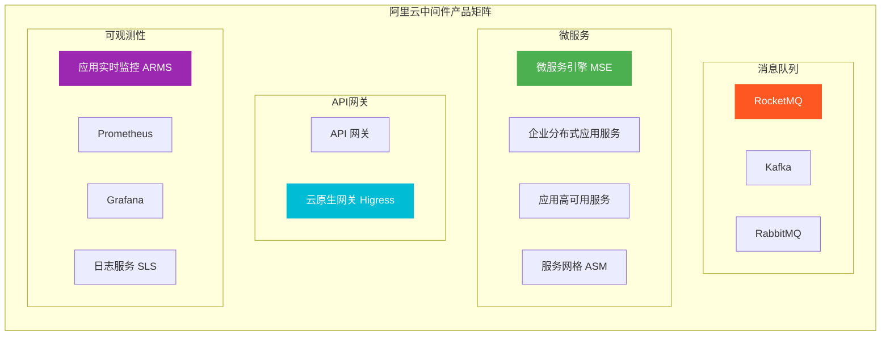
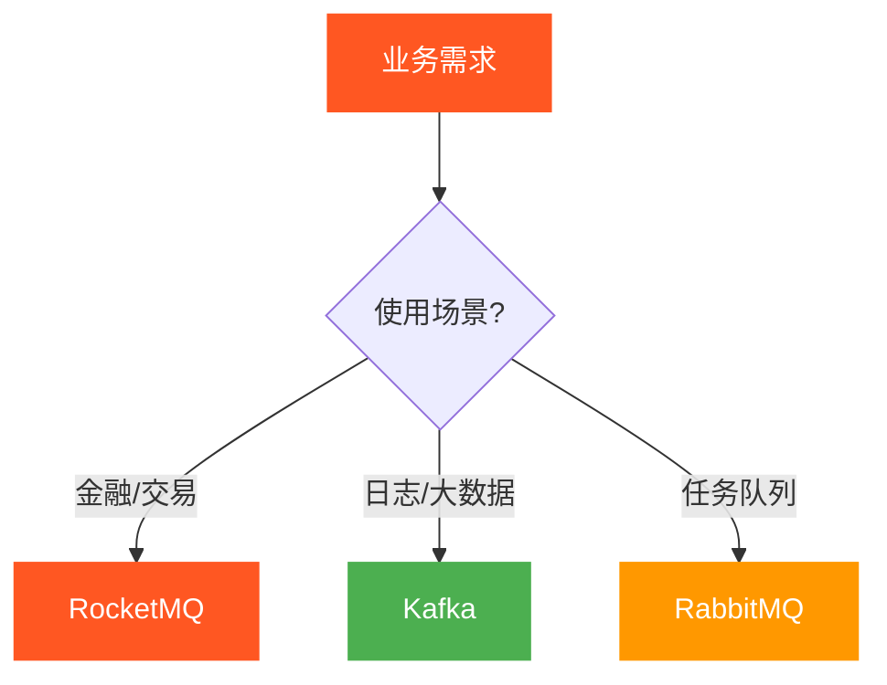
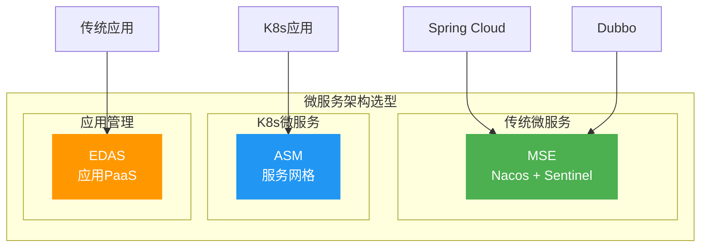
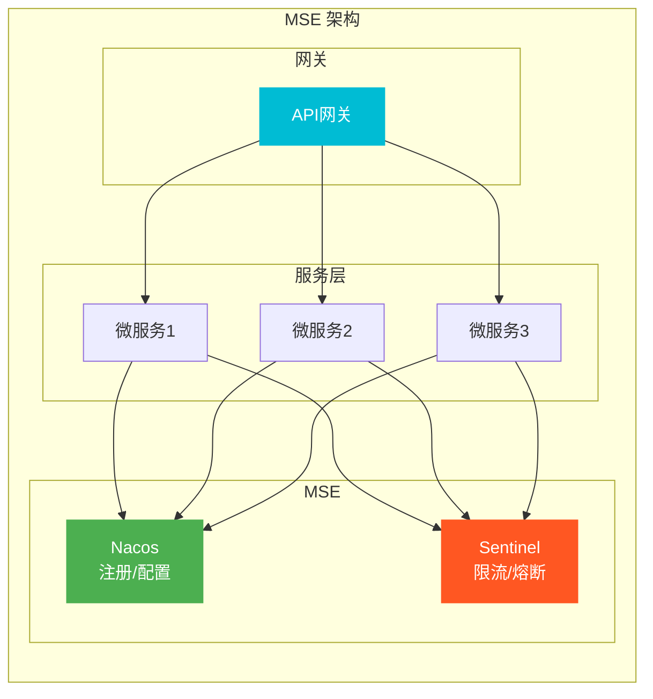
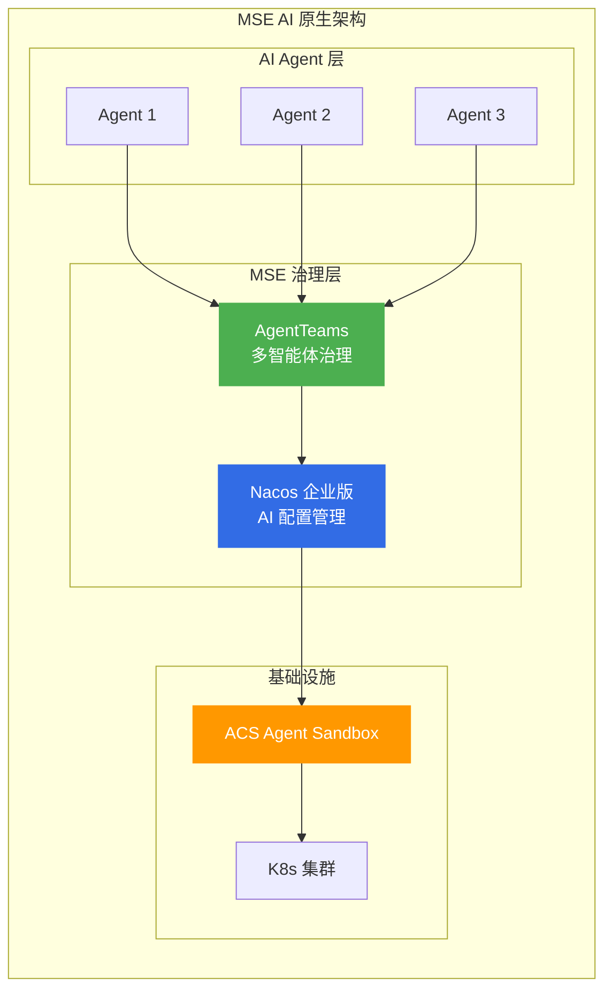
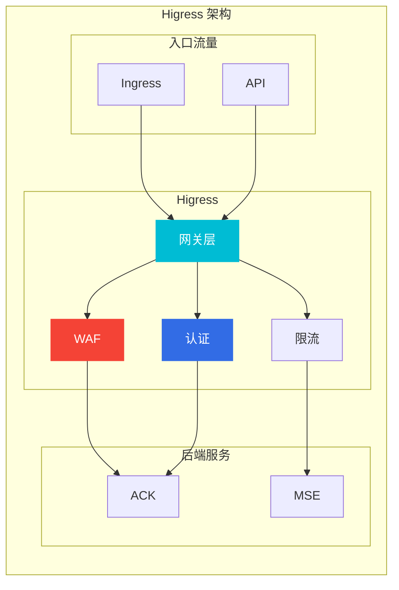
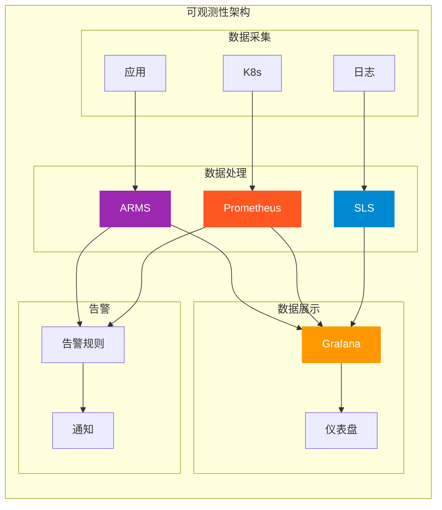

# 阿里云中间件产品选型指南

> 面向架构师的中间件产品选型决策框架，覆盖消息队列、微服务、API网关、可观测性等全品类。

## 中间件产品矩阵

---

## 一、消息队列产品对比

### 1.1 核心维度对比

| 产品 | 协议 | 吞吐量 | 延迟 | 适用场景 |
|------|------|--------|------|----------|
| **RocketMQ** | 自定义 | 极高 | 毫秒级 | 金融、交易 |
| **Kafka** | Kafka | 极高 | 毫秒级 | 日志、大数据 |
| **RabbitMQ** | AMQP | 中 | 微秒级 | 任务队列 |

### 1.2 消息队列选型决策树

---

## 二、消息队列深度分析

### 2.1 RocketMQ

**核心定位**: 高可靠消息中间件

**核心特性**:
- 事务消息
- 延迟消息
- 顺序消息
- 消息回溯

**RocketMQ 使用场景**:

| 场景 | 说明 | 特性要求 |
|------|------|----------|
| **交易系统** | 订单、支付 | 事务消息 |
| **实时通知** | 推送、短信 | 延迟消息 |
| **数据同步** | 数据库同步 | 顺序消息 |
| **事件驱动** | 业务解耦 | 高可靠 |

**选型要点**:
- ✅ 金融级消息可靠性
- ✅ 事务消息支持
- ✅ 顺序消息
- ❌ 大数据日志采集(用Kafka)

---

### 2.2 Kafka

**核心定位**: 分布式流处理平台

**核心特性**:
- 超高吞吐
- 持久化存储
- 流处理能力
- 丰富的生态

**Kafka 使用场景**:

| 场景 | 说明 | 特性要求 |
|------|------|----------|
| **日志收集** | 应用日志 | 高吞吐 |
| **流处理** | 实时ETL | 流式处理 |
| **数据管道** | 数据同步 | 持久化 |
| **事件溯源** | 事件存储 | 回溯能力 |

**选型要点**:
- ✅ 大数据日志和流处理
- ✅ 超高吞吐场景
- ✅ 与大数据生态集成
- ❌ 需要事务消息(用RocketMQ)

---

### 2.3 RabbitMQ

**核心定位**: 企业级消息中间件

**核心特性**:
- AMQP协议
- 灵活路由
- 管理界面
- 插件生态

**选型要点**:
- ✅ 企业应用集成
- ✅ 任务队列
- ✅ 需要AMQP协议
- ❌ 高吞吐场景(用Kafka)

---

## 三、微服务产品对比

### 3.1 核心产品矩阵

| 产品 | 定位 | 核心能力 | 适用场景 |
|------|------|----------|----------|
| **MSE** | 微服务引擎 | Nacos、Sentinel | Spring Cloud/Dubbo |
| **EDAS** | 应用PaaS | 应用管理、灰度 | 企业应用 |
| **AHAS** | 高可用 | 限流、熔断、演练 | 故障防护 |
| **ASM** | 服务网格 | 流量治理 | K8s微服务 |

### 3.2 微服务架构选型

---

## 四、微服务深度分析

### 4.1 微服务引擎 MSE

**核心定位**: 全托管微服务引擎

**核心组件**:

| 组件 | 功能 | 说明 |
|------|------|------|
| **Nacos** | 注册中心 | 服务注册发现 |
| **Nacos** | 配置中心 | 动态配置管理 |
| **Sentinel** | 限流降级 | 流量防护 |
| **Seata** | 分布式事务 | 事务一致性 |

**MSE 架构**:

**选型要点**:
- ✅ Spring Cloud/Dubbo应用
- ✅ 需要注册中心和配置中心
- ✅ 需要限流降级能力
- ❌ K8s原生微服务(用ASM)

---

### 4.2 MSE AI 原生能力（2025-2026 新特性）

| 特性 | 说明 | 适用场景 |
|------|------|----------|
| **AgentTeams** | 多智能体治理与协作平台（内测） | AI Agent 编排 |
| **Nacos 企业版 AI** | 全面拥抱 AI，支持 MCP Server 注册管理 | AI 应用配置 |
| **AI 任务调度** | 集成 ACS Agent Sandbox，支持 AI 任务调度 | AI 工作流 |
| **ZooKeeper 企业版** | SLA 达 99.99%，整体服务性能提升 100% | 分布式协调 |

**MSE AI 原生架构**：

**选型要点**:
- ✅ AI Agent 多智能体协作
- ✅ MCP Server 注册管理
- ✅ AI 任务调度
- ❌ 传统微服务(用标准 MSE)

---

### 4.2 服务网格 ASM

**核心定位**: 托管式服务网格

**核心能力**:
- 流量管理
- 安全策略
- 可观测性
- 故障注入

**ASM vs MSE 对比**:

| 维度 | ASM | MSE |
|------|-----|-----|
| **架构** | Sidecar代理 | SDK集成 |
| **侵入性** | 无侵入 | 需要SDK |
| **语言无关** | 是 | 需要SDK |
| **性能** | 略低 | 高 |
| **适用** | K8s原生 | 传统微服务 |

**选型要点**:
- ✅ K8s原生微服务
- ✅ 多语言微服务
- ✅ 无侵入治理
- ❌ 非K8s环境(用MSE)

---

## 五、API网关产品对比

### 5.1 核心产品对比

| 产品 | 定位 | 核心能力 | 适用场景 |
|------|------|----------|----------|
| **API网关** | 传统网关 | API管理、鉴权 | 传统应用 |
| **Higress** | 云原生网关 | 三合一网关 | K8s原生 |

### 5.2 云原生网关 Higress

**核心定位**: 流量网关 + 微服务网关 + 安全网关 三合一

**核心特性**:
- 兼容Nginx/Ingress
- 内置WAF能力
- 动态配置
- 插件扩展

**Higress 架构**:

**选型要点**:
- ✅ K8s原生API网关
- ✅ 需要WAF+网关合一
- ✅ 兼容Nginx配置
- ❌ 非K8s环境(用传统API网关)

---

## 六、可观测性产品对比

### 6.1 产品矩阵

| 产品 | 类型 | 定位 | 适用场景 |
|------|------|------|----------|
| **ARMS** | APM | 应用监控 | Java应用 |
| **Prometheus** | 指标 | 指标监控 | K8s、自定义 |
| **Grafana** | 可视化 | 仪表盘 | 数据展示 |
| **SLS** | 日志 | 日志平台 | 日志采集分析 |
| **Tracing** | 链路 | 分布式追踪 | 调用链分析 |

### 6.2 可观测性架构

---

## 七、选型决策矩阵

### 7.1 按业务场景选型

| 业务场景 | 推荐产品 | 关键考虑 |
|----------|----------|----------|
| **金融交易** | RocketMQ + MSE | 事务消息、高可靠 |
| **大数据** | Kafka + Flink | 高吞吐、流处理 |
| **微服务** | MSE + Higress | 注册中心、网关 |
| **K8s原生** | ASM + Higress | 服务网格、无侵入 |
| **可观测** | ARMS + SLS | APM、日志分析 |

### 7.2 按技术栈选型

| 技术栈 | 推荐产品 | 原因 |
|--------|----------|------|
| **Spring Cloud** | MSE | Nacos、Sentinel |
| **Dubbo** | MSE | Dubbo治理 |
| **K8s** | ASM | 服务网格 |
| **传统应用** | EDAS | 应用PaaS |

---

## 八、成本优化策略

### 8.1 计费模式选择

| 产品 | 计费模式 | 成本优化 |
|------|----------|----------|
| **RocketMQ** | 按消息量 | 消息压缩 |
| **Kafka** | 按实例 | 预留实例 |
| **MSE** | 按实例 | 按需规格 |
| **ARMS** | 按调用 | 采样率 |

---

## 九、架构师面试要点

### 9.1 高频面试题

1. **RocketMQ vs Kafka 如何选择?**
   - RocketMQ：金融级可靠性、事务消息
   - Kafka：大数据生态、高吞吐

2. **微服务治理如何设计?**
   - 注册中心：Nacos
   - 配置中心：Nacos
   - 限流熔断：Sentinel
   - 服务网格：ASM

3. **可观测性体系如何建设?**
   - 指标：Prometheus
   - 日志：SLS
   - 链路：Tracing
   - 告警：统一告警平台

### 9.2 架构决策要点

| 决策维度 | 关键问题 |
|----------|----------|
| **可靠性** | 消息不丢失、服务高可用 |
| **性能** | 吞吐量、延迟 |
| **成本** | 消息量、实例规格 |
| **生态** | 技术栈兼容性 |

---

## 十、相关文档

- [09-计算产品选型.md](09-计算产品选型.md) — 计算产品对比
- [13-安全产品选型.md](13-安全产品选型.md) — 安全产品对比
- [[18-云厂商/01-阿里云/公有云-ACK/003-ack-slb-nlb-alb.md|ACK SLB/NLB/ALB]] — 负载均衡配置
- [[18-云厂商/09-阿里云云原生/README.md|阿里云云原生产品全景]] — 全产品线清单

---

> **文档版本**: v1.0  
> **最后更新**: 2026-08-22  
> **适用对象**: 云原生架构师、SRE、技术决策者
