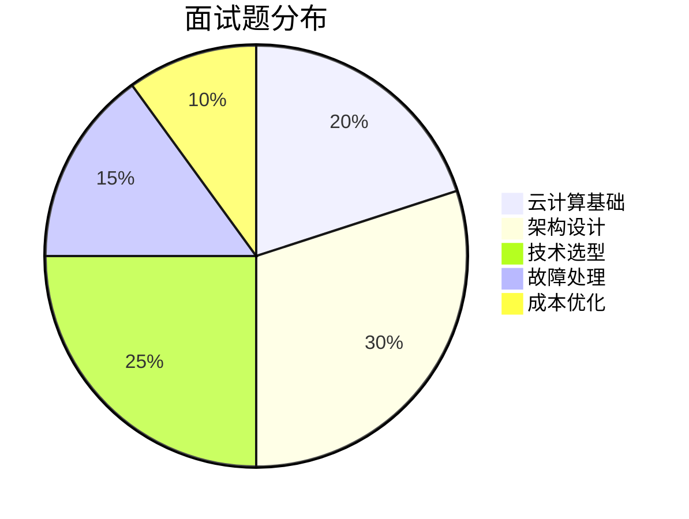

# 阿里云架构师面试题库

> 面向架构师的面试题库，从基础概念、架构设计、技术选型三个维度构建全面的面试准备体系。

## 面试题分布

---

## 一、云计算基础

### 1.1 云服务模型

**Q1: IaaS、PaaS、SaaS 的区别?**

| 模型 | 全称 | 控制层 | 阿里云产品 |
|------|------|--------|------------|
| **IaaS** | Infrastructure as a Service | 基础设施 | ECS、VPC |
| **PaaS** | Platform as a Service | 平台服务 | RDS、ACK |
| **SaaS** | Software as a Service | 应用服务 | 钉钉、云效 |

**Q2: 云计算核心优势?**

| 优势 | 说明 | 示例 |
|------|------|------|
| **弹性伸缩** | 按需扩缩容 | AS 弹性伸缩 |
| **按需付费** | 按使用量付费 | 按量计费 |
| **高可用** | 多可用区部署 | 多 AZ |
| **全球部署** | 全球区域覆盖 | 全球加速 |

### 1.2 阿里云产品体系

**Q3: 阿里云核心产品分类?**

| 类别 | 核心产品 | 定位 |
|------|----------|------|
| **计算** | ECS、ACK、FC | 计算资源 |
| **存储** | OSS、NAS、ESSD | 数据存储 |
| **数据库** | RDS、PolarDB、Redis | 数据管理 |
| **网络** | VPC、SLB、CDN | 网络连接 |
| **安全** | WAF、DDoS、RAM | 安全防护 |

---

## 二、架构设计

### 2.1 高可用设计

**Q4: 如何设计 99.99% 可用性的系统?**

| 层级 | 措施 | 阿里云产品 |
|------|------|------------|
| **接入层** | 多可用区、负载均衡 | SLB、GA |
| **应用层** | 无状态设计、自动扩缩 | ACK、AS |
| **数据层** | 主备切换、数据复制 | RDS、PolarDB |
| **监控层** | 实时监控、自动告警 | ARMS、CloudMonitor |

**Q5: RTO 和 RPO 如何平衡?**

| 指标 | 含义 | 平衡策略 |
|------|------|----------|
| **RTO** | 故障恢复时间 | 自动化切换、热备 |
| **RPO** | 数据丢失量 | 实时复制、同步复制 |

**Q6: 如何进行容灾演练?**

| 方法 | 说明 | 工具 |
|------|------|------|
| **故障注入** | 模拟故障 | ChaosBlade |
| **压力测试** | 极限压力 | PTS |
| **自动化演练** | 定期演练 | AHAS |

### 2.2 微服务设计

**Q7: 微服务拆分原则?**

| 原则 | 说明 | 实践 |
|------|------|------|
| **单一职责** | 一个服务一个职责 | 按业务拆分 |
| **服务自治** | 独立开发部署 | 容器化 |
| **接口明确** | 清晰的 API 定义 | OpenAPI |
| **适度拆分** | 避免过度拆分 | 按团队拆分 |

**Q8: 服务网格 vs 传统微服务?**

| 维度 | 服务网格 | 传统微服务 |
|------|----------|------------|
| **侵入性** | 无侵入 | SDK 依赖 |
| **语言支持** | 多语言 | 语言绑定 |
| **运维复杂度** | 高 | 低 |
| **功能丰富度** | 高 | 中 |

### 2.3 大数据设计

**Q9: 数据湖 vs 数据仓库?**

| 维度 | 数据湖 | 数据仓库 |
|------|--------|----------|
| **数据格式** | 原始数据 | 结构化数据 |
| **Schema** | Schema-on-Read | Schema-on-Write |
| **处理方式** | 批处理/流处理 | SQL 查询 |
| **适用场景** | 数据探索、机器学习 | BI 报表、数据分析 |

**Q10: 如何设计实时数据管道?**

| 组件 | 说明 | 阿里云产品 |
|------|------|------------|
| **数据采集** | 实时采集 | Canal、DataHub |
| **数据处理** | 流处理 | Flink |
| **数据存储** | 实时存储 | Hologres |
| **数据服务** | 实时查询 | DataWorks |

---

## 三、技术选型

### 3.1 计算选型

**Q11: ECS vs ACK vs FC 如何选择?**

| 场景 | 推荐产品 | 原因 |
|------|----------|------|
| **传统应用** | ECS | 完全控制 |
| **微服务** | ACK | 容器编排 |
| **事件驱动** | FC | 按需付费 |
| **Serverless** | ASK | 免运维 |

**Q12: 容器服务选型?**

| 产品 | 适用场景 | 特点 |
|------|----------|------|
| **ACK 托管版** | 标准微服务 | 控制平面托管 |
| **ACK 专有版** | 金融/政企 | 完全可控 |
| **ACK Serverless** | 免运维 | 按 Pod 计费 |
| **ACK One** | 多集群 | 统一管控 |

### 3.2 存储选型

**Q13: OSS vs NAS vs ESSD 如何选择?**

| 场景 | 推荐产品 | 原因 |
|------|----------|------|
| **对象存储** | OSS | 海量存储 |
| **文件存储** | NAS | 共享文件 |
| **块存储** | ESSD | 高性能 |

**Q14: 数据库选型?**

| 场景 | 推荐产品 | 原因 |
|------|----------|------|
| **传统应用** | RDS | 成熟稳定 |
| **高并发** | PolarDB | 共享存储 |
| **缓存** | Redis | 高性能 |
| **文档** | MongoDB | 灵活 Schema |

### 3.3 网络选型

**Q15: SLB vs ALB vs NLB 如何选择?**

| 场景 | 推荐产品 | 原因 |
|------|----------|------|
| **HTTP 路由** | ALB | 内容路由 |
| **高并发 TCP** | NLB | 千万级并发 |
| **四七层混合** | SLB | 通用 |
| **安全设备** | GWLB | 透明代理 |

---

## 四、故障处理

### 4.1 故障排查

**Q16: 系统故障排查流程?**

| 步骤 | 内容 | 工具 |
|------|------|------|
| **监控告警** | 发现异常 | ARMS、CloudMonitor |
| **日志分析** | 定位问题 | SLS |
| **链路追踪** | 追踪调用 | ARMS Trace |
| **根因分析** | 分析原因 | AHAS |

**Q17: 如何处理数据库慢查询?**

| 方法 | 说明 | 工具 |
|------|------|------|
| **慢查询日志** | 分析慢查询 | DAS |
| **执行计划** | 优化 SQL | DAS |
| **索引优化** | 添加索引 | DAS |
| **读写分离** | 分散压力 | RDS |

### 4.2 容量规划

**Q18: 如何进行容量规划?**

| 方法 | 说明 | 工具 |
|------|------|------|
| **历史分析** | 基于历史数据 | CloudMonitor |
| **压力测试** | 极限压力测试 | PTS |
| **趋势预测** | 基于增长趋势 | 成本管家 |

---

## 五、成本优化

### 5.1 成本优化策略

**Q19: 如何进行云成本优化?**

| 策略 | 说明 | 成本节省 |
|------|------|----------|
| **规格优化** | 选择合适规格 | 20-30% |
| **计费模式** | 包年包月 | 30-50% |
| **弹性伸缩** | 按需扩缩 | 40-60% |
| **抢占式实例** | 可中断任务 | 50-90% |

**Q20: FinOps 核心原则?**

| 原则 | 说明 | 实践 |
|------|------|------|
| **团队协作** | 业务、技术、财务协作 | 成本分摊 |
| **数据驱动** | 基于数据决策 | 成本分析 |
| **实时优化** | 持续优化成本 | 自动化工具 |
| **价值导向** | 关注业务价值 | ROI 分析 |

---

## 六、面试准备建议

### 6.1 面试准备 Checklist

- [ ] 掌握阿里云核心产品体系
- [ ] 熟悉高可用、微服务、大数据架构设计
- [ ] 了解技术选型原则和最佳实践
- [ ] 准备故障处理和成本优化案例
- [ ] 练习架构设计白板题

### 6.2 面试技巧

| 技巧 | 说明 | 示例 |
|------|------|------|
| **STAR 法则** | 情境、任务、行动、结果 | 描述项目经历 |
| **架构图** | 画架构图说明设计 | 白板题 |
| **权衡分析** | 分析利弊权衡 | 技术选型 |
| **量化指标** | 用数据说话 | 性能优化 |

---

## 七、相关文档

- [17-架构设计案例集.md](17-架构设计案例集.md) — 架构设计案例
- [18-故障处理案例集.md](18-故障处理案例集.md) — 故障处理案例
- [01-高可用架构设计.md](01-高可用架构设计.md) — 高可用架构

---

> **文档版本**: v1.0  
> **最后更新**: 2026-08-23  
> **适用对象**: 云原生架构师、技术面试者
