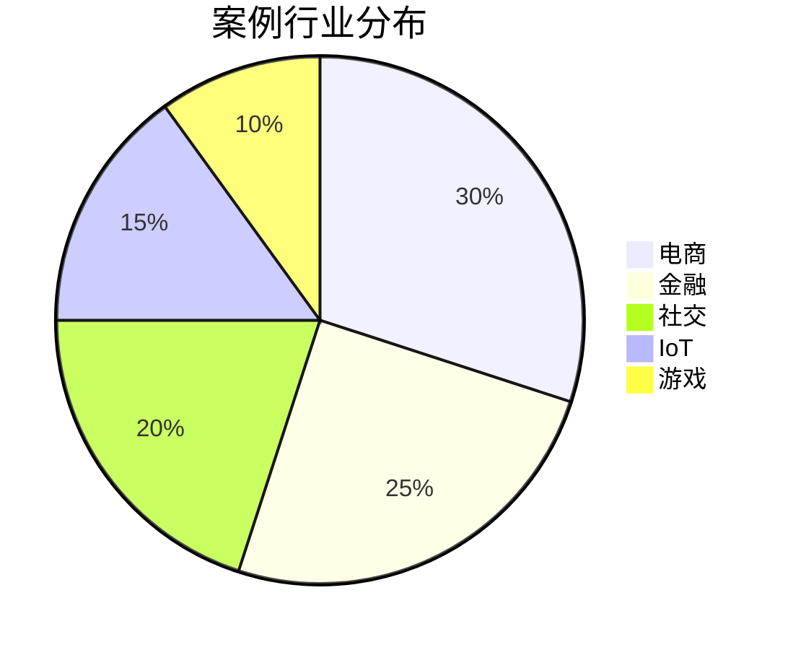
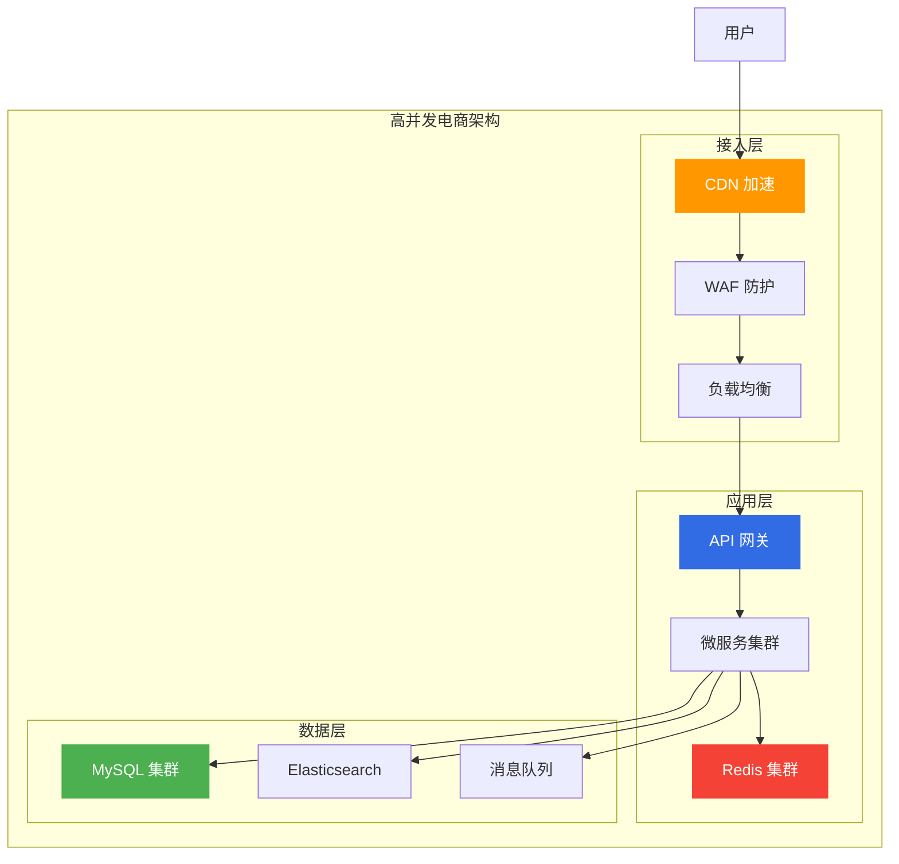
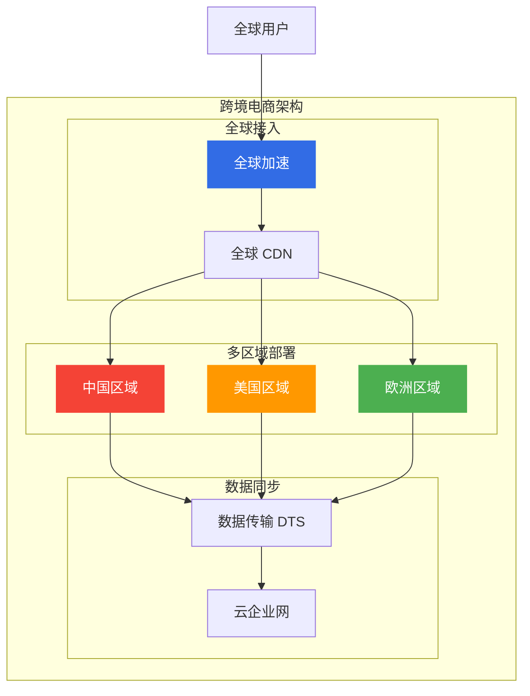
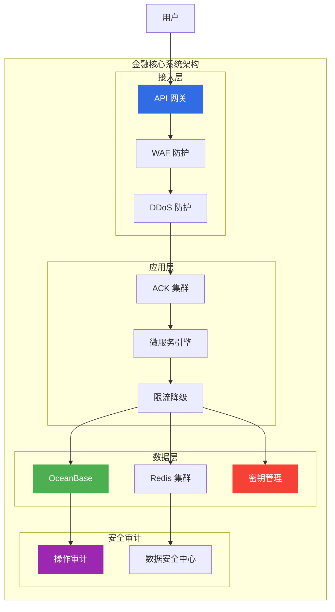
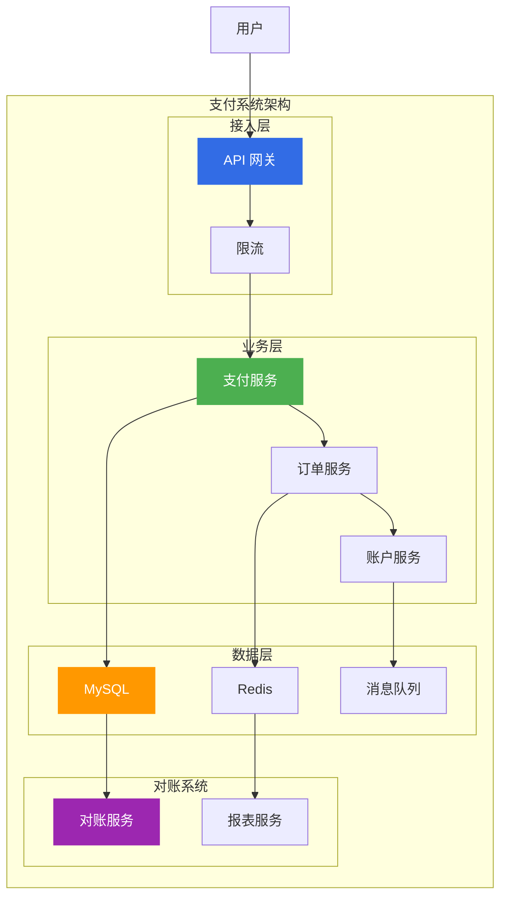
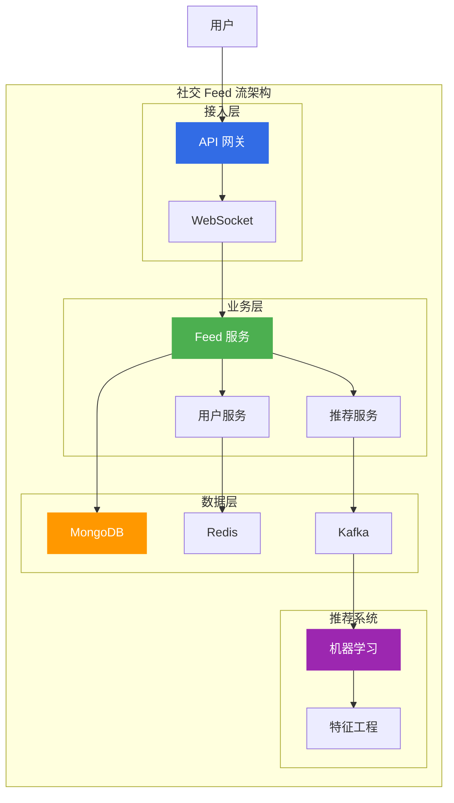
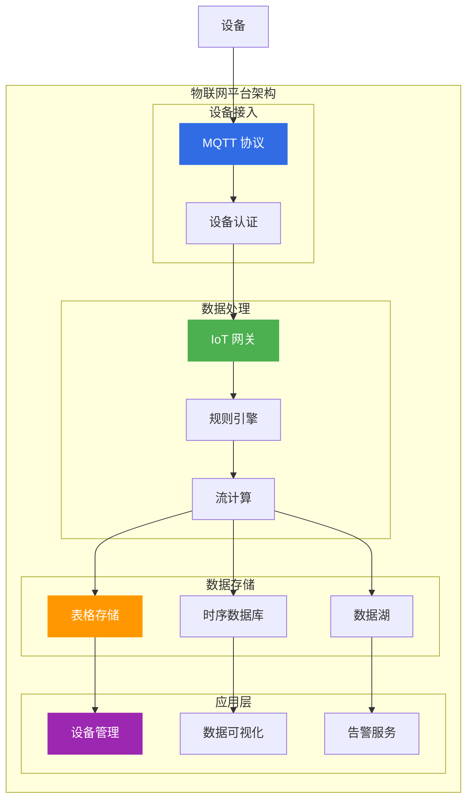
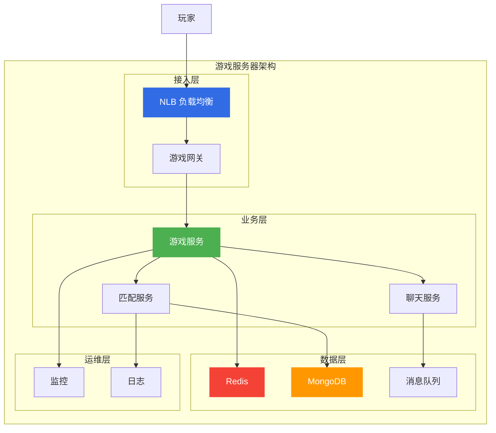

# 阿里云架构设计案例集

> 面向架构师的架构设计案例集，从行业场景、架构设计、技术选型三个维度构建全面的架构设计案例体系。

## 案例分布

---

## 一、电商架构案例

### 1.1 高并发电商架构

**场景描述**: 双11大促，QPS 100万+，需要支持秒杀、抢购等高并发场景。

**架构设计**:

**技术选型**:

| 组件 | 选型 | 原因 |
|------|------|------|
| **接入层** | CDN + WAF + SLB | 高并发、安全防护 |
| **应用层** | ACK + MSE + Redis | 容器化、服务治理、缓存 |
| **数据层** | PolarDB + ES + RocketMQ | 高性能、搜索、异步 |

**关键设计点**:

| 设计点 | 方案 | 效果 |
|--------|------|------|
| **限流降级** | Sentinel 限流 | 防止雪崩 |
| **缓存策略** | 多级缓存 | 降低数据库压力 |
| **异步处理** | 消息队列 | 削峰填谷 |
| **弹性伸缩** | AS 自动扩缩 | 应对流量峰值 |

---

### 1.2 跨境电商架构

**场景描述**: 跨境电商，需要支持多语言、多货币、全球部署。

**架构设计**:

**技术选型**:

| 组件 | 选型 | 原因 |
|------|------|------|
| **全球接入** | GA + CDN | 全球加速 |
| **多区域部署** | ACK 多区域 | 就近部署 |
| **数据同步** | DTS + CEN | 数据一致性 |

---

## 二、金融架构案例

### 2.1 金融核心系统架构

**场景描述**: 金融核心系统，需要支持高可用、强一致、合规审计。

**架构设计**:

**技术选型**:

| 组件 | 选型 | 原因 |
|------|------|------|
| **数据库** | OceanBase | 强一致、高可用 |
| **缓存** | Redis 集群 | 高性能 |
| **安全** | KMS + DSC | 数据加密、脱敏 |
| **审计** | ActionTrail | 合规审计 |

**关键设计点**:

| 设计点 | 方案 | 效果 |
|--------|------|------|
| **强一致** | 分布式事务 | 数据一致性 |
| **高可用** | 多可用区、异地容灾 | 99.999% 可用性 |
| **安全合规** | 加密、脱敏、审计 | 满足监管要求 |
| **性能优化** | 读写分离、分库分表 | 高并发支持 |

---

### 2.2 支付系统架构

**场景描述**: 支付系统，需要支持高并发、强一致、幂等性。

**架构设计**:

**关键设计点**:

| 设计点 | 方案 | 效果 |
|--------|------|------|
| **幂等性** | 唯一请求 ID | 防止重复支付 |
| **强一致** | 分布式事务 | 资金安全 |
| **对账** | T+1 对账 | 差异处理 |
| **风控** | 实时风控 | 欺诈检测 |

---

## 三、社交架构案例

### 3.1 社交 Feed 流架构

**场景描述**: 社交 Feed 流，需要支持海量数据、实时推送、个性化推荐。

**架构设计**:

**技术选型**:

| 组件 | 选型 | 原因 |
|------|------|------|
| **数据库** | MongoDB | 灵活 Schema |
| **缓存** | Redis | 高性能 |
| **消息队列** | Kafka | 高吞吐 |
| **推荐** | PAI 平台 | 机器学习 |

**关键设计点**:

| 设计点 | 方案 | 效果 |
|--------|------|------|
| **Feed 流** | 推拉结合 | 实时性 + 性能 |
| **个性化** | 机器学习推荐 | 用户体验 |
| **实时推送** | WebSocket | 实时通知 |
| **数据一致性** | 最终一致性 | 高可用 |

---

## 四、IoT 架构案例

### 4.1 物联网平台架构

**场景描述**: 物联网平台，需要支持海量设备接入、实时数据处理、规则引擎。

**架构设计**:

**技术选型**:

| 组件 | 选型 | 原因 |
|------|------|------|
| **设备接入** | IoT 平台 | 海量设备接入 |
| **数据存储** | TableStore + TSDB | 宽表 + 时序 |
| **流处理** | Flink | 实时计算 |
| **规则引擎** | 规则引擎 | 灵活配置 |

**关键设计点**:

| 设计点 | 方案 | 效果 |
|--------|------|------|
| **设备认证** | 一机一密 | 安全接入 |
| **数据压缩** | 协议压缩 | 降低带宽 |
| **边缘计算** | 边缘网关 | 低延迟 |
| **数据生命周期** | 冷热分离 | 成本优化 |

---

## 五、游戏架构案例

### 5.1 游戏服务器架构

**场景描述**: 游戏服务器，需要支持低延迟、高并发、状态同步。

**架构设计**:

**技术选型**:

| 组件 | 选型 | 原因 |
|------|------|------|
| **负载均衡** | NLB | 千万级并发、低延迟 |
| **数据库** | MongoDB | 灵活 Schema |
| **缓存** | Redis | 高性能 |
| **消息队列** | RocketMQ | 低延迟 |

**关键设计点**:

| 设计点 | 方案 | 效果 |
|--------|------|------|
| **低延迟** | NLB + 就近部署 | 毫秒级延迟 |
| **状态同步** | 状态机 + 帧同步 | 流畅体验 |
| **匹配系统** | ELO 算法 | 公平匹配 |
| **反外挂** | 服务端校验 | 游戏公平 |

---

## 六、架构设计方法论

### 6.1 架构设计流程

| 阶段 | 内容 | 输出 |
|------|------|------|
| **需求分析** | 业务需求、技术需求 | 需求文档 |
| **架构设计** | 概念架构、逻辑架构 | 架构图 |
| **技术选型** | 产品选型、方案对比 | 选型报告 |
| **详细设计** | 接口设计、数据设计 | 设计文档 |
| **架构评审** | 方案评审、风险评估 | 评审报告 |

### 6.2 架构设计原则

| 原则 | 说明 | 实践 |
|------|------|------|
| **合适原则** | 选择合适的技术 | 避免过度设计 |
| **简单原则** | 保持架构简单 | KISS 原则 |
| **演进原则** | 支持架构演进 | 渐进式改进 |
| **复用原则** | 提高复用性 | 组件化、服务化 |

---

## 七、相关文档

- [16-架构师面试题库.md](16-架构师面试题库.md) — 面试题库
- [18-故障处理案例集.md](18-故障处理案例集.md) — 故障处理案例
- [01-高可用架构设计.md](01-高可用架构设计.md) — 高可用架构

---

> **文档版本**: v1.0  
> **最后更新**: 2026-08-23  
> **适用对象**: 云原生架构师、技术决策者
