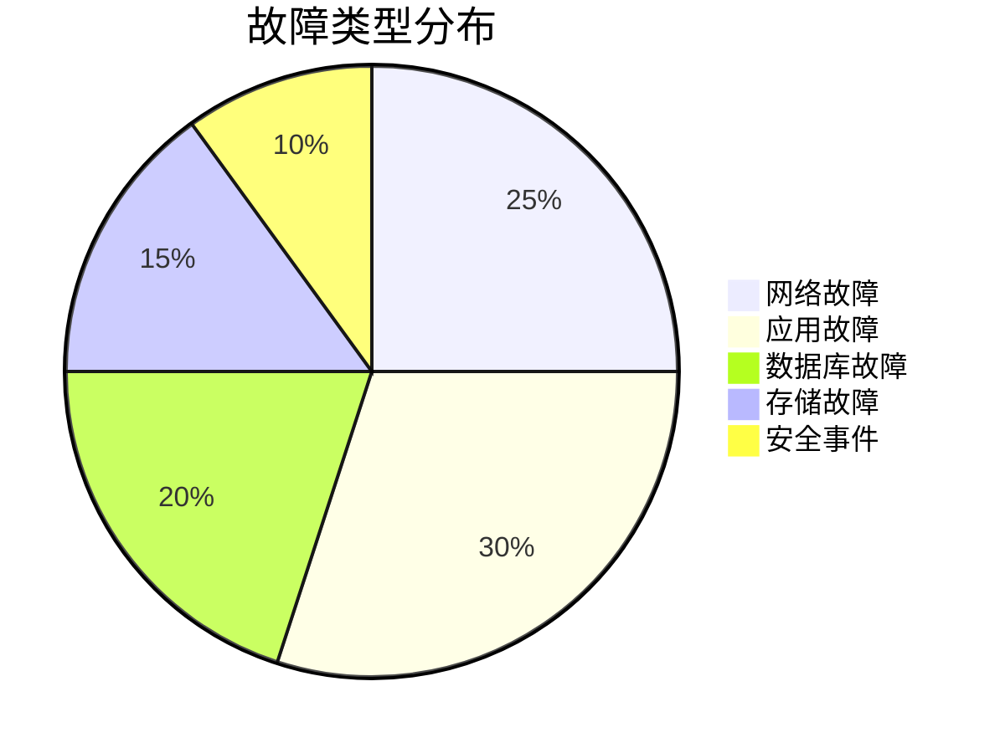
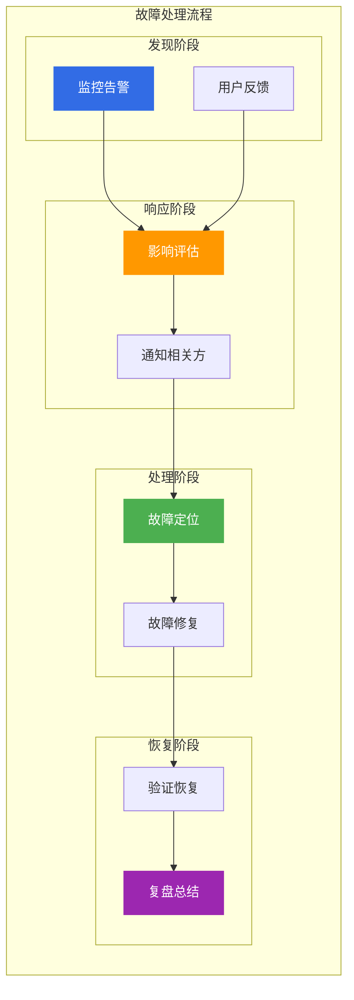

# 阿里云故障处理案例集

> 面向架构师的故障处理案例集，从故障类型、排查方法、解决方案三个维度构建全面的故障处理案例体系。

## 故障类型分布



---

## 一、网络故障案例

### 1.1 案例：VPC 网络不通

**故障现象**: ECS 实例无法访问其他 VPC 内的资源。

**排查过程**:

| 步骤 | 操作 | 结果 |
|------|------|------|
| 1 | 检查安全组规则 | 发现规则缺失 |
| 2 | 检查网络 ACL | 发现 ACL 拒绝 |
| 3 | 检查路由表 | 路由正常 |
| 4 | 检查 VPC 对等连接 | 连接正常 |

**根因分析**: 网络 ACL 规则配置错误，拒绝了跨 VPC 流量。

**解决方案**:

```yaml
# 修复网络 ACL 规则
NetworkACL:
  - Protocol: ALL
    Direction: Ingress
    Action: Allow
    SourceCidr: 10.0.0.0/8
  - Protocol: ALL
    Direction: Egress
    Action: Allow
    DestCidr: 10.0.0.0/8
```

**预防措施**:

| 措施 | 说明 |
|------|------|
| **ACL 审计** | 定期审计 ACL 规则 |
| **自动化检查** | 使用配置审计检查 |
| **文档化** | 记录网络拓扑 |

---

### 1.2 案例：负载均衡健康检查失败

**故障现象**: SLB 后端服务器健康检查失败，流量无法转发。

**排查过程**:

| 步骤 | 操作 | 结果 |
|------|------|------|
| 1 | 检查健康检查配置 | 配置正确 |
| 2 | 检查后端服务器 | 服务正常 |
| 3 | 检查安全组 | 安全组允许 |
| 4 | 检查端口监听 | 发现端口未监听 |

**根因分析**: 应用监听端口配置错误，与 SLB 健康检查端口不一致。

**解决方案**:

```yaml
# 修复应用监听端口
server:
  port: 8080
  
# 修复 SLB 健康检查配置
HealthCheck:
  Port: 8080
  Protocol: HTTP
  URI: /health
  HealthyThreshold: 3
  UnhealthyThreshold: 3
```

**预防措施**:

| 措施 | 说明 |
|------|------|
| **配置检查** | 部署前检查配置一致性 |
| **自动化测试** | 健康检查自动化测试 |
| **监控告警** | 健康检查失败告警 |

---

## 二、应用故障案例

### 2.1 案例：应用 OOM 崩溃

**故障现象**: Java 应用频繁 OOM 崩溃，服务不可用。

**排查过程**:

| 步骤 | 操作 | 结果 |
|------|------|------|
| 1 | 查看 JVM 日志 | 发现 OOM 错误 |
| 2 | 分析 Heap Dump | 发现内存泄漏 |
| 3 | 检查代码 | 发现缓存未清理 |
| 4 | 检查监控 | 内存持续增长 |

**根因分析**: 缓存未设置过期时间，导致内存持续增长。

**解决方案**:

```java
// 修复缓存配置
Cache<String, Object> cache = CacheBuilder.newBuilder()
    .maximumSize(10000)
    .expireAfterWrite(10, TimeUnit.MINUTES)
    .build();
    
// 添加 JVM 参数
-Xms4g -Xmx4g -XX:+HeapDumpOnOutOfMemoryError
-XX:HeapDumpPath=/tmp/heapdump.hprof
```

**预防措施**:

| 措施 | 说明 |
|------|------|
| **内存监控** | JVM 内存监控告警 |
| **代码审查** | 缓存使用审查 |
| **压力测试** | 内存压力测试 |

---

### 2.2 案例：微服务雪崩

**故障现象**: 微服务调用链超时，导致级联故障。

**排查过程**:

| 步骤 | 操作 | 结果 |
|------|------|------|
| 1 | 查看链路追踪 | 发现调用超时 |
| 2 | 检查服务依赖 | 发现依赖服务故障 |
| 3 | 检查熔断配置 | 熔断未生效 |
| 4 | 检查限流配置 | 限流未配置 |

**根因分析**: 缺少熔断和限流配置，导致级联故障。

**解决方案**:

```yaml
# 配置 Sentinel 熔断规则
sentinel:
  rules:
    - resource: user-service
      grade: 0  # 慢调用比例
      count: 1000  # 慢调用阈值
      slowRatioThreshold: 0.5  # 比例阈值
      timeWindow: 10  # 熔断时长
      minRequestAmount: 5  # 最小请求数
      statIntervalMs: 1000  # 统计时长
      
    # 配置限流规则
    - resource: user-service
      grade: 1  # QPS
      count: 1000  # 限流阈值
```

**预防措施**:

| 措施 | 说明 |
|------|------|
| **熔断配置** | 所有服务配置熔断 |
| **限流配置** | 核心服务配置限流 |
| **链路监控** | 调用链监控告警 |

---

## 三、数据库故障案例

### 3.1 案例：数据库慢查询

**故障现象**: 数据库响应变慢，应用超时。

**排查过程**:

| 步骤 | 操作 | 结果 |
|------|------|------|
| 1 | 查看慢查询日志 | 发现大量慢查询 |
| 2 | 分析执行计划 | 发现全表扫描 |
| 3 | 检查索引 | 发现索引缺失 |
| 4 | 检查数据量 | 数据量增长 |

**根因分析**: 缺少必要索引，导致全表扫描。

**解决方案**:

```sql
-- 添加索引
CREATE INDEX idx_user_id ON orders(user_id);
CREATE INDEX idx_create_time ON orders(create_time);

-- 优化查询
SELECT * FROM orders 
WHERE user_id = ? 
AND create_time > ? 
ORDER BY create_time DESC 
LIMIT 10;
```

**预防措施**:

| 措施 | 说明 |
|------|------|
| **慢查询监控** | DAS 慢查询监控 |
| **索引优化** | 定期索引优化 |
| **SQL 审查** | SQL 上线审查 |

---

### 3.2 案例：数据库主从延迟

**故障现象**: 主从复制延迟，读数据不一致。

**排查过程**:

| 步骤 | 操作 | 结果 |
|------|------|------|
| 1 | 查看复制状态 | 发现延迟 |
| 2 | 检查网络 | 网络正常 |
| 3 | 检查负载 | 从库负载高 |
| 4 | 检查大事务 | 发现大事务 |

**根因分析**: 大事务导致复制延迟。

**解决方案**:

```sql
-- 优化大事务
-- 原来
DELETE FROM logs WHERE create_time < '2025-01-01';

-- 优化后
DELETE FROM logs WHERE create_time < '2025-01-01' LIMIT 1000;
-- 分批删除
```

**预防措施**:

| 措施 | 说明 |
|------|------|
| **事务优化** | 避免大事务 |
| **监控告警** | 复制延迟监控 |
| **读写分离** | 合理使用读写分离 |

---

## 四、存储故障案例

### 4.1 案例：OSS 访问变慢

**故障现象**: OSS 访问变慢，上传下载超时。

**排查过程**:

| 步骤 | 操作 | 结果 |
|------|------|------|
| 1 | 检查 OSS 状态 | 状态正常 |
| 2 | 检查网络 | 网络正常 |
| 3 | 检查请求量 | 请求量激增 |
| 4 | 检查热点文件 | 发现热点文件 |

**根因分析**: 热点文件导致请求集中。

**解决方案**:

```yaml
# 配置 CDN 加速
CDN:
  Domain: oss.example.com
  Origin: oss-cn-hangzhou.aliyuncs.com
  CacheRules:
    - Path: "*.jpg"
      TTL: 86400
    - Path: "*.png"
      TTL: 86400
      
# 配置 OSS 分片上传
Upload:
  PartSize: 10485760  # 10MB
  Parallel: 5
```

**预防措施**:

| 措施 | 说明 |
|------|------|
| **CDN 加速** | 热点文件 CDN 加速 |
| **分片上传** | 大文件分片上传 |
| **监控告警** | 访问量监控 |

---

## 五、安全事件案例

### 5.1 案例：DDoS 攻击

**故障现象**: 服务器带宽被打满，服务不可用。

**排查过程**:

| 步骤 | 操作 | 结果 |
|------|------|------|
| 1 | 查看监控 | 带宽异常 |
| 2 | 分析流量 | 发现攻击流量 |
| 3 | 检查来源 | 分布式来源 |
| 4 | 启用防护 | DDoS 防护 |

**根因分析**: 遭受 DDoS 攻击。

**解决方案**:

```yaml
# 启用 DDoS 防护
DDoS:
  Protection: Advanced
  Bandwidth: 100Gbps
  
# 配置 WAF 规则
WAF:
  Rules:
    - Name: CC Protection
      Action: Block
      Threshold: 1000
      Interval: 60
```

**预防措施**:

| 措施 | 说明 |
|------|------|
| **DDoS 防护** | 启用 DDoS 防护 |
| **WAF 防护** | 配置 WAF 规则 |
| **流量监控** | 流量异常告警 |

---

## 六、故障处理方法论

### 6.1 故障处理流程



### 6.2 故障排查工具

| 工具 | 用途 | 阿里云产品 |
|------|------|------------|
| **监控** | 指标监控 | ARMS、CloudMonitor |
| **日志** | 日志分析 | SLS |
| **链路追踪** | 调用链追踪 | ARMS Trace |
| **诊断** | 问题诊断 | DAS、AHAS |

### 6.3 故障复盘模板

| 项目 | 内容 |
|------|------|
| **故障概述** | 故障时间、影响范围 |
| **根因分析** | 故障根本原因 |
| **处理过程** | 排查和修复过程 |
| **改进措施** | 预防和改进措施 |
| **责任归属** | 责任团队和人员 |

---

## 七、相关文档

- [16-架构师面试题库.md](16-架构师面试题库.md) — 面试题库
- [17-架构设计案例集.md](17-架构设计案例集.md) — 架构设计案例
- [01-高可用架构设计.md](01-高可用架构设计.md) — 高可用架构

---

> **文档版本**: v1.0  
> **最后更新**: 2026-08-23  
> **适用对象**: 云原生架构师、SRE、运维工程师
