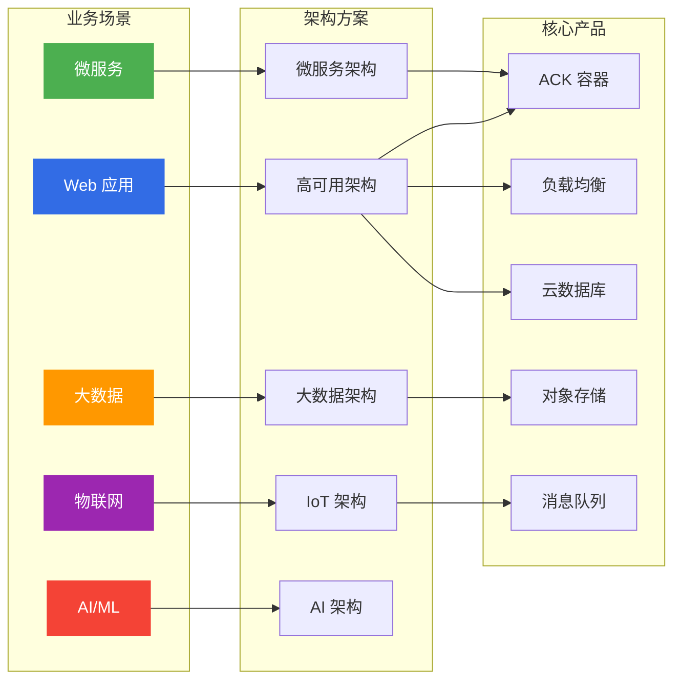

# 阿里云公共云架构与方案

> 面向架构师的阿里云公共云整体架构指南，从方案维度研究产品选型与架构设计。

## 文档定位

本目录从**架构师视角**研究阿里云公共云，覆盖云原生全技术栈，区别于：
- `公有云-ACK/` — 专注于 ACK 容器服务运维
- `专有云-ACK/` — 专注于专有云 Apsara Stack 运维

## 文档索引

### 产品选型系列

| # | 文档 | 说明 | 状态 |
|---|------|------|------|
| 09 | [09-计算产品选型.md](09-计算产品选型.md) | ECS vs ACK vs FC vs SAE 选型指南 | ✅ |
| 10 | [10-存储产品选型.md](10-存储产品选型.md) | OSS vs NAS vs ESSD vs TableStore | ✅ |
| 11 | [11-数据库产品选型.md](11-数据库产品选型.md) | RDS vs PolarDB vs Redis vs MongoDB | ✅ |
| 12 | [12-网络产品选型.md](12-网络产品选型.md) | VPC/SLB/ALB/NLB/CDN 组合 | ✅ |
| 13 | [13-安全产品选型.md](13-安全产品选型.md) | WAF/DDoS/RAM/KMS 组合 | ✅ |
| 14 | [14-大数据产品选型.md](14-大数据产品选型.md) | MaxCompute/Flink/Hologres/DataWorks | ✅ |
| 15 | [15-中间件产品选型.md](15-中间件产品选型.md) | 消息队列/微服务/API网关 | ✅ |

### 架构方案系列

| # | 文档 | 说明 | 状态 |
|---|------|------|------|
| 01 | [01-高可用架构设计.md](01-高可用架构设计.md) | 多可用区、异地容灾、故障自愈 | ✅ |
| 02 | [02-微服务架构方案.md](02-微服务架构方案.md) | ACK + ASM + MSE + 全链路灰度 | ✅ |
| 03 | [03-大数据架构方案.md](03-大数据架构方案.md) | 湖仓一体、实时计算、数据治理 | ✅ |
| 04 | [04-安全架构设计.md](04-安全架构设计.md) | 零信任、数据加密、合规审计 | ✅ |
| 05 | [05-成本优化方案.md](05-成本优化方案.md) | FinOps、资源调度、存储分层 | ✅ |
| 06 | [06-全球部署方案.md](06-全球部署方案.md) | 多区域、CDN、全球加速 | ✅ |
| 07 | [07-混合云架构方案.md](07-混合云架构方案.md) | 公有云+专有云、统一管控 | ✅ |
| 08 | [08-云原生转型路径.md](08-云原生转型路径.md) | 上云迁移、容器化、DevOps | ✅ |

### 面试准备系列

| # | 文档 | 说明 | 状态 |
|---|------|------|------|
| 16 | [16-架构师面试题库.md](16-架构师面试题库.md) | 高频面试题与参考答案 | ✅ |
| 17 | [17-架构设计案例集.md](17-架构设计案例集.md) | 电商/金融/社交等行业案例 | ✅ |
| 18 | [18-故障处理案例集.md](18-故障处理案例集.md) | 真实故障场景与解决方案 | ✅ |

---

## 快速导航

### 按场景找方案

### 按产品域找文档

| 产品域 | 核心产品 | 选型文档 | 方案文档 |
|--------|----------|----------|----------|
| **计算** | ECS, ACK, FC, SAE | [09-计算产品选型.md](09-计算产品选型.md) | [01-高可用架构设计.md](01-高可用架构设计.md) |
| **存储** | OSS, NAS, ESSD, TableStore | [10-存储产品选型.md](10-存储产品选型.md) | [05-成本优化方案.md](05-成本优化方案.md) |
| **网络** | VPC, SLB, CDN, NAT | [12-网络产品选型.md](12-网络产品选型.md) | [06-全球部署方案.md](06-全球部署方案.md) |
| **数据库** | RDS, PolarDB, Redis, MongoDB | [11-数据库产品选型.md](11-数据库产品选型.md) | [01-高可用架构设计.md](01-高可用架构设计.md) |
| **安全** | WAF, DDoS, RAM, KMS | [13-安全产品选型.md](13-安全产品选型.md) | [04-安全架构设计.md](04-安全架构设计.md) |
| **大数据** | MaxCompute, Flink, Hologres | [14-大数据产品选型.md](14-大数据产品选型.md) | [03-大数据架构方案.md](03-大数据架构方案.md) |
| **中间件** | RocketMQ, MSE, Higress | [15-中间件产品选型.md](15-中间件产品选型.md) | [02-微服务架构方案.md](02-微服务架构方案.md) |

---

## 相关目录

- [[18-云厂商/01-阿里云/公有云-ACK/index.md|公有云-ACK]] — ACK 容器服务运维
- [[18-云厂商/01-阿里云/专有云-ACK/index.md|专有云-ACK]] — 专有云 Apsara Stack 运维
- [[18-云厂商/09-阿里云云原生/README.md|阿里云云原生产品全景]] — 全产品线清单

---

> **文档版本**: v3.0  
> **最后更新**: 2026-08-23  
> **维护者**: 云原生架构师知识库
