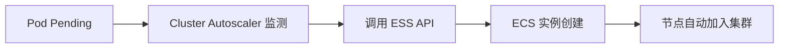

> **生产环境安全提示**
>
> 本文档包含可直接执行的运维命令。执行前请确认：当前目标集群与 Namespace 是否正确；是否具备足够的 RBAC 权限；是否已在非生产环境验证。命令风险等级标注：🔴 高风险（可能造成数据丢失或服务中断）、🟡 中风险（会修改集群状态，但通常可回滚）、🟢 低风险/只读（信息收集，无副作用）。


# ACK 关联产品 - ECS 计算资源

> **适用版本**: ACK v1.25 - v1.32 | **最后更新**: 2026-01

---

## 目录

- [ECS 规格选型](#ecs-规格选型)
- [节点池配置最佳实践](#节点池配置最佳实践)
- [节点池操作步骤与验证](#节点池操作步骤与验证)
- [抢占式实例 (Spot) 策略](#抢占式实例-spot-策略)
- [弹性伸缩组 (ESS) 集成](#弹性伸缩组-ess-集成)
- [资源预留与性能调优](#资源预留与性能调优)
- [常见问题排查](#常见问题排查)

---

## ECS 规格选型

### ACK 推荐规格族

| 规格族 | 特点 | 适用场景 | 对应 K8s 标签 |
|:---|:---|:---|:---|
| **计算型 (c7/c8i)** | 高 CPU 性能，1:2 比例 | Web 服务、API、CI/CD | `node.kubernetes.io/instance-type=ecs.c7.xlarge` |
| **通用型 (g7/g8i)** | 性能均衡，1:4 比例 | 一般生产应用、微服务 | `node.kubernetes.io/instance-type=ecs.g7.xlarge` |
| **内存型 (r7/r8i)** | 高内存，1:8 比例 | 数据库、缓存 (Redis)、大数据 | `node.kubernetes.io/instance-type=ecs.r7.xlarge` |
| **GPU 型 (gn6v/gn7i)** | 硬件加速 | AI 训练/推理、视频转码 | `aliyun.com/gpu-mem` |
| **大数据型 (d2c/d3c)** | 高本地盘吞吐 | HDFS、Kafka | `alibabacloud.com/local-disk` |

### 规格建议矩阵

| 集群规模 | 推荐规格规格 | 原因 |
|:---|:---|:---|
| **开发测试** | 2核 4G / 4核 8G | 成本优先 |
| **核心生产** | 8核 32G / 16核 64G | 减少节点数，降低管理开销，提高资源利用率 |
| **高并发 API** | 16核 32G (计算型) | 追求单核性能与低延迟 |
| **AI 推理** | ecs.gn7i-c8g1.2xlarge | NVIDIA A10 性能均衡 |

---

## 节点池配置最佳实践

### 生产级节点池模板

```yaml
# 推荐配置组合
节点池类型: 托管节点池 (Manage NodePool)
付费类型: 包年包月 (核心) / 按量付费 (弹性)
操作系统: Alibaba Cloud Linux 3
容器运行时: containerd
网络模式: Terway
安全组: 最小化权限规则
```

### 关键配置参数

| 参数 | 推荐设置 | 说明 |
|:---|:---|:---|
| **SystemDisk** | ESSD PL1 (100GB+) | 保证系统组件及容器镜像解压性能 |
| **UserData** | 自定义脚本 | 用于节点初始化、内核参数调整、挂载额外磁盘 |
| **Labels/Taints** | 根据业务分配 | 强制调度业务到特定节点池 |
| **CPU 管理策略** | static (可选) | 绑定 CPU 核，适用于延迟极敏感应用 |

---

## 节点池操作步骤与验证

### 创建托管节点池（aliyun CLI）

```bash
# 🟡 中风险：创建节点池会产生 ECS 计费资源
aliyun cs POST /clusters/${CLUSTER_ID}/nodepools \
  --header "Content-Type=application/json" \
  --body '{
    "nodepool_info": {"name": "prod-general"},
    "scaling_group": {
      "instance_types": ["ecs.g7.2xlarge"],
      "system_disk_category": "cloud_essd",
      "system_disk_performance_level": "PL1",
      "system_disk_size": 120,
      "desired_size": 3
    },
    "kubernetes_config": {
      "runtime": "containerd",
      "labels": [{"key": "workload-type", "value": "general"}]
    },
    "management": {"enable": true, "auto_repair": true}
  }'
```

### 验证节点池就绪

```bash
# 🟢 低风险：查询节点池状态，期望 state 为 active
aliyun cs GET /clusters/${CLUSTER_ID}/nodepools | jq '.nodepools[] | {name: .nodepool_info.name, state: .status.state}'

# 🟢 低风险：确认新节点 Ready 且标签正确
kubectl get nodes -l workload-type=general -o wide
kubectl describe node <node-name> | grep -A5 'Labels\|Taints'

# 🟢 低风险：确认 containerd 运行时与内核版本
kubectl get nodes -o custom-columns='NAME:.metadata.name,RUNTIME:.status.nodeInfo.containerRuntimeVersion,KERNEL:.status.nodeInfo.kernelVersion'
```

### 节点池扩缩容

```bash
# 🟡 中风险：调整期望节点数（扩容安全，缩容会驱逐 Pod）
aliyun cs PUT /clusters/${CLUSTER_ID}/nodepools/${NODEPOOL_ID} \
  --header "Content-Type=application/json" \
  --body '{"scaling_group": {"desired_size": 5}}'

# 缩容前先手动排空目标节点（🟡 中风险）
kubectl cordon <node-name>
kubectl drain <node-name> --ignore-daemonsets --delete-emptydir-data --grace-period=120
```

---

## 抢占式实例 (Spot) 策略

### Spot 实例优势与风险

| 维度 | 说明 |
|:---|:---|
| **节省成本** | 相比按量付费可节省 50% - 90% |
| **回收特征** | 只有 5 分钟回收通知 (Termination Notice) |
| **适用范围** | 无状态、可容错的业务、批处理计算 |

### 生产环境 Spot 配置建议

```yaml
# 节点池混合实例策略
多实例配置:
  - ecs.c7.2xlarge (基础)
  - ecs.c7.4xlarge (备选)
  - ecs.g7.2xlarge (备选)
Spot 策略: 
  - 成本优先 (Price-First)
  - 系统自动选配 (Multi-Instance-Type)
```

---

## 弹性伸缩组 (ESS) 集成

### 自动伸缩触发链



### 扩缩容优化

| 优化点 | 配置方式 |
|:---|:---|
| **快速扩容** | 启用云盘预热、镜像预热 |
| **优雅缩容** | 配置 `drain-priority`，确保 Pod 正常迁移 |
| **防护配置** | 设置 `scale-in-threshold`，防止过度频繁缩容 |

### 验证 Cluster Autoscaler 工作状态

```bash
# 🟢 低风险：确认 autoscaler 组件运行正常
kubectl -n kube-system get deploy cluster-autoscaler
kubectl -n kube-system logs deploy/cluster-autoscaler --tail=50 | grep -E 'ScaleUp|ScaleDown'

# 🟢 低风险：查看触发扩容的 Pending Pod 事件
kubectl get events --field-selector reason=TriggeredScaleUp -A --sort-by=.lastTimestamp
```

---

## 资源预留与性能调优

### Kubelet 资源预留计算

对于一台 16核 64G 的机器，推荐预留：

```bash
# /etc/kubernetes/kubelet.conf (示例)
system-reserved: cpu=500m,memory=1Gi,ephemeral-storage=1Gi
kube-reserved: cpu=500m,memory=1Gi,ephemeral-storage=1Gi
eviction-hard: memory.available<500Mi,nodefs.available<10%
```

### ECS 级内核优化 (UserData)

```bash
# sysctl.conf 优化建议
net.core.somaxconn = 65535
net.ipv4.tcp_max_syn_backlog = 65535
fs.file-max = 2000000
```

### 验证资源预留生效

```bash
# 🟢 低风险：Allocatable 应等于 Capacity 减去预留与驱逐阈值
kubectl describe node <node-name> | grep -A8 'Capacity\|Allocatable'

# 🟢 低风险：确认 kubelet 启动参数中的预留配置
kubectl get --raw "/api/v1/nodes/<node-name>/proxy/configz" | jq '.kubeletconfig | {systemReserved, kubeReserved, evictionHard}'
```

---

## 常见问题排查

| 现象 | 可能原因 | 排查命令 |
|:---|:---|:---|
| **节点 NotReady** | kubelet 异常 / 网络插件未就绪 | `kubectl describe node` 看 Conditions；节点上 `systemctl status kubelet` |
| **扩容后 Pod 仍 Pending** | 新节点带 Taint / 资源仍不足 | `kubectl describe pod` 看 Events 中的调度失败原因 |
| **Spot 节点被批量回收** | 竞价策略过低 / 库存不足 | 查看 ESS 伸缩活动记录，增加备选规格 |
| **节点频繁 OOM** | 资源预留不足，系统进程被挤压 | 检查 `eviction-hard` 与 `system-reserved` 配置 |

---

## 相关文档

- [[18-云厂商/01-阿里云/index|阿里云域索引]]
- [[18-云厂商/01-阿里云/公有云-ACK/245-ack-ebs-storage|245-ack-ebs-storage]] - 云盘存储详解
- [[01-集群基础/07-性能调优/index|集群性能调优]]

## Related

- [[17-系统基础/05-速查卡/k8s.md|k8s]]
- [[23-实体/02-K8s核心组件/kubernetes.md|kubernetes]]
- [[23-实体/03-运行时/containerd.md|containerd]]
- [[21-生态参考/03-领域索引/terway-index.md|Terway 知识图谱索引]]

## See Also

- [[18-云厂商/01-阿里云/公有云-ACK/alicloud-ack-overview.md|alicloud-ack-overview]]
- [[18-云厂商/01-阿里云/公有云-ACK/service-ack-practical-guide.md|service-ack-practical-guide]]
- [[18-云厂商/01-阿里云/公有云-ACK/241-ack-slb-nlb-alb.md|241-ack-slb-nlb-alb]]
- [[18-云厂商/01-阿里云/公有云-ACK/242-ack-vpc-network.md|242-ack-vpc-network]]


<!-- risk-assessed -->
