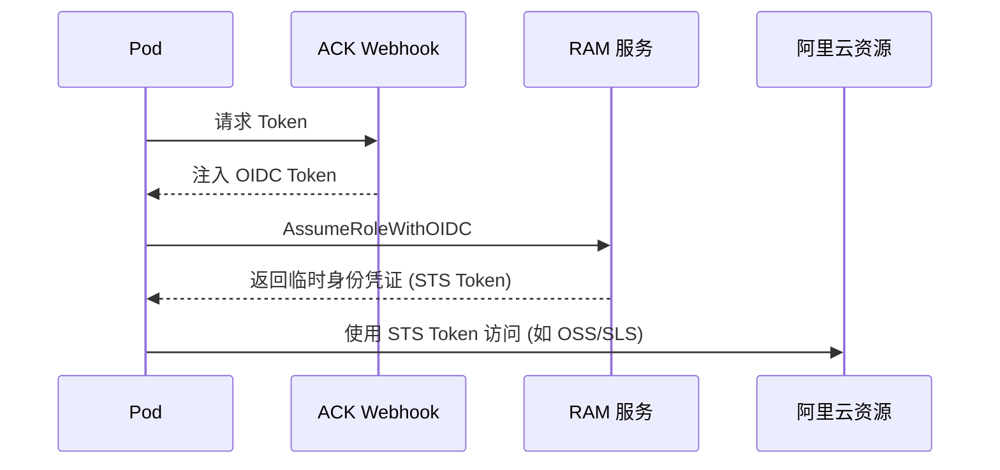

> **生产环境安全提示**
>
> 本文档包含可直接执行的运维命令。执行前请确认：当前目标集群与 Namespace 是否正确；是否具备足够的 RBAC 权限；是否已在非生产环境验证。命令风险等级标注：🔴 高风险（可能造成数据丢失或服务中断）、🟡 中风险（会修改集群状态，但通常可回滚）、🟢 低风险/只读（信息收集，无副作用）。


# ACK 关联产品 - RAM 权限与授权 (RAM & RRSA)

> **适用版本**: ACK v1.25 - v1.32 | **最后更新**: 2026-01

---

## 目录

- [RAM 基础权限架构](#ram-基础权限架构)
- [ACK 集群级服务账号](#ack-集群级服务账号)
- [RRSA (Pod 级精细化授权)](#rrsa-pod-级精细化授权)
- [最小权限原则实施 (RBAC + RAM)](#最小权限原则实施-rbac--ram)
- [安全审计与监控](#安全审计与监控)

---

## RAM 基础权限架构

### 核心概念

| 实体 | 说明 | K8s 对应物 |
|:---|:---|:---|
| **RAM 用户** | 独立的身份凭证 (AK/AS) | User |
| **RAM 角色** | 虚拟身份，可被其他实体扮演 | ServiceAccount / Role |
| **权限策略 (Policy)** | 定义允许/拒绝的操作集合 | RoleBinding / ClusterRole |

### ACK 默认权限矩阵

| 场景 | 所需角色/策略 | 说明 |
|:---|:---|:---|
| **集群初始化** | `AliyunCSDefaultRole` | 允许 ACK 管理 ECS/VPC/SLB 等资源 |
| **双向链接** | `AliyunCSServerRole` | 允许集群控制面与云资源交互 |
| **日志采集** | `AliyunLogArchiveRole` | 允许日志组件写入 SLS |

---

## ACK 集群级服务账号

在 ACK 控制台中，您可以为不同的节点池配置不同的 **Worker RAM Role**。所有运行在该节点池上的 Pod，默认共享该角色的权限。

> [!WARNING]
> **风险提示**: 节点池级别角色权限过大会导致横向越权。建议仅赋予基础权限，如拉取 ACR 镜像等。

---

## RRSA (Pod 级精细化授权)

RRSA (RAM Roles for Service Accounts) 是 ACK 提供的一种使 Pod 能够以独立身份访问云服务的能力，类似于 AWS 的 IRSA。

### RRSA 工作流



### 配置步骤

#### 步骤 1：启用集群 RRSA 功能

```bash
# 🟡 中风险：为存量集群开启 RRSA（控制面会滚动更新 OIDC 配置）
aliyun cs PUT /clusters/${CLUSTER_ID} \
  --header "Content-Type=application/json" \
  --body '{"enable_rrsa": true}'

# 🟢 低风险：确认 OIDC Provider 已注册（输出非空即成功）
aliyun ram ListOIDCProviders | jq '.OIDCProviders.OIDCProvider[] | select(.Description | contains("'${CLUSTER_ID}'"))'
```

#### 步骤 2：创建可被 OIDC 扮演的 RAM 角色

```bash
# 🟡 中风险：创建信任 OIDC 身份提供商的角色（信任策略限定 namespace + serviceaccount）
aliyun ram CreateRole --RoleName ack-oss-reader \
  --AssumeRolePolicyDocument '{
    "Version": "1",
    "Statement": [{
      "Action": "sts:AssumeRoleWithOIDC",
      "Effect": "Allow",
      "Principal": {"Federated": ["acs:ram::<ACCOUNT_ID>:oidc-provider/ack-rrsa-<CLUSTER_ID>"]},
      "Condition": {"StringEquals": {
        "oidc:sub": "system:serviceaccount:prod:my-oss-accessor"
      }}
    }]
  }'

# 🟡 中风险：挂载最小权限策略（示例：OSS 只读）
aliyun ram AttachPolicyToRole --PolicyType System \
  --PolicyName AliyunOSSReadOnlyAccess --RoleName ack-oss-reader
```

#### 步骤 3：绑定 ServiceAccount

```yaml
# 使用注解声明角色 ARN，RRSA Webhook 会自动注入 Token
apiVersion: v1
kind: ServiceAccount
metadata:
  name: my-oss-accessor
  namespace: prod
  annotations:
    pod-identity.alibabacloud.com/role-name: "ack-oss-reader"
```

#### 步骤 4：验证 RRSA 生效

```bash
# 🟢 低风险：确认 rrsa webhook 组件运行
kubectl -n ack-pod-identity-system get pods 2>/dev/null || kubectl -n kube-system get pods | grep -i rrsa

# 🟢 低风险：Pod 内应存在 OIDC Token 环境变量与投射文件
kubectl -n prod exec <pod-name> -- env | grep -E 'ALIBABA_CLOUD_ROLE_ARN|ALIBABA_CLOUD_OIDC'
kubectl -n prod exec <pod-name> -- cat /var/run/secrets/tokens/oidc-token | head -c 40

# 🟢 低风险：在 Pod 内用 STS Token 实际访问云资源（以 ossutil 为例）
kubectl -n prod exec <pod-name> -- ossutil ls oss://<bucket-name> --limited-num 1
```

> 验证失败时优先排查：① 信任策略中 `oidc:sub` 与实际 `namespace:serviceaccount` 是否一致；② Pod 是否在创建时就已挂好 ServiceAccount（先建 SA 再建 Pod）。

---

## 最小权限原则实施 (RBAC + RAM)

### 实施建议表

| 应用类型 | 建议授权方式 | 策略级别 |
|:---|:---|:---|
| **前端应用** | 仅需要私有镜像下载权 | 只读 (ReadOnly) |
| **日志采集组件** | 仅允许写入特定的 SLS 日志库 | 限定资源 (Resource-Specific) |
| **数据库同步** | 允许访问特定 KMS 密钥 | 条件限制 (Condition-Based) |
| **备份管理** | 读写 OSS 备份 Bucket | 临时令牌 (STS) |

---

## 安全审计与监控

### 常见风险排查

- **AccessKey 泄露风险**: 严禁将 AK/AS 写入 YAML 或 Dockerfile 环境变量中，优先使用 RAM 角色。
- **权限过大监控**: 定期配合 "配置审计" 产品检查 `AliyunCSFullAccess` 等高危权限的使用。
- **API 审计**: 通过 "操作审计" (ActionTrail) 监控 `cs.aliyuncs.com` 相关的 API 调用记录。

### 审计命令示例

```bash
# 🟢 低风险：检查集群内是否有 Secret 明文存储 AccessKey
kubectl get secrets -A -o json | jq -r '.items[] | select(.data != null) | select([.data | keys[]] | map(test("(?i)access.?key|ak.?secret")) | any) | "\(.metadata.namespace)/\(.metadata.name)"'

# 🟢 低风险：盘点所有绑定了 RAM 角色的 ServiceAccount
kubectl get sa -A -o json | jq -r '.items[] | select(.metadata.annotations["pod-identity.alibabacloud.com/role-name"] != null) | "\(.metadata.namespace)/\(.metadata.name) -> \(.metadata.annotations["pod-identity.alibabacloud.com/role-name"])"'
```

---

## 相关文档

- [[08-安全/01-身份与访问/07-rbac-matrix-configuration|Kubernetes RBAC 矩阵配置]]
- [[08-安全/01-身份与访问/04-oidc-identity-provider-integration|OIDC 身份提供商集成]]
- [[18-云厂商/01-阿里云/index|阿里云域索引]]

## Related

- [[17-系统基础/05-速查卡/k8s.md|k8s]]
- [[23-实体/02-K8s核心组件/kubernetes.md|kubernetes]]
- [[23-实体/15-参考与索引/KUDIG Cheat Sheet Index.md|KUDIG Cheat Sheet Index]] — Cross-reference

## See Also

- [[18-云厂商/01-阿里云/公有云-ACK/241-ack-slb-nlb-alb.md|241-ack-slb-nlb-alb]]
- [[18-云厂商/01-阿里云/公有云-ACK/242-ack-vpc-network.md|242-ack-vpc-network]]
- [[18-云厂商/01-阿里云/公有云-ACK/244-ack-ros-iac.md|244-ack-ros-iac]]
- [[18-云厂商/01-阿里云/公有云-ACK/245-ack-ebs-storage.md|245-ack-ebs-storage]]


<!-- risk-assessed -->
