> **生产环境安全提示**
>
> 本文档包含可直接执行的运维命令。执行前请确认：当前目标集群与 Namespace 是否正确；是否具备足够的 RBAC 权限；是否已在非生产环境验证。命令风险等级标注：🔴 高风险（可能造成数据丢失或服务中断）、🟡 中风险（会修改集群状态，但通常可回滚）、🟢 低风险/只读（信息收集，无副作用）。


# 华为云 CCE 企业级容器平台深度实践

<!-- chunk: 概述 -->## 概述

华为云容器引擎（Cloud Container Engine，CCE）是华为云提供的托管 [[kubernetes|Kubernetes]] 服务，以 CCE Turbo 云原生网络、[[volcano|Volcano]] 高性能调度器和裸金属容器实例为核心差异化能力。CCE Turbo 基于华为自研的 ENI 网络直通技术，实现容器网络零损耗，单个 Pod 可获得独立 ENI 网卡，网络性能接近物理机级别。Volcano 调度器在 AI/大数据场景下提供批量调度、队列管理、公平调度和优先级抢占能力，已捐赠给 CNCF 成为孵化项目。

在混合云架构中，CCE 通过华为云混合集群、IEF 边缘容器和 UCS（Unified Cloud [[service|Service]]）多集群管理实现云边协同和多云统一管理。UCS 是华为推出的多云统一管理平台，可以管理华为云 CCE、阿里云 ACK、AWS EKS 等多种 Kubernetes 集群，提供统一的策略管理和服务治理能力。华为云是 [[karmada|Karmada]]、Volcano、[[kubeedge|KubeEdge]]、Kurator 等多云开源项目的核心贡献者，在多云编排和边缘计算领域具有深厚的技术积累。

本文档深入探讨 CCE Turbo 网络架构、Volcano 调度优化、裸金属容器部署和混合云集成方案。内容涵盖完整的集群创建配置、存储类定义、安全策略、监控告警规则和运维自动化脚本，为企业构建基于华为云的生产级容器平台提供全面参考。

## CCE 核心特性

| 特性 | 说明 | 适用场景 |
|:---|:---|:---|
| CCE Turbo | 基于 ENI 直通的零损耗容器网络，Pod 独立 ENI | 高性能网络、低延迟 |
| Volcano 调度器 | 批处理调度、公平调度、拓扑感知调度 | AI 训练、大数据 |
| 裸金属容器 BCI | 基于 Kata Containers 的安全容器实例 | 安全隔离、多租户 |
| 云原生混合集群 | 同一集群管理云上和本地节点 | 混合云、边缘计算 |
| UCS 多集群管理 | 统一管理多云、多集群的网格化平台 | 多云统一运维 |
| OSC 开源生态 | Karmada、Volcano、KubeEdge 等开源项目 | 开源多云方案 |
| 云原生 AI 套件 | 深度集成 MindSpore、昇腾 NPU | AI 推理、模型训练 |
| 边缘容器 IEF | 轻量级边缘计算容器管理 | IoT、边缘智能 |

<!-- chunk: 架构设计 -->## 架构设计

## CCE 企业架构总览

```mermaid
graph TB
    subgraph "华为云基础设施"
        VPC[虚拟私有云 VPC]
        VPC --> SUBNET_A[子网 AZ1<br/>10.0.1.0/24]
        VPC --> SUBNET_B[子网 AZ2<br/>10.0.2.0/24]
        VPC --> SUBNET_C[子网 AZ3<br/>10.0.3.0/24]
        VPC --> ENI_SUB_A[ENI 子网 AZ1<br/>10.0.10.0/24]
        VPC --> ENI_SUB_B[ENI 子网 AZ2<br/>10.0.11.0/24]
        VPC --> ENI_SUB_C[ENI 子网 AZ3<br/>10.0.12.0/24]
        ELB[弹性负载均衡 ELB/ALB]
        NAT[NAT 网关]
        EIP[弹性公网 EIP]
    end

    subgraph "CCE Turbo 集群"
        MASTER[托管 Master<br/>三副本高可用]
        MASTER --> TURBO_NET[CCE Turbo 网络<br/>ENI 直通零损耗]
        MASTER --> NP_SYS[系统节点池<br/>c7.xlarge.2]
        MASTER --> NP_APP[应用节点池<br/>弹性伸缩 c7.2xlarge.4]
        MASTER --> NP_GAUSS[GaussDB 节点池<br/>高内存]
        MASTER --> NP_GPU[GPU 节点池<br/>PI2/GN7]
        MASTER --> NP_NPU[NPU 节点池<br/>Ascend 310P]
        MASTER --> VOLCANO[Volcano 调度器]
        MASTER --> BCI[裸金属容器 BCI<br/>Kata Containers]
    end

    subgraph "华为云服务"
        OBS[对象存储 OBS]
        SFS[文件存储 SFS]
        EVS[云硬盘 EVS<br/>SSD/ESSD]
        GAUSSDB[GaussDB 数据库<br/>MySQL/PostgreSQL/MongoDB]
        DCS[分布式缓存 DCS<br/>Redis]
        SMN[消息通知 SMN]
        DEW[数据加密 DEW<br/>KMS/HSM]
        SWR[容器镜像 SWR<br/>企业版]
        DMS[DMS Kafka<br/>消息队列]
        DDS[文档数据库 DDS<br/>MongoDB]
    end

    subgraph "混合云架构"
        UCS[UCS 多集群管理<br/>多云统一管理]
        IEF[IEF 边缘容器<br/>轻量级边缘]
        HYBRID[混合集群<br/>本地节点注册]
        DC[专线 Direct Connect<br/>低延迟专线]
        VPN[VPN 网关<br/>IPsec VPN]
    end

    subgraph "安全治理"
        IAM[IAM 统一身份<br/>企业联邦认证]
        CBR[云备份 CBR<br/>一致性备份]
        WAF[WAF 防火墙<br/>Web 应用防护]
        CLOUDFW[VPC 边界防火墙<br/>流量过滤]
        CTS[云审计 CTS<br/>操作审计]
        HSS[主机安全 HSS<br/>入侵检测]
    end

    subgraph "可观测性"
        AOM[应用运维 AOM<br/>监控+日志]
        APM[APM 应用性能<br/>分布式追踪]
        LTS[日志服务 LTS<br/>日志采集分析]
        CES[云监控 CES<br/>基础资源监控]
    end

    NP_APP --> ELB
    NP_APP --> SFS
    NP_GAUSS --> GAUSSDB
    NP_GPU --> VOLCANO
    NP_NPU --> VOLCANO
    TURBO_NET --> VPC
    MASTER --> UCS
    UCS --> HYBRID
    UCS --> IEF
    VPC --> DC
    VPC --> VPN
    MASTER --> IAM
    MASTER --> DEW
    NP_APP --> AOM
    NP_APP --> APM
    MASTER --> CTS
```



## Terraform 部署 CCE Turbo 集群

```hcl
terraform {
  required_version = ">= 1.5"
  required_providers {
    huaweicloud = {
      source  = "huawei.com/huaweicloud"
      version = "~> 1.60"
    }
  }

  backend "obs" {
    bucket = "terraform-state-production"
    key    = "cce-infrastructure"
    region = "cn-east-3"
  }
}

variable "region" {
  description = "Huawei Cloud region"
  type        = string
  default     = "cn-east-3"
}

variable "cluster_name" {
  description = "CCE cluster name"
  type        = string
  default     = "prod-cce-turbo"
}

resource "huaweicloud_vpc" "production" {
  name = "production-vpc"
  cidr = "10.0.0.0/16"
}

resource "huaweicloud_vpc_subnet" "subnet_a" {
  name       = "subnet-cn-east-3a"
  vpc_id     = huaweicloud_vpc.production.id
  cidr       = "10.0.1.0/24"
  gateway_ip = "10.0.1.1"
  availability_zone = "cn-east-3a"
}

resource "huaweicloud_vpc_subnet" "subnet_b" {
  name       = "subnet-cn-east-3b"
  vpc_id     = huaweicloud_vpc.production.id
  cidr       = "10.0.2.0/24"
  gateway_ip = "10.0.2.1"
  availability_zone = "cn-east-3b"
}

resource "huaweicloud_vpc_subnet" "subnet_c" {
  name       = "subnet-cn-east-3c"
  vpc_id     = huaweicloud_vpc.production.id
  cidr       = "10.0.3.0/24"
  gateway_ip = "10.0.3.1"
  availability_zone = "cn-east-3c"
}

resource "huaweicloud_vpc_subnet" "eni_subnet_a" {
  name       = "eni-subnet-cn-east-3a"
  vpc_id     = huaweicloud_vpc.production.id
  cidr       = "10.0.10.0/24"
  gateway_ip = "10.0.10.1"
  availability_zone = "cn-east-3a"
}

resource "huaweicloud_vpc_subnet" "eni_subnet_b" {
  name       = "eni-subnet-cn-east-3b"
  vpc_id     = huaweicloud_vpc.production.id
  cidr       = "10.0.11.0/24"
  gateway_ip = "10.0.11.1"
  availability_zone = "cn-east-3b"
}

resource "huaweicloud_vpc_subnet" "eni_subnet_c" {
  name       = "eni-subnet-cn-east-3c"
  vpc_id     = huaweicloud_vpc.production.id
  cidr       = "10.0.12.0/24"
  gateway_ip = "10.0.12.1"
  availability_zone = "cn-east-3c"
}

resource "huaweicloud_kms_key" "cce_key" {
  key_alias       = "cce-encryption-key"
  key_description = "CCE cluster encryption key"
  pending_days    = "7"
  key_spec        = "AES_256"
  origin          = "kms"
}

resource "huaweicloud_cce_cluster" "production" {
  name                   = var.cluster_name
  flavor_id              = "cce.s2.medium"
  version                = "v1.30"
  cluster_type           = "VirtualMachine"
  description            = "Production CCE Turbo cluster"

  vpc_id                 = huaweicloud_vpc.production.id
  subnet_id              = huaweicloud_vpc_subnet.subnet_a.id
  container_network_type = "eni"
  container_network_cidr = "10.96.0.0/16"
  service_network_cidr   = "10.244.0.0/16"

  eni_subnet_id = huaweicloud_vpc_subnet.eni_subnet_a.id

  authentication_mode = "rbac"

  kube_proxy_mode = "iptables"
  enable_snat     = true

  manage_upgrade = true

  labels = {
    "environment" = "production"
    "managed-by"  = "terraform"
  }

  tags = {
    Environment = "Production"
    Team        = "Platform"
    CostCenter  = "Engineering"
  }
}

resource "huaweicloud_cce_node_pool" "system" {
  cluster_id         = huaweicloud_cce_cluster.production.id
  name               = "system-pool"
  os                 = "EulerOS 2.9"
  flavor_id          = "c7.xlarge.2"
  initial_node_count = 3
  availability_zone  = "cn-east-3a"

  root_volume {
    size       = 120
    volumetype = "SSD"
  }
  data_volumes {
    size       = 200
    volumetype = "SSD"
  }

  scale_enable             = true
  min_node_count           = 3
  max_node_count           = 10
  scale_down_cooldown_time = 5
  priority                 = 1

  node_management {
    auto_repair  = true
    auto_upgrade = true
  }

  labels = {
    "nodepool-type" = "system"
    "environment"   = "production"
  }

  taints {
    key    = "CriticalAddonsOnly"
    value  = "true"
    effect = "NoSchedule"
  }
}

resource "huaweicloud_cce_node_pool" "application" {
  cluster_id         = huaweicloud_cce_cluster.production.id
  name               = "application-pool"
  os                 = "EulerOS 2.9"
  flavor_id          = "c7.2xlarge.4"
  initial_node_count = 5

  root_volume {
    size       = 120
    volumetype = "SSD"
  }
  data_volumes {
    size       = 200
    volumetype = "SSD"
  }

  scale_enable             = true
  min_node_count           = 3
  max_node_count           = 30
  scale_down_cooldown_time = 5
  priority                 = 1

  node_management {
    auto_repair  = true
    auto_upgrade = true
  }

  labels = {
    "nodepool-type" = "application"
    "environment"   = "production"
  }
}

resource "huaweicloud_cce_node_pool" "gpu" {
  cluster_id         = huaweicloud_cce_cluster.production.id
  name               = "gpu-pool"
  os                 = "EulerOS 2.9"
  flavor_id          = "pi2.2xlarge.4"
  initial_node_count = 2

  root_volume {
    size       = 200
    volumetype = "SSD"
  }
  data_volumes {
    size       = 500
    volumetype = "SSD"
  }

  scale_enable             = true
  min_node_count           = 0
  max_node_count           = 10
  scale_down_cooldown_time = 10
  priority                 = 5

  labels = {
    "nodepool-type" = "gpu"
    "accelerator"   = "nvidia"
    "environment"   = "production"
  }

  taints {
    key    = "nvidia.com/gpu"
    value  = "true"
    effect = "NoSchedule"
  }
}

output "cluster_id" {
  value = huaweicloud_cce_cluster.production.id
}

output "cluster_name" {
  value = huaweicloud_cce_cluster.production.name
}

output "vpc_id" {
  value = huaweicloud_vpc.production.id
}
```

<!-- chunk: 核心组件配置 -->## 核心组件配置

## Volcano 调度器配置

```yaml
apiVersion: scheduling.volcano.sh/v1beta1
kind: Queue
metadata:
  name: production-queue
spec:
  weight: 100
  capability:
    cpu: "500"
    memory: "1000Gi"
    nvidia.com/gpu: "20"
    ascend.com/NPU: "10"
  reclaimable: true
  deserved:
    cpu: "300"
    memory: "600Gi"
---
apiVersion: scheduling.volcano.sh/v1beta1
kind: Queue
metadata:
  name: ai-training-queue
spec:
  weight: 50
  capability:
    cpu: "200"
    memory: "800Gi"
    nvidia.com/gpu: "40"
    ascend.com/NPU: "20"
  reclaimable: false
  deserved:
    cpu: "100"
    memory: "400Gi"
---
apiVersion: scheduling.volcano.sh/v1beta1
kind: Queue
metadata:
  name: bigdata-queue
spec:
  weight: 30
  capability:
    cpu: "100"
    memory: "400Gi"
  reclaimable: true
  deserved:
    cpu: "50"
    memory: "200Gi"
---
apiVersion: scheduling.volcano.sh/v1beta1
kind: PodGroup
metadata:
  name: inference-pg
  namespace: ai-workload
spec:
  minMember: 2
  queue: production-queue
  priorityClassName: medium-priority
  minResources:
    cpu: "4"
    memory: "16Gi"
---
apiVersion: batch.volcano.sh/v1alpha1
kind: Job
metadata:
  name: ai-distributed-training
  namespace: ai-workload
spec:
  minAvailable: 4
  schedulerName: volcano
  queue: ai-training-queue
  priorityClassName: high-priority
  maxRetry: 3
  ttlSecondsAfterFinished: 3600
  tasks:
  - replicas: 1
    name: master
    policies:
    - event: TaskCompleted
      action: CompleteJob
    template:
      spec:
        containers:
        - name: training-master
          image: swr.cn-east-3.myhuaweicloud.com/ai-training/pytorch:2.1-cuda12
          command:
          - "python"
          - "-m"
          - "torch.distributed.launch"
          - "--nnodes=4"
          - "--nproc_per_node=2"
          - "--master_addr=training-master-0"
          - "--master_port=29500"
          - "train.py"
          resources:
            requests:
              cpu: "8"
              memory: "32Gi"
              nvidia.com/gpu: "2"
            limits:
              cpu: "16"
              memory: "64Gi"
              nvidia.com/gpu: "2"
          volumeMounts:
          - name: training-data
            mountPath: /data
          - name: model-output
            mountPath: /output
          - name: dshm
            mountPath: /dev/shm
        volumes:
        - name: training-data
          persistentVolumeClaim:
            claimName: ai-training-data
        - name: model-output
          persistentVolumeClaim:
            claimName: ai-model-output
        - name: dshm
          emptyDir:
            medium: Memory
            sizeLimit: "16Gi"
        nodeSelector:
          nodepool-type: gpu
  - replicas: 3
    name: worker
    policies:
    - event: TaskCompleted
      action: CompleteJob
    template:
      spec:
        containers:
        - name: training-worker
          image: swr.cn-east-3.myhuaweicloud.com/ai-training/pytorch:2.1-cuda12
          command:
          - "python"
          - "-m"
          - "torch.distributed.launch"
          - "--nnodes=4"
          - "--nproc_per_node=2"
          - "--master_addr=ai-distributed-training-master-0"
          - "--master_port=29500"
          - "train.py"
          resources:
            requests:
              cpu: "8"
              memory: "32Gi"
              nvidia.com/gpu: "2"
            limits:
              cpu: "16"
              memory: "64Gi"
              nvidia.com/gpu: "2"
          volumeMounts:
          - name: training-data
            mountPath: /data
          - name: dshm
            mountPath: /dev/shm
        volumes:
        - name: training-data
          persistentVolumeClaim:
            claimName: ai-training-data
        - name: dshm
          emptyDir:
            medium: Memory
            sizeLimit: "16Gi"
        nodeSelector:
          nodepool-type: gpu
---
apiVersion: scheduling.volcano.sh/v1beta1
kind: Queue
metadata:
  name: spark-batch-queue
spec:
  weight: 20
  capability:
    cpu: "200"
    memory: "400Gi"
  reclaimable: true
  deserved:
    cpu: "80"
    memory: "160Gi"
```

## 存储类配置

```yaml
apiVersion: storage.k8s.io/v1
kind: StorageClass
metadata:
  name: cce-evs-ssd
  annotations:
    storageclass.kubernetes.io/is-default-class: "true"
provisioner: everest-csi-provisioner
volumeBindingMode: WaitForFirstConsumer
allowVolumeExpansion: true
reclaimPolicy: Retain
parameters:
  csi.storage.k8s.io/csi-driver-name: disk.csi.everest.io
  csi.storage.k8s.io/fstype: ext4
  everest.io/disk-volume-type: SSD
  everest.io/disk-encryption-key-id: "xxxxxxxx-xxxx-xxxx-xxxx-xxxxxxxxxxxx"
---
apiVersion: storage.k8s.io/v1
kind: StorageClass
metadata:
  name: cce-evs-essd
provisioner: everest-csi-provisioner
volumeBindingMode: WaitForFirstConsumer
allowVolumeExpansion: true
parameters:
  csi.storage.k8s.io/csi-driver-name: disk.csi.everest.io
  csi.storage.k8s.io/fstype: ext4
  everest.io/disk-volume-type: ESSD
  everest.io/disk-iops: "5000"
  everest.io/disk-throughput: "200"
---
apiVersion: storage.k8s.io/v1
kind: StorageClass
metadata:
  name: cce-evs-essd-pl3
provisioner: everest-csi-provisioner
volumeBindingMode: WaitForFirstConsumer
allowVolumeExpansion: true
parameters:
  csi.storage.k8s.io/csi-driver-name: disk.csi.everest.io
  csi.storage.k8s.io/fstype: ext4
  everest.io/disk-volume-type: ESSD
  everest.io/disk-iops: "20000"
  everest.io/disk-throughput: "1000"
---
apiVersion: storage.k8s.io/v1
kind: StorageClass
metadata:
  name: cce-sfs-performance
provisioner: everest-csi-provisioner
volumeBindingMode: Immediate
reclaimPolicy: Retain
parameters:
  csi.storage.k8s.io/csi-driver-name: nas.csi.everest.io
  csi.storage.k8s.io/fstype: nfs
  everest.io/share-access-level: "rw"
  everest.io/share-type: "performance"
---
apiVersion: storage.k8s.io/v1
kind: StorageClass
metadata:
  name: cce-sfs-standard
provisioner: everest-csi-provisioner
volumeBindingMode: Immediate
parameters:
  csi.storage.k8s.io/csi-driver-name: nas.csi.everest.io
  csi.storage.k8s.io/fstype: nfs
  everest.io/share-access-level: "rw"
  everest.io/share-type: "standard"
---
apiVersion: storage.k8s.io/v1
kind: StorageClass
metadata:
  name: cce-obs-standard
provisioner: everest-csi-provisioner
reclaimPolicy: Delete
parameters:
  csi.storage.k8s.io/csi-driver-name: obs.csi.everest.io
  csi.storage.k8s.io/fstype: s3fs
  everest.io/bucket-mode: "standard"
---
apiVersion: storage.k8s.io/v1
kind: StorageClass
metadata:
  name: cce-obs-warm
provisioner: everest-csi-provisioner
reclaimPolicy: Delete
parameters:
  csi.storage.k8s.io/csi-driver-name: obs.csi.everest.io
  csi.storage.k8s.io/fstype: s3fs
  everest.io/bucket-mode: "warm"
```

## 裸金属容器实例 (BCI) 完整配置

```yaml
apiVersion: apps/v1
kind: Deployment
metadata:
  name: security-critical-app
  namespace: production
  labels:
    app: secure-app
    security-level: high
spec:
  replicas: 3
  selector:
    matchLabels:
      app: secure-app
  strategy:
    type: RollingUpdate
    rollingUpdate:
      maxSurge: 1
      maxUnavailable: 0
  template:
    metadata:
      labels:
        app: secure-app
      annotations:
        cce.cloud.huawei.com/container-type: "kata"
    spec:
      containers:
      - name: app
        image: swr.cn-east-3.myhuaweicloud.com/production/secure-app:latest
        resources:
          requests:
            cpu: "2"
            memory: "4Gi"
          limits:
            cpu: "4"
            memory: "8Gi"
        securityContext:
          runAsNonRoot: true
          readOnlyRootFilesystem: true
          allowPrivilegeEscalation: false
          capabilities:
            drop:
            - ALL
        env:
        - name: APP_ENV
          value: "production"
        - name: LOG_LEVEL
          value: "info"
        ports:
        - containerPort: 8080
          protocol: TCP
        livenessProbe:
          httpGet:
            path: /healthz
            port: 8080
          initialDelaySeconds: 15
          periodSeconds: 10
        readinessProbe:
          httpGet:
            path: /readyz
            port: 8080
          initialDelaySeconds: 5
          periodSeconds: 5
        volumeMounts:
        - name: tmp
          mountPath: /tmp
        - name: config
          mountPath: /etc/app/config
          readOnly: true
      volumes:
      - name: tmp
        emptyDir: {}
      - name: config
        configMap:
          name: secure-app-config
      tolerations:
      - key: "virtual-kubelet.io/provider"
        operator: "Equal"
        value: "bci"
        effect: "NoSchedule"
      topologySpreadConstraints:
      - maxSkew: 1
        topologyKey: topology.kubernetes.io/zone
        whenUnsatisfiable: DoNotSchedule
        labelSelector:
          matchLabels:
            app: secure-app
---
apiVersion: v1
kind: ConfigMap
metadata:
  name: secure-app-config
  namespace: production
data:
  config.yaml: |
    server:
      port: 8080
      timeout: 30s
    security:
      tls_enabled: true
      min_tls_version: "1.3"
      cipher_suites:
        - TLS_AES_256_GCM_SHA384
        - TLS_CHACHA20_POLY1305_SHA256
    logging:
      level: info
      format: json
      output: stdout
    database:
      ssl_mode: verify-full
      pool_size: 20
---
apiVersion: v1
kind: Service
metadata:
  name: secure-app-service
  namespace: production
spec:
  selector:
    app: secure-app
  ports:
  - protocol: TCP
    port: 80
    targetPort: 8080
  type: ClusterIP
---
apiVersion: policy/v1
kind: PodDisruptionBudget
metadata:
  name: secure-app-pdb
  namespace: production
spec:
  minAvailable: "66%"
  selector:
    matchLabels:
      app: secure-app
```

<!-- chunk: 安全配置 -->## 安全配置

## IAM 身份认证集成

```yaml
apiVersion: v1
kind: ServiceAccount
metadata:
  name: obs-access-sa
  namespace: production
  annotations:
    cce.huawei.com/iam-role: "OPST"
    cce.huawei.com/iam-agency: "cce-obs-access"
---
apiVersion: rbac.authorization.k8s.io/v1
kind: ClusterRole
metadata:
  name: obs-reader
rules:
- apiGroups: [""]
  resources: ["pods", "configmaps"]
  verbs: ["get", "list", "watch"]
- apiGroups: ["apps"]
  resources: ["deployments"]
  verbs: ["get", "list", "watch"]
---
apiVersion: rbac.authorization.k8s.io/v1
kind: ClusterRoleBinding
metadata:
  name: obs-reader-binding
subjects:
- kind: ServiceAccount
  name: obs-access-sa
  namespace: production
roleRef:
  kind: ClusterRole
  name: obs-reader
  apiGroup: rbac.authorization.k8s.io
---
apiVersion: rbac.authorization.k8s.io/v1
kind: Role
metadata:
  name: application-manager
  namespace: production
rules:
- apiGroups: [""]
  resources: ["pods", "configmaps", "secrets"]
  verbs: ["get", "list", "watch", "create", "update", "patch", "delete"]
- apiGroups: ["apps"]
  resources: ["deployments", "statefulsets"]
  verbs: ["get", "list", "watch", "create", "update", "patch", "delete"]
- apiGroups: ["batch"]
  resources: ["jobs", "cronjobs"]
  verbs: ["get", "list", "watch", "create", "update", "patch", "delete"]
---
apiVersion: rbac.authorization.k8s.io/v1
kind: RoleBinding
metadata:
  name: application-manager-binding
  namespace: production
subjects:
- kind: ServiceAccount
  name: obs-access-sa
  namespace: production
roleRef:
  kind: Role
  name: application-manager
  apiGroup: rbac.authorization.k8s.io
```

## 网络安全策略

```yaml
apiVersion: networking.k8s.io/v1
kind: NetworkPolicy
metadata:
  name: default-deny-all
  namespace: production
spec:
  podSelector: {}
  policyTypes:
  - Ingress
  - Egress
---
apiVersion: networking.k8s.io/v1
kind: NetworkPolicy
metadata:
  name: allow-dns-egress
  namespace: production
spec:
  podSelector: {}
  policyTypes:
  - Egress
  egress:
  - to:
    - namespaceSelector:
        matchLabels:
          name: kube-system
    ports:
    - protocol: UDP
      port: 53
    - protocol: TCP
      port: 53
---
apiVersion: networking.k8s.io/v1
kind: NetworkPolicy
metadata:
  name: allow-frontend-to-backend
  namespace: production
spec:
  podSelector:
    matchLabels:
      app: backend
  policyTypes:
  - Ingress
  ingress:
  - from:
    - podSelector:
        matchLabels:
          app: frontend
    ports:
    - protocol: TCP
      port: 8080
---
apiVersion: networking.k8s.io/v1
kind: NetworkPolicy
metadata:
  name: allow-backend-to-gaussdb
  namespace: production
spec:
  podSelector:
    matchLabels:
      app: gaussdb-proxy
  policyTypes:
  - Ingress
  ingress:
  - from:
    - podSelector:
        matchLabels:
          app: backend
    ports:
    - protocol: TCP
      port: 5432
---
apiVersion: networking.k8s.io/v1
kind: NetworkPolicy
metadata:
  name: allow-backend-to-redis
  namespace: production
spec:
  podSelector:
    matchLabels:
      app: redis
  policyTypes:
  - Ingress
  ingress:
  - from:
    - podSelector:
        matchLabels:
          app: backend
    ports:
    - protocol: TCP
      port: 6379
---
apiVersion: networking.k8s.io/v1
kind: NetworkPolicy
metadata:
  name: allow-ingress-controller
  namespace: production
spec:
  podSelector:
    matchLabels:
      app: web
  policyTypes:
  - Ingress
  ingress:
  - from:
    - namespaceSelector:
        matchLabels:
          name: kube-system
      podSelector:
        matchLabels:
          app: nginx-ingress
    ports:
    - protocol: TCP
      port: 8080
---
apiVersion: v1
kind: Namespace
metadata:
  name: production
  labels:
    pod-security.kubernetes.io/enforce: restricted
    pod-security.kubernetes.io/enforce-version: v1.30
    pod-security.kubernetes.io/audit: restricted
    pod-security.kubernetes.io/warn: restricted
    environment: production
    geo: cn-east-3
```

<!-- chunk: 监控告警 -->## 监控告警

## Prometheus 告警规则

```yaml
apiVersion: monitoring.coreos.com/v1
kind: PrometheusRule
metadata:
  name: cce-alert-rules
  namespace: monitoring
spec:
  groups:
  - name: cce.infra.rules
    rules:
    - alert: CCENodeNotReady
      expr: kube_node_status_condition{condition="Ready",status="false"} == 1
      for: 5m
      labels:
        severity: critical
        team: infrastructure
      annotations:
        summary: "CCE 节点不可用"
        description: "节点 {{ $labels.node }} NotReady 超过 5 分钟"
        runbook_url: "https://wiki.company.com/runbooks/cce-node-not-ready"

    - alert: CCEHighMemoryUsage
      expr: (1 - (node_memory_MemAvailable_bytes / node_memory_MemTotal_bytes)) * 100 > 90
      for: 10m
      labels:
        severity: warning
        team: infrastructure
      annotations:
        summary: "节点内存使用率过高"
        description: "节点 {{ $labels.instance }} 内存使用率超过 90%，当前值 {{ $value }}%"

    - alert: CCEVolcanoJobFailed
      expr: volcano_job_failed == 1
      for: 5m
      labels:
        severity: warning
        team: ai-platform
      annotations:
        summary: "Volcano Job 失败"
        description: "Volcano Job {{ $labels.namespace }}/{{ $labels.job_name }} 执行失败"

    - alert: CCEENIExhausted
      expr: cce_eni_available < 10
      for: 5m
      labels:
        severity: critical
        team: infrastructure
      annotations:
        summary: "ENI 资源即将耗尽"
        description: "可用 ENI 数量低于 10，当前值 {{ $value }}，可能导致 Pod 无法调度"

    - alert: CCEPVCHighUsage
      expr: (kubelet_volume_stats_used_bytes / kubelet_volume_stats_capacity_bytes) * 100 > 85
      for: 10m
      labels:
        severity: warning
        team: infrastructure
      annotations:
        summary: "PVC 使用率过高"
        description: "PVC {{ $labels.namespace }}/{{ $labels.persistentvolumeclaim }} 使用率超过 85%"

    - alert: CCEPVCCritical
      expr: (kubelet_volume_stats_used_bytes / kubelet_volume_stats_capacity_bytes) * 100 > 95
      for: 3m
      labels:
        severity: critical
        team: infrastructure
      annotations:
        summary: "PVC 即将写满"
        description: "PVC {{ $labels.namespace }}/{{ $labels.persistentvolumeclaim }} 使用率超过 95%"

    - alert: CCEPodCrashLooping
      expr: rate(kube_pod_container_status_restarts_total[15m]) * 60 * 5 > 0
      for: 5m
      labels:
        severity: warning
        team: application
      annotations:
        summary: "Pod 持续崩溃重启"
        description: "Pod {{ $labels.namespace }}/{{ $labels.pod }} 在 15 分钟内持续重启"

    - alert: CCEGPUUtilizationLow
      expr: DCGM_FI_DEV_GPU_UTIL < 10
      for: 30m
      labels:
        severity: info
        team: ai-platform
      annotations:
        summary: "GPU 利用率过低"
        description: "GPU {{ $labels.gpu }} 利用率低于 10%，持续 30 分钟，考虑缩容"

    - alert: CCEVolcanoQueuePending
      expr: volcano_queue_pending_jobs > 50
      for: 15m
      labels:
        severity: warning
        team: ai-platform
      annotations:
        summary: "Volcano 队列积压"
        description: "队列 {{ $labels.queue_name }} 待处理 Job 超过 50 个"

    - alert: CCEHighErrorRate
      expr: |
        sum(rate(http_requests_total{status=~"5..",namespace="production"}[5m]))
        /
        sum(rate(http_requests_total{namespace="production"}[5m]))
        > 0.05
      for: 5m
      labels:
        severity: critical
        team: application
      annotations:
        summary: "生产环境错误率过高"
        description: "生产环境 5xx 错误率超过 5%"
```

<!-- chunk: 运维管理 -->## 运维管理

## 混合集群与 UCS 管理

``` bash
# 🟢 低风险：只读/信息收集，通常无副作用
#!/bin/bash
set -euo pipefail

echo "=== CCE 混合集群 + UCS 多集群管理 ==="
echo "时间: $(date '+%Y-%m-%d %H:%M:%S')"

echo "[1] 创建混合集群"
CLUSTER_RESPONSE=$(curl -s -X POST \
  "https://cce.cn-east-3.myhuaweicloud.com/api/v3/projects/{project_id}/clusters" \
  -H "Content-Type: application/json" \
  -H "X-Auth-Token: ${TOKEN}" \
  -d '{
    "kind": "Cluster",
    "apiVersion": "v3",
    "metadata": {
      "name": "hybrid-cce-cluster",
      "annotations": {
        "cluster.kubernetes.io/turbo-network": "true"
      }
    },
    "spec": {
      "type": "Hybrid",
      "flavor": "cce.s2.medium",
      "version": "v1.30",
      "hostNetwork": {
        "vpc": "'$VPC_ID'",
        "subnet": "subnet-cn-east-3a"
      },
      "containerNetwork": {
        "mode": "eni",
        "cidr": "10.96.0.0/16"
      },
      "authentication": {
        "mode": "rbac"
      },
      "kubeProxyMode": "iptables",
      "enableSnat": true
    }
  }')

CLUSTER_ID=$(echo $CLUSTER_RESPONSE | jq -r '.metadata.uid')
echo "集群 ID: $CLUSTER_ID"

echo "[2] 等待集群创建完成"
while true; do
    STATE=$(curl -s "https://cce.cn-east-3.myhuaweicloud.com/api/v3/projects/{project_id}/clusters/$CLUSTER_ID" \
      -H "X-Auth-Token: ${TOKEN}" | jq -r '.status.phase')
    echo "集群状态: $STATE"
    if "$STATE" == "Available"; then
        break
    fi
    sleep 30
done

echo "[3] 获取注册命令"
REGISTER_SCRIPT=$(curl -s "https://cce.cn-east-3.myhuaweicloud.com/api/v3/projects/{project_id}/clusters/$CLUSTER_ID/registration-script" \
  -H "X-Auth-Token: ${TOKEN}" | jq -r '.spec.registerScript')
echo "请在本地服务器执行注册脚本"

echo "[4] 添加云上节点池"
curl -s -X POST \
  "https://cce.cn-east-3.myhuaweicloud.com/api/v3/projects/{project_id}/clusters/$CLUSTER_ID/nodepools" \
  -H "Content-Type: application/json" \
  -H "X-Auth-Token: ${TOKEN}" \
  -d '{
    "kind": "NodePool",
    "apiVersion": "v3",
    "metadata": {"name": "cloud-worker-pool"},
    "spec": {
      "type": "vm",
      "nodeTemplate": {
        "flavor": "c7.2xlarge.4",
        "os": "EulerOS 2.9",
        "login": {"sshKey": "production-key"},
        "rootVolume": {"size": 120, "type": "SSD"},
        "dataVolumes": [{"size": 200, "type": "SSD"}],
        "k8sTags": {
          "nodepool-type": "cloud-worker",
          "environment": "production"
        }
      },
      "autoscaling": {
        "enable": true,
        "minNodeCount": 3,
        "maxNodeCount": 20,
        "scaleDownCooldownTime": 5
      },
      "initialNodeCount": 5,
      "nodeManagement": {
        "autoRepair": true,
        "autoUpgrade": true
      }
    }
  }'

echo "[5] 注册 UCS 多集群管理"
echo "在 UCS 控制台添加成员集群..."
echo "ucs cluster add --cluster-id $CLUSTER_ID --fleet production-fleet"

echo "[6] 部署 IEF 边缘应用"
echo "创建 IEF 边缘应用并部署到边缘设备..."

echo "[7] 验证集群状态"
kubectl get nodes --show-labels
kubectl get pods -A -o wide

echo "=== 混合集群部署完成 ==="
```
## 故障排查脚本

``` bash
# 🟢 低风险：只读/信息收集，通常无副作用
#!/bin/bash
set -euo pipefail

echo "=== CCE 集群故障排查 ==="
echo "时间: $(date '+%Y-%m-%d %H:%M:%S')"

echo -e "\n[1] 集群基本信息"
kubectl cluster-info
kubectl get nodes -o wide

echo -e "\n[2] 节点详细状态"
for node in $(kubectl get nodes -o name); do
    echo "--- $node ---"
    kubectl get $node -o jsonpath='Ready: {.status.conditions[?(@.type=="Ready")].status}' 
    echo ""
    kubectl get $node -o jsonpath='CPU: {.status.capacity.cpu} Memory: {.status.capacity.memory}'
    echo ""
    kubectl get $node -o jsonpath='Version: {.status.nodeInfo.kubeletVersion}'
    echo ""
done

echo -e "\n[3] 异常 Pod"
kubectl get pods -A --field-selector=status.phase!=Running,status.phase!=Succeeded -o wide

echo -e "\n[4] Turbo 网络 ENI 状态"
kubectl get pods -n kube-system -l app=turbo-eni -o wide 2>/dev/null || echo "Turbo ENI 组件未找到"
kubectl get network-attachment-definitions -A 2>/dev/null || echo "NetworkAttachmentDefinition 未找到"

echo -e "\n[5] Volcano 调度器状态"
kubectl get pods -n volcano-system -o wide 2>/dev/null || echo "Volcano 未安装"
kubectl get queue 2>/dev/null || echo "Volcano Queue 未找到"
kubectl get podgroup -A 2>/dev/null || echo "Volcano PodGroup 未找到"

echo -e "\n[6] CSI Driver 状态"
kubectl get pods -n kube-system -l app=everest-csi-driver -o wide 2>/dev/null || echo "CSI Driver 未找到"
kubectl get csidriver 2>/dev/null

echo -e "\n[7] Ingress 状态"
kubectl get ingress -A -o wide

echo -e "\n[8] 资源使用"
kubectl top nodes 2>/dev/null || echo "Metrics Server 未就绪"
kubectl top pods -A --sort-by=cpu 2>/dev/null | head -20 || echo "Metrics Server 未就绪"

echo -e "\n[9] ENI IP 分配"
kubectl get pods -A -o json 2>/dev/null | \
    jq -r '.items[] | select(.status.podIP != null) | "\(.metadata.namespace)/\(.metadata.name) \(.status.podIP)"' | head -20

echo -e "\n[10] PVC 使用状态"
kubectl get pvc -A -o wide

echo -e "\n[11] 最近事件"
kubectl get events -A --sort-by='.lastTimestamp' | tail -30

echo -e "\n[12] 安全审计"
kubectl get networkpolicy -A
# PodSecurityPolicy 已于 v1.25 移除；改用 Pod Security Admission 命名空间标签
kubectl get ns --show-labels | grep 'pod-security.kubernetes.io/' || echo "PSA 命名空间标签未配置"

echo "=== 故障排查完成 ==="
```
<!-- chunk: 最佳实践 -->## 最佳实践

## 部署最佳实践

| 类别 | 最佳实践 | 说明 |
|:---|:---|:---|
| 集群 | CCE Turbo | 生产环境使用 CCE Turbo 网络，获得零损耗容器网络性能 |
| 集群 | 托管节点池 | 启用自动修复和自动升级，减少运维负担 |
| 集群 | 多可用区 | 跨 3 个可用区部署，确保高可用 |
| 调度 | Volcano 调度 | AI/大数据工作负载使用 Volcano 调度器 |
| 调度 | 队列管理 | 按业务线设置 Queue，实现资源公平分配 |
| 调度 | Gang Scheduling | 分布式训练使用 minAvailable 保证全部 Pod 同时启动 |
| 网络 | ENI 直通 | CCE Turbo 使用 ENI 直通，Pod 获得独立网络栈 |
| 网络 | 子网规划 | 为 ENI 分配独立子网，避免 IP 耗尽 |
| 存储 | ESSD 云硬盘 | 对数据库等 IO 密集型工作负载使用 ESSD |
| 存储 | SFS 文件存储 | 对 AI 训练数据使用 SFS，支持多 Pod 并行读取 |
| 安全 | IAM 委托 | 使用 IAM 委托（Agency）替代 AccessKey |
| 安全 | DEW 加密 | 使用数据加密服务管理密钥 |
| 安全 | 安全容器 | 安全敏感工作负载使用 BCI 裸金属容器 |
| 安全 | CTS 审计 | 启用云审计服务记录所有 API 调用 |

<!-- chunk: 故障排查 -->## 故障排查

## 常见问题

| 问题 | 原因 | 解决方案 | 诊断命令 |
|:---|:---|:---|:---|
| ENI IP 耗尽 | 子网 IP 不足 | 扩容子网或增加 ENI 子网 | `kubectl get pods -A -o wide` |
| Volcano 调度失败 | 资源不满足 gang 调度 | 检查 minAvailable 和资源请求 | `kubectl describe podgroup <name>` |
| EVS 挂载失败 | CSI Driver 异常 | 检查 everest-csi-driver Pod 状态 | `kubectl get pods -n kube-system -l app=everest` |
| 裸金属容器启动慢 | 镜像拉取耗时 | 使用 SWR 镜像缓存 | `kubectl describe pod <name>` |
| 混合节点断连 | 网络中断 | 检查专线/VPN 连通性 | `ping <master-endpoint>` |
| Turbo 网络不通 | 安全组配置 | 检查 ENI 安全组规则 | `kubectl get networkpolicy -A` |
| GPU Pod Pending | GPU 节点不足 | 扩容 GPU 节点池 | `kubectl get nodes -l accelerator=nvidia` |
| NPU 驱动异常 | 驱动版本不匹配 | 更新 Ascend 驱动和固件 | `kubectl describe node <name>` |

<!-- chunk: 参考资源 -->## 参考资源

- [CCE 官方文档](https://support.huaweicloud.com/cce/index.html)
- [CCE Turbo 网络](https://support.huaweicloud.com/cce_faq/cce_faq_00111.html)
- [Volcano 调度器](https://volcano.sh/docs/)
- [UCS 多集群管理](https://support.huaweicloud.com/ucs/index.html)
- [IEF 边缘容器](https://support.huaweicloud.com/ief/index.html)
- [Karmada 多云管理](https://karmada.io/)
- [GaussDB 文档](https://support.huaweicloud.com/gaussdb/index.html)
- [DEW 加密服务](https://support.huaweicloud.com/dew/index.html)

---

**文档版本**: v2.0
**最后更新**: 2026年5月17日
**适用版本**: CCE 1.28+

---

<!-- chunk: Obsidian 相关文档 -->## Obsidian 相关文档

- domain-27-multi-cloud-hybrid MOC
- [[18-云厂商/README.md|Domain 12: 多云与混合云架构管理]]
- Domain-27 多云与混合云 — 开源项目索引
- AWS EKS 企业级多云管理平台
- Azure AKS 企业级多云管理平台
- 企业级多云治理与成本优化深度实践
- Google GKE 企业级多云管理深度实践
- IBM Cloud Kubernetes Service (IKS) 企业级深度实践
- Alibaba Cloud ACK 企业级混合云深度实践
- Karmada 多集群联邦深度实践
- 多云网络互联深度实践
- 多云灾备深度实践

## See Also

- 05-ibm-cloud-kubernetes-service-enterprise
- 06-alibaba-ack-enterprise-hybrid
- 08-multicloud-federation-karmada
- 09-multicloud-network-interconnect


<!-- risk-assessed -->
