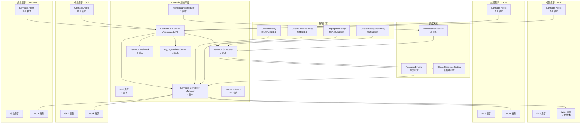

> **生产环境安全提示**
>
> 本文档包含可直接执行的运维命令。执行前请确认：当前目标集群与 Namespace 是否正确；是否具备足够的 RBAC 权限；是否已在非生产环境验证。命令风险等级标注：🔴 高风险（可能造成数据丢失或服务中断）、🟡 中风险（会修改集群状态，但通常可回滚）、🟢 低风险/只读（信息收集，无副作用）。


# [[Karmada|Karmada]] 多集群联邦深度实践

<!-- chunk: 概述 -->## 概述

Karmada（[[Kubernetes|Kubernetes]] [[Armada|Armada]]）是华为云开源的多云多集群 Kubernetes 编排引擎，已捐赠至 CNCF 成为 Incubating 项目。Karmada 提供了 Kubernetes 原生的多云管理 API，通过 PropagationPolicy 和 OverridePolicy 实现精细化的跨集群工作负载分发和配置覆盖。Karmada 的生产用户包括华为、vivo、美团、字节跳动、中国工商银行等大型企业，在金融、互联网、制造等行业积累了丰富的生产实践经验。

Karmada 的核心设计理念是"Kubernetes Native"——通过 CRD 和 Aggregated API Server [[17-系统基础/06-知识字典/fundamentals/the-kubernetes-api.md|扩展 Kubernetes API]]PI|Kubernetes API]]，用户无需学习新的 API 概念即可管理多云环境。Karmada 支持多种调度策略：静态权重、动态资源感知、亲和性/反亲和性、以及基于故障域的智能调度。问题自动转移机制能够在成员集群不可用时，自动将工作负载迁移到健康的集群，确保业务连续性。多集群服务发现（MultiClusterService）允许跨集群的服务发现和负载均衡，使得应用可以透明地访问跨集群的服务。

本文档深入探讨 Karmada 的架构设计、资源传播机制、故障转移策略和生产级部署实践。内容涵盖完整的控制平面部署、成员集群注册、策略配置、监控告警和运维自动化脚本，为企业构建基于 Karmada 的多云管理平台提供全面参考。

## Karmada 核心特性

| 特性 | 说明 | 适用场景 |
|:---|:---|:---|
| Kubernetes 原生 API | 通过 CRD 扩展，学习成本低 | 已有 K8s 经验的团队 |
| PropagationPolicy | 定义工作负载跨集群分发策略 | 多集群应用部署 |
| OverridePolicy | 按集群覆盖配置（镜像、副本数、环境变量等） | 跨云差异化配置 |
| 多调度策略 | 静态权重、动态资源、亲和性、故障域 | 灵活的调度需求 |
| 问题自动转移 | 集群问题时自动迁移工作负载 | 高可用、灾备 |
| 多集群服务发现 | MultiClusterService 跨集群服务暴露 | 跨集群微服务通信 |
| Federation API | 统一的多集群资源查询和管理 | 集中运维管理 |
| WorkloadRebalancer | 工作负载再平衡 | 资源优化、集群维护 |

<!-- chunk: 架构设计 -->## 架构设计

## Karmada 架构总览



## Karmada 控制平面部署

```yaml
apiVersion: v1
kind: Namespace
metadata:
  name: karmada-system
---
apiVersion: v1
kind: ConfigMap
metadata:
  name: karmada-controllers-config
  namespace: karmada-system
data:
  controllermanager.config: |
    apiVersion: config.karmada.io/v1alpha1
    kind: KarmadaControllerManagerConfiguration
    controllers:
      cluster:
        concurrentWorkloads: 10
        syncPeriod: 30s
      binding:
        concurrentWorkloads: 10
      execution:
        concurrentWorkloads: 10
      workStatus:
        concurrentWorkloads: 10
---
apiVersion: helm.cattle.io/v1
kind: HelmChart
metadata:
  name: karmada
  namespace: karmada-system
spec:
  repo: https://raw.githubusercontent.com/karmada-io/karmada/main/charts
  chart: karmada
  targetNamespace: karmada-system
  valuesContent: |
    components:
      etcd:
        replicaCount: 3
        persistence:
          enabled: true
          storageClass: standard
          size: 20Gi
        resources:
          requests:
            cpu: 200m
            memory: 256Mi
          limits:
            cpu: "1"
            memory: 1Gi
        extraArgs:
          auto-compaction-mode: revision
          auto-compaction-retention: "1000"
          snapshot-count: "5000"

      karmadaAPIServer:
        replicaCount: 3
        service:
          type: LoadBalancer
          annotations:
            service.beta.kubernetes.io/aws-load-balancer-type: nlb
        resources:
          requests:
            cpu: 200m
            memory: 256Mi
          limits:
            cpu: "1"
            memory: 1Gi
        extraArgs:
          enable-admission-plugins: "NodeRestriction,ServiceAccount"
          max-requests-inflight: "1000"
          max-mutating-requests-inflight: "500"

      karmadaControllerManager:
        replicaCount: 2
        resources:
          requests:
            cpu: 200m
            memory: 256Mi
          limits:
            cpu: "1"
            memory: 1Gi

      karmadaScheduler:
        replicaCount: 2
        resources:
          requests:
            cpu: 200m
            memory: 256Mi
          limits:
            cpu: "1"
            memory: 1Gi

      karmadaDescheduler:
        replicaCount: 1
        enabled: true
        resources:
          requests:
            cpu: 100m
            memory: 128Mi
          limits:
            cpu: 500m
            memory: 512Mi

      karmadaWebhook:
        replicaCount: 2
        resources:
          requests:
            cpu: 100m
            memory: 128Mi
          limits:
            cpu: 500m
            memory: 256Mi

      karmadaAggregatedAPIServer:
        replicaCount: 2
        resources:
          requests:
            cpu: 200m
            memory: 256Mi
          limits:
            cpu: "1"
            memory: 1Gi

      karmadaAgent:
        enabled: false
```

## 注册成员集群

``` bash
# 🟢 低风险：只读/信息收集，通常无副作用
#!/bin/bash
set -euo pipefail

KARMADA_KUBECONFIG="/etc/karmada/karmada-apiserver.config"

echo "=== 注册成员集群到 Karmada ==="
echo "时间: $(date '+%Y-%m-%d %H:%M:%S')"

echo "[1] 注册 AWS EKS 集群"
karmadactl join aws-cluster \
    --kubeconfig $KARMADA_KUBECONFIG \
    --cluster-kubeconfig /etc/karmada/aws-cluster.config \
    --cluster-context aws-eks-context \
    --cluster-provider aws \
    --cluster-region us-west-2

echo "[2] 注册 Azure AKS 集群"
karmadactl join azure-cluster \
    --kubeconfig $KARMADA_KUBECONFIG \
    --cluster-kubeconfig /etc/karmada/azure-cluster.config \
    --cluster-context azure-aks-context \
    --cluster-provider azure \
    --cluster-region eastus

echo "[3] 注册 GCP GKE 集群"
karmadactl join gke-cluster \
    --kubeconfig $KARMADA_KUBECONFIG \
    --cluster-kubeconfig /etc/karmada/gke-cluster.config \
    --cluster-context gke-context \
    --cluster-provider gcp \
    --cluster-region us-central1

echo "[4] 注册本地集群"
karmadactl join onprem-cluster \
    --kubeconfig $KARMADA_KUBECONFIG \
    --cluster-kubeconfig /etc/karmada/onprem-cluster.config \
    --cluster-context onprem-context

echo "[5] 为集群设置标签"
kubectl --kubeconfig $KARMADA_KUBECONFIG label cluster aws-cluster \
    environment=production provider=aws region=us-west-2 --overwrite

kubectl --kubeconfig $KARMADA_KUBECONFIG label cluster azure-cluster \
    environment=production provider=azure region=eastus --overwrite

kubectl --kubeconfig $KARMADA_KUBECONFIG label cluster gke-cluster \
    environment=production provider=gcp region=us-central1 --overwrite

kubectl --kubeconfig $KARMADA_KUBECONFIG label cluster onprem-cluster \
    environment=production provider=onprem region=local --overwrite

echo "[6] 验证集群注册"
karmadactl get clusters --kubeconfig $KARMADA_KUBECONFIG

echo "[7] 查看集群资源"
kubectl --kubeconfig $KARMADA_KUBECONFIG get clusters -o wide

echo "=== 集群注册完成 ==="
```
<!-- chunk: 核心组件配置 -->## 核心组件配置

## PropagationPolicy 资源分发策略

```yaml
apiVersion: policy.karmada.io/v1alpha1
kind: PropagationPolicy
metadata:
  name: web-application-propagation
  namespace: production
spec:
  resourceSelectors:
  - apiVersion: apps/v1
    kind: Deployment
    name: web-application
  - apiVersion: v1
    kind: Service
    name: web-application-svc
  - apiVersion: networking.k8s.io/v1
    kind: Ingress
    name: web-application-ingress
  - apiVersion: v1
    kind: ConfigMap
    name: web-application-config
  - apiVersion: v1
    kind: Secret
    name: web-application-secrets

  placement:
    clusterAffinity:
      clusterNames:
      - aws-cluster
      - azure-cluster
      - gke-cluster
      - onprem-cluster
      exclude:
      - clusterNames:
        - onprem-cluster

    clusterTolerations:
    - key: "cluster.karmada.io/not-ready"
      operator: "Exists"
      effect: "NoExecute"
      tolerationSeconds: 300
    - key: "cluster.karmada.io/unreachable"
      operator: "Exists"
      effect: "NoExecute"
      tolerationSeconds: 300

    replicaScheduling:
      replicaDivisionPreference: Weighted
      replicaSchedulingType: Divided
      weightPreference:
        staticWeightList:
        - targetCluster:
            clusterNames:
            - aws-cluster
          weight: 2
        - targetCluster:
            clusterNames:
            - azure-cluster
          weight: 1
        - targetCluster:
            clusterNames:
            - gke-cluster
          weight: 1
        dynamicWeight: AvailableReplicas

    spreadConstraints:
    - spreadByField: cluster
      maxGroups: 3
      minGroups: 2
    - spreadByField: region
      maxGroups: 3
      minGroups: 1

  dependentOverrides:
  - web-application-override
---
apiVersion: policy.karmada.io/v1alpha1
kind: PropagationPolicy
metadata:
  name: database-propagation
  namespace: production
spec:
  resourceSelectors:
  - apiVersion: apps/v1
    kind: StatefulSet
    name: postgresql
  - apiVersion: v1
    kind: Service
    name: postgresql-svc
  - apiVersion: v1
    kind: ConfigMap
    name: postgresql-config

  placement:
    clusterAffinity:
      clusterNames:
      - aws-cluster

    replicaScheduling:
      replicaDivisionPreference: Aggregated
      replicaSchedulingType: Divided
---
apiVersion: policy.karmada.io/v1alpha1
kind: PropagationPolicy
metadata:
  name: redis-propagation
  namespace: production
spec:
  resourceSelectors:
  - apiVersion: apps/v1
    kind: Deployment
    name: redis-cluster
  - apiVersion: v1
    kind: Service
    name: redis-cluster-svc

  placement:
    clusterAffinity:
      labelSelector:
        matchLabels:
          environment: production
          provider: aws

    replicaScheduling:
      replicaDivisionPreference: Duplicated
      replicaSchedulingType: Duplicated
```

## OverridePolicy 配置覆盖策略

```yaml
apiVersion: policy.karmada.io/v1alpha1
kind: OverridePolicy
metadata:
  name: web-application-override
  namespace: production
spec:
  resourceSelectors:
  - apiVersion: apps/v1
    kind: Deployment
    name: web-application
  - apiVersion: v1
    kind: ConfigMap
    name: web-application-config

  overrideRules:
  - targetCluster:
      clusterNames:
      - aws-cluster
    overriders:
      plaintext:
      - path: "/spec/template/spec/containers/0/image"
        operation: replace
        value: "123456789012.dkr.ecr.us-west-2.amazonaws.com/web-app:v2.0.0"
      - path: "/data/AWS_REGION"
        operation: add
        value: "us-west-2"
      - path: "/spec/template/spec/serviceAccountName"
        operation: replace
        value: "aws-workload-sa"

  - targetCluster:
      clusterNames:
      - azure-cluster
    overriders:
      plaintext:
      - path: "/spec/template/spec/containers/0/image"
        operation: replace
        value: "myacr.azurecr.io/web-app:v2.0.0"
      - path: "/data/AZURE_REGION"
        operation: add
        value: "eastus"
      - path: "/spec/template/spec/serviceAccountName"
        operation: replace
        value: "azure-workload-sa"

  - targetCluster:
      clusterNames:
      - gke-cluster
    overriders:
      plaintext:
      - path: "/spec/template/spec/containers/0/image"
        operation: replace
        value: "gcr.io/production-project/web-app:v2.0.0"
      - path: "/spec/template/spec/serviceAccountName"
        operation: replace
        value: "gcp-workload-sa"
---
apiVersion: policy.karmada.io/v1alpha1
kind: OverridePolicy
metadata:
  name: replica-override
  namespace: production
spec:
  resourceSelectors:
  - apiVersion: apps/v1
    kind: Deployment
    name: web-application

  overrideRules:
  - targetCluster:
      clusterNames:
      - aws-cluster
    overriders:
      plaintext:
      - path: "/spec/replicas"
        operation: replace
        value: 6

  - targetCluster:
      clusterNames:
      - azure-cluster
    overriders:
      plaintext:
      - path: "/spec/replicas"
        operation: replace
        value: 3

  - targetCluster:
      clusterNames:
      - gke-cluster
    overriders:
      plaintext:
      - path: "/spec/replicas"
        operation: replace
        value: 3
---
apiVersion: policy.karmada.io/v1alpha1
kind: ClusterPropagationPolicy
metadata:
  name: cluster-wide-resources
spec:
  resourceSelectors:
  - apiVersion: rbac.authorization.k8s.io/v1
    kind: ClusterRole
    name: prometheus-reader
  - apiVersion: rbac.authorization.k8s.io/v1
    kind: ClusterRoleBinding
    name: prometheus-reader-binding
  - apiVersion: storage.k8s.io/v1
    kind: StorageClass
    name: standard

  placement:
    clusterAffinity:
      clusterNames:
      - aws-cluster
      - azure-cluster
      - gke-cluster
---
apiVersion: policy.karmada.io/v1alpha1
kind: ClusterPropagationPolicy
metadata:
  name: kyverno-policies
spec:
  resourceSelectors:
  - apiVersion: kyverno.io/v1
    kind: ClusterPolicy
  placement:
    clusterAffinity:
      labelSelector:
        matchLabels:
          environment: production
```

<!-- chunk: 故障转移配置 -->## 故障转移配置

## 自动故障转移

```yaml
apiVersion: policy.karmada.io/v1alpha1
kind: PropagationPolicy
metadata:
  name: ha-application-propagation
  namespace: production
spec:
  resourceSelectors:
  - apiVersion: apps/v1
    kind: Deployment
    name: ha-application
  - apiVersion: v1
    kind: Service
    name: ha-application-svc

  placement:
    clusterAffinity:
      clusterNames:
      - aws-cluster
      - azure-cluster
      - gke-cluster

    clusterTolerations:
    - key: "cluster.karmada.io/not-ready"
      operator: "Exists"
      effect: "NoExecute"
      tolerationSeconds: 120
    - key: "cluster.karmada.io/unreachable"
      operator: "Exists"
      effect: "NoExecute"
      tolerationSeconds: 120

    replicaScheduling:
      replicaDivisionPreference: Weighted
      replicaSchedulingType: Divided
      weightPreference:
        dynamicWeight: AvailableReplicas

    spreadConstraints:
    - spreadByField: cluster
      maxGroups: 3
      minGroups: 2
---
apiVersion: apps/v1
kind: Deployment
metadata:
  name: ha-application
  namespace: production
spec:
  replicas: 12
  selector:
    matchLabels:
      app: ha-application
  template:
    metadata:
      labels:
        app: ha-application
    spec:
      containers:
      - name: app
        image: app:latest
        resources:
          requests:
            cpu: "100m"
            memory: "128Mi"
          limits:
            cpu: "500m"
            memory: "512Mi"
        ports:
        - containerPort: 8080
        livenessProbe:
          httpGet:
            path: /healthz
            port: 8080
          initialDelaySeconds: 10
          periodSeconds: 10
        readinessProbe:
          httpGet:
            path: /readyz
            port: 8080
          initialDelaySeconds: 5
          periodSeconds: 5
---
apiVersion: policy/v1
kind: PodDisruptionBudget
metadata:
  name: ha-application-pdb
  namespace: production
spec:
  minAvailable: "66%"
  selector:
    matchLabels:
      app: ha-application
```

## WorkloadRebalancer 工作负载再平衡

```yaml
apiVersion: apps.karmada.io/v1alpha1
kind: WorkloadRebalancer
metadata:
  name: application-rebalancer
spec:
  rebalanceWith:
    deploymentList:
    - name: web-application
      namespace: production
    - name: ha-application
      namespace: production
    statefulSetList:
    - name: postgresql
      namespace: production
  TTLSecondsAfterFinished: 3600
```

## 多集群服务发现

```yaml
apiVersion: networking.karmada.io/v1alpha1
kind: MultiClusterService
metadata:
  name: web-application-mcs
  namespace: production
spec:
  types:
  - CrossCluster
  ports:
  - name: http
    port: 80
    targetPort: 8080
    protocol: TCP
  - name: grpc
    port: 9090
    targetPort: 9090
    protocol: TCP
---
apiVersion: policy.karmada.io/v1alpha1
kind: PropagationPolicy
metadata:
  name: mcs-endpoint-propagation
  namespace: production
spec:
  resourceSelectors:
  - apiVersion: discovery.k8s.io/v1
    kind: EndpointSlice
  placement:
    clusterAffinity:
      clusterNames:
      - aws-cluster
      - azure-cluster
      - gke-cluster
```

<!-- chunk: 监控告警 -->## 监控告警

## Karmada 控制平面监控

```yaml
apiVersion: monitoring.coreos.com/v1
kind: PrometheusRule
metadata:
  name: karmada-alert-rules
  namespace: karmada-system
spec:
  groups:
  - name: karmada.control_plane.rules
    rules:
    - alert: KarmadaClusterUnhealthy
      expr: karmada_cluster_status_condition{condition="Ready",status="False"} == 1
      for: 5m
      labels:
        severity: critical
        team: platform
      annotations:
        summary: "成员集群不健康"
        description: "集群 {{ $labels.cluster }} 不健康已超过 5 分钟"
        runbook_url: "https://wiki.company.com/runbooks/karmada-cluster-unhealthy"

    - alert: KarmadaClusterUnreachable
      expr: karmada_cluster_status_condition{condition="APIEnablement",status="False"} == 1
      for: 10m
      labels:
        severity: critical
        team: platform
      annotations:
        summary: "成员集群 API 不可达"
        description: "集群 {{ $labels.cluster }} API 不可达超过 10 分钟"

    - alert: KarmadaWorkDispatchFailed
      expr: rate(karmada_work_dispatch_failed_total[5m]) > 0
      for: 5m
      labels:
        severity: warning
        team: platform
      annotations:
        summary: "工作负载分发失败"
        description: "工作负载分发到集群 {{ $labels.cluster }} 失败"

    - alert: KarmadaSchedulerUnhealthy
      expr: up{job="karmada-scheduler"} == 0
      for: 5m
      labels:
        severity: critical
        team: platform
      annotations:
        summary: "Karmada 调度器不可用"

    - alert: KarmadaControllerManagerUnhealthy
      expr: up{job="karmada-controller-manager"} == 0
      for: 5m
      labels:
        severity: critical
        team: platform
      annotations:
        summary: "Karmada Controller Manager 不可用"

    - alert: KarmadaReplicaMismatch
      expr: |
        karmada_resource_binding_replicas{replica_type="desired"} != 
        karmada_resource_binding_replicas{replica_type="scheduled"}
      for: 10m
      labels:
        severity: warning
        team: platform
      annotations:
        summary: "副本调度不一致"
        description: "资源 {{ $labels.namespace }}/{{ $labels.name }} 的期望副本数与调度副本数不一致"

    - alert: KarmadaEtcdHighLatency
      expr: histogram_quantile(0.99, rate(etcd_request_duration_seconds_bucket[5m])) > 0.5
      for: 10m
      labels:
        severity: warning
        team: platform
      annotations:
        summary: "Karmada etcd 延迟过高"
        description: "etcd P99 延迟超过 500ms"

    - alert: KarmadaEtcdHighMemory
      expr: process_resident_memory_bytes{job="karmada-etcd"} > 1073741824
      for: 10m
      labels:
        severity: warning
        team: platform
      annotations:
        summary: "Karmada etcd 内存使用过高"
        description: "etcd 内存使用超过 1GB"

    - alert: KarmadaWorkQueueHighDepth
      expr: workqueue_depth{job=~"karmada.*"} > 100
      for: 10m
      labels:
        severity: warning
        team: platform
      annotations:
        summary: "Karmada 工作队列积压"
        description: "{{ $labels.job }} 的工作队列深度超过 100"

    - alert: KarmadaAPI ServerHighLatency
      expr: histogram_quantile(0.99, rate(apiserver_request_duration_seconds_bucket{job="karmada-apiserver"}[5m])) > 1
      for: 10m
      labels:
        severity: warning
        team: platform
      annotations:
        summary: "Karmada API Server 延迟过高"
        description: "API Server P99 延迟超过 1 秒"
```

<!-- chunk: 运维管理 -->## 运维管理

## Karmada 日常运维脚本

``` bash
# 🟢 低风险：只读/信息收集，通常无副作用
#!/bin/bash
set -euo pipefail

KARMADA_KUBECONFIG="/etc/karmada/karmada-apiserver.config"

echo "=== Karmada 多集群运维 ==="
echo "时间: $(date '+%Y-%m-%d %H:%M:%S')"

echo -e "\n[1] 成员集群状态"
kubectl --kubeconfig $KARMADA_KUBECONFIG get clusters -o wide

echo -e "\n[2] 集群资源概览"
for cluster in $(kubectl --kubeconfig $KARMADA_KUBECONFIG get clusters -o name | cut -d'/' -f2); do
    echo "--- $cluster ---"
    karmadactl get nodes --cluster $cluster --kubeconfig $KARMADA_KUBECONFIG 2>/dev/null | head -5
done

echo -e "\n[3] PropagationPolicy 列表"
kubectl --kubeconfig $KARMADA_KUBECONFIG get propagationpolicies -A

echo -e "\n[4] OverridePolicy 列表"
kubectl --kubeconfig $KARMADA_KUBECONFIG get overridepolicies -A

echo -e "\n[5] 工作负载绑定状态"
kubectl --kubeconfig $KARMADA_KUBECONFIG get resourcebindings -A

echo -e "\n[6] 跨集群 Pod 分布"
for cluster in $(kubectl --kubeconfig $KARMADA_KUBECONFIG get clusters -o name | cut -d'/' -f2); do
    echo "--- $cluster ---"
    karmadactl get pods -n production --cluster $cluster --kubeconfig $KARMADA_KUBECONFIG 2>/dev/null | head -10
done

echo -e "\n[7] 不健康集群检查"
UNHEALTHY=$(kubectl --kubeconfig $KARMADA_KUBECONFIG get clusters -o json | \
    jq -r '.items[] | select(.status.conditions[] | select(.type=="Ready" and .status=="False")) | .metadata.name')
if -n "$UNHEALTHY"; then
    echo "不健康集群: $UNHEALTHY"
else
    echo "所有集群健康"
fi

echo -e "\n[8] 调度器日志"
kubectl --kubeconfig $KARMADA_KUBECONFIG logs -n karmada-system -l app=karmada-scheduler --tail=20

echo -e "\n[9] 控制平面组件状态"
kubectl --kubeconfig $KARMADA_KUBECONFIG get pods -n karmada-system -o wide

echo -e "\n[10] Work 资源统计"
kubectl --kubeconfig $KARMADA_KUBECONFIG get work -A --no-headers | wc -l
echo "Work 资源总数"

echo "=== 运维检查完成 ==="
```
## 工作负载迁移脚本

``` bash
# 🟢 低风险：只读/信息收集，通常无副作用
#!/bin/bash
set -euo pipefail

KARMADA_KUBECONFIG="/etc/karmada/karmada-apiserver.config"
SOURCE_CLUSTER="$1"
TARGET_CLUSTER="$2"
NAMESPACE="$3"
WORKLOAD_NAME="$4"

echo "=== 工作负载跨集群迁移 ==="
echo "从 $SOURCE_CLUSTER 迁移 $NAMESPACE/$WORKLOAD_NAME 到 $TARGET_CLUSTER"

echo "[1] 检查源集群工作负载状态"
karmadactl get deployment $WORKLOAD_NAME -n $NAMESPACE \
    --cluster $SOURCE_CLUSTER --kubeconfig $KARMADA_KUBECONFIG

echo "[2] 检查目标集群就绪状态"
karmadactl get nodes --cluster $TARGET_CLUSTER --kubeconfig $KARMADA_KUBECONFIG | head -5

echo "[3] 更新 OverridePolicy 调整副本分布"
kubectl --kubeconfig $KARMADA_KUBECONFIG patch overridepolicy ${WORKLOAD_NAME}-override \
    -n $NAMESPACE --type merge -p "
{
  \"spec\": {
    \"overrideRules\": [
      {
        \"targetCluster\": {\"clusterNames\": [\"$SOURCE_CLUSTER\"]},
        \"overriders\": {
          \"plaintext\": [{\"path\": \"/spec/replicas\", \"operation\": \"replace\", \"value\": 0}]
        }
      },
      {
        \"targetCluster\": {\"clusterNames\": [\"$TARGET_CLUSTER\"]},
        \"overriders\": {
          \"plaintext\": [{\"path\": \"/spec/replicas\", \"operation\": \"replace\", \"value\": 6}]
        }
      }
    ]
  }
}"

echo "[4] 等待迁移完成"
sleep 30

echo "[5] 验证源集群副本已缩为 0"
karmadactl get deployment $WORKLOAD_NAME -n $NAMESPACE \
    --cluster $SOURCE_CLUSTER --kubeconfig $KARMADA_KUBECONFIG

echo "[6] 验证目标集群"
karmadactl get deployment $WORKLOAD_NAME -n $NAMESPACE \
    --cluster $TARGET_CLUSTER --kubeconfig $KARMADA_KUBECONFIG

echo "=== 迁移完成 ==="
```
<!-- chunk: 最佳实践 -->## 最佳实践

## 调度策略最佳实践

| 策略 | 说明 | 适用场景 |
|:---|:---|:---|
| dynamicWeight: AvailableReplicas | 基于各集群可用资源动态分配 | 通用生产环境 |
| staticWeight + dynamicWeight | 静态权重基础 + 动态资源感知 | 需要优先级的生产环境 |
| spreadConstraints | 确保跨集群最低分布 | 高可用要求 |
| clusterAffinity + labelSelector | 按标签选择目标集群 | 灵活的集群分组 |
| clusterTolerations | 设置问题容忍时间 | 灾备故障转移 |

## 高可用最佳实践

1. **控制平面 3 副本**: Karmada etcd 和 API Server 部署 3 副本
2. **多区域部署**: Karmada 控制平面跨可用区部署
3. **独立集群**: Karmada 控制平面部署在独立的管理集群
4. **备份策略**: 定期备份 Karmada etcd 数据
5. **tolerationSeconds**: 设置合理的容忍度，避免网络抖动触发误迁移

## 运维最佳实践

1. **Pull 模式**: 生产环境使用 Pull 模式（karmada-agent），降低控制平面负载
2. **OverridePolicy 粒度**: 按镜像仓库、副本数、环境变量分别配置
3. **CI/CD 集成**: 通过 Argo CD 管理 PropagationPolicy 和 OverridePolicy
4. **监控告警**: 部署 Karmada 控制平面和成员集群的完整监控
5. **定期演练**: 每季度执行故障转移演练

<!-- chunk: 故障排查 -->## 故障排查

## 常见问题

| 问题 | 原因 | 解决方案 | 诊断命令 |
|:---|:---|:---|:---|
| 工作负载未分发 | PropagationPolicy 匹配失败 | 检查 resourceSelectors | `kubectl get resourcebinding -A` |
| 副本分布不均 | 权重配置不合理 | 检查 weightPreference | `kubectl describe resourcebinding <name>` |
| 集群注册失败 | kubeconfig 无效或网络不通 | 验证 kubeconfig | `karmadactl get clusters` |
| Override 不生效 | dependentOverrides 未声明 | 检查 dependentOverrides 字段 | `kubectl describe pp <name>` |
| 问题未转移 | tolerationSeconds 过长 | 调整 tolerationSeconds | `kubectl describe cluster <name>` |
| API Server 压力大 | 成员集群过多 | 增加资源或启用缓存 | `kubectl top pods -n karmada-system` |
| Work 状态不更新 | Agent 连接异常 | 检查 karmada-agent 日志 | `kubectl logs -n karmada-system -l app=karmada-agent` |
| 调度器无法调度 | 资源不足或策略冲突 | 检查调度器日志 | `kubectl logs -n karmada-system -l app=karmada-scheduler` |

## 调试命令

``` bash
# 🟢 低风险：只读/信息收集，通常无副作用
KARMADA_KUBECONFIG="/etc/karmada/karmada-apiserver.config"

echo "=== Karmada 调试命令集合 ==="

echo "[1] 查看工作负载调度结果"
kubectl --kubeconfig $KARMADA_KUBECONFIG get resourcebinding -A
kubectl --kubeconfig $KARMADA_KUBECONFIG describe resourcebinding <name> -n <ns>

echo "[2] 查看集群调度详情"
kubectl --kubeconfig $KARMADA_KUBECONFIG get cluster <name> -o yaml

echo "[3] 查看分发到集群的 Work 资源"
kubectl --kubeconfig $KARMADA_KUBECONFIG get work -A
kubectl --kubeconfig $KARMADA_KUBECONFIG describe work <name> -n karmada-es-<cluster>

echo "[4] 调度器日志"
kubectl --kubeconfig $KARMADA_KUBECONFIG logs -n karmada-system -l app=karmada-scheduler --tail=100

echo "[5] Controller Manager 日志"
kubectl --kubeconfig $KARMADA_KUBECONFIG logs -n karmada-system -l app=karmada-controller-manager --tail=100

echo "[6] 查看策略详情"
kubectl --kubeconfig $KARMADA_KUBECONFIG get propagationpolicies -A -o yaml
kubectl --kubeconfig $KARMADA_KUBECONFIG get overridepolicies -A -o yaml
```
<!-- chunk: 参考资源 -->## 参考资源

- [Karmada 官方文档](https://karmada.io/docs/)
- [Karmada GitHub](https://github.com/karmada-io/karmada)
- [Karmada 调度策略](https://karmada.io/docs/userguide/scheduling/schedule-policy)
- [Karmada 故障转移](https://karmada.io/docs/userguide/failover/)
- [Karmada 多集群服务](https://karmada.io/docs/userguide/service/multiclusterservice)
- [Karmada 生产实践](https://karmada.io/docs/best-practices/)

---

**文档版本**: v2.0
**最后更新**: 2026年5月17日
**适用版本**: Karmada v1.8+

---

<!-- chunk: Obsidian 相关文档 -->## Obsidian 相关文档

- domain-27-multi-cloud-hybrid MOC
- [[18-云厂商/README.md|Domain 12: 多云与混合云架构管理]]
- Domain-27 多云与混合云 — 开源项目索引
- AWS EKS 企业级多云管理平台
- Azure AKS 企业级多云管理平台
- 企业级多云治理与成本优化深度实践
- Google GKE 企业级多云管理深度实践
- IBM Cloud Kubernetes Service (IKS) 企业级深度实践
- Alibaba Cloud ACK 企业级混合云深度实践
- 华为云 CCE 企业级容器平台深度实践
- 多云网络互联深度实践
- 多云灾备深度实践

## See Also

- 06-alibaba-ack-enterprise-hybrid
- 07-huawei-cce-enterprise
- 09-multicloud-network-interconnect
- 10-multicloud-disaster-recovery


<!-- risk-assessed -->
