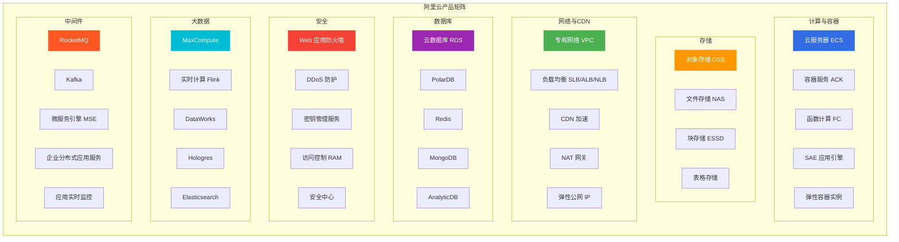
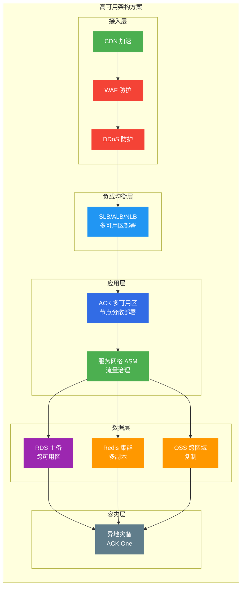
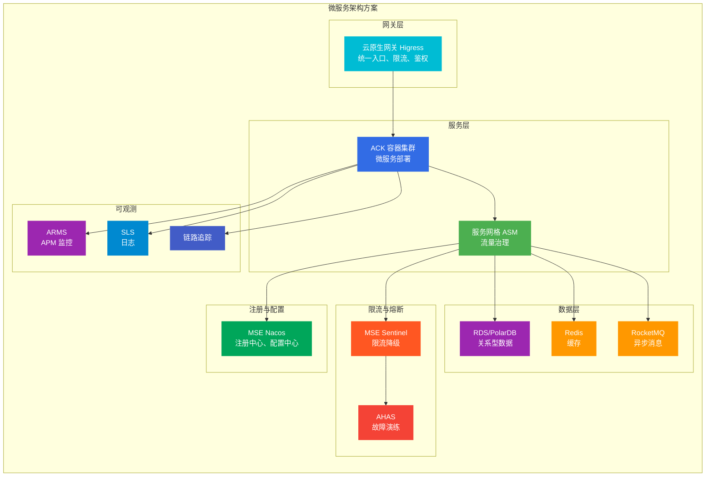
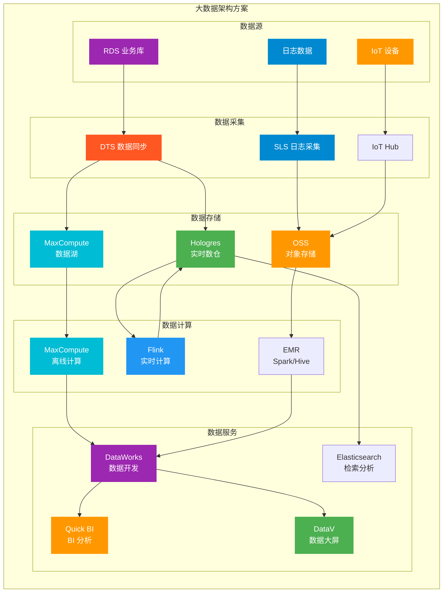
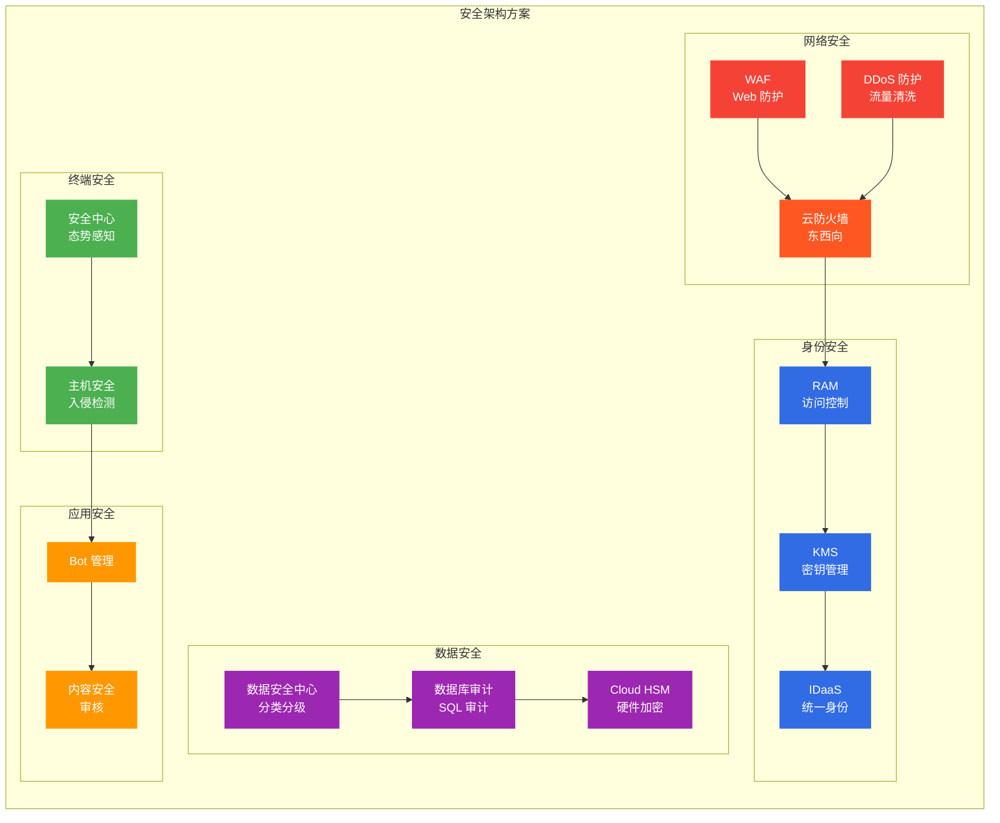
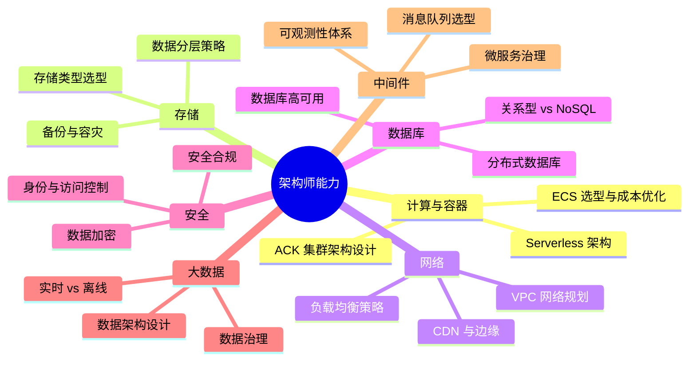

# 阿里云云原生产品全景

> 面向架构师面试准备的阿里云全产品线参考指南。

## 产品矩阵总览

阿里云产品按功能域分为七大类：

---

## 一、计算与容器

### 1.1 弹性计算

| 产品 | 英文缩写 | 定位 | 典型场景 |
|------|----------|------|----------|
| **云服务器 ECS** | ECS | 弹性可伸缩的计算服务 | Web 应用、企业应用、开发测试 |
| **弹性裸金属服务器** | EBMM | 物理机性能 + 云弹性 | 高性能计算、大数据、数据库 |
| **GPU 云服务器** | GPU ECS | GPU 加速计算 | 深度学习训练、图形渲染、科学计算 |
| **弹性伸缩** | AS | 自动调整 ECS 数量 | 业务高峰扩容、低谷缩容 |
| **Auto Scaling** | - | 智能弹性策略 | 预测性伸缩、定时策略 |

### 1.2 容器服务

| 产品 | 英文缩写 | 定位 | 典型场景 |
|------|----------|------|----------|
| **容器服务 Kubernetes 版** | ACK | 托管 K8s 集群 | 微服务、CI/CD、混合云 |
| **ACK Edge 集群** | ACK Edge | 边缘计算 | IoT、CDN 节点、边缘推理 |
| **ACK 灵骏集群** | ACK Lingjun | GPU/异构计算 | AI 训练、大规模并行计算 |
| **ACK Serverless** | ASK | 无服务器 K8s | 事件驱动、突发流量 |
| **容器计算服务** | ACS | K8s 算力供给 | Serverless 化工作负载 |
| **容器镜像服务** | ACR | 镜像托管 | 安全扫描、全球分发 |
| **分布式云容器平台** | ACK One | 多集群统一管控 | 混合云、容灾 |
| **服务网格** | ASM | Istio 托管服务 | 微服务流量治理 |
| **弹性容器实例** | ECI | 免基础设施容器 | 弹性伸缩、CI/CD |

### 1.3 Serverless

| 产品 | 英文缩写 | 定位 | 典型场景 |
|------|----------|------|----------|
| **函数计算** | FC | 事件驱动计算 | 图片处理、消息消费、API 后端 |
| **Serverless 应用引擎** | SAE | 应用级 PaaS | Spring Cloud/Dubbo 迁移 |
| **Serverless 工作流** | Serverless Workflow | 任务编排 | 数据处理、业务流程 |

---

## 二、存储

### 2.1 对象存储

| 产品 | 英文缩写 | 定位 | 典型场景 |
|------|----------|------|----------|
| **对象存储 OSS** | OSS | 海量非结构化数据 | 图片、视频、备份、大数据湖 |
| **智能媒体管理** | IMM | 媒体数据处理 | 图片识别、视频截帧、文档预览 |
| **OSS 桶复制** | - | 跨区域复制 | 容灾、合规 |

### 2.2 块存储

| 产品 | 英文缩写 | 定位 | 典型场景 |
|------|----------|------|----------|
| **云盘** | Cloud Disk | 块存储 | 系统盘、数据盘 |
| **ESSD 云盘** | ESSD | 极速 SSD | 数据库、高 IOPS 应用 |
| **本地盘** | Local Disk | 低延迟存储 | 大数据、缓存 |

### 2.3 文件存储

| 产品 | 英文缩写 | 定位 | 典型场景 |
|------|----------|------|----------|
| **文件存储 NAS** | NAS | 共享文件存储 | 容器共享、办公文档、媒体处理 |
| **极速型 NAS** | CPFS | 并行文件系统 | 高性能计算、AI 训练 |
| **文件存储 HDFS** | - | Hadoop 兼容 | 大数据分析 |

### 2.4 表格与数据库存储

| 产品 | 英文缩写 | 定位 | 典型场景 |
|------|----------|------|----------|
| **表格存储** | TableStore | NoSQL 宽表 | 物联网、社交、游戏 |
| **表格存储时序版** | TSDB | 时序数据 | 监控、IoT 时序数据 |

### 2.5 归档与备份

| 产品 | 英文缩写 | 定位 | 典型场景 |
|------|----------|------|----------|
| **归档存储** | Archive Storage | 低成本长期存储 | 合规归档、日志备份 |
| **冷归档存储** | Cold Archive | 极低成本 | 7 年以上归档 |
| **混合云容灾服务** | HDR | 容灾备份 | 跨云容灾、数据保护 |

---

## 三、网络与 CDN

### 3.1 云上网络

| 产品 | 英文缩写 | 定位 | 典型场景 |
|------|----------|------|----------|
| **专有网络 VPC** | VPC | 隔离网络环境 | 企业网络、多租户隔离 |
| **交换机** | VSwitch | 子网 | 可用区网络划分 |
| **路由表** | - | 路由控制 | 流量调度、网络隔离 |
| **弹性公网 IP** | EIP | 公网 IP | ECS 公网访问 |
| **NAT 网关** | NAT Gateway | 地址转换 | 公网出口、安全访问 |
| **私网连接** | PrivateLink | 私网访问 | 访问云服务、跨 VPC |

### 3.2 负载均衡

| 产品 | 英文缩写 | 定位 | 典型场景 |
|------|----------|------|----------|
| **负载均衡 SLB** | SLB | 四层/七层负载 | Web 应用、高可用 |
| **应用型负载均衡 ALB** | ALB | 七层负载 | HTTP/HTTPS、WebSocket |
| **网络型负载均衡 NLB** | NLB | 四层负载 | TCP/UDP、高并发 |
| **网关型负载均衡 GWLB** | GWLB | 网关负载 | 安全设备、透明代理 |

### 3.3 CDN 与边缘

| 产品 | 英文缩写 | 定位 | 典型场景 |
|------|----------|------|----------|
| **CDN** | CDN | 内容分发 | 网站加速、视频点播 |
| **全站加速** | DCDN | 动静分离 | 动态内容加速 |
| **边缘节点服务** | ENS | 边缘计算 | 低延迟、IoT |
| **安全加速 SCDN** | SCDN | 安全加速 | DDoS 防护 + CDN |

### 3.4 网络安全

| 产品 | 英文缩写 | 定位 | 典型场景 |
|------|----------|------|----------|
| **Web 应用防火墙** | WAF | Web 安全 | SQL 注入、XSS 防护 |
| **DDoS 防护** | DDoS | 流量清洗 | 大流量攻击防护 |
| **云防火墙** | Cloud Firewall | 东西向防火墙 | VPC 间访问控制 |
| **流量分析** | VPC Flow Log | 流量监控 | 网络审计、异常检测 |

---

## 四、数据库

### 4.1 关系型数据库

| 产品 | 英文缩写 | 定位 | 典型场景 |
|------|----------|------|----------|
| **云数据库 RDS** | RDS | 托管关系型数据库 | MySQL/PostgreSQL/SQL Server |
| **云原生数据库 PolarDB** | PolarDB | 云原生 | 高并发、大规模、HTAP |
| **PolarDB-X** | PolarDB-X | 分布式 | 水平拆分、全球部署 |
| **OceanBase** | OB | 分布式金融级 | 金融、支付、核心系统 |

### 4.2 NoSQL 数据库

| 产品 | 英文缩写 | 定位 | 典型场景 |
|------|----------|------|----------|
| **云数据库 Redis 版** | Redis | 缓存/NoSQL | 热点数据、会话、排行榜 |
| **云数据库 MongoDB 版** | MongoDB | 文档数据库 | 内容管理、社交、游戏 |
| **云数据库 Memcache 版** | Memcache | 缓存 | 高速缓存 |
| **表格存储** | TableStore | 宽表 | IoT、社交、日志 |

### 4.3 数据仓库

| 产品 | 英文缩写 | 定位 | 典型场景 |
|------|----------|------|----------|
| **云原生数据仓库 AnalyticDB** | ADB | 分析型 | 实时分析、BI 报表 |
| **Hologres** | Hologres | 实时数仓 | 实时分析、联邦查询 |
| **MaxCompute** | MaxCompute | 大数据计算 | 离线分析、数据湖 |
| **E-MapReduce** | EMR | Hadoop/Spark | 大数据分析、机器学习 |

### 4.4 数据库工具

| 产品 | 英文缩写 | 定位 | 典型场景 |
|------|----------|------|----------|
| **数据管理 DMS** | DMS | 数据库管理 | SQL 开发、数据变更、审计 |
| **数据库备份 DBS** | DBS | 备份恢复 | 跨云备份、逻辑备份 |
| **数据传输服务 DTS** | DTS | 数据同步 | 数据迁移、实时同步 |
| **分布式数据库中间件 DRDS** | DRDS | 分布式 | 水平拆分 |

---

## 五、安全

### 5.1 身份与访问

| 产品 | 英文缩写 | 定位 | 典型场景 |
|------|----------|------|----------|
| **访问控制 RAM** | RAM | 身份权限管理 | 多租户、最小权限 |
| **RAM 身份管理** | IDaaS | 统一身份 | SSO、SAML、OIDC |
| **密钥管理服务** | KMS | 密钥托管 | 数据加密、密钥轮换 |
| **SSL 证书服务** | CAS | 证书管理 | HTTPS、证书申请 |

### 5.2 数据安全

| 产品 | 英文缩写 | 定位 | 典型场景 |
|------|----------|------|----------|
| **数据安全中心** | DSC | 数据分类分级 | 敏感数据识别、脱敏 |
| **数据库审计** | DB Audit | SQL 审计 | 合规审计、异常检测 |
| **加密服务** | Cloud HSM | 硬件加密 | 合规、金融级加密 |
| **数字水印** | - | 溯源 | 数据泄露追踪 |

### 5.3 安全运营

| 产品 | 英文缩写 | 定位 | 典型场景 |
|------|----------|------|----------|
| **云安全中心** | Security Center | 安态势感知 | 漏洞管理、入侵检测、基线检查 |
| **威胁检测服务** | Threat Detection | 高级威胁检测 | APT、异常行为 |
| **安全编排 SOAR** | SOAR | 自动化响应 | 安全事件响应 |

### 5.4 应用安全

| 产品 | 英文缩写 | 定位 | 典型场景 |
|------|----------|------|----------|
| **Web 应用防火墙** | WAF | Web 防护 | OWASP Top 10、Bot 管理 |
| **API 网关安全** | - | API 防护 | 限流、鉴权、防重放 |
| **内容安全** | Content Moderation | 内容审核 | 文本、图片、视频审核 |

---

## 六、大数据

### 6.1 数据计算

| 产品 | 英文缩写 | 定位 | 典型场景 |
|------|----------|------|----------|
| **MaxCompute** | MaxCompute | 离线大数据 | 数据仓库、ETL、机器学习 |
| **实时计算 Flink** | Flink | 流计算 | 实时 ETL、实时分析、CEP |
| **E-MapReduce** | EMR | Hadoop 生态 | Spark、Hive、Presto |
| **批计算** | Batch | 批处理 | 大规模并行计算 |

### 6.2 数据开发

| 产品 | 英文缩写 | 定位 | 典型场景 |
|------|----------|------|----------|
| **DataWorks** | DataWorks | 数据开发平台 | 数据集成、开发、治理 |
| **数据集成** | Data Integration | 数据同步 | 离线/实时数据同步 |
| **数据质量** | Data Quality | 数据治理 | 质量监控、异常检测 |

### 6.3 数据分析

| 产品 | 英文缩写 | 定位 | 典型场景 |
|------|----------|------|----------|
| **Quick BI** | Quick BI | BI 分析 | 报表、仪表盘、数据大屏 |
| **DataV** | DataV | 数据可视化 | 大屏展示、3D 可视化 |
| **检索分析服务** | Elasticsearch | 搜索分析 | 日志分析、全文检索 |

### 6.4 数据应用

| 产品 | 英文缩写 | 定位 | 典型场景 |
|------|----------|------|----------|
| **推荐系统** | Recommendation | 个性化推荐 | 电商、内容推荐 |
| **公众趋势分析** | - | 舆情分析 | 品牌监控、危机预警 |
| **图数据库 GDB** | GDB | 图数据库 | 社交网络、知识图谱 |

---

## 七、中间件

### 7.1 消息队列

| 产品 | 英文缩写 | 定位 | 典型场景 |
|------|----------|------|----------|
| **消息队列 RocketMQ** | MQ | 高可靠消息 | 交易、金融、订单 |
| **消息队列 Kafka** | Kafka | 流处理 | 日志、大数据、实时分析 |
| **消息队列 RabbitMQ** | RabbitMQ | 企业消息 | 任务队列、RPC |
| **消息服务 MNS** | MNS | 通知 | 短信、邮件、推送 |

### 7.2 微服务

| 产品 | 英文缩写 | 定位 | 典型场景 |
|------|----------|------|----------|
| **微服务引擎 MSE** | MSE | 全托管微服务 | Nacos、Sentinel、Dubbo |
| **企业分布式应用服务** | EDAS | 应用 PaaS | 灰度发布、应用管理 |
| **应用高可用服务** | AHAS | 流量防护 | 限流、熔断、故障演练 |
| **服务网格 ASM** | ASM | 服务治理 | 流量控制、可观测性 |

### 7.3 应用集成

| 产品 | 英文缩写 | 定位 | 典型场景 |
|------|----------|------|----------|
| **企业集成平台 EIP** | EIP | 应用集成 | API 管理、数据转换 |
| **API 网关** | API Gateway | API 管理 | 限流、鉴权、监控 |
| **云原生网关 Higress** | Higress | 三合一网关 | 流量/微服务/安全网关 |

### 7.4 可观测性

| 产品 | 英文缩写 | 定位 | 典型场景 |
|------|----------|------|----------|
| **应用实时监控服务** | ARMS | 一站式监控 | APM、JVM、慢调用 |
| **Prometheus 监控** | Prometheus | 指标监控 | K8s、自定义指标 |
| **Grafana 可视化** | Grafana | 仪表盘 | 多数据源、团队协作 |
| **链路追踪** | Tracing | 分布式追踪 | 调用链、性能瓶颈 |
| **日志服务 SLS** | SLS | 日志平台 | 日志采集、分析、告警 |

---

## 八、云原生架构师场景方案

### 8.1 高可用架构

### 8.2 微服务架构

### 8.3 大数据架构

### 8.4 安全架构

---

## 九、架构师面试准备要点

### 9.1 产品选型能力

| 场景 | 推荐产品 | 选型理由 |
|------|----------|----------|
| **Web 应用高可用** | ECS + SLB + RDS 主备 + Redis | 标准三层架构，多可用区部署 |
| **微服务架构** | ACK + ASM + MSE + Sentinel | 全托管微服务治理栈 |
| **大数据分析** | MaxCompute + DataWorks + Hologres | 离线+实时分析，湖仓一体 |
| **IoT 应用** | IoT Hub + TableStore + Flink | 设备接入+时序存储+流处理 |
| **电商大促** | ACK 弹性 + RocketMQ + Redis + WAF | 弹性扩容+削峰+缓存+安全 |
| **金融核心** | PolarDB + OceanBase + KMS + HSM | 高可靠+金融级加密 |
| **全球部署** | ACK One + CDN + 全球加速 | 多区域统一管理+就近接入 |

### 9.2 架构设计能力

### 9.3 成本优化能力

| 策略 | 产品组合 | 优化效果 |
|------|----------|----------|
| **资源调度** | 弹性伸缩 + 预留实例 | 降低 30-50% 计算成本 |
| **存储分层** | OSS 生命周期 + 冷归档 | 降低 70% 存储成本 |
| **网络优化** | NAT 网关 + 共享带宽 | 降低 40% 网络成本 |
| **数据库优化** | PolarDB Serverless + Redis | 降低 50% 数据库成本 |

### 9.4 故障处理能力

| 故障类型 | 涉及产品 | 处理策略 |
|----------|----------|----------|
| **服务雪崩** | Sentinel + AHAS | 限流降级、熔断、故障演练 |
| **数据库故障** | RDS 主备 + DTS | 自动切换、数据恢复 |
| **网络攻击** | WAF + DDoS + 云防火墙 | 流量清洗、规则防护 |
| **数据泄露** | RAM + KMS + DSC | 权限控制、加密、审计 |

---

## 十、相关文档

- [[18-云厂商/01-阿里云/README.md|阿里云 ACK 与专有云]]
- [[18-云厂商/02-AWS-EKS/|AWS EKS]]
- [[18-云厂商/03-Google-GKE/|Google GKE]]
- [[18-云厂商/07-多云混合/|多云混合方案]]

---

> **文档版本**: v1.0  
> **最后更新**: 2026-08-21  
> **适用对象**: 云原生架构师、SRE、技术决策者
