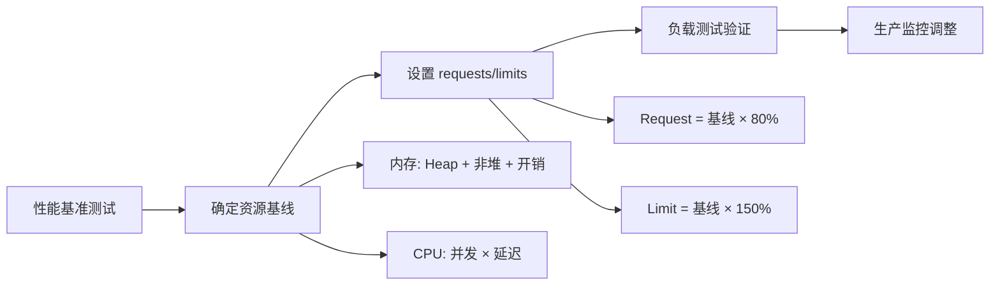

> **生产环境安全提示**
>
> 本文档包含可直接执行的运维命令。执行前请确认：当前目标集群与 Namespace 是否正确；是否具备足够的 RBAC 权限；是否已在非生产环境验证。命令风险等级标注：🔴 高风险（可能造成数据丢失或服务中断）、🟡 中风险（会修改集群状态，但通常可回滚）、🟢 低风险/只读（信息收集，无副作用）。


# Java 应用性能调优与资源 Sizing 指南

> **适用版本**: JDK 21 (LTS) / Spring Boot 3.4+ / [[kubernetes|Kubernetes]] v1.29-v1.33  
> **最后更新**: 2026-04-30  
> **难度**: 高级

---

<!-- chunk: 📋 目录 -->
## 📋 目录

- [一、资源 Sizing 方法论](#一资源-sizing-方法论)
- [二、内存 Sizing](#二内存-sizing)
- [三、CPU Sizing](#三cpu-sizing)
- [四、启动优化](#四启动优化)
- [五、线程池调优](#五线程池调优)
- [六、Tomcat/Undertow 调优](#六tomcatundertow-调优)
- [七、连接池 Sizing](#七连接池-sizing)
- [八、缓存与本地存储优化](#八缓存与本地存储优化)
- [九、弹性伸缩策略](#九弹性伸缩策略)
- [十、性能基准测试方法](#十性能基准测试方法)

---

<!-- chunk: 一、资源 Sizing 方法论 -->
## 一、资源 Sizing 方法论

### 1.1 Sizing 流程



### 1.2 Sizing 黄金法则

```
法则 1: 先测量, 再设置
法则 2: Request 决定调度, Limit 决定天花板
法则 3: 内存 Limit 必须 > JVM Heap × 1.5
法则 4: CPU Limit 允许突发, 但不应与 Request 差距过大
法则 5: 优先水平扩展, 而非垂直扩展
```

---

<!-- chunk: 二、内存 Sizing -->
## 二、内存 Sizing

### 2.1 JVM 内存组成

```
┌─────────────────────────────────────────────────────┐
│              Container Memory Limit                   │
│                                                       │
│  ┌──────────────────────────────────┐                │
│  │       JVM Heap (-Xmx)           │  ← 业务数据     │
│  │       MaxRAMPercentage=75.0     │                 │
│  └──────────────────────────────────┘                │
│                                                       │
│  ┌──────────────┐  ┌───────────────┐                │
│  │  Metaspace   │  │ Thread Stacks │                 │
│  │  ~100-256MB  │  │ threads×1MB   │                 │
│  └──────────────┘  └───────────────┘                │
│                                                       │
│  ┌──────────────┐  ┌───────────────┐                │
│  │  Code Cache  │  │ Direct Memory │                 │
│  │  ~240MB      │  │ ~0-64MB       │                 │
│  └──────────────┘  └───────────────┘                │
│                                                       │
│  ┌──────────────┐  ┌───────────────┐                │
│  │  GC Overhead │  │ JNI / Native  │                 │
│  │  ~50MB       │  │ ~50-100MB     │                 │
│  └──────────────┘  └───────────────┘                │
│                                                       │
│  ┌──────────────────────────────────┐                │
│  │  Container Overhead / Page Cache │  ~50-100MB     │
│  └──────────────────────────────────┘                │
└─────────────────────────────────────────────────────┘
```

### 2.2 内存 Sizing 模板

| 应用类型 | Container Limit | JVM Heap | MaxRAMPercentage | Request |
|---------|----------------|----------|------------------|---------|
| 轻量 API | 512Mi | ~280MB | 75.0 | 384Mi |
| 标准 Spring Boot | 1Gi | ~560MB | 75.0 | 768Mi |
| 重度业务 | 2Gi | ~1.1GB | 75.0 | 1.5Gi |
| 数据处理 | 4Gi | ~2.2GB | 70.0 | 3Gi |
| 大堆/缓存 | 8Gi | ~4.5GB | 70.0 | 6Gi |

### 2.3 Native Image 内存

```yaml
# GraalVM Native Image: 无 JVM 开销
resources:
  requests:
    memory: "64Mi"
  limits:
    memory: "128Mi"
```

### 2.4 内存监控公式

```
JVM Heap 使用率 = jvm_memory_used_bytes{area="heap"} / jvm_memory_max_bytes{area="heap"}
容器内存使用率 = container_memory_working_set_bytes / container_spec_memory_limit_bytes
非堆内存 = container_memory_working_set_bytes - jvm_memory_used_bytes{area="heap"}

告警阈值:
  Heap > 85% → 可能需要扩容或调优
  Container > 90% → 即将 OOMKilled
  Container - Heap > 40% → 非堆内存泄漏
```

---

<!-- chunk: 三、CPU Sizing -->
## 三、CPU Sizing

### 3.1 CPU 需求估算

```
CPU 需求估算公式:
  CPU (cores) = 目标 QPS × 平均请求处理时间 (秒)

示例:
  目标 QPS = 500
  平均请求处理时间 = 20ms = 0.02s
  CPU 需求 = 500 × 0.02 = 10 cores (总)

  每个副本: 10 / 5 replicas = 2 cores
  Request: 1000m (1 core)
  Limit: 2000m (2 cores)
```

### 3.2 CPU Sizing 模板

| 应用类型 | CPU Request | CPU Limit | 说明 |
|---------|------------|----------|------|
| 轻量 API | 100m | 500m | 简单 CRUD |
| 标准 Spring Boot | 250m | 1000m | 通用业务 |
| 计算密集 | 500m | 2000m | 数据处理 |
| IO 密集 | 200m | 1000m | 外部 API 调用 |

### 3.3 ActiveProcessorCount 调整

```yaml
env:
  - name: JAVA_OPTS
    value: >-
      -XX:+UseContainerSupport
      -XX:ActiveProcessorCount=2
      -XX:ParallelGCThreads=2
      -XX:ConcGCThreads=1
```

---

<!-- chunk: 四、启动优化 -->
## 四、启动优化

### 4.1 启动时间优化策略

| 策略 | 效果 | 复杂度 | 说明 |
|------|------|--------|------|
| Spring Boot 3 AOT | 10-30% 提升 | 中 | 编译时 Bean 注册 |
| CDS (Class Data Sharing) | 10-20% 提升 | 低 | 类数据共享 |
| AppCDS | 20-40% 提升 | 中 | 应用类数据共享 |
| Lazy Initialization | 5-15% 提升 | 低 | 延迟初始化 |
| GraalVM Native Image | 90%+ 提升 | 高 | 原生编译 |

### 4.2 CDS / AppCDS 配置

```dockerfile
# Dockerfile 中生成 CDS Archive
FROM eclipse-temurin:21-jdk AS cds-builder
WORKDIR /build
COPY target/*.jar app.jar

# 训练运行 (记录类加载)
RUN java -XX:ArchiveClassesAtExit=/build/app-cds.jsa \
    -Dspring.context.exit=onRefresh \
    -jar app.jar || true

# 运行时使用 CDS
FROM eclipse-temurin:21-jre
WORKDIR /app
COPY --from=cds-builder /build/app.jar .
COPY --from=cds-builder /build/app-cds.jsa .

ENTRYPOINT ["java", \
    "-XX:SharedArchiveFile=/app/app-cds.jsa", \
    "-XX:+UseContainerSupport", \
    "-XX:MaxRAMPercentage=75.0", \
    "-jar", "app.jar"]
```

### 4.3 Spring Boot 3 Lazy Init

```yaml
spring:
  main:
    lazy-initialization: true
    log-startup-info: true
```

---

<!-- chunk: 五、线程池调优 -->
## 五、线程池调优

### 5.1 Tomcat 线程池

```yaml
server:
  tomcat:
    threads:
      max: 200
      min-spare: 10
    max-connections: 8192
    accept-count: 100
    connection-timeout: 5000
    max-keep-alive-requests: 100
    keep-alive-timeout: 60000
```

### 5.2 线程池 Sizing 公式

```
CPU 密集型任务:
  线程数 = CPU 核数 + 1

IO 密集型任务:
  线程数 = CPU 核数 × (1 + 等待时间/计算时间)

K8s 容器中:
  CPU 核数 = ActiveProcessorCount 或 cpu limit / 1000m

示例 (500m CPU limit, IO 密集, 等待比 = 10):
  核数 = 0.5
  线程数 = 0.5 × (1 + 10) = 5.5 → 6 线程
```

### 5.3 自定义线程池

```java
@Configuration
public class ThreadPoolConfig {

    @Bean("asyncTaskExecutor")
    public ThreadPoolTaskExecutor asyncTaskExecutor(
            @Value("${app.thread-pool.core-size:4}") int coreSize,
            @Value("${app.thread-pool.max-size:8}") int maxSize) {
        ThreadPoolTaskExecutor executor = new ThreadPoolTaskExecutor();
        executor.setCorePoolSize(coreSize);
        executor.setMaxPoolSize(maxSize);
        executor.setQueueCapacity(100);
        executor.setThreadNamePrefix("async-");
        executor.setRejectedExecutionHandler(new ThreadPoolExecutor.CallerRunsPolicy());
        executor.setWaitForTasksToCompleteOnShutdown(true);
        executor.setAwaitTerminationSeconds(30);
        executor.initialize();
        return executor;
    }
}
```

---

<!-- chunk: 六、Tomcat/Undertow 调优 -->
## 六、Tomcat/Undertow 调优

### 6.1 Tomcat vs Undertow

| 特性 | Tomcat (默认) | Undertow |
|------|-------------|---------|
| 内存占用 | 中 | 低 |
| 吞吐量 | 高 | 高 |
| 阻塞/非阻塞 | 阻塞 | 非阻塞 |
| WebSocket | 支持 | 支持 |
| 适用场景 | 通用 | 高并发/低内存 |

### 6.2 Undertow 配置

```xml
<dependency>
    <groupId>org.springframework.boot</groupId>
    <artifactId>spring-boot-starter-undertow</artifactId>
</dependency>
<dependency>
    <groupId>org.springframework.boot</groupId>
    <artifactId>spring-boot-starter-tomcat</artifactId>
    <scope>provided</scope>
</dependency>
```

```yaml
server:
  undertow:
    io-threads: 4
    worker-threads: 20
    buffer-size: 1024
    direct-buffers: true
    max-http-post-size: 10MB
```

---

<!-- chunk: 七、连接池 Sizing -->
## 七、连接池 Sizing

### 7.1 HikariCP Sizing

```
公式:
  pool_size = (core_count * 2) + effective_spindle_count

K8s 场景:
  每个 Pod 独立连接池
  pool_size = max(2, cpu_limit_millicores / 500)
  总连接数 = pods × pool_size ≤ 数据库 max_connections

示例:
  5 Pods × pool_size=5 = 25 总连接
  PostgreSQL max_connections=100 → 安全 (25%)

  20 Pods × pool_size=10 = 200 总连接
  PostgreSQL max_connections=100 → 超限!
  方案: 降低 pool_size=4, 或增大 max_connections
```

```yaml
spring:
  datasource:
    hikari:
      maximum-pool-size: ${DB_POOL_SIZE:10}
      minimum-idle: ${DB_POOL_MIN:2}
      connection-timeout: 30000
      idle-timeout: 600000
      max-lifetime: 1800000
      leak-detection-threshold: 60000
```

### 7.2 Redis 连接池

```yaml
spring:
  data:
    redis:
      lettuce:
        pool:
          max-active: 8
          max-idle: 8
          min-idle: 2
          max-wait: 3000ms
```

---

<!-- chunk: 八、缓存与本地存储优化 -->
## 八、缓存与本地存储优化

### 8.1 Spring Cache + Redis

```java
@Configuration
@EnableCaching
public class CacheConfig {

    @Bean
    public RedisCacheManager cacheManager(RedisConnectionFactory factory) {
        RedisCacheConfiguration config = RedisCacheConfiguration.defaultCacheConfig()
            .entryTtl(Duration.ofMinutes(10))
            .serializeValuesWith(RedisSerializationContext.SerializationPair
                .fromSerializer(new GenericJackson2JsonRedisSerializer()));

        return RedisCacheManager.builder(factory)
            .cacheDefaults(config)
            .build();
    }
}
```

### 8.2 emptyDir tmpfs

```yaml
volumes:
  - name: tmp
    emptyDir:
      medium: Memory
      sizeLimit: "64Mi"
```

---

<!-- chunk: 九、弹性伸缩策略 -->
## 九、弹性伸缩策略

### 9.1 Java 应用 HPA 策略

```yaml
apiVersion: autoscaling/v2
kind: HorizontalPodAutoscaler
metadata:
  name: spring-app-hpa
spec:
  scaleTargetRef:
    apiVersion: apps/v1
    kind: Deployment
    name: spring-app
  minReplicas: 3
  maxReplicas: 30
  metrics:
    - type: Resource
      resource:
        name: cpu
        target:
          type: Utilization
          averageUtilization: 70
    - type: Pods
      pods:
        metric:
          name: http_server_requests_seconds_count
        target:
          type: AverageValue
          averageValue: "100"
  behavior:
    scaleUp:
      stabilizationWindowSeconds: 0
      policies:
        - type: Percent
          value: 100
          periodSeconds: 15
    scaleDown:
      stabilizationWindowSeconds: 300
      policies:
        - type: Percent
          value: 10
          periodSeconds: 60
```

### 9.2 [[keda|KEDA]] 自定义伸缩

```yaml
apiVersion: keda.sh/v1alpha1
kind: ScaledObject
metadata:
  name: spring-app-scaler
spec:
  scaleTargetRef:
    apiVersion: apps/v1
    kind: Deployment
    name: spring-app
  minReplicaCount: 2
  maxReplicaCount: 50
  cooldownPeriod: 300
  triggers:
    - type: prometheus
      metadata:
        serverAddress: http://prometheus.monitoring:9090
        metricName: http_server_requests_seconds_count
        threshold: "100"
        query: sum(rate(http_server_requests_seconds_count{service="spring-app"}[1m]))
```

---

<!-- chunk: 十、性能基准测试方法 -->
## 十、性能基准测试方法

### 10.1 压测工具选择

| 工具 | 特点 | 适用场景 |
|------|------|---------|
| **wrk/wrk2** | 高性能 HTTP 压测 | 延迟分布测量 |
| **JMeter** | 功能丰富 | 复杂场景 |
| **Gatling** | DSL 脚本 | CI/CD 集成 |
| **k6** | JavaScript 脚本 | 云原生友好 |
| **hey** | 简单易用 | 快速验证 |

### 10.2 wrk2 延迟测试

```bash
# 2 线程, 100 连接, 30 秒, 目标 500 RPS
wrk -t2 -c100 -d30s -R500 --latency http://spring-app:8080/api/users

# 分析结果:
# Latency Distribution:
#   50%    12ms
#   75%    18ms
#   90%    35ms
#   99%    85ms     ← P99 延迟
#   99.9%  250ms
```

### 10.3 K8s 压测 Job

```yaml
apiVersion: batch/v1
kind: Job
metadata:
  name: load-test
spec:
  template:
    spec:
      containers:
        - name: wrk
          image: williamyeh/wrk:latest
          command:
            - wrk
            - -t4
            - -c200
            - -d60s
            - -R1000
            - --latency
            - http://spring-app.production:8080/api/users
      restartPolicy: Never
  backoffLimit: 0
```

---

<!-- chunk: 🔗 相关文档 -->
## 🔗 相关文档

- [JVM GC 容器调优](03-jvm-gc-container-tuning-guide.md) — GC 算法选择与监控
- [Spring Boot on K8s](../../02-工作负载/01-核心工作负载/25-spring-boot-kubernetes-guide.md) — Spring Boot 部署
- [Java 容器化](../../14-%E5%AE%B9%E5%99%A8%E8%BF%90%E8%A1%8C%E6%97%B6/01-Docker/12-java-containerization-guide.md) — 镜像构建优化
- [Java 可观测性](../../09-可观测性/01-总览/14-java-observability-kubernetes-guide.md) — 性能监控
- [GraalVM Native Image](../../16-专项技术/03-扩展机制/18-graalvm-native-image-guide.md) — 原生编译加速启动

---

<!-- chunk: Obsidian 相关文档 -->
## Obsidian 相关文档

- 故障诊断 KUDIG Database — Global MOC
- [[19-故障诊断/README.md|Domain-12 故障排查 ([[23-实体/15-参考与索引/kudig-prompts-catalog|Troubleshooting]])]]
- Domain-12 故障排查 — 开源项目索引
- [[19-故障诊断/01-核心排障/01-control-plane-apiserver-troubleshooting.md|API Server 故障排查]]
- [[19-故障诊断/01-核心排障/02-control-plane-etcd-troubleshooting.md|etcd 故障排查]]
- [[19-故障诊断/01-核心排障/03-networking-cni-troubleshooting.md|CNI 网络插件故障排查]]
- [[19-故障诊断/01-核心排障/04-storage-csi-troubleshooting.md|CSI 存储驱动故障排查]]
- [[19-故障诊断/01-核心排障/05-pod-pending-diagnosis.md|Pod Pending 状态深度诊断]]
- [[19-故障诊断/01-核心排障/06-node-notready-diagnosis.md|Node NotReady 状态深度诊断]]
- [[19-故障诊断/01-核心排障/07-oom-memory-diagnosis.md|OOM 和内存问题诊断]]
- [[19-故障诊断/01-核心排障/08-pod-comprehensive-troubleshooting.md|Pod 全面故障排查]]
- [[19-故障诊断/02-资源排障/01-node-comprehensive-troubleshooting.md|Node 全面故障排查]]
- [[19-故障诊断/06-FTA故障树/list/apiserver-fta.md|API Server 异常故障树分析]]
- [[19-故障诊断/06-FTA故障树/list/backup-restore-fta.md|备份/恢复异常故障树分析]]
- [[19-故障诊断/06-FTA故障树/list/calico-fta.md|calico FTA 树：Calico CNI 故障诊断]]

## See Also

- [[19-故障诊断/04-高级排障/09-symptom-sop-mapping.md|43-symptom-sop-mapping]]
- [[19-故障诊断/04-高级排障/10-kind-k3s-single-node-troubleshooting.md|44-kind-k3s-single-node-troubleshooting]]
- [[19-故障诊断/05-JVM调优/03-jvm-gc-container-tuning-guide.md|99-jvm-gc-container-tuning-guide]]
- [[19-故障诊断/SUMMARY.md|SUMMARY]]


<!-- risk-assessed -->
