> **生产环境安全提示**
>
> 本文档包含可直接执行的运维命令。执行前请确认：当前目标集群与 Namespace 是否正确；是否具备足够的 RBAC 权限；是否已在非生产环境验证。命令风险等级标注：🔴 高风险（可能造成数据丢失或服务中断）、🟡 中风险（会修改集群状态，但通常可回滚）、🟢 低风险/只读（信息收集，无副作用）。


<!-- condition: kubectl get pods -n kube-system -l k8s-app=cilium -o jsonpath='{range .items[?(@.status.phase!="Running")]} {.metadata.name}{\"\n\"}{end}' 显示 Cilium 异常 -->

# cilium FTA 树：eBPF/Cilium CNI 故障诊断

> **fta_id**: FTA-CILIUM-001
> **component**: cni / cilium
> **severity**: P0-P2
> **k8s_versions**: ["1.28", "1.29", "1.30", "1.31", "1.32", "1.33"]
> **top_event_id**: TE-CILIUM-001
> **last_updated**: 2026-05
> **authors**: KUDIG Team

---

## Mermaid FTA 树

```mermaid
flowchart TD
  TE["顶事件: Cilium/EBPF 网络异常<br/>Pod 无法通信 / 访问延迟高"]
  OR0{{OR}}
  TE --> OR0

  %% ======== 一级分类 ========
  OR0 --> CAT_INIT["A. Cilium Agent 初始化失败"]
  OR0 --> CAT_HEALTH["B. Cilium 健康检查失败"]
  OR0 --> CAT_BPF["C. eBPF Map/Program 异常"]
  OR0 --> CAT_NET["D. 网络连通性问题"]
  OR0 --> CAT_HUBBLE["E. Hubble 流量观测不可用"]
  OR0 --> CAT_SVC["F. Service/LoadBalancer 异常"]
  OR0 --> CAT_BGP["G. BGP Peering 异常"]

  %% ======== A. Agent 初始化 ========
  A_OR{{OR}}
  CAT_INIT --> A_OR
  A_OR --> A1["A1. Cilium Agent 无法启动<br/>config файлов не найден"]
  A_OR --> A2["A2. Kubernetes Mode 初始化失败<br/>API Server 连接异常"]
  A_OR --> A3["A3. 身份认证 (Cilium Identity) 失败<br/>下层 CNI 不兼容"]

  A1_S["Agent Pod 或 DaemonSet 不在 Running 状态"]
  A1 --> A1_S

  A2_S["cilium-operator 无法与 API Server 通信"]
  A2 --> A2_S

  %% ======== B. 健康检查 ========
  B_OR{{OR}}
  CAT_HEALTH --> B_OR
  B_OR --> B1["B1. cilium status 显示不健康<br/>agent 或 operator 异常"]
  B_OR --> B2["B2. 节点间 Cilium 隧道断裂<br/>VXLAN/Geneve 不可达"]
  B_OR --> B3["B3. Endpoint 状态异常<br/>cilium endpoint list 显示非 001 状态"]

  %% ======== C. eBPF ========
  C_OR{{OR}}
  CAT_BPF --> C_OR
  C_OR --> C1["C1. eBPF Map 溢出<br/>max map entries reached"]
  C_OR --> C2["C2. eBPF Program 加载失败<br/>node init script 错误"]
  C_OR --> C3["C3. tc/bpf 规则冲突<br/>netdev/clsbird 冲突"]

  %% ======== D. 网络连通性 ========
  D_OR{{OR}}
  CAT_NET --> D_OR
  D_OR --> D1["D1. 跨节点 Pod 网络不通<br/>Pod IP 无法 ping 通"]
  D_OR --> D2["D2. Pod 无法访问 ClusterIP Service<br/>Cilium endpoint 无法转发"]
  D_OR --> D3["D3. Pod 无法访问外部网络<br/>NAT/ masquerade 配置错误"]
  D_OR --> D4["D4. DNS 解析失败 (Cilium 环境下)<br/>CoreDNS 与 Cilium 交互异常"]

  %% ======== E. Hubble ========
  E_OR{{OR}}
  CAT_HUBBLE --> E_OR
  E_OR --> E1["E1. Hubble Server 未运行<br/>hubble observe 命令无输出"]
  E_OR --> E2["E2. Hubble Relay 无法聚合多个节点 Hubble<br/>mTLS 证书问题"]
  E_OR --> E3["E3. Hubble UI 无法连接 Relay<br/>gRPC 端口被防火墙拦截"]

  %% ======== F. Service ========
  F_OR{{OR}}
  CAT_SVC --> F_OR
  F_OR --> F1["F1. Kubeproxy-free 模式下 Service 不通<br/>Cilium 接管 kube-proxy 但配置错误"]
  F_OR --> F2["F2. L2Aware/Nodediscovery 模式下 LB 异常<br/>CiliumNodeConfig 配置错误"]
  F_OR --> F3["F3. External Service 不健康<br/>health check 失败导致 endpoint 摘除"]

  %% ======== G. BGP ========
  G_OR{{OR}}
  CAT_BGP --> G_OR
  G_OR --> G1["G1. Bird/BGP 会话断开<br/>BFD 检测失败"]
  G_OR --> G2["G2. BGP Route 安装失败<br/>Route Reflector 配置错误"]
  G_OR --> G3["G3. BGP 路由表不一致<br/>多个 Cilium 节点路由冲突"]

  %% ======== 顶事件展开 ========
  TE_HL["顶事件详细说明"]
  TE --> TE_HL
  TE_HL --> HL1["症状: kubectl exec 进入 Pod 正常，但应用无法访问其他 Pod"]
  TE_HL --> HL2["症状: cilium connectivity test 失败"]
  TE_HL --> HL3["症状: ClusterIP Service 访问超时"]
```



---

## A. Cilium Agent 初始化失败

### A1. Cilium Agent 无法启动

**问题现象**: cilium-agent pod 不在 Running 状态，或重启循环

**可能原因**：

| 原因 | 诊断命令 | 修复建议 |
|------|---------|---------|
| `/etc/cni/net.d/` 中存在冲突 CNI 配置 | `cat /etc/cni/net.d/` | 删除其他 CNI 配置，仅保留 Cilium |
| Helm 安装时 `cni.install=true` 但节点已有 CNI | `cilium status` | 重新安装 Cilium 并设置 `--set cni.install=false` |
| 挂载的 BPF 文件系统权限错误 | `mount | grep bpf` | 确保 `/sys/fs/bpf` 以 rw,relatime 挂载 |

**排查步骤**：
``` bash
# 🟢 低风险：只读/信息收集，通常无副作用
# 1. 检查 Agent Pod 状态
kubectl get pods -n kube-system -l k8s-app=cilium
# 2. 查看 Agent 日志
kubectl logs -n kube-system -l k8s-app=cilium --tail=100
# 3. 在节点上检查 Cilium 状态
cilium status
# 4. 检查 eBPF 文件系统挂载
mount | grep bpf
```
### A2. Kubernetes Mode 初始化失败

**问题现象**: Cilium 启动报错 "Kubernetes mode: unable to get Kubernetes node"

**可能原因**：
- Kubelet 未上报节点注解（`k8s.cilium.io/node-ip` 等）
- Cilium 使用的 kubeconfig 无权读取节点资源

**排查步骤**：
``` bash
# 🟢 低风险：只读/信息收集，通常无副作用
# 1. 检查节点注解
kubectl get node <node-name> -o jsonpath='{.metadata.annotations}' | jq 'keys'
# 2. 检查 Cilium 服务账号权限
kubectl auth can-i get nodes --as=system:serviceaccount:kube-system:cilium
# 3. 查看 operator 日志
kubectl logs -n kube-system -l name=cilium-operator --tail=50
```
---

## B. Cilium 健康检查失败

### B1. cilium status 显示不健康

**问题现象**: `cilium status` 输出中某项为 `✗`

**可能原因**：

| 检查项 | 含义 | 修复建议 |
|--------|------|---------|
| `kube-proxy replacement` | Kubeproxy-free 未正确工作 | 检查 `--set kubeProxyReplacement=strict` |
| `bandwidth manager` | BFP-based 带宽管理异常 | 检查 TC (traffic control) 规则 |
| `cilium operators` | operator 无法选举 leader | 检查 operator 日志 |
| `clustermesh` | 集群网格互联异常 | 检查 clustermesh 配置文件 |

**排查步骤**：
```bash
cilium status --verbose  # 详细输出
cilium health list  # 查看所有健康检查项
```

### B2. 节点间 VXLAN 隧道断裂

**问题现象**: 跨节点 Pod 无法通信，但同节点 Pod 通信正常

**排查步骤**：
```bash
# 1. 检查 cilium endpoint 对等节点
cilium endpoint list
# 2. 检查 VXLAN VTEP 配置
cilium bpf tunnel list
# 3. 在节点上手动测试隧道连通性
ping -c 3 <remote-node-ip>
# 4. 检查防火墙规则（UDP 8472 端口）
iptables -L -n | grep 8472
```

---

## C. eBPF Map/Program 异常

### C1. eBPF Map 溢出

**问题现象**: `dmesg` 显示 `BPF: Map-insertion rejected`，或 cilium status 报警 `BPF map pressure`

**可能原因**：
- `bpf.maps.size.max` 设置过小（默认 512K）
- 高并发连接数导致 map 满

**排查步骤**：
``` bash
# 🟡 中风险：会修改集群/资源状态，执行前请确认目标、影响范围与授权
# 1. 检查 BPF map 使用率
cilium bpf map list
# 2. 查看 dmesg 中的 map 错误
dmesg | grep -i "bpf.*map"
# 3. 增大 map 大小（Helm upgrade）
helm upgrade cilium cilium/cilium --set bpf.maps.size.max=2097152
```
### C2. eBPF Program 加载失败

**问题现象**: `cilium status` 显示 BPF program 加载失败

**可能原因**：
- 内核版本不支持对应 BPF 功能（需要 5.10+）
- 内核模块缺失 (`CONFIG_BPF=y`, `CONFIG_BPF_SYSCALL=y`)

**排查步骤**：
``` bash
# 🟢 低风险：只读/信息收集，通常无副作用
# 1. 检查内核版本
uname -r
# 2. 检查内核 BPF 支持
cat /proc/config.gz | grep -i bpf
# 3. 查看 cilium-operator 日志中的 program 加载错误
kubectl logs -n kube-system -l name=cilium-operator | grep -i "program"
```
---

## D. 网络连通性问题

### D1. 跨节点 Pod 网络不通

**问题现象**: Pod IP 无法 ping 通对端节点上的 Pod IP

**排查步骤**：
```bash
# 1. 检查两端 Pod 的 Endpoint 状态
cilium endpoint list | grep <pod-ip>
# 2. 检查路由表
cilium bpf ruler list
# 3. 检查节点间网络（基础链路）
ping -c 3 <remote-node-internal-ip>
# 4. 检查 Cilium BGP 会话状态（如启用）
cilium bgp peers
```

### D2. Pod 无法访问 ClusterIP Service

**问题现象**: Pod 内 `curl 10.96.0.1:443` 超时

**排查步骤**：
```bash
# 1. 检查 Cilium 对 Service 的处理
cilium service list
# 2. 检查 kube-proxy replacement 是否启用
cilium status | grep "kube-proxy"
# 3. 检查 NodePort/LoadBalancer 是否正常
cilium service list | grep "NodePort"
# 4. 测试从节点上访问 Service（绕过 eBPF）
curl -s 10.96.0.1:443
```

### D3. Pod 无法访问外部网络

**问题现象**: Pod 内 `curl google.com` 超时

**排查步骤**：
```bash
# 1. 检查 NAT masquerade 配置
cilium bpf nat list
# 2. 检查 Cilium 代表节点的 masquerade 规则
iptables -t nat -L -n | grep MASQUERADE
# 3. 测试节点上是否可以访问外部
curl -s google.com
# 4. 检查 Egress gateway 配置（如使用）
cilium egress list
```

---

## E. Hubble 流量观测不可用

### E1. Hubble Server 未运行

**问题现象**: `hubble observe` 无输出或报错 "Hubble server not reachable"

**排查步骤**：
``` bash
# 🟡 中风险：会修改集群/资源状态，执行前请确认目标、影响范围与授权
# 1. 检查 Hubber 服务是否开启
cilium config | grep -i hubble
# 2. 检查 Hubber pod 状态
kubectl get pods -n kube-system | grep hubble
# 3. 检查 gRPC 端口监听
netstat -tlnp | grep 4245
# 4. 启用 Hubber（如未启用）
helm upgrade cilium cilium/cilium --set hubble.enabled=true --set hubble.relay.enabled=true
```
### E2. Hubble Relay 无法聚合

**问题现象**: `hubble observe --server=grpc://<relay>:443` 无响应

**排查步骤**：
```bash
# 1. 检查 Relay 证书
cilium hubble relay status --insecure
# 2. 检查所有节点 Hubber 实例
hubble observe --server=unix:///var/run/cilium/hubble.sock
# 3. 检查 mTLS 证书是否过期
openssl x509 -in /var/run/cilium/hubble-relay.crt -noout -dates
```

---

## F. Service/LoadBalancer 异常

### F1. Kubeproxy-free 模式下 Service 不通

**问题现象**: 启用 Cilium kube-proxy replacement 后 ClusterIP Service 无法访问

**排查步骤**：
``` bash
# 🟡 中风险：会修改集群/资源状态，执行前请确认目标、影响范围与授权
# 1. 确认 kubeProxyReplacement 状态
cilium status | grep "kube-proxy replacement"
# 2. 检查 Cilium 是否正确接管了 Service
cilium service list
# 3. 检查是否有冲突的 iptables kube-proxy 规则
iptables -L -n -t nat | grep KUBE
# 4. 回退到 kube-proxy（如需要）
helm upgrade cilium cilium/cilium --set kubeProxyReplacement=disabled
```
---

## G. BGP Peering 异常

### G1. Bird/BGP 会话断开

**问题现象**: `cilium bgp peers` 显示部分 peer 为 down

**排查步骤**：
```bash
# 1. 查看 BGP peer 状态
cilium bgp peers
# 2. 查看 Bird 日志
birdcl show protocols
# 3. 检查 BFD 状态（如启用）
birdcl show bfd session
# 4. 检查网络防火墙是否允许 BGP (TCP 179) 和 BFD (UDP 3784)
```

---

## 附录：关键命令索引

| 问题场景 | 诊断命令 |
|---------|---------|
| Cilium Agent 状态 | `cilium status` |
| Endpoint 列表 | `cilium endpoint list` |
| BPF Map 查看 | `cilium bpf map list` |
| Service 列表 | `cilium service list` |
| BGP peers | `cilium bgp peers` |
| Hubble 状态 | `hubble observe --server=unix:///var/run/cilium/hubble.sock` |
| 节点检查 | `cilium node list` |
| 路由表 | `cilium bpf ruler list` |
| eBPF 编译状态 | `cilium bpf version` |

---

```yaml
---
fta_id: FTA-CILIUM-001
component: cni / cilium
severity: P0-P2
k8s_versions: ["1.28", "1.29", "1.30", "1.31", "1.32", "1.33"]
top_event_id: TE-CILIUM-001
related_skills: []
knowledge_refs:
  - 网络/05-terway-advanced-guide.md
  - 网络/27-cni-troubleshooting-optimization.md
  - terway-fta.md
---
```

<!-- risk-assessed -->
