> **生产环境安全提示**
>
> 本文档包含可直接执行的运维命令。执行前请确认：当前目标集群与 Namespace 是否正确；是否具备足够的 RBAC 权限；是否已在非生产环境验证。命令风险等级标注：🔴 高风险（可能造成数据丢失或服务中断）、🟡 中风险（会修改集群状态，但通常可回滚）、🟢 低风险/只读（信息收集，无副作用）。


<!-- condition: kubectl get pods -n kube-system -l k8s-app=kube-dns -o jsonpath='{range .items[?(@.status.phase!=\"Running\")]} {.metadata.name}{\"\n\"}{end}' 显示 CoreDNS 异常 -->

# DNS 异常 FTA 树

## 适用范围与说明
- **目标**：覆盖 DNS 解析失败、延迟升高与解析不一致的关键成因与路径。
- **范围**：CoreDNS 部署、上游解析、网络策略、缓存与配置、资源压力。
- **符号**：
  - **OR 门**：任一子事件成立即可触发父事件
  - **AND 门**：所有子事件同时成立才触发父事件

---

## 诊断命令快速参考表

### 1. CoreDNS 状态诊断

| 节点 ID | 名称 | 诊断命令 | 预期输出模式 | 判定 |
|---------|------|----------|--------------|------|
| CORE1A | OOMKilled | `kubectl get pods -n kube-system -l k8s-app=kube-dns -o jsonpath='{range .items[*]}{.status.containerStatuses[*].lastState.terminated.reason}{"\n"}{end}'` | `OOMKilled` | 确认 CoreDNS 内存溢出 |
| CORE1B | CrashLoopBackOff | `kubectl get pods -n kube-system -l k8s-app=kube-dns -o jsonpath='{range .items[*]}{.status.containerStatuses[*].state.waiting.reason}{"\n"}{end}'` | `CrashLoopBackOff` | 确认容器反复崩溃 |
| CORE1C | 被节点驱逐 | `kubectl get pods -n kube-system -l k8s-app=kube-dns -o jsonpath='{range .items[*]}{.status.reason}{"\n"}{end}'` | `Evicted` | 确认被驱逐 |
| CORE2A | kube-dns Service 不存在 | `kubectl get svc kube-dns -n kube-system -o name 2>/dev/null \|\| echo "NOT_FOUND"` | `NOT_FOUND` | 确认 Service 缺失 |
| CORE2B | ClusterIP 不可达 | `kubectl run dns-test --rm -i --restart=Never --image=busybox -- nslookup kubernetes.default 2>&1` | `connection timed out\|no servers` | 确认 DNS 服务不可达 |
| CORE2C | DNS 端口被占用 | `kubectl logs -n kube-system -l k8s-app=kube-dns --tail=100 \| grep -i "address already in use"` | `address already in use` | 确认端口冲突 |
| CORE3 | 插件加载失败 | `kubectl logs -n kube-system -l k8s-app=kube-dns --tail=100 \| grep -iE "plugin.*failed\|failed to load"` | `plugin.*failed\|failed to load` | 确认插件加载问题 |

### 2. 上游解析诊断

| 节点 ID | 名称 | 诊断命令 | 预期输出模式 | 判定 |
|---------|------|----------|--------------|------|
| UP1A | 上游 DNS 服务异常 | `kubectl exec -n kube-system -it $(kubectl get pods -n kube-system -l k8s-app=kube-dns -o jsonpath='{.items[0].metadata.name}') -- cat /etc/resolv.conf` | 查看上游 DNS 配置 | 获取上游 DNS 地址 |
| UP1B | 防火墙拦截 | `kubectl run dns-test --rm -i --restart=Never --image=busybox -- nc -zv -w 3 ${UPSTREAM_DNS} 53 2>&1` | `Connection timed out\|no route` | 确认防火墙阻断 |
| UP1C | forward 配置地址错误 | `kubectl get cm coredns -n kube-system -o jsonpath='{.data.Corefile}' \| grep -A2 "forward"` | forward 配置内容 | 检查上游配置 |
| UP2 | 上游超时/丢包 | `kubectl logs -n kube-system -l k8s-app=kube-dns --tail=200 \| grep -iE "timeout\|i/o timeout"` | `timeout\|i/o timeout` | 确认超时问题 |
| UP3 | 上游返回错误 | `kubectl logs -n kube-system -l k8s-app=kube-dns --tail=200 \| grep -iE "SERVFAIL\|REFUSED"` | `SERVFAIL\|REFUSED` | 确认上游错误响应 |

### 3. 网络策略/连通性诊断

| 节点 ID | 名称 | 诊断命令 | 预期输出模式 | 判定 |
|---------|------|----------|--------------|------|
| NET1A | Egress 策略拦截 53 端口 | `kubectl get networkpolicy -n ${NAMESPACE} -o yaml \| grep -A20 "egress"` | 检查出向规则 | 分析 DNS 出向策略 |
| NET1B | Ingress 策略拦截 CoreDNS | `kubectl get networkpolicy -n kube-system -o yaml \| grep -A20 "ingress"` | 检查入向规则 | 分析 CoreDNS 入向策略 |
| NET2 | 跨节点网络不通 | `kubectl run net-test --rm -i --restart=Never --image=busybox --overrides='{"spec":{"nodeName":"${NODE_NAME}"}}' -- ping -c 3 ${COREDNS_POD_IP}` | `0 packets received` | 确认跨节点网络问题 |
| NET3 | Pod 网络未就绪 | `kubectl get pods -n ${NAMESPACE} ${POD_NAME} -o jsonpath='{.status.conditions[?(@.type=="PodReadyToStartContainers")].status}'` | `False` | 确认网络未就绪 |

### 4. 配置与缓存诊断

| 节点 ID | 名称 | 诊断命令 | 预期输出模式 | 判定 |
|---------|------|----------|--------------|------|
| CFG1A | Corefile 语法错误 | `kubectl logs -n kube-system -l k8s-app=kube-dns --tail=100 \| grep -iE "parse error\|syntax error"` | `parse error\|syntax error` | 确认语法错误 |
| CFG1B | forward 插件配置错误 | `kubectl logs -n kube-system -l k8s-app=kube-dns --tail=100 \| grep -i "plugin/forward"` | `plugin/forward.*error` | 确认 forward 配置问题 |
| CFG1C | stub domain 配置错误 | `kubectl get cm coredns -n kube-system -o jsonpath='{.data.Corefile}' \| grep -B2 -A5 "stub"` | stub domain 配置 | 检查自定义域配置 |
| CFG2 | 缓存失效连锁 | `kubectl exec -n kube-system -it $(kubectl get pods -n kube-system -l k8s-app=kube-dns -o jsonpath='{.items[0].metadata.name}') -- wget -qO- http://localhost:9153/metrics \| grep coredns_cache` | cache_misses 高 | 确认缓存命中率低 |
| CFG3 | 域名劫持/hosts 冲突 | `kubectl get cm coredns -n kube-system -o jsonpath='{.data.Corefile}' \| grep -A10 "hosts"` | hosts 配置 | 检查 hosts 插件配置 |

### 5. 资源与容量诊断

| 节点 ID | 名称 | 诊断命令 | 预期输出模式 | 判定 |
|---------|------|----------|--------------|------|
| RES1 | CPU/内存资源不足 | `kubectl top pods -n kube-system -l k8s-app=kube-dns` | CPU/内存使用率 | 检查资源消耗 |
| RES2 | 查询峰值过高 | `kubectl exec -n kube-system -it $(kubectl get pods -n kube-system -l k8s-app=kube-dns -o jsonpath='{.items[0].metadata.name}') -- wget -qO- http://localhost:9153/metrics \| grep coredns_dns_request_count_total` | 请求计数 | 分析查询量 |
| RES3 | 解析延迟暴增 | `kubectl exec -n kube-system -it $(kubectl get pods -n kube-system -l k8s-app=kube-dns -o jsonpath='{.items[0].metadata.name}') -- wget -qO- http://localhost:9153/metrics \| grep coredns_dns_request_duration_seconds` | P99 延迟 | 分析延迟分布 |

---

## Mermaid FTA 树

```mermaid
flowchart TD
  TE[顶事件: DNS 解析异常]
  OR0{{OR}}
  TE --> OR0

  OR0 --> CORE[CoreDNS 异常]
  OR0 --> UP[上游解析异常]
  OR0 --> NET[网络策略/连通性异常]
  OR0 --> CFG[配置与缓存异常]
  OR0 --> RES[资源与容量异常]

  CORE_OR{{OR}}
  CORE --> CORE_OR
  CORE_OR --> CORE1[Pod 异常/重启]
  CORE_OR --> CORE2[服务发现异常]
  CORE_OR --> CORE3[插件加载失败]

  CORE1_OR{{OR}}
  CORE1 --> CORE1_OR
  CORE1_OR --> CORE1A[OOMKilled]
  CORE1_OR --> CORE1B[CrashLoopBackOff]
  CORE1_OR --> CORE1C[被节点驱逐]

  AND_OOM{{AND}}
  CORE1A --> AND_OOM
  AND_OOM --> CORE1A1[内存限制过低]
  AND_OOM --> CORE1A2[查询峰值突增]

  CORE2_OR{{OR}}
  CORE2 --> CORE2_OR
  CORE2_OR --> CORE2A[kube-dns Service 不存在]
  CORE2_OR --> CORE2B[ClusterIP 不可达]
  CORE2_OR --> CORE2C[DNS 端口被占用]

  UP_OR{{OR}}
  UP --> UP_OR
  UP_OR --> UP1[上游 DNS 不可达]
  UP_OR --> UP2[上游超时/丢包]
  UP_OR --> UP3[上游返回错误]

  UP1_OR{{OR}}
  UP1 --> UP1_OR
  UP1_OR --> UP1A[上游 DNS 服务异常]
  UP1_OR --> UP1B[防火墙/安全组拦截]
  UP1_OR --> UP1C[forward 配置地址错误]

  NET_OR{{OR}}
  NET --> NET_OR
  NET_OR --> NET1[NetworkPolicy 阻断 DNS]
  NET_OR --> NET2[跨节点网络不通]
  NET_OR --> NET3[Pod 网络未就绪]

  NET1_OR{{OR}}
  NET1 --> NET1_OR
  NET1_OR --> NET1A[Egress 策略拦截 53 端口]
  NET1_OR --> NET1B[Ingress 策略拦截 CoreDNS]

  CFG_OR{{OR}}
  CFG --> CFG_OR
  CFG_OR --> CFG1[CoreDNS 配置错误]
  CFG_OR --> CFG2[缓存失效连锁]
  CFG_OR --> CFG3[域名劫持/hosts 冲突]

  CFG1_OR{{OR}}
  CFG1 --> CFG1_OR
  CFG1_OR --> CFG1A[Corefile 语法错误]
  CFG1_OR --> CFG1B[forward 插件配置错误]
  CFG1_OR --> CFG1C[stub domain 配置错误]

  AND_CACHE{{AND}}
  CFG2 --> AND_CACHE
  AND_CACHE --> CFG2A[缓存 TTL 过期]
  AND_CACHE --> CFG2B[上游 DNS 不可达无法刷新]

  RES_OR{{OR}}
  RES --> RES_OR
  RES_OR --> RES1[CPU/内存资源不足]
  RES_OR --> RES2[查询峰值过高]
  RES_OR --> RES3[解析延迟暴增]

  AND_LATENCY{{AND}}
  RES3 --> AND_LATENCY
  AND_LATENCY --> RES3A[CoreDNS 资源不足]
  AND_LATENCY --> RES3B[并发查询量超限]
```



---

## 生产级观测与证据
- **事件**：`SERVFAIL`、解析超时、`NXDOMAIN` 异常升高、`OOMKilled`、`CrashLoopBackOff`。
- **关键指标**：`coredns_dns_request_count_total`、`coredns_dns_request_duration_seconds`、`coredns_cache_hits_total`、`coredns_cache_misses_total`、`coredns_forward_request_duration_seconds`、`container_memory_working_set_bytes{pod=~"coredns.*"}`。
- **关键日志**：`coredns` 日志、`kubelet` 日志、网络插件日志。
- **配置核对**：CoreDNS `Corefile`、上游 DNS 地址、NetworkPolicy、kube-dns Service。

---

## JSON 工作流（含与/或门控件）

```json
{
  "flow_steps": [
    {
      "name": "开始",
      "action": "start",
      "step": "start_dns_fta",
      "next_step": "event_dns_abnormal"
    },
    {
      "name": "顶事件: DNS 解析异常",
      "action": "event",
      "step": "event_dns_abnormal",
      "description": "解析超时/SERVFAIL/NXDOMAIN异常",
      "next_step": "gate_root_or",
      "cmd": {
        "type": "parallel",
        "commands": [
          { "id": "dns_test", "description": "测试集群内DNS解析", "exec": "kubectl run dns-test-${RANDOM} --rm -i --restart=Never --image=busybox:1.35 --timeout=30s -- nslookup kubernetes.default 2>&1", "timeout": 30 },
          { "id": "coredns_status", "description": "检查CoreDNS Pod状态", "exec": "kubectl get pods -n kube-system -l k8s-app=kube-dns -o wide", "timeout": 5 },
          { "id": "coredns_logs", "description": "获取CoreDNS最近日志", "exec": "kubectl logs -n kube-system -l k8s-app=kube-dns --tail=50 --since=10m 2>/dev/null | head -100", "timeout": 10 }
        ]
      },
      "match": {
        "rules": [
          { "if": "dns_test contains 'Server:' AND dns_test contains 'Address'", "then": "DNS解析正常", "confidence": 0.9 },
          { "if": "dns_test contains 'connection timed out' OR dns_test contains 'no servers'", "then": "DNS服务不可达", "confidence": 0.95 },
          { "if": "coredns_status contains 'CrashLoopBackOff' OR coredns_status contains 'Error'", "then": "CoreDNS Pod异常", "confidence": 0.95 },
          { "if": "coredns_logs contains 'SERVFAIL' OR coredns_logs contains 'i/o timeout'", "then": "DNS解析存在错误", "confidence": 0.85 }
        ],
        "default": "继续诊断根因"
      }
    },
    {
      "name": "根因 OR 门",
      "action": "gate_or",
      "step": "gate_root_or",
      "control": "or_gate",
      "gate_type": "OR",
      "next_steps": ["cat_core", "cat_up", "cat_net", "cat_cfg", "cat_res"],
      "cmd": {
        "type": "parallel",
        "commands": [
          { "id": "coredns_pods", "description": "检查CoreDNS Pod健康", "exec": "kubectl get pods -n kube-system -l k8s-app=kube-dns -o jsonpath='{range .items[*]}{.metadata.name} {.status.phase} {.status.containerStatuses[0].ready}{\"\\n\"}{end}'", "timeout": 5 },
          { "id": "coredns_events", "description": "获取CoreDNS事件", "exec": "kubectl get events -n kube-system --field-selector involvedObject.name=coredns --sort-by='.lastTimestamp' | tail -20", "timeout": 5 },
          { "id": "dns_svc", "description": "检查kube-dns Service", "exec": "kubectl get svc kube-dns -n kube-system -o wide 2>/dev/null || echo 'SERVICE_NOT_FOUND'", "timeout": 5 },
          { "id": "coredns_metrics", "description": "获取CoreDNS指标", "exec": "kubectl exec -n kube-system $(kubectl get pods -n kube-system -l k8s-app=kube-dns -o jsonpath='{.items[0].metadata.name}' 2>/dev/null) -- wget -qO- http://localhost:9153/metrics 2>/dev/null | grep -E 'coredns_dns_request_count_total|coredns_forward_healthcheck_failures' | head -20", "timeout": 10 }
        ]
      },
      "match": {
        "rules": [
          { "if": "coredns_pods contains 'False' OR coredns_events contains 'OOMKilled' OR coredns_events contains 'CrashLoopBackOff'", "then": "route_to: cat_core", "confidence": 0.9 },
          { "if": "coredns_metrics contains 'healthcheck_failures' AND coredns_metrics value > 0", "then": "route_to: cat_up", "confidence": 0.85 },
          { "if": "dns_svc contains 'SERVICE_NOT_FOUND'", "then": "route_to: cat_core", "confidence": 0.95 },
          { "if": "coredns_events contains 'NetworkPolicy' OR coredns_events contains 'network'", "then": "route_to: cat_net", "confidence": 0.8 }
        ],
        "default": "route_to: cat_core (优先检查CoreDNS状态)"
      }
    },

    {
      "name": "CoreDNS 异常",
      "action": "category",
      "step": "cat_core",
      "description": "CoreDNS 服务本身异常",
      "next_step": "gate_core_or",
      "cmd": {
        "type": "parallel",
        "commands": [
          { "id": "coredns_describe", "description": "详细描述CoreDNS Pod", "exec": "kubectl describe pods -n kube-system -l k8s-app=kube-dns | grep -A30 'Events:'", "timeout": 10 },
          { "id": "coredns_restart_count", "description": "检查重启次数", "exec": "kubectl get pods -n kube-system -l k8s-app=kube-dns -o jsonpath='{range .items[*]}{.metadata.name}: {.status.containerStatuses[0].restartCount}{\"\\n\"}{end}'", "timeout": 5 },
          { "id": "coredns_resources", "description": "检查资源配置", "exec": "kubectl get deployment coredns -n kube-system -o jsonpath='{.spec.template.spec.containers[0].resources}'", "timeout": 5 }
        ]
      },
      "match": {
        "rules": [
          { "if": "coredns_restart_count value > 3", "then": "CoreDNS频繁重启，检查Pod异常原因", "confidence": 0.9 },
          { "if": "coredns_describe contains 'OOMKilled'", "then": "内存溢出导致重启", "confidence": 0.95 },
          { "if": "coredns_describe contains 'CrashLoopBackOff'", "then": "容器启动失败", "confidence": 0.95 },
          { "if": "coredns_describe contains 'Evicted'", "then": "被节点驱逐", "confidence": 0.9 }
        ],
        "default": "检查服务发现和插件状态"
      }
    },
    {
      "name": "CoreDNS OR 门",
      "action": "gate_or",
      "step": "gate_core_or",
      "control": "or_gate",
      "gate_type": "OR",
      "next_steps": ["evt_core_pod", "evt_core_discovery", "evt_core_plugin"],
      "cmd": {
        "type": "parallel",
        "commands": [
          { "id": "pod_status", "description": "检查Pod状态详情", "exec": "kubectl get pods -n kube-system -l k8s-app=kube-dns -o jsonpath='{range .items[*]}{.metadata.name}: phase={.status.phase}, ready={.status.containerStatuses[0].ready}, restarts={.status.containerStatuses[0].restartCount}, lastTerminated={.status.containerStatuses[0].lastState.terminated.reason}{\"\\n\"}{end}'", "timeout": 5 },
          { "id": "svc_endpoints", "description": "检查Service Endpoints", "exec": "kubectl get endpoints kube-dns -n kube-system -o jsonpath='{.subsets[*].addresses[*].ip}' 2>/dev/null || echo 'NO_ENDPOINTS'", "timeout": 5 },
          { "id": "coredns_startup_logs", "description": "检查启动日志", "exec": "kubectl logs -n kube-system -l k8s-app=kube-dns --tail=30 2>/dev/null | grep -iE 'error|failed|plugin' | head -20", "timeout": 10 }
        ]
      },
      "match": {
        "rules": [
          { "if": "pod_status contains 'OOMKilled' OR pod_status contains 'CrashLoopBackOff' OR pod_status contains 'Evicted'", "then": "route_to: evt_core_pod", "confidence": 0.95 },
          { "if": "svc_endpoints contains 'NO_ENDPOINTS' OR svc_endpoints is_empty", "then": "route_to: evt_core_discovery", "confidence": 0.9 },
          { "if": "coredns_startup_logs contains 'plugin' AND coredns_startup_logs contains 'failed'", "then": "route_to: evt_core_plugin", "confidence": 0.85 }
        ],
        "default": "route_to: evt_core_pod (优先检查Pod健康)"
      }
    },

    {
      "name": "Pod 异常/重启",
      "action": "event",
      "step": "evt_core_pod",
      "description": "CoreDNS Pod 不健康",
      "next_step": "gate_core_pod_or",
      "cmd": {
        "type": "sequence",
        "commands": [
          { "id": "pod_events", "description": "获取Pod相关事件", "exec": "kubectl get events -n kube-system --field-selector reason=OOMKilled,reason=Evicted,reason=BackOff --sort-by='.lastTimestamp' | grep -i coredns | tail -10", "timeout": 5 },
          { "id": "container_state", "description": "检查容器状态", "exec": "kubectl get pods -n kube-system -l k8s-app=kube-dns -o jsonpath='{range .items[*]}{.metadata.name}: waiting={.status.containerStatuses[0].state.waiting.reason}, terminated={.status.containerStatuses[0].lastState.terminated.reason}{\"\\n\"}{end}'", "timeout": 5 }
        ]
      },
      "match": {
        "rules": [
          { "if": "container_state contains 'OOMKilled'", "then": "内存溢出", "confidence": 0.95 },
          { "if": "container_state contains 'CrashLoopBackOff'", "then": "启动循环失败", "confidence": 0.95 },
          { "if": "pod_events contains 'Evicted'", "then": "被节点驱逐", "confidence": 0.9 }
        ],
        "default": "继续检查具体原因"
      }
    },
    {
      "name": "Pod 异常 OR 门",
      "action": "gate_or",
      "step": "gate_core_pod_or",
      "control": "or_gate",
      "gate_type": "OR",
      "next_steps": ["evt_oom", "evt_crashloop", "evt_evicted"],
      "cmd": {
        "type": "single",
        "commands": [
          { "id": "detailed_state", "description": "获取详细容器状态", "exec": "kubectl get pods -n kube-system -l k8s-app=kube-dns -o json | jq -r '.items[] | \"\\(.metadata.name): waiting=\\(.status.containerStatuses[0].state.waiting.reason // \"none\"), lastTerminated=\\(.status.containerStatuses[0].lastState.terminated.reason // \"none\")\"'", "timeout": 5 }
        ]
      },
      "match": {
        "rules": [
          { "if": "detailed_state contains 'OOMKilled'", "then": "route_to: evt_oom", "confidence": 0.95 },
          { "if": "detailed_state contains 'CrashLoopBackOff'", "then": "route_to: evt_crashloop", "confidence": 0.95 },
          { "if": "detailed_state contains 'Evicted'", "then": "route_to: evt_evicted", "confidence": 0.9 }
        ],
        "default": "route_to: evt_crashloop (检查启动失败)"
      }
    },

    {
      "name": "OOMKilled",
      "action": "bottom_event",
      "step": "evt_oom",
      "severity": "critical",
      "probability": "common",
      "mttr_minutes": 10,
      "detection": {
        "events": ["OOMKilled", "Container coredns was killed"],
        "metrics": ["kube_pod_container_status_last_terminated_reason{reason='OOMKilled',pod=~'coredns.*'}"],
        "logs": ["kernel: Out of memory: Kill process", "kubelet: Memory cgroup out of memory"]
      },
      "remediation": {
        "manual_steps": ["检查 CoreDNS 内存限制是否过低(默认170Mi)", "分析查询峰值是否超出预期"],
        "auto_actions": ["临时提升内存限制到512Mi", "触发 CoreDNS HPA 扩展"]
      },
      "next_step": "gate_oom_and",
      "cmd": {
        "type": "parallel",
        "commands": [
          { "id": "memory_limit", "description": "检查内存限制配置", "exec": "kubectl get deployment coredns -n kube-system -o jsonpath='{.spec.template.spec.containers[0].resources.limits.memory}'", "timeout": 5 },
          { "id": "memory_usage", "description": "检查当前内存使用", "exec": "kubectl top pods -n kube-system -l k8s-app=kube-dns --no-headers 2>/dev/null | awk '{print $1, $3}'", "timeout": 10 },
          { "id": "oom_events", "description": "获取OOM事件", "exec": "kubectl get events -n kube-system --field-selector reason=OOMKilled --sort-by='.lastTimestamp' | grep coredns | tail -5", "timeout": 5 }
        ]
      },
      "match": {
        "rules": [
          { "if": "memory_limit value < 256Mi AND memory_usage value > 150Mi", "then": "confirm: 内存限制过低，建议提升至512Mi", "confidence": 0.95 },
          { "if": "oom_events count > 2 in last hour", "then": "confirm: 频繁OOM，需要分析查询模式", "confidence": 0.9 }
        ],
        "default": "建议增加内存限制并观察"
      }
    },
    {
      "name": "OOM AND 门",
      "action": "gate_and",
      "step": "gate_oom_and",
      "control": "and_gate",
      "gate_type": "AND",
      "next_steps": ["evt_mem_limit_low", "evt_query_spike"],
      "cmd": {
        "type": "parallel",
        "commands": [
          { "id": "resource_config", "description": "检查资源配置", "exec": "kubectl get deployment coredns -n kube-system -o jsonpath='{.spec.template.spec.containers[0].resources}'", "timeout": 5 },
          { "id": "query_rate", "description": "检查查询速率", "exec": "kubectl exec -n kube-system $(kubectl get pods -n kube-system -l k8s-app=kube-dns -o jsonpath='{.items[0].metadata.name}' 2>/dev/null) -- wget -qO- http://localhost:9153/metrics 2>/dev/null | grep 'coredns_dns_request_count_total' | tail -5", "timeout": 10 }
        ]
      },
      "match": {
        "rules": [
          { "if": "resource_config memory_limit < 256Mi AND query_rate high", "then": "AND条件满足: 内存限制低 + 查询量高", "confidence": 0.9 }
        ],
        "default": "需要同时满足内存限制低和查询峰值高"
      }
    },
    {
      "name": "内存限制过低",
      "action": "and_condition",
      "step": "evt_mem_limit_low",
      "severity": "medium",
      "probability": "common",
      "mttr_minutes": 5,
      "detection": {
        "events": [],
        "metrics": ["container_spec_memory_limit_bytes{pod=~'coredns.*'}"],
        "logs": []
      },
      "remediation": {
        "manual_steps": ["检查 CoreDNS Deployment 资源配置", "参考集群规模调整内存限制"],
        "auto_actions": ["更新 Deployment 内存限制"]
      },
      "cmd": {
        "type": "single",
        "commands": [
          { "id": "mem_config", "description": "检查内存限制", "exec": "kubectl get deployment coredns -n kube-system -o jsonpath='memory_request={.spec.template.spec.containers[0].resources.requests.memory}, memory_limit={.spec.template.spec.containers[0].resources.limits.memory}'", "timeout": 5 }
        ]
      },
      "match": {
        "rules": [
          { "if": "mem_config memory_limit <= 170Mi", "then": "confirm: 内存限制为默认值170Mi，建议提升", "confidence": 0.9 },
          { "if": "mem_config memory_limit <= 256Mi", "then": "confirm: 内存限制偏低，建议根据集群规模调整", "confidence": 0.8 }
        ],
        "default": "内存配置正常"
      }
    },
    {
      "name": "查询峰值突增",
      "action": "and_condition",
      "step": "evt_query_spike",
      "severity": "medium",
      "probability": "common",
      "mttr_minutes": 15,
      "detection": {
        "events": [],
        "metrics": ["rate(coredns_dns_request_count_total[5m])"],
        "logs": ["coredns: i]"]
      },
      "remediation": {
        "manual_steps": ["分析查询来源和模式", "检查是否存在 DNS 查询风暴"],
        "auto_actions": ["启用 CoreDNS autopath 插件", "增加 CoreDNS 副本数"]
      },
      "cmd": {
        "type": "parallel",
        "commands": [
          { "id": "request_count", "description": "获取请求计数", "exec": "kubectl exec -n kube-system $(kubectl get pods -n kube-system -l k8s-app=kube-dns -o jsonpath='{.items[0].metadata.name}' 2>/dev/null) -- wget -qO- http://localhost:9153/metrics 2>/dev/null | grep 'coredns_dns_request_count_total{' | head -10", "timeout": 10 },
          { "id": "replica_count", "description": "检查副本数", "exec": "kubectl get deployment coredns -n kube-system -o jsonpath='replicas={.spec.replicas}, ready={.status.readyReplicas}'", "timeout": 5 }
        ]
      },
      "match": {
        "rules": [
          { "if": "request_count rate > 1000/s per replica", "then": "confirm: 查询量过高，需要扩容", "confidence": 0.85 }
        ],
        "default": "查询量正常"
      }
    },

    {
      "name": "CrashLoopBackOff",
      "action": "bottom_event",
      "step": "evt_crashloop",
      "severity": "critical",
      "probability": "medium",
      "mttr_minutes": 15,
      "detection": {
        "events": ["BackOff", "CrashLoopBackOff"],
        "metrics": ["kube_pod_container_status_waiting_reason{reason='CrashLoopBackOff',pod=~'coredns.*'}"],
        "logs": ["kubelet: Back-off restarting failed container"]
      },
      "remediation": {
        "manual_steps": ["检查 CoreDNS 容器日志", "验证 Corefile 配置正确性", "检查挂载的 ConfigMap"],
        "auto_actions": ["回滚到上一个已知正常的 ConfigMap 版本"]
      },
      "cmd": {
        "type": "sequence",
        "commands": [
          { "id": "crash_logs", "description": "获取崩溃日志", "exec": "kubectl logs -n kube-system -l k8s-app=kube-dns --previous --tail=50 2>/dev/null | head -50", "timeout": 10 },
          { "id": "corefile_check", "description": "检查Corefile配置", "exec": "kubectl get cm coredns -n kube-system -o jsonpath='{.data.Corefile}'", "timeout": 5 },
          { "id": "configmap_events", "description": "检查ConfigMap变更事件", "exec": "kubectl get events -n kube-system --field-selector involvedObject.name=coredns --sort-by='.lastTimestamp' | tail -10", "timeout": 5 }
        ]
      },
      "match": {
        "rules": [
          { "if": "crash_logs contains 'parse error' OR crash_logs contains 'syntax error'", "then": "confirm: Corefile配置语法错误", "confidence": 0.95 },
          { "if": "crash_logs contains 'plugin' AND crash_logs contains 'failed'", "then": "confirm: 插件加载失败", "confidence": 0.9 },
          { "if": "crash_logs contains 'bind: address already in use'", "then": "confirm: 端口冲突", "confidence": 0.95 }
        ],
        "default": "需要进一步分析崩溃日志"
      }
    },
    {
      "name": "被节点驱逐",
      "action": "bottom_event",
      "step": "evt_evicted",
      "severity": "high",
      "probability": "rare",
      "mttr_minutes": 10,
      "detection": {
        "events": ["Evicted", "The node was low on resource"],
        "metrics": ["kube_pod_status_reason{reason='Evicted',pod=~'coredns.*'}"],
        "logs": ["kubelet: evicting pod"]
      },
      "remediation": {
        "manual_steps": ["检查节点资源压力", "确认 CoreDNS PriorityClass 设置"],
        "auto_actions": ["设置 CoreDNS 为 system-cluster-critical 优先级"]
      },
      "cmd": {
        "type": "parallel",
        "commands": [
          { "id": "eviction_events", "description": "获取驱逐事件", "exec": "kubectl get events -n kube-system --field-selector reason=Evicted --sort-by='.lastTimestamp' | grep coredns | tail -5", "timeout": 5 },
          { "id": "node_pressure", "description": "检查节点资源压力", "exec": "kubectl get nodes -o jsonpath='{range .items[*]}{.metadata.name}: memory={.status.conditions[?(@.type==\"MemoryPressure\")].status}, disk={.status.conditions[?(@.type==\"DiskPressure\")].status}{\"\\n\"}{end}'", "timeout": 5 },
          { "id": "priority_class", "description": "检查优先级设置", "exec": "kubectl get deployment coredns -n kube-system -o jsonpath='{.spec.template.spec.priorityClassName}'", "timeout": 5 }
        ]
      },
      "match": {
        "rules": [
          { "if": "node_pressure contains 'True'", "then": "confirm: 节点资源压力导致驱逐", "confidence": 0.9 },
          { "if": "priority_class is_empty OR priority_class != 'system-cluster-critical'", "then": "confirm: 优先级设置不正确", "confidence": 0.85 }
        ],
        "default": "需要检查具体驱逐原因"
      }
    },

    {
      "name": "服务发现异常",
      "action": "event",
      "step": "evt_core_discovery",
      "description": "kube-dns Service 异常",
      "next_step": "gate_discovery_or",
      "cmd": {
        "type": "parallel",
        "commands": [
          { "id": "dns_svc", "description": "检查kube-dns Service", "exec": "kubectl get svc kube-dns -n kube-system -o yaml 2>/dev/null || echo 'SERVICE_NOT_FOUND'", "timeout": 5 },
          { "id": "dns_endpoints", "description": "检查Endpoints", "exec": "kubectl get endpoints kube-dns -n kube-system -o jsonpath='{.subsets}' 2>/dev/null || echo 'NO_ENDPOINTS'", "timeout": 5 },
          { "id": "cluster_ip", "description": "获取ClusterIP", "exec": "kubectl get svc kube-dns -n kube-system -o jsonpath='{.spec.clusterIP}' 2>/dev/null", "timeout": 5 }
        ]
      },
      "match": {
        "rules": [
          { "if": "dns_svc contains 'SERVICE_NOT_FOUND'", "then": "Service不存在", "confidence": 0.95 },
          { "if": "dns_endpoints contains 'NO_ENDPOINTS' OR dns_endpoints is_empty", "then": "Endpoints为空", "confidence": 0.9 }
        ],
        "default": "Service配置正常"
      }
    },
    {
      "name": "服务发现 OR 门",
      "action": "gate_or",
      "step": "gate_discovery_or",
      "control": "or_gate",
      "gate_type": "OR",
      "next_steps": ["evt_svc_missing", "evt_clusterip_unreachable", "evt_port_conflict"],
      "cmd": {
        "type": "parallel",
        "commands": [
          { "id": "svc_check", "description": "验证Service存在性", "exec": "kubectl get svc kube-dns -n kube-system -o name 2>/dev/null || echo 'NOT_FOUND'", "timeout": 5 },
          { "id": "ip_test", "description": "测试ClusterIP连通性", "exec": "kubectl run ip-test-${RANDOM} --rm -i --restart=Never --image=busybox:1.35 --timeout=15s -- nc -zv -w 3 $(kubectl get svc kube-dns -n kube-system -o jsonpath='{.spec.clusterIP}' 2>/dev/null) 53 2>&1", "timeout": 20 },
          { "id": "port_check", "description": "检查端口监听", "exec": "kubectl logs -n kube-system -l k8s-app=kube-dns --tail=50 2>/dev/null | grep -i 'address already in use'", "timeout": 5 }
        ]
      },
      "match": {
        "rules": [
          { "if": "svc_check contains 'NOT_FOUND'", "then": "route_to: evt_svc_missing", "confidence": 0.95 },
          { "if": "ip_test contains 'Connection refused' OR ip_test contains 'timed out'", "then": "route_to: evt_clusterip_unreachable", "confidence": 0.9 },
          { "if": "port_check contains 'address already in use'", "then": "route_to: evt_port_conflict", "confidence": 0.95 }
        ],
        "default": "route_to: evt_clusterip_unreachable"
      }
    },
    {
      "name": "kube-dns Service 不存在",
      "action": "bottom_event",
      "step": "evt_svc_missing",
      "severity": "critical",
      "probability": "rare",
      "mttr_minutes": 5,
      "detection": {
        "events": [],
        "metrics": ["kube_service_info{service='kube-dns',namespace='kube-system'}"],
        "logs": []
      },
      "remediation": {
        "manual_steps": ["检查 kube-system 命名空间中 kube-dns Service 是否存在", "重新创建 Service"],
        "auto_actions": ["通过 kubectl apply 重建 kube-dns Service"]
      },
      "cmd": {
        "type": "sequence",
        "commands": [
          { "id": "svc_list", "description": "列出kube-system所有Service", "exec": "kubectl get svc -n kube-system | grep -E 'kube-dns|coredns'", "timeout": 5 },
          { "id": "deployment_check", "description": "检查CoreDNS Deployment", "exec": "kubectl get deployment coredns -n kube-system -o jsonpath='{.status.readyReplicas}/{.spec.replicas}'", "timeout": 5 }
        ]
      },
      "match": {
        "rules": [
          { "if": "svc_list is_empty", "then": "confirm: kube-dns Service不存在，需要重建", "confidence": 0.95 }
        ],
        "default": "Service存在但可能配置异常"
      }
    },
    {
      "name": "ClusterIP 不可达",
      "action": "bottom_event",
      "step": "evt_clusterip_unreachable",
      "severity": "critical",
      "probability": "medium",
      "mttr_minutes": 15,
      "detection": {
        "events": [],
        "metrics": ["kube_endpoint_address_available{endpoint='kube-dns'}"],
        "logs": ["connection refused", "no route to host"]
      },
      "remediation": {
        "manual_steps": ["检查 kube-proxy 是否正常运行", "验证 iptables/ipvs 规则"],
        "auto_actions": ["重启 kube-proxy DaemonSet"]
      },
      "cmd": {
        "type": "parallel",
        "commands": [
          { "id": "kube_proxy_status", "description": "检查kube-proxy状态", "exec": "kubectl get pods -n kube-system -l k8s-app=kube-proxy -o wide", "timeout": 5 },
          { "id": "endpoint_ready", "description": "检查Endpoints就绪状态", "exec": "kubectl get endpoints kube-dns -n kube-system -o jsonpath='{range .subsets[*].addresses[*]}{.ip} {.targetRef.name}{\"\\n\"}{end}'", "timeout": 5 },
          { "id": "iptables_rules", "description": "检查iptables规则(需要节点访问)", "exec": "kubectl get svc kube-dns -n kube-system -o jsonpath='ClusterIP={.spec.clusterIP}'", "timeout": 5 }
        ]
      },
      "match": {
        "rules": [
          { "if": "kube_proxy_status not contains 'Running'", "then": "confirm: kube-proxy异常", "confidence": 0.9 },
          { "if": "endpoint_ready is_empty", "then": "confirm: 无就绪的Endpoints", "confidence": 0.95 }
        ],
        "default": "需要检查网络规则配置"
      }
    },
    {
      "name": "DNS 端口被占用",
      "action": "bottom_event",
      "step": "evt_port_conflict",
      "severity": "high",
      "probability": "rare",
      "mttr_minutes": 10,
      "detection": {
        "events": ["bind: address already in use"],
        "metrics": [],
        "logs": ["coredns: listen tcp :53: bind: address already in use"]
      },
      "remediation": {
        "manual_steps": ["检查是否有其他进程占用 53 端口", "检查节点上的本地 DNS 服务"],
        "auto_actions": ["终止占用端口的进程"]
      },
      "cmd": {
        "type": "sequence",
        "commands": [
          { "id": "bind_error", "description": "搜索端口占用错误", "exec": "kubectl logs -n kube-system -l k8s-app=kube-dns --tail=100 2>/dev/null | grep -i 'address already in use'", "timeout": 5 },
          { "id": "coredns_node", "description": "获取CoreDNS所在节点", "exec": "kubectl get pods -n kube-system -l k8s-app=kube-dns -o jsonpath='{range .items[*]}{.metadata.name} {.spec.nodeName}{\"\\n\"}{end}'", "timeout": 5 }
        ]
      },
      "match": {
        "rules": [
          { "if": "bind_error contains 'address already in use'", "then": "confirm: 53端口被占用", "confidence": 0.95 }
        ],
        "default": "端口正常"
      }
    },

    {
      "name": "插件加载失败",
      "action": "bottom_event",
      "step": "evt_core_plugin",
      "severity": "high",
      "probability": "medium",
      "mttr_minutes": 10,
      "detection": {
        "events": [],
        "metrics": [],
        "logs": ["coredns: plugin/", "coredns: failed to"]
      },
      "remediation": {
        "manual_steps": ["检查 Corefile 中的插件配置", "验证插件语法"],
        "auto_actions": ["回滚 Corefile ConfigMap"]
      },
      "cmd": {
        "type": "sequence",
        "commands": [
          { "id": "plugin_errors", "description": "搜索插件错误日志", "exec": "kubectl logs -n kube-system -l k8s-app=kube-dns --tail=100 2>/dev/null | grep -iE 'plugin.*error|plugin.*failed|failed to load'", "timeout": 5 },
          { "id": "corefile", "description": "获取Corefile配置", "exec": "kubectl get cm coredns -n kube-system -o jsonpath='{.data.Corefile}'", "timeout": 5 }
        ]
      },
      "match": {
        "rules": [
          { "if": "plugin_errors contains 'failed'", "then": "confirm: 插件加载失败，检查Corefile配置", "confidence": 0.9 }
        ],
        "default": "插件正常"
      }
    },

    {
      "name": "上游解析异常",
      "action": "category",
      "step": "cat_up",
      "description": "上游 DNS 服务器异常",
      "next_step": "gate_up_or",
      "cmd": {
        "type": "parallel",
        "commands": [
          { "id": "forward_config", "description": "检查forward配置", "exec": "kubectl get cm coredns -n kube-system -o jsonpath='{.data.Corefile}' | grep -A5 'forward'", "timeout": 5 },
          { "id": "upstream_health", "description": "检查上游健康状态", "exec": "kubectl exec -n kube-system $(kubectl get pods -n kube-system -l k8s-app=kube-dns -o jsonpath='{.items[0].metadata.name}' 2>/dev/null) -- wget -qO- http://localhost:9153/metrics 2>/dev/null | grep 'coredns_forward_healthcheck'", "timeout": 10 },
          { "id": "forward_errors", "description": "检查forward错误", "exec": "kubectl logs -n kube-system -l k8s-app=kube-dns --tail=100 --since=10m 2>/dev/null | grep -iE 'forward|upstream|timeout'", "timeout": 10 }
        ]
      },
      "match": {
        "rules": [
          { "if": "upstream_health contains 'failures' AND value > 0", "then": "上游DNS健康检查失败", "confidence": 0.9 },
          { "if": "forward_errors contains 'timeout' OR forward_errors contains 'unreachable'", "then": "上游DNS连接问题", "confidence": 0.85 }
        ],
        "default": "检查上游DNS详细状态"
      }
    },
    {
      "name": "上游 OR 门",
      "action": "gate_or",
      "step": "gate_up_or",
      "control": "or_gate",
      "gate_type": "OR",
      "next_steps": ["evt_up_unreachable", "evt_up_timeout", "evt_up_error"],
      "cmd": {
        "type": "parallel",
        "commands": [
          { "id": "health_failures", "description": "获取健康检查失败数", "exec": "kubectl exec -n kube-system $(kubectl get pods -n kube-system -l k8s-app=kube-dns -o jsonpath='{.items[0].metadata.name}' 2>/dev/null) -- wget -qO- http://localhost:9153/metrics 2>/dev/null | grep 'coredns_forward_healthcheck_failures_total'", "timeout": 10 },
          { "id": "response_codes", "description": "获取响应码统计", "exec": "kubectl exec -n kube-system $(kubectl get pods -n kube-system -l k8s-app=kube-dns -o jsonpath='{.items[0].metadata.name}' 2>/dev/null) -- wget -qO- http://localhost:9153/metrics 2>/dev/null | grep 'coredns_forward_responses_total'", "timeout": 10 },
          { "id": "timeout_logs", "description": "搜索超时日志", "exec": "kubectl logs -n kube-system -l k8s-app=kube-dns --tail=50 --since=5m 2>/dev/null | grep -iE 'timeout|SERVFAIL|REFUSED'", "timeout": 5 }
        ]
      },
      "match": {
        "rules": [
          { "if": "health_failures value > 5", "then": "route_to: evt_up_unreachable", "confidence": 0.9 },
          { "if": "timeout_logs contains 'timeout'", "then": "route_to: evt_up_timeout", "confidence": 0.85 },
          { "if": "response_codes contains 'SERVFAIL' OR response_codes contains 'REFUSED'", "then": "route_to: evt_up_error", "confidence": 0.85 }
        ],
        "default": "route_to: evt_up_unreachable"
      }
    },

    {
      "name": "上游 DNS 不可达",
      "action": "event",
      "step": "evt_up_unreachable",
      "description": "无法连接上游 DNS",
      "next_step": "gate_up_unreachable_or",
      "cmd": {
        "type": "parallel",
        "commands": [
          { "id": "upstream_addrs", "description": "获取上游DNS地址", "exec": "kubectl get cm coredns -n kube-system -o jsonpath='{.data.Corefile}' | grep -oE '[0-9]+\\.[0-9]+\\.[0-9]+\\.[0-9]+' | head -5", "timeout": 5 },
          { "id": "connectivity_test", "description": "测试上游连通性", "exec": "kubectl run dns-conn-${RANDOM} --rm -i --restart=Never --image=busybox:1.35 --timeout=15s -- nc -zv -w 3 100.100.2.136 53 2>&1", "timeout": 20 }
        ]
      },
      "match": {
        "rules": [
          { "if": "connectivity_test contains 'open'", "then": "上游DNS端口可达", "confidence": 0.9 },
          { "if": "connectivity_test contains 'timed out' OR connectivity_test contains 'refused'", "then": "上游DNS不可达", "confidence": 0.95 }
        ],
        "default": "需要进一步检查"
      }
    },
    {
      "name": "上游不可达 OR 门",
      "action": "gate_or",
      "step": "gate_up_unreachable_or",
      "control": "or_gate",
      "gate_type": "OR",
      "next_steps": ["evt_up_svc_down", "evt_up_firewall", "evt_up_forward_bad"],
      "cmd": {
        "type": "parallel",
        "commands": [
          { "id": "forward_cfg", "description": "获取forward完整配置", "exec": "kubectl get cm coredns -n kube-system -o jsonpath='{.data.Corefile}' | grep -A10 'forward'", "timeout": 5 },
          { "id": "unhealthy_logs", "description": "搜索unhealthy日志", "exec": "kubectl logs -n kube-system -l k8s-app=kube-dns --tail=50 --since=5m 2>/dev/null | grep -i 'unhealthy'", "timeout": 5 }
        ]
      },
      "match": {
        "rules": [
          { "if": "unhealthy_logs contains 'unhealthy upstream'", "then": "route_to: evt_up_svc_down", "confidence": 0.9 },
          { "if": "forward_cfg contains invalid IP OR forward_cfg is_empty", "then": "route_to: evt_up_forward_bad", "confidence": 0.85 }
        ],
        "default": "route_to: evt_up_firewall (检查网络)"
      }
    },
    {
      "name": "上游 DNS 服务异常",
      "action": "bottom_event",
      "step": "evt_up_svc_down",
      "severity": "high",
      "probability": "medium",
      "mttr_minutes": 30,
      "detection": {
        "events": [],
        "metrics": ["coredns_forward_healthcheck_failures_total"],
        "logs": ["coredns: unhealthy upstream"]
      },
      "remediation": {
        "manual_steps": ["检查上游 DNS 服务状态", "联系网络/基础设施团队"],
        "auto_actions": ["切换到备用上游 DNS"]
      },
      "cmd": {
        "type": "sequence",
        "commands": [
          { "id": "health_check", "description": "检查上游健康指标", "exec": "kubectl exec -n kube-system $(kubectl get pods -n kube-system -l k8s-app=kube-dns -o jsonpath='{.items[0].metadata.name}' 2>/dev/null) -- wget -qO- http://localhost:9153/metrics 2>/dev/null | grep -E 'coredns_forward_healthcheck|coredns_forward_request_duration'", "timeout": 10 },
          { "id": "manual_test", "description": "手动测试上游DNS", "exec": "kubectl run dns-manual-${RANDOM} --rm -i --restart=Never --image=busybox:1.35 --timeout=15s -- nslookup www.aliyun.com 100.100.2.136 2>&1", "timeout": 20 }
        ]
      },
      "match": {
        "rules": [
          { "if": "manual_test contains 'connection timed out' OR manual_test contains 'no servers'", "then": "confirm: 上游DNS服务异常", "confidence": 0.95 }
        ],
        "default": "上游DNS响应正常"
      }
    },
    {
      "name": "防火墙/安全组拦截",
      "action": "bottom_event",
      "step": "evt_up_firewall",
      "severity": "high",
      "probability": "medium",
      "mttr_minutes": 20,
      "detection": {
        "events": [],
        "metrics": [],
        "logs": ["connection timed out", "no route to host"]
      },
      "remediation": {
        "manual_steps": ["检查节点出向防火墙规则", "验证安全组配置允许 UDP/TCP 53"],
        "auto_actions": ["更新安全组规则"]
      },
      "cmd": {
        "type": "parallel",
        "commands": [
          { "id": "tcp_test", "description": "测试TCP 53端口", "exec": "kubectl run fw-tcp-${RANDOM} --rm -i --restart=Never --image=busybox:1.35 --timeout=15s -- nc -zv -w 3 100.100.2.136 53 2>&1", "timeout": 20 },
          { "id": "udp_test", "description": "测试UDP 53端口", "exec": "kubectl run fw-udp-${RANDOM} --rm -i --restart=Never --image=busybox:1.35 --timeout=15s -- nslookup -timeout=3 www.example.com 100.100.2.136 2>&1", "timeout": 20 }
        ]
      },
      "match": {
        "rules": [
          { "if": "tcp_test contains 'timed out' AND udp_test contains 'timed out'", "then": "confirm: 防火墙/安全组阻断DNS流量", "confidence": 0.9 }
        ],
        "default": "网络连通性正常"
      }
    },
    {
      "name": "forward 配置地址错误",
      "action": "bottom_event",
      "step": "evt_up_forward_bad",
      "severity": "high",
      "probability": "medium",
      "mttr_minutes": 5,
      "detection": {
        "events": [],
        "metrics": [],
        "logs": ["coredns: no upstream host"]
      },
      "remediation": {
        "manual_steps": ["检查 Corefile 中 forward 插件配置的上游地址"],
        "auto_actions": ["更新 Corefile ConfigMap"]
      },
      "cmd": {
        "type": "single",
        "commands": [
          { "id": "forward_detail", "description": "获取forward详细配置", "exec": "kubectl get cm coredns -n kube-system -o jsonpath='{.data.Corefile}'", "timeout": 5 }
        ]
      },
      "match": {
        "rules": [
          { "if": "forward_detail not contains 'forward' OR forward_detail contains invalid IP", "then": "confirm: forward配置错误或缺失", "confidence": 0.9 }
        ],
        "default": "forward配置正常"
      }
    },

    {
      "name": "上游超时/丢包",
      "action": "bottom_event",
      "step": "evt_up_timeout",
      "severity": "high",
      "probability": "common",
      "mttr_minutes": 15,
      "detection": {
        "events": [],
        "metrics": ["coredns_forward_request_duration_seconds", "coredns_forward_responses_total{rcode='SERVFAIL'}"],
        "logs": ["coredns: i/o timeout"]
      },
      "remediation": {
        "manual_steps": ["检查网络延迟和丢包率", "调整 forward 插件超时设置"],
        "auto_actions": ["增加重试次数", "切换上游 DNS"]
      },
      "cmd": {
        "type": "parallel",
        "commands": [
          { "id": "timeout_logs", "description": "搜索超时日志", "exec": "kubectl logs -n kube-system -l k8s-app=kube-dns --tail=100 --since=10m 2>/dev/null | grep -iE 'i/o timeout|context deadline exceeded' | wc -l", "timeout": 5 },
          { "id": "latency_metrics", "description": "获取延迟指标", "exec": "kubectl exec -n kube-system $(kubectl get pods -n kube-system -l k8s-app=kube-dns -o jsonpath='{.items[0].metadata.name}' 2>/dev/null) -- wget -qO- http://localhost:9153/metrics 2>/dev/null | grep 'coredns_forward_request_duration_seconds'", "timeout": 10 }
        ]
      },
      "match": {
        "rules": [
          { "if": "timeout_logs value > 10", "then": "confirm: 频繁超时，需要检查网络或调整超时配置", "confidence": 0.9 }
        ],
        "default": "超时次数在正常范围"
      }
    },
    {
      "name": "上游返回错误",
      "action": "bottom_event",
      "step": "evt_up_error",
      "severity": "medium",
      "probability": "medium",
      "mttr_minutes": 20,
      "detection": {
        "events": [],
        "metrics": ["coredns_forward_responses_total{rcode=~'SERVFAIL|REFUSED'}"],
        "logs": ["coredns: SERVFAIL", "coredns: REFUSED"]
      },
      "remediation": {
        "manual_steps": ["分析上游返回的错误类型", "检查域名是否存在"],
        "auto_actions": ["配置备用上游 DNS"]
      },
      "cmd": {
        "type": "parallel",
        "commands": [
          { "id": "error_responses", "description": "获取错误响应统计", "exec": "kubectl exec -n kube-system $(kubectl get pods -n kube-system -l k8s-app=kube-dns -o jsonpath='{.items[0].metadata.name}' 2>/dev/null) -- wget -qO- http://localhost:9153/metrics 2>/dev/null | grep 'coredns_forward_responses_total' | grep -E 'SERVFAIL|REFUSED'", "timeout": 10 },
          { "id": "error_logs", "description": "搜索错误日志", "exec": "kubectl logs -n kube-system -l k8s-app=kube-dns --tail=50 --since=5m 2>/dev/null | grep -iE 'SERVFAIL|REFUSED|NXDOMAIN'", "timeout": 5 }
        ]
      },
      "match": {
        "rules": [
          { "if": "error_responses contains 'SERVFAIL' AND value > 100", "then": "confirm: 大量SERVFAIL响应", "confidence": 0.9 },
          { "if": "error_responses contains 'REFUSED' AND value > 10", "then": "confirm: 上游拒绝请求", "confidence": 0.85 }
        ],
        "default": "错误响应在正常范围"
      }
    },

    {
      "name": "网络策略/连通性异常",
      "action": "category",
      "step": "cat_net",
      "description": "网络层阻断 DNS 流量",
      "next_step": "gate_net_or",
      "cmd": {
        "type": "parallel",
        "commands": [
          { "id": "netpol_list", "description": "列出所有NetworkPolicy", "exec": "kubectl get networkpolicy -A -o wide 2>/dev/null | head -20", "timeout": 5 },
          { "id": "kube_system_netpol", "description": "检查kube-system NetworkPolicy", "exec": "kubectl get networkpolicy -n kube-system -o yaml 2>/dev/null | head -50", "timeout": 5 },
          { "id": "cni_pods", "description": "检查CNI Pod状态", "exec": "kubectl get pods -n kube-system -l k8s-app=calico-node -o wide 2>/dev/null || kubectl get pods -n kube-system -l app=terway -o wide 2>/dev/null || echo 'CNI_CHECK_FAILED'", "timeout": 5 }
        ]
      },
      "match": {
        "rules": [
          { "if": "netpol_list not empty", "then": "存在NetworkPolicy，需要检查是否阻断DNS", "confidence": 0.7 },
          { "if": "cni_pods not contains 'Running'", "then": "CNI异常可能导致网络问题", "confidence": 0.85 }
        ],
        "default": "检查具体网络问题"
      }
    },
    {
      "name": "网络 OR 门",
      "action": "gate_or",
      "step": "gate_net_or",
      "control": "or_gate",
      "gate_type": "OR",
      "next_steps": ["evt_netpolicy", "evt_crossnode", "evt_pod_net"],
      "cmd": {
        "type": "parallel",
        "commands": [
          { "id": "dns_netpol", "description": "检查DNS相关NetworkPolicy", "exec": "kubectl get networkpolicy -A -o yaml 2>/dev/null | grep -B5 -A15 '53\\|dns\\|kube-system' | head -50", "timeout": 10 },
          { "id": "node_network", "description": "检查节点网络状态", "exec": "kubectl get nodes -o jsonpath='{range .items[*]}{.metadata.name}: NetworkUnavailable={.status.conditions[?(@.type==\"NetworkUnavailable\")].status}{\"\\n\"}{end}'", "timeout": 5 }
        ]
      },
      "match": {
        "rules": [
          { "if": "dns_netpol contains 'Egress' AND dns_netpol contains 'deny'", "then": "route_to: evt_netpolicy", "confidence": 0.85 },
          { "if": "node_network contains 'True'", "then": "route_to: evt_crossnode", "confidence": 0.9 }
        ],
        "default": "route_to: evt_netpolicy"
      }
    },

    {
      "name": "NetworkPolicy 阻断 DNS",
      "action": "event",
      "step": "evt_netpolicy",
      "description": "网络策略拦截 DNS 流量",
      "next_step": "gate_netpolicy_or",
      "cmd": {
        "type": "parallel",
        "commands": [
          { "id": "egress_policies", "description": "检查Egress策略", "exec": "kubectl get networkpolicy -A -o jsonpath='{range .items[*]}{.metadata.namespace}/{.metadata.name}: egress={.spec.egress}{\"\\n\"}{end}' 2>/dev/null", "timeout": 5 },
          { "id": "ingress_kube_system", "description": "检查kube-system Ingress策略", "exec": "kubectl get networkpolicy -n kube-system -o jsonpath='{range .items[*]}{.metadata.name}: ingress={.spec.ingress}{\"\\n\"}{end}' 2>/dev/null", "timeout": 5 }
        ]
      },
      "match": {
        "rules": [
          { "if": "egress_policies contains 'deny-all' OR egress_policies not contains '53'", "then": "可能阻断DNS出向流量", "confidence": 0.8 }
        ],
        "default": "NetworkPolicy配置正常"
      }
    },
    {
      "name": "NetworkPolicy OR 门",
      "action": "gate_or",
      "step": "gate_netpolicy_or",
      "control": "or_gate",
      "gate_type": "OR",
      "next_steps": ["evt_egress_block", "evt_ingress_block"],
      "cmd": {
        "type": "single",
        "commands": [
          { "id": "policy_detail", "description": "获取策略详情", "exec": "kubectl get networkpolicy -A -o yaml 2>/dev/null | grep -B10 -A30 'policyTypes' | head -80", "timeout": 10 }
        ]
      },
      "match": {
        "rules": [
          { "if": "policy_detail contains 'Egress' AND policy_detail not contains 'port: 53'", "then": "route_to: evt_egress_block", "confidence": 0.85 },
          { "if": "policy_detail contains 'Ingress' AND namespace is kube-system", "then": "route_to: evt_ingress_block", "confidence": 0.8 }
        ],
        "default": "route_to: evt_egress_block"
      }
    },
    {
      "name": "Egress 策略拦截 53 端口",
      "action": "bottom_event",
      "step": "evt_egress_block",
      "severity": "high",
      "probability": "common",
      "mttr_minutes": 10,
      "detection": {
        "events": [],
        "metrics": [],
        "logs": ["connection refused to kube-dns"]
      },
      "remediation": {
        "manual_steps": ["检查 Pod 所在命名空间的 NetworkPolicy", "验证是否允许出向访问 kube-system:kube-dns:53"],
        "auto_actions": ["添加允许 DNS 出向流量的 NetworkPolicy"]
      },
      "cmd": {
        "type": "sequence",
        "commands": [
          { "id": "ns_policies", "description": "获取命名空间策略", "exec": "kubectl get networkpolicy -n ${NAMESPACE} -o yaml 2>/dev/null || echo 'NO_POLICY'", "timeout": 5 },
          { "id": "test_egress", "description": "测试DNS出向连通性", "exec": "kubectl run egress-test-${RANDOM} -n ${NAMESPACE} --rm -i --restart=Never --image=busybox:1.35 --timeout=15s -- nslookup kubernetes.default 2>&1", "timeout": 20 }
        ]
      },
      "match": {
        "rules": [
          { "if": "ns_policies contains 'Egress' AND ns_policies not contains 'port: 53'", "then": "confirm: Egress策略未放行DNS端口", "confidence": 0.9 },
          { "if": "test_egress contains 'connection refused' OR test_egress contains 'timed out'", "then": "confirm: DNS出向流量被阻断", "confidence": 0.95 }
        ],
        "default": "Egress策略正常"
      }
    },
    {
      "name": "Ingress 策略拦截 CoreDNS",
      "action": "bottom_event",
      "step": "evt_ingress_block",
      "severity": "high",
      "probability": "medium",
      "mttr_minutes": 10,
      "detection": {
        "events": [],
        "metrics": [],
        "logs": []
      },
      "remediation": {
        "manual_steps": ["检查 kube-system 命名空间的 NetworkPolicy", "确认允许所有 Pod 访问 CoreDNS"],
        "auto_actions": ["更新 CoreDNS Ingress NetworkPolicy"]
      },
      "cmd": {
        "type": "single",
        "commands": [
          { "id": "coredns_ingress", "description": "检查CoreDNS入向策略", "exec": "kubectl get networkpolicy -n kube-system -o yaml 2>/dev/null | grep -B5 -A20 'coredns\\|kube-dns'", "timeout": 5 }
        ]
      },
      "match": {
        "rules": [
          { "if": "coredns_ingress contains 'Ingress' AND coredns_ingress contains 'deny'", "then": "confirm: CoreDNS入向流量被限制", "confidence": 0.85 }
        ],
        "default": "Ingress策略正常"
      }
    },

    {
      "name": "跨节点网络不通",
      "action": "bottom_event",
      "step": "evt_crossnode",
      "severity": "critical",
      "probability": "medium",
      "mttr_minutes": 30,
      "detection": {
        "events": [],
        "metrics": [],
        "logs": ["no route to host", "connection timed out"]
      },
      "remediation": {
        "manual_steps": ["检查 CNI 插件状态", "验证节点间网络连通性", "检查 Pod CIDR 路由"],
        "auto_actions": ["重启 CNI DaemonSet"]
      },
      "cmd": {
        "type": "parallel",
        "commands": [
          { "id": "cni_status", "description": "检查CNI Pod状态", "exec": "kubectl get pods -n kube-system -l k8s-app=calico-node -o wide 2>/dev/null || kubectl get pods -n kube-system -l app=terway -o wide 2>/dev/null || kubectl get pods -n kube-system | grep -E 'cni|flannel|cilium'", "timeout": 5 },
          { "id": "node_status", "description": "检查节点网络状态", "exec": "kubectl get nodes -o jsonpath='{range .items[*]}{.metadata.name}: Ready={.status.conditions[?(@.type==\"Ready\")].status}, NetworkUnavailable={.status.conditions[?(@.type==\"NetworkUnavailable\")].status}{\"\\n\"}{end}'", "timeout": 5 },
          { "id": "coredns_nodes", "description": "获取CoreDNS所在节点", "exec": "kubectl get pods -n kube-system -l k8s-app=kube-dns -o jsonpath='{range .items[*]}{.metadata.name}: {.status.podIP} @ {.spec.nodeName}{\"\\n\"}{end}'", "timeout": 5 }
        ]
      },
      "match": {
        "rules": [
          { "if": "node_status contains 'NetworkUnavailable=True'", "then": "confirm: 节点网络不可用", "confidence": 0.95 },
          { "if": "cni_status not contains 'Running'", "then": "confirm: CNI异常", "confidence": 0.9 }
        ],
        "default": "需要进一步测试跨节点连通性"
      }
    },
    {
      "name": "Pod 网络未就绪",
      "action": "bottom_event",
      "step": "evt_pod_net",
      "severity": "high",
      "probability": "medium",
      "mttr_minutes": 10,
      "detection": {
        "events": ["NetworkNotReady"],
        "metrics": [],
        "logs": ["network is not ready"]
      },
      "remediation": {
        "manual_steps": ["等待 CNI 初始化完成", "检查节点 CNI 配置"],
        "auto_actions": ["重启 Pod 触发网络重新分配"]
      },
      "cmd": {
        "type": "parallel",
        "commands": [
          { "id": "pod_conditions", "description": "检查Pod网络条件", "exec": "kubectl get pods -n ${NAMESPACE} ${POD_NAME} -o jsonpath='{range .status.conditions[*]}{.type}={.status}{\"\\n\"}{end}' 2>/dev/null || echo 'POD_NOT_FOUND'", "timeout": 5 },
          { "id": "network_events", "description": "搜索网络事件", "exec": "kubectl get events -n ${NAMESPACE} --field-selector reason=NetworkNotReady --sort-by='.lastTimestamp' | tail -10", "timeout": 5 }
        ]
      },
      "match": {
        "rules": [
          { "if": "pod_conditions contains 'PodReadyToStartContainers=False'", "then": "confirm: Pod网络未就绪", "confidence": 0.9 },
          { "if": "network_events contains 'NetworkNotReady'", "then": "confirm: 网络初始化失败", "confidence": 0.9 }
        ],
        "default": "Pod网络正常"
      }
    },

    {
      "name": "配置与缓存异常",
      "action": "category",
      "step": "cat_cfg",
      "description": "CoreDNS 配置或缓存问题",
      "next_step": "gate_cfg_or",
      "cmd": {
        "type": "parallel",
        "commands": [
          { "id": "corefile", "description": "获取Corefile配置", "exec": "kubectl get cm coredns -n kube-system -o jsonpath='{.data.Corefile}'", "timeout": 5 },
          { "id": "cache_metrics", "description": "获取缓存指标", "exec": "kubectl exec -n kube-system $(kubectl get pods -n kube-system -l k8s-app=kube-dns -o jsonpath='{.items[0].metadata.name}' 2>/dev/null) -- wget -qO- http://localhost:9153/metrics 2>/dev/null | grep -E 'coredns_cache_hits|coredns_cache_misses'", "timeout": 10 },
          { "id": "config_errors", "description": "搜索配置错误", "exec": "kubectl logs -n kube-system -l k8s-app=kube-dns --tail=50 2>/dev/null | grep -iE 'parse error|syntax error|plugin.*error'", "timeout": 5 }
        ]
      },
      "match": {
        "rules": [
          { "if": "config_errors contains 'error'", "then": "存在配置错误", "confidence": 0.9 },
          { "if": "cache_metrics misses >> hits", "then": "缓存命中率低", "confidence": 0.8 }
        ],
        "default": "检查具体配置问题"
      }
    },
    {
      "name": "配置 OR 门",
      "action": "gate_or",
      "step": "gate_cfg_or",
      "control": "or_gate",
      "gate_type": "OR",
      "next_steps": ["evt_cfg_error", "evt_cache_cascade", "evt_hosts_conflict"],
      "cmd": {
        "type": "parallel",
        "commands": [
          { "id": "syntax_check", "description": "检查语法错误", "exec": "kubectl logs -n kube-system -l k8s-app=kube-dns --tail=30 2>/dev/null | grep -iE 'parse|syntax'", "timeout": 5 },
          { "id": "cache_hit_ratio", "description": "计算缓存命中率", "exec": "kubectl exec -n kube-system $(kubectl get pods -n kube-system -l k8s-app=kube-dns -o jsonpath='{.items[0].metadata.name}' 2>/dev/null) -- wget -qO- http://localhost:9153/metrics 2>/dev/null | grep -E 'coredns_cache_hits_total|coredns_cache_misses_total' | head -4", "timeout": 10 },
          { "id": "hosts_config", "description": "检查hosts配置", "exec": "kubectl get cm coredns -n kube-system -o jsonpath='{.data.Corefile}' | grep -A5 'hosts'", "timeout": 5 }
        ]
      },
      "match": {
        "rules": [
          { "if": "syntax_check contains 'error'", "then": "route_to: evt_cfg_error", "confidence": 0.95 },
          { "if": "cache_hit_ratio misses > hits * 2", "then": "route_to: evt_cache_cascade", "confidence": 0.8 },
          { "if": "hosts_config not empty", "then": "route_to: evt_hosts_conflict", "confidence": 0.7 }
        ],
        "default": "route_to: evt_cfg_error"
      }
    },

    {
      "name": "CoreDNS 配置错误",
      "action": "event",
      "step": "evt_cfg_error",
      "description": "Corefile 配置问题",
      "next_step": "gate_cfg_error_or",
      "cmd": {
        "type": "sequence",
        "commands": [
          { "id": "full_corefile", "description": "获取完整Corefile", "exec": "kubectl get cm coredns -n kube-system -o jsonpath='{.data.Corefile}'", "timeout": 5 },
          { "id": "startup_logs", "description": "获取启动日志", "exec": "kubectl logs -n kube-system -l k8s-app=kube-dns --tail=30 2>/dev/null | head -30", "timeout": 5 }
        ]
      },
      "match": {
        "rules": [
          { "if": "startup_logs contains 'parse error' OR startup_logs contains 'syntax error'", "then": "Corefile语法错误", "confidence": 0.95 }
        ],
        "default": "检查具体配置项"
      }
    },
    {
      "name": "配置错误 OR 门",
      "action": "gate_or",
      "step": "gate_cfg_error_or",
      "control": "or_gate",
      "gate_type": "OR",
      "next_steps": ["evt_corefile_syntax", "evt_forward_bad", "evt_stub_bad"],
      "cmd": {
        "type": "parallel",
        "commands": [
          { "id": "syntax_errors", "description": "搜索语法错误", "exec": "kubectl logs -n kube-system -l k8s-app=kube-dns --tail=50 2>/dev/null | grep -iE 'parse error|syntax error'", "timeout": 5 },
          { "id": "forward_errors", "description": "搜索forward错误", "exec": "kubectl logs -n kube-system -l k8s-app=kube-dns --tail=50 2>/dev/null | grep -i 'plugin/forward'", "timeout": 5 },
          { "id": "stub_config", "description": "检查stub配置", "exec": "kubectl get cm coredns -n kube-system -o jsonpath='{.data.Corefile}' | grep -B2 -A5 'stub\\|import'", "timeout": 5 }
        ]
      },
      "match": {
        "rules": [
          { "if": "syntax_errors not empty", "then": "route_to: evt_corefile_syntax", "confidence": 0.95 },
          { "if": "forward_errors not empty", "then": "route_to: evt_forward_bad", "confidence": 0.9 },
          { "if": "stub_config contains error", "then": "route_to: evt_stub_bad", "confidence": 0.85 }
        ],
        "default": "route_to: evt_corefile_syntax"
      }
    },
    {
      "name": "Corefile 语法错误",
      "action": "bottom_event",
      "step": "evt_corefile_syntax",
      "severity": "critical",
      "probability": "medium",
      "mttr_minutes": 10,
      "detection": {
        "events": [],
        "metrics": [],
        "logs": ["coredns: parse error", "coredns: syntax error"]
      },
      "remediation": {
        "manual_steps": ["检查 Corefile ConfigMap 语法", "使用 coredns -validate 验证"],
        "auto_actions": ["回滚到上一个正确的 ConfigMap 版本"]
      },
      "cmd": {
        "type": "sequence",
        "commands": [
          { "id": "error_detail", "description": "获取语法错误详情", "exec": "kubectl logs -n kube-system -l k8s-app=kube-dns --tail=100 2>/dev/null | grep -iE 'parse error|syntax error' | head -10", "timeout": 5 },
          { "id": "cm_history", "description": "检查ConfigMap修改历史", "exec": "kubectl get cm coredns -n kube-system -o jsonpath='{.metadata.resourceVersion}'", "timeout": 5 }
        ]
      },
      "match": {
        "rules": [
          { "if": "error_detail contains 'parse error' OR error_detail contains 'syntax error'", "then": "confirm: Corefile存在语法错误，需要修复", "confidence": 0.95 }
        ],
        "default": "语法正常"
      }
    },
    {
      "name": "forward 插件配置错误",
      "action": "bottom_event",
      "step": "evt_forward_bad",
      "severity": "high",
      "probability": "medium",
      "mttr_minutes": 10,
      "detection": {
        "events": [],
        "metrics": [],
        "logs": ["coredns: plugin/forward"]
      },
      "remediation": {
        "manual_steps": ["检查 forward 插件上游地址配置", "验证协议和端口"],
        "auto_actions": ["更新 forward 配置"]
      },
      "cmd": {
        "type": "single",
        "commands": [
          { "id": "forward_config", "description": "获取forward配置", "exec": "kubectl get cm coredns -n kube-system -o jsonpath='{.data.Corefile}' | grep -A10 'forward'", "timeout": 5 }
        ]
      },
      "match": {
        "rules": [
          { "if": "forward_config contains invalid syntax OR forward_config is_empty", "then": "confirm: forward配置错误", "confidence": 0.9 }
        ],
        "default": "forward配置正常"
      }
    },
    {
      "name": "stub domain 配置错误",
      "action": "bottom_event",
      "step": "evt_stub_bad",
      "severity": "medium",
      "probability": "medium",
      "mttr_minutes": 10,
      "detection": {
        "events": [],
        "metrics": [],
        "logs": ["coredns: plugin/"]
      },
      "remediation": {
        "manual_steps": ["检查 stub domain 配置", "验证自定义 DNS 服务器可达性"],
        "auto_actions": ["更新 stub domain 配置"]
      },
      "cmd": {
        "type": "single",
        "commands": [
          { "id": "stub_config", "description": "获取stub domain配置", "exec": "kubectl get cm coredns -n kube-system -o jsonpath='{.data.Corefile}' | grep -B5 -A10 'stub\\|:53'", "timeout": 5 }
        ]
      },
      "match": {
        "rules": [
          { "if": "stub_config contains unreachable IP OR stub_config syntax error", "then": "confirm: stub domain配置错误", "confidence": 0.85 }
        ],
        "default": "stub配置正常"
      }
    },

    {
      "name": "缓存失效连锁",
      "action": "event",
      "step": "evt_cache_cascade",
      "severity": "high",
      "probability": "medium",
      "mttr_minutes": 20,
      "detection": {
        "events": [],
        "metrics": ["coredns_cache_misses_total", "coredns_forward_request_count_total"],
        "logs": []
      },
      "remediation": {
        "manual_steps": ["检查缓存 TTL 设置", "验证上游 DNS 可达性"],
        "auto_actions": ["增加缓存 TTL", "恢复上游 DNS 连接"]
      },
      "next_step": "gate_cache_and",
      "cmd": {
        "type": "parallel",
        "commands": [
          { "id": "cache_stats", "description": "获取缓存统计", "exec": "kubectl exec -n kube-system $(kubectl get pods -n kube-system -l k8s-app=kube-dns -o jsonpath='{.items[0].metadata.name}' 2>/dev/null) -- wget -qO- http://localhost:9153/metrics 2>/dev/null | grep -E 'coredns_cache_hits_total|coredns_cache_misses_total|coredns_cache_size'", "timeout": 10 },
          { "id": "cache_config", "description": "检查缓存配置", "exec": "kubectl get cm coredns -n kube-system -o jsonpath='{.data.Corefile}' | grep -A5 'cache'", "timeout": 5 }
        ]
      },
      "match": {
        "rules": [
          { "if": "cache_stats misses >> hits", "then": "缓存命中率过低", "confidence": 0.85 }
        ],
        "default": "缓存正常"
      }
    },
    {
      "name": "缓存失效 AND 门",
      "action": "gate_and",
      "step": "gate_cache_and",
      "control": "and_gate",
      "gate_type": "AND",
      "next_steps": ["evt_cache_ttl_expire", "evt_up_refresh_fail"],
      "cmd": {
        "type": "parallel",
        "commands": [
          { "id": "ttl_config", "description": "检查TTL配置", "exec": "kubectl get cm coredns -n kube-system -o jsonpath='{.data.Corefile}' | grep -E 'ttl|cache'", "timeout": 5 },
          { "id": "upstream_status", "description": "检查上游状态", "exec": "kubectl exec -n kube-system $(kubectl get pods -n kube-system -l k8s-app=kube-dns -o jsonpath='{.items[0].metadata.name}' 2>/dev/null) -- wget -qO- http://localhost:9153/metrics 2>/dev/null | grep 'coredns_forward_healthcheck'", "timeout": 10 }
        ]
      },
      "match": {
        "rules": [
          { "if": "ttl_config ttl < 30 AND upstream_status unhealthy", "then": "AND条件满足: TTL过短 + 上游不可用", "confidence": 0.85 }
        ],
        "default": "需要同时满足TTL过期和上游不可用"
      }
    },
    {
      "name": "缓存 TTL 过期",
      "action": "and_condition",
      "step": "evt_cache_ttl_expire",
      "severity": "low",
      "probability": "frequent",
      "mttr_minutes": 5,
      "detection": {
        "events": [],
        "metrics": ["coredns_cache_misses_total"],
        "logs": []
      },
      "remediation": {
        "manual_steps": ["调整缓存 TTL 配置"],
        "auto_actions": ["增加 cache 插件 TTL 值"]
      },
      "cmd": {
        "type": "single",
        "commands": [
          { "id": "cache_ttl", "description": "检查缓存TTL", "exec": "kubectl get cm coredns -n kube-system -o jsonpath='{.data.Corefile}' | grep -A3 'cache'", "timeout": 5 }
        ]
      },
      "match": {
        "rules": [
          { "if": "cache_ttl value < 30", "then": "confirm: 缓存TTL过短", "confidence": 0.8 }
        ],
        "default": "TTL配置正常"
      }
    },
    {
      "name": "上游 DNS 不可达无法刷新",
      "action": "and_condition",
      "step": "evt_up_refresh_fail",
      "severity": "high",
      "probability": "medium",
      "mttr_minutes": 15,
      "detection": {
        "events": [],
        "metrics": ["coredns_forward_healthcheck_failures_total"],
        "logs": ["coredns: unhealthy upstream"]
      },
      "remediation": {
        "manual_steps": ["恢复上游 DNS 连接", "配置备用上游"],
        "auto_actions": ["切换到备用上游 DNS"]
      },
      "cmd": {
        "type": "single",
        "commands": [
          { "id": "health_check", "description": "检查上游健康", "exec": "kubectl exec -n kube-system $(kubectl get pods -n kube-system -l k8s-app=kube-dns -o jsonpath='{.items[0].metadata.name}' 2>/dev/null) -- wget -qO- http://localhost:9153/metrics 2>/dev/null | grep 'coredns_forward_healthcheck_failures_total'", "timeout": 10 }
        ]
      },
      "match": {
        "rules": [
          { "if": "health_check value > 0", "then": "confirm: 上游健康检查失败", "confidence": 0.9 }
        ],
        "default": "上游健康"
      }
    },

    {
      "name": "域名劫持/hosts 冲突",
      "action": "bottom_event",
      "step": "evt_hosts_conflict",
      "severity": "medium",
      "probability": "rare",
      "mttr_minutes": 15,
      "detection": {
        "events": [],
        "metrics": [],
        "logs": []
      },
      "remediation": {
        "manual_steps": ["检查 hosts 插件配置", "验证是否有自定义 hosts 文件挂载"],
        "auto_actions": ["移除冲突的 hosts 配置"]
      },
      "cmd": {
        "type": "parallel",
        "commands": [
          { "id": "hosts_plugin", "description": "检查hosts插件配置", "exec": "kubectl get cm coredns -n kube-system -o jsonpath='{.data.Corefile}' | grep -A10 'hosts'", "timeout": 5 },
          { "id": "custom_hosts", "description": "检查自定义hosts挂载", "exec": "kubectl get deployment coredns -n kube-system -o jsonpath='{.spec.template.spec.volumes}' | grep -i hosts", "timeout": 5 }
        ]
      },
      "match": {
        "rules": [
          { "if": "hosts_plugin not empty AND hosts_plugin contains conflicting entry", "then": "confirm: 存在hosts配置冲突", "confidence": 0.85 }
        ],
        "default": "hosts配置正常"
      }
    },

    {
      "name": "资源与容量异常",
      "action": "category",
      "step": "cat_res",
      "description": "CoreDNS 资源压力",
      "next_step": "gate_res_or",
      "cmd": {
        "type": "parallel",
        "commands": [
          { "id": "resource_usage", "description": "获取资源使用情况", "exec": "kubectl top pods -n kube-system -l k8s-app=kube-dns --no-headers 2>/dev/null", "timeout": 10 },
          { "id": "resource_limits", "description": "获取资源限制配置", "exec": "kubectl get deployment coredns -n kube-system -o jsonpath='{.spec.template.spec.containers[0].resources}'", "timeout": 5 },
          { "id": "request_rate", "description": "获取请求速率", "exec": "kubectl exec -n kube-system $(kubectl get pods -n kube-system -l k8s-app=kube-dns -o jsonpath='{.items[0].metadata.name}' 2>/dev/null) -- wget -qO- http://localhost:9153/metrics 2>/dev/null | grep 'coredns_dns_request_count_total' | head -5", "timeout": 10 }
        ]
      },
      "match": {
        "rules": [
          { "if": "resource_usage CPU > 80% OR resource_usage Memory > 80%", "then": "资源使用率过高", "confidence": 0.85 }
        ],
        "default": "检查具体资源问题"
      }
    },
    {
      "name": "资源 OR 门",
      "action": "gate_or",
      "step": "gate_res_or",
      "control": "or_gate",
      "gate_type": "OR",
      "next_steps": ["evt_res_insufficient", "evt_query_peak", "evt_latency_spike"],
      "cmd": {
        "type": "parallel",
        "commands": [
          { "id": "cpu_usage", "description": "检查CPU使用", "exec": "kubectl top pods -n kube-system -l k8s-app=kube-dns --no-headers 2>/dev/null | awk '{print $2}'", "timeout": 10 },
          { "id": "mem_usage", "description": "检查内存使用", "exec": "kubectl top pods -n kube-system -l k8s-app=kube-dns --no-headers 2>/dev/null | awk '{print $3}'", "timeout": 10 },
          { "id": "latency", "description": "检查延迟", "exec": "kubectl exec -n kube-system $(kubectl get pods -n kube-system -l k8s-app=kube-dns -o jsonpath='{.items[0].metadata.name}' 2>/dev/null) -- wget -qO- http://localhost:9153/metrics 2>/dev/null | grep 'coredns_dns_request_duration_seconds_bucket' | tail -10", "timeout": 10 }
        ]
      },
      "match": {
        "rules": [
          { "if": "cpu_usage > 500m OR mem_usage > 200Mi", "then": "route_to: evt_res_insufficient", "confidence": 0.85 },
          { "if": "latency P99 > 100ms", "then": "route_to: evt_latency_spike", "confidence": 0.8 }
        ],
        "default": "route_to: evt_res_insufficient"
      }
    },
    {
      "name": "CPU/内存资源不足",
      "action": "bottom_event",
      "step": "evt_res_insufficient",
      "severity": "high",
      "probability": "common",
      "mttr_minutes": 10,
      "detection": {
        "events": [],
        "metrics": ["container_cpu_usage_seconds_total{pod=~'coredns.*'}", "container_memory_working_set_bytes{pod=~'coredns.*'}"],
        "logs": []
      },
      "remediation": {
        "manual_steps": ["调整 CoreDNS 资源请求和限制", "增加副本数"],
        "auto_actions": ["触发 HPA 扩展", "提升资源限制"]
      },
      "cmd": {
        "type": "parallel",
        "commands": [
          { "id": "detailed_usage", "description": "获取详细资源使用", "exec": "kubectl top pods -n kube-system -l k8s-app=kube-dns", "timeout": 10 },
          { "id": "resource_config", "description": "获取资源配置", "exec": "kubectl get deployment coredns -n kube-system -o jsonpath='requests={.spec.template.spec.containers[0].resources.requests}, limits={.spec.template.spec.containers[0].resources.limits}'", "timeout": 5 },
          { "id": "replica_count", "description": "获取副本数", "exec": "kubectl get deployment coredns -n kube-system -o jsonpath='replicas={.spec.replicas}, ready={.status.readyReplicas}'", "timeout": 5 }
        ]
      },
      "match": {
        "rules": [
          { "if": "detailed_usage CPU close to limits", "then": "confirm: CPU资源不足", "confidence": 0.9 },
          { "if": "detailed_usage Memory close to limits", "then": "confirm: 内存资源不足", "confidence": 0.9 }
        ],
        "default": "资源使用正常"
      }
    },
    {
      "name": "查询峰值过高",
      "action": "bottom_event",
      "step": "evt_query_peak",
      "severity": "medium",
      "probability": "common",
      "mttr_minutes": 15,
      "detection": {
        "events": [],
        "metrics": ["rate(coredns_dns_request_count_total[5m])"],
        "logs": []
      },
      "remediation": {
        "manual_steps": ["分析查询来源", "启用 NodeLocal DNSCache"],
        "auto_actions": ["扩展 CoreDNS 副本", "启用限流"]
      },
      "cmd": {
        "type": "parallel",
        "commands": [
          { "id": "request_metrics", "description": "获取请求指标", "exec": "kubectl exec -n kube-system $(kubectl get pods -n kube-system -l k8s-app=kube-dns -o jsonpath='{.items[0].metadata.name}' 2>/dev/null) -- wget -qO- http://localhost:9153/metrics 2>/dev/null | grep 'coredns_dns_request_count_total{' | head -10", "timeout": 10 },
          { "id": "nodelocal_status", "description": "检查NodeLocal DNSCache", "exec": "kubectl get ds -n kube-system node-local-dns -o wide 2>/dev/null || echo 'NOT_DEPLOYED'", "timeout": 5 }
        ]
      },
      "match": {
        "rules": [
          { "if": "request_metrics rate > 5000/s", "then": "confirm: 查询量过高，考虑扩容或启用NodeLocal DNSCache", "confidence": 0.85 },
          { "if": "nodelocal_status contains 'NOT_DEPLOYED'", "then": "建议部署NodeLocal DNSCache分担负载", "confidence": 0.7 }
        ],
        "default": "查询量正常"
      }
    },
    {
      "name": "解析延迟暴增",
      "action": "event",
      "step": "evt_latency_spike",
      "severity": "high",
      "probability": "medium",
      "mttr_minutes": 15,
      "detection": {
        "events": [],
        "metrics": ["histogram_quantile(0.99, coredns_dns_request_duration_seconds_bucket)"],
        "logs": []
      },
      "remediation": {
        "manual_steps": ["分析延迟来源", "检查上游响应时间"],
        "auto_actions": ["扩展副本", "优化缓存配置"]
      },
      "next_step": "gate_latency_and",
      "cmd": {
        "type": "parallel",
        "commands": [
          { "id": "latency_histogram", "description": "获取延迟分布", "exec": "kubectl exec -n kube-system $(kubectl get pods -n kube-system -l k8s-app=kube-dns -o jsonpath='{.items[0].metadata.name}' 2>/dev/null) -- wget -qO- http://localhost:9153/metrics 2>/dev/null | grep 'coredns_dns_request_duration_seconds' | head -20", "timeout": 10 },
          { "id": "forward_latency", "description": "获取forward延迟", "exec": "kubectl exec -n kube-system $(kubectl get pods -n kube-system -l k8s-app=kube-dns -o jsonpath='{.items[0].metadata.name}' 2>/dev/null) -- wget -qO- http://localhost:9153/metrics 2>/dev/null | grep 'coredns_forward_request_duration_seconds' | head -10", "timeout": 10 }
        ]
      },
      "match": {
        "rules": [
          { "if": "latency_histogram P99 > 100ms", "then": "解析延迟过高", "confidence": 0.85 },
          { "if": "forward_latency high", "then": "上游响应延迟高", "confidence": 0.8 }
        ],
        "default": "延迟正常"
      }
    },
    {
      "name": "延迟 AND 门",
      "action": "gate_and",
      "step": "gate_latency_and",
      "control": "and_gate",
      "gate_type": "AND",
      "next_steps": ["evt_res_pressure", "evt_concurrent_exceed"],
      "cmd": {
        "type": "parallel",
        "commands": [
          { "id": "res_status", "description": "检查资源状态", "exec": "kubectl top pods -n kube-system -l k8s-app=kube-dns --no-headers 2>/dev/null", "timeout": 10 },
          { "id": "concurrent_queries", "description": "检查并发查询", "exec": "kubectl exec -n kube-system $(kubectl get pods -n kube-system -l k8s-app=kube-dns -o jsonpath='{.items[0].metadata.name}' 2>/dev/null) -- wget -qO- http://localhost:9153/metrics 2>/dev/null | grep 'coredns_dns_request_count_total'", "timeout": 10 }
        ]
      },
      "match": {
        "rules": [
          { "if": "res_status high AND concurrent_queries high", "then": "AND条件满足: 资源压力 + 高并发", "confidence": 0.85 }
        ],
        "default": "需要同时满足资源不足和并发超限"
      }
    },
    {
      "name": "CoreDNS 资源不足",
      "action": "and_condition",
      "step": "evt_res_pressure",
      "severity": "medium",
      "probability": "common",
      "mttr_minutes": 10,
      "detection": {
        "events": [],
        "metrics": ["container_cpu_usage_seconds_total{pod=~'coredns.*'}"],
        "logs": []
      },
      "remediation": {
        "manual_steps": ["提升资源限制"],
        "auto_actions": ["调整资源配额"]
      },
      "cmd": {
        "type": "single",
        "commands": [
          { "id": "resource_pressure", "description": "检查资源压力", "exec": "kubectl top pods -n kube-system -l k8s-app=kube-dns", "timeout": 10 }
        ]
      },
      "match": {
        "rules": [
          { "if": "resource_pressure CPU > 80%", "then": "confirm: CPU压力高", "confidence": 0.85 },
          { "if": "resource_pressure Memory > 80%", "then": "confirm: 内存压力高", "confidence": 0.85 }
        ],
        "default": "资源压力正常"
      }
    },
    {
      "name": "并发查询量超限",
      "action": "and_condition",
      "step": "evt_concurrent_exceed",
      "severity": "medium",
      "probability": "medium",
      "mttr_minutes": 15,
      "detection": {
        "events": [],
        "metrics": ["coredns_dns_request_count_total"],
        "logs": []
      },
      "remediation": {
        "manual_steps": ["启用 NodeLocal DNSCache 分担负载"],
        "auto_actions": ["扩展 CoreDNS 副本"]
      },
      "cmd": {
        "type": "single",
        "commands": [
          { "id": "concurrent_rate", "description": "获取并发速率", "exec": "kubectl exec -n kube-system $(kubectl get pods -n kube-system -l k8s-app=kube-dns -o jsonpath='{.items[0].metadata.name}' 2>/dev/null) -- wget -qO- http://localhost:9153/metrics 2>/dev/null | grep 'coredns_dns_request_count_total' | head -5", "timeout": 10 }
        ]
      },
      "match": {
        "rules": [
          { "if": "concurrent_rate > threshold", "then": "confirm: 并发查询量超限", "confidence": 0.8 }
        ],
        "default": "并发量正常"
      }
    },

    {
      "name": "结束",
      "action": "end",
      "step": "end_dns_fta"
    }
  ]
}
```

---

## 版本适配（1.19–1.30）
- **1.19–1.23**：CoreDNS 版本差异较大，需关注缓存与插件兼容性；autopath 插件在早期版本可能不稳定。
- **1.24–1.27**：运行时切换后 coredns 日志路径与资源限制需校验；NodeLocal DNSCache 成为推荐配置。
- **1.28–1.30**：稳定 API 为主，DNS 观测信号应与审计链路一致；EndpointSlice 成为默认服务发现机制。
- **共性**：遵循 `fta-methodology-and-agentic-practices.md` 中的"版本适配基线"。

## Related

- [[21-生态参考/03-领域索引/terway-index|Terway 知识图谱索引]]
- [[21-生态参考/03-领域索引/network-index|Network 网络知识图谱索引]]
- [[21-生态参考/03-领域索引/dns-index|DNS 知识图谱索引]]


<!-- risk-assessed -->
