> **生产环境安全提示**
>
> 本文档包含可直接执行的运维命令。执行前请确认：当前目标集群与 Namespace 是否正确；是否具备足够的 RBAC 权限；是否已在非生产环境验证。命令风险等级标注：🔴 高风险（可能造成数据丢失或服务中断）、🟡 中风险（会修改集群状态，但通常可回滚）、🟢 低风险/只读（信息收集，无副作用）。


<!-- condition: kubectl get --raw /healthz/etcd 返回非 200 或 etcdctl endpoint health 显示异常 -->

# etcd 异常 FTA 树

## 适用范围与说明
- **目标**：覆盖 etcd 不可用、写入失败与一致性风险的关键成因与路径。
- **范围**：成员可用性、读写性能、磁盘与 IO、网络与时钟、证书与访问控制、碎片与压缩。
- **符号**：
  - **OR 门**：任一子事件成立即可触发父事件
  - **AND 门**：所有子事件同时成立才触发父事件

---

## Mermaid FTA 树

```mermaid
flowchart TD
  TE[顶事件: etcd 不可用/性能劣化]
  OR0{{OR}}
  TE --> OR0

  OR0 --> QUO[多数成员不可用]
  OR0 --> IO[磁盘与 IO 异常]
  OR0 --> NET[网络与时钟异常]
  OR0 --> CERT[证书与访问异常]
  OR0 --> PERF[性能与碎片化异常]

  %% 多数成员不可用分支 - 扩展到3-4层
  QUO_OR{{OR}}
  QUO --> QUO_OR
  QUO_OR --> QUO1[成员宕机/重启]
  QUO_OR --> QUO2[leader 选举异常]
  QUO_OR --> QUO3[成员脑裂]

  QUO1_OR{{OR}}
  QUO1 --> QUO1_OR
  QUO1_OR --> QUO1A[进程 OOM]
  QUO1_OR --> QUO1B[节点宕机]
  QUO1_OR --> QUO1C[资源不足无法启动]

  QUO2_OR{{OR}}
  QUO2 --> QUO2_OR
  QUO2_OR --> QUO2A[选举超时]
  QUO2_OR --> QUO2B[票数分裂]
  QUO2_OR --> QUO2C[leader 频繁切换]

  QUO3_OR{{OR}}
  QUO3 --> QUO3_OR
  QUO3_OR --> QUO3A[网络分区导致脑裂]
  QUO3_OR --> QUO3B[成员配置不一致]

  %% 磁盘与 IO 异常分支 - 扩展到3-4层 + AND 门
  IO_OR{{OR}}
  IO --> IO_OR
  IO_OR --> IO1[磁盘空间问题]
  IO_OR --> IO2[IO 性能问题]
  IO_OR --> IO3[数据损坏]

  IO1_OR{{OR}}
  IO1 --> IO1_OR
  IO1_OR --> IO1A[磁盘满]
  IO1_OR --> IO1B[quota-backend-bytes 超限]
  IO1_OR --> IO1C[快照文件过大]

  IO2_AND{{AND}}
  IO2 --> IO2_AND
  IO2_AND --> IO2A[WAL fsync 延迟高]
  IO2_AND --> IO2B[磁盘非 SSD]

  IO3_OR{{OR}}
  IO3 --> IO3_OR
  IO3_OR --> IO3A[WAL 损坏]
  IO3_OR --> IO3B[数据库文件损坏]
  IO3_OR --> IO3C[快照损坏]

  %% 网络与时钟异常分支 - 扩展到3-4层 + AND 门
  NET_OR{{OR}}
  NET --> NET_OR
  NET_OR --> NET1[成员间网络问题]
  NET_OR --> NET2[时钟同步问题]
  NET_OR --> NET3[防火墙/端口问题]

  NET1_OR{{OR}}
  NET1 --> NET1_OR
  NET1_OR --> NET1A[网络延迟高]
  NET1_OR --> NET1B[丢包严重]
  NET1_OR --> NET1C[网络分区]

  NET2_AND{{AND}}
  NET2 --> NET2_AND
  NET2_AND --> NET2A[时间漂移超过容忍]
  NET2_AND --> NET2B[NTP 服务异常]

  NET3_OR{{OR}}
  NET3 --> NET3_OR
  NET3_OR --> NET3A[peer 端口 2380 被阻断]
  NET3_OR --> NET3B[client 端口 2379 被阻断]

  %% 证书与访问异常分支 - 扩展到3-4层
  CERT_OR{{OR}}
  CERT --> CERT_OR
  CERT_OR --> CERT1[证书问题]
  CERT_OR --> CERT2[认证问题]
  CERT_OR --> CERT3[权限问题]

  CERT1_OR{{OR}}
  CERT1 --> CERT1_OR
  CERT1_OR --> CERT1A[证书过期]
  CERT1_OR --> CERT1B[证书链不完整]
  CERT1_OR --> CERT1C[peer/client 证书不匹配]

  CERT2_OR{{OR}}
  CERT2 --> CERT2_OR
  CERT2_OR --> CERT2A[client 认证失败]
  CERT2_OR --> CERT2B[peer 认证失败]

  CERT3_OR{{OR}}
  CERT3 --> CERT3_OR
  CERT3_OR --> CERT3A[RBAC auth 配置错误]
  CERT3_OR --> CERT3B[用户权限不足]

  %% 性能与碎片化异常分支 - 扩展到3-4层
  PERF_OR{{OR}}
  PERF --> PERF_OR
  PERF_OR --> PERF1[碎片化问题]
  PERF_OR --> PERF2[请求压力问题]
  PERF_OR --> PERF3[压缩问题]

  PERF1_OR{{OR}}
  PERF1 --> PERF1_OR
  PERF1_OR --> PERF1A[长期未压缩]
  PERF1_OR --> PERF1B[频繁更新导致碎片]

  PERF2_OR{{OR}}
  PERF2 --> PERF2_OR
  PERF2_OR --> PERF2A[读请求峰值]
  PERF2_OR --> PERF2B[写请求峰值]
  PERF2_OR --> PERF2C[Watch 连接过多]

  PERF3_OR{{OR}}
  PERF3 --> PERF3_OR
  PERF3_OR --> PERF3A[自动压缩未启用]
  PERF3_OR --> PERF3B[压缩期间性能下降]
```



---

## 生产级观测与证据
- **事件**：`etcdserver: request timed out`、`leader changed` 频繁、`mvcc: database space exceeded`。
- **关键指标**：`etcd_server_has_leader`、`etcd_server_leader_changes_seen_total`、`etcd_disk_wal_fsync_duration_seconds`、`etcd_debugging_mvcc_db_total_size_in_bytes`、`etcd_mvcc_db_total_size_in_use_in_bytes`、`etcd_network_peer_round_trip_time_seconds`。
- **关键日志**：`etcd` 日志、apiserver 与 etcd 通信错误日志。
- **配置核对**：磁盘类型、`--quota-backend-bytes`、证书与 peer/client 配置、快照/压缩策略。

---

## JSON 工作流（含与/或门控件）

```json
{
  "flow_steps": [
    { "name": "开始", "action": "start", "step": "start_etcd_fta", "next_step": "event_etcd_abnormal" },
    { "name": "顶事件: etcd 不可用/性能劣化", "action": "event", "step": "event_etcd_abnormal", "description": "读写超时/leader 频繁变更", "next_step": "gate_root_or" },
    { "name": "根因 OR 门", "action": "gate_or", "step": "gate_root_or", "control": "or_gate", "gate_type": "OR", "next_steps": ["cat_quorum","cat_io","cat_net","cat_cert","cat_perf"] },

    { "name": "多数成员不可用", "action": "category", "step": "cat_quorum", "next_step": "gate_quorum_or" },
    { "name": "成员 OR 门", "action": "gate_or", "step": "gate_quorum_or", "control": "or_gate", "gate_type": "OR", "next_steps": ["cat_member_down","cat_leader_elect","cat_split_brain"] },

    { "name": "成员宕机/重启", "action": "category", "step": "cat_member_down", "next_step": "gate_member_down_or" },
    { "name": "成员宕机 OR 门", "action": "gate_or", "step": "gate_member_down_or", "control": "or_gate", "gate_type": "OR", "next_steps": ["evt_member_oom","evt_node_crash","evt_resource_insufficient"] },
    { "name": "进程 OOM", "action": "event", "step": "evt_member_oom", "severity": "critical", "probability": "medium", "mttr_minutes": 15, "detection": { "events": [], "metrics": ["container_oom_events_total{container=\"etcd\"} > 0", "process_resident_memory_bytes{job=\"etcd\"} 接近 limits"], "logs": ["etcd: OOM killed", "cgroup: memory limit exceeded"] }, "remediation": { "manual_steps": ["增加 etcd 内存限制", "检查内存泄漏"], "auto_actions": ["调整 etcd Pod 资源限制"] } },
    { "name": "节点宕机", "action": "event", "step": "evt_node_crash", "severity": "critical", "probability": "rare", "mttr_minutes": 30, "detection": { "events": ["NodeNotReady"], "metrics": ["etcd_server_has_leader == 0", "up{job=\"etcd\"} == 0"], "logs": ["etcd: member unreachable"] }, "remediation": { "manual_steps": ["检查节点状态", "恢复或替换问题节点"], "auto_actions": ["自动故障转移"] } },
    { "name": "资源不足无法启动", "action": "event", "step": "evt_resource_insufficient", "severity": "high", "probability": "rare", "mttr_minutes": 20, "detection": { "events": ["FailedScheduling"], "metrics": ["kube_pod_status_phase{pod=~\"etcd.*\",phase=\"Pending\"} > 0"], "logs": ["etcd: failed to start", "insufficient resources"] }, "remediation": { "manual_steps": ["检查控制面节点资源", "清理不必要的 Pod"], "auto_actions": ["增加控制面节点资源"] } },

    { "name": "leader 选举异常", "action": "category", "step": "cat_leader_elect", "next_step": "gate_leader_elect_or" },
    { "name": "选举 OR 门", "action": "gate_or", "step": "gate_leader_elect_or", "control": "or_gate", "gate_type": "OR", "next_steps": ["evt_election_timeout","evt_vote_split","evt_leader_flapping"] },
    { "name": "选举超时", "action": "event", "step": "evt_election_timeout", "severity": "critical", "probability": "medium", "mttr_minutes": 15, "detection": { "events": [], "metrics": ["etcd_server_leader_changes_seen_total 持续增加"], "logs": ["etcd: election timeout", "etcd: failed to reach quorum"] }, "remediation": { "manual_steps": ["检查成员间网络延迟", "调整 election-timeout 参数"], "auto_actions": ["优化网络配置"] } },
    { "name": "票数分裂", "action": "event", "step": "evt_vote_split", "severity": "high", "probability": "rare", "mttr_minutes": 20, "detection": { "events": [], "metrics": ["etcd_server_leader_changes_seen_total 频繁变化"], "logs": ["etcd: vote split", "etcd: no leader elected"] }, "remediation": { "manual_steps": ["检查成员数是否为奇数", "检查网络分区"], "auto_actions": ["确保集群成员数为奇数"] } },
    { "name": "leader 频繁切换", "action": "event", "step": "evt_leader_flapping", "severity": "high", "probability": "medium", "mttr_minutes": 15, "detection": { "events": [], "metrics": ["etcd_server_leader_changes_seen_total 增长速率高"], "logs": ["etcd: leader changed"] }, "remediation": { "manual_steps": ["检查网络稳定性", "检查磁盘 IO 性能"], "auto_actions": ["调整 heartbeat-interval 参数"] } },

    { "name": "成员脑裂", "action": "category", "step": "cat_split_brain", "next_step": "gate_split_brain_or" },
    { "name": "脑裂 OR 门", "action": "gate_or", "step": "gate_split_brain_or", "control": "or_gate", "gate_type": "OR", "next_steps": ["evt_network_partition_split","evt_member_config_inconsistent"] },
    { "name": "网络分区导致脑裂", "action": "event", "step": "evt_network_partition_split", "severity": "critical", "probability": "rare", "mttr_minutes": 30, "detection": { "events": [], "metrics": ["etcd_network_peer_round_trip_time_seconds 异常", "部分成员 has_leader=0"], "logs": ["etcd: request sent was ignored", "etcd: lost connection to peer"] }, "remediation": { "manual_steps": ["检查网络连通性", "恢复网络后检查数据一致性"], "auto_actions": ["网络恢复后自动重新加入集群"] } },
    { "name": "成员配置不一致", "action": "event", "step": "evt_member_config_inconsistent", "severity": "high", "probability": "rare", "mttr_minutes": 30, "detection": { "events": [], "metrics": [], "logs": ["etcd: member ID mismatch", "etcd: cluster ID mismatch"] }, "remediation": { "manual_steps": ["检查各成员的 initial-cluster 配置", "必要时重建成员"], "auto_actions": ["统一成员配置"] } },

    { "name": "磁盘与 IO 异常", "action": "category", "step": "cat_io", "next_step": "gate_io_or" },
    { "name": "IO OR 门", "action": "gate_or", "step": "gate_io_or", "control": "or_gate", "gate_type": "OR", "next_steps": ["cat_disk_space","cat_io_perf","cat_data_corrupt"] },

    { "name": "磁盘空间问题", "action": "category", "step": "cat_disk_space", "next_step": "gate_disk_space_or" },
    { "name": "磁盘空间 OR 门", "action": "gate_or", "step": "gate_disk_space_or", "control": "or_gate", "gate_type": "OR", "next_steps": ["evt_disk_full","evt_quota_exceeded","evt_snapshot_large"] },
    { "name": "磁盘满", "action": "event", "step": "evt_disk_full", "severity": "critical", "probability": "medium", "mttr_minutes": 20, "detection": { "events": [], "metrics": ["node_filesystem_avail_bytes{mountpoint=\"/var/lib/etcd\"} < 1GB"], "logs": ["etcd: no space left on device"] }, "remediation": { "manual_steps": ["清理旧快照", "扩展磁盘空间"], "auto_actions": ["etcdctl snapshot save && 清理旧数据"] } },
    { "name": "quota-backend-bytes 超限", "action": "event", "step": "evt_quota_exceeded", "severity": "critical", "probability": "medium", "mttr_minutes": 20, "detection": { "events": [], "metrics": ["etcd_mvcc_db_total_size_in_bytes >= quota-backend-bytes"], "logs": ["etcd: mvcc: database space exceeded"] }, "remediation": { "manual_steps": ["执行压缩和碎片整理", "增加 quota-backend-bytes"], "auto_actions": ["etcdctl compact && etcdctl defrag"] } },
    { "name": "快照文件过大", "action": "event", "step": "evt_snapshot_large", "severity": "medium", "probability": "medium", "mttr_minutes": 15, "detection": { "events": [], "metrics": ["快照文件大小异常"], "logs": ["etcd: snapshot took too long"] }, "remediation": { "manual_steps": ["清理历史快照", "调整快照策略"], "auto_actions": ["优化 snapshot-count 参数"] } },

    { "name": "IO 性能问题", "action": "category", "step": "cat_io_perf", "next_step": "gate_io_perf_and" },
    { "name": "IO 性能 AND 门", "action": "gate_and", "step": "gate_io_perf_and", "control": "and_gate", "gate_type": "AND", "description": "WAL fsync 延迟高 且 磁盘非 SSD 导致性能严重下降", "next_steps": ["evt_wal_fsync_slow","evt_disk_not_ssd"] },
    { "name": "WAL fsync 延迟高", "action": "event", "step": "evt_wal_fsync_slow", "severity": "high", "probability": "common", "mttr_minutes": 30, "detection": { "events": [], "metrics": ["etcd_disk_wal_fsync_duration_seconds > 0.01 (10ms)"], "logs": ["etcd: slow fdatasync", "etcd: apply entries took too long"] }, "remediation": { "manual_steps": ["检查磁盘类型和性能", "迁移到 SSD"], "auto_actions": ["iostat 分析磁盘 IO"] } },
    { "name": "磁盘非 SSD", "action": "event", "step": "evt_disk_not_ssd", "severity": "medium", "probability": "common", "mttr_minutes": 60, "detection": { "events": [], "metrics": ["磁盘 IOPS 低于预期"], "logs": [] }, "remediation": { "manual_steps": ["迁移 etcd 数据目录到 SSD", "使用高性能云盘"], "auto_actions": ["规划磁盘升级"] } },

    { "name": "数据损坏", "action": "category", "step": "cat_data_corrupt", "next_step": "gate_data_corrupt_or" },
    { "name": "数据损坏 OR 门", "action": "gate_or", "step": "gate_data_corrupt_or", "control": "or_gate", "gate_type": "OR", "next_steps": ["evt_wal_corrupt","evt_db_corrupt","evt_snapshot_corrupt"] },
    { "name": "WAL 损坏", "action": "event", "step": "evt_wal_corrupt", "severity": "critical", "probability": "rare", "mttr_minutes": 60, "detection": { "events": [], "metrics": [], "logs": ["etcd: failed to read WAL", "etcd: crc mismatch"] }, "remediation": { "manual_steps": ["从快照恢复", "重建成员"], "auto_actions": ["etcdctl snapshot restore"] } },
    { "name": "数据库文件损坏", "action": "event", "step": "evt_db_corrupt", "severity": "critical", "probability": "rare", "mttr_minutes": 60, "detection": { "events": [], "metrics": [], "logs": ["etcd: failed to open database", "etcd: boltdb corruption"] }, "remediation": { "manual_steps": ["从最新快照恢复", "检查磁盘健康状态"], "auto_actions": ["etcdctl snapshot restore"] } },
    { "name": "快照损坏", "action": "event", "step": "evt_snapshot_corrupt", "severity": "critical", "probability": "rare", "mttr_minutes": 60, "detection": { "events": [], "metrics": [], "logs": ["etcd: failed to restore snapshot", "etcd: snapshot integrity check failed"] }, "remediation": { "manual_steps": ["使用更早的快照", "从其他成员同步数据"], "auto_actions": ["检查快照完整性"] } },

    { "name": "网络与时钟异常", "action": "category", "step": "cat_net", "next_step": "gate_net_or" },
    { "name": "网络 OR 门", "action": "gate_or", "step": "gate_net_or", "control": "or_gate", "gate_type": "OR", "next_steps": ["cat_peer_net","cat_clock","cat_firewall"] },

    { "name": "成员间网络问题", "action": "category", "step": "cat_peer_net", "next_step": "gate_peer_net_or" },
    { "name": "成员网络 OR 门", "action": "gate_or", "step": "gate_peer_net_or", "control": "or_gate", "gate_type": "OR", "next_steps": ["evt_net_latency","evt_packet_loss","evt_network_partition"] },
    { "name": "网络延迟高", "action": "event", "step": "evt_net_latency", "severity": "high", "probability": "medium", "mttr_minutes": 20, "detection": { "events": [], "metrics": ["etcd_network_peer_round_trip_time_seconds > 0.05"], "logs": ["etcd: peer latency high"] }, "remediation": { "manual_steps": ["检查网络链路质量", "优化网络拓扑"], "auto_actions": ["调整 heartbeat-interval"] } },
    { "name": "丢包严重", "action": "event", "step": "evt_packet_loss", "severity": "high", "probability": "medium", "mttr_minutes": 20, "detection": { "events": [], "metrics": ["etcd_network_peer_sent_failures_total 增加"], "logs": ["etcd: failed to send message to peer"] }, "remediation": { "manual_steps": ["检查网络设备", "排查丢包原因"], "auto_actions": ["优化网络配置"] } },
    { "name": "网络分区", "action": "event", "step": "evt_network_partition", "severity": "critical", "probability": "rare", "mttr_minutes": 30, "detection": { "events": [], "metrics": ["etcd_server_has_leader 在部分成员上为 0"], "logs": ["etcd: lost connection to peer", "etcd: peer is unreachable"] }, "remediation": { "manual_steps": ["检查网络连通性", "恢复网络分区"], "auto_actions": ["网络恢复后自动重连"] } },

    { "name": "时钟同步问题", "action": "category", "step": "cat_clock", "next_step": "gate_clock_and" },
    { "name": "时钟 AND 门", "action": "gate_and", "step": "gate_clock_and", "control": "and_gate", "gate_type": "AND", "description": "时间漂移超过容忍 且 NTP 服务异常导致心跳失败", "next_steps": ["evt_time_drift","evt_ntp_fail"] },
    { "name": "时间漂移超过容忍", "action": "event", "step": "evt_time_drift", "severity": "high", "probability": "rare", "mttr_minutes": 15, "detection": { "events": [], "metrics": ["node_time_seconds 与标准时间偏差 > 1s"], "logs": ["etcd: clock skew detected"] }, "remediation": { "manual_steps": ["同步节点时间", "检查 NTP 配置"], "auto_actions": ["ntpdate -u pool.ntp.org"] } },
    { "name": "NTP 服务异常", "action": "event", "step": "evt_ntp_fail", "severity": "medium", "probability": "rare", "mttr_minutes": 15, "detection": { "events": [], "metrics": ["node_ntp_offset_seconds 异常"], "logs": ["chronyd: source unreachable", "ntpd: no servers reachable"] }, "remediation": { "manual_steps": ["检查 NTP 服务状态", "配置可用的 NTP 服务器"], "auto_actions": ["systemctl restart chronyd"] } },

    { "name": "防火墙/端口问题", "action": "category", "step": "cat_firewall", "next_step": "gate_firewall_or" },
    { "name": "防火墙 OR 门", "action": "gate_or", "step": "gate_firewall_or", "control": "or_gate", "gate_type": "OR", "next_steps": ["evt_peer_port_blocked","evt_client_port_blocked"] },
    { "name": "peer 端口 2380 被阻断", "action": "event", "step": "evt_peer_port_blocked", "severity": "critical", "probability": "rare", "mttr_minutes": 15, "detection": { "events": [], "metrics": [], "logs": ["etcd: connection refused on 2380", "etcd: dial tcp: connection refused"] }, "remediation": { "manual_steps": ["检查防火墙规则", "开放 2380 端口"], "auto_actions": ["iptables/firewalld 配置调整"] } },
    { "name": "client 端口 2379 被阻断", "action": "event", "step": "evt_client_port_blocked", "severity": "critical", "probability": "rare", "mttr_minutes": 15, "detection": { "events": [], "metrics": [], "logs": ["apiserver: connection refused to etcd", "etcdctl: connection refused on 2379"] }, "remediation": { "manual_steps": ["检查防火墙规则", "开放 2379 端口"], "auto_actions": ["iptables/firewalld 配置调整"] } },

    { "name": "证书与访问异常", "action": "category", "step": "cat_cert", "next_step": "gate_cert_or" },
    { "name": "证书 OR 门", "action": "gate_or", "step": "gate_cert_or", "control": "or_gate", "gate_type": "OR", "next_steps": ["cat_cert_issue","cat_auth_issue","cat_perm_issue"] },

    { "name": "证书问题", "action": "category", "step": "cat_cert_issue", "next_step": "gate_cert_issue_or" },
    { "name": "证书问题 OR 门", "action": "gate_or", "step": "gate_cert_issue_or", "control": "or_gate", "gate_type": "OR", "next_steps": ["evt_cert_expired","evt_cert_chain_incomplete","evt_cert_mismatch"] },
    { "name": "证书过期", "action": "event", "step": "evt_cert_expired", "severity": "critical", "probability": "medium", "mttr_minutes": 30, "detection": { "events": [], "metrics": [], "logs": ["x509: certificate has expired", "etcd: TLS handshake failed"] }, "remediation": { "manual_steps": ["更新证书", "使用 kubeadm certs renew"], "auto_actions": ["kubeadm certs renew etcd-server"] } },
    { "name": "证书链不完整", "action": "event", "step": "evt_cert_chain_incomplete", "severity": "high", "probability": "rare", "mttr_minutes": 30, "detection": { "events": [], "metrics": [], "logs": ["x509: certificate signed by unknown authority"] }, "remediation": { "manual_steps": ["检查证书链配置", "确保 CA 证书正确"], "auto_actions": ["重新生成完整证书链"] } },
    { "name": "peer/client 证书不匹配", "action": "event", "step": "evt_cert_mismatch", "severity": "high", "probability": "rare", "mttr_minutes": 30, "detection": { "events": [], "metrics": [], "logs": ["etcd: certificate mismatch", "etcd: remote error: tls: bad certificate"] }, "remediation": { "manual_steps": ["检查证书 CN/SAN 配置", "确保证书与服务地址匹配"], "auto_actions": ["重新签发证书"] } },

    { "name": "认证问题", "action": "category", "step": "cat_auth_issue", "next_step": "gate_auth_issue_or" },
    { "name": "认证 OR 门", "action": "gate_or", "step": "gate_auth_issue_or", "control": "or_gate", "gate_type": "OR", "next_steps": ["evt_client_auth_fail","evt_peer_auth_fail"] },
    { "name": "client 认证失败", "action": "event", "step": "evt_client_auth_fail", "severity": "high", "probability": "medium", "mttr_minutes": 20, "detection": { "events": [], "metrics": [], "logs": ["etcd: authentication failed", "apiserver: unauthorized access to etcd"] }, "remediation": { "manual_steps": ["检查 apiserver 的 etcd 客户端证书", "确认证书路径配置正确"], "auto_actions": ["更新 apiserver 配置"] } },
    { "name": "peer 认证失败", "action": "event", "step": "evt_peer_auth_fail", "severity": "high", "probability": "rare", "mttr_minutes": 20, "detection": { "events": [], "metrics": [], "logs": ["etcd: peer authentication failed", "etcd: rejected connection from peer"] }, "remediation": { "manual_steps": ["检查 peer 证书配置", "确保所有成员使用相同 CA"], "auto_actions": ["重新部署 peer 证书"] } },

    { "name": "权限问题", "action": "category", "step": "cat_perm_issue", "next_step": "gate_perm_issue_or" },
    { "name": "权限 OR 门", "action": "gate_or", "step": "gate_perm_issue_or", "control": "or_gate", "gate_type": "OR", "next_steps": ["evt_rbac_error","evt_user_perm_denied"] },
    { "name": "RBAC auth 配置错误", "action": "event", "step": "evt_rbac_error", "severity": "high", "probability": "rare", "mttr_minutes": 20, "detection": { "events": [], "metrics": [], "logs": ["etcd: invalid auth configuration", "etcd: auth not enabled"] }, "remediation": { "manual_steps": ["检查 etcd auth 配置", "确认 RBAC 正确启用"], "auto_actions": ["etcdctl auth enable"] } },
    { "name": "用户权限不足", "action": "event", "step": "evt_user_perm_denied", "severity": "medium", "probability": "rare", "mttr_minutes": 15, "detection": { "events": [], "metrics": [], "logs": ["etcd: permission denied", "etcdctl: access denied"] }, "remediation": { "manual_steps": ["检查用户角色配置", "授予必要权限"], "auto_actions": ["etcdctl user grant-role ..."] } },

    { "name": "性能与碎片化异常", "action": "category", "step": "cat_perf", "next_step": "gate_perf_or" },
    { "name": "性能 OR 门", "action": "gate_or", "step": "gate_perf_or", "control": "or_gate", "gate_type": "OR", "next_steps": ["cat_frag","cat_request_pressure","cat_compact"] },

    { "name": "碎片化问题", "action": "category", "step": "cat_frag", "next_step": "gate_frag_or" },
    { "name": "碎片化 OR 门", "action": "gate_or", "step": "gate_frag_or", "control": "or_gate", "gate_type": "OR", "next_steps": ["evt_no_compact","evt_frequent_update"] },
    { "name": "长期未压缩", "action": "event", "step": "evt_no_compact", "severity": "medium", "probability": "common", "mttr_minutes": 20, "detection": { "events": [], "metrics": ["etcd_debugging_mvcc_db_total_size_in_bytes >> etcd_mvcc_db_total_size_in_use_in_bytes"], "logs": ["etcd: database fragmentation high"] }, "remediation": { "manual_steps": ["执行手动压缩", "启用自动压缩"], "auto_actions": ["etcdctl compact && etcdctl defrag"] } },
    { "name": "频繁更新导致碎片", "action": "event", "step": "evt_frequent_update", "severity": "medium", "probability": "medium", "mttr_minutes": 30, "detection": { "events": [], "metrics": ["etcd_debugging_mvcc_keys_total 变化剧烈", "etcd_mvcc_put_total 高"], "logs": ["etcd: high key churn rate"] }, "remediation": { "manual_steps": ["优化应用更新频率", "调整压缩策略"], "auto_actions": ["增加 auto-compaction-retention"] } },

    { "name": "请求压力问题", "action": "category", "step": "cat_request_pressure", "next_step": "gate_request_pressure_or" },
    { "name": "请求压力 OR 门", "action": "gate_or", "step": "gate_request_pressure_or", "control": "or_gate", "gate_type": "OR", "next_steps": ["evt_read_spike","evt_write_spike","evt_watch_overload"] },
    { "name": "读请求峰值", "action": "event", "step": "evt_read_spike", "severity": "medium", "probability": "common", "mttr_minutes": 15, "detection": { "events": [], "metrics": ["etcd_server_read_indexes_processed_total 突增", "etcd_request_duration_seconds{operation=\"get\"} 升高"], "logs": ["etcd: slow read request"] }, "remediation": { "manual_steps": ["分析读请求来源", "优化客户端缓存"], "auto_actions": ["限制 list 请求"] } },
    { "name": "写请求峰值", "action": "event", "step": "evt_write_spike", "severity": "high", "probability": "medium", "mttr_minutes": 20, "detection": { "events": [], "metrics": ["etcd_server_proposals_committed_total 突增", "etcd_request_duration_seconds{operation=\"put\"} 升高"], "logs": ["etcd: slow write request"] }, "remediation": { "manual_steps": ["分析写请求来源", "优化写入模式"], "auto_actions": ["限制批量写入"] } },
    { "name": "Watch 连接过多", "action": "event", "step": "evt_watch_overload", "severity": "medium", "probability": "medium", "mttr_minutes": 20, "detection": { "events": [], "metrics": ["etcd_debugging_mvcc_watcher_total 高", "etcd_debugging_mvcc_slow_watcher_total > 0"], "logs": ["etcd: too many watchers", "etcd: slow watcher"] }, "remediation": { "manual_steps": ["优化客户端 watch 使用", "合并 watch 请求"], "auto_actions": ["重启问题客户端"] } },

    { "name": "压缩问题", "action": "category", "step": "cat_compact", "next_step": "gate_compact_or" },
    { "name": "压缩 OR 门", "action": "gate_or", "step": "gate_compact_or", "control": "or_gate", "gate_type": "OR", "next_steps": ["evt_auto_compact_disabled","evt_compact_slow"] },
    { "name": "自动压缩未启用", "action": "event", "step": "evt_auto_compact_disabled", "severity": "medium", "probability": "medium", "mttr_minutes": 15, "detection": { "events": [], "metrics": ["etcd_mvcc_db_total_size_in_bytes 持续增长"], "logs": ["etcd: auto compaction disabled"] }, "remediation": { "manual_steps": ["启用自动压缩", "设置 auto-compaction-mode 和 retention"], "auto_actions": ["修改 etcd 启动参数"] } },
    { "name": "压缩期间性能下降", "action": "event", "step": "evt_compact_slow", "severity": "medium", "probability": "medium", "mttr_minutes": 30, "detection": { "events": [], "metrics": ["etcd_debugging_mvcc_db_compaction_total_duration_milliseconds 高"], "logs": ["etcd: compaction took too long"] }, "remediation": { "manual_steps": ["在低峰期执行压缩", "分批次压缩"], "auto_actions": ["调整压缩时间窗口"] } },

    { "name": "结束", "action": "end", "step": "end_etcd_fta" }
  ]
}
```

---

## 版本适配（1.19–1.30）
- **1.19–1.23**：关注 etcd 磁盘与压缩策略，避免碎片化导致写入抖动；证书与 peer/client 配置需明确。
- **1.24–1.27**：升级窗口需与控制面组件一致，确保版本兼容与快照恢复流程可用。
- **1.28–1.30**：仅保留稳定 API 与审计链路，etcd 读写超时需与 APIServer 侧证据闭环。
- **共性**：遵循 `fta-methodology-and-agentic-practices.md` 中的"版本适配基线"。

## Related

- [[21-生态参考/topic-index/backup-dr-index|Backup & DR 备份与灾备知识图谱索引]]
- [[21-生态参考/topic-index/etcd-index|etcd 知识图谱索引]]


<!-- risk-assessed -->
