> **生产环境安全提示**
>
> 本文档包含可直接执行的运维命令。执行前请确认：当前目标集群与 Namespace 是否正确；是否具备足够的 RBAC 权限；是否已在非生产环境验证。命令风险等级标注：🔴 高风险（可能造成数据丢失或服务中断）、🟡 中风险（会修改集群状态，但通常可回滚）、🟢 低风险/只读（信息收集，无副作用）。


<!-- condition: argocd app list 2>/dev/null | grep -E 'OutOfSync|Error|Degraded' 显示 ArgoCD 应用异常 -->

# GitOps（ArgoCD）异常 FTA 树

## 适用范围与说明
- **目标**：覆盖 ArgoCD 同步失败、应用状态漂移、清单渲染异常、集群连接问题、RBAC/准入拒绝与回滚失败的关键成因与路径。
- **范围**：Git 仓库访问、Helm/Kustomize/Jsonnet 清单渲染、Application/ApplicationSet 同步、目标集群连接、RBAC 与准入控制、Diff/Drift 检测、回滚与版本管理。
- **符号**：
  - **OR 门**：任一子事件成立即可触发父事件
  - **AND 门**：所有子事件同时成立才触发父事件

---

## Mermaid FTA 树

```mermaid
flowchart TD
  TE["顶事件: GitOps 同步异常<br/>Sync 失败 / 漂移 / 回滚失败"]
  OR0{{OR}}
  TE --> OR0

  %% ======== 一级分类 ========
  OR0 --> CAT_REPO["A. Git 仓库访问异常"]
  OR0 --> CAT_RENDER["B. 清单渲染异常"]
  OR0 --> CAT_SYNC["C. Sync 同步异常"]
  OR0 --> CAT_CLUSTER["D. 目标集群连接异常"]
  OR0 --> CAT_RBAC["E. RBAC/准入异常"]
  OR0 --> CAT_DRIFT["F. 漂移/回滚异常"]

  %% ======== A. Git 仓库 ========
  A_OR{{OR}}
  CAT_REPO --> A_OR
  A_OR --> A1["A1. Git 凭证过期/错误<br/>SSH key/Token 失效"]
  A_OR --> A2["A2. Git 仓库不可达<br/>网络/DNS/防火墙"]
  A_OR --> A3["A3. 分支/路径不存在<br/>targetRevision/path 错误"]
  A_OR --> A4["A4. 仓库过大/克隆超时<br/>历史过多"]

  %% ======== B. 清单渲染 ========
  B_OR{{OR}}
  CAT_RENDER --> B_OR
  B_OR --> B1["B1. Helm 渲染失败<br/>values/template 错误"]
  B_OR --> B2["B2. Kustomize 构建失败<br/>patch/overlay 错误"]
  B_OR --> B3["B3. API 版本不兼容<br/>清单中 API 版本已废弃"]
  B_OR --> B4_AND["B4. Helm 依赖不可用<br/>(AND 门)"]

  B4_AND_GATE{{"AND"}}
  B4_AND --> B4_AND_GATE
  B4_AND_GATE --> B4C1["Chart 依赖外部 Helm Repo"]
  B4_AND_GATE --> B4C2["外部 Helm Repo 不可达"]

  %% ======== C. Sync 同步 ========
  C_OR{{OR}}
  CAT_SYNC --> C_OR
  C_OR --> C1["C1. Sync 超时<br/>资源创建/更新耗时过长"]
  C_OR --> C2["C2. Hook 失败<br/>PreSync/PostSync Job 报错"]
  C_OR --> C3["C3. 资源冲突<br/>已被其他控制器管理"]
  C_OR --> C4["C4. SyncWave 顺序错误<br/>依赖关系未满足"]
  C_OR --> C5_AND["C5. 自动同步风暴<br/>(AND 门)"]

  C5_AND_GATE{{"AND"}}
  C5_AND --> C5_AND_GATE
  C5_AND_GATE --> C5C1["Sync 持续失败触发重试"]
  C5_AND_GATE --> C5C2["自动同步 + 自动修剪已启用"]

  %% ======== D. 集群连接 ========
  D_OR{{OR}}
  CAT_CLUSTER --> D_OR
  D_OR --> D1["D1. 目标集群 API Server 不可达"]
  D_OR --> D2["D2. 集群证书/Token 过期"]
  D_OR --> D3["D3. 集群注册信息过时<br/>Endpoint 变更"]

  %% ======== E. RBAC/准入 ========
  E_OR{{OR}}
  CAT_RBAC --> E_OR
  E_OR --> E1["E1. ArgoCD SA 权限不足<br/>目标集群 RBAC"]
  E_OR --> E2["E2. Webhook 准入拒绝<br/>策略不满足"]
  E_OR --> E3["E3. AppProject 限制<br/>资源/集群/仓库不在白名单"]
  E_OR --> E4["E4. Namespace 不存在<br/>目标 NS 未创建"]

  %% ======== F. 漂移/回滚 ========
  F_OR{{OR}}
  CAT_DRIFT --> F_OR
  F_OR --> F1["F1. 资源被手动修改<br/>kubectl edit/patch"]
  F_OR --> F2["F2. Diff 误报<br/>正常差异被标记为 OutOfSync"]
  F_OR --> F3["F3. 回滚版本不存在<br/>历史记录已清理"]
  F_OR --> F4_AND["F4. 漂移无法自愈<br/>(AND 门)"]

  F4_AND_GATE{{"AND"}}
  F4_AND --> F4_AND_GATE
  F4_AND_GATE --> F4C1["资源被外部持续修改"]
  F4_AND_GATE --> F4C2["ArgoCD 自动同步已禁用"]
```



---

## 生产级观测与证据

| 类别 | 关键信号 |
|------|---------|
| **事件** | ArgoCD Application status（Synced/OutOfSync/Degraded/Unknown）、Sync 操作事件、Hook Job 状态 |
| **关键指标** | `argocd_app_info{sync_status="OutOfSync"}`、`argocd_app_sync_total{phase="Error"}`、`argocd_app_reconcile_count`、`argocd_git_request_total{request_type="fetch",status="error"}`、`argocd_cluster_api_resource_actions`、`argocd_redis_request_total` |
| **关键日志** | argocd-application-controller 日志（sync errors / diff / reconcile）、argocd-repo-server 日志（git clone / helm template / kustomize build）、argocd-server 日志（RBAC / auth）、Hook Job 日志 |
| **配置核对** | Application spec（source / destination / syncPolicy）、AppProject（sourceRepos / destinations / clusterResourceWhitelist）、argocd-cm ConfigMap（repositories / dex.config）、argocd-rbac-cm、目标集群 Secret |

---

## JSON 工作流（含与/或门控件）

```json
{
  "flow_steps": [
    { "name": "开始", "action": "start", "step": "start_gitops_fta", "next_step": "event_gitops_abnormal" },
    { "name": "顶事件: GitOps 同步异常", "action": "event", "step": "event_gitops_abnormal", "description": "Sync 失败 / 漂移 / 回滚失败", "next_step": "gate_root_or" },
    { "name": "根因 OR 门", "action": "gate_or", "step": "gate_root_or", "control": "or_gate", "gate_type": "OR", "next_steps": ["cat_repo", "cat_render", "cat_sync", "cat_cluster", "cat_rbac", "cat_drift"] },

    { "name": "A. Git 仓库访问异常", "action": "category", "step": "cat_repo", "next_step": "gate_repo_or" },
    { "name": "仓库 OR 门", "action": "gate_or", "step": "gate_repo_or", "control": "or_gate", "gate_type": "OR", "next_steps": ["event_git_cred_fail", "event_git_unreachable", "event_git_path_missing", "event_git_clone_timeout"] },

    {
      "name": "A1. Git 凭证过期/错误", "action": "bottom_event", "step": "event_git_cred_fail",
      "description": "SSH key 或 HTTPS Token 过期/被撤销，ArgoCD 无法拉取仓库",
      "next_step": "end",
      "metadata": {
        "severity": "critical",
        "probability": "medium",
        "mttr_minutes": 10,
        "detection": {
          "events": ["Application status: ComparisonError"],
          "metrics": ["argocd_git_request_total{request_type='fetch',status='error'}"],
          "logs": ["Permission denied (publickey)", "authentication failed", "repository not found"]
        },
        "remediation": {
          "manual_steps": ["更新 argocd-cm 或 repo secret 中的凭证", "argocd repo list 检查仓库连接状态", "使用 Deploy Token（只读）替代个人 Token", "SSH key: argocd repo add <repo> --ssh-private-key-path"],
          "auto_actions": ["配置凭证自动轮换"]
        },
        "version_notes": ""
      }
    },
    {
      "name": "A2. Git 仓库不可达", "action": "bottom_event", "step": "event_git_unreachable",
      "description": "Git 仓库服务不可达，网络/DNS/防火墙阻断",
      "next_step": "end",
      "metadata": {
        "severity": "critical",
        "probability": "low",
        "mttr_minutes": 15,
        "detection": {
          "events": ["Application status: ComparisonError"],
          "metrics": ["argocd_git_request_total{status='error'}"],
          "logs": ["dial tcp: connection refused", "Could not resolve host", "connection timed out"]
        },
        "remediation": {
          "manual_steps": ["检查 argocd-repo-server 到 Git 服务的网络连通性", "确认 DNS 解析正常", "检查 NetworkPolicy / 防火墙规则", "检查 Git 服务（GitHub/GitLab）状态"],
          "auto_actions": []
        },
        "version_notes": ""
      }
    },
    {
      "name": "A3. 分支/路径不存在", "action": "bottom_event", "step": "event_git_path_missing",
      "description": "Application spec 中 targetRevision 或 path 不存在",
      "next_step": "end",
      "metadata": {
        "severity": "high",
        "probability": "medium",
        "mttr_minutes": 5,
        "detection": {
          "events": ["Application status: ComparisonError"],
          "metrics": [],
          "logs": ["revision not found", "path does not exist in repository"]
        },
        "remediation": {
          "manual_steps": ["确认 Application spec.source.targetRevision 分支/tag 存在", "确认 spec.source.path 在仓库中存在", "检查分支是否被删除或重命名", "使用 argocd app get <app> 查看详细错误"],
          "auto_actions": []
        },
        "version_notes": ""
      }
    },
    {
      "name": "A4. 仓库过大/克隆超时", "action": "bottom_event", "step": "event_git_clone_timeout",
      "description": "仓库过大（历史过多/大文件），克隆或 fetch 超时",
      "next_step": "end",
      "metadata": {
        "severity": "medium",
        "probability": "low",
        "mttr_minutes": 20,
        "detection": {
          "events": ["Application 长时间 Refreshing"],
          "metrics": ["argocd_git_request_duration_seconds 持续增长"],
          "logs": ["git clone timed out", "early EOF", "RPC failed"]
        },
        "remediation": {
          "manual_steps": ["使用 shallow clone: argocd repo add --depth=1", "清理仓库大文件（git filter-branch / BFG）", "增大 argocd-repo-server 超时配置", "使用 monorepo 时配置 path 精确匹配"],
          "auto_actions": []
        },
        "version_notes": ""
      }
    },

    { "name": "B. 清单渲染异常", "action": "category", "step": "cat_render", "next_step": "gate_render_or" },
    { "name": "渲染 OR 门", "action": "gate_or", "step": "gate_render_or", "control": "or_gate", "gate_type": "OR", "next_steps": ["event_helm_render_fail", "event_kustomize_fail", "event_api_version_incompat", "event_helm_dep_unavailable"] },

    {
      "name": "B1. Helm 渲染失败", "action": "bottom_event", "step": "event_helm_render_fail",
      "description": "Helm template 渲染失败，values 错误或 template 语法错误",
      "next_step": "end",
      "metadata": {
        "severity": "high",
        "probability": "common",
        "mttr_minutes": 15,
        "detection": {
          "events": ["Application status: ComparisonError"],
          "metrics": [],
          "logs": ["helm template failed", "parse error", "rendering template failed", "values don't meet the specifications"]
        },
        "remediation": {
          "manual_steps": ["本地测试: helm template <chart> -f values.yaml", "检查 values 文件语法（YAML 格式）", "确认 Helm version（2 vs 3）与 ArgoCD 配置一致", "检查 Chart.yaml dependencies 是否正确"],
          "auto_actions": []
        },
        "version_notes": ""
      }
    },
    {
      "name": "B2. Kustomize 构建失败", "action": "bottom_event", "step": "event_kustomize_fail",
      "description": "Kustomize build 失败，patch/overlay 配置错误",
      "next_step": "end",
      "metadata": {
        "severity": "high",
        "probability": "medium",
        "mttr_minutes": 15,
        "detection": {
          "events": ["Application status: ComparisonError"],
          "metrics": [],
          "logs": ["kustomize build failed", "resource not found for patch", "missing base"]
        },
        "remediation": {
          "manual_steps": ["本地测试: kustomize build <path>", "检查 kustomization.yaml 中 resources/patches 引用", "确认 ArgoCD 使用的 kustomize 版本", "检查 base 和 overlay 目录结构"],
          "auto_actions": []
        },
        "version_notes": ""
      }
    },
    {
      "name": "B3. API 版本不兼容", "action": "bottom_event", "step": "event_api_version_incompat",
      "description": "清单中包含目标集群已移除的 API 版本",
      "next_step": "end",
      "metadata": {
        "severity": "high",
        "probability": "medium",
        "mttr_minutes": 20,
        "detection": {
          "events": ["Sync Failed: no matches for kind"],
          "metrics": ["argocd_app_sync_total{phase='Error'}"],
          "logs": ["the server could not find the requested resource", "no matches for kind"]
        },
        "remediation": {
          "manual_steps": ["更新清单中废弃的 API 版本", "使用 pluto 工具检测废弃 API", "使用 helm-mapkubeapis 插件转换", "参考 K8s API 废弃时间表"],
          "auto_actions": []
        },
        "version_notes": "1.22 移除 Ingress v1beta1; 1.25 移除 PSP; 1.27 移除 CSIStorageCapacity v1beta1"
      }
    },
    {
      "name": "B4. Helm 依赖不可用 (AND)", "action": "gate_and", "step": "event_helm_dep_unavailable",
      "control": "and_gate", "gate_type": "AND",
      "conditions": ["Chart 依赖外部 Helm Repo", "外部 Helm Repo 不可达"],
      "combined_severity": "high",
      "description": "Helm chart 无法拉取外部依赖，渲染失败",
      "next_steps": ["event_chart_external_dep", "event_helm_repo_unreachable"],
      "metadata": {
        "severity": "high",
        "probability": "low",
        "mttr_minutes": 20,
        "detection": {
          "events": ["Application status: ComparisonError"],
          "metrics": [],
          "logs": ["failed to fetch chart dependency", "repository not reachable"]
        },
        "remediation": {
          "manual_steps": ["将外部依赖 vendor 到仓库中", "配置内部 Helm Repo 镜像", "使用 Chart.lock 固定依赖版本", "确认 argocd-repo-server 到外部 Repo 的网络"],
          "auto_actions": []
        },
        "version_notes": ""
      }
    },
    { "name": "Chart 依赖外部 Helm Repo", "action": "and_condition", "step": "event_chart_external_dep", "next_step": "end" },
    { "name": "外部 Helm Repo 不可达", "action": "and_condition", "step": "event_helm_repo_unreachable", "next_step": "end" },

    { "name": "C. Sync 同步异常", "action": "category", "step": "cat_sync", "next_step": "gate_sync_or" },
    { "name": "Sync OR 门", "action": "gate_or", "step": "gate_sync_or", "control": "or_gate", "gate_type": "OR", "next_steps": ["event_sync_timeout", "event_hook_fail", "event_resource_conflict", "event_syncwave_error", "event_sync_storm"] },

    {
      "name": "C1. Sync 超时", "action": "bottom_event", "step": "event_sync_timeout",
      "description": "Sync 操作超时，资源创建/更新/删除耗时过长",
      "next_step": "end",
      "metadata": {
        "severity": "high",
        "probability": "medium",
        "mttr_minutes": 15,
        "detection": {
          "events": ["Application Sync status: Failed"],
          "metrics": ["argocd_app_sync_total{phase='Error'}"],
          "logs": ["sync operation timed out", "context deadline exceeded"]
        },
        "remediation": {
          "manual_steps": ["增大 Application sync timeout", "检查哪个资源阻塞了 Sync（kubectl get events）", "检查 Webhook 是否阻断资源创建", "分阶段 Sync（使用 SyncWave）"],
          "auto_actions": []
        },
        "version_notes": ""
      }
    },
    {
      "name": "C2. Hook 失败", "action": "bottom_event", "step": "event_hook_fail",
      "description": "PreSync/Sync/PostSync Hook（Job/Pod）执行失败",
      "next_step": "end",
      "metadata": {
        "severity": "high",
        "probability": "medium",
        "mttr_minutes": 15,
        "detection": {
          "events": ["Hook Job Failed"],
          "metrics": ["argocd_app_sync_total{phase='Error'}"],
          "logs": ["hook failed", "Job reached backoff limit", "hook execution error"]
        },
        "remediation": {
          "manual_steps": ["检查 Hook Job 日志: kubectl logs job/<hook-job>", "确认 Hook 容器镜像和命令正确", "检查 Hook 超时配置: argocd.argoproj.io/hook-delete-policy", "确认 Hook RBAC 权限"],
          "auto_actions": []
        },
        "version_notes": ""
      }
    },
    {
      "name": "C3. 资源冲突", "action": "bottom_event", "step": "event_resource_conflict",
      "description": "目标资源已被其他 Application 或 Controller 管理，Apply 冲突",
      "next_step": "end",
      "metadata": {
        "severity": "high",
        "probability": "medium",
        "mttr_minutes": 15,
        "detection": {
          "events": ["Sync Failed: resource already managed"],
          "metrics": [],
          "logs": ["resource already exists and is managed by another application", "conflict: the object has been modified"]
        },
        "remediation": {
          "manual_steps": ["确认资源归属（检查 labels/annotations）", "使用 argocd.argoproj.io/managed-by annotation", "使用 Server-Side Apply 减少冲突", "将冲突资源从一个 Application 中移除"],
          "auto_actions": []
        },
        "version_notes": "ArgoCD 2.5+ 支持 Server-Side Apply"
      }
    },
    {
      "name": "C4. SyncWave 顺序错误", "action": "bottom_event", "step": "event_syncwave_error",
      "description": "SyncWave 配置错误，依赖资源未按正确顺序创建",
      "next_step": "end",
      "metadata": {
        "severity": "medium",
        "probability": "medium",
        "mttr_minutes": 15,
        "detection": {
          "events": ["Sync 部分失败"],
          "metrics": [],
          "logs": ["resource depends on <other> which is not yet created", "wave N failed"]
        },
        "remediation": {
          "manual_steps": ["检查资源 annotation: argocd.argoproj.io/sync-wave", "确保依赖资源使用更小的 wave 值", "Namespace/CRD 应在 wave -1 或更早", "使用 sync-options: SkipDryRunOnMissingResource=true"],
          "auto_actions": []
        },
        "version_notes": ""
      }
    },
    {
      "name": "C5. 自动同步风暴 (AND)", "action": "gate_and", "step": "event_sync_storm",
      "control": "and_gate", "gate_type": "AND",
      "conditions": ["Sync 持续失败触发自动重试", "自动同步 + 自动修剪（Prune）已启用"],
      "combined_severity": "critical",
      "description": "Sync 失败触发自动重试，自动修剪可能删除资源后又创建，形成资源反复创建/删除的风暴",
      "next_steps": ["event_sync_retry_loop", "event_auto_sync_prune"],
      "metadata": {
        "severity": "critical",
        "probability": "low",
        "mttr_minutes": 15,
        "detection": {
          "events": ["Application 频繁 Sync"],
          "metrics": ["argocd_app_sync_total 快速增长", "argocd_app_reconcile_count 异常高"],
          "logs": ["auto sync triggered", "pruning resource", "creating resource（同一资源反复出现）"]
        },
        "remediation": {
          "manual_steps": ["临时禁用自动同步: argocd app set <app> --sync-policy none", "修复 Sync 失败的根本原因", "配置 syncPolicy.retry.limit 限制重试次数", "谨慎使用 automated.prune（建议先手动验证）"],
          "auto_actions": []
        },
        "version_notes": ""
      }
    },
    { "name": "Sync 持续失败触发重试", "action": "and_condition", "step": "event_sync_retry_loop", "next_step": "end" },
    { "name": "自动同步+自动修剪已启用", "action": "and_condition", "step": "event_auto_sync_prune", "next_step": "end" },

    { "name": "D. 目标集群连接异常", "action": "category", "step": "cat_cluster", "next_step": "gate_cluster_or" },
    { "name": "集群 OR 门", "action": "gate_or", "step": "gate_cluster_or", "control": "or_gate", "gate_type": "OR", "next_steps": ["event_cluster_unreachable", "event_cluster_cert_expired", "event_cluster_stale"] },

    {
      "name": "D1. 目标集群 API Server 不可达", "action": "bottom_event", "step": "event_cluster_unreachable",
      "description": "ArgoCD 无法连接到目标集群的 API Server",
      "next_step": "end",
      "metadata": {
        "severity": "critical",
        "probability": "low",
        "mttr_minutes": 15,
        "detection": {
          "events": ["Application status: Unknown"],
          "metrics": ["argocd_cluster_api_resource_actions{server=<cluster>,status='error'}"],
          "logs": ["dial tcp: connection refused", "Unable to connect to the server"]
        },
        "remediation": {
          "manual_steps": ["argocd cluster list 检查集群状态", "确认目标集群 API Server 运行正常", "检查网络连通性（防火墙/VPN/Peering）", "更新集群连接信息: argocd cluster add"],
          "auto_actions": []
        },
        "version_notes": ""
      }
    },
    {
      "name": "D2. 集群证书/Token 过期", "action": "bottom_event", "step": "event_cluster_cert_expired",
      "description": "ArgoCD 连接目标集群使用的证书或 Token 过期",
      "next_step": "end",
      "metadata": {
        "severity": "critical",
        "probability": "medium",
        "mttr_minutes": 15,
        "detection": {
          "events": ["Application status: Unknown"],
          "metrics": [],
          "logs": ["x509: certificate has expired", "Unauthorized", "token expired"]
        },
        "remediation": {
          "manual_steps": ["重新注册集群: argocd cluster add <context>", "更新集群 Secret 中的证书/Token", "使用 OIDC/IRSA 等自动刷新机制", "检查集群 CA 证书有效期"],
          "auto_actions": []
        },
        "version_notes": ""
      }
    },
    {
      "name": "D3. 集群注册信息过时", "action": "bottom_event", "step": "event_cluster_stale",
      "description": "目标集群 Endpoint 变更但 ArgoCD 中注册信息未更新",
      "next_step": "end",
      "metadata": {
        "severity": "high",
        "probability": "low",
        "mttr_minutes": 10,
        "detection": {
          "events": ["Application status: Unknown"],
          "metrics": [],
          "logs": ["no such host", "connection to <old-endpoint> refused"]
        },
        "remediation": {
          "manual_steps": ["argocd cluster rm <old> && argocd cluster add <new>", "更新集群 Secret 中的 server 地址", "使用稳定的域名/IP 注册集群"],
          "auto_actions": []
        },
        "version_notes": ""
      }
    },

    { "name": "E. RBAC/准入异常", "action": "category", "step": "cat_rbac", "next_step": "gate_rbac_or" },
    { "name": "RBAC OR 门", "action": "gate_or", "step": "gate_rbac_or", "control": "or_gate", "gate_type": "OR", "next_steps": ["event_argocd_rbac", "event_webhook_reject", "event_appproject_limit", "event_ns_missing"] },

    {
      "name": "E1. ArgoCD SA 权限不足", "action": "bottom_event", "step": "event_argocd_rbac",
      "description": "ArgoCD 在目标集群的 ServiceAccount 缺少操作所需资源的 RBAC 权限",
      "next_step": "end",
      "metadata": {
        "severity": "high",
        "probability": "medium",
        "mttr_minutes": 10,
        "detection": {
          "events": ["Sync Failed: forbidden"],
          "metrics": [],
          "logs": ["forbidden: User argocd-manager cannot create/update/delete resource"]
        },
        "remediation": {
          "manual_steps": ["检查目标集群 argocd-manager ClusterRole", "补充缺失的资源 verbs", "如管理 CRD，需添加对应 apiGroup 权限", "使用最小权限原则"],
          "auto_actions": []
        },
        "version_notes": ""
      }
    },
    {
      "name": "E2. Webhook 准入拒绝", "action": "bottom_event", "step": "event_webhook_reject",
      "description": "目标集群的 ValidatingWebhook/MutatingWebhook 拒绝了 ArgoCD 提交的资源",
      "next_step": "end",
      "metadata": {
        "severity": "high",
        "probability": "medium",
        "mttr_minutes": 15,
        "detection": {
          "events": ["Sync Failed: admission webhook denied"],
          "metrics": [],
          "logs": ["admission webhook denied the request", "denied by policy"]
        },
        "remediation": {
          "manual_steps": ["检查 Webhook 拒绝的具体原因", "修改资源清单满足 Webhook 策略", "如需豁免，配置 Webhook namespaceSelector 排除 ArgoCD 管理的资源", "使用 --dry-run=server 预验证"],
          "auto_actions": []
        },
        "version_notes": ""
      }
    },
    {
      "name": "E3. AppProject 限制", "action": "bottom_event", "step": "event_appproject_limit",
      "description": "Application 所属 AppProject 限制了可用的源仓库/目标集群/资源类型",
      "next_step": "end",
      "metadata": {
        "severity": "medium",
        "probability": "medium",
        "mttr_minutes": 10,
        "detection": {
          "events": ["Application 创建/Sync 被拒"],
          "metrics": [],
          "logs": ["application references project which does not allow", "destination is not allowed"]
        },
        "remediation": {
          "manual_steps": ["argocd proj get <project> 检查限制", "更新 AppProject: sourceRepos / destinations / clusterResourceWhitelist", "确认 Application 使用正确的 project", "避免使用过于宽松的 default project"],
          "auto_actions": []
        },
        "version_notes": ""
      }
    },
    {
      "name": "E4. Namespace 不存在", "action": "bottom_event", "step": "event_ns_missing",
      "description": "目标 Namespace 不存在，且 Application 未配置自动创建",
      "next_step": "end",
      "metadata": {
        "severity": "medium",
        "probability": "common",
        "mttr_minutes": 5,
        "detection": {
          "events": ["Sync Failed"],
          "metrics": [],
          "logs": ["namespace not found", "the server does not allow this method on the requested resource"]
        },
        "remediation": {
          "manual_steps": ["在 Application spec 中设置 syncPolicy.syncOptions: CreateNamespace=true", "或通过 SyncWave 先创建 Namespace 资源", "手动创建目标 Namespace"],
          "auto_actions": []
        },
        "version_notes": ""
      }
    },

    { "name": "F. 漂移/回滚异常", "action": "category", "step": "cat_drift", "next_step": "gate_drift_or" },
    { "name": "漂移 OR 门", "action": "gate_or", "step": "gate_drift_or", "control": "or_gate", "gate_type": "OR", "next_steps": ["event_manual_modify", "event_diff_false_positive", "event_rollback_missing", "event_drift_no_heal"] },

    {
      "name": "F1. 资源被手动修改", "action": "bottom_event", "step": "event_manual_modify",
      "description": "运维人员通过 kubectl 手动修改了 ArgoCD 管理的资源",
      "next_step": "end",
      "metadata": {
        "severity": "medium",
        "probability": "common",
        "mttr_minutes": 5,
        "detection": {
          "events": ["Application status: OutOfSync"],
          "metrics": ["argocd_app_info{sync_status='OutOfSync'}"],
          "logs": ["detected drift in resource"]
        },
        "remediation": {
          "manual_steps": ["启用自动同步恢复: syncPolicy.automated.selfHeal=true", "教育团队避免手动修改 GitOps 管理的资源", "使用 RBAC 限制对 ArgoCD 管理资源的直接修改", "紧急情况下使用 kubectl 后及时更新 Git"],
          "auto_actions": ["selfHeal 自动纠偏"]
        },
        "version_notes": ""
      }
    },
    {
      "name": "F2. Diff 误报", "action": "bottom_event", "step": "event_diff_false_positive",
      "description": "ArgoCD diff 将正常差异（如自动注入的 sidecar、defaulting）标记为 OutOfSync",
      "next_step": "end",
      "metadata": {
        "severity": "medium",
        "probability": "common",
        "mttr_minutes": 15,
        "detection": {
          "events": ["Application 持续 OutOfSync 但资源实际正常"],
          "metrics": ["argocd_app_info{sync_status='OutOfSync'} 持续"],
          "logs": []
        },
        "remediation": {
          "manual_steps": ["使用 ignoreDifferences 忽略已知的正常差异", "配置 Application spec.ignoreDifferences: group/kind/jsonPointers", "使用 resource.customizations.ignoreDifferences 在全局配置", "使用 Server-Side Diff（ArgoCD 2.10+）减少误报"],
          "auto_actions": []
        },
        "version_notes": "ArgoCD 2.10+ 支持 Server-Side Diff 显著减少误报"
      }
    },
    {
      "name": "F3. 回滚版本不存在", "action": "bottom_event", "step": "event_rollback_missing",
      "description": "需要回滚但历史版本已被清理或 Git 历史不可用",
      "next_step": "end",
      "metadata": {
        "severity": "high",
        "probability": "low",
        "mttr_minutes": 20,
        "detection": {
          "events": ["Rollback 失败"],
          "metrics": [],
          "logs": ["revision not found", "history entry not found"]
        },
        "remediation": {
          "manual_steps": ["增大 Application revisionHistoryLimit", "使用 Git revert 替代 ArgoCD 回滚", "确保 Git 历史不被强制 push 覆盖", "配置 Git branch protection"],
          "auto_actions": []
        },
        "version_notes": ""
      }
    },
    {
      "name": "F4. 漂移无法自愈 (AND)", "action": "gate_and", "step": "event_drift_no_heal",
      "control": "and_gate", "gate_type": "AND",
      "conditions": ["资源被外部持续修改（如其他 Controller / CronJob）", "ArgoCD 自动同步已禁用"],
      "combined_severity": "high",
      "description": "资源持续被外部修改导致漂移，但 ArgoCD 自动同步未启用无法自动纠偏",
      "next_steps": ["event_external_continuous_modify", "event_auto_sync_disabled"],
      "metadata": {
        "severity": "high",
        "probability": "medium",
        "mttr_minutes": 10,
        "detection": {
          "events": ["Application 持续 OutOfSync"],
          "metrics": ["argocd_app_info{sync_status='OutOfSync'} 持续时间 > 1h"],
          "logs": ["resource has been modified by external source"]
        },
        "remediation": {
          "manual_steps": ["启用自动同步: syncPolicy.automated.selfHeal=true", "找到外部修改源并协调管理方式", "如资源需要外部管理，从 ArgoCD 中排除（exclude resource）", "使用 ignoreDifferences 忽略外部管理的字段"],
          "auto_actions": []
        },
        "version_notes": ""
      }
    },
    { "name": "资源被外部持续修改", "action": "and_condition", "step": "event_external_continuous_modify", "next_step": "end" },
    { "name": "ArgoCD 自动同步已禁用", "action": "and_condition", "step": "event_auto_sync_disabled", "next_step": "end" },

    { "name": "结束", "action": "end", "step": "end" }
  ]
}
```

---

## 版本适配（1.19–1.30）

| 版本范围 | 关键变化 |
|---------|---------|
| **1.19–1.21** | 清单中旧 API 版本（extensions/v1beta1 等）需迁移；ArgoCD 需支持对应 K8s API |
| **1.22** | 移除 extensions/v1beta1 Ingress / admissionregistration v1beta1，**同步含旧 API 的清单会失败** |
| **1.24** | ServiceAccount Token 变更；dockershim 移除影响 CI/CD 构建镜像 |
| **1.25** | PSP 移除，清单中的 PSP 资源同步到新集群会失败；使用 pluto 检测 |
| **1.26–1.28** | ArgoCD 2.8+ 支持 ApplicationSet Progressive Syncs；Server-Side Apply 改进 |
| **1.29–1.30** | ArgoCD 2.10+ Server-Side Diff 减少误报；Gateway API 资源同步支持 |
| **共性** | 遵循 `fta-methodology-and-agentic-practices.md` 中的"版本适配基线"；ArgoCD 版本与 K8s 版本有兼容矩阵要求 |

## Related

- [[26-技能/04-工作负载/pod/方法论/agent/Agent Orchestration Patterns|Agent Orchestration Patterns for FTA]] — Cross-reference
- [[26-技能/04-工作负载/pod/方法论/skill-MOC|topic-skills MOC]] — Cross-reference


<!-- risk-assessed -->
