> **生产环境安全提示**
>
> 本文档包含可直接执行的运维命令。执行前请确认：当前目标集群与 Namespace 是否正确；是否具备足够的 RBAC 权限；是否已在非生产环境验证。命令风险等级标注：🔴 高风险（可能造成数据丢失或服务中断）、🟡 中风险（会修改集群状态，但通常可回滚）、🟢 低风险/只读（信息收集，无副作用）。


<!-- condition: kubectl get nodes -o jsonpath='{.items[*].status.capacity.nvidia.com/gpu}' 返回 0 或 Pod 日志显示 CUDA_ERROR -->

# GPU 异常 FTA 树

## 适用范围与说明
- **目标**：覆盖 GPU 设备不可用、调度失败、驱动不兼容、运行时异常与资源碎片化的关键成因与路径。
- **范围**：Device Plugin、驱动/CUDA/cuDNN 兼容性、容器运行时（nvidia-container-runtime）、调度与拓扑、配额与资源管理、节点与硬件问题。
- **符号**：
  - **OR 门**：任一子事件成立即可触发父事件
  - **AND 门**：所有子事件同时成立才触发父事件

---

## Mermaid FTA 树

```mermaid
flowchart TD
  TE["顶事件: GPU 异常<br/>GPU 不可用 / 调度失败 / 训练中断"]
  OR0{{OR}}
  TE --> OR0

  %% ======== 一级分类 ========
  OR0 --> CAT_DEV["A. Device Plugin 异常"]
  OR0 --> CAT_DRV["B. 驱动/CUDA 兼容性异常"]
  OR0 --> CAT_SCHED["C. 调度与拓扑异常"]
  OR0 --> CAT_RT["D. 容器运行时/GPU 运行时异常"]
  OR0 --> CAT_RES["E. 资源配额与碎片化"]
  OR0 --> CAT_HW["F. 节点/硬件问题"]

  %% ======== A. Device Plugin ========
  A_OR{{OR}}
  CAT_DEV --> A_OR
  A_OR --> A1["A1. Device Plugin Pod 崩溃<br/>DaemonSet 异常"]
  A_OR --> A2["A2. GPU 设备未注册<br/>capacity 为 0"]
  A_OR --> A3["A3. Device Plugin Socket 断连<br/>kubelet 通信失败"]
  A_OR --> A4_AND["A4. GPU 设备不可见<br/>(AND 门)"]

  A4_AND_GATE{{"AND"}}
  A4_AND --> A4_AND_GATE
  A4_AND_GATE --> A4C1["NVIDIA 驱动未加载"]
  A4_AND_GATE --> A4C2["Device Plugin 已启动但检测不到设备"]

  %% ======== B. 驱动/CUDA ========
  B_OR{{OR}}
  CAT_DRV --> B_OR
  B_OR --> B1["B1. NVIDIA 驱动版本不匹配<br/>内核模块加载失败"]
  B_OR --> B2["B2. CUDA 版本不兼容<br/>应用 CUDA > 驱动支持"]
  B_OR --> B3["B3. cuDNN/NCCL 版本冲突<br/>库链接失败"]
  B_OR --> B4["B4. 驱动升级后 GPU 异常<br/>模块热加载失败"]

  %% ======== C. 调度与拓扑 ========
  C_OR{{OR}}
  CAT_SCHED --> C_OR
  C_OR --> C1["C1. 节点标签/污点不匹配<br/>nodeSelector/toleration 缺失"]
  C_OR --> C2["C2. GPU 资源碎片化<br/>单节点剩余 GPU 不满足请求"]
  C_OR --> C3["C3. 拓扑亲和性冲突<br/>跨 NUMA/NVLink 调度"]
  C_OR --> C4_AND["C4. 调度完全阻塞<br/>(AND 门)"]

  C4_AND_GATE{{"AND"}}
  C4_AND --> C4_AND_GATE
  C4_AND_GATE --> C4C1["所有 GPU 节点资源已占满"]
  C4_AND_GATE --> C4C2["Cluster Autoscaler 无法扩容 GPU 节点"]

  %% ======== D. 容器运行时 ========
  D_OR{{OR}}
  CAT_RT --> D_OR
  D_OR --> D1["D1. nvidia-container-runtime 未配置<br/>runtimeClass 缺失"]
  D_OR --> D2["D2. GPU 设备挂载失败<br/>/dev/nvidia* 不可访问"]
  D_OR --> D3["D3. NVIDIA Container Toolkit 版本不兼容"]
  D_OR --> D4["D4. containerd 配置缺失<br/>nvidia runtime handler 未注册"]

  %% ======== E. 资源配额 ========
  E_OR{{OR}}
  CAT_RES --> E_OR
  E_OR --> E1["E1. ResourceQuota 限制<br/>nvidia.com/gpu 达上限"]
  E_OR --> E2["E2. GPU 请求/限制不一致<br/>requests ≠ limits"]
  E_OR --> E3["E3. GPU 共享/虚拟化异常<br/>vGPU/MIG 配置错误"]
  E_OR --> E4_AND["E4. GPU 利用率低但分配满<br/>(AND 门)"]

  E4_AND_GATE{{"AND"}}
  E4_AND --> E4_AND_GATE
  E4_AND_GATE --> E4C1["GPU 已全部分配（allocatable = 0）"]
  E4_AND_GATE --> E4C2["实际 GPU 利用率极低"]

  %% ======== F. 节点/硬件 ========
  F_OR{{OR}}
  CAT_HW --> F_OR
  F_OR --> F1["F1. GPU 硬件问题<br/>ECC 错误 / Xid 错误"]
  F_OR --> F2["F2. GPU 温度过高<br/>降频/节流"]
  F_OR --> F3["F3. PCIe 链路异常<br/>带宽降级"]
  F_OR --> F4["F4. GPU 挂死<br/>需硬件重置"]
```



---

## 生产级观测与证据

| 类别 | 关键信号 |
|------|---------|
| **事件** | `FailedScheduling (Insufficient nvidia.com/gpu)`、Device Plugin Pod 重启事件、`nvidia-smi` Xid 错误事件 |
| **关键指标** | `kube_node_status_allocatable{resource='nvidia_com_gpu'}`、`kube_pod_resource_request{resource='nvidia_com_gpu'}`、`DCGM_FI_DEV_GPU_UTIL`、`DCGM_FI_DEV_GPU_TEMP`、`DCGM_FI_DEV_ECC_DBE_VOL_TOTAL`、`DCGM_FI_DEV_XID_ERRORS`、`DCGM_FI_DEV_MEM_COPY_UTIL`、`DCGM_FI_DEV_PCIE_REPLAY_COUNTER` |
| **关键日志** | Device Plugin Pod 日志（device discovery / allocation errors）、kubelet 日志（device allocation failed）、`nvidia-smi` 输出、dmesg（NVRM / Xid 错误）、containerd 日志（runtime handler 错误） |
| **配置核对** | Device Plugin DaemonSet 配置、RuntimeClass 定义、containerd config（nvidia runtime handler）、节点标签（`nvidia.com/gpu.product`、`nvidia.com/mig.strategy`）、ResourceQuota（nvidia.com/gpu） |

---

## JSON 工作流（含与/或门控件）

```json
{
  "flow_steps": [
    { "name": "开始", "action": "start", "step": "start_gpu_fta", "next_step": "event_gpu_abnormal" },
    { "name": "顶事件: GPU 异常", "action": "event", "step": "event_gpu_abnormal", "description": "GPU 不可用 / 调度失败 / 训练中断", "next_step": "gate_root_or" },
    { "name": "根因 OR 门", "action": "gate_or", "step": "gate_root_or", "control": "or_gate", "gate_type": "OR", "next_steps": ["cat_dev", "cat_drv", "cat_sched", "cat_rt", "cat_res", "cat_hw"] },

    { "name": "A. Device Plugin 异常", "action": "category", "step": "cat_dev", "next_step": "gate_dev_or" },
    { "name": "Device Plugin OR 门", "action": "gate_or", "step": "gate_dev_or", "control": "or_gate", "gate_type": "OR", "next_steps": ["event_dp_crash", "event_gpu_not_registered", "event_dp_socket", "event_gpu_invisible"] },

    {
      "name": "A1. Device Plugin Pod 崩溃", "action": "bottom_event", "step": "event_dp_crash",
      "description": "NVIDIA Device Plugin DaemonSet Pod 频繁重启或 CrashLoopBackOff",
      "next_step": "end",
      "metadata": {
        "severity": "critical",
        "probability": "medium",
        "mttr_minutes": 15,
        "detection": {
          "events": ["CrashLoopBackOff (nvidia-device-plugin)"],
          "metrics": ["kube_pod_container_status_restarts_total{container='nvidia-device-plugin'}"],
          "logs": ["panic", "failed to initialize NVML", "signal: killed"]
        },
        "remediation": {
          "manual_steps": ["检查 Device Plugin Pod 日志: kubectl logs -n kube-system <pod>", "确认 NVIDIA 驱动已加载: nvidia-smi", "检查 Device Plugin 版本与驱动兼容性", "确认 /var/lib/kubelet/device-plugins/ 目录存在"],
          "auto_actions": ["DaemonSet 自动重启"]
        },
        "version_notes": ""
      }
    },
    {
      "name": "A2. GPU 设备未注册", "action": "bottom_event", "step": "event_gpu_not_registered",
      "description": "节点 allocatable 中 nvidia.com/gpu 为 0 或不存在",
      "next_step": "end",
      "metadata": {
        "severity": "critical",
        "probability": "medium",
        "mttr_minutes": 15,
        "detection": {
          "events": ["kubectl describe node 无 nvidia.com/gpu"],
          "metrics": ["kube_node_status_allocatable{resource='nvidia_com_gpu'} == 0"],
          "logs": ["no devices found", "failed to discover devices"]
        },
        "remediation": {
          "manual_steps": ["确认 Device Plugin Pod 正常运行", "节点执行 nvidia-smi 验证 GPU 可见", "检查 Device Plugin 日志中的 discovery 过程", "确认节点 kubelet 版本与 Device Plugin API 兼容"],
          "auto_actions": []
        },
        "version_notes": "Device Plugin API v1beta1 从 1.10+ 支持"
      }
    },
    {
      "name": "A3. Device Plugin Socket 断连", "action": "bottom_event", "step": "event_dp_socket",
      "description": "kubelet 与 Device Plugin 的 Unix socket 连接断开，GPU 分配失败",
      "next_step": "end",
      "metadata": {
        "severity": "high",
        "probability": "low",
        "mttr_minutes": 10,
        "detection": {
          "events": ["FailedToAllocateGPU"],
          "metrics": [],
          "logs": ["connection to device plugin socket lost", "failed to allocate device"]
        },
        "remediation": {
          "manual_steps": ["重启 Device Plugin Pod", "检查 /var/lib/kubelet/device-plugins/ 下 socket 文件", "确认 kubelet 未重启导致 socket 失效", "检查节点 inode 使用率"],
          "auto_actions": ["Device Plugin 自动重连机制"]
        },
        "version_notes": ""
      }
    },
    {
      "name": "A4. GPU 设备不可见 (AND)", "action": "gate_and", "step": "event_gpu_invisible",
      "control": "and_gate", "gate_type": "AND",
      "conditions": ["NVIDIA 驱动未加载（nvidia-smi 报错）", "Device Plugin 已启动但检测不到设备"],
      "combined_severity": "critical",
      "description": "驱动层面 GPU 不可见导致 Device Plugin 无设备可注册",
      "next_steps": ["event_driver_not_loaded", "event_dp_no_device"],
      "metadata": {
        "severity": "critical",
        "probability": "low",
        "mttr_minutes": 30,
        "detection": {
          "events": ["nvidia-smi: No devices were found"],
          "metrics": ["kube_node_status_allocatable{resource='nvidia_com_gpu'} == 0"],
          "logs": ["NVIDIA-SMI has failed", "NVRM: No NVIDIA GPU found"]
        },
        "remediation": {
          "manual_steps": ["检查 NVIDIA 驱动是否已安装: modinfo nvidia", "检查 dmesg 中 NVRM 错误", "确认内核版本与驱动兼容", "检查 GPU 硬件是否正常（lspci | grep NVIDIA）", "重新加载驱动: modprobe nvidia"],
          "auto_actions": []
        },
        "version_notes": "使用 NVIDIA GPU Operator 可自动化驱动安装和管理"
      }
    },
    { "name": "NVIDIA 驱动未加载", "action": "and_condition", "step": "event_driver_not_loaded", "next_step": "end" },
    { "name": "Device Plugin 无设备可检测", "action": "and_condition", "step": "event_dp_no_device", "next_step": "end" },

    { "name": "B. 驱动/CUDA 兼容性异常", "action": "category", "step": "cat_drv", "next_step": "gate_drv_or" },
    { "name": "驱动 OR 门", "action": "gate_or", "step": "gate_drv_or", "control": "or_gate", "gate_type": "OR", "next_steps": ["event_drv_mismatch", "event_cuda_incompat", "event_cudnn_conflict", "event_drv_upgrade_fail"] },

    {
      "name": "B1. NVIDIA 驱动版本不匹配", "action": "bottom_event", "step": "event_drv_mismatch",
      "description": "内核升级后驱动模块无法加载，或驱动版本过旧不支持当前 GPU 型号",
      "next_step": "end",
      "metadata": {
        "severity": "critical",
        "probability": "medium",
        "mttr_minutes": 30,
        "detection": {
          "events": ["nvidia-smi: Failed to initialize NVML"],
          "metrics": [],
          "logs": ["NVRM: API mismatch", "module nvidia not found", "kernel module version mismatch"]
        },
        "remediation": {
          "manual_steps": ["确认内核版本: uname -r", "确认驱动版本: nvidia-smi / cat /proc/driver/nvidia/version", "安装匹配内核版本的驱动", "使用 DKMS 确保内核升级后自动重编驱动"],
          "auto_actions": ["使用 NVIDIA GPU Operator 自动管理驱动"]
        },
        "version_notes": ""
      }
    },
    {
      "name": "B2. CUDA 版本不兼容", "action": "bottom_event", "step": "event_cuda_incompat",
      "description": "容器内 CUDA 版本高于节点驱动支持的最大 CUDA 版本",
      "next_step": "end",
      "metadata": {
        "severity": "high",
        "probability": "common",
        "mttr_minutes": 20,
        "detection": {
          "events": ["应用启动失败"],
          "metrics": [],
          "logs": ["CUDA driver version is insufficient for CUDA runtime version", "cudaErrorInsufficientDriver"]
        },
        "remediation": {
          "manual_steps": ["检查驱动支持的 CUDA 版本: nvidia-smi（右上角显示）", "降级容器内 CUDA 版本或升级节点驱动", "参考 NVIDIA CUDA 兼容性矩阵", "使用 nvidia-smi -q 查看详细驱动信息"],
          "auto_actions": []
        },
        "version_notes": "CUDA 向前兼容: 新驱动支持旧 CUDA，反之不行"
      }
    },
    {
      "name": "B3. cuDNN/NCCL 版本冲突", "action": "bottom_event", "step": "event_cudnn_conflict",
      "description": "cuDNN 或 NCCL 库版本与 CUDA/框架不兼容，导致链接或运行时错误",
      "next_step": "end",
      "metadata": {
        "severity": "high",
        "probability": "medium",
        "mttr_minutes": 25,
        "detection": {
          "events": ["容器启动后应用报错"],
          "metrics": [],
          "logs": ["cuDNN version mismatch", "NCCL WARN", "undefined symbol", "libcudnn.so: cannot open shared object"]
        },
        "remediation": {
          "manual_steps": ["确认 cuDNN/NCCL 与 CUDA 版本的兼容矩阵", "使用 NVIDIA 官方基础镜像（已包含兼容库）", "检查 LD_LIBRARY_PATH 是否正确", "使用 ldconfig -p | grep cuda 验证库路径"],
          "auto_actions": []
        },
        "version_notes": ""
      }
    },
    {
      "name": "B4. 驱动升级后 GPU 异常", "action": "bottom_event", "step": "event_drv_upgrade_fail",
      "description": "驱动原地升级后 GPU 功能异常，需要节点重启但未执行",
      "next_step": "end",
      "metadata": {
        "severity": "high",
        "probability": "low",
        "mttr_minutes": 20,
        "detection": {
          "events": ["GPU 任务失败/超时"],
          "metrics": ["DCGM_FI_DEV_XID_ERRORS 增长"],
          "logs": ["NVRM: GPU at PCI has fallen off the bus", "Xid error"]
        },
        "remediation": {
          "manual_steps": ["cordon 节点并排空工作负载", "重启节点使新驱动完全加载", "验证: nvidia-smi 正常", "uncordon 节点"],
          "auto_actions": ["滚动重启 GPU 节点池"]
        },
        "version_notes": ""
      }
    },

    { "name": "C. 调度与拓扑异常", "action": "category", "step": "cat_sched", "next_step": "gate_sched_or" },
    { "name": "调度 OR 门", "action": "gate_or", "step": "gate_sched_or", "control": "or_gate", "gate_type": "OR", "next_steps": ["event_label_taint", "event_gpu_fragment", "event_topo_conflict", "event_sched_block"] },

    {
      "name": "C1. 节点标签/污点不匹配", "action": "bottom_event", "step": "event_label_taint",
      "description": "Pod 未配置正确的 nodeSelector/tolerations，无法调度到 GPU 节点",
      "next_step": "end",
      "metadata": {
        "severity": "high",
        "probability": "common",
        "mttr_minutes": 5,
        "detection": {
          "events": ["FailedScheduling: 0/N nodes are available: N node(s) had untolerated taint"],
          "metrics": ["kube_pod_status_phase{phase='Pending'}"],
          "logs": ["didn't match Pod's node affinity/selector"]
        },
        "remediation": {
          "manual_steps": ["检查 GPU 节点标签: kubectl get nodes -l nvidia.com/gpu.product", "确认 Pod spec 包含正确 nodeSelector 或 nodeAffinity", "确认 tolerations 包含 GPU 节点的 taint", "使用 kubectl describe pod 查看调度失败原因"],
          "auto_actions": []
        },
        "version_notes": "建议使用 NFD (Node Feature Discovery) 自动标注 GPU 节点"
      }
    },
    {
      "name": "C2. GPU 资源碎片化", "action": "bottom_event", "step": "event_gpu_fragment",
      "description": "请求 4 GPU 但各节点剩余 GPU 数不足 4，整体有空闲但单节点不足",
      "next_step": "end",
      "metadata": {
        "severity": "medium",
        "probability": "medium",
        "mttr_minutes": 30,
        "detection": {
          "events": ["FailedScheduling: Insufficient nvidia.com/gpu"],
          "metrics": ["kube_node_status_allocatable{resource='nvidia_com_gpu'} - kube_pod_resource_request（分节点）"],
          "logs": ["cannot schedule: insufficient gpu resources on any single node"]
        },
        "remediation": {
          "manual_steps": ["分析各节点 GPU 分配情况", "考虑拆分大 GPU 请求为多个小 Pod", "使用 bin-packing 调度策略减少碎片", "回收低优先级 GPU 任务释放资源"],
          "auto_actions": ["配置 Cluster Autoscaler 扩容 GPU 节点"]
        },
        "version_notes": ""
      }
    },
    {
      "name": "C3. 拓扑亲和性冲突", "action": "bottom_event", "step": "event_topo_conflict",
      "description": "多 GPU Pod 需要同 NUMA / NVLink 互联的 GPU，但可用 GPU 跨拓扑分布",
      "next_step": "end",
      "metadata": {
        "severity": "medium",
        "probability": "low",
        "mttr_minutes": 20,
        "detection": {
          "events": ["训练性能下降 / GPU 间通信慢"],
          "metrics": ["DCGM_FI_DEV_PCIE_REPLAY_COUNTER", "训练吞吐量低于预期"],
          "logs": ["NCCL WARN: slow connection"]
        },
        "remediation": {
          "manual_steps": ["启用 Topology Manager: kubelet --topology-manager-policy=best-effort/restricted", "使用 GFD (GPU Feature Discovery) 暴露拓扑信息", "在 Pod spec 中指定 topologySpreadConstraints", "确认 NVLink/NVSwitch 连接正常: nvidia-smi topo -m"],
          "auto_actions": []
        },
        "version_notes": "1.18+ TopologyManager beta; 1.27+ GA"
      }
    },
    {
      "name": "C4. 调度完全阻塞 (AND)", "action": "gate_and", "step": "event_sched_block",
      "control": "and_gate", "gate_type": "AND",
      "conditions": ["所有 GPU 节点资源已占满", "Cluster Autoscaler 无法扩容 GPU 节点"],
      "combined_severity": "critical",
      "description": "GPU 资源完全耗尽且无法自动扩容，所有 GPU Pod 调度永久 Pending",
      "next_steps": ["event_all_gpu_full", "event_ca_cannot_scale"],
      "metadata": {
        "severity": "critical",
        "probability": "medium",
        "mttr_minutes": 30,
        "detection": {
          "events": ["FailedScheduling 持续", "Cluster Autoscaler ScaleUpFailed"],
          "metrics": ["kube_pod_status_phase{phase='Pending'} 持续增长", "cluster_autoscaler_unschedulable_pods_count > 0"],
          "logs": ["no available GPU nodes", "scale up: no suitable instance type"]
        },
        "remediation": {
          "manual_steps": ["检查云平台 GPU 实例配额", "提交配额提升请求", "清理低优先级/空闲 GPU 任务", "考虑使用 GPU 共享（MIG/vGPU/TimeSlicing）"],
          "auto_actions": ["配置 Karpenter/CA 使用多种 GPU 实例类型"]
        },
        "version_notes": ""
      }
    },
    { "name": "所有 GPU 节点资源已占满", "action": "and_condition", "step": "event_all_gpu_full", "next_step": "end" },
    { "name": "CA 无法扩容 GPU 节点", "action": "and_condition", "step": "event_ca_cannot_scale", "next_step": "end" },

    { "name": "D. 容器运行时/GPU 运行时异常", "action": "category", "step": "cat_rt", "next_step": "gate_rt_or" },
    { "name": "运行时 OR 门", "action": "gate_or", "step": "gate_rt_or", "control": "or_gate", "gate_type": "OR", "next_steps": ["event_rt_not_configured", "event_gpu_mount_fail", "event_toolkit_incompat", "event_containerd_config"] },

    {
      "name": "D1. nvidia-container-runtime 未配置", "action": "bottom_event", "step": "event_rt_not_configured",
      "description": "Pod 未指定 runtimeClassName 或 RuntimeClass 不存在，GPU 设备未注入容器",
      "next_step": "end",
      "metadata": {
        "severity": "critical",
        "probability": "medium",
        "mttr_minutes": 15,
        "detection": {
          "events": ["GPU 在容器内不可见"],
          "metrics": [],
          "logs": ["nvidia-smi: command not found (容器内)", "CUDA_ERROR_NO_DEVICE"]
        },
        "remediation": {
          "manual_steps": ["创建 RuntimeClass: nvidia", "在 Pod spec 添加 runtimeClassName: nvidia", "或配置 containerd 默认使用 nvidia runtime", "检查: kubectl get runtimeclass"],
          "auto_actions": []
        },
        "version_notes": "RuntimeClass 1.20+ GA"
      }
    },
    {
      "name": "D2. GPU 设备挂载失败", "action": "bottom_event", "step": "event_gpu_mount_fail",
      "description": "/dev/nvidia* 设备文件无法挂载到容器，权限或设备不存在",
      "next_step": "end",
      "metadata": {
        "severity": "critical",
        "probability": "low",
        "mttr_minutes": 15,
        "detection": {
          "events": ["容器启动失败"],
          "metrics": [],
          "logs": ["failed to create device /dev/nvidia0", "operation not permitted", "no such file or directory"]
        },
        "remediation": {
          "manual_steps": ["确认节点 /dev/nvidia* 存在", "检查容器 securityContext 权限", "确认 nvidia-container-runtime-hook 正常", "检查 SELinux/AppArmor 是否阻断"],
          "auto_actions": []
        },
        "version_notes": ""
      }
    },
    {
      "name": "D3. NVIDIA Container Toolkit 版本不兼容", "action": "bottom_event", "step": "event_toolkit_incompat",
      "description": "nvidia-container-toolkit 版本与 containerd/Docker 版本或驱动不兼容",
      "next_step": "end",
      "metadata": {
        "severity": "high",
        "probability": "low",
        "mttr_minutes": 25,
        "detection": {
          "events": ["容器创建失败"],
          "metrics": [],
          "logs": ["nvidia-container-cli: initialization error", "unsupported OCI runtime"]
        },
        "remediation": {
          "manual_steps": ["检查 nvidia-container-toolkit 版本", "参考 NVIDIA 兼容性矩阵升级", "确认 libnvidia-container 版本", "使用 GPU Operator 统一管理版本"],
          "auto_actions": []
        },
        "version_notes": "1.24+ 移除 dockershim，必须使用 containerd + nvidia-container-runtime"
      }
    },
    {
      "name": "D4. containerd 配置缺失", "action": "bottom_event", "step": "event_containerd_config",
      "description": "containerd config.toml 中未注册 nvidia runtime handler",
      "next_step": "end",
      "metadata": {
        "severity": "critical",
        "probability": "medium",
        "mttr_minutes": 15,
        "detection": {
          "events": ["RuntimeClass nvidia not found / handler not configured"],
          "metrics": [],
          "logs": ["runtime \"nvidia\" not found", "no runtime handler named nvidia"]
        },
        "remediation": {
          "manual_steps": ["编辑 /etc/containerd/config.toml 添加 nvidia runtime handler", "运行 nvidia-ctk runtime configure --runtime=containerd", "重启 containerd: systemctl restart containerd", "验证: ctr plugins ls | grep nvidia"],
          "auto_actions": ["使用 GPU Operator 自动配置"]
        },
        "version_notes": ""
      }
    },

    { "name": "E. 资源配额与碎片化", "action": "category", "step": "cat_res", "next_step": "gate_res_or" },
    { "name": "资源 OR 门", "action": "gate_or", "step": "gate_res_or", "control": "or_gate", "gate_type": "OR", "next_steps": ["event_quota_limit", "event_req_limit_mismatch", "event_vgpu_mig_error", "event_low_util"] },

    {
      "name": "E1. ResourceQuota 限制", "action": "bottom_event", "step": "event_quota_limit",
      "description": "Namespace 级别 ResourceQuota 限制了 nvidia.com/gpu 数量",
      "next_step": "end",
      "metadata": {
        "severity": "medium",
        "probability": "medium",
        "mttr_minutes": 10,
        "detection": {
          "events": ["exceeded quota: nvidia.com/gpu"],
          "metrics": ["kube_resourcequota{resource='nvidia.com/gpu',type='used'}"],
          "logs": ["forbidden: exceeded quota"]
        },
        "remediation": {
          "manual_steps": ["kubectl describe quota -n <ns>", "增大 GPU quota 或清理不需要的 GPU Pod", "使用 LimitRange 设置默认 GPU 请求"],
          "auto_actions": []
        },
        "version_notes": ""
      }
    },
    {
      "name": "E2. GPU 请求/限制不一致", "action": "bottom_event", "step": "event_req_limit_mismatch",
      "description": "nvidia.com/gpu requests 与 limits 不相等（K8s 要求 GPU requests == limits）",
      "next_step": "end",
      "metadata": {
        "severity": "medium",
        "probability": "low",
        "mttr_minutes": 5,
        "detection": {
          "events": ["Pod 创建被拒"],
          "metrics": [],
          "logs": ["nvidia.com/gpu requests must equal limits"]
        },
        "remediation": {
          "manual_steps": ["确保 Pod spec 中 resources.requests['nvidia.com/gpu'] == resources.limits['nvidia.com/gpu']", "GPU 是扩展资源，不支持 overcommit"],
          "auto_actions": []
        },
        "version_notes": ""
      }
    },
    {
      "name": "E3. GPU 共享/虚拟化异常", "action": "bottom_event", "step": "event_vgpu_mig_error",
      "description": "MIG 分区或 vGPU 虚拟化配置错误，GPU 切片不可用",
      "next_step": "end",
      "metadata": {
        "severity": "high",
        "probability": "low",
        "mttr_minutes": 30,
        "detection": {
          "events": ["GPU MIG instance not available"],
          "metrics": ["DCGM_FI_DEV_MIG_MODE"],
          "logs": ["failed to create MIG instance", "MIG configuration mismatch"]
        },
        "remediation": {
          "manual_steps": ["检查 MIG 支持: nvidia-smi mig -lgip", "确认 MIG 模式已启用: nvidia-smi -mig 1", "配置 MIG 分区策略", "使用 mig-parted 工具管理 MIG 配置"],
          "auto_actions": ["使用 GPU Operator + MIG Manager 自动化"]
        },
        "version_notes": "MIG 仅 A100/A30/H100 等 Ampere+ 架构支持"
      }
    },
    {
      "name": "E4. GPU 利用率低但分配满 (AND)", "action": "gate_and", "step": "event_low_util",
      "control": "and_gate", "gate_type": "AND",
      "conditions": ["GPU 已全部分配（allocatable = 0）", "实际 GPU 利用率极低（< 10%）"],
      "combined_severity": "high",
      "description": "GPU 资源被占用但未实际使用，造成昂贵资源浪费且其他任务无法调度",
      "next_steps": ["event_gpu_all_allocated", "event_gpu_low_util"],
      "metadata": {
        "severity": "high",
        "probability": "common",
        "mttr_minutes": 30,
        "detection": {
          "events": ["FailedScheduling: Insufficient nvidia.com/gpu"],
          "metrics": ["DCGM_FI_DEV_GPU_UTIL < 10", "kube_node_status_allocatable{resource='nvidia_com_gpu'} == 0"],
          "logs": []
        },
        "remediation": {
          "manual_steps": ["审计各 Pod 实际 GPU 利用率", "回收空闲 GPU 任务", "实施 GPU Time-Slicing 共享机制", "配置自动缩容/超时回收策略", "考虑使用 MIG 提高 GPU 利用率"],
          "auto_actions": ["配置基于 GPU 利用率的自动缩容策略"]
        },
        "version_notes": "Time-Slicing 需要 NVIDIA Device Plugin v0.12+"
      }
    },
    { "name": "GPU 已全部分配", "action": "and_condition", "step": "event_gpu_all_allocated", "next_step": "end" },
    { "name": "GPU 实际利用率极低", "action": "and_condition", "step": "event_gpu_low_util", "next_step": "end" },

    { "name": "F. 节点/硬件问题", "action": "category", "step": "cat_hw", "next_step": "gate_hw_or" },
    { "name": "硬件 OR 门", "action": "gate_or", "step": "gate_hw_or", "control": "or_gate", "gate_type": "OR", "next_steps": ["event_gpu_hw_fail", "event_gpu_overheat", "event_pcie_degrade", "event_gpu_hang"] },

    {
      "name": "F1. GPU 硬件问题", "action": "bottom_event", "step": "event_gpu_hw_fail",
      "description": "GPU ECC 双位错误或 Xid 严重错误，GPU 不可用",
      "next_step": "end",
      "metadata": {
        "severity": "critical",
        "probability": "rare",
        "mttr_minutes": 60,
        "detection": {
          "events": ["dmesg: Xid error"],
          "metrics": ["DCGM_FI_DEV_ECC_DBE_VOL_TOTAL > 0", "DCGM_FI_DEV_XID_ERRORS"],
          "logs": ["Xid (PCI:xxxx): 79", "NVRM: GPU has fallen off the bus", "ECC DBE error"]
        },
        "remediation": {
          "manual_steps": ["cordon 节点: kubectl cordon <node>", "排空工作负载: kubectl drain <node>", "联系硬件供应商更换 GPU", "运行 GPU 诊断: nvidia-smi -q -d ECC"],
          "auto_actions": ["配置 GPU Health Check 自动 cordon 问题节点"]
        },
        "version_notes": ""
      }
    },
    {
      "name": "F2. GPU 温度过高", "action": "bottom_event", "step": "event_gpu_overheat",
      "description": "GPU 温度超过阈值导致降频（throttling），训练性能大幅下降",
      "next_step": "end",
      "metadata": {
        "severity": "high",
        "probability": "low",
        "mttr_minutes": 30,
        "detection": {
          "events": ["GPU 性能波动"],
          "metrics": ["DCGM_FI_DEV_GPU_TEMP > 85", "DCGM_FI_DEV_POWER_VIOLATION > 0"],
          "logs": ["thermal throttling detected"]
        },
        "remediation": {
          "manual_steps": ["检查机房温度和散热", "检查 GPU 风扇状态: nvidia-smi -q -d FAN", "降低 GPU 功率上限: nvidia-smi -pl <watts>", "减少节点并发 GPU 任务数"],
          "auto_actions": ["配置温度告警，超阈值自动迁移工作负载"]
        },
        "version_notes": ""
      }
    },
    {
      "name": "F3. PCIe 链路异常", "action": "bottom_event", "step": "event_pcie_degrade",
      "description": "PCIe 链路降级（Gen4→Gen3 或 x16→x8），GPU 传输带宽下降",
      "next_step": "end",
      "metadata": {
        "severity": "medium",
        "probability": "rare",
        "mttr_minutes": 60,
        "detection": {
          "events": ["训练速度异常慢"],
          "metrics": ["DCGM_FI_DEV_PCIE_REPLAY_COUNTER 持续增长"],
          "logs": ["PCIe: lnksta: Speed Gen3, Width x8 (与预期不符)"]
        },
        "remediation": {
          "manual_steps": ["检查 PCIe 链路状态: nvidia-smi -q -d PCIE", "确认 GPU 物理安装正确", "检查主板 BIOS PCIe 设置", "排查 PCIe 线缆或转接卡问题"],
          "auto_actions": []
        },
        "version_notes": ""
      }
    },
    {
      "name": "F4. GPU 挂死", "action": "bottom_event", "step": "event_gpu_hang",
      "description": "GPU 无响应，nvidia-smi 挂起，需要硬件重置",
      "next_step": "end",
      "metadata": {
        "severity": "critical",
        "probability": "rare",
        "mttr_minutes": 30,
        "detection": {
          "events": ["GPU 任务超时"],
          "metrics": ["DCGM_FI_DEV_XID_ERRORS (Xid 31/45/79)"],
          "logs": ["Xid error 31: GPU memory page fault", "nvidia-smi 命令无响应", "NVRM: Xid (PCI:xxxx): 79, pid=xxx, GPU has fallen off the bus"]
        },
        "remediation": {
          "manual_steps": ["尝试 GPU 重置: nvidia-smi -r", "如无效，重启节点", "检查 dmesg 中 Xid 错误编号查阅 NVIDIA 文档", "如频繁发生，联系硬件供应商"],
          "auto_actions": ["配置自动节点重启策略（如 kured）"]
        },
        "version_notes": ""
      }
    },

    { "name": "结束", "action": "end", "step": "end" }
  ]
}
```

---

## 版本适配（1.19–1.30）

| 版本范围 | 关键变化 |
|---------|---------|
| **1.18–1.21** | Topology Manager beta；Device Plugin API v1beta1 稳定 |
| **1.22–1.23** | RuntimeClass 稳定；GPU Feature Discovery 增强 |
| **1.24** | **dockershim 移除**，必须使用 containerd + nvidia-container-runtime；Device Plugin API 无变化 |
| **1.25–1.26** | DRA (Dynamic Resource Allocation) alpha 引入，为 GPU 调度提供新模型 |
| **1.27** | Topology Manager GA；DRA 进入 beta 阶段 |
| **1.28–1.30** | DRA 持续改进；Device Plugin API v1 讨论中；CDI (Container Device Interface) 支持增强 |
| **共性** | 遵循 `fta-methodology-and-agentic-practices.md` 中的"版本适配基线"；NVIDIA GPU Operator 可简化跨版本驱动/运行时管理 |

## Related

- [[26-技能/04-工作负载/pod/培训/测验/assessment-daily-check-quiz|Daily Check Quiz]] — Cross-reference


<!-- risk-assessed -->
