> **生产环境安全提示**
>
> 本文档包含可直接执行的运维命令。执行前请确认：当前目标集群与 Namespace 是否正确；是否具备足够的 RBAC 权限；是否已在非生产环境验证。命令风险等级标注：🔴 高风险（可能造成数据丢失或服务中断）、🟡 中风险（会修改集群状态，但通常可回滚）、🟢 低风险/只读（信息收集，无副作用）。


<!-- condition: kubectl get nodes -o jsonpath='{range .items[?(@.status.conditions[?(@.type==\"Ready\" && @.status!=\"True\")].nodeName]' 显示有 NotReady 节点 -->

# Node 异常 FTA 树

## 适用范围与说明
- **目标**：覆盖节点不可用/不稳定的关键成因与路径，支撑生产环境的快速定位与自动化处置。
- **范围**：节点状态、kubelet、运行时、系统资源、内核与网络、存储、证书与时间、控制面依赖等。
- **符号**：
  - **OR 门**：任一子事件成立即可触发父事件
  - **AND 门**：所有子事件同时成立才触发父事件

---

## Mermaid FTA 树

```mermaid
flowchart TD
  TE[顶事件: Node异常]
  OR0{{OR}}
  TE --> OR0

  OR0 --> NSTAT[节点状态异常]
  OR0 --> KUBELET[kubelet 异常]
  OR0 --> RT[容器运行时异常]
  OR0 --> RES[资源与容量异常]
  OR0 --> NET[网络与连通性异常]
  OR0 --> STO[本地存储与镜像异常]
  OR0 --> KERNEL[内核与系统异常]
  OR0 --> TIME[时间与证书异常]
  OR0 --> CP[控制面依赖异常]

  NSTAT_OR{{OR}}
  NSTAT --> NSTAT_OR
  NSTAT_OR --> NSTAT1[Node NotReady/Unknown]
  NSTAT_OR --> NSTAT2[节点频繁重启/不可达]
  NSTAT_OR --> NSTAT3[节点被 cordon/驱逐]

  KLET_OR{{OR}}
  KUBELET --> KLET_OR
  KLET_OR --> KLET1[kubelet 服务异常]
  KLET_OR --> KLET2[心跳上报失败]
  KLET_OR --> KLET3[证书/鉴权失败]
  KLET_OR --> KLET4[驱逐策略触发]
  KLET_OR --> KLET5[PLEG 不健康]

  AND_PLEG{{"AND: PLEG 不健康触发 NotReady"}}
  KLET5 --> AND_PLEG
  AND_PLEG --> AND_PLEG1[PLEG relist 超时]
  AND_PLEG --> AND_PLEG2[容器数量过多/运行时慢响应]

  RT_OR{{OR}}
  RT --> RT_OR
  RT_OR --> RT1[containerd/dockerd 异常]
  RT_OR --> RT2[CRI socket 不可用]
  RT_OR --> RT3[镜像仓库/网络异常]
  RT_OR --> RT4[运行时 hang/无响应]

  RES_OR{{OR}}
  RES --> RES_OR
  RES_OR --> RES1[内存压力]
  RES_OR --> RES2[磁盘压力]
  RES_OR --> RES3[CPU 过载]
  RES_OR --> RES4[PID/文件句柄耗尽]

  AND_MEM{{"AND: 内存耗尽驱逐"}}
  RES1 --> AND_MEM
  AND_MEM --> AND_MEM1[节点可用内存低于驱逐阈值]
  AND_MEM --> AND_MEM2[高密度 Pod 部署无 limits 限制]

  NET_OR{{OR}}
  NET --> NET_OR
  NET_OR --> NET1[节点与 API Server 不通]
  NET_OR --> NET2[CNI 组件异常]
  NET_OR --> NET3[路由/iptables/ipvs 异常]
  NET_OR --> NET4[DNS 依赖异常]

  STO_OR{{OR}}
  STO --> STO_OR
  STO_OR --> STO1[镜像磁盘满/GC 失败]
  STO_OR --> STO2[本地卷损坏/只读]
  STO_OR --> STO3[挂载异常]

  KERNEL_OR{{OR}}
  KERNEL --> KERNEL_OR
  KERNEL_OR --> KERNEL1[内核崩溃/恐慌]
  KERNEL_OR --> KERNEL2[驱动/模块异常]
  KERNEL_OR --> KERNEL3[系统日志暴涨]

  TIME_OR{{OR}}
  TIME --> TIME_OR
  TIME_OR --> TIME1[节点证书过期]
  TIME_OR --> TIME2[时间同步失败导致 TLS 失败]

  CP_OR{{OR}}
  CP --> CP_OR
  CP_OR --> CP1[API Server 异常]
  CP_OR --> CP2[网络策略/安全策略阻断]
```



---

## 诊断命令速查表

> 本表列出 FTA 树各节点的实际诊断命令，供 SRE 手工执行或 AI Agent 自动化调用。
> 变量说明: `${NODE_NAME}` - 节点名称 | `${NAMESPACE}` - 命名空间（少数命令使用）
> 注：SSH 命令需节点可达；K8s 1.23+ 可用 `kubectl debug node/${NODE_NAME}` 替代部分 SSH 操作

### 1. 节点状态异常

| 节点 ID | 名称 | 诊断命令 | 预期输出模式 | 判定 |
|---------|------|---------|------------|------|
| `cat_nstat` | 节点状态分类 | `kubectl get node ${NODE_NAME} -o json \| jq '.status.conditions[] \| select(.type=="Ready") \| .status'` | `False` / `Unknown` | → 进入状态子树 |
| `evt_notready` | NotReady/Unknown | `kubectl get node ${NODE_NAME} -o json \| jq '.status.conditions[] \| select(.type=="Ready")'` | `status: False/Unknown` | **确认根因** |
| | | `kubectl describe node ${NODE_NAME} \| grep -A 5 'Conditions:'` | 包含 `False` 或 `Unknown` | **确认根因** |
| `evt_reboot` | 节点频繁重启 | `ssh ${NODE_NAME} 'last reboot \| head -5'` | 近期有多次 reboot 记录 | **确认根因** |
| | | `ssh ${NODE_NAME} 'dmesg \| grep -iE "reboot\|panic\|kernel BUG"'` | 包含异常重启信息 | **确认根因** |
| `evt_cordon` | 节点被 cordon | `kubectl get node ${NODE_NAME} -o jsonpath='{.spec.unschedulable}'` | `true` | **确认根因** |
| | | `kubectl describe node ${NODE_NAME} \| grep Taints` | 包含 `node.kubernetes.io/unschedulable` | **确认根因** |

### 2. kubelet 异常

| 节点 ID | 名称 | 诊断命令 | 预期输出模式 | 判定 |
|---------|------|---------|------------|------|
| `cat_kubelet` | kubelet 异常分类 | `ssh ${NODE_NAME} 'systemctl is-active kubelet'` | `inactive` / `failed` | → 进入 kubelet 子树 |
| `evt_kubelet_down` | kubelet 服务异常 | `ssh ${NODE_NAME} 'systemctl status kubelet --no-pager -l \| tail -20'` | `failed` / `inactive` | **确认根因** |
| | | `ssh ${NODE_NAME} 'journalctl -u kubelet --since "10 min ago" \| grep -E "error\|fatal\|exit"'` | 包含 kubelet 崩溃日志 | **确认根因** |
| `evt_heartbeat_fail` | 心跳上报失败 | `kubectl get lease -n kube-node-lease ${NODE_NAME} -o json \| jq '.spec.renewTime'` | renewTime 过期 | 进一步检查 |
| | | `ssh ${NODE_NAME} 'journalctl -u kubelet \| grep -E "failed to update lease\|unable to update node status"'` | 包含 Lease 更新失败 | **确认根因** |
| `evt_kubelet_cert` | 证书/鉴权失败 | `ssh ${NODE_NAME} 'openssl x509 -in /var/lib/kubelet/pki/kubelet-client-current.pem -noout -dates 2>&1'` | `notAfter` 已过期 | **确认根因** |
| | | `ssh ${NODE_NAME} 'journalctl -u kubelet \| grep "x509: certificate has expired"'` | 包含证书过期 | **确认根因** |
| `evt_eviction` | 驱逐策略触发 | `kubectl describe node ${NODE_NAME} \| grep -E 'MemoryPressure\|DiskPressure\|PIDPressure'` | 包含 `True` 状态 | **确认根因** |
| | | `ssh ${NODE_NAME} 'journalctl -u kubelet \| grep "eviction manager: must evict"'` | 包含驱逐触发日志 | **确认根因** |
| `evt_pleg` | PLEG 不健康 | `kubectl get node ${NODE_NAME} -o json \| jq -r '.status.conditions[] \| select(.type=="Ready") \| .message'` | 包含 `PLEG is not healthy` | → 进入 AND 门 |
| | | `ssh ${NODE_NAME} 'journalctl -u kubelet --since "5 min ago" \| grep "PLEG is not healthy"'` | 包含 PLEG 超时 | → 进入 AND 门 |

### 3. 容器运行时异常

| 节点 ID | 名称 | 诊断命令 | 预期输出模式 | 判定 |
|---------|------|---------|------------|------|
| `cat_runtime` | 运行时异常分类 | `ssh ${NODE_NAME} 'systemctl is-active containerd'` | `inactive` / `failed` | → 进入运行时子树 |
| `evt_rt_down` | containerd 异常 | `ssh ${NODE_NAME} 'systemctl status containerd --no-pager \| tail -10'` | `failed` / `inactive` | **确认根因** |
| | | `ssh ${NODE_NAME} 'journalctl -u containerd --since "5 min ago" \| tail -20'` | 包含 panic/exit/error | **确认根因** |
| `evt_cri_sock` | CRI socket 不可用 | `ssh ${NODE_NAME} 'ls -la /run/containerd/containerd.sock 2>&1'` | 文件不存在 / 权限异常 | **确认根因** |
| | | `ssh ${NODE_NAME} 'timeout 5 crictl info 2>&1 \| head -5'` | 包含 `failed to connect` | **确认根因** |
| `evt_rt_registry` | 镜像仓库/网络异常 | `kubectl get events --all-namespaces --field-selector reason=ErrImagePull -o json \| jq '[.items[] \| select(.source.host=="${NODE_NAME}")] \| length'` | `> 0` | **确认根因** |
| | | `ssh ${NODE_NAME} 'journalctl -u containerd \| grep -E "dial tcp\|timeout\|no such host" \| tail -10'` | 包含网络错误 | **确认根因** |
| `evt_rt_hang` | 运行时 hang | `ssh ${NODE_NAME} 'timeout 5 crictl ps 2>&1 \|\| echo "RUNTIME_HANG"'` | `RUNTIME_HANG` 或超时无响应 | **确认根因** |
| | | `ssh ${NODE_NAME} 'ps aux \| grep containerd \| grep -v grep'` | 进程存在但无响应 | 进一步检查 |

### 4. 资源与容量异常

| 节点 ID | 名称 | 诊断命令 | 预期输出模式 | 判定 |
|---------|------|---------|------------|------|
| `cat_resource` | 资源异常分类 | `kubectl describe node ${NODE_NAME} \| grep -E 'MemoryPressure.*True\|DiskPressure.*True\|PIDPressure.*True'` | 包含 `True` | → 进入资源子树 |
| `evt_mem_pressure` | 内存压力 | `ssh ${NODE_NAME} 'free -h'` | `available` 极低（< 200Mi） | **确认根因** |
| | | `ssh ${NODE_NAME} 'cat /proc/meminfo \| grep MemAvailable'` | 数值低于驱逐阈值 | **确认根因** |
| `evt_disk_pressure` | 磁盘压力 | `ssh ${NODE_NAME} 'df -h \| grep -E "9[0-9]%\|100%"'` | 磁盘使用率 > 90% | **确认根因** |
| | | `ssh ${NODE_NAME} 'du -sh /var/lib/containerd /var/log 2>&1 \| sort -rh \| head -5'` | 某目录占用异常大 | **确认根因** |
| `evt_cpu_overload` | CPU 过载 | `kubectl top node ${NODE_NAME} 2>&1` | CPU% 持续 > 90% | **确认根因** |
| | | `ssh ${NODE_NAME} 'uptime'` | load average 远超 CPU 核数 | **确认根因** |
| `evt_pid_exhaust` | PID 耗尽 | `ssh ${NODE_NAME} 'cat /proc/sys/kernel/pid_max && ps aux \| wc -l'` | 当前进程数接近 pid_max | **确认根因** |
| | | `kubectl describe node ${NODE_NAME} \| grep PIDPressure` | `PIDPressure: True` | **确认根因** |

### 5. 网络与连通性异常

| 节点 ID | 名称 | 诊断命令 | 预期输出模式 | 判定 |
|---------|------|---------|------------|------|
| `cat_network` | 网络异常分类 | `kubectl get node ${NODE_NAME} -o json \| jq '.status.conditions[] \| select(.type=="NetworkUnavailable") \| .status'` | `True` | → 进入网络子树 |
| `evt_api_unreachable` | 与 API Server 不通 | `ssh ${NODE_NAME} 'nc -zv <apiserver-ip> 6443 2>&1'` | 包含 `failed` / timeout | **确认根因** |
| | | `ssh ${NODE_NAME} 'journalctl -u kubelet \| grep -E "Unable to connect to the server\|connection refused" \| tail -5'` | 包含连接失败 | **确认根因** |
| `evt_cni_fail` | CNI 组件异常 | `kubectl get pods -n kube-system --field-selector spec.nodeName=${NODE_NAME} -l k8s-app=calico-node -o wide 2>/dev/null \|\| kubectl get pods -n kube-system --field-selector spec.nodeName=${NODE_NAME} -l app=flannel -o wide 2>/dev/null` | Pod 非 Running | **确认根因** |
| | | `ssh ${NODE_NAME} 'ls /etc/cni/net.d/ 2>&1'` | 目录为空或文件缺失 | **确认根因** |
| `evt_route_fail` | 路由/iptables 异常 | `ssh ${NODE_NAME} 'ip route show \| head -20'` | 缺少必要路由规则 | **确认根因** |
| | | `ssh ${NODE_NAME} 'iptables -L -n -t nat \| wc -l'` | 规则数量异常（过少或过多） | 进一步检查 |
| `evt_dns_fail` | DNS 依赖异常 | `ssh ${NODE_NAME} 'cat /etc/resolv.conf'` | nameserver 配置异常 | **确认根因** |
| | | `ssh ${NODE_NAME} 'nslookup kubernetes.default 2>&1 \| head -5'` | 包含 `SERVFAIL` / timeout | **确认根因** |

### 6. 本地存储与镜像异常

| 节点 ID | 名称 | 诊断命令 | 预期输出模式 | 判定 |
|---------|------|---------|------------|------|
| `cat_storage` | 存储异常分类 | `kubectl get events --all-namespaces --field-selector reason=ImageGCFailed -o json \| jq '[.items[] \| select(.source.host=="${NODE_NAME}")] \| length'` | `> 0` | → 进入存储子树 |
| `evt_image_gc_fail` | 镜像 GC 失败 | `ssh ${NODE_NAME} 'df -h \| grep -E "containerd\|overlay\|docker"'` | 镜像文件系统使用率 > 85% | **确认根因** |
| | | `ssh ${NODE_NAME} 'crictl images \| wc -l'` | 镜像数量异常多 | 进一步检查 |
| `evt_local_volume_fail` | 本地卷损坏/只读 | `ssh ${NODE_NAME} 'mount \| grep " ro,"'` | 存在 ro 挂载 | **确认根因** |
| | | `ssh ${NODE_NAME} 'dmesg \| grep -E "EXT4-fs error\|filesystem error\|I/O error" \| tail -10'` | 包含文件系统错误 | **确认根因** |
| `evt_mount_fail` | 挂载异常 | `kubectl get events --all-namespaces --field-selector reason=FailedMount -o json \| jq '[.items[] \| select(.source.host=="${NODE_NAME}")] \| length'` | `> 0` | **确认根因** |
| | | `ssh ${NODE_NAME} 'journalctl -u kubelet \| grep -E "mount failed\|failed to mount" \| tail -10'` | 包含挂载失败 | **确认根因** |

### 7. 内核与系统异常

| 节点 ID | 名称 | 诊断命令 | 预期输出模式 | 判定 |
|---------|------|---------|------------|------|
| `cat_kernel` | 内核异常分类 | `ssh ${NODE_NAME} 'dmesg \| grep -cE "panic\|BUG:\|Out of memory" 2>&1'` | 计数 `> 0` | → 进入内核子树 |
| `evt_kernel_panic` | 内核 panic | `ssh ${NODE_NAME} 'dmesg \| grep -E "Kernel panic\|BUG:\|hardware error" \| tail -10'` | 包含 panic 信息 | **确认根因** |
| | | `ssh ${NODE_NAME} 'last reboot \| head -3'` | 近期非正常重启 | **确认根因** |
| `evt_driver_issue` | 驱动/模块异常 | `ssh ${NODE_NAME} 'dmesg \| grep -iE "error.*driver\|failed.*module\|firmware" \| tail -10'` | 包含驱动错误 | **确认根因** |
| | | `ssh ${NODE_NAME} 'lsmod 2>&1 \| head -20'` | 关键模块未加载 | 进一步检查 |
| `evt_log_flood` | 系统日志暴涨 | `ssh ${NODE_NAME} 'du -sh /var/log/* 2>&1 \| sort -rh \| head -5'` | 单个日志文件异常大 | **确认根因** |
| | | `ssh ${NODE_NAME} 'journalctl --disk-usage 2>&1'` | 磁盘占用超出预期 | **确认根因** |

### 8. 时间与证书异常

| 节点 ID | 名称 | 诊断命令 | 预期输出模式 | 判定 |
|---------|------|---------|------------|------|
| `cat_time` | 时间/证书分类 | `ssh ${NODE_NAME} 'timedatectl status \| grep "NTP synchronized"'` | `NTP synchronized: no` | → 进入时间子树 |
| `evt_node_cert_expire` | 节点证书过期 | `ssh ${NODE_NAME} 'openssl x509 -in /var/lib/kubelet/pki/kubelet-client-current.pem -noout -dates 2>&1'` | `notAfter` 早于当前时间 | **确认根因** |
| | | `ssh ${NODE_NAME} 'journalctl -u kubelet \| grep "x509: certificate has expired"'` | 包含证书过期 | **确认根因** |
| `evt_time_skew_tls` | 时间同步失败 | `ssh ${NODE_NAME} 'timedatectl status \| grep -E "NTP synchronized: no\|System clock synchronized: no"'` | NTP 未同步 | **确认根因** |
| | | `ssh ${NODE_NAME} 'chronyc tracking 2>&1 \|\| ntpq -p 2>&1 \| head -5'` | 时间偏差过大（> 5s） | **确认根因** |

### 9. 控制面依赖异常

| 节点 ID | 名称 | 诊断命令 | 预期输出模式 | 判定 |
|---------|------|---------|------------|------|
| `cat_cp` | 控制面依赖分类 | `kubectl get pods -n kube-system -l component=kube-apiserver -o wide` | Pod 非 Running | → 进入控制面子树 |
| `evt_apiserver_fail` | API Server 异常 | `kubectl get pods -n kube-system -l component=kube-apiserver -o json \| jq '.items[] \| {name: .metadata.name, phase: .status.phase}'` | `phase` 非 Running | **确认根因** |
| | | `ssh ${NODE_NAME} 'curl -k --max-time 5 https://<apiserver-ip>:6443/healthz 2>&1'` | 超时或 `unhealthy` | **确认根因** |
| `evt_policy_block` | 策略阻断 | `ssh ${NODE_NAME} 'nc -zv <apiserver-ip> 6443 2>&1'` | `failed` / `timeout` | **确认根因** |
| | | `kubectl get networkpolicies --all-namespaces -o json \| jq '[.items[] \| select(.spec.podSelector.matchLabels)] \| length'` | 存在可能阻断规则 | 进一步检查 |

---

## 生产级观测与证据
- **事件**：
  - NodeNotReady / NodeUnreachable
  - NodeHasMemoryPressure / NodeHasDiskPressure / NodeHasPIDPressure
  - Evicted / ContainerGCFailed / ImageGCFailed
  - PLEG is not healthy
- **关键指标**：
  - kube_node_status_condition{condition="Ready"}
  - node_load1 / node_load5 / node_load15
  - node_memory_MemAvailable_bytes / node_memory_MemTotal_bytes
  - node_filesystem_avail_bytes / node_filesystem_size_bytes
  - kubelet_pleg_relist_duration_seconds
  - kubelet_running_pods / kubelet_running_containers
  - container_runtime_operations_errors_total
- **关键日志**：
  - kubelet (journalctl -u kubelet)
  - containerd/CRI-O (journalctl -u containerd)
  - kernel (dmesg, /var/log/kern.log)
  - CNI 插件日志
- **配置核对**：
  - kubelet 参数 (--eviction-hard, --max-pods)
  - 驱逐阈值 (memory.available, nodefs.available, imagefs.available)
  - 证书有效期 (kubeadm certs check-expiration)
  - iptables/ipvs 规则, CNI 配置

---

## JSON 工作流（含与/或门控件）

```json
{
  "flow_steps": [
    { "name": "开始", "action": "start", "step": "start_node_fta", "next_step": "event_node_abnormal" },
    { "name": "顶事件: Node异常", "action": "event", "step": "event_node_abnormal", "description": "Node NotReady/Unknown/频繁重启/不可达", "next_step": "gate_root_or" },
    { "name": "根因 OR 门", "action": "gate_or", "step": "gate_root_or", "control": "or_gate", "gate_type": "OR", "next_steps": ["cat_nstat", "cat_kubelet", "cat_runtime", "cat_resource", "cat_network", "cat_storage", "cat_kernel", "cat_time", "cat_cp"] },

    {
      "name": "类别: 节点状态异常", "action": "category", "step": "cat_nstat",
      "cmd": {
        "type": "sequence",
        "commands": [
          { "id": "check_node_ready", "description": "检查节点 Ready 状态", "exec": "kubectl get node ${NODE_NAME} -o json | jq '.status.conditions[] | select(.type==\"Ready\") | {status, reason, message}'", "timeout": "5s" },
          { "id": "check_node_unschedulable", "description": "检查节点是否被 cordon", "exec": "kubectl get node ${NODE_NAME} -o jsonpath='{.spec.unschedulable}'", "timeout": "5s" }
        ]
      },
      "match": {
        "rules": [
          { "if": { "source": "check_node_ready.stdout", "type": "regex", "pattern": "\"status\":\\s*\"(False|Unknown)\"" }, "then": { "action": "goto", "target": "gate_nstat_or", "confidence": 0.95, "annotation": "节点状态异常，进入状态子树" } },
          { "if": { "source": "check_node_unschedulable.stdout", "type": "contains", "pattern": "true" }, "then": { "action": "goto", "target": "gate_nstat_or", "confidence": 0.9, "annotation": "节点已被 cordon" } }
        ],
        "default": { "action": "skip", "next_step": "gate_root_or", "annotation": "节点状态正常" }
      },
      "next_step": "gate_nstat_or"
    },
    {
      "name": "节点状态 OR 门", "action": "gate_or", "step": "gate_nstat_or", "control": "or_gate", "gate_type": "OR",
      "cmd": {
        "type": "parallel",
        "commands": [
          { "id": "parallel_check_ready_detail", "description": "获取节点 Ready condition 详情", "exec": "kubectl get node ${NODE_NAME} -o json | jq '.status.conditions[] | select(.type==\"Ready\") | {status, reason, message, lastHeartbeatTime}'", "timeout": "5s" },
          { "id": "parallel_check_unschedulable", "description": "检查 unschedulable 标志", "exec": "kubectl get node ${NODE_NAME} -o json | jq '{unschedulable: .spec.unschedulable, taints: .spec.taints}'", "timeout": "5s" },
          { "id": "parallel_check_node_events", "description": "检查节点近期事件", "exec": "kubectl get events --field-selector involvedObject.name=${NODE_NAME} --sort-by='.lastTimestamp' -o json | jq -r '[.items[-5:][].reason] | join(\",\")'", "timeout": "10s" }
        ]
      },
      "match": {
        "rules": [
          { "if": { "source": "parallel_check_ready_detail.stdout", "type": "regex", "pattern": "\"status\":\\s*\"(False|Unknown)\"" }, "then": { "action": "goto", "target": "evt_notready", "confidence": 0.95, "annotation": "节点 NotReady/Unknown" } },
          { "if": { "source": "parallel_check_node_events.stdout", "type": "contains", "pattern": "Rebooted" }, "then": { "action": "goto", "target": "evt_reboot", "confidence": 0.9, "annotation": "检测到重启事件" } },
          { "if": { "source": "parallel_check_unschedulable.stdout", "type": "contains", "pattern": "\"unschedulable\": true" }, "then": { "action": "goto", "target": "evt_cordon", "confidence": 0.95, "annotation": "节点已 cordon" } }
        ],
        "default": { "action": "goto", "target": "evt_notready", "annotation": "默认从 NotReady 检查开始" }
      },
      "next_steps": ["evt_notready", "evt_reboot", "evt_cordon"]
    },
    {
      "name": "底事件: Node NotReady/Unknown", "action": "bottom_event", "step": "evt_notready",
      "description": "节点状态 NotReady 或 Unknown，kubelet 停止上报心跳",
      "cmd": {
        "type": "parallel",
        "commands": [
          { "id": "check_ready_condition", "description": "获取 Ready condition 完整信息", "exec": "kubectl get node ${NODE_NAME} -o json | jq '.status.conditions[] | select(.type==\"Ready\")'", "timeout": "5s" },
          { "id": "check_all_conditions", "description": "获取节点所有 conditions", "exec": "kubectl get node ${NODE_NAME} -o json | jq '[.status.conditions[] | {type, status, reason, message}]'", "timeout": "5s" },
          { "id": "check_node_events", "description": "获取节点近期事件", "exec": "kubectl get events --field-selector involvedObject.name=${NODE_NAME},reason=NodeNotReady -o json | jq '.items | length'", "timeout": "10s" }
        ]
      },
      "match": {
        "rules": [
          { "if": { "source": "check_ready_condition.stdout", "type": "contains", "pattern": "\"status\": \"False\"" }, "then": { "action": "confirm", "confidence": 0.95, "annotation": "节点 NotReady" } },
          { "if": { "source": "check_ready_condition.stdout", "type": "contains", "pattern": "\"status\": \"Unknown\"" }, "then": { "action": "confirm", "confidence": 0.95, "annotation": "节点状态 Unknown，可能不可达" } }
        ],
        "default": { "action": "skip", "next_step": "gate_nstat_or", "annotation": "节点 Ready 状态正常" }
      },
      "metadata": { "severity": "critical", "probability": "medium", "mttr_minutes": 30,
        "detection": { "events": ["NodeNotReady", "NodeUnreachable"], "metrics": ["kube_node_status_condition{condition='Ready',status='false'}"], "logs": ["node not ready", "Lease not renewed"] },
        "remediation": { "manual_steps": ["SSH 到节点检查 kubelet: systemctl status kubelet", "检查 containerd 状态", "检查节点系统资源", "验证节点到 API Server 网络"], "auto_actions": [] } },
      "next_step": "gate_root_or"
    },
    {
      "name": "底事件: 节点频繁重启/不可达", "action": "bottom_event", "step": "evt_reboot",
      "description": "节点操作系统频繁重启或网络间歇性不可达",
      "cmd": {
        "type": "sequence",
        "commands": [
          { "id": "check_reboot_history", "description": "检查重启历史", "exec": "ssh ${NODE_NAME} 'last reboot | head -5'", "timeout": "10s" },
          { "id": "check_kernel_panic", "description": "检查内核 panic 日志", "exec": "ssh ${NODE_NAME} 'dmesg | grep -iE \"reboot|panic|kernel BUG|Out of memory\" | tail -10'", "timeout": "10s" },
          { "id": "check_boot_time", "description": "检查系统启动时间", "exec": "kubectl get node ${NODE_NAME} -o json | jq '.status.conditions[] | select(.type==\"Ready\") | .lastTransitionTime'", "timeout": "5s" }
        ]
      },
      "match": {
        "rules": [
          { "if": { "source": "check_kernel_panic.stdout", "type": "regex", "pattern": "panic|kernel BUG|Out of memory" }, "then": { "action": "confirm", "confidence": 0.95, "annotation": "检测到内核 panic 或 OOM 导致重启" } },
          { "if": { "source": "check_reboot_history.stdout", "type": "regex", "pattern": "reboot.*reboot" }, "then": { "action": "confirm", "confidence": 0.85, "annotation": "近期有多次重启记录" } }
        ],
        "default": { "action": "skip", "next_step": "gate_nstat_or", "annotation": "无异常重启" }
      },
      "metadata": { "severity": "critical", "probability": "low", "mttr_minutes": 60,
        "detection": { "events": ["NodeNotReady"], "metrics": ["node_boot_time_seconds"], "logs": ["reboot", "system startup"] },
        "remediation": { "manual_steps": ["检查 dmesg/kern.log 定位重启原因", "检查硬件问题", "检查 OOM Killer 日志", "检查看门狗触发"], "auto_actions": [] } },
      "next_step": "gate_root_or"
    },
    {
      "name": "底事件: 节点被 cordon/驱逐", "action": "bottom_event", "step": "evt_cordon",
      "description": "节点被手动或自动 cordon，不再接受新 Pod",
      "cmd": {
        "type": "parallel",
        "commands": [
          { "id": "check_unschedulable", "description": "检查 unschedulable 标志", "exec": "kubectl get node ${NODE_NAME} -o jsonpath='{.spec.unschedulable}'", "timeout": "5s" },
          { "id": "check_taints", "description": "检查节点 Taints", "exec": "kubectl get node ${NODE_NAME} -o json | jq '.spec.taints'", "timeout": "5s" },
          { "id": "check_cordon_events", "description": "检查 cordon 相关事件", "exec": "kubectl get events --field-selector involvedObject.name=${NODE_NAME} -o json | jq '[.items[] | select(.reason | test(\"Cordon|Drain|Taint\"))] | .[-1].message // empty'", "timeout": "10s" }
        ]
      },
      "match": {
        "rules": [
          { "if": { "source": "check_unschedulable.stdout", "type": "contains", "pattern": "true" }, "then": { "action": "confirm", "confidence": 0.95, "annotation": "节点已被 cordon" } },
          { "if": { "source": "check_taints.stdout", "type": "contains", "pattern": "node.kubernetes.io/unschedulable" }, "then": { "action": "confirm", "confidence": 0.95, "annotation": "节点有 unschedulable taint" } }
        ],
        "default": { "action": "skip", "next_step": "gate_nstat_or", "annotation": "节点未被 cordon" }
      },
      "metadata": { "severity": "medium", "probability": "medium", "mttr_minutes": 10,
        "skill_ref": { "skill_id": "SKILL-NODE-001", "rc_id": "RC-012", "remediation_ids": ["REM-001"], "is_fault": false, "script": "scripts/diagnose-quick.sh" },
        "detection": { "events": ["NodeCordon"], "metrics": ["kube_node_spec_unschedulable"], "logs": ["node cordoned"] },
        "remediation": { "manual_steps": ["检查 cordon 原因", "确认维护完成后: kubectl uncordon <node>", "检查自动维护策略"], "auto_actions": [] } },
      "next_step": "gate_root_or"
    },

    {
      "name": "类别: kubelet 异常", "action": "category", "step": "cat_kubelet",
      "cmd": {
        "type": "sequence",
        "commands": [
          { "id": "check_kubelet_active", "description": "检查 kubelet 服务状态", "exec": "ssh ${NODE_NAME} 'systemctl is-active kubelet 2>&1'", "timeout": "10s" },
          { "id": "check_ready_message", "description": "检查 Ready condition 消息", "exec": "kubectl get node ${NODE_NAME} -o json | jq -r '.status.conditions[] | select(.type==\"Ready\") | .message'", "timeout": "5s" }
        ]
      },
      "match": {
        "rules": [
          { "if": { "source": "check_kubelet_active.stdout", "type": "regex", "pattern": "inactive|failed" }, "then": { "action": "goto", "target": "gate_kubelet_or", "confidence": 0.95, "annotation": "kubelet 服务非活跃" } },
          { "if": { "source": "check_ready_message.stdout", "type": "regex", "pattern": "kubelet|PLEG|eviction|lease" }, "then": { "action": "goto", "target": "gate_kubelet_or", "confidence": 0.85, "annotation": "Ready message 含 kubelet 相关关键词" } }
        ],
        "default": { "action": "skip", "next_step": "gate_root_or", "annotation": "kubelet 正常" }
      },
      "next_step": "gate_kubelet_or"
    },
    {
      "name": "kubelet OR 门", "action": "gate_or", "step": "gate_kubelet_or", "control": "or_gate", "gate_type": "OR",
      "cmd": {
        "type": "parallel",
        "commands": [
          { "id": "parallel_kubelet_status", "description": "并行检查 kubelet 状态", "exec": "ssh ${NODE_NAME} 'systemctl status kubelet --no-pager | tail -15' 2>&1 || echo 'SSH_FAILED'", "timeout": "10s" },
          { "id": "parallel_kubelet_errors", "description": "并行检查 kubelet 关键错误", "exec": "ssh ${NODE_NAME} 'journalctl -u kubelet --since \"10 min ago\" --no-pager | grep -E \"PLEG|eviction|x509|lease|fatal|exit\" | tail -10' 2>&1 || echo 'SSH_FAILED'", "timeout": "15s" },
          { "id": "parallel_kubelet_cert", "description": "并行检查 kubelet 证书有效期", "exec": "ssh ${NODE_NAME} 'openssl x509 -in /var/lib/kubelet/pki/kubelet-client-current.pem -noout -enddate 2>&1' || echo 'CERT_CHECK_FAILED'", "timeout": "10s" }
        ]
      },
      "match": {
        "rules": [
          { "if": { "source": "parallel_kubelet_status.stdout", "type": "regex", "pattern": "inactive|failed|dead" }, "then": { "action": "goto", "target": "evt_kubelet_down", "confidence": 0.95, "annotation": "kubelet 服务异常" } },
          { "if": { "source": "parallel_kubelet_cert.stdout", "type": "contains", "pattern": "CERT_CHECK_FAILED" }, "then": { "action": "goto", "target": "evt_kubelet_cert", "confidence": 0.8, "annotation": "证书检查失败" } },
          { "if": { "source": "parallel_kubelet_errors.stdout", "type": "contains", "pattern": "PLEG is not healthy" }, "then": { "action": "goto", "target": "evt_pleg", "confidence": 0.95, "annotation": "PLEG 不健康" } },
          { "if": { "source": "parallel_kubelet_errors.stdout", "type": "regex", "pattern": "x509.*expired|certificate has expired" }, "then": { "action": "goto", "target": "evt_kubelet_cert", "confidence": 0.95, "annotation": "证书过期" } }
        ],
        "default": { "action": "goto", "target": "evt_kubelet_down", "annotation": "默认从 kubelet 服务状态检查开始" }
      },
      "next_steps": ["evt_kubelet_down", "evt_heartbeat_fail", "evt_kubelet_cert", "evt_eviction", "evt_pleg"]
    },
    {
      "name": "底事件: kubelet 服务异常", "action": "bottom_event", "step": "evt_kubelet_down",
      "description": "kubelet 进程崩溃、无法启动或 OOM",
      "cmd": {
        "type": "sequence",
        "commands": [
          { "id": "check_kubelet_service", "description": "检查 kubelet 服务状态", "exec": "ssh ${NODE_NAME} 'systemctl status kubelet --no-pager -l | tail -20'", "timeout": "10s" },
          { "id": "check_kubelet_journal", "description": "检查 kubelet 错误日志", "exec": "ssh ${NODE_NAME} 'journalctl -u kubelet --since \"10 min ago\" --no-pager | grep -E \"error|fatal|exit|failed to run\" | tail -20'", "timeout": "15s" }
        ]
      },
      "match": {
        "rules": [
          { "if": { "source": "check_kubelet_service.stdout", "type": "regex", "pattern": "inactive|failed|dead" }, "then": { "action": "confirm", "confidence": 0.95, "annotation": "kubelet 服务未运行" } },
          { "if": { "source": "check_kubelet_journal.stdout", "type": "regex", "pattern": "fatal|failed to run Kubelet" }, "then": { "action": "confirm", "confidence": 0.95, "annotation": "kubelet 启动失败" } }
        ],
        "default": { "action": "skip", "next_step": "gate_kubelet_or", "annotation": "kubelet 服务正常运行" }
      },
      "metadata": { "severity": "critical", "probability": "low", "mttr_minutes": 30,
        "skill_ref": { "skill_id": "SKILL-NODE-001", "rc_id": "RC-001", "remediation_ids": ["REM-003"], "script": "scripts/diagnose-deep.sh" },
        "detection": { "events": ["NodeNotReady"], "metrics": [], "logs": ["kubelet: exit", "failed to run Kubelet"] },
        "remediation": { "manual_steps": ["systemctl status kubelet", "journalctl -u kubelet --since '10m ago'", "检查 /var/lib/kubelet/config.yaml", "systemctl restart kubelet"], "auto_actions": [] } },
      "next_step": "gate_root_or"
    },
    {
      "name": "底事件: 心跳上报失败", "action": "bottom_event", "step": "evt_heartbeat_fail",
      "description": "kubelet 无法向 API Server 上报心跳（Lease 更新失败）",
      "cmd": {
        "type": "parallel",
        "commands": [
          { "id": "check_lease", "description": "检查节点 Lease 对象", "exec": "kubectl get lease -n kube-node-lease ${NODE_NAME} -o json | jq '{renewTime: .spec.renewTime, holderIdentity: .spec.holderIdentity}'", "timeout": "10s" },
          { "id": "check_lease_errors", "description": "检查 Lease 更新失败日志", "exec": "ssh ${NODE_NAME} 'journalctl -u kubelet --since \"10 min ago\" --no-pager | grep -E \"failed to update lease|unable to update node status\" | tail -5'", "timeout": "15s" }
        ]
      },
      "match": {
        "rules": [
          { "if": { "source": "check_lease_errors.stdout", "type": "regex", "pattern": "failed to update lease|unable to update node status" }, "then": { "action": "confirm", "confidence": 0.95, "annotation": "kubelet Lease 更新失败" } }
        ],
        "default": { "action": "skip", "next_step": "gate_kubelet_or", "annotation": "心跳上报正常" }
      },
      "metadata": { "severity": "high", "probability": "medium", "mttr_minutes": 20,
        "skill_ref": { "skill_id": "SKILL-NODE-001", "rc_id": "RC-001", "remediation_ids": ["REM-003", "REM-006"], "script": "scripts/diagnose-deep.sh" },
        "detection": { "events": ["NodeNotReady"], "metrics": ["kubelet_node_status_update_success_total"], "logs": ["failed to update lease", "unable to update node status"] },
        "remediation": { "manual_steps": ["检查 kubelet 到 API Server 连通性", "检查 API Server 负载和可用性", "验证 kubelet 证书有效"], "auto_actions": [] } },
      "next_step": "gate_root_or"
    },
    {
      "name": "底事件: 证书/鉴权失败", "action": "bottom_event", "step": "evt_kubelet_cert",
      "description": "kubelet 客户端证书过期或 CA 不匹配",
      "cmd": {
        "type": "sequence",
        "commands": [
          { "id": "check_cert_dates", "description": "检查证书有效期", "exec": "ssh ${NODE_NAME} 'openssl x509 -in /var/lib/kubelet/pki/kubelet-client-current.pem -noout -dates 2>&1'", "timeout": "10s" },
          { "id": "check_cert_errors", "description": "检查证书相关错误日志", "exec": "ssh ${NODE_NAME} 'journalctl -u kubelet --since \"30 min ago\" --no-pager | grep -E \"x509:|certificate\" | tail -10'", "timeout": "15s" },
          { "id": "check_rotate_config", "description": "检查证书轮换配置", "exec": "ssh ${NODE_NAME} 'cat /var/lib/kubelet/config.yaml 2>/dev/null | grep rotateCertificates || echo \"NOT_FOUND\"'", "timeout": "10s" }
        ]
      },
      "match": {
        "rules": [
          { "if": { "source": "check_cert_errors.stdout", "type": "contains", "pattern": "x509: certificate has expired" }, "then": { "action": "confirm", "confidence": 0.95, "annotation": "kubelet 证书已过期" } },
          { "if": { "source": "check_cert_errors.stdout", "type": "contains", "pattern": "certificate signed by unknown authority" }, "then": { "action": "confirm", "confidence": 0.95, "annotation": "CA 不匹配" } }
        ],
        "default": { "action": "skip", "next_step": "gate_kubelet_or", "annotation": "证书正常" }
      },
      "metadata": { "severity": "critical", "probability": "low", "mttr_minutes": 45,
        "skill_ref": { "skill_id": "SKILL-NODE-001", "rc_id": "RC-007", "remediation_ids": ["REM-008"], "cross_skill": "SKILL-SEC-001", "script": "scripts/diagnose-deep.sh" },
        "detection": { "events": ["NodeNotReady"], "metrics": ["kubelet_certificate_manager_client_expiration_renew_errors"], "logs": ["x509: certificate has expired", "certificate signed by unknown authority"] },
        "remediation": { "manual_steps": ["检查证书: openssl x509 -in /var/lib/kubelet/pki/kubelet-client-current.pem -noout -dates", "确认 rotateCertificates: true", "手动续签: kubeadm alpha certs renew"], "auto_actions": [] },
        "version_notes": { "1.19+": "证书自动轮换默认启用" } },
      "next_step": "gate_root_or"
    },
    {
      "name": "底事件: 驱逐策略触发", "action": "bottom_event", "step": "evt_eviction",
      "description": "kubelet 检测到资源压力触发 Pod 驱逐",
      "cmd": {
        "type": "parallel",
        "commands": [
          { "id": "check_node_pressure", "description": "检查节点压力状态", "exec": "kubectl get node ${NODE_NAME} -o json | jq '[.status.conditions[] | select(.type | test(\"Pressure\")) | {type, status}]'", "timeout": "5s" },
          { "id": "check_eviction_logs", "description": "检查驱逐日志", "exec": "ssh ${NODE_NAME} 'journalctl -u kubelet --since \"30 min ago\" --no-pager | grep -E \"eviction manager|evicting pod\" | tail -10'", "timeout": "15s" },
          { "id": "check_evicted_pods", "description": "检查被驱逐 Pod", "exec": "kubectl get pods --all-namespaces --field-selector spec.nodeName=${NODE_NAME},status.phase=Failed -o json | jq '[.items[] | select(.status.reason==\"Evicted\")] | length'", "timeout": "10s" }
        ]
      },
      "match": {
        "rules": [
          { "if": { "source": "check_node_pressure.stdout", "type": "contains", "pattern": "\"status\": \"True\"" }, "then": { "action": "confirm", "confidence": 0.95, "annotation": "节点存在资源压力" } },
          { "if": { "source": "check_eviction_logs.stdout", "type": "contains", "pattern": "eviction manager: must evict" }, "then": { "action": "confirm", "confidence": 0.95, "annotation": "kubelet 触发驱逐" } },
          { "if": { "source": "check_evicted_pods.stdout", "type": "numeric_compare", "operator": ">", "value": 0 }, "then": { "action": "confirm", "confidence": 0.9, "annotation": "存在被驱逐的 Pod" } }
        ],
        "default": { "action": "skip", "next_step": "gate_kubelet_or", "annotation": "未触发驱逐" }
      },
      "metadata": { "severity": "high", "probability": "common", "mttr_minutes": 30,
        "detection": { "events": ["Evicted", "NodeHasMemoryPressure", "NodeHasDiskPressure"], "metrics": ["kubelet_eviction_stats_age_seconds"], "logs": ["eviction manager: must evict"] },
        "remediation": { "manual_steps": ["检查驱逐阈值: --eviction-hard", "增加节点资源", "优化 Pod 资源配置", "减少 BestEffort Pod"], "auto_actions": ["cluster-autoscaler 扩容"] } },
      "next_step": "gate_root_or"
    },
    {
      "name": "底事件: PLEG 不健康", "action": "bottom_event", "step": "evt_pleg",
      "description": "PLEG relist 超时导致节点 NotReady",
      "cmd": {
        "type": "sequence",
        "commands": [
          { "id": "check_pleg_message", "description": "检查 Ready condition 是否含 PLEG", "exec": "kubectl get node ${NODE_NAME} -o json | jq -r '.status.conditions[] | select(.type==\"Ready\") | .message'", "timeout": "5s" },
          { "id": "check_pleg_logs", "description": "检查 PLEG 日志", "exec": "ssh ${NODE_NAME} 'journalctl -u kubelet --since \"10 min ago\" --no-pager | grep \"PLEG is not healthy\" | tail -5'", "timeout": "15s" }
        ]
      },
      "match": {
        "rules": [
          { "if": { "source": "check_pleg_message.stdout", "type": "contains", "pattern": "PLEG is not healthy" }, "then": { "action": "confirm", "confidence": 0.95, "annotation": "PLEG 不健康导致 NotReady" } },
          { "if": { "source": "check_pleg_logs.stdout", "type": "contains", "pattern": "PLEG is not healthy" }, "then": { "action": "confirm", "confidence": 0.95, "annotation": "日志确认 PLEG 超时" } }
        ],
        "default": { "action": "skip", "next_step": "gate_kubelet_or", "annotation": "PLEG 正常" }
      },
      "metadata": { "severity": "critical", "probability": "low", "mttr_minutes": 30,
        "skill_ref": { "skill_id": "SKILL-NODE-001", "rc_id": "RC-008", "remediation_ids": ["REM-003", "REM-004"], "script": "scripts/diagnose-deep.sh" },
        "detection": { "events": ["NodeNotReady"], "metrics": ["kubelet_pleg_relist_duration_seconds"], "logs": ["PLEG is not healthy"] },
        "remediation": { "manual_steps": ["检查容器运行时响应速度", "减少节点容器数量", "检查是否有容器 hang", "重启 kubelet 或运行时"], "auto_actions": [] } },
      "next_step": "gate_and_pleg"
    },
    {
      "name": "AND 门: PLEG 不健康", "action": "gate_and", "step": "gate_and_pleg", "control": "and_gate", "gate_type": "AND",
      "description": "PLEG relist 超时 + 容器数量过多或运行时慢 = NotReady",
      "cmd": {
        "type": "parallel",
        "commands": [
          { "id": "verify_pleg_timeout", "description": "验证 PLEG relist 超时", "exec": "ssh ${NODE_NAME} 'journalctl -u kubelet --since \"10 min ago\" --no-pager | grep -E \"PLEG is not healthy|relist took\" | tail -5'", "timeout": "15s" },
          { "id": "verify_container_count", "description": "统计节点容器数量", "exec": "ssh ${NODE_NAME} 'crictl ps -a 2>/dev/null | wc -l || echo 0'", "timeout": "10s" }
        ]
      },
      "match": {
        "rules": [
          { "if": { "source": "verify_pleg_timeout.stdout", "type": "contains", "pattern": "PLEG is not healthy" }, "then": { "action": "goto", "target": "evt_and_pleg_timeout", "confidence": 0.95, "annotation": "确认 PLEG 超时" } },
          { "if": { "source": "verify_container_count.stdout", "type": "numeric_compare", "operator": ">", "value": 100 }, "then": { "action": "goto", "target": "evt_and_pleg_overload", "confidence": 0.9, "annotation": "容器数量过多" } }
        ],
        "default": { "action": "goto", "target": "evt_and_pleg_timeout", "annotation": "分析 PLEG 超时根因" }
      },
      "conditions": ["PLEG relist 超时", "容器数量过多/运行时慢响应"],
      "combined_severity": "critical",
      "next_steps": ["evt_and_pleg_timeout", "evt_and_pleg_overload"], "next_step": "gate_root_or"
    },
    {
      "name": "AND 条件1: PLEG relist 超时", "action": "and_condition", "step": "evt_and_pleg_timeout",
      "description": "PLEG relist 耗时超过 3 分钟阈值",
      "cmd": {
        "type": "single",
        "commands": [
          { "id": "check_relist_duration", "description": "检查 PLEG relist 耗时", "exec": "ssh ${NODE_NAME} 'journalctl -u kubelet --since \"10 min ago\" --no-pager | grep -E \"relist took|PLEG is not healthy\" | tail -5'", "timeout": "15s" }
        ]
      },
      "match": {
        "rules": [
          { "if": { "source": "check_relist_duration.stdout", "type": "regex", "pattern": "relist took|PLEG is not healthy" }, "then": { "action": "confirm", "confidence": 0.95, "annotation": "PLEG relist 超时" } }
        ],
        "default": { "action": "skip", "next_step": "gate_and_pleg", "annotation": "PLEG relist 正常" }
      },
      "parent_gate": "gate_and_pleg"
    },
    {
      "name": "AND 条件2: 容器过多/运行时慢", "action": "and_condition", "step": "evt_and_pleg_overload",
      "description": "节点容器密度过高或运行时响应缓慢",
      "cmd": {
        "type": "parallel",
        "commands": [
          { "id": "count_containers", "description": "统计容器数量", "exec": "ssh ${NODE_NAME} 'crictl ps -a 2>/dev/null | wc -l || echo 0'", "timeout": "10s" },
          { "id": "test_runtime_latency", "description": "测试运行时响应延迟", "exec": "ssh ${NODE_NAME} 'time crictl ps > /dev/null 2>&1 && echo OK || echo SLOW'", "timeout": "15s" }
        ]
      },
      "match": {
        "rules": [
          { "if": { "source": "count_containers.stdout", "type": "numeric_compare", "operator": ">", "value": 100 }, "then": { "action": "confirm", "confidence": 0.9, "annotation": "节点容器数 > 100，密度过高" } },
          { "if": { "source": "test_runtime_latency.stdout", "type": "contains", "pattern": "SLOW" }, "then": { "action": "confirm", "confidence": 0.85, "annotation": "运行时响应缓慢" } }
        ],
        "default": { "action": "skip", "next_step": "gate_and_pleg", "annotation": "容器密度和运行时响应正常" }
      },
      "parent_gate": "gate_and_pleg"
    },

    {
      "name": "类别: 容器运行时异常", "action": "category", "step": "cat_runtime",
      "cmd": {
        "type": "sequence",
        "commands": [
          { "id": "check_runtime_active", "description": "检查 containerd 服务状态", "exec": "ssh ${NODE_NAME} 'systemctl is-active containerd 2>&1' || echo 'SSH_FAILED'", "timeout": "10s" },
          { "id": "check_runtime_condition", "description": "检查节点 Ready condition 中运行时信息", "exec": "kubectl get node ${NODE_NAME} -o json | jq -r '.status.conditions[] | select(.type==\"Ready\") | .message' | grep -iE 'runtime|containerd|CRI' || true", "timeout": "5s" }
        ]
      },
      "match": {
        "rules": [
          { "if": { "source": "check_runtime_active.stdout", "type": "regex", "pattern": "inactive|failed" }, "then": { "action": "goto", "target": "gate_runtime_or", "confidence": 0.95, "annotation": "containerd 服务异常" } },
          { "if": { "source": "check_runtime_condition.stdout", "type": "regex", "pattern": "runtime|containerd|CRI" }, "then": { "action": "goto", "target": "gate_runtime_or", "confidence": 0.85, "annotation": "Ready message 包含运行时错误" } }
        ],
        "default": { "action": "skip", "next_step": "gate_root_or", "annotation": "运行时正常" }
      },
      "next_step": "gate_runtime_or"
    },
    {
      "name": "运行时 OR 门", "action": "gate_or", "step": "gate_runtime_or", "control": "or_gate", "gate_type": "OR",
      "cmd": {
        "type": "parallel",
        "commands": [
          { "id": "parallel_rt_status", "description": "并行检查 containerd 状态", "exec": "ssh ${NODE_NAME} 'systemctl status containerd --no-pager | tail -10' 2>&1 || echo 'SSH_FAILED'", "timeout": "10s" },
          { "id": "parallel_cri_info", "description": "并行测试 CRI 连接", "exec": "ssh ${NODE_NAME} 'timeout 5 crictl info 2>&1 | head -5' || echo 'CRI_FAILED'", "timeout": "15s" },
          { "id": "parallel_cri_socket", "description": "并行检查 CRI socket", "exec": "ssh ${NODE_NAME} 'ls -la /run/containerd/containerd.sock 2>&1'", "timeout": "10s" }
        ]
      },
      "match": {
        "rules": [
          { "if": { "source": "parallel_rt_status.stdout", "type": "regex", "pattern": "inactive|failed|dead" }, "then": { "action": "goto", "target": "evt_rt_down", "confidence": 0.95, "annotation": "containerd 服务异常" } },
          { "if": { "source": "parallel_cri_socket.stdout", "type": "regex", "pattern": "No such file|cannot access" }, "then": { "action": "goto", "target": "evt_cri_sock", "confidence": 0.95, "annotation": "CRI socket 文件不存在" } },
          { "if": { "source": "parallel_cri_info.stdout", "type": "contains", "pattern": "CRI_FAILED" }, "then": { "action": "goto", "target": "evt_rt_hang", "confidence": 0.85, "annotation": "CRI 连接超时或无响应" } }
        ],
        "default": { "action": "goto", "target": "evt_rt_down", "annotation": "默认从运行时服务状态检查开始" }
      },
      "next_steps": ["evt_rt_down", "evt_cri_sock", "evt_rt_registry", "evt_rt_hang"]
    },
    {
      "name": "底事件: containerd/dockerd 异常", "action": "bottom_event", "step": "evt_rt_down",
      "description": "容器运行时进程崩溃或退出",
      "cmd": {
        "type": "sequence",
        "commands": [
          { "id": "check_rt_service", "description": "检查运行时服务状态", "exec": "ssh ${NODE_NAME} 'systemctl status containerd --no-pager -l | tail -20'", "timeout": "10s" },
          { "id": "check_rt_journal", "description": "检查运行时日志", "exec": "ssh ${NODE_NAME} 'journalctl -u containerd --since \"10 min ago\" --no-pager | grep -E \"panic|exit|error|fatal\" | tail -15'", "timeout": "15s" }
        ]
      },
      "match": {
        "rules": [
          { "if": { "source": "check_rt_service.stdout", "type": "regex", "pattern": "inactive|failed|dead" }, "then": { "action": "confirm", "confidence": 0.95, "annotation": "containerd 服务未运行" } },
          { "if": { "source": "check_rt_journal.stdout", "type": "regex", "pattern": "panic|fatal" }, "then": { "action": "confirm", "confidence": 0.95, "annotation": "containerd 进程 panic/fatal" } }
        ],
        "default": { "action": "skip", "next_step": "gate_runtime_or", "annotation": "运行时服务正常" }
      },
      "metadata": { "severity": "critical", "probability": "rare", "mttr_minutes": 20,
        "skill_ref": { "skill_id": "SKILL-NODE-001", "rc_id": "RC-002", "remediation_ids": ["REM-004"], "script": "scripts/diagnose-deep.sh" },
        "detection": { "events": ["NodeNotReady"], "metrics": ["container_runtime_operations_errors_total"], "logs": ["containerd: exit", "runtime not available"] },
        "remediation": { "manual_steps": ["systemctl status containerd", "journalctl -u containerd", "systemctl restart containerd"], "auto_actions": [] },
        "version_notes": { "1.24+": "仅 containerd/CRI-O" } },
      "next_step": "gate_root_or"
    },
    {
      "name": "底事件: CRI socket 不可用", "action": "bottom_event", "step": "evt_cri_sock",
      "description": "CRI socket 文件不存在或无法连接",
      "cmd": {
        "type": "parallel",
        "commands": [
          { "id": "check_socket_file", "description": "检查 socket 文件", "exec": "ssh ${NODE_NAME} 'ls -la /run/containerd/containerd.sock 2>&1'", "timeout": "10s" },
          { "id": "check_cri_connect", "description": "测试 CRI 连接", "exec": "ssh ${NODE_NAME} 'timeout 5 crictl info 2>&1 | head -5' || echo 'CRI_CONNECT_FAILED'", "timeout": "15s" },
          { "id": "check_kubelet_endpoint", "description": "检查 kubelet 配置的 runtime endpoint", "exec": "ssh ${NODE_NAME} 'cat /var/lib/kubelet/config.yaml 2>/dev/null | grep containerRuntimeEndpoint || echo \"NOT_FOUND\"'", "timeout": "10s" }
        ]
      },
      "match": {
        "rules": [
          { "if": { "source": "check_socket_file.stdout", "type": "regex", "pattern": "No such file|cannot access" }, "then": { "action": "confirm", "confidence": 0.95, "annotation": "CRI socket 文件不存在" } },
          { "if": { "source": "check_cri_connect.stdout", "type": "contains", "pattern": "CRI_CONNECT_FAILED" }, "then": { "action": "confirm", "confidence": 0.9, "annotation": "CRI socket 连接失败" } }
        ],
        "default": { "action": "skip", "next_step": "gate_runtime_or", "annotation": "CRI socket 正常" }
      },
      "metadata": { "severity": "critical", "probability": "rare", "mttr_minutes": 15,
        "skill_ref": { "skill_id": "SKILL-NODE-001", "rc_id": "RC-002", "remediation_ids": ["REM-004"], "script": "scripts/diagnose-deep.sh" },
        "detection": { "events": [], "metrics": [], "logs": ["failed to connect to CRI socket"] },
        "remediation": { "manual_steps": ["检查 socket: ls -la /run/containerd/containerd.sock", "确认 kubelet --container-runtime-endpoint", "重启运行时"], "auto_actions": [] } },
      "next_step": "gate_root_or"
    },
    {
      "name": "底事件: 镜像仓库/网络异常", "action": "bottom_event", "step": "evt_rt_registry",
      "description": "节点无法连接镜像仓库",
      "cmd": {
        "type": "parallel",
        "commands": [
          { "id": "check_image_pull_events", "description": "检查节点上的镜像拉取失败事件", "exec": "kubectl get events --all-namespaces --field-selector reason=Failed -o json | jq '[.items[] | select(.message | test(\"pull|image\")) | select(.source.host==\"'${NODE_NAME}'\")] | length'", "timeout": "10s" },
          { "id": "check_registry_logs", "description": "检查运行时镜像拉取日志", "exec": "ssh ${NODE_NAME} 'journalctl -u containerd --since \"10 min ago\" --no-pager | grep -E \"dial tcp|timeout|no such host\" | tail -10' || echo 'SSH_FAILED'", "timeout": "15s" }
        ]
      },
      "match": {
        "rules": [
          { "if": { "source": "check_registry_logs.stdout", "type": "regex", "pattern": "dial tcp.*timeout|no such host" }, "then": { "action": "confirm", "confidence": 0.9, "annotation": "节点无法连接镜像仓库" } },
          { "if": { "source": "check_image_pull_events.stdout", "type": "numeric_compare", "operator": ">", "value": 0 }, "then": { "action": "confirm", "confidence": 0.85, "annotation": "节点有镜像拉取失败事件" } }
        ],
        "default": { "action": "skip", "next_step": "gate_runtime_or", "annotation": "镜像仓库可达" }
      },
      "metadata": { "severity": "high", "probability": "medium", "mttr_minutes": 30,
        "detection": { "events": ["ErrImagePull"], "metrics": [], "logs": ["dial tcp", "timeout"] },
        "remediation": { "manual_steps": ["检查节点到仓库网络", "检查代理配置", "验证 DNS 解析"], "auto_actions": [] } },
      "next_step": "gate_root_or"
    },
    {
      "name": "底事件: 运行时 hang/无响应", "action": "bottom_event", "step": "evt_rt_hang",
      "description": "容器运行时进程 hang 住不处理请求",
      "cmd": {
        "type": "sequence",
        "commands": [
          { "id": "test_crictl_ps", "description": "测试 crictl 响应", "exec": "ssh ${NODE_NAME} 'timeout 5 crictl ps 2>&1 || echo \"RUNTIME_HANG\"'", "timeout": "15s" },
          { "id": "check_rt_process", "description": "检查运行时进程状态", "exec": "ssh ${NODE_NAME} 'ps aux | grep containerd | grep -v grep | head -5'", "timeout": "10s" },
          { "id": "check_d_state", "description": "检查 D 状态进程", "exec": "ssh ${NODE_NAME} 'ps aux | awk \"\\$8 ~ /D/\" | head -10'", "timeout": "10s" }
        ]
      },
      "match": {
        "rules": [
          { "if": { "source": "test_crictl_ps.stdout", "type": "contains", "pattern": "RUNTIME_HANG" }, "then": { "action": "confirm", "confidence": 0.95, "annotation": "运行时无响应" } },
          { "if": { "source": "check_d_state.stdout", "type": "regex", "pattern": "containerd|runc" }, "then": { "action": "confirm", "confidence": 0.85, "annotation": "运行时进程处于 D 状态" } }
        ],
        "default": { "action": "skip", "next_step": "gate_runtime_or", "annotation": "运行时响应正常" }
      },
      "metadata": { "severity": "critical", "probability": "rare", "mttr_minutes": 15,
        "skill_ref": { "skill_id": "SKILL-NODE-001", "rc_id": "RC-002", "remediation_ids": ["REM-004", "REM-006"], "script": "scripts/diagnose-deep.sh" },
        "detection": { "events": ["NodeNotReady"], "metrics": ["container_runtime_operations_duration_seconds"], "logs": ["timeout waiting for runtime"] },
        "remediation": { "manual_steps": ["crictl ps 测试运行时", "强制重启运行时", "检查 D 状态进程"], "auto_actions": [] } },
      "next_step": "gate_root_or"
    },

    {
      "name": "类别: 资源与容量异常", "action": "category", "step": "cat_resource",
      "cmd": {
        "type": "single",
        "commands": [
          { "id": "check_pressure_conditions", "description": "检查节点压力状态", "exec": "kubectl get node ${NODE_NAME} -o json | jq '[.status.conditions[] | select(.type | test(\"Pressure\")) | {type, status}]'", "timeout": "5s" }
        ]
      },
      "match": {
        "rules": [
          { "if": { "source": "check_pressure_conditions.stdout", "type": "contains", "pattern": "\"status\": \"True\"" }, "then": { "action": "goto", "target": "gate_resource_or", "confidence": 0.95, "annotation": "节点存在资源压力" } }
        ],
        "default": { "action": "skip", "next_step": "gate_root_or", "annotation": "无资源压力" }
      },
      "next_step": "gate_resource_or"
    },
    {
      "name": "资源 OR 门", "action": "gate_or", "step": "gate_resource_or", "control": "or_gate", "gate_type": "OR",
      "cmd": {
        "type": "parallel",
        "commands": [
          { "id": "parallel_check_pressure_detail", "description": "并行检查各类压力详情", "exec": "kubectl get node ${NODE_NAME} -o json | jq '[.status.conditions[] | select(.type | test(\"Pressure\"))]'", "timeout": "5s" },
          { "id": "parallel_check_memory", "description": "并行检查内存", "exec": "ssh ${NODE_NAME} 'free -m | grep Mem' 2>&1 || echo 'SSH_FAILED'", "timeout": "10s" },
          { "id": "parallel_check_disk", "description": "并行检查磁盘", "exec": "ssh ${NODE_NAME} 'df -h | grep -E \"/$|/var\"' 2>&1 || echo 'SSH_FAILED'", "timeout": "10s" }
        ]
      },
      "match": {
        "rules": [
          { "if": { "source": "parallel_check_pressure_detail.stdout", "type": "regex", "pattern": "MemoryPressure.*\"status\":\\s*\"True\"" }, "then": { "action": "goto", "target": "evt_mem_pressure", "confidence": 0.95, "annotation": "内存压力" } },
          { "if": { "source": "parallel_check_pressure_detail.stdout", "type": "regex", "pattern": "DiskPressure.*\"status\":\\s*\"True\"" }, "then": { "action": "goto", "target": "evt_disk_pressure", "confidence": 0.95, "annotation": "磁盘压力" } },
          { "if": { "source": "parallel_check_pressure_detail.stdout", "type": "regex", "pattern": "PIDPressure.*\"status\":\\s*\"True\"" }, "then": { "action": "goto", "target": "evt_pid_exhaust", "confidence": 0.95, "annotation": "PID 压力" } }
        ],
        "default": { "action": "goto", "target": "evt_mem_pressure", "annotation": "默认从内存检查开始" }
      },
      "next_steps": ["evt_mem_pressure", "evt_disk_pressure", "evt_cpu_overload", "evt_pid_exhaust", "gate_and_mem"]
    },
    {
      "name": "底事件: 内存压力", "action": "bottom_event", "step": "evt_mem_pressure",
      "description": "节点可用内存低于驱逐阈值",
      "cmd": {
        "type": "parallel",
        "commands": [
          { "id": "check_free_memory", "description": "检查内存使用", "exec": "ssh ${NODE_NAME} 'free -h'", "timeout": "10s" },
          { "id": "check_memavailable", "description": "获取 MemAvailable", "exec": "ssh ${NODE_NAME} 'cat /proc/meminfo | grep MemAvailable'", "timeout": "10s" },
          { "id": "check_top_mem_pods", "description": "检查高内存 Pod", "exec": "kubectl top pods --all-namespaces --field-selector spec.nodeName=${NODE_NAME} --sort-by=memory 2>/dev/null | tail -10 || echo 'METRICS_UNAVAILABLE'", "timeout": "15s" }
        ]
      },
      "match": {
        "rules": [
          { "if": { "source": "check_memavailable.stdout", "type": "regex", "pattern": "MemAvailable:\\s*[0-9]{1,5}\\s*kB" }, "then": { "action": "confirm", "confidence": 0.9, "annotation": "MemAvailable 极低" } }
        ],
        "default": { "action": "skip", "next_step": "gate_resource_or", "annotation": "内存充足" }
      },
      "metadata": { "severity": "high", "probability": "common", "mttr_minutes": 30,
        "skill_ref": { "skill_id": "SKILL-NODE-001", "rc_id": "RC-004", "remediation_ids": ["REM-005", "REM-006"], "script": "scripts/check-resources.sh" },
        "detection": { "events": ["NodeHasMemoryPressure", "Evicted"], "metrics": ["node_memory_MemAvailable_bytes"], "logs": ["memory pressure"] },
        "remediation": { "manual_steps": ["free -h 检查内存", "kubectl top pod 定位高内存 Pod", "调整驱逐阈值或扩容"], "auto_actions": ["cluster-autoscaler 扩容"] } },
      "next_step": "gate_root_or"
    },
    {
      "name": "底事件: 磁盘压力", "action": "bottom_event", "step": "evt_disk_pressure",
      "description": "节点磁盘使用超过驱逐阈值",
      "cmd": {
        "type": "parallel",
        "commands": [
          { "id": "check_disk_usage", "description": "检查磁盘使用率", "exec": "ssh ${NODE_NAME} 'df -h'", "timeout": "10s" },
          { "id": "check_large_dirs", "description": "检查大目录", "exec": "ssh ${NODE_NAME} 'du -sh /var/lib/containerd /var/log /var/lib/kubelet 2>&1 | sort -rh | head -5'", "timeout": "15s" },
          { "id": "check_image_count", "description": "检查镜像数量", "exec": "ssh ${NODE_NAME} 'crictl images 2>/dev/null | wc -l || echo 0'", "timeout": "10s" }
        ]
      },
      "match": {
        "rules": [
          { "if": { "source": "check_disk_usage.stdout", "type": "regex", "pattern": "9[0-9]%|100%" }, "then": { "action": "confirm", "confidence": 0.95, "annotation": "磁盘使用率超过 90%" } }
        ],
        "default": { "action": "skip", "next_step": "gate_resource_or", "annotation": "磁盘空间充足" }
      },
      "metadata": { "severity": "high", "probability": "common", "mttr_minutes": 30,
        "skill_ref": { "skill_id": "SKILL-NODE-001", "rc_id": "RC-003", "remediation_ids": ["REM-002", "REM-005"], "script": "scripts/cleanup-disk.sh" },
        "detection": { "events": ["NodeHasDiskPressure"], "metrics": ["node_filesystem_avail_bytes"], "logs": ["disk pressure", "no space left"] },
        "remediation": { "manual_steps": ["df -h 检查磁盘", "crictl rmi --prune 清理镜像", "清理日志/临时文件", "增加磁盘"], "auto_actions": [] } },
      "next_step": "gate_root_or"
    },
    {
      "name": "底事件: CPU 过载", "action": "bottom_event", "step": "evt_cpu_overload",
      "description": "节点 CPU 持续高负载影响系统响应",
      "cmd": {
        "type": "parallel",
        "commands": [
          { "id": "check_node_cpu", "description": "检查节点 CPU 使用", "exec": "kubectl top node ${NODE_NAME} 2>&1 || echo 'METRICS_UNAVAILABLE'", "timeout": "15s" },
          { "id": "check_load_average", "description": "检查系统负载", "exec": "ssh ${NODE_NAME} 'uptime'", "timeout": "10s" },
          { "id": "check_cpu_cores", "description": "获取 CPU 核心数", "exec": "kubectl get node ${NODE_NAME} -o json | jq '.status.capacity.cpu'", "timeout": "5s" }
        ]
      },
      "match": {
        "rules": [
          { "if": { "source": "check_load_average.stdout", "type": "regex", "pattern": "load average: [0-9]{2,}" }, "then": { "action": "confirm", "confidence": 0.85, "annotation": "系统负载过高" } }
        ],
        "default": { "action": "skip", "next_step": "gate_resource_or", "annotation": "CPU 负载正常" }
      },
      "metadata": { "severity": "medium", "probability": "medium", "mttr_minutes": 30,
        "detection": { "events": [], "metrics": ["node_load1", "node_cpu_seconds_total{mode='idle'}"], "logs": [] },
        "remediation": { "manual_steps": ["kubectl top pod 检查", "top/htop 检查系统进程", "扩容或迁移负载"], "auto_actions": [] } },
      "next_step": "gate_root_or"
    },
    {
      "name": "底事件: PID/文件句柄耗尽", "action": "bottom_event", "step": "evt_pid_exhaust",
      "description": "节点 PID 或文件句柄耗尽",
      "cmd": {
        "type": "parallel",
        "commands": [
          { "id": "check_pid_count", "description": "检查 PID 使用情况", "exec": "ssh ${NODE_NAME} 'echo \"pid_max=$(cat /proc/sys/kernel/pid_max) current=$(ps aux | wc -l)\"'", "timeout": "10s" },
          { "id": "check_fd_usage", "description": "检查文件句柄使用", "exec": "ssh ${NODE_NAME} 'cat /proc/sys/fs/file-nr'", "timeout": "10s" },
          { "id": "check_pid_pressure", "description": "检查 PIDPressure condition", "exec": "kubectl get node ${NODE_NAME} -o json | jq '.status.conditions[] | select(.type==\"PIDPressure\")'", "timeout": "5s" }
        ]
      },
      "match": {
        "rules": [
          { "if": { "source": "check_pid_pressure.stdout", "type": "contains", "pattern": "\"status\": \"True\"" }, "then": { "action": "confirm", "confidence": 0.95, "annotation": "PIDPressure 为 True" } },
          { "if": { "source": "check_fd_usage.stdout", "type": "regex", "pattern": "^[0-9]{5,}" }, "then": { "action": "confirm", "confidence": 0.8, "annotation": "文件句柄使用量极高" } }
        ],
        "default": { "action": "skip", "next_step": "gate_resource_or", "annotation": "PID/句柄正常" }
      },
      "metadata": { "severity": "critical", "probability": "low", "mttr_minutes": 30,
        "skill_ref": { "skill_id": "SKILL-NODE-001", "rc_id": "RC-005", "remediation_ids": ["REM-005", "REM-006"], "script": "scripts/check-resources.sh" },
        "detection": { "events": ["NodeHasPIDPressure"], "metrics": ["node_filefd_allocated"], "logs": ["cannot allocate memory", "too many open files"] },
        "remediation": { "manual_steps": ["检查 PID: cat /proc/sys/kernel/pid_max", "增加上限: sysctl -w kernel.pid_max=", "检查 ulimit -n", "定位泄漏进程"], "auto_actions": [] } },
      "next_step": "gate_root_or"
    },
    {
      "name": "AND 门: 内存耗尽驱逐", "action": "gate_and", "step": "gate_and_mem", "control": "and_gate", "gate_type": "AND",
      "description": "可用内存低于阈值 + 高密度 Pod 无 limits = 大规模驱逐",
      "cmd": {
        "type": "parallel",
        "commands": [
          { "id": "verify_mem_available", "description": "验证可用内存", "exec": "ssh ${NODE_NAME} 'cat /proc/meminfo | grep MemAvailable'", "timeout": "10s" },
          { "id": "verify_nolimit_pods", "description": "统计无 limits 的 Pod 数量", "exec": "kubectl get pods --all-namespaces --field-selector spec.nodeName=${NODE_NAME} -o json | jq '[.items[] | select(.spec.containers[].resources.limits == null)] | length'", "timeout": "10s" }
        ]
      },
      "match": {
        "rules": [
          { "if": { "source": "verify_mem_available.stdout", "type": "regex", "pattern": "MemAvailable:\\s*[0-9]{1,5}\\s*kB" }, "then": { "action": "goto", "target": "evt_and_mem_low", "confidence": 0.9, "annotation": "可用内存极低" } },
          { "if": { "source": "verify_nolimit_pods.stdout", "type": "numeric_compare", "operator": ">", "value": 5 }, "then": { "action": "goto", "target": "evt_and_mem_nolimit", "confidence": 0.85, "annotation": "大量无 limits 的 Pod" } }
        ],
        "default": { "action": "goto", "target": "evt_and_mem_low", "annotation": "分析内存耗尽根因" }
      },
      "conditions": ["节点可用内存低于驱逐阈值", "高密度 Pod 无 limits"],
      "combined_severity": "critical",
      "next_steps": ["evt_and_mem_low", "evt_and_mem_nolimit"], "next_step": "gate_root_or"
    },
    {
      "name": "AND 条件1: 内存低于阈值", "action": "and_condition", "step": "evt_and_mem_low",
      "description": "MemAvailable 低于 eviction-hard 阈值(默认100Mi)",
      "cmd": {
        "type": "parallel",
        "commands": [
          { "id": "get_mem_available", "description": "获取可用内存", "exec": "ssh ${NODE_NAME} 'free -m | grep Mem'", "timeout": "10s" },
          { "id": "get_eviction_threshold", "description": "获取驱逐阈值配置", "exec": "ssh ${NODE_NAME} 'cat /var/lib/kubelet/config.yaml 2>/dev/null | grep -A 3 evictionHard || echo \"DEFAULT_THRESHOLD\"'", "timeout": "10s" }
        ]
      },
      "match": {
        "rules": [
          { "if": { "source": "get_mem_available.stdout", "type": "regex", "pattern": "Mem:.*\\s+[0-9]{1,2}$" }, "then": { "action": "confirm", "confidence": 0.95, "annotation": "可用内存 < 100Mi" } }
        ],
        "default": { "action": "skip", "next_step": "gate_and_mem", "annotation": "可用内存高于阈值" }
      },
      "parent_gate": "gate_and_mem"
    },
    {
      "name": "AND 条件2: Pod 无 limits", "action": "and_condition", "step": "evt_and_mem_nolimit",
      "description": "大量 BestEffort Pod 未设 memory limits",
      "cmd": {
        "type": "single",
        "commands": [
          { "id": "count_nolimit_pods", "description": "统计节点上无 limits Pod 数量", "exec": "kubectl get pods --all-namespaces --field-selector spec.nodeName=${NODE_NAME} -o json | jq '[.items[] | select(.status.qosClass==\"BestEffort\")] | length'", "timeout": "10s" }
        ]
      },
      "match": {
        "rules": [
          { "if": { "source": "count_nolimit_pods.stdout", "type": "numeric_compare", "operator": ">", "value": 5 }, "then": { "action": "confirm", "confidence": 0.85, "annotation": "大量 BestEffort Pod 未设 limits" } }
        ],
        "default": { "action": "skip", "next_step": "gate_and_mem", "annotation": "BestEffort Pod 数量正常" }
      },
      "parent_gate": "gate_and_mem"
    },

    {
      "name": "类别: 网络与连通性异常", "action": "category", "step": "cat_network",
      "cmd": {
        "type": "parallel",
        "commands": [
          { "id": "check_network_unavailable", "description": "检查 NetworkUnavailable condition", "exec": "kubectl get node ${NODE_NAME} -o json | jq '.status.conditions[] | select(.type==\"NetworkUnavailable\") | .status'", "timeout": "5s" },
          { "id": "check_ready_network_msg", "description": "检查 Ready condition 中网络关键词", "exec": "kubectl get node ${NODE_NAME} -o json | jq -r '.status.conditions[] | select(.type==\"Ready\") | .message' | grep -iE 'network|CNI|dns' || true", "timeout": "5s" }
        ]
      },
      "match": {
        "rules": [
          { "if": { "source": "check_network_unavailable.stdout", "type": "contains", "pattern": "True" }, "then": { "action": "goto", "target": "gate_network_or", "confidence": 0.95, "annotation": "NetworkUnavailable 为 True" } },
          { "if": { "source": "check_ready_network_msg.stdout", "type": "regex", "pattern": "network|CNI|dns" }, "then": { "action": "goto", "target": "gate_network_or", "confidence": 0.85, "annotation": "Ready message 包含网络相关错误" } }
        ],
        "default": { "action": "skip", "next_step": "gate_root_or", "annotation": "网络正常" }
      },
      "next_step": "gate_network_or"
    },
    {
      "name": "网络 OR 门", "action": "gate_or", "step": "gate_network_or", "control": "or_gate", "gate_type": "OR",
      "cmd": {
        "type": "parallel",
        "commands": [
          { "id": "parallel_check_cni_pods", "description": "并行检查 CNI Pod 状态", "exec": "kubectl get pods -n kube-system --field-selector spec.nodeName=${NODE_NAME} -o json | jq '[.items[] | select(.metadata.name | test(\"calico|flannel|weave|cilium|terway\")) | {name: .metadata.name, ready: .status.containerStatuses[0].ready}]'", "timeout": "10s" },
          { "id": "parallel_check_apiserver_conn", "description": "并行检查 API Server 连通性", "exec": "ssh ${NODE_NAME} 'curl -sk --max-time 5 https://kubernetes.default.svc:443/healthz 2>&1 || echo APISERVER_UNREACHABLE'", "timeout": "15s" },
          { "id": "parallel_check_dns", "description": "并行检查 DNS", "exec": "ssh ${NODE_NAME} 'nslookup kubernetes.default.svc.cluster.local 2>&1 | head -5' || echo 'DNS_FAILED'", "timeout": "15s" }
        ]
      },
      "match": {
        "rules": [
          { "if": { "source": "parallel_check_apiserver_conn.stdout", "type": "contains", "pattern": "APISERVER_UNREACHABLE" }, "then": { "action": "goto", "target": "evt_api_unreachable", "confidence": 0.95, "annotation": "API Server 不可达" } },
          { "if": { "source": "parallel_check_cni_pods.stdout", "type": "contains", "pattern": "\"ready\": false" }, "then": { "action": "goto", "target": "evt_cni_fail", "confidence": 0.9, "annotation": "CNI Pod 不健康" } },
          { "if": { "source": "parallel_check_dns.stdout", "type": "contains", "pattern": "DNS_FAILED" }, "then": { "action": "goto", "target": "evt_dns_fail", "confidence": 0.85, "annotation": "DNS 解析异常" } }
        ],
        "default": { "action": "goto", "target": "evt_api_unreachable", "annotation": "默认从 API Server 连通性检查开始" }
      },
      "next_steps": ["evt_api_unreachable", "evt_cni_fail", "evt_route_fail", "evt_dns_fail"]
    },
    {
      "name": "底事件: 节点与 API Server 不通", "action": "bottom_event", "step": "evt_api_unreachable",
      "description": "节点无法访问 API Server",
      "cmd": {
        "type": "sequence",
        "commands": [
          { "id": "test_apiserver_conn", "description": "测试 API Server 连通性", "exec": "ssh ${NODE_NAME} 'nc -zv $(cat /etc/kubernetes/kubelet.conf 2>/dev/null | grep server | awk -F// \"{print \\$2}\" | awk -F: \"{print \\$1}\") 6443 2>&1 || curl -sk --max-time 5 https://kubernetes.default.svc:443/healthz 2>&1 || echo UNREACHABLE'", "timeout": "15s" },
          { "id": "check_kubelet_conn_logs", "description": "检查 kubelet 连接日志", "exec": "ssh ${NODE_NAME} 'journalctl -u kubelet --since \"10 min ago\" --no-pager | grep -E \"Unable to connect to the server|connection refused|dial tcp\" | tail -5'", "timeout": "15s" }
        ]
      },
      "match": {
        "rules": [
          { "if": { "source": "test_apiserver_conn.stdout", "type": "contains", "pattern": "UNREACHABLE" }, "then": { "action": "confirm", "confidence": 0.95, "annotation": "无法连接 API Server" } },
          { "if": { "source": "check_kubelet_conn_logs.stdout", "type": "regex", "pattern": "Unable to connect|connection refused|dial tcp" }, "then": { "action": "confirm", "confidence": 0.95, "annotation": "kubelet 报告连接失败" } }
        ],
        "default": { "action": "skip", "next_step": "gate_network_or", "annotation": "API Server 可达" }
      },
      "metadata": { "severity": "critical", "probability": "low", "mttr_minutes": 30,
        "skill_ref": { "skill_id": "SKILL-NODE-001", "rc_id": "RC-006", "remediation_ids": [], "note": "manual network investigation required", "script": "scripts/diagnose-deep.sh" },
        "detection": { "events": ["NodeNotReady"], "metrics": [], "logs": ["Unable to connect to the server", "connection refused"] },
        "remediation": { "manual_steps": ["telnet <apiserver-ip> 6443", "检查安全组/防火墙", "检查 kube-proxy", "验证 API Server 健康"], "auto_actions": [] } },
      "next_step": "gate_root_or"
    },
    {
      "name": "底事件: CNI 组件异常", "action": "bottom_event", "step": "evt_cni_fail",
      "description": "CNI 插件异常导致 Pod 网络不可用",
      "cmd": {
        "type": "parallel",
        "commands": [
          { "id": "check_cni_pods", "description": "检查 CNI Pod 状态", "exec": "kubectl get pods -n kube-system --field-selector spec.nodeName=${NODE_NAME} -o json | jq '[.items[] | select(.metadata.name | test(\"calico|flannel|weave|cilium|terway\")) | {name: .metadata.name, ready: .status.containerStatuses[0].ready, restarts: .status.containerStatuses[0].restartCount}]'", "timeout": "10s" },
          { "id": "check_cni_config", "description": "检查 CNI 配置文件", "exec": "ssh ${NODE_NAME} 'ls -la /etc/cni/net.d/ 2>&1'", "timeout": "10s" },
          { "id": "check_sandbox_events", "description": "检查 FailedCreatePodSandBox 事件", "exec": "kubectl get events --all-namespaces --field-selector reason=FailedCreatePodSandBox -o json | jq '[.items[] | select(.source.host==\"'${NODE_NAME}'\")] | length'", "timeout": "10s" }
        ]
      },
      "match": {
        "rules": [
          { "if": { "source": "check_cni_pods.stdout", "type": "contains", "pattern": "\"ready\": false" }, "then": { "action": "confirm", "confidence": 0.95, "annotation": "CNI Pod 不健康" } },
          { "if": { "source": "check_cni_config.stdout", "type": "regex", "pattern": "No such file|total 0" }, "then": { "action": "confirm", "confidence": 0.9, "annotation": "CNI 配置文件缺失" } },
          { "if": { "source": "check_sandbox_events.stdout", "type": "numeric_compare", "operator": ">", "value": 0 }, "then": { "action": "confirm", "confidence": 0.85, "annotation": "节点存在 Sandbox 创建失败" } }
        ],
        "default": { "action": "skip", "next_step": "gate_network_or", "annotation": "CNI 正常" }
      },
      "metadata": { "severity": "high", "probability": "low", "mttr_minutes": 30,
        "skill_ref": { "skill_id": "SKILL-NODE-001", "rc_id": "RC-011", "remediation_ids": [], "note": "redeploy CNI DaemonSet manually", "script": "scripts/diagnose-quick.sh" },
        "detection": { "events": ["NetworkNotReady", "FailedCreatePodSandBox"], "metrics": [], "logs": ["cni plugin not initialized"] },
        "remediation": { "manual_steps": ["检查 CNI DaemonSet 状态", "验证 /etc/cni/net.d/", "检查 CNI 日志", "重启 CNI Pod"], "auto_actions": [] } },
      "next_step": "gate_root_or"
    },
    {
      "name": "底事件: 路由/iptables/ipvs 异常", "action": "bottom_event", "step": "evt_route_fail",
      "description": "节点路由表或 iptables/ipvs 规则异常",
      "cmd": {
        "type": "parallel",
        "commands": [
          { "id": "check_routes", "description": "检查路由表", "exec": "ssh ${NODE_NAME} 'ip route show | head -20'", "timeout": "10s" },
          { "id": "check_iptables_rules", "description": "检查 iptables 规则数量", "exec": "ssh ${NODE_NAME} 'iptables -L -n -t nat 2>&1 | wc -l || echo 0'", "timeout": "10s" },
          { "id": "check_kube_proxy", "description": "检查 kube-proxy Pod", "exec": "kubectl get pods -n kube-system --field-selector spec.nodeName=${NODE_NAME} -l k8s-app=kube-proxy -o json | jq '.items[0] | {ready: .status.containerStatuses[0].ready, restarts: .status.containerStatuses[0].restartCount}'", "timeout": "10s" }
        ]
      },
      "match": {
        "rules": [
          { "if": { "source": "check_kube_proxy.stdout", "type": "contains", "pattern": "\"ready\": false" }, "then": { "action": "confirm", "confidence": 0.9, "annotation": "kube-proxy 不健康" } },
          { "if": { "source": "check_iptables_rules.stdout", "type": "regex", "pattern": "^[0-9]{1,2}$" }, "then": { "action": "confirm", "confidence": 0.8, "annotation": "iptables 规则数量异常少" } }
        ],
        "default": { "action": "skip", "next_step": "gate_network_or", "annotation": "路由/iptables 正常" }
      },
      "metadata": { "severity": "high", "probability": "low", "mttr_minutes": 30,
        "detection": { "events": [], "metrics": [], "logs": ["iptables: ", "IPVS: "] },
        "remediation": { "manual_steps": ["ip route show", "iptables -L -n -t nat", "检查 kube-proxy 状态", "重启 kube-proxy"], "auto_actions": [] } },
      "next_step": "gate_root_or"
    },
    {
      "name": "底事件: DNS 依赖异常", "action": "bottom_event", "step": "evt_dns_fail",
      "description": "节点 DNS 解析异常",
      "cmd": {
        "type": "parallel",
        "commands": [
          { "id": "check_resolv_conf", "description": "检查 resolv.conf", "exec": "ssh ${NODE_NAME} 'cat /etc/resolv.conf'", "timeout": "10s" },
          { "id": "test_dns_resolve", "description": "测试 DNS 解析", "exec": "ssh ${NODE_NAME} 'nslookup kubernetes.default.svc.cluster.local 2>&1 | head -10' || echo 'DNS_RESOLVE_FAILED'", "timeout": "15s" },
          { "id": "check_coredns_pods", "description": "检查 CoreDNS Pod", "exec": "kubectl get pods -n kube-system -l k8s-app=kube-dns -o json | jq '[.items[] | {name: .metadata.name, ready: .status.containerStatuses[0].ready}]'", "timeout": "10s" }
        ]
      },
      "match": {
        "rules": [
          { "if": { "source": "test_dns_resolve.stdout", "type": "regex", "pattern": "DNS_RESOLVE_FAILED|SERVFAIL|timed out|connection refused" }, "then": { "action": "confirm", "confidence": 0.95, "annotation": "DNS 解析失败" } },
          { "if": { "source": "check_coredns_pods.stdout", "type": "contains", "pattern": "\"ready\": false" }, "then": { "action": "confirm", "confidence": 0.9, "annotation": "CoreDNS Pod 不健康" } }
        ],
        "default": { "action": "skip", "next_step": "gate_network_or", "annotation": "DNS 正常" }
      },
      "metadata": { "severity": "medium", "probability": "medium", "mttr_minutes": 15,
        "detection": { "events": [], "metrics": [], "logs": ["dns lookup failed"] },
        "remediation": { "manual_steps": ["检查 /etc/resolv.conf", "验证 CoreDNS 可达", "检查节点 DNS 缓存"], "auto_actions": [] } },
      "next_step": "gate_root_or"
    },

    {
      "name": "类别: 本地存储与镜像异常", "action": "category", "step": "cat_storage",
      "cmd": {
        "type": "parallel",
        "commands": [
          { "id": "check_gc_events", "description": "检查镜像 GC 失败事件", "exec": "kubectl get events --all-namespaces --field-selector reason=ImageGCFailed -o json | jq '[.items[] | select(.source.host==\"'${NODE_NAME}'\")] | length'", "timeout": "10s" },
          { "id": "check_mount_events", "description": "检查挂载失败事件", "exec": "kubectl get events --all-namespaces --field-selector reason=FailedMount -o json | jq '[.items[] | select(.source.host==\"'${NODE_NAME}'\")] | length'", "timeout": "10s" }
        ]
      },
      "match": {
        "rules": [
          { "if": { "source": "check_gc_events.stdout", "type": "numeric_compare", "operator": ">", "value": 0 }, "then": { "action": "goto", "target": "gate_storage_or", "confidence": 0.95, "annotation": "检测到镜像 GC 失败" } },
          { "if": { "source": "check_mount_events.stdout", "type": "numeric_compare", "operator": ">", "value": 0 }, "then": { "action": "goto", "target": "gate_storage_or", "confidence": 0.9, "annotation": "检测到挂载失败" } }
        ],
        "default": { "action": "skip", "next_step": "gate_root_or", "annotation": "无存储问题" }
      },
      "next_step": "gate_storage_or"
    },
    {
      "name": "存储 OR 门", "action": "gate_or", "step": "gate_storage_or", "control": "or_gate", "gate_type": "OR",
      "cmd": {
        "type": "parallel",
        "commands": [
          { "id": "parallel_check_imagefs", "description": "并行检查镜像文件系统", "exec": "ssh ${NODE_NAME} 'df -h | grep -E \"containerd|overlay|docker|/$\"' 2>&1 || echo 'SSH_FAILED'", "timeout": "10s" },
          { "id": "parallel_check_ro_mount", "description": "并行检查只读挂载", "exec": "ssh ${NODE_NAME} 'mount | grep \" ro,\"' 2>&1 || echo 'NO_RO_MOUNT'", "timeout": "10s" },
          { "id": "parallel_check_fs_errors", "description": "并行检查文件系统错误", "exec": "ssh ${NODE_NAME} 'dmesg | grep -E \"EXT4-fs error|filesystem error|I/O error\" | tail -5' 2>&1 || echo 'NO_FS_ERRORS'", "timeout": "10s" }
        ]
      },
      "match": {
        "rules": [
          { "if": { "source": "parallel_check_imagefs.stdout", "type": "regex", "pattern": "9[0-9]%|100%" }, "then": { "action": "goto", "target": "evt_image_gc_fail", "confidence": 0.95, "annotation": "镜像文件系统空间不足" } },
          { "if": { "source": "parallel_check_ro_mount.stdout", "type": "regex", "pattern": " ro," }, "then": { "action": "goto", "target": "evt_local_volume_fail", "confidence": 0.9, "annotation": "存在只读挂载" } },
          { "if": { "source": "parallel_check_fs_errors.stdout", "type": "regex", "pattern": "EXT4-fs error|filesystem error|I/O error" }, "then": { "action": "goto", "target": "evt_local_volume_fail", "confidence": 0.9, "annotation": "文件系统错误" } }
        ],
        "default": { "action": "goto", "target": "evt_image_gc_fail", "annotation": "默认从镜像磁盘检查开始" }
      },
      "next_steps": ["evt_image_gc_fail", "evt_local_volume_fail", "evt_mount_fail"]
    },
    {
      "name": "底事件: 镜像磁盘满/GC 失败", "action": "bottom_event", "step": "evt_image_gc_fail",
      "description": "镜像磁盘空间耗尽，GC 无法释放",
      "cmd": {
        "type": "parallel",
        "commands": [
          { "id": "check_imagefs_usage", "description": "检查镜像文件系统使用", "exec": "ssh ${NODE_NAME} 'df -h | grep -E \"containerd|overlay|docker|/$\"'", "timeout": "10s" },
          { "id": "check_image_count", "description": "统计镜像数量", "exec": "ssh ${NODE_NAME} 'crictl images 2>/dev/null | wc -l || echo 0'", "timeout": "10s" },
          { "id": "check_gc_fail_events", "description": "检查 GC 失败事件", "exec": "kubectl get events --all-namespaces --field-selector reason=ImageGCFailed -o json | jq '[.items[] | select(.source.host==\"'${NODE_NAME}'\")] | .[-1].message // empty'", "timeout": "10s" }
        ]
      },
      "match": {
        "rules": [
          { "if": { "source": "check_imagefs_usage.stdout", "type": "regex", "pattern": "(8[5-9]|9[0-9]|100)%" }, "then": { "action": "confirm", "confidence": 0.95, "annotation": "镜像文件系统使用率 > 85%" } },
          { "if": { "source": "check_gc_fail_events.stdout", "type": "regex", "pattern": "image garbage collection failed" }, "then": { "action": "confirm", "confidence": 0.95, "annotation": "镜像 GC 失败" } }
        ],
        "default": { "action": "skip", "next_step": "gate_storage_or", "annotation": "镜像磁盘正常" }
      },
      "metadata": { "severity": "high", "probability": "medium", "mttr_minutes": 30,
        "detection": { "events": ["ImageGCFailed", "NodeHasDiskPressure"], "metrics": ["kubelet_eviction_stats_age_seconds{eviction_signal='imagefs.available'}"], "logs": ["image garbage collection failed"] },
        "remediation": { "manual_steps": ["crictl rmi --prune", "检查 --image-gc-high-threshold", "增加 imagefs 磁盘"], "auto_actions": [] } },
      "next_step": "gate_root_or"
    },
    {
      "name": "底事件: 本地卷损坏/只读", "action": "bottom_event", "step": "evt_local_volume_fail",
      "description": "本地文件系统损坏或只读",
      "cmd": {
        "type": "parallel",
        "commands": [
          { "id": "check_ro_mounts", "description": "检查只读挂载", "exec": "ssh ${NODE_NAME} 'mount | grep \" ro,\"'", "timeout": "10s" },
          { "id": "check_fs_errors", "description": "检查文件系统错误", "exec": "ssh ${NODE_NAME} 'dmesg | grep -E \"EXT4-fs error|XFS error|filesystem error|I/O error\" | tail -10'", "timeout": "10s" }
        ]
      },
      "match": {
        "rules": [
          { "if": { "source": "check_ro_mounts.stdout", "type": "regex", "pattern": " ro," }, "then": { "action": "confirm", "confidence": 0.95, "annotation": "存在只读挂载的文件系统" } },
          { "if": { "source": "check_fs_errors.stdout", "type": "regex", "pattern": "EXT4-fs error|XFS error|I/O error" }, "then": { "action": "confirm", "confidence": 0.95, "annotation": "文件系统错误" } }
        ],
        "default": { "action": "skip", "next_step": "gate_storage_or", "annotation": "本地文件系统正常" }
      },
      "metadata": { "severity": "high", "probability": "low", "mttr_minutes": 60,
        "detection": { "events": ["FailedMount"], "metrics": [], "logs": ["read-only file system", "EXT4-fs error"] },
        "remediation": { "manual_steps": ["mount | grep ro", "fsck 修复", "更换问题磁盘"], "auto_actions": [] } },
      "next_step": "gate_root_or"
    },
    {
      "name": "底事件: 挂载异常", "action": "bottom_event", "step": "evt_mount_fail",
      "description": "节点上卷挂载操作失败",
      "cmd": {
        "type": "parallel",
        "commands": [
          { "id": "check_mount_events", "description": "检查挂载失败事件", "exec": "kubectl get events --all-namespaces --field-selector reason=FailedMount -o json | jq '[.items[] | select(.source.host==\"'${NODE_NAME}'\")] | .[-1].message // empty'", "timeout": "10s" },
          { "id": "check_kubelet_mount_logs", "description": "检查 kubelet 挂载日志", "exec": "ssh ${NODE_NAME} 'journalctl -u kubelet --since \"30 min ago\" --no-pager | grep -E \"mount failed|failed to mount\" | tail -10'", "timeout": "15s" }
        ]
      },
      "match": {
        "rules": [
          { "if": { "source": "check_mount_events.stdout", "type": "regex", "pattern": "mount failed|FailedMount" }, "then": { "action": "confirm", "confidence": 0.95, "annotation": "挂载操作失败" } },
          { "if": { "source": "check_kubelet_mount_logs.stdout", "type": "regex", "pattern": "mount failed|failed to mount" }, "then": { "action": "confirm", "confidence": 0.9, "annotation": "kubelet 挂载日志异常" } }
        ],
        "default": { "action": "skip", "next_step": "gate_storage_or", "annotation": "挂载正常" }
      },
      "metadata": { "severity": "medium", "probability": "low", "mttr_minutes": 30,
        "detection": { "events": ["FailedMount"], "metrics": [], "logs": ["mount failed"] },
        "remediation": { "manual_steps": ["检查挂载工具", "验证存储后端连通性", "检查 CSI node plugin"], "auto_actions": [] } },
      "next_step": "gate_root_or"
    },

    {
      "name": "类别: 内核与系统异常", "action": "category", "step": "cat_kernel",
      "cmd": {
        "type": "single",
        "commands": [
          { "id": "check_dmesg_errors", "description": "检查内核错误日志计数", "exec": "ssh ${NODE_NAME} 'dmesg | grep -cE \"panic|BUG:|Out of memory|hardware error\" 2>&1' || echo '0'", "timeout": "10s" }
        ]
      },
      "match": {
        "rules": [
          { "if": { "source": "check_dmesg_errors.stdout", "type": "numeric_compare", "operator": ">", "value": 0 }, "then": { "action": "goto", "target": "gate_kernel_or", "confidence": 0.9, "annotation": "检测到内核错误" } }
        ],
        "default": { "action": "skip", "next_step": "gate_root_or", "annotation": "无内核异常" }
      },
      "next_step": "gate_kernel_or"
    },
    {
      "name": "内核 OR 门", "action": "gate_or", "step": "gate_kernel_or", "control": "or_gate", "gate_type": "OR",
      "cmd": {
        "type": "parallel",
        "commands": [
          { "id": "parallel_check_panic", "description": "并行检查内核 panic", "exec": "ssh ${NODE_NAME} 'dmesg | grep -E \"Kernel panic|BUG:|hardware error\" | tail -5' 2>&1 || echo 'SSH_FAILED'", "timeout": "10s" },
          { "id": "parallel_check_driver", "description": "并行检查驱动错误", "exec": "ssh ${NODE_NAME} 'dmesg | grep -iE \"error.*driver|failed.*module|firmware\" | tail -5' 2>&1 || echo 'NO_DRIVER_ERRORS'", "timeout": "10s" },
          { "id": "parallel_check_log_size", "description": "并行检查日志大小", "exec": "ssh ${NODE_NAME} 'du -sh /var/log/* 2>&1 | sort -rh | head -5' || echo 'SSH_FAILED'", "timeout": "10s" }
        ]
      },
      "match": {
        "rules": [
          { "if": { "source": "parallel_check_panic.stdout", "type": "regex", "pattern": "Kernel panic|BUG:|hardware error" }, "then": { "action": "goto", "target": "evt_kernel_panic", "confidence": 0.95, "annotation": "内核 panic 或硬件错误" } },
          { "if": { "source": "parallel_check_driver.stdout", "type": "regex", "pattern": "error.*driver|failed.*module" }, "then": { "action": "goto", "target": "evt_driver_issue", "confidence": 0.85, "annotation": "驱动/模块异常" } },
          { "if": { "source": "parallel_check_log_size.stdout", "type": "regex", "pattern": "[0-9]+G" }, "then": { "action": "goto", "target": "evt_log_flood", "confidence": 0.8, "annotation": "日志文件过大" } }
        ],
        "default": { "action": "goto", "target": "evt_kernel_panic", "annotation": "默认从内核 panic 检查开始" }
      },
      "next_steps": ["evt_kernel_panic", "evt_driver_issue", "evt_log_flood"]
    },
    {
      "name": "底事件: 内核崩溃/恐慌", "action": "bottom_event", "step": "evt_kernel_panic",
      "description": "内核 panic 导致节点宕机重启",
      "cmd": {
        "type": "sequence",
        "commands": [
          { "id": "check_kernel_panic_logs", "description": "检查内核 panic 日志", "exec": "ssh ${NODE_NAME} 'dmesg | grep -E \"Kernel panic|BUG:|hardware error\" | tail -10'", "timeout": "10s" },
          { "id": "check_last_reboot", "description": "检查最近重启", "exec": "ssh ${NODE_NAME} 'last reboot | head -3'", "timeout": "10s" }
        ]
      },
      "match": {
        "rules": [
          { "if": { "source": "check_kernel_panic_logs.stdout", "type": "regex", "pattern": "Kernel panic|BUG:" }, "then": { "action": "confirm", "confidence": 0.95, "annotation": "确认内核 panic" } },
          { "if": { "source": "check_kernel_panic_logs.stdout", "type": "contains", "pattern": "hardware error" }, "then": { "action": "confirm", "confidence": 0.9, "annotation": "硬件错误导致内核崩溃" } }
        ],
        "default": { "action": "skip", "next_step": "gate_kernel_or", "annotation": "无内核 panic" }
      },
      "metadata": { "severity": "critical", "probability": "rare", "mttr_minutes": 60,
        "skill_ref": { "skill_id": "SKILL-NODE-001", "rc_id": "RC-009", "remediation_ids": ["REM-006", "REM-009", "REM-010"], "script": "scripts/diagnose-deep.sh" },
        "detection": { "events": ["NodeNotReady"], "metrics": ["node_boot_time_seconds"], "logs": ["Kernel panic", "BUG:"] },
        "remediation": { "manual_steps": ["检查 dmesg 和 kern.log", "分析 crash dump", "更新内核", "检查硬件"], "auto_actions": [] } },
      "next_step": "gate_root_or"
    },
    {
      "name": "底事件: 驱动/模块异常", "action": "bottom_event", "step": "evt_driver_issue",
      "description": "内核模块加载失败或驱动不兼容",
      "cmd": {
        "type": "sequence",
        "commands": [
          { "id": "check_driver_errors", "description": "检查驱动错误日志", "exec": "ssh ${NODE_NAME} 'dmesg | grep -iE \"error.*driver|failed.*module|firmware\" | tail -10'", "timeout": "10s" },
          { "id": "check_loaded_modules", "description": "检查已加载模块", "exec": "ssh ${NODE_NAME} 'lsmod | head -20'", "timeout": "10s" }
        ]
      },
      "match": {
        "rules": [
          { "if": { "source": "check_driver_errors.stdout", "type": "regex", "pattern": "error.*driver|failed.*module|firmware.*fail" }, "then": { "action": "confirm", "confidence": 0.85, "annotation": "驱动/模块错误" } }
        ],
        "default": { "action": "skip", "next_step": "gate_kernel_or", "annotation": "驱动/模块正常" }
      },
      "metadata": { "severity": "high", "probability": "low", "mttr_minutes": 45,
        "skill_ref": { "skill_id": "SKILL-NODE-001", "rc_id": "RC-009", "remediation_ids": ["REM-006", "REM-009"], "script": "scripts/diagnose-deep.sh" },
        "detection": { "events": [], "metrics": [], "logs": ["module load failed", "driver error"] },
        "remediation": { "manual_steps": ["lsmod 检查", "dmesg | grep error", "modprobe 重载", "更新驱动"], "auto_actions": [] } },
      "next_step": "gate_root_or"
    },
    {
      "name": "底事件: 系统日志暴涨", "action": "bottom_event", "step": "evt_log_flood",
      "description": "日志产生过快消耗磁盘和 IO",
      "cmd": {
        "type": "parallel",
        "commands": [
          { "id": "check_log_sizes", "description": "检查日志目录大小", "exec": "ssh ${NODE_NAME} 'du -sh /var/log/* 2>&1 | sort -rh | head -5'", "timeout": "10s" },
          { "id": "check_journal_usage", "description": "检查 journal 磁盘占用", "exec": "ssh ${NODE_NAME} 'journalctl --disk-usage 2>&1'", "timeout": "10s" },
          { "id": "check_log_disk", "description": "检查 /var/log 所在分区", "exec": "ssh ${NODE_NAME} 'df -h /var/log'", "timeout": "10s" }
        ]
      },
      "match": {
        "rules": [
          { "if": { "source": "check_log_sizes.stdout", "type": "regex", "pattern": "[0-9]+G" }, "then": { "action": "confirm", "confidence": 0.85, "annotation": "日志文件达 GB 级别" } },
          { "if": { "source": "check_log_disk.stdout", "type": "regex", "pattern": "(8[5-9]|9[0-9]|100)%" }, "then": { "action": "confirm", "confidence": 0.9, "annotation": "/var/log 所在分区使用率过高" } }
        ],
        "default": { "action": "skip", "next_step": "gate_kernel_or", "annotation": "日志大小正常" }
      },
      "metadata": { "severity": "medium", "probability": "medium", "mttr_minutes": 20,
        "detection": { "events": [], "metrics": ["node_filesystem_avail_bytes{mountpoint='/var/log'}"], "logs": [] },
        "remediation": { "manual_steps": ["du -sh /var/log/*", "配置 logrotate", "定位高频日志源", "配置 journald SystemMaxUse"], "auto_actions": [] } },
      "next_step": "gate_root_or"
    },

    {
      "name": "类别: 时间与证书异常", "action": "category", "step": "cat_time",
      "cmd": {
        "type": "sequence",
        "commands": [
          { "id": "check_ntp_sync", "description": "检查 NTP 同步状态", "exec": "ssh ${NODE_NAME} 'timedatectl status 2>&1 | grep -E \"NTP synchronized|System clock synchronized\"' || echo 'NTP_CHECK_FAILED'", "timeout": "10s" },
          { "id": "check_kubelet_cert_expiry", "description": "检查 kubelet 证书有效期", "exec": "ssh ${NODE_NAME} 'openssl x509 -in /var/lib/kubelet/pki/kubelet-client-current.pem -noout -enddate 2>&1' || echo 'CERT_CHECK_FAILED'", "timeout": "10s" }
        ]
      },
      "match": {
        "rules": [
          { "if": { "source": "check_ntp_sync.stdout", "type": "regex", "pattern": "synchronized: no|NTP_CHECK_FAILED" }, "then": { "action": "goto", "target": "gate_time_or", "confidence": 0.85, "annotation": "NTP 未同步" } },
          { "if": { "source": "check_kubelet_cert_expiry.stdout", "type": "contains", "pattern": "CERT_CHECK_FAILED" }, "then": { "action": "goto", "target": "gate_time_or", "confidence": 0.8, "annotation": "证书检查失败" } }
        ],
        "default": { "action": "skip", "next_step": "gate_root_or", "annotation": "时间和证书正常" }
      },
      "next_step": "gate_time_or"
    },
    {
      "name": "时间/证书 OR 门", "action": "gate_or", "step": "gate_time_or", "control": "or_gate", "gate_type": "OR",
      "cmd": {
        "type": "parallel",
        "commands": [
          { "id": "parallel_check_ntp", "description": "并行检查 NTP 状态", "exec": "ssh ${NODE_NAME} 'timedatectl status 2>&1' || echo 'SSH_FAILED'", "timeout": "10s" },
          { "id": "parallel_check_cert_date", "description": "并行检查证书日期", "exec": "ssh ${NODE_NAME} 'openssl x509 -in /var/lib/kubelet/pki/kubelet-client-current.pem -noout -dates 2>&1' || echo 'CERT_FAILED'", "timeout": "10s" }
        ]
      },
      "match": {
        "rules": [
          { "if": { "source": "parallel_check_cert_date.stdout", "type": "contains", "pattern": "CERT_FAILED" }, "then": { "action": "goto", "target": "evt_node_cert_expire", "confidence": 0.85, "annotation": "证书检查失败" } },
          { "if": { "source": "parallel_check_ntp.stdout", "type": "regex", "pattern": "synchronized: no" }, "then": { "action": "goto", "target": "evt_time_skew_tls", "confidence": 0.9, "annotation": "NTP 未同步" } }
        ],
        "default": { "action": "goto", "target": "evt_node_cert_expire", "annotation": "默认从证书检查开始" }
      },
      "next_steps": ["evt_node_cert_expire", "evt_time_skew_tls"]
    },
    {
      "name": "底事件: 节点证书过期", "action": "bottom_event", "step": "evt_node_cert_expire",
      "description": "kubelet 证书过期",
      "cmd": {
        "type": "sequence",
        "commands": [
          { "id": "check_cert_dates", "description": "检查证书有效日期", "exec": "ssh ${NODE_NAME} 'openssl x509 -in /var/lib/kubelet/pki/kubelet-client-current.pem -noout -dates 2>&1'", "timeout": "10s" },
          { "id": "check_cert_expire_logs", "description": "检查证书过期日志", "exec": "ssh ${NODE_NAME} 'journalctl -u kubelet --since \"1 hour ago\" --no-pager | grep \"x509: certificate has expired\" | tail -5'", "timeout": "15s" },
          { "id": "check_rotate_enabled", "description": "检查证书轮换配置", "exec": "ssh ${NODE_NAME} 'cat /var/lib/kubelet/config.yaml 2>/dev/null | grep rotateCertificates || echo \"NOT_CONFIGURED\"'", "timeout": "10s" }
        ]
      },
      "match": {
        "rules": [
          { "if": { "source": "check_cert_expire_logs.stdout", "type": "contains", "pattern": "x509: certificate has expired" }, "then": { "action": "confirm", "confidence": 0.95, "annotation": "kubelet 证书已过期" } }
        ],
        "default": { "action": "skip", "next_step": "gate_time_or", "annotation": "证书有效" }
      },
      "metadata": { "severity": "critical", "probability": "low", "mttr_minutes": 45,
        "skill_ref": { "skill_id": "SKILL-NODE-001", "rc_id": "RC-007", "remediation_ids": ["REM-008"], "cross_skill": "SKILL-SEC-001", "script": "scripts/diagnose-deep.sh" },
        "detection": { "events": ["NodeNotReady"], "metrics": ["kubelet_certificate_manager_client_expiration_renew_errors"], "logs": ["x509: certificate has expired"] },
        "remediation": { "manual_steps": ["openssl x509 检查证书日期", "启用 rotateCertificates", "手动续签并重启 kubelet"], "auto_actions": [] } },
      "next_step": "gate_root_or"
    },
    {
      "name": "底事件: 时间同步失败 TLS 失败", "action": "bottom_event", "step": "evt_time_skew_tls",
      "description": "NTP 同步失败导致时钟偏差和 TLS 验证失败",
      "cmd": {
        "type": "parallel",
        "commands": [
          { "id": "check_timedatectl", "description": "检查时间同步状态", "exec": "ssh ${NODE_NAME} 'timedatectl status 2>&1'", "timeout": "10s" },
          { "id": "check_chrony", "description": "检查 chrony/ntpd 状态", "exec": "ssh ${NODE_NAME} 'chronyc tracking 2>&1 || ntpq -p 2>&1 | head -5 || echo NTP_NOT_RUNNING'", "timeout": "10s" },
          { "id": "check_clock_skew_logs", "description": "检查时钟偏差日志", "exec": "ssh ${NODE_NAME} 'journalctl -u kubelet --since \"1 hour ago\" --no-pager | grep -iE \"clock skew|time.*mismatch\" | tail -5'", "timeout": "15s" }
        ]
      },
      "match": {
        "rules": [
          { "if": { "source": "check_timedatectl.stdout", "type": "regex", "pattern": "synchronized: no" }, "then": { "action": "confirm", "confidence": 0.9, "annotation": "NTP 未同步" } },
          { "if": { "source": "check_chrony.stdout", "type": "contains", "pattern": "NTP_NOT_RUNNING" }, "then": { "action": "confirm", "confidence": 0.85, "annotation": "NTP 服务未运行" } },
          { "if": { "source": "check_clock_skew_logs.stdout", "type": "regex", "pattern": "clock skew|time.*mismatch" }, "then": { "action": "confirm", "confidence": 0.95, "annotation": "检测到时钟偏差" } }
        ],
        "default": { "action": "skip", "next_step": "gate_time_or", "annotation": "时间同步正常" }
      },
      "metadata": { "severity": "high", "probability": "low", "mttr_minutes": 15,
        "skill_ref": { "skill_id": "SKILL-NODE-001", "rc_id": "RC-010", "remediation_ids": [], "note": "fix NTP sync manually (chrony/ntpd)", "script": "scripts/diagnose-deep.sh" },
        "detection": { "events": [], "metrics": ["node_timex_offset_seconds"], "logs": ["clock skew"] },
        "remediation": { "manual_steps": ["timedatectl status", "ntpdate 手动同步", "确认 chrony/ntpd 正常"], "auto_actions": [] } },
      "next_step": "gate_root_or"
    },

    {
      "name": "类别: 控制面依赖异常", "action": "category", "step": "cat_cp",
      "cmd": {
        "type": "sequence",
        "commands": [
          { "id": "check_api_health", "description": "检查 API Server 健康状态", "exec": "kubectl get --raw /healthz 2>&1 || echo 'API_UNHEALTHY'", "timeout": "10s" },
          { "id": "check_apiserver_pods", "description": "检查 API Server Pod 状态", "exec": "kubectl get pods -n kube-system -l component=kube-apiserver -o json | jq '[.items[] | {name: .metadata.name, ready: .status.containerStatuses[0].ready}]' 2>/dev/null || echo '[]'", "timeout": "10s" }
        ]
      },
      "match": {
        "rules": [
          { "if": { "source": "check_api_health.stdout", "type": "contains", "pattern": "API_UNHEALTHY" }, "then": { "action": "goto", "target": "gate_cp_or", "confidence": 0.95, "annotation": "API Server 不健康" } },
          { "if": { "source": "check_apiserver_pods.stdout", "type": "contains", "pattern": "\"ready\": false" }, "then": { "action": "goto", "target": "gate_cp_or", "confidence": 0.9, "annotation": "API Server Pod 不健康" } }
        ],
        "default": { "action": "skip", "next_step": "gate_root_or", "annotation": "控制面正常" }
      },
      "next_step": "gate_cp_or"
    },
    {
      "name": "控制面 OR 门", "action": "gate_or", "step": "gate_cp_or", "control": "or_gate", "gate_type": "OR",
      "cmd": {
        "type": "parallel",
        "commands": [
          { "id": "parallel_check_apiserver", "description": "并行检查 API Server Pod", "exec": "kubectl get pods -n kube-system -l component=kube-apiserver -o json | jq '[.items[] | {name: .metadata.name, ready: .status.containerStatuses[0].ready, restarts: .status.containerStatuses[0].restartCount}]' 2>/dev/null || echo '[]'", "timeout": "10s" },
          { "id": "parallel_check_node_api_conn", "description": "并行检查节点到 API Server 连通性", "exec": "ssh ${NODE_NAME} 'nc -zv $(cat /etc/kubernetes/kubelet.conf 2>/dev/null | grep server | awk -F// \"{print \\$2}\" | awk -F: \"{print \\$1}\") 6443 2>&1 || echo CONN_FAILED'", "timeout": "15s" }
        ]
      },
      "match": {
        "rules": [
          { "if": { "source": "parallel_check_apiserver.stdout", "type": "contains", "pattern": "\"ready\": false" }, "then": { "action": "goto", "target": "evt_apiserver_fail", "confidence": 0.95, "annotation": "API Server Pod 不健康" } },
          { "if": { "source": "parallel_check_node_api_conn.stdout", "type": "contains", "pattern": "CONN_FAILED" }, "then": { "action": "goto", "target": "evt_policy_block", "confidence": 0.85, "annotation": "节点到 API Server 连接失败，可能被策略阻断" } }
        ],
        "default": { "action": "goto", "target": "evt_apiserver_fail", "annotation": "默认从 API Server 检查开始" }
      },
      "next_steps": ["evt_apiserver_fail", "evt_policy_block"]
    },
    {
      "name": "底事件: API Server 异常", "action": "bottom_event", "step": "evt_apiserver_fail",
      "description": "API Server 不可用影响节点状态同步",
      "cmd": {
        "type": "parallel",
        "commands": [
          { "id": "check_apiserver_status", "description": "检查 API Server Pod 状态", "exec": "kubectl get pods -n kube-system -l component=kube-apiserver -o json | jq '.items[] | {name: .metadata.name, phase: .status.phase, ready: .status.containerStatuses[0].ready}'", "timeout": "10s" },
          { "id": "check_healthz", "description": "检查健康端点", "exec": "ssh ${NODE_NAME} 'curl -sk --max-time 5 https://kubernetes.default.svc:443/healthz 2>&1' || echo 'HEALTHZ_FAILED'", "timeout": "15s" },
          { "id": "check_etcd_health", "description": "检查 etcd 状态", "exec": "kubectl get pods -n kube-system -l component=etcd -o json | jq '[.items[] | {name: .metadata.name, ready: .status.containerStatuses[0].ready}]' 2>/dev/null || echo '[]'", "timeout": "10s" }
        ]
      },
      "match": {
        "rules": [
          { "if": { "source": "check_healthz.stdout", "type": "contains", "pattern": "HEALTHZ_FAILED" }, "then": { "action": "confirm", "confidence": 0.95, "annotation": "API Server healthz 检查失败" } },
          { "if": { "source": "check_apiserver_status.stdout", "type": "contains", "pattern": "\"ready\": false" }, "then": { "action": "confirm", "confidence": 0.95, "annotation": "API Server Pod 不健康" } },
          { "if": { "source": "check_etcd_health.stdout", "type": "contains", "pattern": "\"ready\": false" }, "then": { "action": "confirm", "confidence": 0.9, "annotation": "etcd 不健康影响 API Server" } }
        ],
        "default": { "action": "skip", "next_step": "gate_cp_or", "annotation": "API Server 正常" }
      },
      "metadata": { "severity": "critical", "probability": "rare", "mttr_minutes": 30,
        "detection": { "events": [], "metrics": ["up{job='kubernetes-apiservers'}"], "logs": ["connection refused"] },
        "remediation": { "manual_steps": ["检查 API Server 状态", "验证 etcd 连接性", "检查 API Server 证书"], "auto_actions": [] } },
      "next_step": "gate_root_or"
    },
    {
      "name": "底事件: 网络/安全策略阻断", "action": "bottom_event", "step": "evt_policy_block",
      "description": "安全组/NetworkPolicy 阻断节点到控制面通信",
      "cmd": {
        "type": "sequence",
        "commands": [
          { "id": "test_port_6443", "description": "测试 6443 端口连通性", "exec": "ssh ${NODE_NAME} 'nc -zv $(cat /etc/kubernetes/kubelet.conf 2>/dev/null | grep server | awk -F// \"{print \\$2}\" | awk -F: \"{print \\$1}\") 6443 2>&1 || echo PORT_BLOCKED'", "timeout": "15s" },
          { "id": "check_netpolicy_count", "description": "检查 NetworkPolicy 数量", "exec": "kubectl get networkpolicies --all-namespaces -o json | jq '.items | length'", "timeout": "10s" },
          { "id": "check_conn_timeout_logs", "description": "检查连接超时日志", "exec": "ssh ${NODE_NAME} 'journalctl -u kubelet --since \"10 min ago\" --no-pager | grep -E \"connection timed out|i/o timeout\" | tail -5'", "timeout": "15s" }
        ]
      },
      "match": {
        "rules": [
          { "if": { "source": "test_port_6443.stdout", "type": "contains", "pattern": "PORT_BLOCKED" }, "then": { "action": "confirm", "confidence": 0.95, "annotation": "API Server 端口被阻断" } },
          { "if": { "source": "check_conn_timeout_logs.stdout", "type": "regex", "pattern": "connection timed out|i/o timeout" }, "then": { "action": "confirm", "confidence": 0.9, "annotation": "连接超时，可能被防火墙/安全组阻断" } }
        ],
        "default": { "action": "skip", "next_step": "gate_cp_or", "annotation": "网络策略未阻断" }
      },
      "metadata": { "severity": "high", "probability": "low", "mttr_minutes": 20,
        "detection": { "events": ["NodeNotReady"], "metrics": [], "logs": ["connection timed out"] },
        "remediation": { "manual_steps": ["检查安全组允许 6443", "检查 NetworkPolicy", "验证防火墙"], "auto_actions": [] } },
      "next_step": "gate_root_or"
    },

    { "name": "结束", "action": "end", "step": "end_node_fta" }
  ]
}
```

---

## 版本适配说明 (K8s 1.19-1.30)

| 版本范围 | 关键变更 | 节点影响 |
|---------|---------|---------|
| 1.19-1.23 | dockershim 仍存在, 证书轮换默认启用 | 同时覆盖 dockerd/containerd 日志 |
| 1.24 | 移除 dockershim | 运行时诊断路径更新为 CRI |
| 1.25-1.27 | kubelet 废弃 flag 清理 | 检查 kubelet 配置兼容性 |
| 1.28+ | kubelet 版本偏差 N-3 | 降低节点升级紧迫度 |
| 1.29-1.30 | 持续 API 清理 | 关注 kubelet feature gate 变化 |

## Related

- [[21-生态参考/03-领域索引/terway-index|Terway 知识图谱索引]]
- [[21-生态参考/03-领域索引/node-index|Node 知识图谱索引]]


<!-- risk-assessed -->
