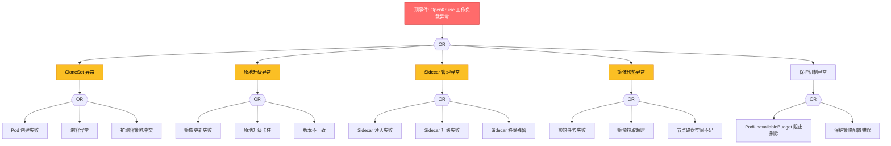

> **生产环境安全提示**
>
> 本文档包含可直接执行的运维命令。执行前请确认：当前目标集群与 Namespace 是否正确；是否具备足够的 RBAC 权限；是否已在非生产环境验证。命令风险等级标注：🔴 高风险（可能造成数据丢失或服务中断）、🟡 中风险（会修改集群状态，但通常可回滚）、🟢 低风险/只读（信息收集，无副作用）。


# OpenKruise 工作负载异常 FTA 树

## 适用范围与说明
- **目标**：覆盖 OpenKruise 增强工作负载在生产环境中的异常路径。
- **范围**：CloneSet 管理、原地升级、Sidecar 注入、镜像预热、保护机制。
- **符号**：
  - **OR 门**：任一子事件成立即可触发父事件
  - **AND 门**：所有子事件同时成立才触发父事件

---

## Mermaid FTA 树



---

## 常见问题场景

### 场景 1: CloneSet Pod 创建失败

**顶事件**: CloneSet 创建的 Pod 处于 Pending/Failed 状态

```
# 🟢 低风险：只读/信息收集，通常无副作用
诊断路径:
1. 检查 CloneSet 状态
   kubectl get cloneset <name> -n <namespace>

2. 检查 Pod 事件
   kubectl describe pod -n <namespace> -l kruise.io/cloneset-name=<name>

3. 检查镜像配置
   kubectl get cloneset <name> -n <namespace> -o jsonpath='{.spec.template.spec.containers[*].image}'

4. 检查资源配额
   kubectl describe namespace <namespace> | grep -E "quota|limit"

5. 检查节点标签
   kubectl get nodes --show-labels | grep <topology-key>
```
### 场景 2: 原地升级卡住

**顶事件**: Pod 镜像已更新但容器未实际重启，版本不一致

```
# 🟡 中风险：会修改集群/资源状态，执行前请确认目标、影响范围与授权
诊断路径:
1. 检查工作负载版本
   kubectl get pod -n <namespace> -o jsonpath='{range .items[*]}{.metadata.labels.kruise\.io/workload-transition-mark\.version}{"\n"}{end}'

2. 检查原地升级配置
   kubectl get cloneset <name> -n <namespace> -o yaml | grep -A10 "upgradeStrategy"

3. 查看 Kruise Controller 日志
   kubectl logs -n kruise-system -l app=kruise-controller --tail=100 | grep cloneset

4. 检查 Pod 状态
   kubectl get pod -n <namespace> -o wide

5. 手动触发升级
   kubectl annotate pod <pod> -n <namespace> kruise.io/inplace-update-force="true"
```
### 场景 3: Sidecar 注入失败

**顶事件**: 配置了 SidecarSet 但 Sidecar 未注入到 Pod

```
# 🟢 低风险：只读/信息收集，通常无副作用
诊断路径:
1. 检查 SidecarSet 配置
   kubectl get sidecarset <name> -n <namespace> -o yaml

2. 检查 SidecarSet 匹配标签
   kubectl get sidecarset <name> -n <namespace> -o jsonpath='{.spec.namespaceSelector}'

3. 检查 Pod 是否匹配
   kubectl get pod <pod> -n <namespace> -o jsonpath='{.metadata.labels}'

4. 查看 Kruise Daemon 日志
   kubectl logs -n kruise-system -l app=kruise-daemon --tail=100 | grep sidecar

5. 检查 Sidecar 镜像可访问性
   crictl images | grep <sidecar-image>
```
### 场景 4: PodUnavailableBudget 阻止操作

**顶事件**: 尝试删除 Pod 被阻止，提示 PodUnavailableBudget

```
# 🟢 低风险：只读/信息收集，通常无副作用
诊断路径:
1. 检查 Pub 资源
   kubectl get pub -A

2. 查看 Pub 详情
   kubectl describe pub <name> -n <namespace>

3. 检查被保护的 Pod 数量
   kubectl get pod -n <namespace> -l kruise.io/pub-block=true

4. 检查最大不可用数量
   kubectl get pub <name> -n <namespace> -o jsonpath='{.spec.maxUnavailable}'

5. 临时禁用保护 (需谨慎)
   kubectl delete pub <name> -n <namespace>
```
---

## 故障排查命令速查

``` bash
# 🟡 中风险：会修改集群/资源状态，执行前请确认目标、影响范围与授权
# 1. 检查 OpenKruise 组件状态
kubectl get pods -n kruise-system

# 2. 查看 CloneSet 列表
kubectl get cloneset -A

# 3. 查看 CloneSet 详情
kubectl describe cloneset <name> -n <namespace>

# 4. 查看 SidecarSet 列表
kubectl get sidecarset -A

# 5. 查看 SidecarSet 详情
kubectl describe sidecarset <name> -n <namespace>

# 6. 查看 PodUnavailableBudget
kubectl get pub -A

# 7. 查看镜像预热任务
kubectl get imagepulljob -A

# 8. 查看原地升级状态
kubectl get pod -n <namespace> -o jsonpath='{range .items[*]}{.metadata.name}{"\t"}{.metadata.labels.kruise\.io/workload-transition-mark\.version}{"\n"}{end}'

# 9. 测试 Sidecar 注入
kubectl debug -it <pod> -n <namespace> --image=<sidecar-image> -- /bin/sh

# 10. 手动触发原地升级
kubectl annotate pod <pod> -n <namespace> kruise.io/inplace-update-enabled="true"
```
---

## 配置参考

### CloneSet 配置示例

```yaml
apiVersion: apps.kruise.io/v1alpha1
kind: CloneSet
metadata:
  name: cloneset-app
  namespace: default
spec:
  replicas: 10
  selector:
    matchLabels:
      app: my-app
  template:
    metadata:
      labels:
        app: my-app
    spec:
      containers:
      - name: app
        image: my-app:v1.0
        resources:
          limits:
            cpu: "500m"
            memory: "512Mi"
  updateStrategy:
    type: InPlaceOnly
    inPlaceUpdateStrategy:
      gracePeriodSeconds: 10
  scaleStrategy:
    maxSurge: 10%
    maxUnavailable: 0
```

### SidecarSet 配置示例

```yaml
apiVersion: apps.kruise.io/v1alpha1
kind: SidecarSet
metadata:
  name: log-sidecar
  namespace: kruise-system
spec:
  selector:
    matchLabels:
      app: my-app
  containers:
  - name: log-sidecar
    image: log-collector:v1.0
    volumeMounts:
    - name: shared-log
      mountPath: /var/log
  volumes:
  - name: shared-log
    emptyDir: {}
  injection:
    strategy: BeforeAppContainer
```

### PodUnavailableBudget 配置示例

```yaml
apiVersion: apps.kruise.io/v1alpha1
kind: PodUnavailableBudget
metadata:
  name: app-pub
  namespace: default
spec:
  target:
    apiVersion: apps.kruise.io/v1alpha1
    kind: CloneSet
    selector:
      matchLabels:
        app: my-app
  maxUnavailable: 3
```

---

## 相关文档

- [OpenKruise CNCF Landscape](./生态参考/incubating/openkruise/openkruise.md)
- [OpenKruise 全局索引](../../../21-%E7%94%9F%E6%80%81%E5%8F%82%E8%80%83/03-%E9%A2%86%E5%9F%9F%E7%B4%A2%E5%BC%95/openkruise-index.md)
- [Deployment 故障排查](../../04-%E9%AB%98%E7%BA%A7%E6%8E%92%E9%9A%9C/structural-05-workloads/02-deployment-troubleshooting.md)
- [StatefulSet 故障排查](../../04-%E9%AB%98%E7%BA%A7%E6%8E%92%E9%9A%9C/structural-05-workloads/03-statefulset-troubleshooting.md)

## Related

- [[26-技能/05-网络/ingress/培训/learn-05-ingress-basics|第五课：Ingress - 外部 HTTP/HTTPS 访问]] — Cross-reference
- [[21-生态参考/03-领域索引/openkruise-index|OpenKruise 全局索引]]


<!-- risk-assessed -->
