> **生产环境安全提示**
>
> 本文档包含可直接执行的运维命令。执行前请确认：当前目标集群与 Namespace 是否正确；是否具备足够的 RBAC 权限；是否已在非生产环境验证。命令风险等级标注：🔴 高风险（可能造成数据丢失或服务中断）、🟡 中风险（会修改集群状态，但通常可回滚）、🟢 低风险/只读（信息收集，无副作用）。

# Pod 创建端到端异常故障树分析

<!-- condition: Pod 创建后长期 Pending、ContainerCreating、ImagePullBackOff、CrashLoopBackOff，或 Pod Running 但无法通过 Service 访问 -->

## 适用范围与说明
- **目标**：覆盖从 `kubectl apply` 到 Pod 可被 Service 访问的全链路异常，支撑快速定位失败阶段。
- **范围**：API Server / Admission、Scheduler、kubelet、containerd、CNI、CSI、Controller Manager、kube-proxy。
- **符号**：
  - **OR 门**：任一子事件成立即可触发父事件
  - **AND 门**：所有子事件同时成立才触发父事件

---

## Mermaid FTA 树

```mermaid
flowchart TD
  TE[顶事件: Pod 创建失败 / 创建后无法通过 Service 访问]
  OR0{{OR}}
  TE --> OR0

  OR0 --> API[API Server / Admission 阶段异常]
  OR0 --> SCHED[Scheduler 阶段异常]
  OR0 --> KUBELET[kubelet 阶段异常]
  OR0 --> CRI[容器运行时阶段异常]
  OR0 --> CNI_NET[CNI 网络阶段异常]
  OR0 --> CSI_VOL[CSI 存储阶段异常]
  OR0 --> KCM[Controller Manager 阶段异常]
  OR0 --> KP[kube-proxy 阶段异常]

  %% API Server / Admission 分支
  API_OR{{OR}}
  API --> API_OR
  API_OR --> API1[认证/鉴权失败]
  API_OR --> API2[Admission Webhook 拒绝]
  API_OR --> API3[ResourceQuota / LimitRange 超限]
  API_OR --> API4[Schema 校验失败]
  API_OR --> API5[etcd 写入失败]

  API2_AND{{AND}}
  API2 --> API2_AND
  API2_AND --> API2A[Webhook 不可用]
  API2_AND --> API2B[failurePolicy=Fail]

  %% Scheduler 分支
  SCHED_OR{{OR}}
  SCHED --> SCHED_OR
  SCHED_OR --> SCHED1[Scheduler 未运行]
  SCHED_OR --> SCHED2[资源不足]
  SCHED_OR --> SCHED3[污点/亲和性冲突]
  SCHED_OR --> SCHED4[Topology 约束不满足]
  SCHED_OR --> SCHED5[自定义调度器异常]

  %% kubelet 分支
  KUBELET_OR{{OR}}
  KUBELET --> KUBELET_OR
  KUBELET_OR --> KLT1[kubelet 未运行]
  KUBELET_OR --> KLT2[kubelet 证书过期]
  KUBELET_OR --> KLT3[节点资源压力触发驱逐]
  KUBELET_OR --> KLT4[API Server 不可达]
  KUBELET_OR --> KLT5[PLEG 不健康]

  %% 容器运行时分支
  CRI_OR{{OR}}
  CRI --> CRI_OR
  CRI_OR --> CRI1[containerd 未运行]
  CRI_OR --> CRI2[镜像拉取失败]
  CRI_OR --> CRI3[sandbox 创建失败]
  CRI_OR --> CRI4[磁盘/inode 不足]
  CRI_OR --> CRI5[shim 进程泄漏]

  CRI2_OR{{OR}}
  CRI2 --> CRI2_OR
  CRI2_OR --> CRI2A[镜像不存在]
  CRI2_OR --> CRI2B[仓库认证失败]
  CRI2_OR --> CRI2C[网络不可达]
  CRI2_OR --> CRI2D[仓库限流]

  %% CNI 网络分支
  CNI_NET_OR{{OR}}
  CNI_NET --> CNI_NET_OR
  CNI_NET_OR --> CNI1[CNI 插件未运行]
  CNI_NET_OR --> CNI2[IPAM 地址耗尽]
  CNI_NET_OR --> CNI3[节点路由缺失]
  CNI_NET_OR --> CNI4[NetworkPolicy 误拦截]
  CNI_NET_OR --> CNI5[pause 容器网络命名空间创建失败]

  %% CSI 存储分支
  CSI_VOL_OR{{OR}}
  CSI_VOL --> CSI_VOL_OR
  CSI_VOL_OR --> CSI1[CSI driver 未注册]
  CSI_VOL_OR --> CSI2[VolumeAttachment 失败]
  CSI_VOL_OR --> CSI3[存储后端不可达]
  CSI_VOL_OR --> CSI4[挂载权限/SELinux 问题]

  %% Controller Manager 分支
  KCM_OR{{OR}}
  KCM --> KCM_OR
  KCM_OR --> KCM1[KCM 未运行]
  KCM_OR --> KCM2[EndpointSlice 未更新]
  KCM_OR --> KCM3[Pod 未通过 readinessProbe]

  %% kube-proxy 分支
  KP_OR{{OR}}
  KP --> KP_OR
  KP_OR --> KP1[kube-proxy 未运行]
  KP_OR --> KP2[转发规则未生成]
  KP_OR --> KP3[EndpointSlice 未同步]
  KP_OR --> KP4[conntrack 表满]
  KP_OR --> KP5[网络策略/安全组阻断]
```

---

## 阶段化诊断命令速查

| 阶段 | 检查命令 | 关键日志/指标 |
|------|---------|--------------|
| API Server | `kubectl get events --field-selector involvedObject.name=<pod>` | Admission Webhook 拒绝、Quota 超限 |
| Scheduler | `kubectl get events --field-selector reason=FailedScheduling` | 资源不足、污点冲突 |
| kubelet | `kubectl describe node <node>` / `journalctl -u kubelet` | PLEG unhealthy、证书过期 |
| containerd | `crictl info` / `crictl ps -a` / `journalctl -u containerd` | ImagePullBackOff、sandbox 失败 |
| CNI | `kubectl get pods -n kube-system -l k8s-app=<cni>` / `ip route` | CNI Pod CrashLoop、IP 耗尽 |
| CSI | `kubectl get csidrivers` / `kubectl describe pvc <pvc>` | VolumeAttachment 失败 |
| Controller Manager | `kubectl get endpointslices -l kubernetes.io/service-name=<svc>` | EndpointSlice 为空 |
| kube-proxy | `iptables -t nat -L KUBE-SERVICES` / `ipvsadm -Ln` | 规则缺失、conntrack 满 |

---

## 生产级观测与证据

- **关键事件**：
  - `FailedScheduling`、`FailedCreatePodSandBox`、`FailedMount`、`FailedAttachVolume`
  - `ImagePullBackOff`、`CrashLoopBackOff`、`ErrImagePull`
  - `Killing` / `Evicted`
- **关键指标**：
  - `kubelet_pod_start_duration_seconds`
  - `kubeproxy_sync_proxy_rules_duration_seconds`
  - `coredns_dns_request_duration_seconds`
  - `containerd_runtime_operations_errors_total`

---

## 相关链接

- [[26-技能/04-工作负载/pod/方法论/FTA Methodology and Core Principles.md|FTA 方法论]]
- [[26-技能/04-工作负载/pod/方法论/FTA Diagnostic Execution Engine.md|FTA 诊断执行引擎]]
- [[01-集群基础/01-架构总览/05-pod-creation-end-to-end-flow.md|Pod 创建端到端流程与组件联动排障]]
- [[19-故障诊断/06-FTA故障树/list/pod-fta.md|Pod 异常故障树分析]]
- [[19-故障诊断/06-FTA故障树/list/service-fta.md|Service 异常故障树分析]]
- [[19-故障诊断/06-FTA故障树/list/kubelet-fta.md|kubelet 异常故障树分析]]
- [[19-故障诊断/06-FTA故障树/list/cni-fta.md|CNI 异常故障树分析]]

<!-- risk-assessed -->
