> **生产环境安全提示**
>
> 本文档包含可直接执行的运维命令。执行前请确认：当前目标集群与 Namespace 是否正确；是否具备足够的 RBAC 权限；是否已在非生产环境验证。命令风险等级标注：🔴 高风险（可能造成数据丢失或服务中断）、🟡 中风险（会修改集群状态，但通常可回滚）、🟢 低风险/只读（信息收集，无副作用）。


<!-- condition: kubectl get events -A | grep -E 'exceeded quota|forbidden.*quota' 显示配额超限 -->

# ResourceQuota 异常 FTA 树

## 适用范围与说明
- **目标**：覆盖资源配额耗尽、配额计算异常与误拦截的关键成因与路径。
- **范围**：命名空间配额、LimitRange、资源请求/限制、控制面与审计。
- **符号**：
  - **OR 门**：任一子事件成立即可触发父事件
  - **AND 门**：所有子事件同时成立才触发父事件

---

## Mermaid FTA 树

```mermaid
flowchart TD
  TE[顶事件: 资源配额异常]
  OR0{{OR}}
  TE --> OR0

  OR0 --> QUO[配额耗尽]
  OR0 --> CALC[配额计算异常]
  OR0 --> CONF[配置错误]
  OR0 --> CTRL[控制面异常]
  OR0 --> AUDIT[审计与回滚缺失]

  %% ========== 1. 配额耗尽 ==========
  QUO_OR{{OR}}
  QUO --> QUO_OR
  QUO_OR --> QUO_BURST[突发请求耗尽]
  QUO_OR --> QUO_LEAK[资源泄漏/未释放]
  QUO_OR --> QUO_SCOPE[配额范围不足]

  %% 1.1 突发请求耗尽
  QUO_BURST_OR{{OR}}
  QUO_BURST --> QUO_BURST_OR
  QUO_BURST_OR --> QUO_BURST1[批量 Pod 创建]
  QUO_BURST_OR --> QUO_BURST2[Job 并发过高]
  QUO_BURST_OR --> QUO_BURST3[HPA 扩容触发]

  %% 1.2 资源泄漏/未释放
  QUO_LEAK_OR{{OR}}
  QUO_LEAK --> QUO_LEAK_OR
  QUO_LEAK_OR --> QUO_LEAK1[Completed Pod 未清理]
  QUO_LEAK_OR --> QUO_LEAK2[孤儿 PVC 未释放]
  QUO_LEAK_OR --> QUO_LEAK3[终止中资源占用配额]

  %% 1.3 配额范围不足
  QUO_SCOPE_OR{{OR}}
  QUO_SCOPE --> QUO_SCOPE_OR
  QUO_SCOPE_OR --> QUO_SCOPE1[CPU/Memory 配额过低]
  QUO_SCOPE_OR --> QUO_SCOPE2[Pod 数量配额过低]
  QUO_SCOPE_OR --> QUO_SCOPE3[PVC 数量/容量配额过低]

  %% ========== 2. 配额计算异常 ==========
  CALC_OR{{OR}}
  CALC --> CALC_OR
  CALC_OR --> CALC_DELAY[统计延迟]
  CALC_OR --> CALC_DRIFT[状态漂移]
  CALC_OR --> CALC_SCOPE[作用域异常]

  %% 2.1 统计延迟
  CALC_DELAY_OR{{OR}}
  CALC_DELAY --> CALC_DELAY_OR
  CALC_DELAY_OR --> CALC_DELAY1[Controller 同步延迟]
  CALC_DELAY_OR --> CALC_DELAY2[API Server 缓存延迟]
  CALC_DELAY_OR --> CALC_DELAY3[etcd Watch 延迟]

  %% 2.2 状态漂移
  CALC_DRIFT_OR{{OR}}
  CALC_DRIFT --> CALC_DRIFT_OR
  CALC_DRIFT_OR --> CALC_DRIFT1[配额计数与实际不符]
  CALC_DRIFT_OR --> CALC_DRIFT2[对象删除后配额未释放]

  %% AND 门：对象已删除 + 配额未释放
  AND_DRIFT{{"AND: 对象删除 + 配额未释放"}}
  CALC_DRIFT --> AND_DRIFT
  AND_DRIFT --> AND_DRIFT1[Pod/PVC 已删除]
  AND_DRIFT --> AND_DRIFT2[ResourceQuota.status.used 未更新]

  %% 2.3 作用域异常
  CALC_SCOPE_OR{{OR}}
  CALC_SCOPE --> CALC_SCOPE_OR
  CALC_SCOPE_OR --> CALC_SCOPE1[scopeSelector 配置错误]
  CALC_SCOPE_OR --> CALC_SCOPE2[priorityClass 配额计算错误]

  %% ========== 3. 配置错误 ==========
  CONF_OR{{OR}}
  CONF --> CONF_OR
  CONF_OR --> CONF_QUOTA[ResourceQuota 配置]
  CONF_OR --> CONF_LIMIT[LimitRange 配置]
  CONF_OR --> CONF_CONFLICT[配置冲突]

  %% 3.1 ResourceQuota 配置
  CONF_QUOTA_OR{{OR}}
  CONF_QUOTA --> CONF_QUOTA_OR
  CONF_QUOTA_OR --> CONF_QUOTA1[hard 限制设置过低]
  CONF_QUOTA_OR --> CONF_QUOTA2[资源类型配置错误]
  CONF_QUOTA_OR --> CONF_QUOTA3[跨命名空间配额不一致]

  %% 3.2 LimitRange 配置
  CONF_LIMIT_OR{{OR}}
  CONF_LIMIT --> CONF_LIMIT_OR
  CONF_LIMIT_OR --> CONF_LIMIT1[default 值设置不当]
  CONF_LIMIT_OR --> CONF_LIMIT2[min/max 范围过窄]
  CONF_LIMIT_OR --> CONF_LIMIT3[defaultRequest 与 limit 不匹配]

  %% AND 门：无 request + 无 LimitRange default
  AND_LIMIT{{"AND: 无 request + 无 default"}}
  CONF_LIMIT --> AND_LIMIT
  AND_LIMIT --> AND_LIMIT1[Pod 未指定 resources.requests]
  AND_LIMIT --> AND_LIMIT2[命名空间无 LimitRange default]

  %% 3.3 配置冲突
  CONF_CONFLICT_OR{{OR}}
  CONF_CONFLICT --> CONF_CONFLICT_OR
  CONF_CONFLICT_OR --> CONF_CONFLICT1[ResourceQuota 与 LimitRange 冲突]
  CONF_CONFLICT_OR --> CONF_CONFLICT2[多 ResourceQuota 作用域重叠]

  %% ========== 4. 控制面异常 ==========
  CTRL_OR{{OR}}
  CTRL --> CTRL_OR
  CTRL_OR --> CTRL_API[API Server 异常]
  CTRL_OR --> CTRL_RC[ResourceQuota Controller 异常]
  CTRL_OR --> CTRL_ADMIT[准入控制异常]

  %% 4.1 API Server 异常
  CTRL_API_OR{{OR}}
  CTRL_API --> CTRL_API_OR
  CTRL_API_OR --> CTRL_API1[配额准入控制器未启用]
  CTRL_API_OR --> CTRL_API2[API Server 过载]

  %% 4.2 ResourceQuota Controller 异常
  CTRL_RC_OR{{OR}}
  CTRL_RC --> CTRL_RC_OR
  CTRL_RC_OR --> CTRL_RC1[Controller 不可用]
  CTRL_RC_OR --> CTRL_RC2[Controller 同步队列积压]
  CTRL_RC_OR --> CTRL_RC3[Controller Leader 选举异常]

  %% 4.3 准入控制异常
  CTRL_ADMIT_OR{{OR}}
  CTRL_ADMIT --> CTRL_ADMIT_OR
  CTRL_ADMIT_OR --> CTRL_ADMIT1[ResourceQuota 准入拒绝]
  CTRL_ADMIT_OR --> CTRL_ADMIT2[LimitRanger 准入拒绝]

  %% ========== 5. 审计与回滚缺失 ==========
  AUDIT_OR{{OR}}
  AUDIT --> AUDIT_OR
  AUDIT_OR --> AUDIT1[配额变更未审计]
  AUDIT_OR --> AUDIT2[配额使用无告警]
  AUDIT_OR --> AUDIT3[无配额调整机制]
```



---

## 生产级观测与证据
- **事件**：
  - `Forbidden` - 配额超限拒绝
  - `exceeded quota` - 配额耗尽
- **关键指标**：
  - `kube_resourcequota` - 配额使用情况
  - `kube_resourcequota_created` - 配额创建时间
  - 命名空间配额使用率
- **关键日志**：
  - `apiserver` 审计日志 - 配额拒绝记录
  - `kube-controller-manager` - ResourceQuota Controller 日志
- **配置核对**：
  - `ResourceQuota` spec.hard
  - `LimitRange` defaults 和 limits
  - scopeSelector 配置

---

## JSON 工作流（含与/或门控件）

```json
{
  "flow_steps": [
    { "name": "开始", "action": "start", "step": "start_rq_fta", "next_step": "event_rq_abnormal" },
    { "name": "顶事件: 资源配额异常", "action": "event", "step": "event_rq_abnormal", "description": "请求被拒/配额耗尽", "next_step": "gate_root_or" },
    { "name": "根因 OR 门", "action": "gate_or", "step": "gate_root_or", "control": "or_gate", "gate_type": "OR", "next_steps": ["cat_quota", "cat_calc", "cat_conf", "cat_ctrl", "cat_audit"] },

    { "name": "类别: 配额耗尽", "action": "category", "step": "cat_quota", "next_step": "gate_quota_or" },
    { "name": "配额耗尽 OR 门", "action": "gate_or", "step": "gate_quota_or", "control": "or_gate", "gate_type": "OR", "next_steps": ["subcat_quo_burst", "subcat_quo_leak", "subcat_quo_scope"] },

    { "name": "子类: 突发请求耗尽", "action": "subcategory", "step": "subcat_quo_burst", "next_step": "gate_quo_burst_or" },
    { "name": "突发请求 OR 门", "action": "gate_or", "step": "gate_quo_burst_or", "control": "or_gate", "gate_type": "OR", "next_steps": ["event_quo_burst_pod", "event_quo_burst_job", "event_quo_burst_hpa"] },
    {
      "name": "底事件: 批量 Pod 创建",
      "action": "bottom_event",
      "step": "event_quo_burst_pod",
      "description": "大量 Pod 同时创建导致配额瞬间耗尽",
      "metadata": {
        "severity": "high",
        "probability": "common",
        "mttr_minutes": 15,
        "detection": {
          "events": ["Forbidden", "exceeded quota"],
          "metrics": ["kube_resourcequota{resource='pods'}"],
          "logs": ["exceeded quota"]
        },
        "remediation": {
          "manual_steps": [
            "检查配额使用: kubectl describe resourcequota -n <ns>",
            "增加配额或减少并发创建数量",
            "使用 PodDisruptionBudget 控制创建速率"
          ],
          "auto_actions": ["配置配额使用率告警"]
        }
      },
      "next_step": "gate_root_or"
    },
    {
      "name": "底事件: Job 并发过高",
      "action": "bottom_event",
      "step": "event_quo_burst_job",
      "description": "CronJob 或 Job 并发数过高耗尽配额",
      "metadata": {
        "severity": "high",
        "probability": "medium",
        "mttr_minutes": 20,
        "detection": {
          "events": ["Forbidden", "exceeded quota"],
          "metrics": ["kube_job_status_active"],
          "logs": ["exceeded quota"]
        },
        "remediation": {
          "manual_steps": [
            "检查 Job parallelism 配置",
            "设置 CronJob concurrencyPolicy: Forbid",
            "增加配额或降低并发"
          ],
          "auto_actions": []
        }
      },
      "next_step": "gate_root_or"
    },
    {
      "name": "底事件: HPA 扩容触发",
      "action": "bottom_event",
      "step": "event_quo_burst_hpa",
      "description": "HPA 快速扩容超出配额限制",
      "metadata": {
        "severity": "high",
        "probability": "medium",
        "mttr_minutes": 15,
        "detection": {
          "events": ["Forbidden", "FailedCreate"],
          "metrics": ["kube_hpa_status_desired_replicas"],
          "logs": ["exceeded quota"]
        },
        "remediation": {
          "manual_steps": [
            "检查 HPA maxReplicas 与配额匹配",
            "增加命名空间配额",
            "调整 HPA 扩容策略"
          ],
          "auto_actions": []
        }
      },
      "next_step": "gate_root_or"
    },

    { "name": "子类: 资源泄漏/未释放", "action": "subcategory", "step": "subcat_quo_leak", "next_step": "gate_quo_leak_or" },
    { "name": "资源泄漏 OR 门", "action": "gate_or", "step": "gate_quo_leak_or", "control": "or_gate", "gate_type": "OR", "next_steps": ["event_quo_leak_pod", "event_quo_leak_pvc", "event_quo_leak_term"] },
    {
      "name": "底事件: Completed Pod 未清理",
      "action": "bottom_event",
      "step": "event_quo_leak_pod",
      "description": "已完成的 Job/CronJob Pod 未及时清理",
      "metadata": {
        "severity": "medium",
        "probability": "common",
        "mttr_minutes": 15,
        "detection": {
          "events": [],
          "metrics": ["kube_pod_status_phase{phase='Succeeded'}"],
          "logs": []
        },
        "remediation": {
          "manual_steps": [
            "配置 Job ttlSecondsAfterFinished",
            "清理 Completed Pod: kubectl delete pods --field-selector=status.phase=Succeeded",
            "配置定期清理脚本"
          ],
          "auto_actions": ["配置 TTL Controller"]
        }
      },
      "next_step": "gate_root_or"
    },
    {
      "name": "底事件: 孤儿 PVC 未释放",
      "action": "bottom_event",
      "step": "event_quo_leak_pvc",
      "description": "Pod 删除后 PVC 未释放仍占用配额",
      "metadata": {
        "severity": "medium",
        "probability": "medium",
        "mttr_minutes": 20,
        "detection": {
          "events": [],
          "metrics": ["kube_persistentvolumeclaim_status_phase{phase='Bound'}"],
          "logs": []
        },
        "remediation": {
          "manual_steps": [
            "识别孤儿 PVC: 无 Pod 引用的 PVC",
            "评估后删除: kubectl delete pvc <name>",
            "使用 StorageClass reclaimPolicy: Delete"
          ],
          "auto_actions": []
        }
      },
      "next_step": "gate_root_or"
    },
    {
      "name": "底事件: 终止中资源占用配额",
      "action": "bottom_event",
      "step": "event_quo_leak_term",
      "description": "Terminating 状态的资源仍占用配额",
      "metadata": {
        "severity": "medium",
        "probability": "low",
        "mttr_minutes": 30,
        "detection": {
          "events": [],
          "metrics": [],
          "logs": ["stuck in Terminating"]
        },
        "remediation": {
          "manual_steps": [
            "检查 Terminating 资源: kubectl get pods --field-selector=status.phase=Terminating",
            "检查 Finalizers 是否阻塞删除",
            "强制删除: kubectl delete pod --force --grace-period=0"
          ],
          "auto_actions": []
        }
      },
      "next_step": "gate_root_or"
    },

    { "name": "子类: 配额范围不足", "action": "subcategory", "step": "subcat_quo_scope", "next_step": "gate_quo_scope_or" },
    { "name": "配额范围 OR 门", "action": "gate_or", "step": "gate_quo_scope_or", "control": "or_gate", "gate_type": "OR", "next_steps": ["event_quo_scope_cpu", "event_quo_scope_pod", "event_quo_scope_pvc"] },
    {
      "name": "底事件: CPU/Memory 配额过低",
      "action": "bottom_event",
      "step": "event_quo_scope_cpu",
      "description": "CPU 或 Memory 配额设置过低无法满足需求",
      "metadata": {
        "severity": "high",
        "probability": "common",
        "mttr_minutes": 15,
        "detection": {
          "events": ["Forbidden"],
          "metrics": ["kube_resourcequota{resource='requests.cpu'}"],
          "logs": ["exceeded quota"]
        },
        "remediation": {
          "manual_steps": [
            "评估实际资源需求",
            "增加配额: kubectl edit resourcequota <name>",
            "优化应用资源使用"
          ],
          "auto_actions": []
        }
      },
      "next_step": "gate_root_or"
    },
    {
      "name": "底事件: Pod 数量配额过低",
      "action": "bottom_event",
      "step": "event_quo_scope_pod",
      "description": "Pod 数量配额限制过低",
      "metadata": {
        "severity": "high",
        "probability": "common",
        "mttr_minutes": 10,
        "detection": {
          "events": ["Forbidden"],
          "metrics": ["kube_resourcequota{resource='pods'}"],
          "logs": ["exceeded quota"]
        },
        "remediation": {
          "manual_steps": [
            "检查当前 Pod 数量和配额",
            "增加 pods 配额",
            "评估是否需要清理旧 Pod"
          ],
          "auto_actions": []
        }
      },
      "next_step": "gate_root_or"
    },
    {
      "name": "底事件: PVC 数量/容量配额过低",
      "action": "bottom_event",
      "step": "event_quo_scope_pvc",
      "description": "PVC 数量或总容量配额不足",
      "metadata": {
        "severity": "medium",
        "probability": "medium",
        "mttr_minutes": 20,
        "detection": {
          "events": ["Forbidden"],
          "metrics": ["kube_resourcequota{resource='persistentvolumeclaims'}"],
          "logs": ["exceeded quota"]
        },
        "remediation": {
          "manual_steps": [
            "检查 PVC 配额使用情况",
            "增加 persistentvolumeclaims 或 requests.storage 配额",
            "清理不需要的 PVC"
          ],
          "auto_actions": []
        }
      },
      "next_step": "gate_root_or"
    },

    { "name": "类别: 配额计算异常", "action": "category", "step": "cat_calc", "next_step": "gate_calc_or" },
    { "name": "配额计算 OR 门", "action": "gate_or", "step": "gate_calc_or", "control": "or_gate", "gate_type": "OR", "next_steps": ["subcat_calc_delay", "subcat_calc_drift", "subcat_calc_scope"] },

    { "name": "子类: 统计延迟", "action": "subcategory", "step": "subcat_calc_delay", "next_step": "gate_calc_delay_or" },
    { "name": "统计延迟 OR 门", "action": "gate_or", "step": "gate_calc_delay_or", "control": "or_gate", "gate_type": "OR", "next_steps": ["event_calc_delay_ctrl", "event_calc_delay_api", "event_calc_delay_etcd"] },
    {
      "name": "底事件: Controller 同步延迟",
      "action": "bottom_event",
      "step": "event_calc_delay_ctrl",
      "description": "ResourceQuota Controller 同步配额状态延迟",
      "metadata": {
        "severity": "medium",
        "probability": "low",
        "mttr_minutes": 20,
        "detection": {
          "events": [],
          "metrics": ["workqueue_depth{name='resourcequota'}"],
          "logs": ["slow sync"]
        },
        "remediation": {
          "manual_steps": [
            "检查 controller-manager 负载",
            "检查 etcd 性能",
            "增加 controller-manager 资源"
          ],
          "auto_actions": []
        }
      },
      "next_step": "gate_root_or"
    },
    {
      "name": "底事件: API Server 缓存延迟",
      "action": "bottom_event",
      "step": "event_calc_delay_api",
      "description": "API Server 缓存同步延迟",
      "metadata": {
        "severity": "low",
        "probability": "low",
        "mttr_minutes": 15,
        "detection": {
          "events": [],
          "metrics": [],
          "logs": []
        },
        "remediation": {
          "manual_steps": [
            "检查 API Server 负载",
            "验证 etcd 延迟"
          ],
          "auto_actions": []
        }
      },
      "next_step": "gate_root_or"
    },
    {
      "name": "底事件: etcd Watch 延迟",
      "action": "bottom_event",
      "step": "event_calc_delay_etcd",
      "description": "etcd Watch 事件延迟导致配额更新慢",
      "metadata": {
        "severity": "medium",
        "probability": "low",
        "mttr_minutes": 30,
        "detection": {
          "events": [],
          "metrics": ["etcd_network_client_grpc_received_bytes_total"],
          "logs": ["slow watch"]
        },
        "remediation": {
          "manual_steps": [
            "检查 etcd 性能指标",
            "优化 etcd 配置",
            "检查网络延迟"
          ],
          "auto_actions": []
        }
      },
      "next_step": "gate_root_or"
    },

    { "name": "子类: 状态漂移", "action": "subcategory", "step": "subcat_calc_drift", "next_step": "gate_calc_drift_or" },
    { "name": "状态漂移 OR 门", "action": "gate_or", "step": "gate_calc_drift_or", "control": "or_gate", "gate_type": "OR", "next_steps": ["event_calc_drift_count", "event_calc_drift_del", "gate_and_drift"] },
    {
      "name": "底事件: 配额计数与实际不符",
      "action": "bottom_event",
      "step": "event_calc_drift_count",
      "description": "ResourceQuota.status.used 与实际资源数不匹配",
      "metadata": {
        "severity": "medium",
        "probability": "low",
        "mttr_minutes": 30,
        "detection": {
          "events": [],
          "metrics": [],
          "logs": []
        },
        "remediation": {
          "manual_steps": [
            "手动计算实际资源: kubectl get pods -n <ns> | wc -l",
            "对比 ResourceQuota status.used",
            "重启 controller-manager 触发重新计算"
          ],
          "auto_actions": []
        }
      },
      "next_step": "gate_root_or"
    },
    {
      "name": "底事件: 对象删除后配额未释放",
      "action": "bottom_event",
      "step": "event_calc_drift_del",
      "description": "资源删除后配额未及时释放",
      "metadata": {
        "severity": "medium",
        "probability": "low",
        "mttr_minutes": 20,
        "detection": {
          "events": [],
          "metrics": [],
          "logs": []
        },
        "remediation": {
          "manual_steps": [
            "检查是否有 Finalizers 阻塞删除",
            "等待 Controller 同步",
            "必要时删除并重建 ResourceQuota"
          ],
          "auto_actions": []
        }
      },
      "next_step": "gate_root_or"
    },
    {
      "name": "AND 门: 对象删除 + 配额未释放",
      "action": "gate_and",
      "step": "gate_and_drift",
      "control": "and_gate",
      "gate_type": "AND",
      "description": "对象已删除但配额仍显示占用",
      "conditions": ["Pod/PVC 已删除", "ResourceQuota.status.used 未更新"],
      "combined_severity": "high",
      "next_steps": ["event_and_drift_del", "event_and_drift_quota"],
      "next_step": "gate_root_or"
    },
    {
      "name": "AND 条件1: 对象已删除",
      "action": "and_condition",
      "step": "event_and_drift_del",
      "description": "Pod 或 PVC 已成功删除",
      "parent_gate": "gate_and_drift"
    },
    {
      "name": "AND 条件2: 配额未更新",
      "action": "and_condition",
      "step": "event_and_drift_quota",
      "description": "ResourceQuota.status.used 仍显示资源占用",
      "parent_gate": "gate_and_drift"
    },

    { "name": "子类: 作用域异常", "action": "subcategory", "step": "subcat_calc_scope", "next_step": "gate_calc_scope_or" },
    { "name": "作用域异常 OR 门", "action": "gate_or", "step": "gate_calc_scope_or", "control": "or_gate", "gate_type": "OR", "next_steps": ["event_calc_scope_sel", "event_calc_scope_pc"] },
    {
      "name": "底事件: scopeSelector 配置错误",
      "action": "bottom_event",
      "step": "event_calc_scope_sel",
      "description": "ResourceQuota scopeSelector 配置不当",
      "metadata": {
        "severity": "medium",
        "probability": "low",
        "mttr_minutes": 20,
        "detection": {
          "events": [],
          "metrics": [],
          "logs": []
        },
        "remediation": {
          "manual_steps": [
            "检查 scopeSelector 配置",
            "验证 matchExpressions 语法",
            "确保覆盖目标 Pod"
          ],
          "auto_actions": []
        }
      },
      "next_step": "gate_root_or"
    },
    {
      "name": "底事件: priorityClass 配额计算错误",
      "action": "bottom_event",
      "step": "event_calc_scope_pc",
      "description": "按 PriorityClass 划分的配额计算不正确",
      "metadata": {
        "severity": "medium",
        "probability": "low",
        "mttr_minutes": 30,
        "detection": {
          "events": [],
          "metrics": [],
          "logs": []
        },
        "remediation": {
          "manual_steps": [
            "检查 scopeSelector 中的 PriorityClass 配置",
            "验证 Pod 的 priorityClassName",
            "确认配额统计范围"
          ],
          "auto_actions": []
        }
      },
      "next_step": "gate_root_or"
    },

    { "name": "类别: 配置错误", "action": "category", "step": "cat_conf", "next_step": "gate_conf_or" },
    { "name": "配置错误 OR 门", "action": "gate_or", "step": "gate_conf_or", "control": "or_gate", "gate_type": "OR", "next_steps": ["subcat_conf_quota", "subcat_conf_limit", "subcat_conf_conflict"] },

    { "name": "子类: ResourceQuota 配置", "action": "subcategory", "step": "subcat_conf_quota", "next_step": "gate_conf_quota_or" },
    { "name": "ResourceQuota 配置 OR 门", "action": "gate_or", "step": "gate_conf_quota_or", "control": "or_gate", "gate_type": "OR", "next_steps": ["event_conf_quota_hard", "event_conf_quota_type", "event_conf_quota_ns"] },
    {
      "name": "底事件: hard 限制设置过低",
      "action": "bottom_event",
      "step": "event_conf_quota_hard",
      "description": "ResourceQuota hard 限制与实际需求不匹配",
      "metadata": {
        "severity": "high",
        "probability": "common",
        "mttr_minutes": 15,
        "detection": {
          "events": ["Forbidden"],
          "metrics": ["kube_resourcequota"],
          "logs": ["exceeded quota"]
        },
        "remediation": {
          "manual_steps": [
            "评估实际资源需求",
            "调整 hard 限制",
            "考虑业务增长预留空间"
          ],
          "auto_actions": []
        }
      },
      "next_step": "gate_root_or"
    },
    {
      "name": "底事件: 资源类型配置错误",
      "action": "bottom_event",
      "step": "event_conf_quota_type",
      "description": "配额资源类型名称或格式错误",
      "metadata": {
        "severity": "medium",
        "probability": "low",
        "mttr_minutes": 15,
        "detection": {
          "events": [],
          "metrics": [],
          "logs": []
        },
        "remediation": {
          "manual_steps": [
            "检查资源类型名称: requests.cpu, limits.memory 等",
            "使用 kubectl explain resourcequota.spec.hard",
            "参考官方文档"
          ],
          "auto_actions": []
        }
      },
      "next_step": "gate_root_or"
    },
    {
      "name": "底事件: 跨命名空间配额不一致",
      "action": "bottom_event",
      "step": "event_conf_quota_ns",
      "description": "不同命名空间配额设置不一致导致资源分配不均",
      "metadata": {
        "severity": "low",
        "probability": "medium",
        "mttr_minutes": 30,
        "detection": {
          "events": [],
          "metrics": [],
          "logs": []
        },
        "remediation": {
          "manual_steps": [
            "审计各命名空间配额配置",
            "建立配额分配策略",
            "使用模板统一管理"
          ],
          "auto_actions": []
        }
      },
      "next_step": "gate_root_or"
    },

    { "name": "子类: LimitRange 配置", "action": "subcategory", "step": "subcat_conf_limit", "next_step": "gate_conf_limit_or" },
    { "name": "LimitRange 配置 OR 门", "action": "gate_or", "step": "gate_conf_limit_or", "control": "or_gate", "gate_type": "OR", "next_steps": ["event_conf_limit_default", "event_conf_limit_range", "event_conf_limit_request", "gate_and_limit"] },
    {
      "name": "底事件: default 值设置不当",
      "action": "bottom_event",
      "step": "event_conf_limit_default",
      "description": "LimitRange default/defaultRequest 设置不合理",
      "metadata": {
        "severity": "medium",
        "probability": "common",
        "mttr_minutes": 20,
        "detection": {
          "events": [],
          "metrics": [],
          "logs": []
        },
        "remediation": {
          "manual_steps": [
            "评估典型工作负载资源需求",
            "设置合理的 default 和 defaultRequest",
            "确保 default >= defaultRequest"
          ],
          "auto_actions": []
        }
      },
      "next_step": "gate_root_or"
    },
    {
      "name": "底事件: min/max 范围过窄",
      "action": "bottom_event",
      "step": "event_conf_limit_range",
      "description": "LimitRange min/max 范围过窄限制应用部署",
      "metadata": {
        "severity": "medium",
        "probability": "medium",
        "mttr_minutes": 20,
        "detection": {
          "events": ["Forbidden"],
          "metrics": [],
          "logs": ["minimum cpu usage per Container is", "maximum cpu usage per Container is"]
        },
        "remediation": {
          "manual_steps": [
            "评估应用资源需求范围",
            "调整 min/max 限制",
            "平衡安全性和灵活性"
          ],
          "auto_actions": []
        }
      },
      "next_step": "gate_root_or"
    },
    {
      "name": "底事件: defaultRequest 与 limit 不匹配",
      "action": "bottom_event",
      "step": "event_conf_limit_request",
      "description": "defaultRequest 与 default limit 比例不合理",
      "metadata": {
        "severity": "medium",
        "probability": "medium",
        "mttr_minutes": 15,
        "detection": {
          "events": [],
          "metrics": [],
          "logs": []
        },
        "remediation": {
          "manual_steps": [
            "确保 defaultRequest <= default",
            "设置合理的 request/limit 比例",
            "参考应用实际使用情况"
          ],
          "auto_actions": []
        }
      },
      "next_step": "gate_root_or"
    },
    {
      "name": "AND 门: 无 request + 无 default",
      "action": "gate_and",
      "step": "gate_and_limit",
      "control": "and_gate",
      "gate_type": "AND",
      "description": "Pod 未指定资源请求且命名空间无 LimitRange 默认值",
      "conditions": ["Pod 未指定 resources.requests", "命名空间无 LimitRange default"],
      "combined_severity": "high",
      "next_steps": ["event_and_limit_pod", "event_and_limit_lr"],
      "next_step": "gate_root_or"
    },
    {
      "name": "AND 条件1: Pod 无 request",
      "action": "and_condition",
      "step": "event_and_limit_pod",
      "description": "Pod spec 中未指定 resources.requests",
      "parent_gate": "gate_and_limit"
    },
    {
      "name": "AND 条件2: 无 LimitRange",
      "action": "and_condition",
      "step": "event_and_limit_lr",
      "description": "命名空间中未配置 LimitRange 或无 default 值",
      "parent_gate": "gate_and_limit"
    },

    { "name": "子类: 配置冲突", "action": "subcategory", "step": "subcat_conf_conflict", "next_step": "gate_conf_conflict_or" },
    { "name": "配置冲突 OR 门", "action": "gate_or", "step": "gate_conf_conflict_or", "control": "or_gate", "gate_type": "OR", "next_steps": ["event_conf_conflict_ql", "event_conf_conflict_qq"] },
    {
      "name": "底事件: ResourceQuota 与 LimitRange 冲突",
      "action": "bottom_event",
      "step": "event_conf_conflict_ql",
      "description": "ResourceQuota 和 LimitRange 配置相互冲突",
      "metadata": {
        "severity": "medium",
        "probability": "low",
        "mttr_minutes": 30,
        "detection": {
          "events": ["Forbidden"],
          "metrics": [],
          "logs": []
        },
        "remediation": {
          "manual_steps": [
            "确保 LimitRange max * Pod数 <= ResourceQuota hard",
            "协调配额和限制配置",
            "测试验证配置兼容性"
          ],
          "auto_actions": []
        }
      },
      "next_step": "gate_root_or"
    },
    {
      "name": "底事件: 多 ResourceQuota 作用域重叠",
      "action": "bottom_event",
      "step": "event_conf_conflict_qq",
      "description": "多个 ResourceQuota 作用域重叠导致计算混乱",
      "metadata": {
        "severity": "medium",
        "probability": "low",
        "mttr_minutes": 30,
        "detection": {
          "events": [],
          "metrics": [],
          "logs": []
        },
        "remediation": {
          "manual_steps": [
            "检查各 ResourceQuota 的 scopeSelector",
            "确保作用域不重叠或有明确优先级",
            "合并或拆分配额配置"
          ],
          "auto_actions": []
        }
      },
      "next_step": "gate_root_or"
    },

    { "name": "类别: 控制面异常", "action": "category", "step": "cat_ctrl", "next_step": "gate_ctrl_or" },
    { "name": "控制面 OR 门", "action": "gate_or", "step": "gate_ctrl_or", "control": "or_gate", "gate_type": "OR", "next_steps": ["subcat_ctrl_api", "subcat_ctrl_rc", "subcat_ctrl_admit"] },

    { "name": "子类: API Server 异常", "action": "subcategory", "step": "subcat_ctrl_api", "next_step": "gate_ctrl_api_or" },
    { "name": "API Server 异常 OR 门", "action": "gate_or", "step": "gate_ctrl_api_or", "control": "or_gate", "gate_type": "OR", "next_steps": ["event_ctrl_api_ac", "event_ctrl_api_load"] },
    {
      "name": "底事件: 配额准入控制器未启用",
      "action": "bottom_event",
      "step": "event_ctrl_api_ac",
      "description": "ResourceQuota 准入控制器未启用",
      "metadata": {
        "severity": "critical",
        "probability": "rare",
        "mttr_minutes": 45,
        "detection": {
          "events": [],
          "metrics": [],
          "logs": []
        },
        "remediation": {
          "manual_steps": [
            "检查 API Server --enable-admission-plugins",
            "确保包含 ResourceQuota",
            "托管集群联系云厂商"
          ],
          "auto_actions": []
        }
      },
      "next_step": "gate_root_or"
    },
    {
      "name": "底事件: API Server 过载",
      "action": "bottom_event",
      "step": "event_ctrl_api_load",
      "description": "API Server 高负载导致配额检查延迟",
      "metadata": {
        "severity": "high",
        "probability": "low",
        "mttr_minutes": 30,
        "detection": {
          "events": [],
          "metrics": ["apiserver_request_duration_seconds"],
          "logs": ["request timeout"]
        },
        "remediation": {
          "manual_steps": [
            "检查 API Server 负载和性能",
            "增加 API Server 资源或副本",
            "优化高频请求"
          ],
          "auto_actions": []
        }
      },
      "next_step": "gate_root_or"
    },

    { "name": "子类: ResourceQuota Controller 异常", "action": "subcategory", "step": "subcat_ctrl_rc", "next_step": "gate_ctrl_rc_or" },
    { "name": "ResourceQuota Controller OR 门", "action": "gate_or", "step": "gate_ctrl_rc_or", "control": "or_gate", "gate_type": "OR", "next_steps": ["event_ctrl_rc_unavail", "event_ctrl_rc_queue", "event_ctrl_rc_leader"] },
    {
      "name": "底事件: Controller 不可用",
      "action": "bottom_event",
      "step": "event_ctrl_rc_unavail",
      "description": "kube-controller-manager 不可用影响配额同步",
      "metadata": {
        "severity": "critical",
        "probability": "rare",
        "mttr_minutes": 30,
        "detection": {
          "events": [],
          "metrics": ["up{job='kube-controller-manager'}"],
          "logs": []
        },
        "remediation": {
          "manual_steps": [
            "检查 controller-manager Pod 状态",
            "查看 controller-manager 日志",
            "重启 controller-manager"
          ],
          "auto_actions": []
        }
      },
      "next_step": "gate_root_or"
    },
    {
      "name": "底事件: Controller 同步队列积压",
      "action": "bottom_event",
      "step": "event_ctrl_rc_queue",
      "description": "ResourceQuota Controller 工作队列积压",
      "metadata": {
        "severity": "medium",
        "probability": "low",
        "mttr_minutes": 20,
        "detection": {
          "events": [],
          "metrics": ["workqueue_depth{name='resourcequota'}"],
          "logs": []
        },
        "remediation": {
          "manual_steps": [
            "检查 controller-manager 资源使用",
            "增加 controller-manager 资源",
            "检查是否有大量资源变更"
          ],
          "auto_actions": []
        }
      },
      "next_step": "gate_root_or"
    },
    {
      "name": "底事件: Controller Leader 选举异常",
      "action": "bottom_event",
      "step": "event_ctrl_rc_leader",
      "description": "Controller Leader 选举异常导致配额同步停止",
      "metadata": {
        "severity": "high",
        "probability": "rare",
        "mttr_minutes": 30,
        "detection": {
          "events": [],
          "metrics": [],
          "logs": ["failed to acquire lease"]
        },
        "remediation": {
          "manual_steps": [
            "检查 controller-manager 日志中的 leader election",
            "验证 etcd 连接正常",
            "检查 Lease 对象状态"
          ],
          "auto_actions": []
        }
      },
      "next_step": "gate_root_or"
    },

    { "name": "子类: 准入控制异常", "action": "subcategory", "step": "subcat_ctrl_admit", "next_step": "gate_ctrl_admit_or" },
    { "name": "准入控制异常 OR 门", "action": "gate_or", "step": "gate_ctrl_admit_or", "control": "or_gate", "gate_type": "OR", "next_steps": ["event_ctrl_admit_rq", "event_ctrl_admit_lr"] },
    {
      "name": "底事件: ResourceQuota 准入拒绝",
      "action": "bottom_event",
      "step": "event_ctrl_admit_rq",
      "description": "资源请求被 ResourceQuota 准入控制器拒绝",
      "metadata": {
        "severity": "high",
        "probability": "common",
        "mttr_minutes": 10,
        "detection": {
          "events": ["Forbidden"],
          "metrics": [],
          "logs": ["exceeded quota"]
        },
        "remediation": {
          "manual_steps": [
            "检查错误信息中的配额限制",
            "增加配额或减少请求",
            "清理不需要的资源"
          ],
          "auto_actions": []
        }
      },
      "next_step": "gate_root_or"
    },
    {
      "name": "底事件: LimitRanger 准入拒绝",
      "action": "bottom_event",
      "step": "event_ctrl_admit_lr",
      "description": "资源请求被 LimitRanger 准入控制器拒绝",
      "metadata": {
        "severity": "high",
        "probability": "common",
        "mttr_minutes": 10,
        "detection": {
          "events": ["Forbidden"],
          "metrics": [],
          "logs": ["minimum cpu usage per Container is", "maximum memory usage per Container is"]
        },
        "remediation": {
          "manual_steps": [
            "检查 LimitRange 限制",
            "调整 Pod 资源请求在允许范围内",
            "或修改 LimitRange 限制"
          ],
          "auto_actions": []
        }
      },
      "next_step": "gate_root_or"
    },

    { "name": "类别: 审计与回滚缺失", "action": "category", "step": "cat_audit", "next_step": "gate_audit_or" },
    { "name": "审计回滚 OR 门", "action": "gate_or", "step": "gate_audit_or", "control": "or_gate", "gate_type": "OR", "next_steps": ["event_audit_log", "event_audit_alert", "event_audit_adjust"] },
    {
      "name": "底事件: 配额变更未审计",
      "action": "bottom_event",
      "step": "event_audit_log",
      "description": "ResourceQuota 变更未记录审计日志",
      "metadata": {
        "severity": "medium",
        "probability": "common",
        "mttr_minutes": 30,
        "detection": {
          "events": [],
          "metrics": [],
          "logs": []
        },
        "remediation": {
          "manual_steps": [
            "配置 API Server 审计策略",
            "将配额配置纳入 GitOps 管理",
            "建立配额变更审批流程"
          ],
          "auto_actions": []
        }
      },
      "next_step": "gate_root_or"
    },
    {
      "name": "底事件: 配额使用无告警",
      "action": "bottom_event",
      "step": "event_audit_alert",
      "description": "配额使用率高无告警机制",
      "metadata": {
        "severity": "high",
        "probability": "common",
        "mttr_minutes": 30,
        "detection": {
          "events": [],
          "metrics": [],
          "logs": []
        },
        "remediation": {
          "manual_steps": [
            "配置基于 kube_resourcequota 指标的告警",
            "设置使用率 80%/90% 告警阈值",
            "集成到告警系统"
          ],
          "auto_actions": ["配置 Prometheus 告警规则"]
        }
      },
      "next_step": "gate_root_or"
    },
    {
      "name": "底事件: 无配额调整机制",
      "action": "bottom_event",
      "step": "event_audit_adjust",
      "description": "无动态配额调整或申请机制",
      "metadata": {
        "severity": "medium",
        "probability": "common",
        "mttr_minutes": 45,
        "detection": {
          "events": [],
          "metrics": [],
          "logs": []
        },
        "remediation": {
          "manual_steps": [
            "建立配额申请和审批流程",
            "考虑使用 Hierarchical Namespace Controller",
            "建立定期配额审查机制"
          ],
          "auto_actions": []
        }
      },
      "next_step": "gate_root_or"
    },

    { "name": "结束", "action": "end", "step": "end_rq_fta" }
  ]
}
```

---

## 版本适配（1.19–1.30）
- **1.19–1.23**：
  - 配额指标与审计字段可能不全，需补充告警口径
  - scopeSelector 功能相对有限
- **1.24–1.27**：
  - 配额统计与控制器版本需对齐
  - PriorityClass 相关配额更加完善
- **1.28–1.30**：
  - 稳定 API 为主，审计链路需一致
  - ResourceQuota 与 LimitRange 功能稳定
  - 考虑使用 ValidatingAdmissionPolicy 补充配额策略
- **共性**：
  - 配额是多租户隔离的基础
  - 需要配合 LimitRange 使用
  - 遵循 `fta-methodology-and-agentic-practices.md` 中的"版本适配基线"

## Related

- [[26-技能/skills-run-README|Skills Demo — 本地运行工单诊断技能]] — Cross-reference


<!-- risk-assessed -->
