> **生产环境安全提示**
>
> 本文档包含可直接执行的运维命令。执行前请确认：当前目标集群与 Namespace 是否正确；是否具备足够的 RBAC 权限；是否已在非生产环境验证。命令风险等级标注：🔴 高风险（可能造成数据丢失或服务中断）、🟡 中风险（会修改集群状态，但通常可回滚）、🟢 低风险/只读（信息收集，无副作用）。


<!-- condition: kubectl get pods -A --field-selector=status.phase=Pending 显示大量 Pending Pod 或 kubectl get events -A --field-selector reason=FailedScheduling 显示调度失败 -->

# Scheduler 异常 FTA 树

## 适用范围与说明
- **目标**：覆盖调度失败、调度延迟与调度决策异常的关键成因与路径。
- **范围**：调度器服务、过滤/打分插件、资源/配额、拓扑与亲和、扩缩容协同。
- **符号**：
  - **OR 门**：任一子事件成立即可触发父事件
  - **AND 门**：所有子事件同时成立才触发父事件

---

## Mermaid FTA 树

```mermaid
flowchart TD
  TE[顶事件: Scheduler 调度异常]
  OR0{{OR}}
  TE --> OR0

  OR0 --> SVC[调度器服务异常]
  OR0 --> FILTER[过滤/打分异常]
  OR0 --> RES[资源与配额异常]
  OR0 --> TOPO[拓扑与亲和异常]
  OR0 --> SCALE[扩缩容协同异常]

  %% 调度器服务异常分支 - 扩展到3-4层
  SVC_OR{{OR}}
  SVC --> SVC_OR
  SVC_OR --> SVC1[调度器进程异常]
  SVC_OR --> SVC2[选主/HA 问题]
  SVC_OR --> SVC3[API Server 连接失败]

  SVC1_OR{{OR}}
  SVC1 --> SVC1_OR
  SVC1_OR --> SVC1A[进程崩溃/OOM]
  SVC1_OR --> SVC1B[配置加载失败]
  SVC1_OR --> SVC1C[资源不足无法启动]

  SVC2_OR{{OR}}
  SVC2 --> SVC2_OR
  SVC2_OR --> SVC2A[选主锁获取失败]
  SVC2_OR --> SVC2B[多调度器冲突]
  SVC2_OR --> SVC2C[Lease 续期失败]

  SVC3_OR{{OR}}
  SVC3 --> SVC3_OR
  SVC3_OR --> SVC3A[API Server 不可用]
  SVC3_OR --> SVC3B[网络分区]
  SVC3_OR --> SVC3C[证书/认证问题]

  %% 过滤/打分异常分支 - 扩展到3-4层 + AND 门
  FILTER_OR{{OR}}
  FILTER --> FILTER_OR
  FILTER_OR --> FIL1[过滤插件问题]
  FILTER_OR --> FIL2[打分插件问题]
  FILTER_OR --> FIL3[调度配置错误]

  FIL1_OR{{OR}}
  FIL1 --> FIL1_OR
  FIL1_OR --> FIL1A[所有节点被过滤]
  FIL1_OR --> FIL1B[插件超时]
  FIL1_OR --> FIL1C[自定义插件异常]

  FIL2_AND{{AND}}
  FIL2 --> FIL2_AND
  FIL2_AND --> FIL2A[多个打分插件冲突]
  FIL2_AND --> FIL2B[权重配置不当]

  FIL3_OR{{OR}}
  FIL3 --> FIL3_OR
  FIL3_OR --> FIL3A[KubeSchedulerConfiguration 错误]
  FIL3_OR --> FIL3B[Profile 配置冲突]

  %% 资源与配额异常分支 - 扩展到3-4层
  RES_OR{{OR}}
  RES --> RES_OR
  RES_OR --> RES1[节点资源不足]
  RES_OR --> RES2[配额/限额限制]
  RES_OR --> RES3[资源碎片化]

  RES1_OR{{OR}}
  RES1 --> RES1_OR
  RES1_OR --> RES1A[CPU 不足]
  RES1_OR --> RES1B[内存不足]
  RES1_OR --> RES1C[扩展资源不足]

  RES2_OR{{OR}}
  RES2 --> RES2_OR
  RES2_OR --> RES2A[namespace 配额耗尽]
  RES2_OR --> RES2B[集群级别限制]
  RES2_OR --> RES2C[PriorityClass 限制]

  RES3_OR{{OR}}
  RES3 --> RES3_OR
  RES3_OR --> RES3A[小资源请求无法满足]
  RES3_OR --> RES3B[节点资源利用率不均]

  %% 拓扑与亲和异常分支 - 扩展到3-4层 + AND 门
  TOPO_OR{{OR}}
  TOPO --> TOPO_OR
  TOPO_OR --> TOP1[亲和性问题]
  TOPO_OR --> TOP2[反亲和性问题]
  TOPO_OR --> TOP3[拓扑分布约束问题]

  TOP1_OR{{OR}}
  TOP1 --> TOP1_OR
  TOP1_OR --> TOP1A[nodeAffinity 无匹配节点]
  TOP1_OR --> TOP1B[podAffinity 目标 Pod 不存在]

  TOP2_AND{{AND}}
  TOP2 --> TOP2_AND
  TOP2_AND --> TOP2A[强制反亲和 requiredDuringScheduling]
  TOP2_AND --> TOP2B[所有可用节点已有冲突 Pod]

  TOP3_OR{{OR}}
  TOP3 --> TOP3_OR
  TOP3_OR --> TOP3A[topologySpreadConstraints 无法满足]
  TOP3_OR --> TOP3B[maxSkew 配置过严格]
  TOP3_OR --> TOP3C[拓扑域标签缺失]

  %% 扩缩容协同异常分支 - 扩展到3-4层
  SCALE_OR{{OR}}
  SCALE --> SCALE_OR
  SCALE_OR --> SC1[Cluster Autoscaler 问题]
  SCALE_OR --> SC2[节点池问题]
  SCALE_OR --> SC3[抢占问题]

  SC1_OR{{OR}}
  SC1 --> SC1_OR
  SC1_OR --> SC1A[CA 进程异常]
  SC1_OR --> SC1B[扩容决策延迟]
  SC1_OR --> SC1C[缩容误判]

  SC2_OR{{OR}}
  SC2 --> SC2_OR
  SC2_OR --> SC2A[节点池已达上限]
  SC2_OR --> SC2B[节点启动失败]
  SC2_OR --> SC2C[节点 NotReady]

  SC3_OR{{OR}}
  SC3 --> SC3_OR
  SC3_OR --> SC3A[抢占失败]
  SC3_OR --> SC3B[低优先级 Pod 无法被抢占]
  SC3_OR --> SC3C[PDB 阻止抢占]
```



---

## 生产级观测与证据
- **事件**：`FailedScheduling`、`Preempted`、调度队列积压。
- **关键指标**：`scheduler_e2e_scheduling_duration_seconds`、`scheduler_pending_pods`、`scheduler_schedule_attempts_total`、`scheduler_framework_extension_point_duration_seconds`、`scheduler_preemption_attempts_total`。
- **关键日志**：`kube-scheduler` 日志、`cluster-autoscaler` 日志。
- **配置核对**：调度策略、插件配置、资源配额、亲和/反亲和、拓扑约束、PriorityClass。

---

## JSON 工作流（含与/或门控件）

```json
{
  "flow_steps": [
    { "name": "开始", "action": "start", "step": "start_scheduler_fta", "next_step": "event_scheduler_abnormal" },
    { "name": "顶事件: Scheduler 调度异常", "action": "event", "step": "event_scheduler_abnormal", "description": "FailedScheduling/调度延迟", "next_step": "gate_root_or" },
    { "name": "根因 OR 门", "action": "gate_or", "step": "gate_root_or", "control": "or_gate", "gate_type": "OR", "next_steps": ["cat_svc","cat_filter","cat_res","cat_topo","cat_scale"] },

    { "name": "调度器服务异常", "action": "category", "step": "cat_svc", "next_step": "gate_svc_or" },
    { "name": "调度器服务 OR 门", "action": "gate_or", "step": "gate_svc_or", "control": "or_gate", "gate_type": "OR", "next_steps": ["cat_svc_process","cat_svc_leader","cat_svc_api"] },

    { "name": "调度器进程异常", "action": "category", "step": "cat_svc_process", "next_step": "gate_svc_process_or" },
    { "name": "进程异常 OR 门", "action": "gate_or", "step": "gate_svc_process_or", "control": "or_gate", "gate_type": "OR", "next_steps": ["evt_process_crash","evt_config_load_fail","evt_resource_insufficient"] },
    { "name": "进程崩溃/OOM", "action": "event", "step": "evt_process_crash", "severity": "critical", "probability": "rare", "mttr_minutes": 15, "detection": { "events": [], "metrics": ["up{job=\"kube-scheduler\"} == 0", "container_oom_events_total 增加"], "logs": ["kube-scheduler: process exited", "OOM killed"] }, "remediation": { "manual_steps": ["检查调度器日志", "增加内存限制"], "auto_actions": ["systemctl restart kube-scheduler"] } },
    { "name": "配置加载失败", "action": "event", "step": "evt_config_load_fail", "severity": "critical", "probability": "rare", "mttr_minutes": 20, "detection": { "events": [], "metrics": ["up{job=\"kube-scheduler\"} == 0"], "logs": ["kube-scheduler: failed to load config", "invalid configuration"] }, "remediation": { "manual_steps": ["检查 KubeSchedulerConfiguration 语法", "验证配置文件路径"], "auto_actions": ["kube-scheduler --write-config-to=..."] } },
    { "name": "资源不足无法启动", "action": "event", "step": "evt_resource_insufficient", "severity": "high", "probability": "rare", "mttr_minutes": 15, "detection": { "events": ["FailedScheduling for scheduler pod"], "metrics": ["kube_pod_status_phase{pod=~\"kube-scheduler.*\",phase=\"Pending\"} > 0"], "logs": ["insufficient resources"] }, "remediation": { "manual_steps": ["检查控制面节点资源", "清理不必要的 Pod"], "auto_actions": ["增加控制面节点资源"] } },

    { "name": "选主/HA 问题", "action": "category", "step": "cat_svc_leader", "next_step": "gate_svc_leader_or" },
    { "name": "选主 OR 门", "action": "gate_or", "step": "gate_svc_leader_or", "control": "or_gate", "gate_type": "OR", "next_steps": ["evt_leader_acquire_fail","evt_multi_scheduler_conflict","evt_lease_renew_fail"] },
    { "name": "选主锁获取失败", "action": "event", "step": "evt_leader_acquire_fail", "severity": "critical", "probability": "rare", "mttr_minutes": 15, "detection": { "events": [], "metrics": ["leader_election_master_status == 0"], "logs": ["kube-scheduler: failed to acquire leader lease"] }, "remediation": { "manual_steps": ["检查 etcd 状态", "检查选主锁资源"], "auto_actions": ["kubectl delete lease -n kube-system kube-scheduler"] } },
    { "name": "多调度器冲突", "action": "event", "step": "evt_multi_scheduler_conflict", "severity": "high", "probability": "rare", "mttr_minutes": 20, "detection": { "events": [], "metrics": ["多个 scheduler 实例同时运行"], "logs": ["kube-scheduler: leader election lost"] }, "remediation": { "manual_steps": ["确认只有一个 scheduler 应为 leader", "检查 schedulerName 配置"], "auto_actions": ["终止多余的 scheduler 实例"] } },
    { "name": "Lease 续期失败", "action": "event", "step": "evt_lease_renew_fail", "severity": "high", "probability": "rare", "mttr_minutes": 15, "detection": { "events": [], "metrics": ["leader_election_master_status 频繁切换"], "logs": ["kube-scheduler: failed to renew lease"] }, "remediation": { "manual_steps": ["检查网络连接到 API Server", "检查 etcd 延迟"], "auto_actions": ["重启 kube-scheduler"] } },

    { "name": "API Server 连接失败", "action": "category", "step": "cat_svc_api", "next_step": "gate_svc_api_or" },
    { "name": "API 连接 OR 门", "action": "gate_or", "step": "gate_svc_api_or", "control": "or_gate", "gate_type": "OR", "next_steps": ["evt_apiserver_unavailable","evt_network_partition","evt_cert_auth_fail"] },
    { "name": "API Server 不可用", "action": "event", "step": "evt_apiserver_unavailable", "severity": "critical", "probability": "rare", "mttr_minutes": 30, "detection": { "events": [], "metrics": ["up{job=\"kube-apiserver\"} == 0"], "logs": ["kube-scheduler: connection refused"] }, "remediation": { "manual_steps": ["检查 API Server 状态", "查看 API Server 日志"], "auto_actions": ["systemctl restart kube-apiserver"] } },
    { "name": "网络分区", "action": "event", "step": "evt_network_partition", "severity": "critical", "probability": "rare", "mttr_minutes": 30, "detection": { "events": [], "metrics": ["apiserver_request_duration_seconds 异常高"], "logs": ["kube-scheduler: context deadline exceeded"] }, "remediation": { "manual_steps": ["检查控制面网络", "排查网络设备问题"], "auto_actions": ["网络恢复后自动重连"] } },
    { "name": "证书/认证问题", "action": "event", "step": "evt_cert_auth_fail", "severity": "critical", "probability": "rare", "mttr_minutes": 30, "detection": { "events": [], "metrics": [], "logs": ["x509: certificate has expired", "Unauthorized"] }, "remediation": { "manual_steps": ["检查调度器证书", "使用 kubeadm certs renew 更新"], "auto_actions": ["kubeadm certs renew scheduler.conf"] } },

    { "name": "过滤/打分异常", "action": "category", "step": "cat_filter", "next_step": "gate_filter_or" },
    { "name": "过滤打分 OR 门", "action": "gate_or", "step": "gate_filter_or", "control": "or_gate", "gate_type": "OR", "next_steps": ["cat_filter_plugin","cat_score_plugin","cat_sched_config"] },

    { "name": "过滤插件问题", "action": "category", "step": "cat_filter_plugin", "next_step": "gate_filter_plugin_or" },
    { "name": "过滤插件 OR 门", "action": "gate_or", "step": "gate_filter_plugin_or", "control": "or_gate", "gate_type": "OR", "next_steps": ["evt_all_nodes_filtered","evt_plugin_timeout","evt_custom_plugin_error"] },
    { "name": "所有节点被过滤", "action": "event", "step": "evt_all_nodes_filtered", "severity": "high", "probability": "common", "mttr_minutes": 15, "detection": { "events": ["FailedScheduling: 0/N nodes are available"], "metrics": ["scheduler_pending_pods > 0"], "logs": ["kube-scheduler: no nodes available to schedule"] }, "remediation": { "manual_steps": ["检查 Pod 的资源请求和约束", "确认集群有满足条件的节点"], "auto_actions": ["扩容节点或调整 Pod 约束"] } },
    { "name": "插件超时", "action": "event", "step": "evt_plugin_timeout", "severity": "high", "probability": "rare", "mttr_minutes": 20, "detection": { "events": [], "metrics": ["scheduler_framework_extension_point_duration_seconds 异常高"], "logs": ["kube-scheduler: plugin timeout"] }, "remediation": { "manual_steps": ["检查慢插件", "优化或禁用问题插件"], "auto_actions": ["调整插件超时配置"] } },
    { "name": "自定义插件异常", "action": "event", "step": "evt_custom_plugin_error", "severity": "high", "probability": "rare", "mttr_minutes": 30, "detection": { "events": [], "metrics": [], "logs": ["kube-scheduler: plugin error", "panic in plugin"] }, "remediation": { "manual_steps": ["检查自定义插件代码", "回滚到稳定版本"], "auto_actions": ["禁用问题插件"] } },

    { "name": "打分插件问题", "action": "category", "step": "cat_score_plugin", "next_step": "gate_score_plugin_and" },
    { "name": "打分插件 AND 门", "action": "gate_and", "step": "gate_score_plugin_and", "control": "and_gate", "gate_type": "AND", "description": "多个打分插件冲突 且 权重配置不当导致调度决策异常", "next_steps": ["evt_score_conflict","evt_weight_misconfigured"] },
    { "name": "多个打分插件冲突", "action": "event", "step": "evt_score_conflict", "severity": "medium", "probability": "rare", "mttr_minutes": 20, "detection": { "events": [], "metrics": ["scheduler_scheduling_algorithm_duration_seconds 波动大"], "logs": ["kube-scheduler: score normalization issue"] }, "remediation": { "manual_steps": ["检查各打分插件的评分逻辑", "确保插件间不冲突"], "auto_actions": ["调整插件优先级或禁用冲突插件"] } },
    { "name": "权重配置不当", "action": "event", "step": "evt_weight_misconfigured", "severity": "medium", "probability": "rare", "mttr_minutes": 15, "detection": { "events": [], "metrics": ["Pod 调度到非预期节点"], "logs": ["kube-scheduler: plugin weight applied"] }, "remediation": { "manual_steps": ["检查 KubeSchedulerConfiguration 中的 weight 设置", "调整权重比例"], "auto_actions": ["重新配置插件权重"] } },

    { "name": "调度配置错误", "action": "category", "step": "cat_sched_config", "next_step": "gate_sched_config_or" },
    { "name": "调度配置 OR 门", "action": "gate_or", "step": "gate_sched_config_or", "control": "or_gate", "gate_type": "OR", "next_steps": ["evt_config_syntax_error","evt_profile_conflict"] },
    { "name": "KubeSchedulerConfiguration 错误", "action": "event", "step": "evt_config_syntax_error", "severity": "critical", "probability": "rare", "mttr_minutes": 15, "detection": { "events": [], "metrics": ["up{job=\"kube-scheduler\"} == 0"], "logs": ["kube-scheduler: invalid configuration"] }, "remediation": { "manual_steps": ["验证配置文件语法", "使用 --dry-run 测试"], "auto_actions": ["修正配置文件"] } },
    { "name": "Profile 配置冲突", "action": "event", "step": "evt_profile_conflict", "severity": "high", "probability": "rare", "mttr_minutes": 20, "detection": { "events": [], "metrics": [], "logs": ["kube-scheduler: duplicate profile name"] }, "remediation": { "manual_steps": ["检查 profiles 配置", "确保 schedulerName 唯一"], "auto_actions": ["修正 profile 名称"] } },

    { "name": "资源与配额异常", "action": "category", "step": "cat_res", "next_step": "gate_res_or" },
    { "name": "资源配额 OR 门", "action": "gate_or", "step": "gate_res_or", "control": "or_gate", "gate_type": "OR", "next_steps": ["cat_node_res","cat_quota_limit","cat_fragmentation"] },

    { "name": "节点资源不足", "action": "category", "step": "cat_node_res", "next_step": "gate_node_res_or" },
    { "name": "节点资源 OR 门", "action": "gate_or", "step": "gate_node_res_or", "control": "or_gate", "gate_type": "OR", "next_steps": ["evt_cpu_insufficient","evt_memory_insufficient","evt_extended_res_insufficient"] },
    { "name": "CPU 不足", "action": "event", "step": "evt_cpu_insufficient", "severity": "high", "probability": "common", "mttr_minutes": 20, "detection": { "events": ["FailedScheduling: Insufficient cpu"], "metrics": ["sum(kube_pod_container_resource_requests{resource=\"cpu\"}) / sum(kube_node_status_allocatable{resource=\"cpu\"}) > 0.9"], "logs": ["kube-scheduler: insufficient cpu"] }, "remediation": { "manual_steps": ["检查集群 CPU 利用率", "扩容节点或优化 Pod 请求"], "auto_actions": ["触发 Cluster Autoscaler"] } },
    { "name": "内存不足", "action": "event", "step": "evt_memory_insufficient", "severity": "high", "probability": "common", "mttr_minutes": 20, "detection": { "events": ["FailedScheduling: Insufficient memory"], "metrics": ["sum(kube_pod_container_resource_requests{resource=\"memory\"}) / sum(kube_node_status_allocatable{resource=\"memory\"}) > 0.9"], "logs": ["kube-scheduler: insufficient memory"] }, "remediation": { "manual_steps": ["检查集群内存利用率", "扩容节点或优化 Pod 请求"], "auto_actions": ["触发 Cluster Autoscaler"] } },
    { "name": "扩展资源不足", "action": "event", "step": "evt_extended_res_insufficient", "severity": "high", "probability": "medium", "mttr_minutes": 30, "detection": { "events": ["FailedScheduling: Insufficient nvidia.com/gpu"], "metrics": ["kube_node_status_allocatable{resource=\"nvidia_com_gpu\"} == 0"], "logs": ["kube-scheduler: insufficient extended resource"] }, "remediation": { "manual_steps": ["检查扩展资源节点状态", "扩容特殊资源节点"], "auto_actions": ["扩容 GPU/FPGA 节点池"] } },

    { "name": "配额/限额限制", "action": "category", "step": "cat_quota_limit", "next_step": "gate_quota_limit_or" },
    { "name": "配额限制 OR 门", "action": "gate_or", "step": "gate_quota_limit_or", "control": "or_gate", "gate_type": "OR", "next_steps": ["evt_ns_quota_exhausted","evt_cluster_limit","evt_priority_limit"] },
    { "name": "namespace 配额耗尽", "action": "event", "step": "evt_ns_quota_exhausted", "severity": "high", "probability": "medium", "mttr_minutes": 15, "detection": { "events": ["FailedCreate: exceeded quota"], "metrics": ["kube_resourcequota_hard == kube_resourcequota_used"], "logs": ["admission: quota exceeded"] }, "remediation": { "manual_steps": ["检查 namespace 配额使用", "清理或申请增加配额"], "auto_actions": ["kubectl patch resourcequota ..."] } },
    { "name": "集群级别限制", "action": "event", "step": "evt_cluster_limit", "severity": "high", "probability": "rare", "mttr_minutes": 20, "detection": { "events": [], "metrics": ["集群总 Pod 数接近限制"], "logs": ["cluster limit reached"] }, "remediation": { "manual_steps": ["检查集群级别配额", "清理或扩容集群"], "auto_actions": ["增加集群配额"] } },
    { "name": "PriorityClass 限制", "action": "event", "step": "evt_priority_limit", "severity": "medium", "probability": "rare", "mttr_minutes": 15, "detection": { "events": [], "metrics": [], "logs": ["admission: priority class quota exceeded"] }, "remediation": { "manual_steps": ["检查 PriorityClass 配额", "调整 Pod 优先级"], "auto_actions": ["修改 PriorityClass 配置"] } },

    { "name": "资源碎片化", "action": "category", "step": "cat_fragmentation", "next_step": "gate_fragmentation_or" },
    { "name": "碎片化 OR 门", "action": "gate_or", "step": "gate_fragmentation_or", "control": "or_gate", "gate_type": "OR", "next_steps": ["evt_small_request_fail","evt_uneven_utilization"] },
    { "name": "小资源请求无法满足", "action": "event", "step": "evt_small_request_fail", "severity": "medium", "probability": "medium", "mttr_minutes": 20, "detection": { "events": ["FailedScheduling: no nodes with sufficient resources"], "metrics": ["scheduler_pending_pods > 0 但节点总资源充足"], "logs": ["kube-scheduler: fragmentation issue"] }, "remediation": { "manual_steps": ["检查节点资源分布", "考虑使用 Descheduler"], "auto_actions": ["部署 Descheduler 进行重调度"] } },
    { "name": "节点资源利用率不均", "action": "event", "step": "evt_uneven_utilization", "severity": "low", "probability": "common", "mttr_minutes": 30, "detection": { "events": [], "metrics": ["节点间 CPU/内存利用率差异大"], "logs": [] }, "remediation": { "manual_steps": ["分析节点利用率分布", "调整打分插件权重"], "auto_actions": ["启用 BalancedResourceAllocation 插件"] } },

    { "name": "拓扑与亲和异常", "action": "category", "step": "cat_topo", "next_step": "gate_topo_or" },
    { "name": "拓扑亲和 OR 门", "action": "gate_or", "step": "gate_topo_or", "control": "or_gate", "gate_type": "OR", "next_steps": ["cat_affinity","cat_antiaffinity","cat_topology_spread"] },

    { "name": "亲和性问题", "action": "category", "step": "cat_affinity", "next_step": "gate_affinity_or" },
    { "name": "亲和性 OR 门", "action": "gate_or", "step": "gate_affinity_or", "control": "or_gate", "gate_type": "OR", "next_steps": ["evt_nodeaffinity_nomatch","evt_podaffinity_notarget"] },
    { "name": "nodeAffinity 无匹配节点", "action": "event", "step": "evt_nodeaffinity_nomatch", "severity": "high", "probability": "common", "mttr_minutes": 15, "detection": { "events": ["FailedScheduling: node(s) didn't match Pod's node affinity/selector"], "metrics": ["scheduler_pending_pods > 0"], "logs": ["kube-scheduler: node affinity not satisfied"] }, "remediation": { "manual_steps": ["检查 nodeAffinity 规则", "确认存在匹配节点"], "auto_actions": ["kubectl label nodes <node> <key>=<value>"] } },
    { "name": "podAffinity 目标 Pod 不存在", "action": "event", "step": "evt_podaffinity_notarget", "severity": "high", "probability": "medium", "mttr_minutes": 15, "detection": { "events": ["FailedScheduling: pod affinity/anti-affinity constraints not satisfied"], "metrics": ["scheduler_pending_pods > 0"], "logs": ["kube-scheduler: pod affinity target not found"] }, "remediation": { "manual_steps": ["检查目标 Pod 是否存在", "确认 labelSelector 配置"], "auto_actions": ["先部署目标 Pod"] } },

    { "name": "反亲和性问题", "action": "category", "step": "cat_antiaffinity", "next_step": "gate_antiaffinity_and" },
    { "name": "反亲和性 AND 门", "action": "gate_and", "step": "gate_antiaffinity_and", "control": "and_gate", "gate_type": "AND", "description": "强制反亲和 且 所有可用节点已有冲突 Pod 导致无法调度", "next_steps": ["evt_required_antiaffinity","evt_all_nodes_conflict"] },
    { "name": "强制反亲和 requiredDuringScheduling", "action": "event", "step": "evt_required_antiaffinity", "severity": "high", "probability": "medium", "mttr_minutes": 15, "detection": { "events": ["FailedScheduling: pod anti-affinity constraints"], "metrics": ["scheduler_pending_pods > 0"], "logs": ["kube-scheduler: pod anti-affinity not satisfied"] }, "remediation": { "manual_steps": ["评估是否需要强制反亲和", "考虑使用 preferredDuringScheduling"], "auto_actions": ["调整反亲和策略"] } },
    { "name": "所有可用节点已有冲突 Pod", "action": "event", "step": "evt_all_nodes_conflict", "severity": "high", "probability": "medium", "mttr_minutes": 20, "detection": { "events": ["FailedScheduling"], "metrics": ["scheduler_pending_pods > 0 且节点数等于冲突 Pod 数"], "logs": ["kube-scheduler: all nodes have conflicting pods"] }, "remediation": { "manual_steps": ["扩容节点", "或调整反亲和拓扑域"], "auto_actions": ["触发 Cluster Autoscaler 扩容"] } },

    { "name": "拓扑分布约束问题", "action": "category", "step": "cat_topology_spread", "next_step": "gate_topology_spread_or" },
    { "name": "拓扑分布 OR 门", "action": "gate_or", "step": "gate_topology_spread_or", "control": "or_gate", "gate_type": "OR", "next_steps": ["evt_spread_unsatisfied","evt_maxskew_strict","evt_topo_label_missing"] },
    { "name": "topologySpreadConstraints 无法满足", "action": "event", "step": "evt_spread_unsatisfied", "severity": "high", "probability": "medium", "mttr_minutes": 15, "detection": { "events": ["FailedScheduling: topology spread constraints"], "metrics": ["scheduler_pending_pods > 0"], "logs": ["kube-scheduler: topology spread constraints not satisfied"] }, "remediation": { "manual_steps": ["检查 topologySpreadConstraints 配置", "确认拓扑域分布"], "auto_actions": ["调整 whenUnsatisfiable 策略"] } },
    { "name": "maxSkew 配置过严格", "action": "event", "step": "evt_maxskew_strict", "severity": "medium", "probability": "medium", "mttr_minutes": 10, "detection": { "events": ["FailedScheduling"], "metrics": ["scheduler_pending_pods > 0"], "logs": ["kube-scheduler: maxSkew exceeded"] }, "remediation": { "manual_steps": ["增加 maxSkew 值", "或使用 ScheduleAnyway"], "auto_actions": ["调整 maxSkew 配置"] } },
    { "name": "拓扑域标签缺失", "action": "event", "step": "evt_topo_label_missing", "severity": "high", "probability": "medium", "mttr_minutes": 10, "detection": { "events": ["FailedScheduling"], "metrics": ["节点缺少 topology.kubernetes.io/* 标签"], "logs": ["kube-scheduler: topology key not found"] }, "remediation": { "manual_steps": ["为节点添加拓扑标签", "检查云提供商配置"], "auto_actions": ["kubectl label nodes <node> topology.kubernetes.io/zone=..."] } },

    { "name": "扩缩容协同异常", "action": "category", "step": "cat_scale", "next_step": "gate_scale_or" },
    { "name": "扩缩容 OR 门", "action": "gate_or", "step": "gate_scale_or", "control": "or_gate", "gate_type": "OR", "next_steps": ["cat_ca","cat_nodepool","cat_preemption"] },

    { "name": "Cluster Autoscaler 问题", "action": "category", "step": "cat_ca", "next_step": "gate_ca_or" },
    { "name": "CA OR 门", "action": "gate_or", "step": "gate_ca_or", "control": "or_gate", "gate_type": "OR", "next_steps": ["evt_ca_crash","evt_scaleup_delay","evt_scaledown_misjudge"] },
    { "name": "CA 进程异常", "action": "event", "step": "evt_ca_crash", "severity": "critical", "probability": "rare", "mttr_minutes": 20, "detection": { "events": [], "metrics": ["up{job=\"cluster-autoscaler\"} == 0"], "logs": ["cluster-autoscaler: process exited"] }, "remediation": { "manual_steps": ["检查 CA 日志", "重启 CA"], "auto_actions": ["kubectl rollout restart deployment/cluster-autoscaler"] } },
    { "name": "扩容决策延迟", "action": "event", "step": "evt_scaleup_delay", "severity": "high", "probability": "medium", "mttr_minutes": 15, "detection": { "events": [], "metrics": ["cluster_autoscaler_unschedulable_pods_count > 0 持续"], "logs": ["cluster-autoscaler: scale up in progress"] }, "remediation": { "manual_steps": ["检查 CA 配置", "调整扩容延迟参数"], "auto_actions": ["调整 scale-up-unneeded-time 参数"] } },
    { "name": "缩容误判", "action": "event", "step": "evt_scaledown_misjudge", "severity": "high", "probability": "rare", "mttr_minutes": 25, "detection": { "events": [], "metrics": ["节点缩容后立即触发扩容"], "logs": ["cluster-autoscaler: scale down node"] }, "remediation": { "manual_steps": ["检查 scale-down 相关配置", "调整利用率阈值"], "auto_actions": ["调整 scale-down-utilization-threshold"] } },

    { "name": "节点池问题", "action": "category", "step": "cat_nodepool", "next_step": "gate_nodepool_or" },
    { "name": "节点池 OR 门", "action": "gate_or", "step": "gate_nodepool_or", "control": "or_gate", "gate_type": "OR", "next_steps": ["evt_nodepool_max","evt_node_launch_fail","evt_node_notready"] },
    { "name": "节点池已达上限", "action": "event", "step": "evt_nodepool_max", "severity": "high", "probability": "medium", "mttr_minutes": 30, "detection": { "events": [], "metrics": ["cluster_autoscaler_node_groups_count 达到 maxSize"], "logs": ["cluster-autoscaler: max size reached for node group"] }, "remediation": { "manual_steps": ["增加节点池 maxSize", "或创建新节点池"], "auto_actions": ["调整节点池配置"] } },
    { "name": "节点启动失败", "action": "event", "step": "evt_node_launch_fail", "severity": "high", "probability": "medium", "mttr_minutes": 30, "detection": { "events": [], "metrics": ["cluster_autoscaler_failed_scale_ups_total 增加"], "logs": ["cluster-autoscaler: failed to create node"] }, "remediation": { "manual_steps": ["检查云提供商配额", "检查实例类型可用性"], "auto_actions": ["切换到其他可用区或实例类型"] } },
    { "name": "节点 NotReady", "action": "event", "step": "evt_node_notready", "severity": "high", "probability": "medium", "mttr_minutes": 20, "detection": { "events": ["NodeNotReady"], "metrics": ["kube_node_status_condition{condition=\"Ready\",status=\"false\"} == 1"], "logs": ["kubelet: node not ready"] }, "remediation": { "manual_steps": ["检查节点 kubelet 状态", "检查节点网络"], "auto_actions": ["节点自愈或替换"] } },

    { "name": "抢占问题", "action": "category", "step": "cat_preemption", "next_step": "gate_preemption_or" },
    { "name": "抢占 OR 门", "action": "gate_or", "step": "gate_preemption_or", "control": "or_gate", "gate_type": "OR", "next_steps": ["evt_preemption_fail","evt_low_priority_unpreemptable","evt_pdb_block_preemption"] },
    { "name": "抢占失败", "action": "event", "step": "evt_preemption_fail", "severity": "high", "probability": "medium", "mttr_minutes": 15, "detection": { "events": ["FailedScheduling: preemption failed"], "metrics": ["scheduler_preemption_attempts_total 增加但 victims 为 0"], "logs": ["kube-scheduler: preemption failed"] }, "remediation": { "manual_steps": ["检查待调度 Pod 的优先级", "确认有可抢占的低优先级 Pod"], "auto_actions": ["调整 PriorityClass 配置"] } },
    { "name": "低优先级 Pod 无法被抢占", "action": "event", "step": "evt_low_priority_unpreemptable", "severity": "medium", "probability": "rare", "mttr_minutes": 20, "detection": { "events": [], "metrics": [], "logs": ["kube-scheduler: pod is not preemptable"] }, "remediation": { "manual_steps": ["检查 Pod 的 preemptionPolicy", "确认 Pod 未设置 Never"], "auto_actions": ["修改 preemptionPolicy"] } },
    { "name": "PDB 阻止抢占", "action": "event", "step": "evt_pdb_block_preemption", "severity": "high", "probability": "medium", "mttr_minutes": 15, "detection": { "events": ["FailedScheduling"], "metrics": ["kube_poddisruptionbudget_status_current_healthy == minAvailable"], "logs": ["kube-scheduler: pdb prevents preemption"] }, "remediation": { "manual_steps": ["检查 PDB 配置", "临时调整 minAvailable"], "auto_actions": ["调整 PDB 或扩容"] } },

    { "name": "结束", "action": "end", "step": "end_scheduler_fta" }
  ]
}
```

---

## 版本适配（1.19–1.30）
- **1.19–1.23**：确认调度插件与策略配置是否可用；如存在旧版调度策略需迁移与校验。
- **1.24–1.27**：与 Cluster Autoscaler 版本对齐，确保扩缩容信号可用；KubeSchedulerConfiguration API 变更需注意。
- **1.28–1.30**：仅保留稳定 API，拓扑约束与资源配额的可观测信号需补全；调度框架插件成熟稳定。
- **共性**：遵循 `fta-methodology-and-agentic-practices.md` 中的"版本适配基线"。

## Related

- [[26-技能/assessment-k8s-fundamentals-quiz-answers|K8S Fundamentals Quiz Answers]] — Cross-reference


<!-- risk-assessed -->
