> **生产环境安全提示**
>
> 本文档包含可直接执行的运维命令。执行前请确认：当前目标集群与 Namespace 是否正确；是否具备足够的 RBAC 权限；是否已在非生产环境验证。命令风险等级标注：🔴 高风险（可能造成数据丢失或服务中断）、🟡 中风险（会修改集群状态，但通常可回滚）、🟢 低风险/只读（信息收集，无副作用）。


<!-- condition: kubectl get pods -n kube-system -l app=terway -o jsonpath='{range .items[?(@.status.phase!="Running")]} {.metadata.name}{\"\n\"}{end}' 显示 Terway 异常 -->

# Terway 异常 FTA 树

## 适用范围与说明
- **目标**：覆盖 Terway CNI 在生产环境中的可用性、连通性与资源分配异常。
- **范围**：ENI 分配、IP 地址池、CNI 插件、节点网络、策略/安全组、控制面依赖。
- **符号**：
  - **OR 门**：任一子事件成立即可触发父事件
  - **AND 门**：所有子事件同时成立才触发父事件

---

## Mermaid FTA 树

```mermaid
flowchart TD
  TE[顶事件: Terway异常]
  OR0{{OR}}
  TE --> OR0

  OR0 --> ENI[ENI 分配异常]
  OR0 --> IP[IP 地址池异常]
  OR0 --> CNI[CNI 插件异常]
  OR0 --> NET[节点网络异常]
  OR0 --> SEC[安全组/ACL 异常]
  OR0 --> CP[控制面/云平台依赖异常]

  ENI_OR{{OR}}
  ENI --> ENI_OR
  ENI_OR --> ENI1[ENI 配额不足]
  ENI_OR --> ENI2[ENI 绑定失败]
  ENI_OR --> ENI3[ENI 状态异常/漂移]

  IP_OR{{OR}}
  IP --> IP_OR
  IP_OR --> IP1[IP 池耗尽]
  IP_OR --> IP2[IP 泄漏/未回收]
  IP_OR --> IP3[IP 冲突]

  %% AND 门: IP 耗尽 + 泄漏
  AND_IP{{"AND: IP 完全耗尽"}}
  IP --> AND_IP
  AND_IP --> AND_IP1[vSwitch IP 池耗尽]
  AND_IP --> AND_IP2[已释放 Pod 的 IP 未回收]

  CNI_OR{{OR}}
  CNI --> CNI_OR
  CNI_OR --> CNI1[CNI 配置错误]
  CNI_OR --> CNI2[CNI 二进制/守护进程异常]
  CNI_OR --> CNI3[路由/iptables 配置失败]

  NET_OR{{OR}}
  NET --> NET_OR
  NET_OR --> NET1[节点与 VPC 不通]
  NET_OR --> NET2[跨节点网络不通]
  NET_OR --> NET3[MTU/分片异常]

  SEC_OR{{OR}}
  SEC --> SEC_OR
  SEC_OR --> SEC1[安全组/ACL 阻断]
  SEC_OR --> SEC2[策略不一致导致丢包]

  CP_OR{{OR}}
  CP --> CP_OR
  CP_OR --> CP1[云 API 限流/失败]
  CP_OR --> CP2[控制面不可用]

  %% AND 门: 扩容时网络不可用
  AND_SCALE{{"AND: 扩容网络阻塞"}}
  ENI --> AND_SCALE
  AND_SCALE --> AND_SCALE1[ENI 配额达上限]
  AND_SCALE --> AND_SCALE2[云 API 限流无法创建新 ENI]
```



---

## 诊断命令速查表

> 本表列出 FTA 树各节点的实际诊断命令，供 SRE 手工执行或 AI Agent 自动化调用。
> 变量说明: `${NODE_NAME}` - 节点名称 | `${NAMESPACE}` - 命名空间 | `${POD_NAME}` - Pod 名称 | `${INSTANCE_ID}` - ECS 实例 ID | `${VSWITCH_ID}` - 交换机 ID
> 注：部分命令需要 aliyun CLI 和相应 RAM 权限；terway-cli 命令需在 Terway Pod 内执行

### 1. ENI 分配异常

| 节点 ID | 名称 | 诊断命令 | 预期输出模式 | 判定 |
|---------|------|---------|------------|------|
| `cat_eni` | ENI 异常分类 | `kubectl get events -n ${NAMESPACE} --field-selector reason=FailedCreatePodSandBox -o json \| jq '[.items[] \| select(.message \| test("ENI\|bindquota\|AttachNetworkInterface"))] \| length'` | `> 0` | → 进入 ENI 子树 |
| `evt_eni_quota` | ENI 配额不足 | `aliyun ecs DescribeInstances --InstanceIds '["${INSTANCE_ID}"]' \| jq '.Instances.Instance[0].NetworkInterfaces.NetworkInterface \| length'` | 达到实例类型上限 | **确认根因** |
| | | `kubectl logs -n kube-system -l app=terway --tail=50 \| grep -E "bindquota exceeded\|no available ENI slot"` | 包含配额超限 | **确认根因** |
| `evt_eni_bind_fail` | ENI 绑定失败 | `kubectl logs -n kube-system -l app=terway --tail=50 \| grep -E "AttachNetworkInterface failed\|bindENI failed"` | 包含绑定失败 | **确认根因** |
| | | `aliyun ecs DescribeNetworkInterfaces --InstanceId ${INSTANCE_ID} \| jq '.NetworkInterfaceSets.NetworkInterfaceSet[] \| {id: .NetworkInterfaceId, status: .Status}'` | ENI 状态非 InUse | 进一步检查 |
| `evt_eni_drift` | ENI 状态漂移 | `kubectl exec -n kube-system $(kubectl get pods -n kube-system -l app=terway -o jsonpath='{.items[0].metadata.name}') -- terway-cli show` | 与云平台 ENI 列表不匹配 | **确认根因** |
| | | `aliyun ecs DescribeNetworkInterfaces --InstanceId ${INSTANCE_ID} --Status Detaching \| jq '.NetworkInterfaceSets.NetworkInterfaceSet \| length'` | 有 Detaching 状态 ENI | **确认根因** |

### 2. IP 地址池异常

| 节点 ID | 名称 | 诊断命令 | 预期输出模式 | 判定 |
|---------|------|---------|------------|------|
| `cat_ip` | IP 异常分类 | `kubectl get events -n ${NAMESPACE} --field-selector reason=FailedCreatePodSandBox -o json \| jq '[.items[] \| select(.message \| test("IP\|pool\|address"))] \| length'` | `> 0` | → 进入 IP 子树 |
| `evt_ip_exhaust` | IP 池耗尽 | `aliyun vpc DescribeVSwitchAttributes --VSwitchId ${VSWITCH_ID} \| jq '.AvailableIpAddressCount'` | `< 10` | **确认根因** |
| | | `kubectl logs -n kube-system -l app=terway --tail=50 \| grep -E "no available IP\|IP pool exhausted"` | 包含 IP 耗尽 | **确认根因** |
| `evt_ip_leak` | IP 泄漏 | `kubectl exec -n kube-system $(kubectl get pods -n kube-system -l app=terway -o jsonpath='{.items[0].metadata.name}') -- terway-cli show \| grep -c "allocated"` | 分配数 >> 运行 Pod 数 | **确认根因** |
| | | `kubectl logs -n kube-system -l app=terway --tail=100 \| grep -E "IP not released\|stale IP"` | 包含 IP 泄漏日志 | **确认根因** |
| `evt_ip_conflict` | IP 冲突 | `kubectl logs -n kube-system -l app=terway --tail=50 \| grep -E "IP conflict\|duplicate IP"` | 包含 IP 冲突 | **确认根因** |
| | | `arping -I eth0 -c 3 ${CONFLICT_IP} 2>&1` | 多个 MAC 响应 | **确认根因** |

### 3. CNI 插件异常

| 节点 ID | 名称 | 诊断命令 | 预期输出模式 | 判定 |
|---------|------|---------|------------|------|
| `cat_cni` | CNI 异常分类 | `kubectl describe pod ${POD_NAME} -n ${NAMESPACE} \| grep -E "FailedCreatePodSandBox\|cni plugin\|terway"` | 包含 CNI 错误 | → 进入 CNI 子树 |
| `evt_cni_config` | CNI 配置错误 | `ssh ${NODE_NAME} 'cat /etc/cni/net.d/*.conf \| head -20'` | JSON 格式错误或配置缺失 | **确认根因** |
| | | `kubectl logs -n kube-system -l app=terway --tail=50 \| grep -E "invalid CNI\|error loading CNI"` | 包含配置错误 | **确认根因** |
| `evt_cni_daemon` | CNI 守护进程异常 | `kubectl get pods -n kube-system -l app=terway -o json \| jq '.items[] \| {name: .metadata.name, ready: .status.containerStatuses[0].ready, restarts: .status.containerStatuses[0].restartCount}'` | ready=false 或重启多 | **确认根因** |
| | | `ssh ${NODE_NAME} 'ls -la /opt/cni/bin/terway 2>&1'` | 文件不存在或权限异常 | **确认根因** |
| `evt_route_fail` | 路由配置失败 | `ssh ${NODE_NAME} 'ip route show \| grep -E "via\|dev eth"'` | 缺少必要路由 | **确认根因** |
| | | `kubectl logs -n kube-system -l app=terway --tail=50 \| grep -E "failed to add route\|iptables error"` | 包含路由错误 | **确认根因** |

### 4. 节点网络异常

| 节点 ID | 名称 | 诊断命令 | 预期输出模式 | 判定 |
|---------|------|---------|------------|------|
| `cat_network` | 网络异常分类 | `kubectl get node ${NODE_NAME} -o json \| jq '.status.conditions[] \| select(.type=="NetworkUnavailable") \| .status'` | `True` | → 进入网络子树 |
| `evt_vpc_unreachable` | 节点与 VPC 不通 | `ssh ${NODE_NAME} 'ping -c 3 100.100.100.200 2>&1'` | 超时或不可达 | **确认根因** |
| | | `ssh ${NODE_NAME} 'ip link show eth0 && ip addr show eth0'` | 接口 DOWN 或无 IP | **确认根因** |
| `evt_crossnode_fail` | 跨节点网络不通 | `kubectl exec ${POD_NAME} -n ${NAMESPACE} -- ping -c 3 <other-pod-ip> 2>&1` | 超时或不可达 | **确认根因** |
| | | `aliyun vpc DescribeRouteTableList --VpcId ${VPC_ID} \| jq '.RouterTableList.RouterTableListType[].RouteTableId'` | 检查路由表配置 | 进一步检查 |
| `evt_mtu_issue` | MTU/分片异常 | `ssh ${NODE_NAME} 'ip link show \| grep mtu'` | MTU 不一致 | **确认根因** |
| | | `ssh ${NODE_NAME} 'ping -s 1400 -M do <target-ip> 2>&1'` | 包含 "message too long" | **确认根因** |

### 5. 安全组/ACL 异常

| 节点 ID | 名称 | 诊断命令 | 预期输出模式 | 判定 |
|---------|------|---------|------------|------|
| `cat_security` | 安全异常分类 | `kubectl logs ${POD_NAME} -n ${NAMESPACE} --tail=30 2>&1 \| grep -E "connection refused\|connection timed out\|no route"` | 包含连接失败 | → 进入安全子树 |
| `evt_sg_block` | 安全组阻断 | `aliyun ecs DescribeSecurityGroupAttribute --SecurityGroupId ${SG_ID} --Direction ingress \| jq '.Permissions.Permission[] \| select(.IpProtocol=="ALL" or .IpProtocol=="TCP")'` | 缺少必要规则 | **确认根因** |
| | | `aliyun vpc DescribeFlowLogs --FlowLogId ${FLOW_LOG_ID} \| jq '.FlowLogs.FlowLog[]'` | 有 REJECT 记录 | **确认根因** |
| `evt_acl_misconfig` | 策略不一致 | `aliyun ecs DescribeNetworkInterfaces --InstanceId ${INSTANCE_ID} \| jq '.NetworkInterfaceSets.NetworkInterfaceSet[] \| {id: .NetworkInterfaceId, sg: .SecurityGroupIds.SecurityGroupId}'` | 不同 ENI 关联不同安全组 | **确认根因** |

### 6. 控制面/云平台依赖异常

| 节点 ID | 名称 | 诊断命令 | 预期输出模式 | 判定 |
|---------|------|---------|------------|------|
| `cat_cp` | 控制面异常分类 | `kubectl logs -n kube-system -l app=terway --tail=50 \| grep -E "Throttling\|ServiceUnavailable\|connection refused"` | 包含 API 错误 | → 进入控制面子树 |
| `evt_cloud_api_fail` | 云 API 限流 | `kubectl logs -n kube-system -l app=terway --tail=100 \| grep -E "Throttling\|rate limit\|429"` | 包含限流信息 | **确认根因** |
| | | `aliyun ecs DescribeInstances 2>&1 \| grep -E "Throttling\|ServiceUnavailable"` | API 返回限流 | **确认根因** |
| `evt_cp_down` | 控制面不可用 | `kubectl get --raw /healthz 2>&1` | 非 ok 或超时 | **确认根因** |
| | | `kubectl logs -n kube-system -l app=terway --tail=50 \| grep "connection refused"` | 包含连接拒绝 | **确认根因** |

---

## 生产级观测与证据
- **事件**：
  - FailedCreatePodSandBox (网络分配失败)
  - Pod 无法获取 IP
  - ENI 绑定/解绑失败
- **关键指标**：
  - ENI 使用率 (每节点/每实例类型)
  - vSwitch IP 使用率
  - Terway IP 分配延迟
  - CNI 操作失败率
  - 节点网络丢包率
- **关键日志**：
  - Terway Daemon 日志 (terway DaemonSet Pod)
  - CNI 插件日志 (/var/log/terway.log)
  - kubelet 网络事件日志
  - 阿里云 API 调用日志
- **配置核对**：
  - ENI/IP 池配置 (eni-config ConfigMap)
  - 安全组规则 (入站/出站)
  - vSwitch CIDR 与可用 IP
  - Terway 运行模式 (ENI/ENIIP/VPC)
  - NetworkPolicy 配置

---

## JSON 工作流（含与/或门控件）

```json
{
  "flow_steps": [
    { "name": "开始", "action": "start", "step": "start_terway_fta", "next_step": "event_terway_abnormal" },
    { "name": "顶事件: Terway异常", "action": "event", "step": "event_terway_abnormal", "description": "Pod 无法分配 IP/网络不可达/ENI 异常", "next_step": "gate_root_or" },
    { "name": "根因 OR 门", "action": "gate_or", "step": "gate_root_or", "control": "or_gate", "gate_type": "OR", "next_steps": ["cat_eni", "cat_ip", "cat_cni", "cat_network", "cat_security", "cat_cp"] },

    {
      "name": "类别: ENI 分配异常", "action": "category", "step": "cat_eni",
      "cmd": {
        "type": "sequence",
        "commands": [
          { "id": "check_eni_events", "description": "检查 ENI 相关事件", "exec": "kubectl get events -n ${NAMESPACE} --field-selector reason=FailedCreatePodSandBox -o json | jq '[.items[] | select(.message | test(\"ENI|bindquota|AttachNetworkInterface\"; \"i\"))] | length'", "timeout": "10s" },
          { "id": "check_terway_eni_logs", "description": "检查 Terway ENI 日志", "exec": "kubectl logs -n kube-system -l app=terway --tail=30 2>&1 | grep -E 'ENI|bindquota|Attach' || true", "timeout": "15s" }
        ]
      },
      "match": {
        "rules": [
          { "if": { "source": "check_eni_events.stdout", "type": "numeric_compare", "operator": ">", "value": 0 }, "then": { "action": "goto", "target": "gate_eni_or", "confidence": 0.95, "annotation": "检测到 ENI 相关事件" } },
          { "if": { "source": "check_terway_eni_logs.stdout", "type": "regex", "pattern": "ENI|bindquota|Attach" }, "then": { "action": "goto", "target": "gate_eni_or", "confidence": 0.9, "annotation": "Terway 日志含 ENI 关键词" } }
        ],
        "default": { "action": "skip", "next_step": "gate_root_or", "annotation": "非 ENI 问题" }
      },
      "next_step": "gate_eni_or"
    },
    {
      "name": "ENI OR 门", "action": "gate_or", "step": "gate_eni_or", "control": "or_gate", "gate_type": "OR",
      "cmd": {
        "type": "parallel",
        "commands": [
          { "id": "parallel_check_eni_logs", "description": "并行检查 Terway ENI 错误日志", "exec": "kubectl logs -n kube-system -l app=terway --tail=50 2>&1 | grep -E 'bindquota exceeded|no available ENI|AttachNetworkInterface failed|ENI status mismatch' || true", "timeout": "15s" },
          { "id": "parallel_check_terway_pod", "description": "并行检查 Terway Pod 状态", "exec": "kubectl get pods -n kube-system -l app=terway -o json | jq '.items[] | {name: .metadata.name, ready: .status.containerStatuses[0].ready, node: .spec.nodeName}'", "timeout": "10s" }
        ]
      },
      "match": {
        "rules": [
          { "if": { "source": "parallel_check_eni_logs.stdout", "type": "regex", "pattern": "bindquota exceeded|no available ENI" }, "then": { "action": "goto", "target": "evt_eni_quota", "confidence": 0.95, "annotation": "ENI 配额不足" } },
          { "if": { "source": "parallel_check_eni_logs.stdout", "type": "contains", "pattern": "AttachNetworkInterface failed" }, "then": { "action": "goto", "target": "evt_eni_bind_fail", "confidence": 0.95, "annotation": "ENI 绑定失败" } },
          { "if": { "source": "parallel_check_eni_logs.stdout", "type": "contains", "pattern": "ENI status mismatch" }, "then": { "action": "goto", "target": "evt_eni_drift", "confidence": 0.9, "annotation": "ENI 状态漂移" } }
        ],
        "default": { "action": "goto", "target": "evt_eni_quota", "annotation": "默认从 ENI 配额检查开始" }
      },
      "next_steps": ["evt_eni_quota", "evt_eni_bind_fail", "evt_eni_drift", "gate_and_scale"]
    },
    {
      "name": "底事件: ENI 配额不足", "action": "bottom_event", "step": "evt_eni_quota",
      "description": "实例 ENI 数量达到上限，无法分配新 ENI",
      "cmd": {
        "type": "parallel",
        "commands": [
          { "id": "check_quota_logs", "description": "检查配额超限日志", "exec": "kubectl logs -n kube-system -l app=terway --tail=50 2>&1 | grep -E 'bindquota exceeded|no available ENI slot|ENI bindquota' || true", "timeout": "15s" },
          { "id": "check_terway_show", "description": "检查 Terway 资源状态", "exec": "kubectl exec -n kube-system $(kubectl get pods -n kube-system -l app=terway --field-selector spec.nodeName=${NODE_NAME} -o jsonpath='{.items[0].metadata.name}') -- terway-cli show 2>&1 | head -30 || echo 'TERWAY_CLI_FAILED'", "timeout": "15s" },
          { "id": "check_sandbox_events", "description": "检查 Sandbox 创建失败事件", "exec": "kubectl get events -n ${NAMESPACE} --field-selector reason=FailedCreatePodSandBox -o json | jq -r '[.items[] | select(.message | test(\"ENI\"; \"i\"))] | .[-1].message // empty'", "timeout": "10s" }
        ]
      },
      "match": {
        "rules": [
          { "if": { "source": "check_quota_logs.stdout", "type": "regex", "pattern": "bindquota exceeded|no available ENI slot" }, "then": { "action": "confirm", "confidence": 0.95, "annotation": "ENI 配额已达上限" } },
          { "if": { "source": "check_sandbox_events.stdout", "type": "regex", "pattern": "ENI.*bindquota|no available ENI" }, "then": { "action": "confirm", "confidence": 0.95, "annotation": "事件确认 ENI 配额不足" } }
        ],
        "default": { "action": "skip", "next_step": "gate_eni_or", "annotation": "ENI 配额正常" }
      },
      "metadata": { "severity": "high", "probability": "common", "mttr_minutes": 30,
        "detection": { "events": ["FailedCreatePodSandBox"], "metrics": [], "logs": ["ENI bindquota exceeded", "no available ENI slot"] },
        "remediation": { "manual_steps": ["检查实例 ENI 配额: 不同实例类型支持 ENI 数不同", "选择支持更多 ENI 的实例规格", "使用 ENIIP 模式增加 IP 密度", "清理未使用的 ENI"], "auto_actions": [] } },
      "next_step": "gate_root_or"
    },
    {
      "name": "底事件: ENI 绑定失败", "action": "bottom_event", "step": "evt_eni_bind_fail",
      "description": "ENI 绑定到 ECS 实例失败",
      "cmd": {
        "type": "parallel",
        "commands": [
          { "id": "check_bind_logs", "description": "检查绑定失败日志", "exec": "kubectl logs -n kube-system -l app=terway --tail=50 2>&1 | grep -E 'AttachNetworkInterface failed|bindENI failed|bindNetworkInterface' || true", "timeout": "15s" },
          { "id": "check_api_errors", "description": "检查 API 错误", "exec": "kubectl logs -n kube-system -l app=terway --tail=50 2>&1 | grep -E 'InvalidOperation|OperationConflict|Forbidden' || true", "timeout": "15s" }
        ]
      },
      "match": {
        "rules": [
          { "if": { "source": "check_bind_logs.stdout", "type": "regex", "pattern": "AttachNetworkInterface failed|bindENI failed" }, "then": { "action": "confirm", "confidence": 0.95, "annotation": "ENI 绑定操作失败" } },
          { "if": { "source": "check_api_errors.stdout", "type": "regex", "pattern": "InvalidOperation|OperationConflict|Forbidden" }, "then": { "action": "confirm", "confidence": 0.9, "annotation": "云 API 返回操作错误" } }
        ],
        "default": { "action": "skip", "next_step": "gate_eni_or", "annotation": "ENI 绑定正常" }
      },
      "metadata": { "severity": "high", "probability": "low", "mttr_minutes": 30,
        "detection": { "events": ["FailedCreatePodSandBox"], "metrics": [], "logs": ["bindENI failed", "AttachNetworkInterface failed"] },
        "remediation": { "manual_steps": ["检查 ECS 实例状态", "验证阿里云 API 权限", "检查 RAM 角色授权", "确认 vSwitch 与实例在同一可用区"], "auto_actions": [] } },
      "next_step": "gate_root_or"
    },
    {
      "name": "底事件: ENI 状态异常/漂移", "action": "bottom_event", "step": "evt_eni_drift",
      "description": "ENI 状态不一致（云平台与 Terway 记录不匹配）",
      "cmd": {
        "type": "sequence",
        "commands": [
          { "id": "check_drift_logs", "description": "检查状态不一致日志", "exec": "kubectl logs -n kube-system -l app=terway --tail=50 2>&1 | grep -E 'ENI status mismatch|stale ENI|orphan ENI' || true", "timeout": "15s" },
          { "id": "check_terway_state", "description": "检查 Terway 内部状态", "exec": "kubectl exec -n kube-system $(kubectl get pods -n kube-system -l app=terway --field-selector spec.nodeName=${NODE_NAME} -o jsonpath='{.items[0].metadata.name}') -- terway-cli show 2>&1 | grep -E 'ENI|eni' || echo 'TERWAY_CLI_FAILED'", "timeout": "15s" }
        ]
      },
      "match": {
        "rules": [
          { "if": { "source": "check_drift_logs.stdout", "type": "regex", "pattern": "ENI status mismatch|stale ENI|orphan" }, "then": { "action": "confirm", "confidence": 0.9, "annotation": "检测到 ENI 状态漂移" } }
        ],
        "default": { "action": "skip", "next_step": "gate_eni_or", "annotation": "ENI 状态一致" }
      },
      "metadata": { "severity": "medium", "probability": "low", "mttr_minutes": 30,
        "detection": { "events": [], "metrics": [], "logs": ["ENI status mismatch", "stale ENI"] },
        "remediation": { "manual_steps": ["比对 Terway 缓存与云平台 ENI 列表", "手动清理残留 ENI", "重启 Terway Daemon Pod", "检查 ENI 回收策略"], "auto_actions": [] } },
      "next_step": "gate_root_or"
    },
    {
      "name": "AND 门: 扩容网络阻塞", "action": "gate_and", "step": "gate_and_scale", "control": "and_gate", "gate_type": "AND",
      "description": "ENI 配额满 + 云 API 限流 = 完全无法分配网络",
      "cmd": {
        "type": "parallel",
        "commands": [
          { "id": "verify_quota_full", "description": "验证 ENI 配额已满", "exec": "kubectl logs -n kube-system -l app=terway --tail=50 2>&1 | grep -E 'bindquota exceeded|no available ENI' || true", "timeout": "15s" },
          { "id": "verify_api_throttle", "description": "验证 API 限流", "exec": "kubectl logs -n kube-system -l app=terway --tail=50 2>&1 | grep -E 'Throttling|rate limit|429' || true", "timeout": "15s" }
        ]
      },
      "match": {
        "rules": [
          { "if": { "source": "verify_quota_full.stdout", "type": "regex", "pattern": "bindquota exceeded|no available ENI" }, "then": { "action": "goto", "target": "evt_and_scale_quota", "confidence": 0.95, "annotation": "确认 ENI 配额已满" } },
          { "if": { "source": "verify_api_throttle.stdout", "type": "regex", "pattern": "Throttling|rate limit|429" }, "then": { "action": "goto", "target": "evt_and_scale_throttle", "confidence": 0.95, "annotation": "确认 API 限流" } }
        ],
        "default": { "action": "goto", "target": "evt_and_scale_quota", "annotation": "分析扩容阻塞根因" }
      },
      "conditions": ["ENI 配额达上限", "云 API 限流无法创建新 ENI"],
      "combined_severity": "critical",
      "next_steps": ["evt_and_scale_quota", "evt_and_scale_throttle"], "next_step": "gate_root_or"
    },
    {
      "name": "AND 条件1: ENI 配额满", "action": "and_condition", "step": "evt_and_scale_quota",
      "description": "所有节点 ENI 已达实例类型上限",
      "cmd": {
        "type": "single",
        "commands": [
          { "id": "check_quota_status", "description": "检查配额状态", "exec": "kubectl logs -n kube-system -l app=terway --tail=30 2>&1 | grep -E 'bindquota exceeded|no available ENI slot' || true", "timeout": "15s" }
        ]
      },
      "match": {
        "rules": [
          { "if": { "source": "check_quota_status.stdout", "type": "regex", "pattern": "bindquota exceeded|no available ENI" }, "then": { "action": "confirm", "confidence": 0.95, "annotation": "ENI 配额已满" } }
        ],
        "default": { "action": "skip", "next_step": "gate_and_scale", "annotation": "ENI 配额未满" }
      },
      "parent_gate": "gate_and_scale"
    },
    {
      "name": "AND 条件2: API 限流", "action": "and_condition", "step": "evt_and_scale_throttle",
      "description": "阿里云 API 限流导致 ENI 创建请求被拒",
      "cmd": {
        "type": "single",
        "commands": [
          { "id": "check_throttle_logs", "description": "检查限流日志", "exec": "kubectl logs -n kube-system -l app=terway --tail=50 2>&1 | grep -E 'Throttling|rate limit|429|ServiceUnavailable' || true", "timeout": "15s" }
        ]
      },
      "match": {
        "rules": [
          { "if": { "source": "check_throttle_logs.stdout", "type": "regex", "pattern": "Throttling|rate limit|429" }, "then": { "action": "confirm", "confidence": 0.95, "annotation": "API 请求被限流" } }
        ],
        "default": { "action": "skip", "next_step": "gate_and_scale", "annotation": "未触发限流" }
      },
      "parent_gate": "gate_and_scale"
    },

    {
      "name": "类别: IP 地址池异常", "action": "category", "step": "cat_ip",
      "cmd": {
        "type": "sequence",
        "commands": [
          { "id": "check_ip_events", "description": "检查 IP 相关事件", "exec": "kubectl get events -n ${NAMESPACE} --field-selector reason=FailedCreatePodSandBox -o json | jq '[.items[] | select(.message | test(\"IP|pool|address\"; \"i\"))] | length'", "timeout": "10s" },
          { "id": "check_ip_logs", "description": "检查 Terway IP 日志", "exec": "kubectl logs -n kube-system -l app=terway --tail=30 2>&1 | grep -E 'IP|pool|address|exhaust' || true", "timeout": "15s" }
        ]
      },
      "match": {
        "rules": [
          { "if": { "source": "check_ip_events.stdout", "type": "numeric_compare", "operator": ">", "value": 0 }, "then": { "action": "goto", "target": "gate_ip_or", "confidence": 0.95, "annotation": "检测到 IP 相关事件" } },
          { "if": { "source": "check_ip_logs.stdout", "type": "regex", "pattern": "no available IP|IP pool exhausted|IP leak" }, "then": { "action": "goto", "target": "gate_ip_or", "confidence": 0.9, "annotation": "Terway 日志含 IP 问题" } }
        ],
        "default": { "action": "skip", "next_step": "gate_root_or", "annotation": "非 IP 问题" }
      },
      "next_step": "gate_ip_or"
    },
    {
      "name": "IP OR 门", "action": "gate_or", "step": "gate_ip_or", "control": "or_gate", "gate_type": "OR",
      "cmd": {
        "type": "parallel",
        "commands": [
          { "id": "parallel_check_ip_logs", "description": "并行检查 IP 错误日志", "exec": "kubectl logs -n kube-system -l app=terway --tail=50 2>&1 | grep -E 'no available IP|IP pool exhausted|IP not released|stale IP|IP conflict|duplicate IP' || true", "timeout": "15s" }
        ]
      },
      "match": {
        "rules": [
          { "if": { "source": "parallel_check_ip_logs.stdout", "type": "regex", "pattern": "no available IP|IP pool exhausted" }, "then": { "action": "goto", "target": "evt_ip_exhaust", "confidence": 0.95, "annotation": "IP 池耗尽" } },
          { "if": { "source": "parallel_check_ip_logs.stdout", "type": "regex", "pattern": "IP not released|stale IP" }, "then": { "action": "goto", "target": "evt_ip_leak", "confidence": 0.9, "annotation": "IP 泄漏" } },
          { "if": { "source": "parallel_check_ip_logs.stdout", "type": "regex", "pattern": "IP conflict|duplicate IP" }, "then": { "action": "goto", "target": "evt_ip_conflict", "confidence": 0.95, "annotation": "IP 冲突" } }
        ],
        "default": { "action": "goto", "target": "evt_ip_exhaust", "annotation": "默认从 IP 池耗尽检查开始" }
      },
      "next_steps": ["evt_ip_exhaust", "evt_ip_leak", "evt_ip_conflict", "gate_and_ip"]
    },
    {
      "name": "底事件: IP 池耗尽", "action": "bottom_event", "step": "evt_ip_exhaust",
      "description": "vSwitch 可用 IP 地址耗尽",
      "cmd": {
        "type": "parallel",
        "commands": [
          { "id": "check_exhaust_logs", "description": "检查 IP 耗尽日志", "exec": "kubectl logs -n kube-system -l app=terway --tail=50 2>&1 | grep -E 'no available IP|IP pool exhausted|vSwitch.*IP' || true", "timeout": "15s" },
          { "id": "check_terway_pool", "description": "检查 Terway IP 池状态", "exec": "kubectl exec -n kube-system $(kubectl get pods -n kube-system -l app=terway --field-selector spec.nodeName=${NODE_NAME} -o jsonpath='{.items[0].metadata.name}') -- terway-cli show 2>&1 | grep -E 'ip|pool|available' || echo 'TERWAY_CLI_FAILED'", "timeout": "15s" }
        ]
      },
      "match": {
        "rules": [
          { "if": { "source": "check_exhaust_logs.stdout", "type": "regex", "pattern": "no available IP|IP pool exhausted" }, "then": { "action": "confirm", "confidence": 0.95, "annotation": "IP 池已耗尽" } }
        ],
        "default": { "action": "skip", "next_step": "gate_ip_or", "annotation": "IP 池正常" }
      },
      "metadata": { "severity": "critical", "probability": "medium", "mttr_minutes": 30,
        "detection": { "events": ["FailedCreatePodSandBox"], "metrics": [], "logs": ["no available IP", "IP pool exhausted"] },
        "remediation": { "manual_steps": ["检查 vSwitch 剩余 IP 数", "扩展 vSwitch CIDR", "添加新 vSwitch", "优化 Pod 密度减少 IP 消耗"], "auto_actions": [] } },
      "next_step": "gate_root_or"
    },
    {
      "name": "底事件: IP 泄漏/未回收", "action": "bottom_event", "step": "evt_ip_leak",
      "description": "Pod 删除后 IP 未被回收，持续占用 IP 池",
      "cmd": {
        "type": "sequence",
        "commands": [
          { "id": "check_leak_logs", "description": "检查 IP 泄漏日志", "exec": "kubectl logs -n kube-system -l app=terway --tail=50 2>&1 | grep -E 'IP not released|stale IP allocation|orphan IP' || true", "timeout": "15s" },
          { "id": "count_allocated", "description": "统计已分配 IP 数", "exec": "kubectl exec -n kube-system $(kubectl get pods -n kube-system -l app=terway --field-selector spec.nodeName=${NODE_NAME} -o jsonpath='{.items[0].metadata.name}') -- terway-cli show 2>&1 | grep -c 'allocated' || echo '0'", "timeout": "15s" },
          { "id": "count_running_pods", "description": "统计运行中 Pod 数", "exec": "kubectl get pods --all-namespaces --field-selector spec.nodeName=${NODE_NAME},status.phase=Running -o json | jq '.items | length'", "timeout": "10s" }
        ]
      },
      "match": {
        "rules": [
          { "if": { "source": "check_leak_logs.stdout", "type": "regex", "pattern": "IP not released|stale IP|orphan IP" }, "then": { "action": "confirm", "confidence": 0.95, "annotation": "检测到 IP 泄漏日志" } }
        ],
        "default": { "action": "skip", "next_step": "gate_ip_or", "annotation": "无 IP 泄漏" }
      },
      "metadata": { "severity": "high", "probability": "medium", "mttr_minutes": 30,
        "detection": { "events": [], "metrics": [], "logs": ["IP not released", "stale IP allocation"] },
        "remediation": { "manual_steps": ["比对 Pod 列表与 IP 分配表", "手动清理残留 IP: terway-cli", "重启 Terway Daemon 触发回收", "检查 GC 策略配置"], "auto_actions": [] } },
      "next_step": "gate_root_or"
    },
    {
      "name": "底事件: IP 冲突", "action": "bottom_event", "step": "evt_ip_conflict",
      "description": "同一 IP 被分配给多个 Pod 或与 VPC 内其他资源冲突",
      "cmd": {
        "type": "sequence",
        "commands": [
          { "id": "check_conflict_logs", "description": "检查 IP 冲突日志", "exec": "kubectl logs -n kube-system -l app=terway --tail=50 2>&1 | grep -E 'IP conflict|duplicate IP|already in use' || true", "timeout": "15s" },
          { "id": "check_arp_conflict", "description": "检查 ARP 冲突", "exec": "ssh ${NODE_NAME} 'arping -D -I eth0 -c 3 ${CONFLICT_IP} 2>&1' || echo 'ARP_CHECK_FAILED'", "timeout": "15s" }
        ]
      },
      "match": {
        "rules": [
          { "if": { "source": "check_conflict_logs.stdout", "type": "regex", "pattern": "IP conflict|duplicate IP|already in use" }, "then": { "action": "confirm", "confidence": 0.95, "annotation": "检测到 IP 冲突" } }
        ],
        "default": { "action": "skip", "next_step": "gate_ip_or", "annotation": "无 IP 冲突" }
      },
      "metadata": { "severity": "critical", "probability": "rare", "mttr_minutes": 30,
        "detection": { "events": [], "metrics": [], "logs": ["IP conflict", "duplicate IP"] },
        "remediation": { "manual_steps": ["检查 VPC 内 IP 使用情况", "重启冲突 Pod 获取新 IP", "检查 Terway IP 分配逻辑", "确认 vSwitch 未被其他服务共用"], "auto_actions": [] } },
      "next_step": "gate_root_or"
    },
    {
      "name": "AND 门: IP 完全耗尽", "action": "gate_and", "step": "gate_and_ip", "control": "and_gate", "gate_type": "AND",
      "description": "vSwitch IP 池耗尽 + 已释放 Pod 的 IP 未回收 = 无法分配任何 IP",
      "cmd": {
        "type": "parallel",
        "commands": [
          { "id": "verify_pool_empty", "description": "验证 IP 池为空", "exec": "kubectl logs -n kube-system -l app=terway --tail=50 2>&1 | grep -E 'no available IP|IP pool exhausted' || true", "timeout": "15s" },
          { "id": "verify_ip_leak", "description": "验证 IP 泄漏", "exec": "kubectl logs -n kube-system -l app=terway --tail=50 2>&1 | grep -E 'IP not released|stale IP' || true", "timeout": "15s" }
        ]
      },
      "match": {
        "rules": [
          { "if": { "source": "verify_pool_empty.stdout", "type": "regex", "pattern": "no available IP|IP pool exhausted" }, "then": { "action": "goto", "target": "evt_and_ip_full", "confidence": 0.95, "annotation": "确认 IP 池耗尽" } },
          { "if": { "source": "verify_ip_leak.stdout", "type": "regex", "pattern": "IP not released|stale IP" }, "then": { "action": "goto", "target": "evt_and_ip_leak", "confidence": 0.9, "annotation": "确认 IP 泄漏" } }
        ],
        "default": { "action": "goto", "target": "evt_and_ip_full", "annotation": "分析 IP 耗尽根因" }
      },
      "conditions": ["vSwitch IP 池耗尽", "已释放 Pod IP 未回收"],
      "combined_severity": "critical",
      "next_steps": ["evt_and_ip_full", "evt_and_ip_leak"], "next_step": "gate_root_or"
    },
    {
      "name": "AND 条件1: IP 池满", "action": "and_condition", "step": "evt_and_ip_full",
      "description": "vSwitch 可分配 IP 为零",
      "cmd": {
        "type": "single",
        "commands": [
          { "id": "check_pool_full", "description": "检查 IP 池状态", "exec": "kubectl logs -n kube-system -l app=terway --tail=30 2>&1 | grep -E 'no available IP|IP pool exhausted|AvailableIpAddressCount.*0' || true", "timeout": "15s" }
        ]
      },
      "match": {
        "rules": [
          { "if": { "source": "check_pool_full.stdout", "type": "regex", "pattern": "no available IP|IP pool exhausted" }, "then": { "action": "confirm", "confidence": 0.95, "annotation": "IP 池已空" } }
        ],
        "default": { "action": "skip", "next_step": "gate_and_ip", "annotation": "IP 池有余量" }
      },
      "parent_gate": "gate_and_ip"
    },
    {
      "name": "AND 条件2: IP 泄漏", "action": "and_condition", "step": "evt_and_ip_leak",
      "description": "GC 未正常回收已释放 Pod 的 IP",
      "cmd": {
        "type": "single",
        "commands": [
          { "id": "check_gc_leak", "description": "检查 GC 回收问题", "exec": "kubectl logs -n kube-system -l app=terway --tail=50 2>&1 | grep -E 'IP not released|stale IP|GC.*failed|orphan' || true", "timeout": "15s" }
        ]
      },
      "match": {
        "rules": [
          { "if": { "source": "check_gc_leak.stdout", "type": "regex", "pattern": "IP not released|stale IP|orphan" }, "then": { "action": "confirm", "confidence": 0.9, "annotation": "GC 未正常回收 IP" } }
        ],
        "default": { "action": "skip", "next_step": "gate_and_ip", "annotation": "GC 正常" }
      },
      "parent_gate": "gate_and_ip"
    },

    {
      "name": "类别: CNI 插件异常", "action": "category", "step": "cat_cni",
      "cmd": {
        "type": "sequence",
        "commands": [
          { "id": "check_cni_events", "description": "检查 CNI 相关事件", "exec": "kubectl describe pod ${POD_NAME} -n ${NAMESPACE} 2>&1 | grep -E 'FailedCreatePodSandBox|cni plugin|terway' || true", "timeout": "10s" },
          { "id": "check_cni_logs", "description": "检查 CNI 错误日志", "exec": "kubectl logs -n kube-system -l app=terway --tail=30 2>&1 | grep -E 'CNI|config|route|iptables' || true", "timeout": "15s" }
        ]
      },
      "match": {
        "rules": [
          { "if": { "source": "check_cni_events.stdout", "type": "regex", "pattern": "FailedCreatePodSandBox|cni plugin" }, "then": { "action": "goto", "target": "gate_cni_or", "confidence": 0.95, "annotation": "检测到 CNI 错误事件" } },
          { "if": { "source": "check_cni_logs.stdout", "type": "regex", "pattern": "invalid CNI|error loading CNI|failed to add route|iptables error" }, "then": { "action": "goto", "target": "gate_cni_or", "confidence": 0.9, "annotation": "Terway 日志含 CNI 错误" } }
        ],
        "default": { "action": "skip", "next_step": "gate_root_or", "annotation": "非 CNI 问题" }
      },
      "next_step": "gate_cni_or"
    },
    {
      "name": "CNI OR 门", "action": "gate_or", "step": "gate_cni_or", "control": "or_gate", "gate_type": "OR",
      "cmd": {
        "type": "parallel",
        "commands": [
          { "id": "parallel_check_cni_logs", "description": "并行检查 CNI 错误日志", "exec": "kubectl logs -n kube-system -l app=terway --tail=50 2>&1 | grep -E 'invalid CNI|error loading CNI|terway daemon not ready|CNI plugin not found|failed to add route|iptables error' || true", "timeout": "15s" },
          { "id": "parallel_check_terway_pod", "description": "并行检查 Terway Pod 状态", "exec": "kubectl get pods -n kube-system -l app=terway -o json | jq '.items[] | {name: .metadata.name, ready: .status.containerStatuses[0].ready, restarts: .status.containerStatuses[0].restartCount}'", "timeout": "10s" }
        ]
      },
      "match": {
        "rules": [
          { "if": { "source": "parallel_check_cni_logs.stdout", "type": "regex", "pattern": "invalid CNI|error loading CNI" }, "then": { "action": "goto", "target": "evt_cni_config", "confidence": 0.95, "annotation": "CNI 配置错误" } },
          { "if": { "source": "parallel_check_cni_logs.stdout", "type": "regex", "pattern": "terway daemon not ready|CNI plugin not found" }, "then": { "action": "goto", "target": "evt_cni_daemon", "confidence": 0.95, "annotation": "CNI 守护进程异常" } },
          { "if": { "source": "parallel_check_cni_logs.stdout", "type": "regex", "pattern": "failed to add route|iptables error" }, "then": { "action": "goto", "target": "evt_route_fail", "confidence": 0.9, "annotation": "路由配置失败" } },
          { "if": { "source": "parallel_check_terway_pod.stdout", "type": "contains", "pattern": "\"ready\": false" }, "then": { "action": "goto", "target": "evt_cni_daemon", "confidence": 0.9, "annotation": "Terway Pod 不健康" } }
        ],
        "default": { "action": "goto", "target": "evt_cni_config", "annotation": "默认从 CNI 配置检查开始" }
      },
      "next_steps": ["evt_cni_config", "evt_cni_daemon", "evt_route_fail"]
    },
    {
      "name": "底事件: CNI 配置错误", "action": "bottom_event", "step": "evt_cni_config",
      "description": "Terway CNI 配置文件错误（/etc/cni/net.d/）",
      "cmd": {
        "type": "parallel",
        "commands": [
          { "id": "check_config_logs", "description": "检查配置错误日志", "exec": "kubectl logs -n kube-system -l app=terway --tail=50 2>&1 | grep -E 'invalid CNI configuration|error loading CNI config|config.*error' || true", "timeout": "15s" },
          { "id": "check_config_file", "description": "检查 CNI 配置文件", "exec": "ssh ${NODE_NAME} 'ls -la /etc/cni/net.d/ && cat /etc/cni/net.d/*.conf 2>&1 | head -30' || echo 'SSH_FAILED'", "timeout": "15s" }
        ]
      },
      "match": {
        "rules": [
          { "if": { "source": "check_config_logs.stdout", "type": "regex", "pattern": "invalid CNI|error loading CNI" }, "then": { "action": "confirm", "confidence": 0.95, "annotation": "CNI 配置文件错误" } },
          { "if": { "source": "check_config_file.stdout", "type": "regex", "pattern": "No such file|empty|SSH_FAILED" }, "then": { "action": "confirm", "confidence": 0.85, "annotation": "CNI 配置文件缺失" } }
        ],
        "default": { "action": "skip", "next_step": "gate_cni_or", "annotation": "CNI 配置正常" }
      },
      "metadata": { "severity": "high", "probability": "low", "mttr_minutes": 15,
        "detection": { "events": ["FailedCreatePodSandBox"], "metrics": [], "logs": ["invalid CNI configuration", "error loading CNI config"] },
        "remediation": { "manual_steps": ["检查 /etc/cni/net.d/ 配置文件", "验证 Terway ConfigMap 配置", "确认 CNI 版本与 K8s 版本兼容"], "auto_actions": [] } },
      "next_step": "gate_root_or"
    },
    {
      "name": "底事件: CNI 二进制/守护进程异常", "action": "bottom_event", "step": "evt_cni_daemon",
      "description": "Terway Daemon Pod 崩溃或 CNI 二进制文件损坏",
      "cmd": {
        "type": "parallel",
        "commands": [
          { "id": "check_daemon_status", "description": "检查 Terway DaemonSet 状态", "exec": "kubectl get pods -n kube-system -l app=terway -o json | jq '.items[] | {name: .metadata.name, node: .spec.nodeName, ready: .status.containerStatuses[0].ready, restarts: .status.containerStatuses[0].restartCount, state: .status.containerStatuses[0].state}'", "timeout": "10s" },
          { "id": "check_daemon_logs", "description": "检查 Terway 守护进程日志", "exec": "kubectl logs -n kube-system -l app=terway --tail=30 2>&1 | grep -E 'daemon not ready|CNI plugin not found|panic|fatal' || true", "timeout": "15s" },
          { "id": "check_cni_binary", "description": "检查 CNI 二进制文件", "exec": "ssh ${NODE_NAME} 'ls -la /opt/cni/bin/terway 2>&1' || echo 'BINARY_CHECK_FAILED'", "timeout": "10s" }
        ]
      },
      "match": {
        "rules": [
          { "if": { "source": "check_daemon_status.stdout", "type": "contains", "pattern": "\"ready\": false" }, "then": { "action": "confirm", "confidence": 0.95, "annotation": "Terway Pod 未就绪" } },
          { "if": { "source": "check_daemon_logs.stdout", "type": "regex", "pattern": "daemon not ready|CNI plugin not found|panic|fatal" }, "then": { "action": "confirm", "confidence": 0.95, "annotation": "Terway 守护进程异常" } },
          { "if": { "source": "check_cni_binary.stdout", "type": "regex", "pattern": "No such file|BINARY_CHECK_FAILED" }, "then": { "action": "confirm", "confidence": 0.9, "annotation": "CNI 二进制文件缺失" } }
        ],
        "default": { "action": "skip", "next_step": "gate_cni_or", "annotation": "CNI 守护进程正常" }
      },
      "metadata": { "severity": "critical", "probability": "low", "mttr_minutes": 20,
        "detection": { "events": ["FailedCreatePodSandBox"], "metrics": [], "logs": ["terway daemon not ready", "CNI plugin not found"] },
        "remediation": { "manual_steps": ["检查 Terway DaemonSet 状态", "查看 Terway Daemon Pod 日志", "确认 CNI 二进制: ls /opt/cni/bin/terway", "重启 Terway DaemonSet"], "auto_actions": [] } },
      "next_step": "gate_root_or"
    },
    {
      "name": "底事件: 路由/iptables 配置失败", "action": "bottom_event", "step": "evt_route_fail",
      "description": "Terway 下发路由或 iptables 规则失败",
      "cmd": {
        "type": "parallel",
        "commands": [
          { "id": "check_route_logs", "description": "检查路由错误日志", "exec": "kubectl logs -n kube-system -l app=terway --tail=50 2>&1 | grep -E 'failed to add route|iptables error|route.*failed' || true", "timeout": "15s" },
          { "id": "check_node_routes", "description": "检查节点路由表", "exec": "ssh ${NODE_NAME} 'ip route show | head -20' || echo 'SSH_FAILED'", "timeout": "10s" },
          { "id": "check_iptables", "description": "检查 iptables 规则", "exec": "ssh ${NODE_NAME} 'iptables -L -n -t nat | wc -l && iptables -L -n | wc -l' || echo 'IPTABLES_CHECK_FAILED'", "timeout": "10s" }
        ]
      },
      "match": {
        "rules": [
          { "if": { "source": "check_route_logs.stdout", "type": "regex", "pattern": "failed to add route|iptables error|route.*failed" }, "then": { "action": "confirm", "confidence": 0.95, "annotation": "路由/iptables 配置失败" } }
        ],
        "default": { "action": "skip", "next_step": "gate_cni_or", "annotation": "路由配置正常" }
      },
      "metadata": { "severity": "high", "probability": "low", "mttr_minutes": 20,
        "detection": { "events": [], "metrics": [], "logs": ["failed to add route", "iptables error"] },
        "remediation": { "manual_steps": ["检查节点路由表: ip route show", "检查 iptables 规则", "确认 Terway 运行模式配置", "重启 Terway Daemon"], "auto_actions": [] } },
      "next_step": "gate_root_or"
    },

    {
      "name": "类别: 节点网络异常", "action": "category", "step": "cat_network",
      "cmd": {
        "type": "parallel",
        "commands": [
          { "id": "check_network_condition", "description": "检查节点网络状态", "exec": "kubectl get node ${NODE_NAME} -o json | jq '.status.conditions[] | select(.type==\"NetworkUnavailable\") | .status'", "timeout": "5s" },
          { "id": "check_network_logs", "description": "检查网络相关日志", "exec": "kubectl logs ${POD_NAME} -n ${NAMESPACE} --tail=20 2>&1 | grep -E 'network unreachable|no route|connection timed out' || true", "timeout": "10s" }
        ]
      },
      "match": {
        "rules": [
          { "if": { "source": "check_network_condition.stdout", "type": "contains", "pattern": "True" }, "then": { "action": "goto", "target": "gate_net_or", "confidence": 0.95, "annotation": "节点 NetworkUnavailable" } },
          { "if": { "source": "check_network_logs.stdout", "type": "regex", "pattern": "network unreachable|no route|connection timed out" }, "then": { "action": "goto", "target": "gate_net_or", "confidence": 0.85, "annotation": "检测到网络连通性问题" } }
        ],
        "default": { "action": "skip", "next_step": "gate_root_or", "annotation": "非网络问题" }
      },
      "next_step": "gate_net_or"
    },
    {
      "name": "网络 OR 门", "action": "gate_or", "step": "gate_net_or", "control": "or_gate", "gate_type": "OR",
      "cmd": {
        "type": "parallel",
        "commands": [
          { "id": "parallel_check_vpc_conn", "description": "并行检查 VPC 连通性", "exec": "ssh ${NODE_NAME} 'ping -c 2 -W 2 100.100.100.200 2>&1' || echo 'VPC_UNREACHABLE'", "timeout": "15s" },
          { "id": "parallel_check_crossnode", "description": "并行检查跨节点连通性", "exec": "kubectl exec ${POD_NAME} -n ${NAMESPACE} -- ping -c 2 -W 2 $(kubectl get pods -o wide | grep -v ${POD_NAME} | head -1 | awk '{print $6}') 2>&1 || echo 'CROSSNODE_FAIL'", "timeout": "15s" },
          { "id": "parallel_check_mtu", "description": "并行检查 MTU", "exec": "ssh ${NODE_NAME} 'ip link show | grep mtu' || echo 'MTU_CHECK_FAILED'", "timeout": "10s" }
        ]
      },
      "match": {
        "rules": [
          { "if": { "source": "parallel_check_vpc_conn.stdout", "type": "contains", "pattern": "VPC_UNREACHABLE" }, "then": { "action": "goto", "target": "evt_vpc_unreachable", "confidence": 0.95, "annotation": "节点与 VPC 不通" } },
          { "if": { "source": "parallel_check_crossnode.stdout", "type": "contains", "pattern": "CROSSNODE_FAIL" }, "then": { "action": "goto", "target": "evt_crossnode_fail", "confidence": 0.9, "annotation": "跨节点网络不通" } }
        ],
        "default": { "action": "goto", "target": "evt_vpc_unreachable", "annotation": "默认从 VPC 连通性检查开始" }
      },
      "next_steps": ["evt_vpc_unreachable", "evt_crossnode_fail", "evt_mtu_issue"]
    },
    {
      "name": "底事件: 节点与 VPC 不通", "action": "bottom_event", "step": "evt_vpc_unreachable",
      "description": "节点主网卡或 ENI 无法访问 VPC 网络",
      "cmd": {
        "type": "parallel",
        "commands": [
          { "id": "check_vpc_ping", "description": "测试 VPC 元数据服务连通性", "exec": "ssh ${NODE_NAME} 'ping -c 3 -W 3 100.100.100.200 2>&1' || echo 'VPC_UNREACHABLE'", "timeout": "15s" },
          { "id": "check_network_interface", "description": "检查网络接口状态", "exec": "ssh ${NODE_NAME} 'ip link show eth0 && ip addr show eth0' || echo 'INTERFACE_CHECK_FAILED'", "timeout": "10s" },
          { "id": "check_node_events", "description": "检查节点事件", "exec": "kubectl get events --field-selector involvedObject.name=${NODE_NAME},reason=NodeNotReady -o json | jq '.items[-1].message // empty'", "timeout": "10s" }
        ]
      },
      "match": {
        "rules": [
          { "if": { "source": "check_vpc_ping.stdout", "type": "contains", "pattern": "VPC_UNREACHABLE" }, "then": { "action": "confirm", "confidence": 0.95, "annotation": "节点无法访问 VPC 元数据服务" } },
          { "if": { "source": "check_network_interface.stdout", "type": "regex", "pattern": "state DOWN|NO-CARRIER" }, "then": { "action": "confirm", "confidence": 0.95, "annotation": "网络接口 DOWN" } }
        ],
        "default": { "action": "skip", "next_step": "gate_net_or", "annotation": "VPC 连通正常" }
      },
      "metadata": { "severity": "critical", "probability": "rare", "mttr_minutes": 30,
        "detection": { "events": ["NodeNotReady"], "metrics": [], "logs": ["network unreachable", "no route to host"] },
        "remediation": { "manual_steps": ["检查 ECS 实例网络状态", "验证 vSwitch 路由表", "检查安全组规则", "检查 ENI 绑定状态"], "auto_actions": [] } },
      "next_step": "gate_root_or"
    },
    {
      "name": "底事件: 跨节点网络不通", "action": "bottom_event", "step": "evt_crossnode_fail",
      "description": "不同节点上的 Pod 之间网络不通",
      "cmd": {
        "type": "parallel",
        "commands": [
          { "id": "check_pod_ping", "description": "测试 Pod 间连通性", "exec": "kubectl exec ${POD_NAME} -n ${NAMESPACE} -- ping -c 3 -W 3 $(kubectl get pods -o wide --all-namespaces | grep -v ${POD_NAME} | head -1 | awk '{print $7}') 2>&1 || echo 'CROSSNODE_UNREACHABLE'", "timeout": "15s" },
          { "id": "check_route_table", "description": "检查 VPC 路由表", "exec": "kubectl logs -n kube-system -l app=terway --tail=30 2>&1 | grep -E 'route|routing' || true", "timeout": "15s" }
        ]
      },
      "match": {
        "rules": [
          { "if": { "source": "check_pod_ping.stdout", "type": "regex", "pattern": "CROSSNODE_UNREACHABLE|100% packet loss" }, "then": { "action": "confirm", "confidence": 0.95, "annotation": "跨节点 Pod 不可达" } }
        ],
        "default": { "action": "skip", "next_step": "gate_net_or", "annotation": "跨节点网络正常" }
      },
      "metadata": { "severity": "high", "probability": "low", "mttr_minutes": 30,
        "detection": { "events": [], "metrics": [], "logs": ["connection timed out", "destination unreachable"] },
        "remediation": { "manual_steps": ["确认 Pod 所在 vSwitch 路由互通", "检查安全组是否允许 Pod CIDR 流量", "验证 Terway 运行模式的路由配置", "检查 VPC 路由表条目"], "auto_actions": [] } },
      "next_step": "gate_root_or"
    },
    {
      "name": "底事件: MTU/分片异常", "action": "bottom_event", "step": "evt_mtu_issue",
      "description": "MTU 设置不一致导致大包丢失",
      "cmd": {
        "type": "parallel",
        "commands": [
          { "id": "check_mtu_values", "description": "检查各接口 MTU", "exec": "ssh ${NODE_NAME} 'ip link show | grep mtu' || echo 'MTU_CHECK_FAILED'", "timeout": "10s" },
          { "id": "check_large_packet", "description": "测试大包传输", "exec": "ssh ${NODE_NAME} 'ping -s 1400 -M do -c 3 $(kubectl get pods -o wide | head -2 | tail -1 | awk \"{print \\$6}\") 2>&1' || echo 'LARGE_PACKET_FAILED'", "timeout": "15s" }
        ]
      },
      "match": {
        "rules": [
          { "if": { "source": "check_large_packet.stdout", "type": "regex", "pattern": "message too long|LARGE_PACKET_FAILED|Frag needed" }, "then": { "action": "confirm", "confidence": 0.9, "annotation": "MTU 导致大包传输失败" } }
        ],
        "default": { "action": "skip", "next_step": "gate_net_or", "annotation": "MTU 配置正常" }
      },
      "metadata": { "severity": "medium", "probability": "low", "mttr_minutes": 20,
        "detection": { "events": [], "metrics": [], "logs": ["packet too large", "ICMP need frag"] },
        "remediation": { "manual_steps": ["检查各网络接口 MTU: ip link show", "统一 MTU 配置（通常 1500 或 9000）", "检查 Terway MTU 配置", "测试大包传输: ping -s 1400 -M do"], "auto_actions": [] } },
      "next_step": "gate_root_or"
    },

    {
      "name": "类别: 安全组/ACL 异常", "action": "category", "step": "cat_security",
      "cmd": {
        "type": "sequence",
        "commands": [
          { "id": "check_security_logs", "description": "检查安全相关连接失败", "exec": "kubectl logs ${POD_NAME} -n ${NAMESPACE} --tail=30 2>&1 | grep -E 'connection refused|connection timed out|no route to host' || true", "timeout": "10s" }
        ]
      },
      "match": {
        "rules": [
          { "if": { "source": "check_security_logs.stdout", "type": "regex", "pattern": "connection refused|connection timed out|no route to host" }, "then": { "action": "goto", "target": "gate_security_or", "confidence": 0.8, "annotation": "检测到连接被拒或超时" } }
        ],
        "default": { "action": "skip", "next_step": "gate_root_or", "annotation": "非安全组问题" }
      },
      "next_step": "gate_security_or"
    },
    {
      "name": "安全 OR 门", "action": "gate_or", "step": "gate_security_or", "control": "or_gate", "gate_type": "OR",
      "cmd": {
        "type": "parallel",
        "commands": [
          { "id": "parallel_check_sg_logs", "description": "并行检查安全组阻断", "exec": "kubectl logs ${POD_NAME} -n ${NAMESPACE} --tail=30 2>&1 | grep -E 'connection refused|connection timed out' || true", "timeout": "10s" },
          { "id": "parallel_check_terway_sg", "description": "并行检查 Terway 安全组日志", "exec": "kubectl logs -n kube-system -l app=terway --tail=30 2>&1 | grep -E 'security group|SecurityGroup' || true", "timeout": "15s" }
        ]
      },
      "match": {
        "rules": [
          { "if": { "source": "parallel_check_sg_logs.stdout", "type": "regex", "pattern": "connection refused|connection timed out" }, "then": { "action": "goto", "target": "evt_sg_block", "confidence": 0.8, "annotation": "可能被安全组阻断" } }
        ],
        "default": { "action": "goto", "target": "evt_sg_block", "annotation": "默认从安全组阻断检查开始" }
      },
      "next_steps": ["evt_sg_block", "evt_acl_misconfig"]
    },
    {
      "name": "底事件: 安全组/ACL 阻断", "action": "bottom_event", "step": "evt_sg_block",
      "description": "安全组规则阻断 Pod 或节点流量",
      "cmd": {
        "type": "parallel",
        "commands": [
          { "id": "check_conn_logs", "description": "检查连接被拒日志", "exec": "kubectl logs ${POD_NAME} -n ${NAMESPACE} --tail=50 2>&1 | grep -E 'connection refused|connection timed out|no route' || true", "timeout": "10s" },
          { "id": "check_terway_sg_logs", "description": "检查 Terway 安全组操作日志", "exec": "kubectl logs -n kube-system -l app=terway --tail=50 2>&1 | grep -E 'security group|SecurityGroup|authorize' || true", "timeout": "15s" }
        ]
      },
      "match": {
        "rules": [
          { "if": { "source": "check_conn_logs.stdout", "type": "regex", "pattern": "connection refused|connection timed out" }, "then": { "action": "confirm", "confidence": 0.8, "annotation": "连接被拒绝或超时，可能被安全组阻断" } }
        ],
        "default": { "action": "skip", "next_step": "gate_security_or", "annotation": "安全组规则正常" }
      },
      "metadata": { "severity": "high", "probability": "medium", "mttr_minutes": 15,
        "detection": { "events": [], "metrics": [], "logs": ["connection refused", "connection timed out"] },
        "remediation": { "manual_steps": ["检查 ENI 关联的安全组规则", "确保允许 Pod CIDR 和 Service CIDR 流量", "检查入站/出站规则完整性", "使用 VPC 流日志排查丢包"], "auto_actions": [] } },
      "next_step": "gate_root_or"
    },
    {
      "name": "底事件: 策略不一致导致丢包", "action": "bottom_event", "step": "evt_acl_misconfig",
      "description": "不同 ENI 关联不同安全组，策略不一致导致间歇丢包",
      "cmd": {
        "type": "single",
        "commands": [
          { "id": "check_inconsistent_logs", "description": "检查间歇性连接问题", "exec": "kubectl logs ${POD_NAME} -n ${NAMESPACE} --tail=100 2>&1 | grep -c -E 'connection timed out|connection reset' || echo '0'", "timeout": "15s" }
        ]
      },
      "match": {
        "rules": [
          { "if": { "source": "check_inconsistent_logs.stdout", "type": "numeric_compare", "operator": ">", "value": 3 }, "then": { "action": "confirm", "confidence": 0.75, "annotation": "多次间歇性连接问题，可能策略不一致" } }
        ],
        "default": { "action": "skip", "next_step": "gate_security_or", "annotation": "无策略不一致问题" }
      },
      "metadata": { "severity": "medium", "probability": "low", "mttr_minutes": 20,
        "detection": { "events": [], "metrics": [], "logs": ["intermittent packet loss"] },
        "remediation": { "manual_steps": ["统一节点池 ENI 安全组配置", "检查 Terway 安全组自动管理配置", "验证所有 ENI 安全组规则一致"], "auto_actions": [] } },
      "next_step": "gate_root_or"
    },

    {
      "name": "类别: 控制面/云平台依赖异常", "action": "category", "step": "cat_cp",
      "cmd": {
        "type": "parallel",
        "commands": [
          { "id": "check_api_health", "description": "检查 API Server 健康状态", "exec": "kubectl get --raw /healthz 2>&1 || echo 'API_UNHEALTHY'", "timeout": "10s" },
          { "id": "check_cloud_api_logs", "description": "检查云 API 错误", "exec": "kubectl logs -n kube-system -l app=terway --tail=30 2>&1 | grep -E 'Throttling|ServiceUnavailable|connection refused' || true", "timeout": "15s" }
        ]
      },
      "match": {
        "rules": [
          { "if": { "source": "check_api_health.stdout", "type": "contains", "pattern": "API_UNHEALTHY" }, "then": { "action": "goto", "target": "gate_cp_or", "confidence": 0.95, "annotation": "API Server 不健康" } },
          { "if": { "source": "check_cloud_api_logs.stdout", "type": "regex", "pattern": "Throttling|ServiceUnavailable" }, "then": { "action": "goto", "target": "gate_cp_or", "confidence": 0.9, "annotation": "云 API 异常" } }
        ],
        "default": { "action": "skip", "next_step": "gate_root_or", "annotation": "控制面正常" }
      },
      "next_step": "gate_cp_or"
    },
    {
      "name": "控制面 OR 门", "action": "gate_or", "step": "gate_cp_or", "control": "or_gate", "gate_type": "OR",
      "cmd": {
        "type": "parallel",
        "commands": [
          { "id": "parallel_check_throttle", "description": "并行检查 API 限流", "exec": "kubectl logs -n kube-system -l app=terway --tail=50 2>&1 | grep -E 'Throttling|rate limit|429|ServiceUnavailable' || true", "timeout": "15s" },
          { "id": "parallel_check_api_conn", "description": "并行检查 API 连接", "exec": "kubectl logs -n kube-system -l app=terway --tail=50 2>&1 | grep -E 'connection refused|unable to connect' || true", "timeout": "15s" }
        ]
      },
      "match": {
        "rules": [
          { "if": { "source": "parallel_check_throttle.stdout", "type": "regex", "pattern": "Throttling|rate limit|429" }, "then": { "action": "goto", "target": "evt_cloud_api_fail", "confidence": 0.95, "annotation": "云 API 限流" } },
          { "if": { "source": "parallel_check_api_conn.stdout", "type": "regex", "pattern": "connection refused|unable to connect" }, "then": { "action": "goto", "target": "evt_cp_down", "confidence": 0.95, "annotation": "控制面连接失败" } }
        ],
        "default": { "action": "goto", "target": "evt_cloud_api_fail", "annotation": "默认从云 API 检查开始" }
      },
      "next_steps": ["evt_cloud_api_fail", "evt_cp_down"]
    },
    {
      "name": "底事件: 云 API 限流/失败", "action": "bottom_event", "step": "evt_cloud_api_fail",
      "description": "阿里云 ECS/VPC API 限流或返回错误",
      "cmd": {
        "type": "single",
        "commands": [
          { "id": "check_throttle_logs", "description": "检查限流日志", "exec": "kubectl logs -n kube-system -l app=terway --tail=100 2>&1 | grep -E 'Throttling|rate limit|429|ServiceUnavailable|QuotaExhausted' || true", "timeout": "15s" }
        ]
      },
      "match": {
        "rules": [
          { "if": { "source": "check_throttle_logs.stdout", "type": "regex", "pattern": "Throttling|rate limit|429" }, "then": { "action": "confirm", "confidence": 0.95, "annotation": "云 API 请求被限流" } },
          { "if": { "source": "check_throttle_logs.stdout", "type": "contains", "pattern": "ServiceUnavailable" }, "then": { "action": "confirm", "confidence": 0.9, "annotation": "云服务暂时不可用" } }
        ],
        "default": { "action": "skip", "next_step": "gate_cp_or", "annotation": "云 API 正常" }
      },
      "metadata": { "severity": "high", "probability": "medium", "mttr_minutes": 20,
        "detection": { "events": [], "metrics": [], "logs": ["Throttling", "ServiceUnavailable", "API rate limit"] },
        "remediation": { "manual_steps": ["检查 API 调用频率", "配置 Terway API 重试策略", "提交工单申请 API 限流放宽", "检查 RAM 角色授权"], "auto_actions": [] } },
      "next_step": "gate_root_or"
    },
    {
      "name": "底事件: 控制面不可用", "action": "bottom_event", "step": "evt_cp_down",
      "description": "K8s API Server 不可用影响 Terway 获取 Pod 信息",
      "cmd": {
        "type": "parallel",
        "commands": [
          { "id": "check_api_health", "description": "检查 API Server 健康状态", "exec": "kubectl get --raw /healthz 2>&1 || echo 'API_UNHEALTHY'", "timeout": "10s" },
          { "id": "check_cp_logs", "description": "检查控制面连接日志", "exec": "kubectl logs -n kube-system -l app=terway --tail=50 2>&1 | grep -E 'connection refused|unable to connect.*apiserver|client.*timeout' || true", "timeout": "15s" }
        ]
      },
      "match": {
        "rules": [
          { "if": { "source": "check_api_health.stdout", "type": "contains", "pattern": "API_UNHEALTHY" }, "then": { "action": "confirm", "confidence": 0.95, "annotation": "API Server 不健康" } },
          { "if": { "source": "check_cp_logs.stdout", "type": "regex", "pattern": "connection refused|unable to connect.*apiserver" }, "then": { "action": "confirm", "confidence": 0.95, "annotation": "无法连接 API Server" } }
        ],
        "default": { "action": "skip", "next_step": "gate_cp_or", "annotation": "控制面正常" }
      },
      "metadata": { "severity": "critical", "probability": "rare", "mttr_minutes": 30,
        "detection": { "events": [], "metrics": ["up{job='kubernetes-apiservers'}"], "logs": ["connection refused"] },
        "remediation": { "manual_steps": ["检查 API Server 状态", "Terway 有本地缓存可短期容忍", "恢复 API Server 后验证网络恢复"], "auto_actions": [] } },
      "next_step": "gate_root_or"
    },

    { "name": "结束", "action": "end", "step": "end_terway_fta" }
  ]
}
```

---

## 版本适配说明 (K8s 1.19-1.30)

| 版本范围 | 关键变更 | Terway 影响 |
|---------|---------|---------|
| 1.19-1.23 | CNI spec 0.4.0, dockershim 存在 | CNI 插件需覆盖 Docker 网络模式 |
| 1.24 | 移除 dockershim, CNI spec 1.0.0 过渡 | Terway 需适配 containerd CRI |
| 1.25-1.27 | NetworkPolicy API 稳定 | Terway NetworkPolicy 功能增强 |
| 1.28+ | 持续演进 | 关注 Terway 版本与 K8s 版本兼容矩阵 |

## Related

- [[21-生态参考/03-领域索引/terway-index|Terway 知识图谱索引]]


<!-- risk-assessed -->
