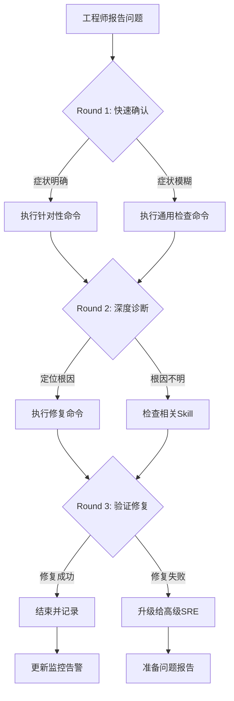

> **生产环境安全提示**
>
> 本文档包含可直接执行的运维命令。执行前请确认：当前目标集群与 Namespace 是否正确；是否具备足够的 RBAC 权限；是否已在非生产环境验证。命令风险等级标注：🔴 高风险（可能造成数据丢失或服务中断）、🟡 中风险（会修改集群状态，但通常可回滚）、🟢 低风险/只读（信息收集，无副作用）。


# 证书过期问题诊断与修复

## 概述

[[Kubernetes|Kubernetes]] 证书体系包含 API Server、[[etcd|etcd]]、[[kubelet|kubelet]]、frontend-proxy 等多组证书。证书过期会导致组件间通信失败、节点 NotReady 等严重后果。

**注意**: 本 Skill 涉及高风险的证书操作，默认执行模式为 L1-advisory（仅建议）。

## 症状识别

| # | 症状描述 | 检测方法 | 置信度 |
|---|---------|---------|--------|
| S1 | x509 证书过期错误 | 日志中出现 `certificate has expired` | 0.95 |
| S2 | 节点突然 NotReady | `kubectl get nodes` | 0.80 |
| S3 | API Server 连接失败 | `kubectl` 命令报错 | 0.90 |

## 快速诊断

```bash
./scripts/diagnose-quick.sh
```

## 修复动作

### 低风险操作（只读/检查）

| # | 动作 | 命令 |
|---|------|------|
| R1 | 检查所有证书过期时间 | `kubeadm certs check-expiration` |
| R2 | 查看 kubelet 证书状态 | `openssl x509 -in /var/lib/kubelet/pki/kubelet-client-current.pem -noout -dates` |

### 高风险修复（人工执行）

| # | 修复动作 | 风险 |
|---|---------|------|
| R3 | 使用 kubeadm 续期证书 | 需重启控制平面组件，可能导致短暂不可用 |
| R4 | 手动轮换 CA 证书 | 集群级操作，所有组件需重新签发证书 |
| R5 | 批准 kubelet CSR | 影响节点证书自动轮换 |

## 危险操作

- **动作**: `kubeadm certs renew all && reboot`
  - **风险**: 控制平面重启期间集群不可用
  - **确认要求**: 是，需维护窗口
- **动作**: 删除 `/etc/kubernetes/pki` 目录
  - **风险**: 导致集群完全不可恢复
  - **确认要求**: 是

## 验证修复

```bash
./scripts/verify-cert.sh
```

## 升级条件

- 证书续期后节点仍 NotReady → 升级至 SKILL-NODE-001
- CA 证书过期 → 升级至专家级事件响应


## 远程顾问信息收集

> 作为远程顾问，我**无法直接连接你的集群**。请帮我收集以下信息，我会根据你提供的内容给出准确的诊断建议。

### 第一步：快速确认（30 秒内回答）

1. **影响范围**：这个问题影响多少个节点 / Pod / 命名空间？
2. **紧急程度**：业务是否已中断？是否有用户投诉？
3. **发生时间**：问题是突然发生还是逐渐恶化？最近是否有变更？

### 第二步：关键信息（请提供你能获取的）

4. **kubectl 版本**：`kubectl version --short` 的输出
5. **K8s 集群版本**：`kubectl get nodes -o wide` 中的 VERSION 列
6. **节点状态**：控制平面节点是否正常？工作节点是否正常？

### 第三步：诊断信息（按需补充）

> 如果以下命令你无法执行，请直接告诉我「无法执行」，我会提供替代方案。

7. **相关组件日志**：`kubectl logs -n <namespace> <pod>` 的最后 30 行
8. **节点资源**：`kubectl top nodes` 或 `kubectl describe node <node>` 的 Capacity/Allocated resources
9. **近期变更**：最近 24 小时是否有部署、扩缩容、配置变更？

### 如果信息不足

如果你目前只能提供部分信息，**请从第一步开始**。我会根据已有信息先给出初步判断，并告诉你还需要收集什么。

> **替代沟通方式**：如果你不方便执行命令，也可以直接描述你看到的页面/告警内容，我会帮你解读。


## 命令替代方案

> 如果你无法执行以下命令，请参考对应的替代方案。

### 通用替代方案

| 原命令 | 无法执行的原因 | 替代方案 A | 替代方案 B |
|:---|:---|:---|:---|
| `kubectl get pods` | 无 kubectl 权限 | 通过集群管理控制台查看 Pod 列表 | 请有权限的同事执行并截图 |
| `kubectl logs <pod>` | 无日志权限 | 查看应用自身的日志文件（/var/log/） | 使用日志聚合系统（如 ELK/Loki）查询 |
| `kubectl describe node <node>` | 无节点查看权限 | 查看监控系统的节点仪表盘 | 使用 `kubectl get node -o yaml`（如权限允许） |
| `ssh <node>` | 无法 SSH 到节点 | 使用 `kubectl debug node/<node> -it --image=busybox` | 通过跳板机访问：`ssh -J bastion <node>` |
| `systemctl status kubelet` | 无法进入节点 | 查看节点上的 kubelet 日志：`kubectl logs -n kube-system <kubelet-pod>` | 查看容器运行时日志 |
| `docker/crictl` | 无容器运行时权限 | 使用 `kubectl exec` 进入容器检查 | 查看容器运行时的事件 |

### 如果以上都无法执行

如果你因为安全策略、网络隔离或权限限制无法执行任何诊断命令：

1. **请收集你能访问的任何信息**：
   - 监控系统的截图
   - 告警通知的内容
   - 应用自身的错误页面/日志
   - 最近是否有变更（部署、扩缩容、配置更新）

2. **如果信息严重不足**：
   - 我会根据你描述的症状给出最可能的根因和修复建议
   - 但请注意：**信息不足时建议的置信度会降低**
   - 如果问题影响严重，建议立即升级给有权限的高级 SRE

3. **紧急情况下**：
   - 如果业务已中断且你无法执行任何操作
   - 请立即联系有集群管理员权限的同事
   - 同时可以准备以下信息以便快速交接：
     - 问题发生时间
     - 影响范围
     - 已尝试的操作
     - 当前的任何异常观察

## 异常反馈处理

以下场景工程师可能给出异常反馈，需准备应对：

- **kubeadm certs renew后组件仍报错** → 确认已重启相关静态Pod

- **证书未过期但认证失败** → 检查证书主题名(SAN)是否包含正确地址

- **手动renew后kubeconfig失效** → 更新~/.kube/config中的证书数据

- **etcd证书过期** → 需同时renew peer和server证书


## 相关Skill交叉引用

本Skill诊断过程中可能涉及的其他Skill：

- [[26-技能/02-控制面/apiserver/诊断排障/ts-control-plane.md|ts control plane]]

- k8s-ingress-gateway

- [[20-最佳实践/07-scenarios/security-incident.md|security incident]]


当本Skill的诊断步骤无法定位根因时，建议按上述顺序排查相关Skill。

## 预防性措施

### 证书生命周期管理
1. **自动续期**：使用cert-manager或kubeadm自动续期
2. **过期告警**：证书过期前30天/7天/1天分级别告警
3. **证书清单**：维护集群所有证书的清单和到期日
4. **备份策略**：定期备份/etc/kubernetes/pki目录

### 监控告警
```yaml
- alert: K8sCertificateExpiringSoon
  expr: (certmanager_certificate_expiration_timestamp_seconds - time()) / 86400 < 30
  for: 1h
  labels:
    severity: warning

```

## 典型生产案例

### 案例：Ingress TLS证书过期导致业务中断
**场景**：用户报告网站显示"不安全"，浏览器证书过期警告。
**诊断**：
1. `kubectl get secret <tls-secret> -n <ns> -o jsonpath={.data."tls.crt"} | base64 -d | openssl x509 -noout -dates`
2. 检查cert-manager状态：`kubectl get certificate -n <ns>`
3. 检查ClusterIssuer：`kubectl get clusterissuer`
**修复**：
1. 如使用cert-manager：`kubectl delete certificate <cert> -n <ns>`（触发重新申请）
2. 手动更新：`kubectl create secret tls <secret> --cert=<new> --key=<new> -n <ns>`
3. 重启Ingress Controller使新证书生效

## 诊断决策流程



## 工具速查表

| 工具 | 用途 | 典型命令 |
|:---|:---|:---|
| kubectl | Kubernetes CLI | `kubectl get/describe/logs/exec` |
| jq | JSON处理 | `kubectl get ... -o json | jq ...` |
| openssl | 证书检查 | `openssl x509 -in <cert> -noout -dates` |
| tcpdump | 网络抓包 | `tcpdump -i any port <port> -n` |
| strace | 系统调用追踪 | `strace -p <pid> -f` |
| iostat/vmstat | IO/内存监控 | `iostat -x 1` |
| journalctl | 系统日志 | `journalctl -u <service> -f` |
| crictl | 容器运行时 | `crictl ps/logs/inspect` |

## 远程顾问执行清单

- [ ] 确认工程师身份和环境访问权限
- [ ] 收集集群版本、发行版、网络拓扑
- [ ] 确认问题影响范围和紧急程度
- [ ] 指导执行Round 1命令并收集输出
- [ ] 分析输出，选择Round 2分支
- [ ] 指导执行Round 2命令并收集输出
- [ ] 定位根因，提供修复方案
- [ ] 指导执行修复命令并验证
- [ ] 确认修复成功，更新相关文档
- [ ] 评估是否需要升级或事后复盘


## 相关概念

- [[22-概念/05-安全/kubernetes-pki-certificate-system.md|Kubernetes PKI 证书体系]] — Kubernetes 组件证书签发、轮转与过期管理

```

## Related

- [[visibility-public|#visibility/public Hub]] — tag hub


<!-- risk-assessed -->
