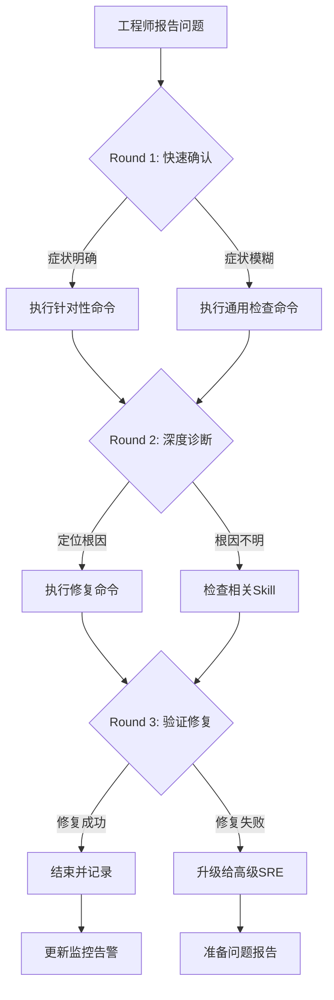

> **生产环境安全提示**
>
> 本文档包含可直接执行的运维命令。执行前请确认：当前目标集群与 Namespace 是否正确；是否具备足够的 RBAC 权限；是否已在非生产环境验证。命令风险等级标注：🔴 高风险（可能造成数据丢失或服务中断）、🟡 中风险（会修改集群状态，但通常可回滚）、🟢 低风险/只读（信息收集，无副作用）。


# DNS 解析问题诊断与修复

## 概述

[[coredns|CoreDNS]] 是 [[kubernetes|Kubernetes]] 集群 DNS 的核心组件。DNS 问题会导致服务发现失败、外部依赖不可访问等连锁问题。

**典型触发场景**：
1. CoreDNS Pod 崩溃或资源不足
2. CoreDNS ConfigMap 配置错误
3. [[networkpolicy|NetworkPolicy]] 阻断 UDP/53
4. 节点 DNS 配置冲突（systemd-resolved 等）

## 症状识别

| # | 症状描述 | 检测方法 | 置信度 |
|---|---------|---------|--------|
| S1 | Pod 内域名解析失败 | `nslookup kubernetes.default` | 0.95 |
| S2 | 跨服务调用超时 | 应用日志显示连接超时 | 0.80 |
| S3 | CoreDNS Pod 未 Running | `kubectl get [[Pods|pods]] -n kube-system` | 0.90 |

## 快速诊断

```bash
./scripts/diagnose-quick.sh <namespace> [pod-name] [test-domain]
```

## 修复动作

### 低风险修复

| # | 修复动作 | 命令 |
|---|---------|------|
| R1 | 重启 CoreDNS Pod | `kubectl rollout restart deployment coredns -n kube-system` |
| R2 | 扩大 CoreDNS 副本数 | `kubectl scale deployment coredns -n kube-system --replicas=3` |
| R3 | 修正 Pod dnsPolicy | `kubectl patch pod <pod> --type merge -p '{"spec":{"dnsPolicy":"ClusterFirst"}}'` |

### 中风险修复

| # | 修复动作 | 风险 |
|---|---------|------|
| R4 | 修改 CoreDNS ConfigMap | 配置错误可能导致全集群 DNS 问题 |
| R5 | 修改节点 resolv.conf | 可能影响节点上所有容器 |

## 验证修复

```bash
./scripts/verify-dns.sh <namespace> [pod-name] [test-domain]
```

## 升级条件

- 修复后 DNS 仍间歇性失败 → 升级至网络深度诊断
- 怀疑 CNI 问题 → 升级至 SKILL-NET-003


## 远程顾问信息收集

> 作为远程顾问，我**无法直接连接你的集群**。请帮我收集以下信息，我会根据你提供的内容给出准确的诊断建议。

### 第一步：快速确认（30 秒内回答）

1. **影响范围**：这个问题影响多少个节点 / Pod / 命名空间？
2. **紧急程度**：业务是否已中断？是否有用户投诉？
3. **发生时间**：问题是突然发生还是逐渐恶化？最近是否有变更？

### 第二步：关键信息（请提供你能获取的）

4. **kubectl 版本**：`kubectl version --short` 的输出
5. **K8s 集群版本**：`kubectl get nodes -o wide` 中的 VERSION 列
6. **节点状态**：控制平面节点是否正常？工作节点是否正常？

### 第三步：诊断信息（按需补充）

> 如果以下命令你无法执行，请直接告诉我「无法执行」，我会提供替代方案。

7. **相关组件日志**：`kubectl logs -n <namespace> <pod>` 的最后 30 行
8. **节点资源**：`kubectl top nodes` 或 `kubectl describe node <node>` 的 Capacity/Allocated resources
9. **近期变更**：最近 24 小时是否有部署、扩缩容、配置变更？

### 如果信息不足

如果你目前只能提供部分信息，**请从第一步开始**。我会根据已有信息先给出初步判断，并告诉你还需要收集什么。

> **替代沟通方式**：如果你不方便执行命令，也可以直接描述你看到的页面/告警内容，我会帮你解读。


## 命令替代方案

> 如果你无法执行以下命令，请参考对应的替代方案。

### 通用替代方案

| 原命令 | 无法执行的原因 | 替代方案 A | 替代方案 B |
|:---|:---|:---|:---|
| `kubectl get pods` | 无 kubectl 权限 | 通过集群管理控制台查看 Pod 列表 | 请有权限的同事执行并截图 |
| `kubectl logs <pod>` | 无日志权限 | 查看应用自身的日志文件（/var/log/） | 使用日志聚合系统（如 ELK/Loki）查询 |
| `kubectl describe node <node>` | 无节点查看权限 | 查看监控系统的节点仪表盘 | 使用 `kubectl get node -o yaml`（如权限允许） |
| `ssh <node>` | 无法 SSH 到节点 | 使用 `kubectl debug node/<node> -it --image=busybox` | 通过跳板机访问：`ssh -J bastion <node>` |
| `systemctl status kubelet` | 无法进入节点 | 查看节点上的 kubelet 日志：`kubectl logs -n kube-system <kubelet-pod>` | 查看容器运行时日志 |
| `docker/crictl` | 无容器运行时权限 | 使用 `kubectl exec` 进入容器检查 | 查看容器运行时的事件 |

### 如果以上都无法执行

如果你因为安全策略、网络隔离或权限限制无法执行任何诊断命令：

1. **请收集你能访问的任何信息**：
   - 监控系统的截图
   - 告警通知的内容
   - 应用自身的错误页面/日志
   - 最近是否有变更（部署、扩缩容、配置更新）

2. **如果信息严重不足**：
   - 我会根据你描述的症状给出最可能的根因和修复建议
   - 但请注意：**信息不足时建议的置信度会降低**
   - 如果问题影响严重，建议立即升级给有权限的高级 SRE

3. **紧急情况下**：
   - 如果业务已中断且你无法执行任何操作
   - 请立即联系有集群管理员权限的同事
   - 同时可以准备以下信息以便快速交接：
     - 问题发生时间
     - 影响范围
     - 已尝试的操作
     - 当前的任何异常观察

## 异常反馈处理

以下场景工程师可能给出异常反馈，需准备应对：

- **nslookup集群内服务正常但外部域名失败** → 检查CoreDNS forward配置

- **间歇性DNS失败** → 检查CoreDNS HPA配置和副本数

- **所有Pod DNS解析均失败** → 检查kube-dns Service是否存在

- **特定节点DNS失败** → 检查该节点CNI网络配置


## 相关Skill交叉引用

本Skill诊断过程中可能涉及的其他Skill：

- [[19-故障诊断/08-技能体系/05-service-connectivity.md|05 service connectivity]]

- k8s-ingress-gateway


当本Skill的诊断步骤无法定位根因时，建议按上述顺序排查相关Skill。

## 预防性措施

### CoreDNS高可用
1. **副本数**：生产环境至少3个CoreDNS副本，跨可用区部署
2. **反亲和性**：配置podAntiAffinity避免同节点部署
3. **HPA配置**：基于CPU使用率自动扩缩容
4. **缓存调优**：根据集群规模调整cache配置

### DNS监控
```yaml
- alert: CoreDNSDown
  expr: kube_deployment_status_replicas_available{deployment="coredns"} == 0
  for: 2m
  labels:
    severity: critical
```

## 诊断决策流程



## 工具速查表

| 工具 | 用途 | 典型命令 |
|:---|:---|:---|
| kubectl | Kubernetes CLI | `kubectl get/describe/logs/exec` |
| jq | JSON处理 | `kubectl get ... -o json | jq ...` |
| openssl | 证书检查 | `openssl x509 -in <cert> -noout -dates` |
| tcpdump | 网络抓包 | `tcpdump -i any port <port> -n` |
| strace | 系统调用追踪 | `strace -p <pid> -f` |
| iostat/vmstat | IO/内存监控 | `iostat -x 1` |
| journalctl | 系统日志 | `journalctl -u <service> -f` |
| crictl | 容器运行时 | `crictl ps/logs/inspect` |

## 远程顾问执行清单

- [ ] 确认工程师身份和环境访问权限
- [ ] 收集集群版本、发行版、网络拓扑
- [ ] 确认问题影响范围和紧急程度
- [ ] 指导执行Round 1命令并收集输出
- [ ] 分析输出，选择Round 2分支
- [ ] 指导执行Round 2命令并收集输出
- [ ] 定位根因，提供修复方案
- [ ] 指导执行修复命令并验证
- [ ] 确认修复成功，更新相关文档
- [ ] 评估是否需要升级或事后复盘


## 相关概念

- [[22-概念/03-网络/cni-networking-model.md|CNI 网络模型]] — Kubernetes 容器网络接口与 DNS 解析原理

## Related

- [[visibility-public|#visibility/public Hub]] — tag hub


<!-- risk-assessed -->
