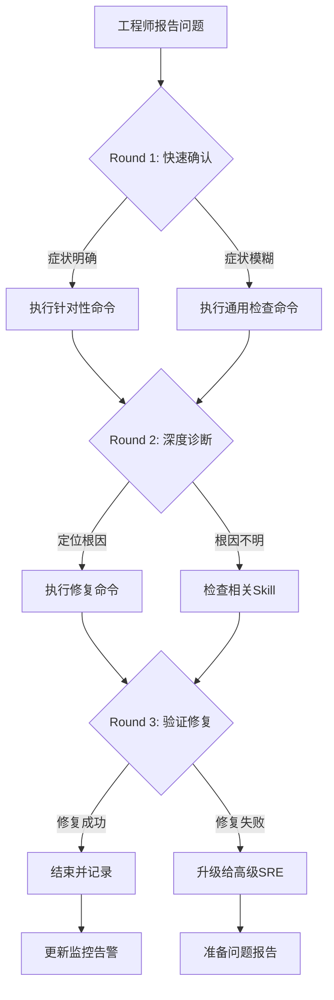

> **生产环境安全提示**
>
> 本文档包含可直接执行的运维命令。执行前请确认：当前目标集群与 Namespace 是否正确；是否具备足够的 RBAC 权限；是否已在非生产环境验证。命令风险等级标注：🔴 高风险（可能造成数据丢失或服务中断）、🟡 中风险（会修改集群状态，但通常可回滚）、🟢 低风险/只读（信息收集，无副作用）。


# [[Service|Service]] 连通性问题诊断与修复

## 概述

Service 连通性问题通常由 Endpoints 缺失、Selector 不匹配、[[NetworkPolicy|NetworkPolicy]] 阻断或 kube-proxy 异常引起。

## 症状识别

| # | 症状描述 | 检测方法 | 置信度 |
|---|---------|---------|--------|
| S1 | 连接 Service IP 超时 | `curl <cluster-ip>:<port>` | 0.90 |
| S2 | Endpoints 为空 | `kubectl get endpoints <svc>` | 0.95 |
| S3 | 后端 Pod 未 Ready | `kubectl get [[Pods|pods]] -l <selector>` | 0.85 |

## 修复动作

### 低风险修复

| # | 修复动作 | 命令 |
|---|---------|------|
| R1 | 修正 Service Selector | `kubectl patch svc <svc> -p '{"spec":{"selector":{"app":"correct-label"}}}'` |
| R2 | 重启 kube-proxy | `kubectl rollout restart [[DaemonSet|daemonset]] kube-proxy -n kube-system` |
| R3 | 删除并重建 Service | `kubectl delete svc && kubectl apply -f service.yaml` |

## 验证修复

```bash
./scripts/verify-service.sh <namespace> <service-name>
```


## 远程顾问信息收集

> 作为远程顾问，我**无法直接连接你的集群**。请帮我收集以下信息，我会根据你提供的内容给出准确的诊断建议。

### 第一步：快速确认（30 秒内回答）

1. **影响范围**：这个问题影响多少个节点 / Pod / 命名空间？
2. **紧急程度**：业务是否已中断？是否有用户投诉？
3. **发生时间**：问题是突然发生还是逐渐恶化？最近是否有变更？

### 第二步：关键信息（请提供你能获取的）

4. **kubectl 版本**：`kubectl version --short` 的输出
5. **K8s 集群版本**：`kubectl get nodes -o wide` 中的 VERSION 列
6. **节点状态**：控制平面节点是否正常？工作节点是否正常？

### 第三步：诊断信息（按需补充）

> 如果以下命令你无法执行，请直接告诉我「无法执行」，我会提供替代方案。

7. **相关组件日志**：`kubectl logs -n <namespace> <pod>` 的最后 30 行
8. **节点资源**：`kubectl top nodes` 或 `kubectl describe node <node>` 的 Capacity/Allocated resources
9. **近期变更**：最近 24 小时是否有部署、扩缩容、配置变更？

### 如果信息不足

如果你目前只能提供部分信息，**请从第一步开始**。我会根据已有信息先给出初步判断，并告诉你还需要收集什么。

> **替代沟通方式**：如果你不方便执行命令，也可以直接描述你看到的页面/告警内容，我会帮你解读。


## 命令替代方案

> 如果你无法执行以下命令，请参考对应的替代方案。

### 通用替代方案

| 原命令 | 无法执行的原因 | 替代方案 A | 替代方案 B |
|:---|:---|:---|:---|
| `kubectl get pods` | 无 kubectl 权限 | 通过集群管理控制台查看 Pod 列表 | 请有权限的同事执行并截图 |
| `kubectl logs <pod>` | 无日志权限 | 查看应用自身的日志文件（/var/log/） | 使用日志聚合系统（如 ELK/Loki）查询 |
| `kubectl describe node <node>` | 无节点查看权限 | 查看监控系统的节点仪表盘 | 使用 `kubectl get node -o yaml`（如权限允许） |
| `ssh <node>` | 无法 SSH 到节点 | 使用 `kubectl debug node/<node> -it --image=busybox` | 通过跳板机访问：`ssh -J bastion <node>` |
| `systemctl status kubelet` | 无法进入节点 | 查看节点上的 kubelet 日志：`kubectl logs -n kube-system <kubelet-pod>` | 查看容器运行时日志 |
| `docker/crictl` | 无容器运行时权限 | 使用 `kubectl exec` 进入容器检查 | 查看容器运行时的事件 |

### 如果以上都无法执行

如果你因为安全策略、网络隔离或权限限制无法执行任何诊断命令：

1. **请收集你能访问的任何信息**：
   - 监控系统的截图
   - 告警通知的内容
   - 应用自身的错误页面/日志
   - 最近是否有变更（部署、扩缩容、配置更新）

2. **如果信息严重不足**：
   - 我会根据你描述的症状给出最可能的根因和修复建议
   - 但请注意：**信息不足时建议的置信度会降低**
   - 如果问题影响严重，建议立即升级给有权限的高级 SRE

3. **紧急情况下**：
   - 如果业务已中断且你无法执行任何操作
   - 请立即联系有集群管理员权限的同事
   - 同时可以准备以下信息以便快速交接：
     - 问题发生时间
     - 影响范围
     - 已尝试的操作
     - 当前的任何异常观察

## 异常反馈处理

以下场景工程师可能给出异常反馈，需准备应对：

- **ClusterIP正常但NodePort不通** → 检查节点防火墙和云安全组

- **同节点Pod可通跨节点不通** → 检查CNI Overlay网络

- **服务偶发超时** → 检查kube-proxy模式和连接跟踪表

- **LoadBalancer IP不通** → 检查云提供商LB健康检查配置


## 相关Skill交叉引用

本Skill诊断过程中可能涉及的其他Skill：

- k8s-dns-failure

- k8s-ingress-gateway

- k8s-network-policy


当本Skill的诊断步骤无法定位根因时，建议按上述顺序排查相关Skill。

## 预防性措施

### 网络设计最佳实践
1. **Service命名规范**：使用有意义的名称，避免特殊字符
2. **端口管理**：记录所有Service的端口映射关系
3. **网络策略**：默认拒绝所有流量，按需开放白名单
4. **健康检查**：配置合理的readinessProbe确保Endpoint准确

### 连通性测试
- 定期从测试Pod执行连通性检查
- 使用k8s-probe或类似工具持续验证服务可达性
- 新服务上线前执行连通性验证清单

## 典型生产案例

### 案例：跨Namespace服务发现失败
**场景**：应用A在ns-a中，需要访问ns-b中的服务svc-b，但连接超时。
**诊断**：
1. 确认服务FQDN：`svc-b.ns-b.svc.cluster.local`
2. 检查DNS解析：`kubectl exec pod-a -n ns-a -- nslookup svc-b.ns-b.svc.cluster.local`
3. 检查NetworkPolicy：`kubectl get networkpolicy -n ns-b`
**修复**：在ns-b的NetworkPolicy中添加来自ns-a的流量允许规则

### 案例：NodePort端口不通
**场景**：外部负载均衡器健康检查失败。
**诊断**：
1. 检查节点防火墙：`iptables -L -n | grep <node-port>`
2. 检查云安全组：确认NodePort范围（30000-32767）已开放
3. 检查kube-proxy：`kubectl logs -n kube-system -l k8s-app=kube-proxy`
**修复**：更新安全组规则，允许外部访问NodePort范围

## 诊断决策流程



## 工具速查表

| 工具 | 用途 | 典型命令 |
|:---|:---|:---|
| kubectl | Kubernetes CLI | `kubectl get/describe/logs/exec` |
| jq | JSON处理 | `kubectl get ... -o json | jq ...` |
| openssl | 证书检查 | `openssl x509 -in <cert> -noout -dates` |
| tcpdump | 网络抓包 | `tcpdump -i any port <port> -n` |
| strace | 系统调用追踪 | `strace -p <pid> -f` |
| iostat/vmstat | IO/内存监控 | `iostat -x 1` |
| journalctl | 系统日志 | `journalctl -u <service> -f` |
| crictl | 容器运行时 | `crictl ps/logs/inspect` |

## 远程顾问执行清单

- [ ] 确认工程师身份和环境访问权限
- [ ] 收集集群版本、发行版、网络拓扑
- [ ] 确认问题影响范围和紧急程度
- [ ] 指导执行Round 1命令并收集输出
- [ ] 分析输出，选择Round 2分支
- [ ] 指导执行Round 2命令并收集输出
- [ ] 定位根因，提供修复方案
- [ ] 指导执行修复命令并验证
- [ ] 确认修复成功，更新相关文档
- [ ] 评估是否需要升级或事后复盘

---

## 高级生产案例

### 案例：IPVS 模式下服务间歇性超时

**场景**：电商大促期间，核心支付服务出现间歇性 504 超时，每秒约 5% 的请求失败。

**诊断过程**：
1. 检查 Service 连通性发现间歇性失败：`while true; do curl -s -o /dev/null -w "%{http_code}" http://payment-svc:8080/health; sleep 1; done`
2. 检查 Endpoints 始终有可用 IP，排除 Pod 就绪问题
3. 检查 conntrack 表使用率：`conntrack -L | wc -l` 与 `sysctl net.netfilter.nf_conntrack_count`
4. 发现 conntrack 表接近上限（`nf_conntrack_max`），导致新连接被丢弃
5. 检查 IPVS 连接状态：`ipvsadm -Ln --connection` 发现大量 TIME_WAIT 连接堆积

**根因**：IPVS 模式下，大量短连接导致 conntrack 条目耗尽，新连接无法建立。

**修复**：
1. 临时扩容 conntrack：`sysctl -w net.netfilter.nf_conntrack_max=524288`
2. 调整 IPVS 连接超时：`ipvsadm --set 30 60 120`
3. 应用层启用连接池，减少短连接
4. 持久化配置到节点 sysctl：`echo "net.netfilter.nf_conntrack_max=524288" >> /etc/sysctl.d/99-k8s.conf`

**预防措施**：
- 监控 `node_netstat_Udp_NoPorts` 与 `node_nf_conntrack_entries` 指标
- IPVS 环境设置合理的 tcp/tcpfin/udp 超时参数
- 高并发服务优先使用长连接/连接池

---

### 案例：Calico eBPF 模式下跨节点 Service 不通

**场景**：某金融集群升级 Kubernetes 1.30 后，跨节点的 Service 访问全部失败，同节点正常。

**诊断过程**：
1. 同节点 Pod → Service ClusterIP 正常，跨节点超时
2. 检查 Calico Pod 状态：`kubectl get pods -n calico-system` 全部 Running
3. 检查 Calico 日志发现 eBPF datapath 加载失败：`kubectl logs -n calico-system -l k8s-app=calico-node | grep -i "bpf|fail"`
4. 查看节点内核版本：`uname -r` 发现部分节点内核为 4.18，低于 eBPF 模式要求的 5.3+
5. 检查 FelixConfiguration：`kubectl get felixconfiguration default -o yaml | grep bpfEnabled`

**根因**：集群混合了不同内核版本的节点，eBPF datapath 在低内核节点加载失败，导致跨节点 VXLAN 隧道不通。

**修复**：
1. 回退到标准 VXLAN 模式：`kubectl patch felixconfiguration default --type merge -p '{"spec":{"bpfEnabled":false}}'`
2. 或将低内核节点驱逐并升级内核后重新加入集群
3. 验证跨节点连通性恢复

---

### 案例：Istio Sidecar 注入导致 Service 访问异常

**场景**：服务网格环境中，已注入 Istio sidecar 的 Pod 无法访问未注入 sidecar 的第三方 Service（如外部 MySQL），连接被重置。

**诊断过程**：
1. 从已注入 sidecar 的 Pod 测试：`kubectl exec <pod> -c <app> -- nc -vz mysql-svc 3306` 返回 Connection reset
2. 检查 iptables 规则：`kubectl exec <pod> -c istio-proxy -- iptables -t nat -L` 发现所有出站流量被重定向到 15001
3. 检查 Istio Sidecar 配置：`kubectl get sidecar -n <namespace>` 无出站放行配置
4. 检查 PeerAuthentication 策略：`kubectl get peerauthentication --all-namespaces` 发现 mTLS STRICT 模式

**根因**：Istio 默认拦截所有出站流量，对未注入 sidecar 的目标服务启用 mTLS 但对方不支持，导致 TLS 握手失败连接重置。

**修复**：
1. 创建 ServiceEntry 允许直接访问外部数据库
2. 创建 DestinationRule 禁用对该 Service 的 mTLS
3. 或调整 Sidecar 出站流量拦截范围，排除特定 CIDR

---

## 高级网络诊断技巧

### iptables 深度排查

当 kube-proxy 使用 iptables 模式时：

```bash
# 查看 KUBE-SERVICES 链中特定 Service 的规则
iptables -t nat -L KUBE-SERVICES -n --line-numbers | grep <cluster-ip>

# 跟踪具体 Service 链到 Endpoint 链
iptables -t nat -L KUBE-SVC-<hash> -n -v

# 查看 Endpoint 链的权重分布（随机模式）
iptables -t nat -L KUBE-SEP-<hash> -n -v

# 检查 FORWARD 链是否放行 Pod 网段
iptables -L FORWARD -n | grep <pod-cidr>

# 检查 NAT 表中的连接跟踪
conntrack -L -d <cluster-ip> | head -20
```

**关键指标**：
- `iptables -t nat -L -v -n | grep -c KUBE-SEP`：Endpoint 规则数量
- `iptables -t nat -L -v -n | grep -c KUBE-SVC`：Service 规则数量
- 当 Service 或 Endpoint 数量过多时（>1000），iptables 规则数可能触发性能问题

### IPVS 深度排查

当 kube-proxy 使用 ipvs 模式时：

```bash
# 查看 IPVS 虚拟服务列表
ipvsadm -Ln

# 查看特定 Service 的 Real Server
ipvsadm -Ln -t <cluster-ip>:<port>

# 查看 IPVS 连接状态（需 root）
ipvsadm -Lnc | grep <cluster-ip>

# 查看 IPVS 统计
ipvsadm -Ln --stats | grep <cluster-ip>

# 查看 IPVS 连接超时
ipvsadm -Ln --timeout

# 检查 IPVS 虚拟网卡状态
ip link show kube-ipvs0
```

**常见问题**：
- IPVS 模式需要加载 `ip_vs` 内核模块：`lsmod | grep ip_vs`
- 如果模块未加载，kube-proxy 会回退到 iptables 模式但可能不告警
- 大量短连接场景下，IPVS 连接表需要调优

### CNI 连通性排查

```bash
# 检查 CNI 插件二进制是否存在
ls -la /opt/cni/bin/

# 查看 CNI 配置文件
cat /etc/cni/net.d/*.conf

# 检查 Pod 网卡 veth 对
ip link show | grep veth

# 在主机网络命名空间追踪 Pod 流量
nsenter -t <pod-pid> -n ip addr

# Calico
calicoctl node status
calicoctl get ippool

# Cilium
cilium status
cilium endpoint list
cilium bpf lb list
cilium service list

# Flannel
cat /run/flannel/subnet.env
ip route show | grep flannel
```

**CNI 特定诊断**：
- **Calico**：检查 BGP 对等体状态（如果使用 BGP 模式），`calicoctl node status`
- **Cilium**：检查 eBPF 映射，`cilium bpf endpoint list`；检查是否有 dropped packets，`cilium monitor`
- **Flannel**：检查 VXLAN 设备 flannel.1 的 MTU 和 UDP 端口 8472 是否被防火墙拦截
- **Weave**：检查 weave 状态和连接，`weave status connections`

---

## 服务网格（Service Mesh）连通性问题

### Istio 常见问题

| 症状 | 可能原因 | 排查命令 |
|------|---------|---------|
| 注入 sidecar 后服务不通 | iptables 拦截所有出站流量 | `iptables -t nat -L ISTIO_OUTPUT` |
| mTLS STRICT 导致未注入服务拒绝 | PeerAuthentication 策略强制 mTLS | `kubectl get peerauthentication` |
| 跨命名空间服务 403 | AuthorizationPolicy 限制 | `kubectl get authorizationpolicy -A` |
| Egress 流量被阻断 | 无 ServiceEntry 配置 | `kubectl get serviceentry -A` |
| 503 upstream reset | OutlierDetection 剔除所有 Endpoint | `kubectl get destinationrule` |

**Istio 诊断命令**：

> ⚠️ **🟡 中危变更** — 变更集群资源状态，建议先 --dry-run 或 diff 确认
> - `kubectl exec`：进入容器执行命令，可能改变容器状态

``` bash
# 🟡 中风险：会修改集群/资源状态，执行前请确认目标、影响范围与授权
# 查看 Envoy sidecar 配置
istioctl proxy-config cluster <pod> -n <namespace>

# 查看 Envoy 监听器
istioctl proxy-config listener <pod> -n <namespace>

# 查看路由配置
istioctl proxy-config route <pod> -n <namespace>

# 查看端点状态
istioctl proxy-config endpoint <pod> -n <namespace>

# 检查 mTLS 协商结果
istioctl authn tls-check <pod>.<namespace>.svc.cluster.local

# 抓包 Envoy 流量
kubectl exec <pod> -c istio-proxy -- tcpdump -i lo port 15001 -w /tmp/envoy.pcap
```
### Linkerd 常见问题

```bash
# 检查 Linkerd 注入状态
linkerd check --proxy

# 查看 meshed Pod 状态
linkerd stat deployment -n <namespace>

# 查看 Tap 流量
linkerd tap deployment/<name> -n <namespace>

# 检查 identity 证书
linkerd identity deployment/<name> -n <namespace>
```

---

## 外部负载均衡器排查

### 云提供商 LoadBalancer

| 云厂商 | 排查命令/路径 | 常见问题 |
|--------|-------------|---------|
| AWS NLB/ALB | 检查 ELB 控制台健康检查路径、目标组 | 健康检查路径返回非 200 导致目标全摘除 |
| GCP LB | `gcloud compute forwarding-rules list` | 防火墙规则未放行 GCP 健康检查 IP 范围 |
| Azure LB | `az network lb probe list` | 探测端口与 Service NodePort 不匹配 |
| 阿里云 SLB | 检查 SLB 监听和后端服务器组 | 后端 ECS 安全组未放行 NodePort |
| 腾讯云 CLB | CLB 控制台查看健康检查状态 | VPC 路由表未正确配置 |

**通用排查步骤**：
1. 确认云控制器 Pod 正常运行
2. 检查 Service `status.loadBalancer.ingress` 是否已分配 IP
3. 验证节点安全组允许云 LB 健康检查源 IP
4. 确认健康检查端口和路径正确（尤其是自定义健康检查）
5. 检查节点上 NodePort 是否正常监听

### MetalLB 排查

``` bash
# 🟢 低风险：只读/信息收集，通常无副作用
# 查看 MetalLB speaker Pod 状态
kubectl get pods -n metallb-system

# 查看 IP 地址池配置
kubectl get ipaddresspool -n metallb-system

# 查看 L2 advertisement
kubectl get l2advertisement -n metallb-system

# 查看 BGP peer（如果使用 BGP 模式）
kubectl get bgppeers -n metallb-system

# 查看 speaker 日志
kubectl logs -n metallb-system -l app=metallb -c speaker

# 检查 ARP 响应（L2 模式）
arping -I <iface> <lb-ip>
```
**MetalLB 常见问题**：
- **L2 模式**：多个 speaker 可能同时宣告 IP（需确保节点间二层可达）
- **ARP 冲突**：同一网段其他设备可能占用 MetalLB 分配的 IP
- **BGP 模式**：BGP 会话未建立导致 IP 不被宣告，speaker 日志会显示 BGP 连接错误
- **IP 池耗尽**：所有 IP 已分配，新 Service 处于 Pending 状态

---

## 预防性措施（扩展）

### 网络健康基线建立

1. **连通性基线测试**：使用 `network-debug` DaemonSet 定期测试所有核心 Service 的连通性，记录响应时间和成功率基线
2. **关键 Service 监控指标**：
   - `kube_endpoint_address_available`：可用 Endpoint 数量
   - `kube_proxy_sync_proxy_rules_duration_seconds`：kube-proxy 规则同步耗时
   - `container_network_receive_packets_dropped_total`：网卡丢包计数
   - `node_nf_conntrack_entries` / `node_nf_conntrack_entries_limit`：连接跟踪使用率
3. **混沌工程演练**：
   - 定期模拟 kube-proxy Pod 驱逐，验证 Service 自愈能力
   - 模拟节点网络分区，测试跨节点 Service 访问
   - 模拟 CNI 组件问题，验证网络策略失效模式

### 网络变更管控

1. **变更前检查清单**：
   - [ ] Service Selector 是否与目标 Deployment 标签匹配
   - [ ] targetPort 是否与容器监听端口一致
   - [ ] NetworkPolicy 变更是否影响现有服务间通信
   - [ ] 节点防火墙/安全组是否允许 NodePort/LB 流量
   - [ ] CNI 配置变更是否影响现有 Pod 连通性
2. **变更窗口验证**：
   - 变更后立即执行 `kubectl get endpoints -A` 确认所有 Service 有可用 Endpoint
   - 从多个节点测试跨节点 Service 连通性
   - 验证外部 LB 健康检查状态恢复正常
3. **金丝雀发布**：
   - 网络策略变更先在 staging 命名空间验证
   - kube-proxy 配置变更先在小范围节点池测试
   - CNI 版本升级先在 1-2 个节点验证后再全量滚动


## 相关概念

- [[22-概念/03-网络/cni-networking-model.md|CNI 网络模型]] — Kubernetes 容器网络接口与 Service 网络原理

```

## Related

- [[visibility-public|#visibility/public Hub]] — tag hub


<!-- risk-assessed -->
