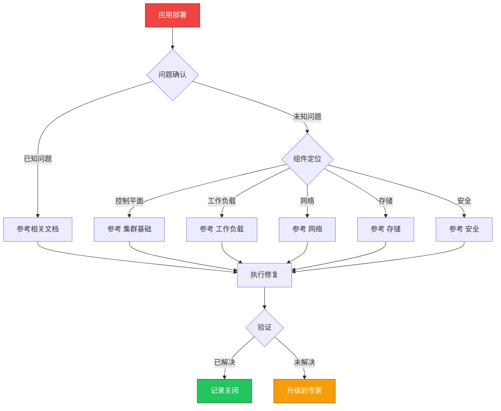

> **生产环境安全提示**
>
> 本文档包含可直接执行的运维命令。执行前请确认：当前目标集群与 Namespace 是否正确；是否具备足够的 RBAC 权限；是否已在非生产环境验证。命令风险等级标注：🔴 高风险（可能造成数据丢失或服务中断）、🟡 中风险（会修改集群状态，但通常可回滚）、🟢 低风险/只读（信息收集，无副作用）。


# 场景: 应用部署

> **场景 ID**: SC-02
> **英文**: Application Deployment
> **最后更新**: 2026-05-20

---

## 场景概述

应用部署是 [[kubernetes|Kubernetes]] 最常见的操作场景。本场景汇总了 Deployment、[[statefulset|StatefulSet]]、[[daemonset|DaemonSet]] 等所有工作负载的部署模式和最佳实践。

---

## 快速决策树



---

## 相关文档

- 工作负载/02-deployment-production-patterns.md
- [[02-工作负载/01-核心工作负载/03-statefulset-advanced-operations.md|03 statefulset advanced operations]]
- [[02-工作负载/01-核心工作负载/04-daemonset-management.md|04 daemonset management]]
- [[03-清单模式/README.md|README]]


---

## FTA 故障树

- [[19-故障诊断/06-FTA故障树/list/pod-fta.md|pod fta]]
- [[19-故障诊断/06-FTA故障树/list/deployment-fta.md|deployment fta]]
- [[19-故障诊断/06-FTA故障树/list/statefulset-fta.md|statefulset fta]]


---

## 操作技能

暂无专项技能卡片


---

## 关联场景

| 关联场景 | 说明 |
|---|---|

## 生产案例

### 案例1：滚动更新导致服务短暂不可用

| 时间 | 事件 |
|---|---|
| 14:00 | 执行 Deployment 滚动更新 |
| 14:01 | 新 Pod 启动，旧 Pod 被终止 |
| 14:02 | 新 Pod 未就绪就接收流量，500 错误 |
| 14:05 | 配置 preStop hook + readinessProbe 后恢复 |

**根因**：缺少 preStop hook，连接未优雅关闭。

**修复**：
```yaml
# 🟡 添加优雅关闭配置
lifecycle:
  preStop:
    exec:
      command: ["sh", "-c", "sleep 10"]
terminationGracePeriodSeconds: 30
readinessProbe:
  httpGet:
    path: /healthz
    port: 8080
  initialDelaySeconds: 5
```

### 案例2：资源限制设置不当导致 OOM

- **现象**：Pod 频繁 OOMKilled
- **诊断**：limits.memory 设置过低，应用峰值内存超出
- **修复**：根据实际使用调整 limits + 配置 VPA 自动推荐

## 面试要点

1. **Q：滚动更新的最佳实践？**
   A：配置 readinessProbe、preStop hook、maxSurge/maxUnavailable、PDB 保护、健康检查、回滚策略。

2. **Q：Deployment 更新策略对比？**
   A：RollingUpdate(默认，零停机)、Recreate(全部重启)、Blue-Green(双环境)、Canary(灰度发布)。根据业务场景选择。

3. **Q：如何保证部署的可靠性？**
   A：健康检查(readiness/liveness)、资源限制、PDB、回滚策略、灰度发布、监控告警、变更审批。

## Related

- [[23-实体/15-参考与索引/kudig-metadata-index.md|README]].md|README]]
- 24-production-deployment-best-practices
- 99-kubernetes-deployment-patterns-architecture
- [[23-实体/02-K8s核心组件/kubernetes.md|kubernetes]]


<!-- risk-assessed -->
