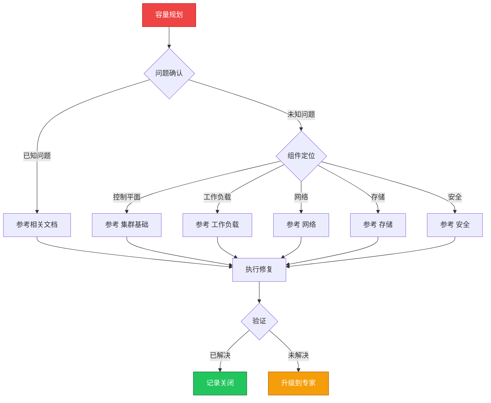

> **生产环境安全提示**
>
> 本文档包含可直接执行的运维命令。执行前请确认：当前目标集群与 Namespace 是否正确；是否具备足够的 RBAC 权限；是否已在非生产环境验证。命令风险等级标注：🔴 高风险（可能造成数据丢失或服务中断）、🟡 中风险（会修改集群状态，但通常可回滚）、🟢 低风险/只读（信息收集，无副作用）。


# 场景: 容量规划

> **场景 ID**: SC-14
> **英文**: Capacity Planning
> **最后更新**: 2026-05-20

---

## 场景概述

容量规划是成本优化的基础。

---

## 快速决策树



---

## 相关文档

- [[13-生产运维/README.md|README]]
- [[10-平台工程/README.md|README]]


---

## FTA 故障树

- [[19-故障诊断/06-FTA故障树/list/hpa-fta.md|hpa fta]]
- [[19-故障诊断/06-FTA故障树/list/cluster-autoscaler-fta.md|cluster autoscaler fta]]


---

## 操作技能

暂无专项技能卡片


---

## 关联场景

| 关联场景 | 说明 |
|---|---|

## 生产案例

### 案例1：业务突增导致集群资源耗尽

| 时间 | 事件 |
|---|---|
| 11:00 | 营销活动开始，流量突增 5x |
| 11:05 | HPA 触发扩容，但节点资源不足 |
| 11:06 | Pod Pending，Cluster Autoscaler 触发但新节点需 5min |
| 11:10 | 部分请求超时，影响用户体验 |

**根因**：容量规划未考虑峰值场景，buffer 不足。

**修复**：
```bash
# 🟢 查看集群资源水位
kubectl describe nodes | grep -A5 "Allocated resources"
# 🟡 配置 Cluster Autoscaler 预热节点
kubectl edit deploy cluster-autoscaler -n kube-system  # 调整 scale-up 阈值
```

### 案例2：etcd 磁盘空间不足导致集群不可用

- **现象**：API Server 写入失败，etcd 报 "no space"
- **诊断**：etcd 数据超过 8GB 配额，历史事件未清理
- **修复**：etcd compaction + defrag + 调整配额到 16GB

## 面试要点

1. **Q：容量规划的核心指标有哪些？**
   A：CPU/内存利用率、Pod 密度、节点数量趋势、存储增长率、网络带宽、API Server QPS、etcd 大小。

2. **Q：如何进行容量预测？**
   A：历史趋势分析(30/90天)→业务增长因子→峰值冗余(30-50%)→定期回顾调整。工具：Prometheus + Grafana 趋势图。

3. **Q：资源不足时的应急策略？**
   A：优先级驱逐(低优先级Pod)→抢占式扩容→资源右sizing→临时增加节点→流量限制保护核心服务。

## Related

- [[23-实体/15-参考与索引/kudig-metadata-index.md|README]].md|README]]
- [[19-故障诊断/06-FTA故障树/list/vpa-fta.md|vpa-fta]]
- [[19-故障诊断/06-FTA故障树/list/cluster-autoscaler-fta.md|cluster-autoscaler-fta]]


<!-- risk-assessed -->
