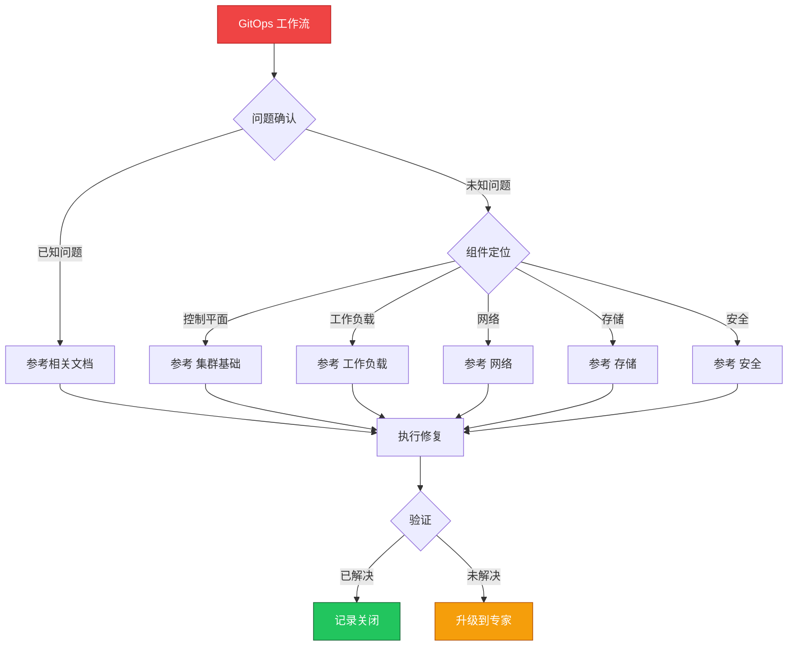

> **生产环境安全提示**
>
> 本文档包含可直接执行的运维命令。执行前请确认：当前目标集群与 Namespace 是否正确；是否具备足够的 RBAC 权限；是否已在非生产环境验证。命令风险等级标注：🔴 高风险（可能造成数据丢失或服务中断）、🟡 中风险（会修改集群状态，但通常可回滚）、🟢 低风险/只读（信息收集，无副作用）。


# 场景: GitOps 工作流

> **场景 ID**: SC-15
> **英文**: GitOps Workflow
> **最后更新**: 2026-05-20

---

## 场景概述

GitOps 是现代化的持续部署方式。

---

## 快速决策树



---

## 相关文档

- [[11-发布变更/README.md|README]]
- [[11-发布变更/README.md|README]]


---

## FTA 故障树

- [[19-故障诊断/06-FTA故障树/list/helm-fta.md|helm fta]]


---

## 操作技能

暂无专项技能卡片


---

## 关联场景

| 关联场景 | 说明 |
|---|---|

## 生产案例

### 案例1：GitOps 同步失败导致配置漂移

| 时间 | 事件 |
|---|---|
| 09:00 | 开发人员手动 kubectl edit 修改了生产配置 |
| 09:05 | ArgoCD 检测到漂移，尝试自动同步 |
| 09:06 | 同步失败（Git 中配置有误），服务异常 |
| 09:30 | 修复 Git 配置后自动恢复 |

**根因**：手动修改 + Git 配置未验证 + 自动同步策略过于激进。

**修复**：
```bash
# 🟢 检查 ArgoCD 同步状态
argocd app get <app-name>
# 🟡 手动触发同步
argocd app sync <app-name> --prune
# 🟢 查看同步历史
argocd app history <app-name>
```

### 案例2：Git 仓库权限配置错误导致未授权部署

- **现象**：实习生直接 push 到生产分支触发部署
- **诊断**：缺少分支保护和 PR 审批流程
- **修复**：启用分支保护 + CODEOWNERS + CI 检查 + ArgoCD 仅监听特定分支

## 面试要点

1. **Q：GitOps 的核心原则？**
   A：声明式配置、版本化存储(Git)、自动同步、持续调和。Git 为唯一真实来源，禁止手动修改。

2. **Q：ArgoCD 与 Flux 的对比？**
   A：ArgoCD：UI 丰富、多集群、应用集。Flux：轻量、原生 K8s、Helm 集成好。选择：复杂环境 ArgoCD，简单环境 Flux。

3. **Q：GitOps 工作流的安全控制？**
   A：分支保护、PR 审批、CODEOWNERS、镜像签名验证、RBAC 限制 ArgoCD 权限、审计日志、Secret 加密(Sealed Secrets)。

## Related

- [[23-实体/15-参考与索引/kudig-metadata-index.md|README]].md|README]]
- [[22-概念/09-平台与发布/infrastructure-as-code.md|infrastructure-as-code]]
- [[26-技能/01-集群运维/helm/helm-fta.md|helm-fta]]
- [[17-系统基础/05-速查卡/helm.md|[[Helm|helm]]]]
- [[17-系统基础/05-速查卡/gitops.md|gitops]]


<!-- risk-assessed -->
