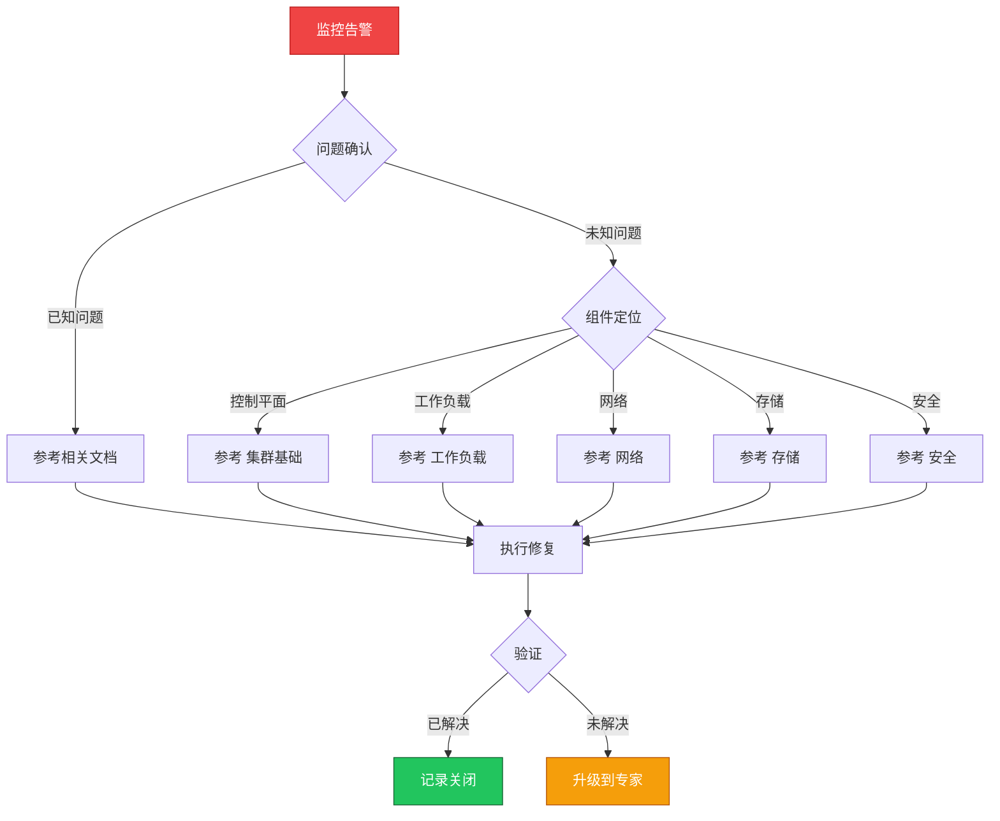

> **生产环境安全提示**
>
> 本文档包含可直接执行的运维命令。执行前请确认：当前目标集群与 Namespace 是否正确；是否具备足够的 RBAC 权限；是否已在非生产环境验证。命令风险等级标注：🔴 高风险（可能造成数据丢失或服务中断）、🟡 中风险（会修改集群状态，但通常可回滚）、🟢 低风险/只读（信息收集，无副作用）。


# 场景: 监控告警

> **场景 ID**: SC-06
> **英文**: Monitoring & Alerting
> **最后更新**: 2026-05-20

---

## 场景概述

监控是生产可观测性的基础。

---

## 快速决策树



---

## 相关文档

- observability/README.md]]
- [[09-可观测性/README.md|README]]
- [[09-可观测性/README.md|README]]


---

## FTA 故障树

- [[19-故障诊断/06-FTA故障树/list/monitoring-fta.md|monitoring fta]]


---

## 操作技能

暂无专项技能卡片


---

## 关联场景

| 关联场景 | 说明 |
|---|---|

## 生产案例

### 案例1：告警风暴导致关键告警被淹没

| 时间 | 事件 |
|---|---|
| 03:00 | 节点故障触发 200+ Pod 告警 |
| 03:05 | 运维被大量告警淘没，未注意到数据库主从切换告警 |
| 03:30 | 数据库故障升级，影响核心交易 |
| 04:00 | 配置告警分组和抑制规则 |

**根因**：告警未分组、无抑制规则、无优先级区分。

**修复**：
```yaml
# 🟡 Alertmanager 告警分组配置
group_by: ['alertname', 'namespace']
group_wait: 30s
group_interval: 5m
inhibit_rules:
  - source_match: {severity: 'critical'}
    target_match: {severity: 'warning'}
    equal: ['namespace']
```

### 案例2：监控盲区导致故障发现延迟

- **现象**：用户投诉后才发现服务异常，延迟 30min
- **诊断**：缺少业务级监控，仅有基础设施监控
- **修复**：添加 SLO/SLI 监控 + 业务指标告警 + 合成监控

## 面试要点

1. **Q：监控体系的分层设计？**
   A：基础设施(节点/网络)→平台(K8s组件)→应用(业务指标)→用户体验(合成监控)。每层有独立的告警规则。

2. **Q：如何避免告警风暴？**
   A：告警分组(group_by)、抑制规则(inhibit)、静默窗口(silence)、优先级分级(P0-P3)、收敛策略、定期清理无效告警。

3. **Q：SLO 驱动的监控如何实施？**
   A：定义 SLI(成功率/延迟)→设定 SLO 目标(99.9%)→配置 error budget 告警→burn rate 告警→定期回顾调整。

## Related

- [[23-实体/15-参考与索引/kudig-metadata-index.md|README]].md|README]]
- prometheus.md|10-monitoring-metrics-prometheus]]
- log.md|log]]
- monitoring


<!-- risk-assessed -->
