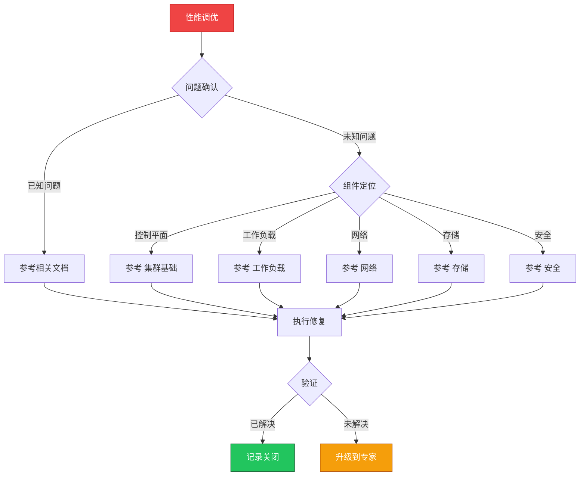

> **生产环境安全提示**
>
> 本文档包含可直接执行的运维命令。执行前请确认：当前目标集群与 Namespace 是否正确；是否具备足够的 RBAC 权限；是否已在非生产环境验证。命令风险等级标注：🔴 高风险（可能造成数据丢失或服务中断）、🟡 中风险（会修改集群状态，但通常可回滚）、🟢 低风险/只读（信息收集，无副作用）。


# 场景: 性能调优

> **场景 ID**: SC-04
> **英文**: Performance Tuning
> **最后更新**: 2026-05-20

---

## 场景概述

性能调优涉及集群各个层面的参数调整和资源优化。

---

## 快速决策树



---

## 相关文档

- 集群基础/13-performance-tuning-guide.md
- [[10-平台工程/README.md|README]]
- [[13-生产运维/README.md|README]]


---

## FTA 故障树

- [[19-故障诊断/06-FTA故障树/list/hpa-fta.md|hpa fta]]
- [[19-故障诊断/06-FTA故障树/list/node-fta.md|node fta]]


---

## 操作技能

暂无专项技能卡片


---

## 关联场景

| 关联场景 | 说明 |
|---|---|

## 生产案例

### 案例1：API Server 延迟飙升导致集群响应慢

| 时间 | 事件 |
|---|---|
| 15:00 | kubectl 命令响应超过 10s |
| 15:05 | 监控显示 API Server P99 延迟 >5s |
| 15:10 | 发现 etcd 磁盘 IOPS 达到上限 |
| 15:30 | 升级 etcd 磁盘到 SSD + 调整参数 |

**根因**：etcd 磁盘性能不足，影响 API Server 响应。

**修复**：
```bash
# 🟢 检查 API Server 延迟
kubectl get --raw /metrics | grep apiserver_request_duration_seconds
# 🟢 检查 etcd 磁盘延迟
etcdctl endpoint status --write-out=table
# 🟡 调整 etcd 参数
# --quota-backend-bytes=8589934592
# --snapshot-count=5000
```

### 案例2：Pod 调度延迟影响业务扩容

- **现象**：HPA 触发后 Pod 长时间 Pending
- **诊断**：调度器积压，大量 Pod 等待调度
- **修复**：增加调度器副本 + 优化调度策略 + 节点预热

## 面试要点

1. **Q：K8s 性能调优的关键维度？**
   A：API Server(缓存/限流)、etcd(磁盘/压缩)、调度器(并行度)、kubelet(并发数)、网络(CNI性能)、存储(IO调度)。

2. **Q：大规模集群的性能瓶颈在哪？**
   A：etcd 写入延迟、API Server 连接数、List 操作内存、调度器吞吐量、watch 连接数、CoreDNS 解析压力。

3. **Q：如何定位性能问题？**
   A：监控指标(P99延迟/吞吐量)→pprof 分析→慢查询日志→资源使用率→压测验证。工具：Prometheus + Grafana + pprof。

## Related

- [[23-实体/15-参考与索引/kudig-metadata-index.md|README]].md|README]]
- observability/19-cluster-performance-tuning.md|19-cluster-performance-tuning]]
- [[19-故障诊断/06-FTA故障树/list/node-fta.md|node-fta]]
- [[19-故障诊断/06-FTA故障树/list/vpa-fta.md|vpa-fta]]


<!-- risk-assessed -->
