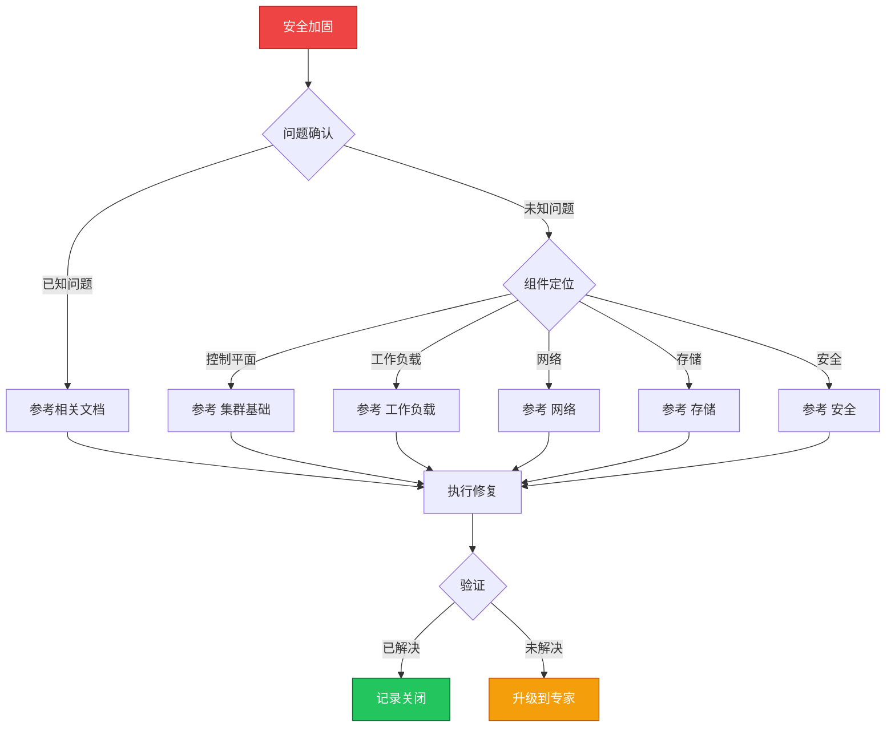

> **生产环境安全提示**
>
> 本文档包含可直接执行的运维命令。执行前请确认：当前目标集群与 Namespace 是否正确；是否具备足够的 RBAC 权限；是否已在非生产环境验证。命令风险等级标注：🔴 高风险（可能造成数据丢失或服务中断）、🟡 中风险（会修改集群状态，但通常可回滚）、🟢 低风险/只读（信息收集，无副作用）。


# 场景: 安全加固

> **场景 ID**: SC-05
> **英文**: Security Hardening
> **最后更新**: 2026-05-20

---

## 场景概述

安全加固是生产环境的基础要求。

---

## 快速决策树



---

## 相关文档

- [[08-安全/README.md|README]]
- [[08-安全/README.md|README]]
- supply-chain-security/README.md]]


---

## FTA 故障树

- [[19-故障诊断/06-FTA故障树/list/rbac-fta.md|rbac fta]]
- [[19-故障诊断/06-FTA故障树/list/certificate-fta.md|certificate fta]]
- [[19-故障诊断/06-FTA故障树/list/networkpolicy-fta.md|networkpolicy fta]]


---

## 操作技能

暂无专项技能卡片


---

## 关联场景

| 关联场景 | 说明 |
|---|---|

## 生产案例

### 案例1：匿名访问未禁用导致数据泄露

| 时间 | 事件 |
|---|---|
| 安全扫描 | 发现 API Server 允许匿名访问 |
| 评估 | 任何人可读取集群敏感信息 |
| 修复 | 禁用匿名访问 + 启用 RBAC |
| 验证 | 扫描确认无未授权访问 |

**根因**：初始化配置未禁用 anonymous-auth。

**修复**：
```bash
# 🟡 禁用匿名访问
# kube-apiserver 参数: --anonymous-auth=false
# 🟢 检查 RBAC 配置
kubectl get clusterrolebindings -o wide
kubectl auth can-i --list --as=system:anonymous
# 🟡 启用审计日志
# --audit-policy-file=/etc/kubernetes/audit-policy.yaml
```

### 案例2：Secret 明文存储被窃取

- **现象**：发现 Git 仓库中包含明文 Secret
- **诊断**：未启用 etcd 加密，Secret 以 base64 存储
- **修复**：启用 EncryptionConfiguration + 轮转所有 Secret + 清理 Git 历史

## 面试要点

1. **Q：K8s 安全加固的核心措施？**
   A：禁用匿名访问、RBAC 最小权限、Pod Security Standards、网络策略、Secret 加密、审计日志、镜像安全、定期扫描。

2. **Q：零信任架构在 K8s 中的实现？**
   A：mTLS(服务间加密)、身份验证(OIDC)、授权(RBAC/OPA)、网络微分段、持续验证、最小权限。

3. **Q：如何检测集群安全威胁？**
   A：Falco 运行时检测、审计日志分析、异常行为监控、定期漏洞扫描、镜像签名验证、网络流量分析。

## Related

- [[23-实体/15-参考与索引/kudig-metadata-index.md|README]].md|README]]
- [[26-技能/07-安全/certificate/certificate-fta.md|certificate-fta]]
- [[17-系统基础/06-知识字典/security/cloud-native-security.md|cloud-native-security]]


<!-- risk-assessed -->
