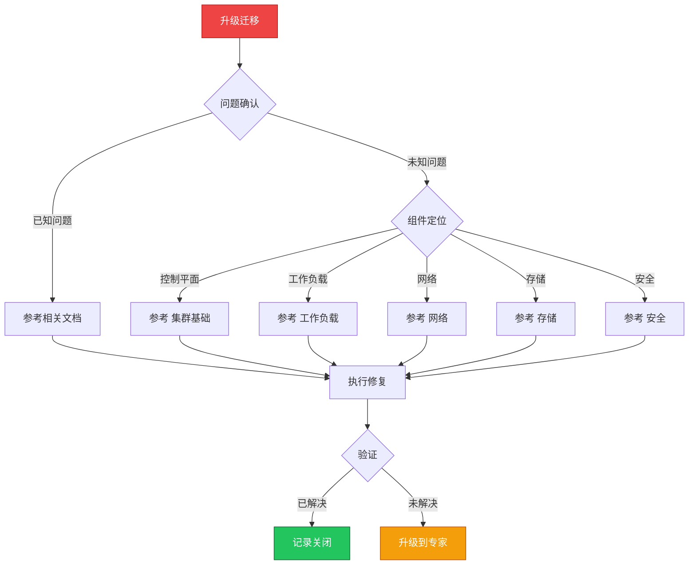

> **生产环境安全提示**
>
> 本文档包含可直接执行的运维命令。执行前请确认：当前目标集群与 Namespace 是否正确；是否具备足够的 RBAC 权限；是否已在非生产环境验证。命令风险等级标注：🔴 高风险（可能造成数据丢失或服务中断）、🟡 中风险（会修改集群状态，但通常可回滚）、🟢 低风险/只读（信息收集，无副作用）。


# 场景: 升级迁移

> **场景 ID**: SC-08
> **英文**: Upgrade & Migration
> **最后更新**: 2026-05-20

---

## 场景概述

升级迁移需要精心规划和执行。

---

## 快速决策树



---

## 相关文档

- 集群基础/07-upgrade-paths-strategy.md
- 集群基础/18-upgrade-migration-strategy.md
- [[11-发布变更/07-迁移方案/README.md|README]]


---

## FTA 故障树

- [[19-故障诊断/06-FTA故障树/list/cluster-upgrade-fta.md|cluster upgrade fta]]


---

## 操作技能

暂无专项技能卡片


---

## 关联场景

| 关联场景 | 说明 |
|---|---|

## 生产案例

### 案例1：K8s 版本升级后 API 废弃导致服务中断

| 时间 | 事件 |
|---|---|
| 09:00 | 集群从 1.25 升级到 1.26 |
| 09:10 | PodSecurityPolicy API 移除，部分 Pod 无法创建 |
| 09:15 | 多个业务报 admission webhook 拒绝 |
| 10:00 | 迁移到 Pod Security Standards 后恢复 |

**根因**：升级前未检查废弃 API 使用情况。

**修复**：
```bash
# 🟢 升级前检查废弃 API
kubectl get --raw /metrics | grep apiserver_requested_deprecated_apis
# 或使用 kubent/pluto 扫描
kubent  # 检测废弃 API 使用
# 🟡 迁移到新版 API
kubectl apply -f updated-manifests.yaml
```

### 案例2：跨集群迁移时 PV 数据丢失

- **现象**：应用迁移到新集群后数据为空
- **诊断**：仅迁移了 YAML，未迁移 PV 数据
- **修复**：使用 Velero 备份恢复 PV + 数据一致性校验

## 面试要点

1. **Q：K8s 集群升级的标准流程？**
   A：检查废弃API→备份etcd→升级控制平面→逐批升级节点→验证工作负载→更新客户端工具。每次只升一个 minor 版本。

2. **Q：跨集群迁移有哪些方案？**
   A：Velero 备份恢复、GitOps 重新部署、PV 数据同步(rsync/快照)、DNS 切换灰度、双写过渡期。

3. **Q：升级失败如何回滚？**
   A：控制平面：etcd 快照恢复；节点：回滚 kubelet 版本；工作负载：Deployment revision 回滚。关键是升级前必须备份 etcd。

## Related

- [[23-实体/15-参考与索引/kudig-metadata-index.md|README]].md|README]]
- [[26-技能/01-集群运维/cluster-upgrade/cluster-upgrade-fta.md|cluster-upgrade-fta]]
- 07-upgrade-paths-strategy


<!-- risk-assessed -->
