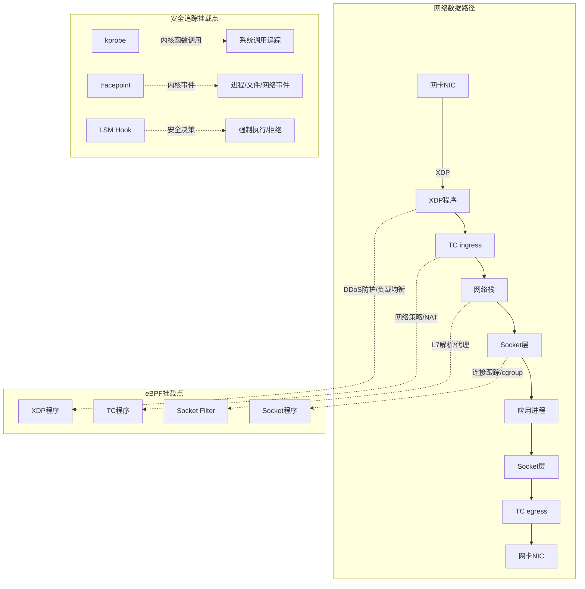
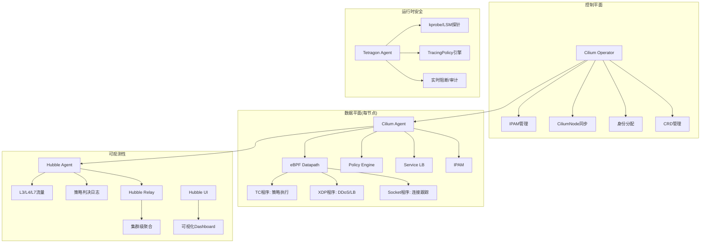
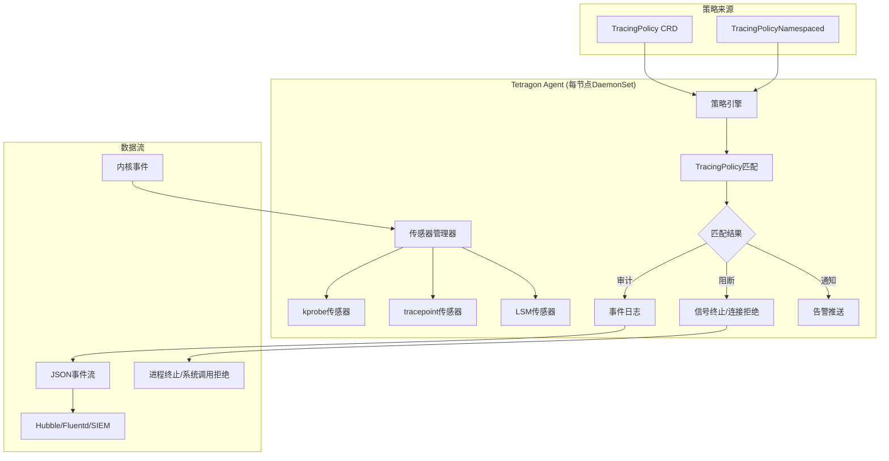

> **生产环境安全提示**
>
> 本文档包含可直接执行的运维命令。执行前请确认：当前目标集群与 Namespace 是否正确；是否具备足够的 RBAC 权限；是否已在非生产环境验证。命令风险等级标注：🔴 高风险（可能造成数据丢失或服务中断）、🟡 中风险（会修改集群状态，但通常可回滚）、🟢 低风险/只读（信息收集，无副作用）。


# [[kubernetes|Kubernetes]] eBPF与Cilium深度实践 (eBPF and [[cilium|Cilium]] Deep Practice)

> **作者**: 云原生网络架构专家 | **版本**: v1.0 | **更新时间**: 2026-03-03
> **适用场景**: 容器网络架构、运行时安全、网络可观测性 | **复杂度**: ⭐⭐⭐⭐⭐

<!-- chunk: 🎯 摘要 -->## 🎯 摘要

本文档深入探讨eBPF技术在Kubernetes中的应用以及Cilium作为新一代CNI的深度实践，涵盖Cilium网络架构（CNCF Graduated）、Tetragon运行时安全、Hubble网络可观测性、无Sidecar服务网格等2026年核心技术。基于大规模生产集群的eBPF实践经验，提供从网络策略到安全监控的完整技术指南。

<!-- chunk: 1. eBPF技术基础 -->## 1. eBPF技术基础

## 1.1 eBPF内核架构

```yaml
eBPF核心概念:
  定义: Extended Berkeley Packet Filter
  本质: 内核态可编程沙箱虚拟机
  
  程序类型(Program Types):
    网络:
      - XDP (eXpress Data Path): 网卡驱动级，最早拦截点
      - TC (Traffic Control): 流量控制层
      - Socket Filter: 套接字级过滤
      - cgroup/sock: cgroup级套接字控制
    安全:
      - LSM (Linux Security Module): 安全策略强制执行
      - kprobe/kretprobe: 内核函数调用追踪
      - tracepoint: 内核静态追踪点
    调度:
      - sched_cls: 流量分类器
      - struct_ops: 调度器结构体操作
    
  Map类型(Data Structures):
    - Hash Map: 键值对存储(策略规则)
    - Array Map: 索引数组(统计计数器)
    - LRU Map: 最近最少使用(连接跟踪)
    - Ring Buffer: 环形缓冲(事件流)
    - Per-CPU Map: 每CPU独立(高性能计数)
    
  验证器(Verifier):
    - 静态分析所有执行路径
    - 确保程序终止(无无限循环)
    - 检查内存访问边界
    - 验证辅助函数调用安全性
    
  内核版本要求:
    最低: 4.19 (基础功能)
    推荐: 5.10+ (完整eBPF功能集)
    最佳: 6.1+ (最新helper和Map类型)
```

## 1.2 eBPF在Kubernetes的挂载点



<!-- chunk: 2. Cilium架构深度解析 -->## 2. Cilium架构深度解析

## 2.1 Cilium组件架构



## 2.2 Cilium替代kube-proxy

```yaml
# Cilium完全替代kube-proxy的配置
# helm install cilium cilium/cilium --namespace kube-system \
#   --set kubeProxyReplacement=true \
#   --set k8sServiceHost=<API_SERVER_IP> \
#   --set k8sServicePort=<API_SERVER_PORT>

# Cilium ConfigMap核心配置
apiVersion: v1
kind: ConfigMap
metadata:
  name: cilium-config
  namespace: kube-system
data:
  # 完全替代kube-proxy
  kube-proxy-replacement: "true"
  kube-proxy-replacement-healthz-bind-address: "0.0.0.0:10256"
  
  # eBPF高性能模式
  bpf-lb-algorithm: "maglev"  # 一致性哈希(vs random)
  bpf-lb-maglev-table-size: "65521"
  bpf-lb-acceleration: "native"  # XDP加速
  bpf-lb-mode: "dsr"  # Direct Server Return
  
  # 连接跟踪
  bpf-ct-global-tcp-max: "524288"
  bpf-ct-global-any-max: "262144"
  bpf-nat-global-max: "524288"
  
  # 隧道模式(vs直接路由)
  tunnel-protocol: "vxlan"  # 或 "geneve" 或 "disabled"(直接路由)
  routing-mode: "tunnel"    # 或 "native"
  
  # IPv4/IPv6双栈
  enable-ipv4: "true"
  enable-ipv6: "true"
  
  # Bandwidth Manager
  enable-bandwidth-manager: "true"
  
  # eBPF Host Routing(绕过iptables)
  enable-host-reachable-services: "true"
  install-no-conntrack-iptables-rules: "true"
---
# kube-proxy vs Cilium eBPF性能对比
性能对比数据(100节点集群, 10000 Service):
  | 指标 | kube-proxy(iptables) | kube-proxy(IPVS) | Cilium eBPF |
  |------|---------------------|------------------|-------------|
  | Service查找延迟 | O(n) 线性 | O(1) 哈希 | O(1) eBPF Map |
  | 规则更新时间 | 15-30s | 5-10s | <1s |
  | 内存占用 | 高(规则膨胀) | 中等 | 低(eBPF Map) |
  | CPU开销 | 高(conntrack) | 中等 | 低(内核态) |
  | DSR支持 | 否 | 否 | 是 |
  | XDP加速 | 否 | 否 | 是 |
  | Maglev哈希 | 否 | 是 | 是 |
```

## 2.3 从传统CNI迁移到Cilium

```yaml
迁移路径:
  从Calico迁移:
    步骤:
      1. 安装Cilium(与Calico并行运行)
      2. 逐节点迁移(cordon→drain→切换CNI→uncordon)
      3. 迁移NetworkPolicy到CiliumNetworkPolicy
      4. 验证连通性后清除Calico组件
    注意事项:
      - Calico NetworkPolicy语法与K8s标准兼容，可直接使用
      - Calico GlobalNetworkPolicy需转换为CiliumClusterwideNetworkPolicy
      - BGP配置需在Cilium中重新配置(Cilium BGP CP)
      
  从Flannel迁移:
    步骤:
      1. Flannel只提供L3转发，迁移最简单
      2. 直接替换DaemonSet
      3. 无网络策略需要迁移(Flannel不支持NetworkPolicy)
    注意事项:
      - VXLAN backend可保持一致
      - Pod CIDR可能需要重新规划
      
  迁移风险评估:
    低风险: Flannel → Cilium (功能超集)
    中风险: Calico → Cilium (策略语法差异)
    高风险: 自定义CNI → Cilium (需全面测试)
```

<!-- chunk: 3. Cilium网络策略实践 -->## 3. Cilium网络策略实践

## 3.1 CiliumNetworkPolicy vs Kubernetes NetworkPolicy

```yaml
# Kubernetes标准NetworkPolicy(L3/L4)
apiVersion: networking.k8s.io/v1
kind: NetworkPolicy
metadata:
  name: allow-frontend-to-api
  namespace: production
spec:
  podSelector:
    matchLabels:
      app: api-server
  policyTypes:
    - Ingress
  ingress:
    - from:
        - podSelector:
            matchLabels:
              app: frontend
      ports:
        - protocol: TCP
          port: 8080
---
# CiliumNetworkPolicy(L3/L4/L7)
apiVersion: cilium.io/v2
kind: CiliumNetworkPolicy
metadata:
  name: allow-frontend-to-api-l7
  namespace: production
spec:
  endpointSelector:
    matchLabels:
      app: api-server
  ingress:
    - fromEndpoints:
        - matchLabels:
            app: frontend
      toPorts:
        - ports:
            - port: "8080"
              protocol: TCP
          rules:
            http:
              # L7 HTTP级别策略(Cilium独有)
              - method: "GET"
                path: "/api/v1/.*"
              - method: "POST"
                path: "/api/v1/orders"
                headers:
                  - 'Content-Type: application/json'
---
# CiliumNetworkPolicy - gRPC级别策略
apiVersion: cilium.io/v2
kind: CiliumNetworkPolicy
metadata:
  name: grpc-service-policy
  namespace: production
spec:
  endpointSelector:
    matchLabels:
      app: payment-service
  ingress:
    - fromEndpoints:
        - matchLabels:
            app: order-service
      toPorts:
        - ports:
            - port: "50051"
              protocol: TCP
          rules:
            # gRPC方法级别控制
            http:
              - method: "POST"
                path: "/payment.PaymentService/ProcessPayment"
              - method: "POST"
                path: "/payment.PaymentService/GetStatus"
```

## 3.2 CiliumClusterwideNetworkPolicy

```yaml
# 集群级默认拒绝策略
apiVersion: cilium.io/v2
kind: CiliumClusterwideNetworkPolicy
metadata:
  name: default-deny-all
spec:
  endpointSelector: {}
  ingress:
    - fromEntities:
        - cluster
  egress:
    - toEntities:
        - cluster
    # 允许DNS
    - toEndpoints:
        - matchLabels:
            k8s:io.kubernetes.pod.namespace: kube-system
            k8s-app: kube-dns
      toPorts:
        - ports:
            - port: "53"
              protocol: ANY
          rules:
            dns:
              - matchPattern: "*"
---
# 集群级：允许所有命名空间访问监控端点
apiVersion: cilium.io/v2
kind: CiliumClusterwideNetworkPolicy
metadata:
  name: allow-prometheus-scrape
spec:
  endpointSelector:
    matchLabels:
      prometheus.io/scrape: "true"
  ingress:
    - fromEndpoints:
        - matchLabels:
            app: prometheus
            k8s:io.kubernetes.pod.namespace: monitoring
      toPorts:
        - ports:
            - port: "9090"
              protocol: TCP
            - port: "8080"
              protocol: TCP
```

## 3.3 ClusterMesh跨集群策略

```yaml
# Cilium ClusterMesh配置
# cilium clustermesh enable --service-type LoadBalancer
# cilium clustermesh connect --destination-context cluster2

# 跨集群服务发现
apiVersion: cilium.io/v2
kind: CiliumNetworkPolicy
metadata:
  name: cross-cluster-api-access
  namespace: production
spec:
  endpointSelector:
    matchLabels:
      app: api-server
  ingress:
    - fromEndpoints:
        # 允许来自cluster2的前端Pod访问
        - matchLabels:
            app: frontend
            io.cilium.k8s.policy.cluster: "cluster2"
      toPorts:
        - ports:
            - port: "8080"
              protocol: TCP
---
# 跨集群全局Service
apiVersion: v1
kind: Service
metadata:
  name: global-api-service
  namespace: production
  annotations:
    # 标记为全局服务，ClusterMesh自动同步
    service.cilium.io/global: "true"
    # 流量分配：本集群优先
    service.cilium.io/affinity: "local"
spec:
  selector:
    app: api-server
  ports:
    - port: 8080
```

<!-- chunk: 4. Tetragon运行时安全 -->## 4. Tetragon运行时安全

## 4.1 Tetragon架构



## 4.2 TracingPolicy配置

```yaml
# Tetragon安装
# helm install tetragon cilium/tetragon -n kube-system

# 进程执行监控策略
apiVersion: cilium.io/v1alpha1
kind: TracingPolicy
metadata:
  name: monitor-process-execution
spec:
  kprobes:
    - call: "security_bprm_check"
      syscall: false
      args:
        - index: 0
          type: "linux_binprm"
      selectors:
        - matchBinaries:
            - operator: In
              values:
                - "/bin/bash"
                - "/bin/sh"
                - "/usr/bin/wget"
                - "/usr/bin/curl"
                - "/usr/bin/nc"
                - "/usr/bin/nmap"
          matchNamespaces:
            - namespace: Pid
              operator: NotIn
              values:
                - "host_ns"  # 排除主机命名空间
          matchActions:
            - action: Post
              # 生成审计事件
            - action: Sigkill
              # 可选：直接终止危险进程
---
# 文件访问监控策略
apiVersion: cilium.io/v1alpha1
kind: TracingPolicy
metadata:
  name: monitor-sensitive-file-access
spec:
  kprobes:
    - call: "fd_install"
      syscall: false
      args:
        - index: 0
          type: "int"
        - index: 1
          type: "file"
      selectors:
        - matchArgs:
            - index: 1
              operator: Prefix
              values:
                - "/etc/shadow"
                - "/etc/passwd"
                - "/etc/kubernetes/"
                - "/var/run/secrets/kubernetes.io"
                - "/root/.ssh/"
                - "/root/.kube/"
          matchActions:
            - action: Post
            - action: NotifyEnforcer
              argError: -1  # EPERM
---
# 网络连接监控策略
apiVersion: cilium.io/v1alpha1
kind: TracingPolicy
metadata:
  name: monitor-network-connections
spec:
  kprobes:
    - call: "tcp_connect"
      syscall: false
      args:
        - index: 0
          type: "sock"
      selectors:
        - matchArgs:
            - index: 0
              operator: DAddr
              values:
                - "0.0.0.0/0"  # 监控所有外部连接
          matchNamespaces:
            - namespace: Pid
              operator: NotIn
              values:
                - "host_ns"
          matchActions:
            - action: Post
---
# 命名空间级策略(租户隔离)
apiVersion: cilium.io/v1alpha1
kind: TracingPolicyNamespaced
metadata:
  name: tenant-security-policy
  namespace: tenant-a
spec:
  kprobes:
    - call: "security_file_open"
      syscall: false
      args:
        - index: 0
          type: "file"
      selectors:
        - matchArgs:
            - index: 0
              operator: Prefix
              values:
                - "/proc/sysrq-trigger"
                - "/sys/kernel/"
          matchActions:
            - action: Sigkill
```

## 4.3 Tetragon vs Falco对比

```yaml
运行时安全工具对比:
  | 特性 | Tetragon | Falco |
  |------|----------|-------|
  | 检测引擎 | eBPF (kprobe/LSM) | eBPF / kernel module |
  | 响应能力 | 检测 + 实时阻断 | 仅检测(告警) |
  | 阻断延迟 | 内核态即时(<1μs) | 不支持原生阻断 |
  | 策略语言 | TracingPolicy CRD(YAML) | Falco Rules(YAML/Lua) |
  | K8s感知 | 原生(Pod/容器元数据) | 通过插件 |
  | 性能开销 | 极低(eBPF原生) | 低-中等 |
  | CNCF状态 | Cilium子项目 | CNCF Graduated |
  | 适用场景 | 强制执行 + 检测 | 检测 + 告警 + 合规审计 |
  | 社区生态 | 快速增长中 | 成熟稳定 |
  
  推荐策略:
    - 需要实时阻断: Tetragon (唯一选择)
    - 合规审计 + 告警: Falco (规则库最丰富)
    - 两者互补: Tetragon阻断 + Falco审计(最佳安全防线)
```

<!-- chunk: 5. Hubble网络可观测性 -->## 5. Hubble网络可观测性

## 5.1 Hubble架构与部署

```yaml
# Cilium + Hubble 启用配置
# helm upgrade cilium cilium/cilium --namespace kube-system \
#   --set hubble.enabled=true \
#   --set hubble.relay.enabled=true \
#   --set hubble.ui.enabled=true \
#   --set hubble.metrics.enabled="{dns,drop,tcp,flow,icmp,http}"

# Hubble详细配置
apiVersion: v1
kind: ConfigMap
metadata:
  name: cilium-config
  namespace: kube-system
data:
  # Hubble观测配置
  enable-hubble: "true"
  hubble-socket-path: "/var/run/cilium/hubble.sock"
  hubble-listen-address: ":4244"
  
  # 流量采样(生产环境建议采样)
  hubble-flow-buffer-size: "1048576"
  
  # Hubble指标导出到Prometheus
  hubble-metrics-server: ":9965"
  hubble-metrics: |
    dns:query;ignoreAAAA
    drop
    tcp
    flow
    icmp
    http:destinationContext=pod;sourceContext=pod
    port-distribution
---
# Hubble Relay Deployment
apiVersion: apps/v1
kind: Deployment
metadata:
  name: hubble-relay
  namespace: kube-system
spec:
  replicas: 2
  selector:
    matchLabels:
      k8s-app: hubble-relay
  template:
    metadata:
      labels:
        k8s-app: hubble-relay
    spec:
      containers:
        - name: hubble-relay
          image: quay.io/cilium/hubble-relay:v1.17.0
          command:
            - hubble-relay
          args:
            - serve
          ports:
            - containerPort: 4245
              name: grpc
          readinessProbe:
            grpc:
              port: 4245
---
# Hubble UI
apiVersion: apps/v1
kind: Deployment
metadata:
  name: hubble-ui
  namespace: kube-system
spec:
  replicas: 1
  selector:
    matchLabels:
      k8s-app: hubble-ui
  template:
    metadata:
      labels:
        k8s-app: hubble-ui
    spec:
      containers:
        - name: frontend
          image: quay.io/cilium/hubble-ui:v0.13.1
          ports:
            - containerPort: 8081
        - name: backend
          image: quay.io/cilium/hubble-ui-backend:v0.13.1
          ports:
            - containerPort: 8090
```

## 5.2 Hubble观测能力

```yaml
Hubble可观测性层级:
  L3/L4层:
    - 源/目标IP和端口
    - 协议类型(TCP/UDP/ICMP)
    - 连接状态(SYN/ACK/FIN/RST)
    - 数据包/字节计数
    - 网络策略判决(ALLOWED/DENIED/DROPPED)
    
  L7层(需启用L7 proxy):
    HTTP:
      - 请求方法/路径/状态码
      - 请求/响应大小
      - 延迟分布
    DNS:
      - 查询域名/类型
      - 响应代码/延迟
      - NXDOMAIN/ServFail统计
    gRPC:
      - 服务/方法名
      - 状态码
      - 流式/一元调用区分
    Kafka:
      - Topic/Partition
      - 生产/消费操作
      
  策略判决:
    - ALLOWED: 策略明确允许
    - DENIED: 策略明确拒绝
    - DROPPED: 默认丢弃(无匹配策略)
    - REDIRECTED: L7代理重定向
    
  Hubble CLI常用命令:
    # 实时流量观察
    hubble observe --namespace production --follow
    
    # 查看被丢弃的流量
    hubble observe --verdict DROPPED --namespace production
    
    # DNS查询监控
    hubble observe --type l7 --protocol dns
    
    # HTTP 5xx错误
    hubble observe --type l7 --protocol http --http-status 500-599
    
    # 特定Pod的网络策略判决
    hubble observe --to-pod production/api-server --verdict DENIED
```

## 5.3 Hubble Prometheus指标

```yaml
# Hubble关键Prometheus指标
Hubble核心指标:
  流量指标:
    - hubble_flows_processed_total: 处理的流量总数
    - hubble_drop_total: 丢弃的数据包总数(按原因分组)
    - hubble_tcp_flags_total: TCP标志位计数
    
  DNS指标:
    - hubble_dns_queries_total: DNS查询总数
    - hubble_dns_responses_total: DNS响应总数(按rcode分组)
    - hubble_dns_response_types_total: DNS响应类型分布
    
  HTTP指标:
    - hubble_http_requests_total: HTTP请求总数(按方法/状态码)
    - hubble_http_request_duration_seconds: 请求延迟直方图
    
  策略指标:
    - hubble_policy_verdicts_total: 策略判决总数(ALLOWED/DENIED)
    - hubble_port_distribution_total: 端口分布统计

# Prometheus告警规则
apiVersion: monitoring.coreos.com/v1
kind: PrometheusRule
metadata:
  name: hubble-alerts
  namespace: monitoring
spec:
  groups:
    - name: cilium-network
      rules:
        - alert: HighPacketDropRate
          expr: |
            rate(hubble_drop_total[5m]) > 100
          for: 10m
          labels:
            severity: warning
          annotations:
            summary: "网络丢包率过高"
            description: "命名空间 {{ $labels.source_namespace }} 丢包率超过100/s"
        
        - alert: PolicyDeniedTraffic
          expr: |
            rate(hubble_policy_verdicts_total{verdict="DENIED"}[5m]) > 50
          for: 5m
          labels:
            severity: info
          annotations:
            summary: "大量流量被网络策略拒绝"
        
        - alert: DNSResolutionFailures
          expr: |
            rate(hubble_dns_responses_total{rcode!="No Error"}[5m]) > 10
          for: 5m
          labels:
            severity: warning
          annotations:
            summary: "DNS解析失败率过高"
```

<!-- chunk: 6. 无Sidecar服务网格 -->## 6. 无Sidecar服务网格

## 6.1 Cilium Service Mesh架构

```yaml
Cilium Service Mesh vs 传统Sidecar模式:
  传统Sidecar模式(Istio):
    架构: 每Pod注入Envoy sidecar代理
    优点: 功能完整、社区成熟
    缺点:
      - 每Pod增加100-200MB内存
      - 额外1-3ms延迟
      - sidecar注入管理复杂
      - 资源开销随Pod数线性增长
      
  Cilium Service Mesh(eBPF):
    架构: 内核态eBPF程序处理L4/L7流量
    优点:
      - 零额外内存(每Pod)
      - 极低延迟(<0.1ms)
      - 无需sidecar注入
      - 资源开销与节点数相关(而非Pod数)
    缺点:
      - L7功能不如Envoy丰富
      - 协议支持有限(HTTP/gRPC/Kafka)
      - 生态集成不如Istio成熟
      
  Istio Ambient Mesh(2025 GA):
    架构: ztunnel(L4 per-node) + waypoint(L7 per-service)
    定位: 介于sidecar和纯eBPF之间的折中方案
    对比: 详见 "[09-服务网格Istio集成](./09-kubernetes-service-mesh-istio-integration.md)"
    
  选型建议(2026):
    纯L4需求(mTLS/连接级策略): Cilium eBPF (最优)
    L7需求(HTTP路由/限流/熔断): Istio Ambient Mesh (功能最全)
    性能极致追求: Cilium eBPF
    生态兼容性: Istio (Envoy生态最完整)
```

## 6.2 Cilium mTLS配置

```yaml
# Cilium Service Mesh mTLS配置
# helm upgrade cilium cilium/cilium --namespace kube-system \
#   --set authentication.mutual.spire.enabled=true \
#   --set authentication.mutual.spire.install.enabled=true

# 启用mTLS的CiliumNetworkPolicy
apiVersion: cilium.io/v2
kind: CiliumNetworkPolicy
metadata:
  name: require-mtls
  namespace: production
spec:
  endpointSelector:
    matchLabels:
      app: api-server
  ingress:
    - fromEndpoints:
        - matchLabels:
            app: frontend
      authentication:
        mode: "required"  # 强制mTLS
      toPorts:
        - ports:
            - port: "8080"
              protocol: TCP
```

<!-- chunk: 7. 带宽管理与QoS -->## 7. 带宽管理与QoS

## 7.1 Pod带宽限速

```yaml
# Cilium Bandwidth Manager配置
# 需要启用: --set bandwidthManager.enabled=true

# Pod级带宽限制(通过annotations)
apiVersion: v1
kind: Pod
metadata:
  name: bandwidth-limited-pod
  annotations:
    # Cilium带宽限制
    kubernetes.io/ingress-bandwidth: "100M"
    kubernetes.io/egress-bandwidth: "50M"
spec:
  containers:
    - name: app
      image: myapp:latest
      resources:
        requests:
          cpu: "500m"
          memory: "256Mi"
---
# 基于CiliumNetworkPolicy的QoS
apiVersion: cilium.io/v2
kind: CiliumNetworkPolicy
metadata:
  name: qos-policy
  namespace: production
spec:
  endpointSelector:
    matchLabels:
      app: streaming-service
  egress:
    - toPorts:
        - ports:
            - port: "443"
              protocol: TCP
          # 出站流量限速
    - toCIDR:
        - "0.0.0.0/0"
```

## 7.2 BBR拥塞控制

```yaml
# Cilium BBR拥塞控制(高带宽长延迟场景)
# 在Cilium配置中启用BBR
apiVersion: v1
kind: ConfigMap
metadata:
  name: cilium-config
  namespace: kube-system
data:
  enable-bbr: "true"
  
# BBR适用场景:
#   - 跨区域/跨云数据传输
#   - AI训练梯度同步(长距离)
#   - 大文件传输服务
#   - 视频流媒体服务
```

<!-- chunk: 8. 最佳实践检查清单 -->## 8. 最佳实践检查清单

## 8.1 Cilium部署检查

```yaml
Cilium生产部署检查清单:
  前提条件:
    ☐ Linux内核版本 >= 5.10 (推荐6.1+)
    ☐ 确认BPF文件系统已挂载 (mount | grep bpf)
    ☐ 内核配置包含必要BPF选项(CONFIG_BPF=y等)
    ☐ 确认无其他CNI冲突(清理旧CNI配置)
    
  安装配置:
    ☐ 选择隧道模式(VXLAN)或直接路由(native)
    ☐ 配置kube-proxy替代(kubeProxyReplacement=true)
    ☐ 启用Hubble可观测性
    ☐ 配置IPAM模式(cluster-pool/kubernetes/eni)
    ☐ 设置合理的eBPF Map大小
    
  网络策略:
    ☐ 部署默认拒绝策略(CiliumClusterwideNetworkPolicy)
    ☐ 允许kube-system关键服务通信
    ☐ 允许DNS查询
    ☐ 允许健康检查端点
    ☐ 配置L7策略(如需要)
    
  安全加固:
    ☐ 部署Tetragon运行时安全
    ☐ 配置TracingPolicy(进程/文件/网络)
    ☐ 启用mTLS(如需服务网格功能)
    
  监控告警:
    ☐ Hubble Prometheus指标接入
    ☐ 配置丢包/策略拒绝告警
    ☐ Cilium Agent健康检查
    ☐ eBPF Map使用率监控
    
  验证测试:
    ☐ cilium connectivity test 通过
    ☐ 跨节点Pod连通性
    ☐ Service负载均衡正常
    ☐ 网络策略生效验证
    ☐ DNS解析正常
```

## 8.2 性能调优

```yaml
Cilium性能调优要点:
  eBPF参数:
    - bpf-ct-global-tcp-max: 大集群需增大(默认524288)
    - bpf-nat-global-max: 与ct-max同步增大
    - bpf-policy-map-max: 策略规则多时增大(默认16384)
    
  网络模式:
    - 高性能场景: 直接路由模式(routing-mode=native)
    - 易运维场景: 隧道模式(tunnel=vxlan/geneve)
    - 公有云: 与VPC CNI集成(ENI/Azure IPAM)
    
  XDP加速:
    - 启用XDP LB加速(bpf-lb-acceleration=native)
    - 需要网卡驱动支持(ixgbe/mlx5/i40e等)
    - NodePort/LoadBalancer Service显著提升
    
  DSR (Direct Server Return):
    - 启用DSR减少回程流量(bpf-lb-mode=dsr)
    - 适用于外部负载均衡器场景
    - 客户端可见真实源IP
```

<!-- chunk: 9. 2026展望 -->## 9. 2026展望

## 9.1 eBPF技术趋势

```yaml
eBPF生态发展趋势(2026-2027):
  跨平台:
    - eBPF for Windows: 微软推进中(Azure集成)
    - eBPF标准化: IETF BPF标准化工作组
    
  AI网络:
    - RDMA over eBPF: AI训练网络加速
    - GPU Direct Storage via eBPF: 存储路径优化
    - eBPF辅助的拥塞控制(AI训练场景)
    
  安全:
    - eBPF LSM全面取代AppArmor/SELinux
    - 运行时策略自动生成(基于行为学习)
    - 供应链安全eBPF探针(构建时验证)
    
  可观测性:
    - eBPF Continuous Profiling标准化
    - eBPF + OpenTelemetry原生集成
    - 零仪表化全栈可观测性
    
  Cilium路线图:
    - Cilium 1.17+: 增强Gateway API支持
    - Cilium Mesh: 多集群服务网格简化
    - Cilium AI Networking: 针对AI工作负载优化
    - Cilium Runtime Security: Tetragon深度集成

  相关领域链接:
    - "[08-网络策略与安全微隔离](./08-kubernetes-network-policies-security-micro-segmentation.md)" - AdminNetworkPolicy与Cilium协同
    - "[03-零信任安全架构](./03-kubernetes-zero-trust-security-architecture.md)" - Tetragon在零信任中的角色
    - "[23-OpenTelemetry原生可观测性](./23-kubernetes-opentelemetry-native-observability.md)" - eBPF增强可观测性
```

---
*本文档由云原生网络架构专家团队维护，内容基于大规模生产集群eBPF实践经验，持续跟踪Cilium/Tetragon/Hubble最新技术动态*

---

<!-- chunk: Obsidian 相关文档 -->## Obsidian 相关文档

- domain-19-papers KUDIG Database — Global MOC
- [[21-生态参考/README.md|Domain 19: Kubernetes 高级技术论文与最佳实践 (Advanced Technical Papers...]]
- Domain-19 论文与参考 — 开源项目索引
- Kubernetes 生产就绪性评估框架 (Production Readiness Assessment Framew...
- Kubernetes 大规模集群性能优化深度实践 (Large-Scale Cluster Performance Op...
- Kubernetes 安全零信任架构实施指南 (Zero Trust Security Architecture Imp...
- Kubernetes 多云混合部署架构与实践 (Multi-Cloud Hybrid Deployment Archit...
- Kubernetes GitOps 完整实践指南 (GitOps Complete Practice Guide)
- Kubernetes 成本治理与 FinOps 实践 (Kubernetes Cost Governance and F...
- Kubernetes 容器存储接口 (CSI) 深度实践指南 (Container Storage Interface ...
- Kubernetes 网络策略与安全微隔离实践 (Network Policies and Security Micro...
- Kubernetes 服务网格深度实践与Istio集成 (Service Mesh Deep Practice and ...

## See Also

- 16-kubernetes-edge-computing-kubeedge-practice
- 17-kubernetes-aiml-gpu-scheduling-llm-inference
- 19-kubernetes-gateway-api-modern-traffic-management
- 20-kubernetes-supply-chain-security-sbom-slsa-sigstore

## Related

- [[papers|#papers Hub]] — tag hub

- research/ — tag hub


<!-- risk-assessed -->
