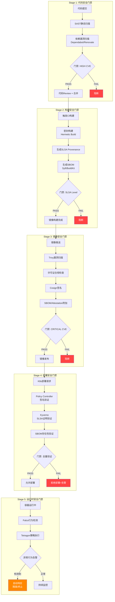

> **生产环境安全提示**
>
> 本文档包含可直接执行的运维命令。执行前请确认：当前目标集群与 Namespace 是否正确；是否具备足够的 RBAC 权限；是否已在非生产环境验证。命令风险等级标注：🔴 高风险（可能造成数据丢失或服务中断）、🟡 中风险（会修改集群状态，但通常可回滚）、🟢 低风险/只读（信息收集，无副作用）。


# [[kubernetes|Kubernetes]] 供应链安全实践 (Supply Chain Security: SBOM, SLSA, and Sigstore)

> **作者**: 云原生安全架构专家 | **版本**: v1.0 | **更新时间**: 2026-03-03
> **适用场景**: 容器供应链安全、合规审计、镜像安全 | **复杂度**: ⭐⭐⭐⭐⭐

<!-- chunk: 🎯 摘要 -->## 🎯 摘要

本文档系统梳理Kubernetes容器供应链安全的完整技术体系，覆盖从代码提交到生产部署的全链条安全实践。重点阐述SBOM软件物料清单（SPDX/CycloneDX）、SLSA构建来源证明（Level 1-4）与Sigstore无密钥签名体系（Cosign/Fulcio/Rekor）的企业级落地方案。结合SolarWinds、Log4Shell等真实攻击案例，分析Kubernetes供应链威胁面，并提供in-toto Attestation链路验证、Admission Controller强制检查、[[kyverno|Kyverno]]/OPA策略执行等纵深防御实践，帮助团队构建符合NIST SSDF与SLSA框架要求的云原生供应链安全基线。

<!-- chunk: 1. 供应链安全威胁全景 -->## 1. 供应链安全威胁全景

## 1.1 重大供应链攻击事件回顾

```yaml
供应链攻击典型案例分析:
  SolarWinds (2020):
    攻击方式: 构建系统被植入恶意代码(SUNBURST后门)
    影响范围: 18000+企业/政府机构，包括美国财政部、国防部
    K8s相关: SolarWinds Orion插件通过合法签名镜像部署
    根因: 构建系统访问控制缺失，无构建来源证明
    教训:
      - 构建环境必须隔离且不可变
      - 所有构建产物需有可验证的来源证明(Provenance)
      - 构建日志应存入防篡改透明日志

  Log4Shell (2021):
    攻击方式: Log4j 2.x JNDI注入RCE漏洞
    影响范围: 数亿级Java应用，K8s集群大规模受影响
    K8s相关: 容器镜像内Log4j依赖版本无法快速识别
    根因: 无SBOM导致漏洞影响面评估耗时数周
    教训:
      - SBOM可将漏洞受影响面评估从数周缩短到数分钟
      - 每个容器镜像必须附带完整依赖清单
      - CI/CD流水线需集成CVE扫描与SBOM生成

  XZ Utils (2024):
    攻击方式: 社会工程学渗透开源项目维护者，植入后门(CVE-2024-3094)
    影响范围: systemd集成的SSH服务，影响多个Linux发行版
    K8s相关: 基础镜像(Debian/Fedora)在更新后包含恶意xz-utils
    根因: 开源项目维护者身份无法验证，构建来源不可追溯
    教训:
      - SLSA Level 3+要求密封构建(Hermetic Build)可有效防御
      - 基础镜像更新需要来源证明验证
      - Sigstore签名 + Rekor透明日志提供不可否认记录

  3CX Supply Chain Attack (2023):
    攻击方式: 攻击者入侵上游依赖(Trading Technologies)，注入恶意DLL
    影响范围: 3CX桌面客户端，多个K8s企业生产环境
    根因: 传递依赖(Transitive Dependency)未扫描
    教训:
      - SBOM需递归记录传递依赖
      - CycloneDX VEX格式支持漏洞影响声明
```

## 1.2 Kubernetes供应链攻击面分析

```mermaid
graph LR
    subgraph "代码阶段 Code"
        A1[源代码仓库] -->|恶意提交/依赖投毒| A2[第三方依赖]
        A2 --> A3[开源组件漏洞]
    end

    subgraph "构建阶段 Build"
        B1[CI/CD系统] -->|构建系统入侵| B2[构建脚本篡改]
        B2 --> B3[编译器/工具链攻击]
        B3 --> B4[构建产物注入]
    end

    subgraph "镜像阶段 Image"
        C1[Dockerfile] -->|基础镜像篡改| C2[基础镜像漏洞]
        C2 --> C3[镜像层注入]
        C3 --> C4[未签名镜像]
    end

    subgraph "仓库阶段 Registry"
        D1[镜像仓库] -->|仓库凭据泄露| D2[镜像替换攻击]
        D2 --> D3[Tag劫持]
        D3 --> D4[中间人攻击]
    end

    subgraph "部署阶段 Deploy"
        E1[K8s集群] -->|准入控制绕过| E2[未验证镜像部署]
        E2 --> E3[运行时恶意行为]
        E3 --> E4[横向移动/数据泄露]
    end

    A3 -->|流入| B1
    B4 -->|推送| C1
    C4 -->|推送| D1
    D4 -->|拉取| E1

    style A1 fill:#ffcccc
    style B1 fill:#ffddcc
    style C1 fill:#ffffcc
    style D1 fill:#ccffcc
    style E1 fill:#ccccff
```



## 1.3 NIST SSDF框架映射

```yaml
NIST SSDF (Secure Software Development Framework) v1.1 与K8s供应链映射:
  PO (Prepare the Organization):
    PO.1: 定义安全需求
      K8s实践: SLSA Level目标定义，供应链安全策略
    PO.3: 实施支撑工具链
      K8s实践: Sigstore工具链部署，SBOM生成工具集成
    PO.5: 保护开发管道
      K8s实践: CI/CD系统加固，Secrets管理(Vault/ESO)

  PS (Protect the Software):
    PS.1: 保护代码
      K8s实践: 分支保护，Code Review强制，CODEOWNERS
    PS.2: 保护构建环境
      K8s实践: Hermetic Build，Tekton Chains，SLSA Builder
    PS.3: 保护发布管道
      K8s实践: Cosign签名，OCI Artifact存储SBOM/Attestation

  PW (Produce Well-Secured Software):
    PW.4: 重用安全组件
      K8s实践: Distroless基础镜像，定期更新基础镜像
    PW.6: 配置编译/构建选项
      K8s实践: BuildKit --no-cache，多阶段构建，COPY --chown
    PW.9: 测试可执行代码
      K8s实践: Trivy扫描，Grype漏洞扫描，SBOM差异对比

  RV (Respond to Vulnerabilities):
    RV.1: 识别漏洞
      K8s实践: SBOM + CVE数据库关联，Dependency-Track持续监控
    RV.2: 评估漏洞
      K8s实践: VEX(Vulnerability Exploitability eXchange)声明
    RV.3: 响应漏洞
      K8s实践: 自动化镜像重建，Kyverno策略阻断漏洞镜像

  合规框架对应:
    - SLSA v1.0: 覆盖PS.2/PS.3构建安全
    - SBOM(SPDX/CycloneDX): 覆盖PW.4/RV.1
    - Sigstore: 覆盖PS.3发布完整性
    - in-toto: 提供端到端供应链证明
```

<!-- chunk: 2. SBOM软件物料清单实践 -->## 2. SBOM软件物料清单实践

## 2.1 SPDX vs CycloneDX格式对比

```yaml
SBOM格式对比分析:
  SPDX (Software Package Data Exchange):
    规范: ISO/IEC 5962:2021，SPDX 2.3/3.0
    适用: 法律合规、开源许可证管理
    格式: JSON/YAML/RDF/TV/XML
    优势:
      - ISO国际标准，政府/国防合规首选
      - 完整许可证信息(LicenseConcluded/LicenseDeclared)
      - 关系图(DESCRIBES/CONTAINS/DEPENDS_ON)
      - SPDX 3.0支持AI/ML模型BOM
    劣势:
      - 格式冗长，文件体积较大
      - VEX支持相对薄弱
    示例字段:
      SPDXID: SPDXRef-Package-nginx
      PackageName: nginx
      PackageVersion: "1.25.3"
      PackageSupplier: Organization:nginx.org
      PackageLicenseConcluded: BSD-2-Clause
      PackageChecksum: SHA256:abc123...

  CycloneDX:
    规范: CycloneDX 1.6 (OWASP主导)
    适用: 安全分析、漏洞管理、运行时保护
    格式: JSON/XML/Protocol Buffers
    优势:
      - 原生VEX支持(漏洞影响声明)
      - 丰富的漏洞关联(purl + CVE)
      - SaaS/Container/Hardware BOM支持
      - Dependency-Track完整集成
      - CBOM(密码学BOM)支持
    劣势:
      - 非ISO标准(部分政府场景受限)
    示例字段:
      type: library
      name: log4j-core
      version: "2.17.1"
      purl: pkg:maven/org.apache.logging.log4j/log4j-core@2.17.1
      hashes:
        - alg: SHA-256
          content: abc123...

  选型建议:
    政府/国防合规: 优选SPDX 2.3(ISO标准)
    安全运营/漏洞管理: 优选CycloneDX 1.6
    企业实践: 双格式输出(Syft同时支持两种格式)
    联邦要求(美国EO 14028): SPDX或CycloneDX均可
```

## 2.2 Syft镜像SBOM生成

```bash
# ============================================================
# Syft SBOM生成 - CLI使用示例
# ============================================================

# 安装Syft
curl -sSfL https://raw.githubusercontent.com/anchore/syft/main/install.sh | sh -s -- -b /usr/local/bin

# 基础用法：生成镜像SBOM (CycloneDX格式)
syft nginx:1.25.3 -o cyclonedx-json=nginx-sbom.cdx.json

# 生成SPDX格式SBOM
syft nginx:1.25.3 -o spdx-json=nginx-sbom.spdx.json

# 生成多格式SBOM
syft nginx:1.25.3 \
  -o cyclonedx-json=nginx-sbom.cdx.json \
  -o spdx-json=nginx-sbom.spdx.json \
  -o syft-json=nginx-sbom.syft.json

# 扫描本地目录(源码SBOM)
syft dir:./myapp -o cyclonedx-json=source-sbom.cdx.json

# 扫描OCI镜像tar包
syft oci-archive:myimage.tar -o cyclonedx-json=sbom.cdx.json

# 配置排除路径
syft nginx:1.25.3 \
  --exclude /proc \
  --exclude /sys \
  -o cyclonedx-json=nginx-sbom.cdx.json

# 输出关键信息：包数量统计
syft nginx:1.25.3 -q | wc -l
```

```yaml
# ============================================================
# CI/CD集成 - GitHub Actions SBOM生成流水线
# ============================================================
name: Build and Generate SBOM

on:
  push:
    branches: [main]
  pull_request:
    branches: [main]

jobs:
  build-and-sbom:
    runs-on: ubuntu-latest
    permissions:
      contents: read
      packages: write
      id-token: write  # Sigstore OIDC需要

    steps:
      - name: Checkout
        uses: actions/checkout@v4

      - name: Set up Docker Buildx
        uses: docker/setup-buildx-action@v3

      - name: Login to Registry
        uses: docker/login-action@v3
        with:
          registry: ghcr.io
          username: ${{ github.actor }}
          password: ${{ secrets.GITHUB_TOKEN }}

      - name: Build and Push Image
        id: build
        uses: docker/build-push-action@v5
        with:
          context: .
          push: true
          tags: ghcr.io/${{ github.repository }}:${{ github.sha }}
          sbom: true          # BuildKit内置SBOM生成
          provenance: true    # 构建来源证明

      - name: Generate SBOM with Syft
        uses: anchore/sbom-action@v0
        with:
          image: ghcr.io/${{ github.repository }}:${{ github.sha }}
          format: cyclonedx-json
          output-file: sbom.cdx.json
          upload-artifact: true
          upload-release-assets: true

      - name: Generate SPDX SBOM
        uses: anchore/sbom-action@v0
        with:
          image: ghcr.io/${{ github.repository }}:${{ github.sha }}
          format: spdx-json
          output-file: sbom.spdx.json

      - name: Attach SBOM to OCI Registry
        run: |
          # 安装 oras CLI
          curl -LO https://github.com/oras-project/oras/releases/download/v1.1.0/oras_1.1.0_linux_amd64.tar.gz
          tar -xzf oras_1.1.0_linux_amd64.tar.gz oras
          # 推送SBOM到OCI仓库(作为Referrer)
          ./oras attach \
            --artifact-type application/vnd.cyclonedx+json \
            ghcr.io/${{ github.repository }}:${{ github.sha }} \
            sbom.cdx.json:application/vnd.cyclonedx+json

      - name: Sign SBOM with Cosign
        uses: sigstore/cosign-installer@v3
        run: |
          cosign attach sbom \
            --sbom sbom.cdx.json \
            --type cyclonedx \
            ghcr.io/${{ github.repository }}:${{ github.sha }}
          cosign sign --yes \
            ghcr.io/${{ github.repository }}:sbom
```

## 2.3 Trivy SBOM扫描与集成

```yaml
# ============================================================
# Trivy SBOM扫描配置
# ============================================================
apiVersion: v1
kind: ConfigMap
metadata:
  name: trivy-config
  namespace: security
data:
  trivy.yaml: |
    # Trivy全局配置
    cache:
      dir: /tmp/trivy-cache
    db:
      repository: ghcr.io/aquasecurity/trivy-db
      java-repository: ghcr.io/aquasecurity/trivy-java-db

    # SBOM生成配置
    format: cyclonedx
    output: /reports/sbom.cdx.json

    # 扫描配置
    vulnerability:
      type:
        - os
        - library
      ignore-unfixed: false

    # 严重性过滤
    severity:
      - CRITICAL
      - HIGH
      - MEDIUM

    # 许可证扫描
    license:
      full: true
      forbidden:
        - GPL-3.0
        - AGPL-3.0

---
# Trivy Operator - 集群内自动SBOM生成
apiVersion: helm.cattle.io/v1
kind: HelmChart
metadata:
  name: trivy-operator
  namespace: kube-system
spec:
  repo: https://aquasecurity.github.io/helm-charts
  chart: trivy-operator
  version: "0.21.0"
  targetNamespace: trivy-system
  createNamespace: true
  valuesContent: |-
    operator:
      scanJobTTL: "24h"
      vulnerabilityScannerEnabled: true
      sbomGenerationEnabled: true          # 启用SBOM生成
      clusterSbomCacheEnabled: true        # 集群级SBOM缓存
      configAuditScannerEnabled: true

    trivy:
      imageRef: ghcr.io/aquasecurity/trivy:0.50.0
      mode: Standalone
      dbRepository: ghcr.io/aquasecurity/trivy-db
      resources:
        requests:
          cpu: 100m
          memory: 100Mi
        limits:
          cpu: 500m
          memory: 500Mi

---
# ClusterSbomReport查询示例
# kubectl get clustersbomreports -A
# kubectl get sbomreports -n production
```

## 2.4 OCI Registry存储SBOM

```yaml
OCI Artifact SBOM存储方案:
  OCI Referrers API (OCI Spec 1.1):
    概念: SBOM作为镜像的关联Artifact存储
    标准: OCI Image Spec 1.1 Referrers API
    工具:
      - ORAS (OCI Registry As Storage): 推送/拉取Artifact
      - cosign attach sbom: Sigstore方式关联
      - Syft --output oci-image: 直接推送OCI格式

  存储结构示例:
    镜像: registry.io/myapp:v1.2.3 (digest: sha256:abc123)
    SBOM: registry.io/myapp:sha256-abc123.sbom (Referrer)
    签名: registry.io/myapp:sha256-abc123.sig (Cosign签名)
    Attestation: registry.io/myapp:sha256-abc123.att (SLSA证明)

  ORAS CLI操作:
    # 推送SBOM
    oras push registry.io/myapp:sbom \
      --artifact-type application/vnd.cyclonedx+json \
      sbom.cdx.json:application/vnd.cyclonedx+json

    # 查询Referrers
    oras discover registry.io/myapp:v1.2.3

    # 拉取SBOM
    oras pull registry.io/myapp@sha256:...
      --include-subject \
      -o ./sbom-output/

  注意事项:
    - Harbor 2.8+: 原生支持OCI Referrers API
    - ECR: 需开启OCI Artifact支持
    - GCR/GAR: 支持OCI Referrers
    - Quay.io: 支持cosign attach方式
```

<!-- chunk: 3. SLSA构建来源证明 -->## 3. SLSA构建来源证明

## 3.1 SLSA Level 1-4需求矩阵

```yaml
SLSA (Supply-chain Levels for Software Artifacts) v1.0 等级要求:

  Level 0 - 无保证:
    来源: 无构建来源记录
    完整性: 无校验
    适用: 内部原型开发

  Level 1 - 来源存在:
    来源要求:
      - 构建来源(Provenance)已生成
      - 来源描述构建过程(非密封)
      - 可机器可读格式(in-toto/DSSE)
    构建要求:
      - 脚本化构建(无手动命令)
      - 构建由版本控制的脚本驱动
    完整性: 防止意外篡改
    典型工具: GitHub Actions基础workflow

  Level 2 - 来源可认证:
    来源要求:
      - 来源由构建服务签名认证
      - 来源上传到不可伪造的服务
    构建要求:
      - 使用版本控制构建服务(GitHub/GitLab)
      - 构建服务生成来源(非用户)
    完整性: 防止构建平台以外的篡改
    典型工具: GitHub Actions + SLSA GitHub Generator

  Level 3 - 来源防篡改:
    来源要求:
      - 来源由构建服务直接生成(不经过用户)
      - 来源防止推理攻击
    构建要求:
      - 密封构建(Hermetic): 无出站网络访问
      - 独立构建: 每次构建独立环境
      - 参数化构建: 输入/输出完整记录
    完整性: 防止内部攻击者(构建管理员以外)
    典型工具: Tekton Chains, SLSA Hermetic Builder

  Level 4 - (已从v1.0移除，并入Level 3):
    注: SLSA v1.0将原Level 4合并入Level 3
    等同要求:
      - 双人审查(Two-person Review)
      - 密封构建 + 可重现构建(Reproducible)

  企业实践建议:
    外部软件/开源: 要求Level 2+
    内部关键系统: 要求Level 3
    合规/金融场景: 目标Level 3
    渐进式路径: L1(1个月) → L2(3个月) → L3(6个月)
```

## 3.2 Hermetic Build密封构建配置

```yaml
# ============================================================
# Tekton Pipeline - SLSA Level 3 密封构建配置
# ============================================================
apiVersion: tekton.dev/v1beta1
kind: Pipeline
metadata:
  name: slsa-level3-build
  namespace: tekton-pipelines
  annotations:
    # 声明此Pipeline满足SLSA Level 3
    slsa.dev/level: "3"
spec:
  params:
    - name: git-url
      type: string
    - name: git-revision
      type: string
    - name: image-name
      type: string
    - name: image-tag
      type: string

  workspaces:
    - name: source
    - name: docker-credentials

  tasks:
    - name: fetch-source
      taskRef:
        name: git-clone
        bundle: gcr.io/tekton-releases/catalog/upstream/git-clone:0.9
      workspaces:
        - name: output
          workspace: source
      params:
        - name: url
          value: $(params.git-url)
        - name: revision
          value: $(params.git-revision)

    - name: hermetic-build
      taskRef:
        name: kaniko
      runAfter: [fetch-source]
      workspaces:
        - name: source
          workspace: source
        - name: dockerconfig
          workspace: docker-credentials
      params:
        - name: IMAGE
          value: $(params.image-name):$(params.image-tag)
        - name: EXTRA_ARGS
          value:
            - "--no-push=false"
            - "--cache=false"           # 禁用缓存确保密封性
            - "--compressed-caching=false"
            - "--snapshot-mode=redo"
        - name: BUILDER_IMAGE
          value: gcr.io/kaniko-project/executor:v1.19.0-debug

      # 密封构建关键配置: 无出站网络
      podTemplate:
        securityContext:
          runAsNonRoot: true
          seccompProfile:
            type: RuntimeDefault
        # 通过NetworkPolicy阻断出站网络(除Registry外)

    - name: generate-provenance
      taskRef:
        name: slsa-provenance-generator
      runAfter: [hermetic-build]
      params:
        - name: image-digest
          value: $(tasks.hermetic-build.results.IMAGE_DIGEST)
        - name: builder-id
          value: "https://tekton.dev/chains/v2"

---
# Tekton Chains配置 - 自动生成SLSA Provenance
apiVersion: v1
kind: ConfigMap
metadata:
  name: chains-config
  namespace: tekton-chains
data:
  # 构建来源格式: SLSA v1.0
  artifacts.taskrun.format: "slsa/v1"
  artifacts.pipelinerun.format: "slsa/v1"

  # 存储后端: OCI Registry
  artifacts.taskrun.storage: "oci"
  artifacts.pipelinerun.storage: "oci"

  # 签名器: Sigstore keyless
  signers.x509.fulcio.address: "https://fulcio.sigstore.dev"
  signers.x509.rekor.address: "https://rekor.sigstore.dev"

  # 透明日志
  transparency.enabled: "true"
  transparency.url: "https://rekor.sigstore.dev"
```

## 3.3 GitHub Actions SLSA Generator配置

```yaml
# ============================================================
# GitHub Actions - SLSA v1.0 Level 3 构建证明生成
# ============================================================
name: SLSA Level 3 Build with Provenance

on:
  push:
    tags:
      - 'v*'

jobs:
  # 构建阶段
  build:
    runs-on: ubuntu-latest
    outputs:
      image: ${{ steps.build.outputs.image }}
      digest: ${{ steps.build.outputs.digest }}
    permissions:
      contents: read
      packages: write

    steps:
      - name: Checkout
        uses: actions/checkout@v4

      - name: Build Image
        id: build
        uses: docker/build-push-action@v5
        with:
          push: true
          tags: ghcr.io/${{ github.repository }}:${{ github.ref_name }}
          # 关键：记录完整Build Context
          provenance: mode=max
          sbom: true

      - name: Export Digest
        run: |
          echo "digest=${{ steps.build.outputs.digest }}" >> $GITHUB_OUTPUT
          echo "image=ghcr.io/${{ github.repository }}" >> $GITHUB_OUTPUT

  # SLSA来源证明生成 (使用官方SLSA Generator)
  provenance:
    needs: [build]
    permissions:
      actions: read       # 读取workflow信息
      id-token: write     # Sigstore OIDC签名
      packages: write     # 推送证明到Registry

    uses: slsa-framework/slsa-github-generator/.github/workflows/generator_container_slsa3.yml@v2.0.0
    with:
      image: ${{ needs.build.outputs.image }}
      digest: ${{ needs.build.outputs.digest }}
      registry-username: ${{ github.actor }}
      # 私有Registry配置
      # fulcio-url: https://fulcio.internal.example.com
      # rekor-url: https://rekor.internal.example.com
    secrets:
      registry-password: ${{ secrets.GITHUB_TOKEN }}

  # 验证来源证明
  verify-provenance:
    needs: [build, provenance]
    runs-on: ubuntu-latest

    steps:
      - name: Install SLSA Verifier
        run: |
          curl -LO https://github.com/slsa-framework/slsa-verifier/releases/latest/download/slsa-verifier-linux-amd64
          chmod +x slsa-verifier-linux-amd64
          sudo mv slsa-verifier-linux-amd64 /usr/local/bin/slsa-verifier

      - name: Verify SLSA Provenance
        run: |
          slsa-verifier verify-image \
            ghcr.io/${{ github.repository }}@${{ needs.build.outputs.digest }} \
            --source-uri github.com/${{ github.repository }} \
            --source-tag ${{ github.ref_name }} \
            --builder-id "https://github.com/slsa-framework/slsa-github-generator/.github/workflows/generator_container_slsa3.yml@refs/tags/v2.0.0"

          echo "✅ SLSA Level 3 Provenance Verified Successfully"
```

## 3.4 SLSA Verifier验证流程

```yaml
SLSA Verifier验证流程:
  工具: slsa-verifier (slsa-framework/slsa-verifier)

  验证步骤:
    1. 拉取镜像Attestation:
       cosign download attestation \
         --predicate-type https://slsa.dev/provenance/v1 \
         ghcr.io/myorg/myapp@sha256:abc123 > provenance.json

    2. 验证签名(Fulcio/Rekor):
       slsa-verifier verify-image \
         ghcr.io/myorg/myapp@sha256:abc123 \
         --source-uri github.com/myorg/myapp \
         --source-branch main

    3. 验证构建器ID:
       - 确认来自可信Builder(GitHub/Tekton)
       - 验证Builder签名证书中的OIDC声明

    4. 验证来源声明:
       - BuildType: https://slsa.dev/container-based-build/v0.1
       - Builder.id: 可信构建器标识
       - Metadata.buildInvocationId: 唯一构建ID
       - Subject[].digest.sha256: 与镜像digest匹配

  验证失败场景:
    - 签名无效或过期: 证书透明度日志异常
    - Builder不在白名单: 非可信构建器生成
    - Source不匹配: 声称来自其他仓库
    - Digest不匹配: 镜像被替换或篡改
```

<!-- chunk: 4. Sigstore无密钥签名体系 -->## 4. Sigstore无密钥签名体系

## 4.1 Sigstore核心架构

```mermaid
graph TB
    subgraph "开发者/CI环境"
        DEV[开发者/CI Runner]
        COSIGN[Cosign CLI]
        DEV --> COSIGN
    end

    subgraph "Sigstore核心服务"
        FULCIO[Fulcio CA\n短期证书颁发]
        REKOR[Rekor\n透明日志服务]
        TSA[TSA\n时间戳权威]
    end

    subgraph "OIDC身份提供商"
        GITHUB[GitHub Actions OIDC]
        GOOGLE[Google Accounts OIDC]
        MICROSOFT[Microsoft OIDC]
    end

    subgraph "OCI Registry"
        REGISTRY[镜像仓库\nGHCR/ECR/GAR]
        SIG[签名层\n.sig]
        ATT[证明层\n.att]
    end

    COSIGN -->|1. 请求OIDC Token| GITHUB
    GITHUB -->|2. 返回ID Token| COSIGN
    COSIGN -->|3. 用临时密钥对镜像签名| COSIGN
    COSIGN -->|4. 提交证书请求+OIDC Token| FULCIO
    FULCIO -->|5. 颁发短期X.509证书(10分钟)| COSIGN
    COSIGN -->|6. 将签名记录到透明日志| REKOR
    REKOR -->|7. 返回Rekor Entry URL| COSIGN
    COSIGN -->|8. 推送签名+证书| REGISTRY
    REGISTRY --> SIG
    REGISTRY --> ATT

    style FULCIO fill:#4CAF50,color:#fff
    style REKOR fill:#2196F3,color:#fff
    style COSIGN fill:#FF9800,color:#fff
    style REGISTRY fill:#9C27B0,color:#fff
```

## 4.2 Cosign镜像签名流程

```bash
# ============================================================
# Cosign无密钥签名完整操作指南
# ============================================================

# 安装Cosign
curl -LO "https://github.com/sigstore/cosign/releases/latest/download/cosign-linux-amd64"
sudo mv cosign-linux-amd64 /usr/local/bin/cosign
sudo chmod +x /usr/local/bin/cosign

# ===== 无密钥签名 (Keyless Signing) =====

# 1. 签名镜像 (GitHub Actions OIDC环境中自动获取Token)
cosign sign --yes \
  ghcr.io/myorg/myapp@sha256:abc123def456...

# 2. 验证签名
cosign verify \
  --certificate-identity "https://github.com/myorg/myapp/.github/workflows/release.yml@refs/heads/main" \
  --certificate-oidc-issuer "https://token.actions.githubusercontent.com" \
  ghcr.io/myorg/myapp@sha256:abc123def456...

# ===== 基于密钥对的签名 (适用私有环境) =====

# 生成密钥对
cosign generate-key-pair \
  --kms gcpkms://projects/myproject/locations/global/keyRings/mykeyring/cryptoKeys/mykey

# 使用KMS密钥签名
cosign sign \
  --key gcpkms://projects/myproject/locations/global/keyRings/mykeyring/cryptoKeys/mykey \
  ghcr.io/myorg/myapp:v1.0.0

# 验证KMS签名
cosign verify \
  --key gcpkms://projects/myproject/locations/global/keyRings/mykeyring/cryptoKeys/mykey \
  ghcr.io/myorg/myapp:v1.0.0

# ===== 添加自定义注解 =====
cosign sign --yes \
  -a "git-sha=$GIT_SHA" \
  -a "build-date=$(date -u +%Y-%m-%dT%H:%M:%SZ)" \
  -a "repo=$GITHUB_REPOSITORY" \
  ghcr.io/myorg/myapp@sha256:abc123...

# ===== 查询Rekor透明日志 =====
rekor-cli search \
  --email "github-actions@example.com" \
  --rekor_server https://rekor.sigstore.dev

# 获取特定Entry
rekor-cli get \
  --uuid <entry-uuid> \
  --rekor_server https://rekor.sigstore.dev

# ===== 验证签名证书信息 =====
cosign verify \
  --certificate-identity-regexp ".*@myorg.*" \
  --certificate-oidc-issuer "https://token.actions.githubusercontent.com" \
  --output json \
  ghcr.io/myorg/myapp@sha256:abc123... | jq '.[0].optional'
```

## 4.3 Policy Controller强制验证配置

```yaml
# ============================================================
# Sigstore Policy Controller - 强制镜像签名验证
# ============================================================

# 安装Policy Controller
# helm install policy-controller sigstore/policy-controller \
#   --namespace cosign-system --create-namespace

---
# ClusterImagePolicy - 集群级镜像策略
apiVersion: policy.sigstore.dev/v1beta1
kind: ClusterImagePolicy
metadata:
  name: require-signed-images
spec:
  images:
    # 匹配所有生产镜像
    - glob: "ghcr.io/myorg/**"
    - glob: "registry.mycompany.com/**"

  authorities:
    # 方式1: 无密钥签名验证(GitHub Actions)
    - name: github-actions-keyless
      keyless:
        url: https://fulcio.sigstore.dev
        identities:
          - issuer: "https://token.actions.githubusercontent.com"
            subject: "https://github.com/myorg/myapp/.github/workflows/release.yml@refs/heads/main"
          # 支持正则匹配
          - issuer: "https://token.actions.githubusercontent.com"
            subjectRegExp: "https://github.com/myorg/.*/.github/workflows/release\\.yml@refs/heads/main"
        rekorUrl: https://rekor.sigstore.dev

    # 方式2: 基于公钥验证
    - name: company-key
      key:
        data: |
          -----BEGIN PUBLIC KEY-----
          MFkwEwYHKoZIzj0CAQYIKoZIzj0DAQcDQgAE...
          -----END PUBLIC KEY-----

  policy:
    # 可选: 额外策略验证
    type: cue
    data: |
      import "time"
      before: time.Parse(time.RFC3339, "2027-01-01T00:00:00Z")
      isAfter: time.Now().UnixNano() < before.UnixNano()

---
# 为特定命名空间启用策略检查
apiVersion: v1
kind: Namespace
metadata:
  name: production
  labels:
    # 启用Policy Controller
    policy.sigstore.dev/include: "true"

---
# 豁免系统命名空间
apiVersion: policy.sigstore.dev/v1beta1
kind: ClusterImagePolicy
metadata:
  name: allow-system-images
spec:
  images:
    - glob: "registry.k8s.io/**"
    - glob: "k8s.gcr.io/**"
    - glob: "gcr.io/google-containers/**"
  authorities:
    - name: allow-all
      static:
        action: pass
```

<!-- chunk: 5. in-toto Attestation链路验证 -->## 5. in-toto Attestation链路验证

## 5.1 Attestation概念与DSSE格式

```yaml
in-toto Attestation基础概念:
  定义: 关于软件制品的可验证声明(Verifiable Claim)
  标准: in-toto Attestation Framework v1.0
  封装格式: DSSE (Dead Simple Signing Envelope)

  核心组件:
    Statement (声明):
      - subject: 被声明的对象(镜像digest/文件hash)
      - predicateType: 声明类型URI
      - predicate: 具体声明内容(JSON)

    Predicate类型:
      SLSA Provenance:
        URI: https://slsa.dev/provenance/v1
        内容: 构建者、构建参数、源代码、依赖
      SBOM:
        URI: https://spdx.dev/Document
        URI: https://cyclonedx.org/bom
        内容: 完整软件物料清单
      Vulnerability Scan:
        URI: https://cosign.sigstore.dev/attestation/vuln/v1
        内容: Trivy/Grype扫描结果
      Test Results:
        URI: https://cosign.sigstore.dev/attestation/test/v1
        内容: 测试结果、覆盖率

  DSSE封装格式:
    payloadType: "application/vnd.in-toto+json"
    payload: <base64(Statement JSON)>
    signatures:
      - keyid: ""
        sig: <base64(signature)>

  供应链证明链:
    代码→构建: SLSA Provenance(构建来源)
    构建→镜像: SBOM(依赖清单)
    镜像→扫描: Vulnerability Attestation
    镜像→测试: Test Result Attestation
    全链: in-toto Link Metadata
```

## 5.2 构建时Attestation生成

```yaml
# ============================================================
# GitHub Actions - 生成完整Attestation链
# ============================================================
name: Full Attestation Chain

on:
  push:
    branches: [main]

jobs:
  build-with-attestation:
    runs-on: ubuntu-latest
    permissions:
      id-token: write
      contents: read
      packages: write
      attestations: write  # GitHub原生Attestation权限

    steps:
      - uses: actions/checkout@v4

      - name: Build Image
        id: build
        uses: docker/build-push-action@v5
        with:
          push: true
          tags: ghcr.io/${{ github.repository }}:${{ github.sha }}

      # 1. GitHub原生构建证明(SLSA Level 2)
      - name: Generate Build Attestation
        uses: actions/attest-build-provenance@v1
        with:
          subject-name: ghcr.io/${{ github.repository }}
          subject-digest: ${{ steps.build.outputs.digest }}
          push-to-registry: true

      # 2. SBOM Attestation
      - name: Generate SBOM
        uses: anchore/sbom-action@v0
        with:
          image: ghcr.io/${{ github.repository }}@${{ steps.build.outputs.digest }}
          format: cyclonedx-json
          output-file: sbom.cdx.json

      - name: Attest SBOM
        uses: actions/attest-sbom@v1
        with:
          subject-name: ghcr.io/${{ github.repository }}
          subject-digest: ${{ steps.build.outputs.digest }}
          sbom-path: sbom.cdx.json
          push-to-registry: true

      # 3. 漏洞扫描Attestation
      - name: Run Trivy Vulnerability Scan
        run: |
          trivy image \
            --format cosign-vuln \
            --output vuln-scan.json \
            ghcr.io/${{ github.repository }}@${{ steps.build.outputs.digest }}

      - name: Attest Vulnerability Scan
        run: |
          cosign attest --yes \
            --predicate vuln-scan.json \
            --type cosign.sigstore.dev/attestation/vuln/v1 \
            ghcr.io/${{ github.repository }}@${{ steps.build.outputs.digest }}

      # 4. 自定义测试结果Attestation
      - name: Run Tests
        run: |
          go test ./... -json > test-results.json

      - name: Attest Test Results
        run: |
          cosign attest --yes \
            --predicate test-results.json \
            --type cosign.sigstore.dev/attestation/test/v1 \
            ghcr.io/${{ github.repository }}@${{ steps.build.outputs.digest }}
```

## 5.3 Attestation链验证

```bash
# ============================================================
# Attestation链完整性验证
# ============================================================

IMAGE="ghcr.io/myorg/myapp@sha256:abc123..."

# 1. 验证构建来源Attestation
cosign verify-attestation \
  --type https://slsa.dev/provenance/v1 \
  --certificate-identity-regexp ".*" \
  --certificate-oidc-issuer "https://token.actions.githubusercontent.com" \
  $IMAGE | jq '.payload | @base64d | fromjson | .predicate'

# 2. 验证SBOM Attestation
cosign verify-attestation \
  --type https://spdx.dev/Document \
  --certificate-identity-regexp ".*" \
  --certificate-oidc-issuer "https://token.actions.githubusercontent.com" \
  $IMAGE | jq '.payload | @base64d | fromjson'

# 3. 验证漏洞扫描Attestation
cosign verify-attestation \
  --type cosign.sigstore.dev/attestation/vuln/v1 \
  --certificate-identity-regexp ".*" \
  --certificate-oidc-issuer "https://token.actions.githubusercontent.com" \
  $IMAGE | jq '.payload | @base64d | fromjson | .predicate.scanner'

# 4. 使用cosign tree查看所有关联Artifact
cosign tree $IMAGE

# 输出示例:
# 📦 Supply Chain Security Related artifacts for an image: ghcr.io/myorg/myapp@sha256:abc123
# └── 💾 Attestations for an image tag: ghcr.io/myorg/myapp:sha256-abc123.att
#     ├── 🍒 sha256:def456 - https://slsa.dev/provenance/v1
#     ├── 🍒 sha256:ghi789 - https://spdx.dev/Document
#     └── 🍒 sha256:jkl012 - cosign.sigstore.dev/attestation/vuln/v1
# └── 🔐 Signatures for an image tag: ghcr.io/myorg/myapp:sha256-abc123.sig
#     └── 🍒 sha256:mno345
```

<!-- chunk: 6. Admission Controller强制验证 -->## 6. Admission Controller强制验证

## 6.1 Kyverno镜像签名验证策略

```yaml
# ============================================================
# Kyverno ClusterPolicy - 强制镜像签名和SBOM验证
# ============================================================
apiVersion: kyverno.io/v1
kind: ClusterPolicy
metadata:
  name: verify-image-signatures
  annotations:
    policies.kyverno.io/title: Verify Image Signatures
    policies.kyverno.io/category: Supply Chain Security
    policies.kyverno.io/severity: high
    policies.kyverno.io/subject: Pod
    policies.kyverno.io/description: >
      Requires all container images to be signed by trusted Sigstore keys
      and have valid SLSA provenance attestations.
spec:
  validationFailureAction: Enforce
  background: false
  rules:
    # 规则1: 验证镜像签名
    - name: check-image-signature
      match:
        any:
          - resources:
              kinds: [Pod]
              namespaces: ["production", "staging"]
      verifyImages:
        - imageReferences:
            - "ghcr.io/myorg/*"
            - "registry.mycompany.com/*"
          attestors:
            - count: 1
              entries:
                # 无密钥签名验证
                - keyless:
                    url: https://fulcio.sigstore.dev
                    rekor:
                      url: https://rekor.sigstore.dev
                    issuer: "https://token.actions.githubusercontent.com"
                    subject: "https://github.com/myorg/*/github/workflows/release.yml@refs/heads/main"
          # 变更镜像Tag为Digest(防止Tag劫持)
          mutateDigest: true
          verifyDigest: true
          required: true

    # 规则2: 验证SLSA Provenance Attestation
    - name: check-slsa-provenance
      match:
        any:
          - resources:
              kinds: [Pod]
              namespaces: ["production"]
      verifyImages:
        - imageReferences:
            - "ghcr.io/myorg/*"
          attestations:
            - predicateType: https://slsa.dev/provenance/v1
              attestors:
                - count: 1
                  entries:
                    - keyless:
                        url: https://fulcio.sigstore.dev
                        issuer: "https://token.actions.githubusercontent.com"
                        subject: "https://github.com/myorg/*"
              conditions:
                - all:
                    # 验证builder来自GitHub Actions
                    - key: "{{ predicate.builder.id }}"
                      operator: AnyIn
                      value:
                        - "https://github.com/slsa-framework/slsa-github-generator/.github/workflows/generator_container_slsa3.yml@refs/tags/v2.0.0"

    # 规则3: 禁止latest Tag
    - name: disallow-latest-tag
      match:
        any:
          - resources:
              kinds: [Pod]
              namespaces: ["production", "staging"]
      validate:
        message: "Image tag 'latest' is not allowed in production. Use specific version tags."
        foreach:
          - list: "request.object.spec.containers"
            deny:
              conditions:
                any:
                  - key: "{{ element.image }}"
                    operator: Equals
                    value: "*:latest"
                  - key: "{{ element.image }}"
                    operator: NotContains
                    value: ":"

---
# Kyverno Policy - 验证镜像SBOM存在性
apiVersion: kyverno.io/v1
kind: ClusterPolicy
metadata:
  name: require-sbom-attestation
spec:
  validationFailureAction: Audit  # 先Audit后切换Enforce
  rules:
    - name: check-sbom-attestation
      match:
        any:
          - resources:
              kinds: [Pod]
              namespaces: ["production"]
      verifyImages:
        - imageReferences:
            - "ghcr.io/myorg/*"
          attestations:
            - predicateType: https://spdx.dev/Document
              attestors:
                - count: 1
                  entries:
                    - keyless:
                        url: https://fulcio.sigstore.dev
                        issuer: "https://token.actions.githubusercontent.com"
```

## 6.2 OPA/Gatekeeper策略

```yaml
# ============================================================
# OPA Gatekeeper - 强制SBOM存在性检查
# ============================================================

# ConstraintTemplate - 定义策略模板
apiVersion: templates.gatekeeper.sh/v1
kind: ConstraintTemplate
metadata:
  name: requiresbomannot
spec:
  crd:
    spec:
      names:
        kind: RequireSbomAnnot
      validation:
        openAPIV3Schema:
          type: object
          properties:
            requiredAnnotations:
              type: array
              items:
                type: string
  targets:
    - target: admission.k8s.gatekeeper.sh
      rego: |
        package requiresbomannot

        violation[{"msg": msg}] {
          container := input.review.object.spec.containers[_]
          not has_sbom_annotation(container)
          msg := sprintf(
            "Container '%v' is missing required SBOM annotation. Image: %v",
            [container.name, container.image]
          )
        }

        has_sbom_annotation(container) {
          # 检查Pod注解中是否有SBOM引用
          annotations := input.review.object.metadata.annotations
          annotations["supply-chain.security/sbom-verified"] == "true"
        }

        violation[{"msg": msg}] {
          container := input.review.object.spec.containers[_]
          not signed_by_trusted_source(container.image)
          msg := sprintf(
            "Image '%v' is not from a trusted registry",
            [container.image]
          )
        }

        signed_by_trusted_source(image) {
          trusted_registries := [
            "ghcr.io/myorg/",
            "registry.mycompany.com/",
            "registry.k8s.io/"
          ]
          startswith(image, trusted_registries[_])
        }

---
# Constraint实例 - 应用到生产命名空间
apiVersion: constraints.gatekeeper.sh/v1beta1
kind: RequireSbomAnnot
metadata:
  name: prod-require-sbom
spec:
  match:
    kinds:
      - apiGroups: [""]
        kinds: ["Pod"]
    namespaces: ["production", "staging"]
  parameters:
    requiredAnnotations:
      - "supply-chain.security/sbom-verified"
      - "supply-chain.security/signature-verified"
```

## 6.3 ValidatingAdmissionPolicy原生支持

```yaml
# ============================================================
# Kubernetes原生ValidatingAdmissionPolicy (GA in K8s 1.30)
# ============================================================
apiVersion: admissionregistration.k8s.io/v1
kind: ValidatingAdmissionPolicy
metadata:
  name: supply-chain-security-policy
spec:
  failurePolicy: Fail
  matchConstraints:
    resourceRules:
      - apiGroups: [""]
        apiVersions: ["v1"]
        operations: ["CREATE", "UPDATE"]
        resources: ["pods"]

  validations:
    # 1. 禁止latest Tag
    - expression: >
        object.spec.containers.all(c,
          !c.image.endsWith(':latest') &&
          c.image.contains(':') &&
          c.image.contains('@sha256:')
        )
      message: "All container images must use immutable digest references (not :latest)"
      reason: Invalid

    # 2. 强制镜像来自可信仓库
    - expression: >
        object.spec.containers.all(c,
          c.image.startsWith('ghcr.io/myorg/') ||
          c.image.startsWith('registry.mycompany.com/') ||
          c.image.startsWith('registry.k8s.io/')
        )
      message: "Container images must be from trusted registries"
      reason: Forbidden

    # 3. 检查供应链安全注解
    - expression: >
        has(object.metadata.annotations) &&
        has(object.metadata.annotations['supply-chain.security/verified']) &&
        object.metadata.annotations['supply-chain.security/verified'] == 'true'
      message: "Pod must have supply chain security verification annotation"
      reason: Invalid

  auditAnnotations:
    - key: "supply-chain-audit"
      valueExpression: >
        'image=' + object.spec.containers[0].image +
        ',namespace=' + object.metadata.namespace

---
# 绑定策略到命名空间
apiVersion: admissionregistration.k8s.io/v1
kind: ValidatingAdmissionPolicyBinding
metadata:
  name: supply-chain-security-binding
spec:
  policyName: supply-chain-security-policy
  validationActions: [Deny, Audit]
  matchResources:
    namespaceSelector:
      matchLabels:
        supply-chain-policy: enforced
```

<!-- chunk: 7. 企业级供应链安全体系 -->## 7. 企业级供应链安全体系

## 7.1 完整供应链安全门禁



## 7.2 私有Sigstore部署

```yaml
# ============================================================
# 自托管Sigstore基础设施 (Air-gapped/私有云环境)
# ============================================================

# 使用scaffolding项目部署私有Sigstore
# https://github.com/sigstore/scaffolding

# 1. 部署私有Fulcio (CA服务)
apiVersion: apps/v1
kind: Deployment
metadata:
  name: fulcio-server
  namespace: sigstore-system
spec:
  replicas: 2
  selector:
    matchLabels:
      app: fulcio-server
  template:
    metadata:
      labels:
        app: fulcio-server
    spec:
      serviceAccountName: fulcio-server
      containers:
        - name: fulcio-server
          image: gcr.io/projectsigstore/fulcio:v1.5.0
          args:
            - serve
            - --port=5555
            - --grpc-port=5554
            - --ca=fileca
            - --fileca-cert=/var/run/fulcio-secrets/cert.pem
            - --fileca-key=/var/run/fulcio-secrets/key.pem
            - --fileca-key-passwd=$(FULCIO_CA_KEY_PASSWD)
            - --ct-log-url=http://ctlog.sigstore-system.svc/sigstorescaffolding
          env:
            - name: FULCIO_CA_KEY_PASSWD
              valueFrom:
                secretKeyRef:
                  name: fulcio-ca-key-passwd
                  key: password
          volumeMounts:
            - name: fulcio-config
              mountPath: /etc/fulcio-config
            - name: fulcio-secrets
              mountPath: /var/run/fulcio-secrets
          ports:
            - containerPort: 5555
            - containerPort: 5554
          resources:
            requests:
              cpu: 100m
              memory: 128Mi
            limits:
              cpu: 500m
              memory: 512Mi
      volumes:
        - name: fulcio-config
          configMap:
            name: fulcio-config
        - name: fulcio-secrets
          secret:
            secretName: fulcio-ca-key-pair

---
# 2. 部署私有Rekor (透明日志)
apiVersion: apps/v1
kind: Deployment
metadata:
  name: rekor-server
  namespace: sigstore-system
spec:
  replicas: 1
  selector:
    matchLabels:
      app: rekor-server
  template:
    metadata:
      labels:
        app: rekor-server
    spec:
      containers:
        - name: rekor-server
          image: gcr.io/projectsigstore/rekor-server:v1.3.5
          args:
            - serve
            - --trillian_log_server.address=trillian-log-server.sigstore-system.svc
            - --trillian_log_server.port=8091
            - --rekor_server.address=0.0.0.0
            - --rekor_server.port=3000
            - --rekor_server.timestamp_chain_length=0
            - --enable_retrieve_api=true
            - --log_type=rekord
          ports:
            - containerPort: 3000
          resources:
            requests:
              cpu: 100m
              memory: 256Mi
            limits:
              cpu: 1000m
              memory: 1Gi

---
# 3. Cosign配置使用私有Sigstore
# ~/.sigstore/root/targets/fulcio.crt 配置私有CA证书
# 环境变量配置
apiVersion: v1
kind: ConfigMap
metadata:
  name: cosign-private-sigstore-config
  namespace: ci-system
data:
  # Cosign环境变量
  COSIGN_FULCIO_URL: "https://fulcio.sigstore.internal.example.com"
  COSIGN_REKOR_URL: "https://rekor.sigstore.internal.example.com"
  COSIGN_MIRROR: "https://tuf.sigstore.internal.example.com"
  COSIGN_ROOT: "/etc/sigstore/tuf-root/root.json"
  # 禁用公共透明日志
  COSIGN_EXPERIMENTAL: "1"
```

## 7.3 监控与审计集成

```yaml
# ============================================================
# Falco规则 - 检测供应链安全异常
# ============================================================
apiVersion: v1
kind: ConfigMap
metadata:
  name: falco-supply-chain-rules
  namespace: falco-system
data:
  supply_chain_rules.yaml: |
    # 规则1: 检测未签名镜像运行
    - rule: Unsigned Image Running
      desc: Detect containers running from images without valid signatures
      condition: >
        spawned_process and container and
        not container.image.repository in (trusted_registries) and
        not proc.name in (allowed_processes)
      output: >
        Unsigned or untrusted image running
        (user=%user.name image=%container.image.repository:%container.image.tag
         container=%container.id pod=%k8s.pod.name ns=%k8s.ns.name)
      priority: WARNING
      tags: [supply-chain, image-security]

    # 规则2: 检测镜像仓库凭据访问
    - rule: Docker Credentials Access
      desc: Detect access to container registry credentials
      condition: >
        open_read and
        (fd.name startswith "/var/lib/kubelet/pods" and
         fd.name endswith "config.json") and
        not proc.name in (kubelet, dockerd, containerd)
      output: >
        Container registry credentials accessed
        (user=%user.name proc=%proc.name file=%fd.name
         container=%container.id pod=%k8s.pod.name)
      priority: HIGH
      tags: [supply-chain, credentials]

    # 规则3: 检测容器内package安装
    - rule: Package Management in Container
      desc: Detect package managers running in containers (supply chain risk)
      condition: >
        spawned_process and container and
        proc.name in (apt, apt-get, yum, dnf, apk, pip, npm, curl, wget) and
        not namespace in (kube-system, monitoring) and
        not image.repository startswith "registry.k8s.io"
      output: >
        Package manager or download tool run in container
        (user=%user.name proc=%proc.name args=%proc.args
         container=%container.id image=%container.image.repository)
      priority: NOTICE
      tags: [supply-chain, runtime]

    # 宏定义
    - macro: trusted_registries
      condition: >
        container.image.repository startswith "ghcr.io/myorg/" or
        container.image.repository startswith "registry.mycompany.com/" or
        container.image.repository startswith "registry.k8s.io/"

---
# Sigstore事件与Falco告警联动
# Falco Sidekick配置推送到告警系统
apiVersion: v1
kind: ConfigMap
metadata:
  name: falcosidekick-config
  namespace: falco-system
data:
  config.yaml: |
    slack:
      webhookurl: "https://hooks.slack.com/services/..."
      channel: "#supply-chain-security-alerts"
      minimumpriority: "warning"

    pagerduty:
      routingkey: "xxx"
      minimumpriority: "high"

    # 发送到SIEM
    elasticsearch:
      hostport: "http://elasticsearch:9200"
      index: "falco-supply-chain"
      minimumpriority: "notice"
```

<!-- chunk: 8. 最佳实践检查清单 -->## 8. 最佳实践检查清单

```yaml
# ============================================================
# 企业级供应链安全最佳实践检查清单
# ============================================================

供应链安全检查清单:
  CI_CD阶段:
    代码安全:
      - [ ] 所有依赖通过Dependabot/Renovate自动更新
      - [ ] SAST扫描集成到PR检查(Semgrep/CodeQL)
      - [ ] 第三方依赖锁文件提交(go.sum/package-lock.json)
      - [ ] 使用Pin Action版本到Commit Hash(防止Tag劫持)
      - [ ] CODEOWNERS文件配置关键路径审批
      - [ ] 分支保护: 禁止Force Push, 要求PR审批

    构建安全:
      - [ ] 构建使用Pin的基础镜像(digest引用)
      - [ ] Dockerfile使用多阶段构建减少攻击面
      - [ ] 构建不使用--network=host(隔离网络)
      - [ ] SLSA Provenance自动生成(Level 2+)
      - [ ] SBOM在构建阶段自动生成(Syft/BuildKit)
      - [ ] 构建Secrets通过Vault/ESO注入(不硬编码)

    镜像安全:
      - [ ] Trivy/Grype扫描集成CI(阻断CRITICAL)
      - [ ] Cosign对镜像进行签名(Keyless/KMS)
      - [ ] SBOM附加到OCI Registry(cosign attach)
      - [ ] 镜像使用Distroless/Scratch基础镜像
      - [ ] 定期重建基础镜像(base image更新)
      - [ ] 镜像不以root用户运行(USER非0)

  Registry准入阶段:
    镜像仓库安全:
      - [ ] Harbor/ECR启用内容信任(Content Trust)
      - [ ] 仓库访问控制(RBAC: 仅CI可推送)
      - [ ] 镜像扫描策略(推送时自动扫描)
      - [ ] Immutable Tags配置(防止同Tag覆盖)
      - [ ] 私有镜像通过VPN/PrivateLink访问
      - [ ] 定期清理未使用镜像(节约成本+减少风险)

    准入控制:
      - [ ] Policy Controller/Kyverno部署并启用
      - [ ] 强制验证镜像签名(生产命名空间)
      - [ ] 强制验证SLSA Provenance
      - [ ] 禁止:latest Tag部署到生产
      - [ ] 强制镜像使用Digest引用(mutateDigest)
      - [ ] ValidatingAdmissionPolicy配置可信仓库白名单

  运行时验证阶段:
    运行时安全:
      - [ ] Falco部署并启用供应链规则
      - [ ] Tetragon配置阻止容器内包安装
      - [ ] NetworkPolicy限制容器出站访问
      - [ ] PodSecurity Standards: restricted profile
      - [ ] Seccomp: RuntimeDefault profile
      - [ ] AppArmor/SELinux配置(适用场景)

    监控审计:
      - [ ] Rekor透明日志与SIEM集成
      - [ ] 供应链安全事件告警配置(PagerDuty/Slack)
      - [ ] 定期SBOM漏洞扫描(Dependency-Track)
      - [ ] VEX声明维护(误报管理)
      - [ ] 供应链安全指标Dashboard(Grafana)
      - [ ] 季度供应链安全审计(人工Review)

  合规与治理:
    - [ ] NIST SSDF合规评估完成
    - [ ] SLSA Level目标定义并达成
    - [ ] SBOM生成覆盖率>95%
    - [ ] 内部供应链安全培训完成
    - [ ] 供应链安全事件响应预案制定
    - [ ] 第三方依赖审查流程建立
```

<!-- chunk: 9. 未来趋势 -->## 9. 未来趋势

## 9.1 SLSA v1.0规范稳定化

```yaml
SLSA v1.0 发展动态 (2025-2026):
  规范稳定:
    已完成:
      - SLSA v1.0正式发布(2023年4月)
      - Source Track草案(代码仓库安全)
      - Build Track稳定化(构建完整性)
    进行中:
      - SLSA v1.1: 增强Hermetic Build定义
      - Package Track: 包管理器安全规范
      - Service Track: 运行时服务安全

  生态系统支持:
    官方Builder:
      - GitHub Actions SLSA Generator: v2.0+(Level 3)
      - GitLab CI: 原生SLSA支持(Level 2)
      - Google Cloud Build: SLSA Level 3认证
      - Tekton Chains: Level 2/3支持
    验证工具:
      - slsa-verifier v2.x: 多平台支持
      - cosign: SLSA Attestation原生验证
      - Kyverno: ClusterImagePolicy SLSA验证

  2026年趋势:
    - SLSA Source Track正式发布: 覆盖代码仓库安全
    - 主流CI/CD平台默认启用SLSA Provenance
    - 政府合规要求SLSA Level 2+(EO 14028延伸)
    - AI/ML模型SBOM与SLSA扩展规范
```

## 9.2 Kubernetes原生镜像签名路线图

```yaml
K8s原生镜像签名进展:
  当前状态(2026):
    - ImagePolicy: 已通过KEP-2573(Alpha to Beta迁移)
    - ValidatingAdmissionPolicy: GA(K8s 1.30+)
    - OCI Referrers API: 主流Registry已支持

  即将到来(2026-2027):
    KEP-3582 ImageVerification:
      目标: K8s原生镜像签名验证(无需第三方Webhook)
      进展: Alpha设计阶段
      功能:
        - 内置Cosign签名验证
        - Referrers API集成
        - SLSA Provenance验证
        - 与RBAC集成

    CRI-O/containerd集成:
      - containerd 2.0: 原生签名验证支持
      - CRI-O: cosign-operator集成
      - 无需Admission Webhook: 在镜像拉取时直接验证

    Image Streaming + 签名:
      - 镜像拉取时同步验证签名
      - 减少签名验证延迟
      - 与镜像缓存结合优化

  Sigstore生态 2026:
    - Sigstore Root 2.0: 增强信任根管理
    - Cosign v3.0: 多签名聚合支持
    - Rekor分片: 大规模部署性能优化
    - OCI 1.2: 原生Attestation格式标准化
```

## 9.3 相关领域链接

```yaml
知识体系关联:
  零信任安全架构:
    文档: "[03-零信任安全架构](./03-kubernetes-zero-trust-security-architecture.md)"
    关联点:
      - 供应链签名验证 = 镜像身份认证(零信任)
      - Sigstore Keyless = OIDC身份体系延伸
      - Policy Controller = 零信任准入控制层
      - SBOM + 漏洞扫描 = 持续验证(Never Trust, Always Verify)

  策略即代码:
    文档: "[24-策略即代码实践](./24-kubernetes-policy-as-code.md)"
    关联点:
      - Kyverno供应链策略 = OPA/Rego策略即代码
      - ValidatingAdmissionPolicy = 原生策略引擎
      - 供应链安全基线 = GitOps策略仓库管理
      - 策略测试: Kyverno CLI/conftest验证

  GitOps实践:
    文档: "[05-GitOps完整实践指南](./05-kubernetes-gitops-complete-practice-guide.md)"
    关联点:
      - 镜像签名验证集成ArgoCD Image Updater
      - SBOM存储于OCI Registry = GitOps Artifact管理
      - Flux供应链安全: cosign验证OCI Source

  eBPF与Cilium:
    文档: "[18-eBPF与Cilium深度实践](./18-kubernetes-ebpf-cilium-deep-practice.md)"
    关联点:
      - Tetragon运行时供应链检测
      - eBPF NetworkPolicy阻断恶意出站
      - Hubble可观测性用于供应链审计
```

---
*本文档由云原生安全架构专家团队维护，内容基于企业级容器供应链安全实践，持续跟踪Sigstore/SLSA/SBOM最新技术规范与生产落地经验*

---

<!-- chunk: Obsidian 相关文档 -->## Obsidian 相关文档

- domain-19-papers MOC
- [[21-生态参考/README.md|Domain 19: Kubernetes 高级技术论文与最佳实践 (Advanced Technical Papers...]]
- Domain-19 论文与参考 — 开源项目索引
- Kubernetes 生产就绪性评估框架 (Production Readiness Assessment Framew...
- Kubernetes 大规模集群性能优化深度实践 (Large-Scale Cluster Performance Op...
- Kubernetes 安全零信任架构实施指南 (Zero Trust Security Architecture Imp...
- Kubernetes 多云混合部署架构与实践 (Multi-Cloud Hybrid Deployment Archit...
- Kubernetes GitOps 完整实践指南 (GitOps Complete Practice Guide)
- Kubernetes 成本治理与 FinOps 实践 (Kubernetes Cost Governance and F...
- Kubernetes 容器存储接口 (CSI) 深度实践指南 (Container Storage Interface ...
- Kubernetes 网络策略与安全微隔离实践 (Network Policies and Security Micro...
- Kubernetes 服务网格深度实践与Istio集成 (Service Mesh Deep Practice and ...

## See Also

- 18-kubernetes-ebpf-cilium-deep-practice
- 19-kubernetes-gateway-api-modern-traffic-management
- 21-kubernetes-platform-engineering-internal-developer-platform
- 22-kubernetes-webassembly-wasm-workloads

## Related

- [[papers|#papers Hub]] — tag hub

- research/ — tag hub

- [[21-生态参考/03-领域索引/etcd-index.md|etcd 知识图谱索引]]


<!-- risk-assessed -->
