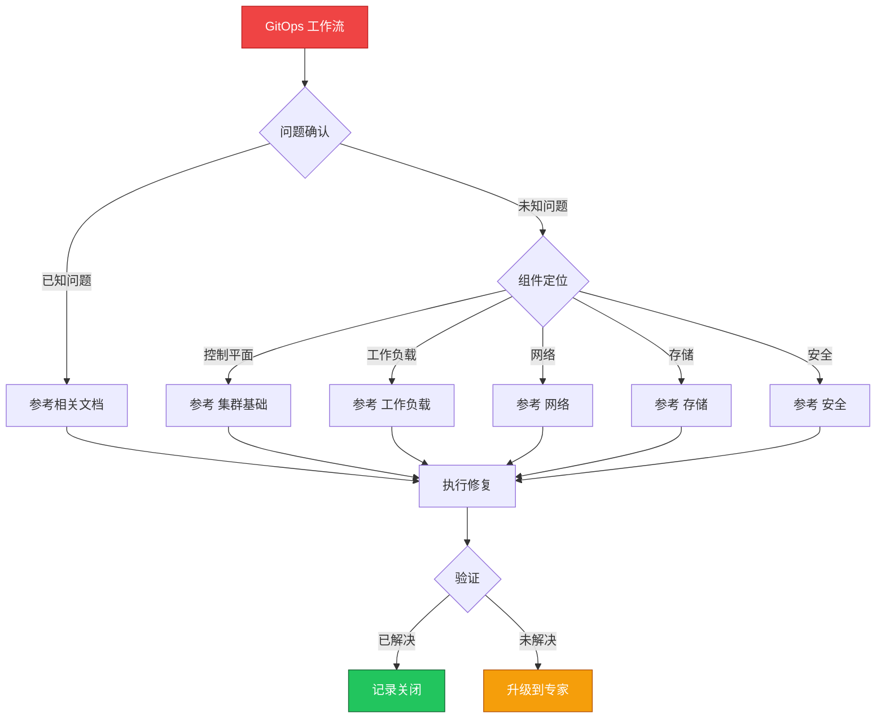

> **生产环境安全提示**
>
> 本文档包含可直接执行的运维命令。执行前请确认：当前目标集群与 Namespace 是否正确；是否具备足够的 RBAC 权限；是否已在非生产环境验证。命令风险等级标注：🔴 高风险（可能造成数据丢失或服务中断）、🟡 中风险（会修改集群状态，但通常可回滚）、🟢 低风险/只读（信息收集，无副作用）。

# 场景: GitOps 工作流

> **场景 ID**: SC-15
> **英文**: GitOps Workflow
> **最后更新**: 2026-05-20

---

## 场景概述

GitOps 是现代化的持续部署方式。

---

## 快速决策树

---

## 相关文档

- [[11-发布变更/README.md|README]]
- [[11-发布变更/README.md|README]]

---

## FTA 故障树

- [[19-故障诊断/06-FTA故障树/list/helm-fta.md|helm fta]]

---

## 操作技能

暂无专项技能卡片

---

## 关联场景

| 关联场景 | 说明 |
|---|---|

## Related

- [[23-实体/15-参考与索引/kudig-metadata-index.md|README]].md|README]]
- [[22-概念/09-平台与发布/infrastructure-as-code.md|infrastructure-as-code]]
- [[26-技能/01-集群运维/helm/helm-fta.md|helm-fta]]
- [[17-系统基础/05-速查卡/helm.md|[[Helm|helm]]]]
- [[17-系统基础/05-速查卡/gitops.md|gitops]]

<!-- risk-assessed -->
