> **生产环境安全提示**
>
> 本文档包含可直接执行的运维命令。执行前请确认：当前目标集群与 Namespace 是否正确；是否具备足够的 RBAC 权限；是否已在非生产环境验证。命令风险等级标注：🔴 高风险（可能造成数据丢失或服务中断）、🟡 中风险（会修改集群状态，但通常可回滚）、🟢 低风险/只读（信息收集，无副作用）。

# 备份/恢复异常故障树分析

## 1. 概述

### 覆盖范围

本技能覆盖 Kubernetes 集群备份恢复的全链路故障诊断：

- **A. etcd 快照异常**：创建失败、超时、不完整、数据过期
- **B. 应用级备份异常**：Velero 失败、资源遗漏、Volume 快照失败、Hook 错误
- **C. 存储后端异常**：不可达、凭据失效、空间不足、限流
- **D. 加密/校验异常**：密钥不可用、完整性校验失败、密钥轮换问题
- **E. 恢复流程异常**：顺序错误、资源冲突、API 版本不兼容、PV 绑定失败
- **F. 依赖/调度异常**：CronJob 调度失败、资源不足、RBAC 权限、网络策略

### 适用场景

| 适用 | 不适用 |
|------|--------|
| Velero Backup/Restore 失败 | etcd 性能调优（→ etcd-fta.md） |
| etcd 快照创建/恢复失败 | 存储后端内部故障（联系厂商） |
| 备份数据不一致/不完整 | 应用层数据一致性 |
| 恢复后集群状态异常 | 网络/存储基础设施故障 |

---

## 2. 症状识别

| 症状 ID | 症状描述 | 工单关键词 | 确认命令 |
|---------|---------|-----------|---------|
| S1 | Velero Backup 状态 Failed/PartiallyFailed | "备份失败"、"Velero 报错" | `velero backup get` |
| S2 | etcd 快照文件为空/异常小 | "备份为空"、"快照失败" | `ls -la /backup/etcd/` |
| S3 | 恢复后资源缺失/不一致 | "数据丢了"、"恢复不完整" | `kubectl get <resource> -A` 对比 |
| S4 | 备份 CronJob 未按计划执行 | "没有自动备份"、"定时任务没跑" | `kubectl get cronjob -n velero` |
| S5 | 恢复后 Pod 无法启动 | "恢复后 Pod 异常"、"PVC 绑定失败" | `kubectl get pods -A | grep -v Running` |
| S6 | 备份耗时异常长/超时 | "备份太慢"、"超时" | `velero backup describe <name>` |

---

## 3. 快速分级

| 严重性 | 定义 | 响应策略 |
|--------|------|---------|
| P0 | 数据丢失且无可用备份 | 联系存储厂商尝试底层恢复，全员上线 |
| P1 | 备份任务连续失败（无最新备份） | 15min 内修复，确保备份恢复 |
| P2 | 备份延迟偏高/部分资源遗漏 | 优化备份策略和范围 |
| P3 | 恢复演练/策略优化 | 计划维护窗口 |

---

## 4. 诊断工作流

### Phase 1：快速检查（< 2 分钟）

#### D1.1 检查 Velero 备份状态

```bash
# 🟢 低风险：只读/信息收集
velero backup get
velero backup describe <backup-name> --details
velero restore get
```

**判断逻辑**：
- Status=Failed → 查看 `velero backup logs <name>`
- Status=PartiallyFailed → 确认哪些资源失败
- Status=InProgress 超时 → 转 RC-B06

#### D1.2 检查 etcd 快照状态

```bash
# 🟢 低风险：只读/信息收集
ls -la /backup/etcd/ | tail -10
ETCDCTL_API=3 etcdctl snapshot status /backup/etcd/<latest>.db --write-out=table
```

#### D1.3 检查备份 CronJob

```bash
# 🟢 低风险：只读/信息收集
kubectl get cronjob -n velero
kubectl get jobs -n velero --sort-by='.status.startTime' | tail -5
```

### Phase 2：深度检查（< 10 分钟）

#### D2.1 Velero 日志分析

```bash
# 🟢 低风险：只读/信息收集
kubectl logs -n velero deploy/velero --tail=100 | grep -E "error|failed|timeout"
velero backup logs <backup-name>
```

#### D2.2 存储后端连通性

```bash
# 🟢 低风险：只读
# S3/OSS 连通性
aws s3 ls s3://<backup-bucket>/ --endpoint-url=<endpoint>
# 或
aliyun oss ls oss://<backup-bucket>/
```

#### D2.3 凭据有效性检查

```bash
# 🟢 低风险：只读
kubectl get secret -n velero cloud-credentials -o yaml
# 验证 AccessKey 是否过期
```

#### D2.4 恢复后资源检查

```bash
# 🟢 低风险：只读/信息收集
kubectl get ns | wc -l                    # namespace 数量对比
kubectl get pods -A | grep -v Running     # 异常 Pod
kubectl get pvc -A | grep -v Bound        # 未绑定 PVC
```

### Phase 3：主动探测（需审批）

#### D3.1 手动触发备份测试

```bash
# 🟡 中风险：消耗集群资源
velero backup create test-backup --include-namespaces=default --wait
```

#### D3.2 恢复冲突资源处理

```bash
# 🔴 高风险：可能覆盖现有资源
velero restore create --from-backup <backup-name> --existing-resource-policy=update
```

---

## 5. 根因分类

| 编号 | 根因 | 概率 | 关键证据 | FTA 映射 |
|------|------|------|----------|---------|
| RC-A1 | etcd 快照创建失败（磁盘满/过载） | 高 | 快照文件为空/etcdctl 报错 | TE→A→A1 |
| RC-A2 | etcd 快照超时（数据量过大） | 中 | 快照耗时 > 60s | TE→A→A2 |
| RC-A3 | 快照不完整（进程中断） | 低 | snapshot status 报错 | TE→A→A3 |
| RC-A4 | 快照数据过期（CronJob 异常 + 监控缺失） | 中 | 最近备份 > 24h | TE→A→A4 |
| RC-B1 | Velero Plugin 错误 | 中 | 日志 "plugin error" | TE→B→B1 |
| RC-B2 | 资源选择器遗漏关键资源 | 中 | 恢复后资源缺失 | TE→B→B2 |
| RC-B3 | Volume 快照失败（CSI Snapshot 错误） | 中 | VolumeSnapshot 状态异常 | TE→B→B3 |
| RC-B4 | Hook 执行失败 | 低 | backup logs 含 hook error | TE→B→B4 |
| RC-B5 | 备份数据不一致（有状态应用未 quiesce） | 中 | 恢复后数据损坏 | TE→B→B5 |
| RC-B6 | 备份超时（大规模集群） | 中 | Status=InProgress > 2h | TE→B→B6 |
| RC-C1 | 存储后端不可达 | 高 | 连接超时/DNS 解析失败 | TE→C→C1 |
| RC-C2 | 凭据失效（AccessKey 过期） | 高 | "AccessDenied" / "InvalidAccessKey" | TE→C→C2 |
| RC-C3 | 存储空间不足 | 中 | "BucketAlreadyFull" | TE→C→C3 |
| RC-C4 | 存储限流（API 请求过多） | 低 | "TooManyRequests" / 503 | TE→C→C4 |
| RC-D1 | 加密密钥不可用（KMS/Secret 缺失） | 中 | "key not found" | TE→D→D1 |
| RC-D2 | 数据完整性校验失败 | 低 | checksum 不匹配 | TE→D→D2 |
| RC-D3 | 密钥轮换后旧备份不可解密 | 低 | 解密失败 | TE→D→D3 |
| RC-E1 | 恢复顺序错误（CRD/Namespace 未先恢复） | 高 | 资源创建失败 "namespace not found" | TE→E→E1 |
| RC-E2 | 资源冲突（已存在同名资源） | 高 | "already exists" | TE→E→E2 |
| RC-E3 | API 版本不兼容 | 中 | "no matches for kind" | TE→E→E3 |
| RC-E4 | PV/PVC 绑定失败 | 中 | PVC Pending | TE→E→E4 |
| RC-E5 | 跨版本恢复失败 | 低 | 备份来自旧版本集群 | TE→E→E5 |
| RC-F1 | 备份 CronJob 调度异常 | 中 | 无最近 Job 记录 | TE→F→F1 |
| RC-F2 | 备份 Pod 资源不足（OOM） | 中 | Pod OOMKilled | TE→F→F2 |
| RC-F3 | RBAC 权限不足 | 中 | "forbidden" 日志 | TE→F→F3 |
| RC-F4 | 网络策略阻断备份 Pod | 低 | 连接超时 | TE→F→F4 |

---

## 6. 修复操作

| 编号 | 对应根因 | 修复操作 | 风险等级 |
|------|---------|---------|:--------:|
| REM-A1 | RC-A1 | 清理磁盘空间，在低峰期重试快照 | 🟢 |
| REM-A4 | RC-A4 | 修复 CronJob 调度，添加备份缺失告警 | 🟡 |
| REM-B1 | RC-B1 | 升级/重装 Velero Plugin | 🟡 |
| REM-B2 | RC-B2 | 修正备份 include/exclude 配置 | 🟡 |
| REM-B5 | RC-B5 | 使用 pre-backup Hook quiesce 数据库 | 🟡 |
| REM-B6 | RC-B6 | 增加超时时间，按 namespace 分批备份 | 🟡 |
| REM-C1 | RC-C1 | 修复网络/DNS，检查 Endpoint 配置 | 🟢 |
| REM-C2 | RC-C2 | 更新 Secret 中的 AccessKey/Secret | 🟡 |
| REM-C3 | RC-C3 | 清理过期备份或扩容存储桶 | 🟡 |
| REM-D1 | RC-D1 | 恢复/重建 KMS 密钥（🔴 若密钥永久丢失则数据不可恢复） | 🔴 |
| REM-E1 | RC-E1 | 按正确顺序恢复：Namespace → CRD → 资源 | 🟡 |
| REM-E2 | RC-E2 | 使用 `--existing-resource-policy=update` 或先删除冲突资源 | 🔴 |
| REM-E3 | RC-E3 | 转换备份中资源 API 版本后重新恢复 | 🟡 |
| REM-F1 | RC-F1 | 检查 CronJob schedule 和节点调度 | 🟡 |
| REM-F2 | RC-F2 | 增加备份 Pod 资源限制 | 🟡 |
| REM-F3 | RC-F3 | 修正 Velero ServiceAccount RBAC | 🟡 |

---

## 7. 验证确认

### 备份验证

```bash
# 🟢 低风险
velero backup get | grep Completed     # 状态正常
velero backup describe <name> --details  # 资源数量合理
```

### 恢复验证

| 条件 | 判定 |
|------|------|
| Velero Restore 状态 Completed | ✅ |
| 关键 Namespace/资源存在 | ✅ |
| Pod 正常 Running | ✅ |
| PVC 全部 Bound | ✅ |
| 有状态应用数据完整 | ✅ |

---

## 8. 升级协议

| 级别 | 条件 | 动作 |
|------|------|------|
| P0 | 数据丢失且无可用备份 | 联系存储厂商，全员上线 |
| P1 | 备份连续失败 > 24h | 紧急修复，确保备份恢复 |
| P2 | 备份延迟/部分遗漏 | 优化策略 |

---

## 9. 版本兼容矩阵

| 组件 | 版本注意事项 |
|------|------------|
| Velero 1.10+ | 支持 CSI Snapshot；K8s 1.20+ |
| Velero 1.12+ | 支持 `--existing-resource-policy`；K8s 1.22+ |
| Velero 1.14+ | 改进大规模集群性能；K8s 1.25+ |
| etcd 快照 | 必须同版本恢复（→ backup-restore-etcd.md） |
| K8s API | 跨 2 个以上大版本恢复可能有 API 不兼容 |

---

## 10. 知识进化

### 常见误诊模式

| 误诊模式 | 表现 | 正确做法 |
|---------|------|---------|
| 将 WaitForFirstConsumer PVC 误判为恢复失败 | 恢复后 PVC Pending | 确认 Pod 调度后 PVC 自动绑定 |
| 将备份范围配置问题误判为 Velero Bug | 部分资源未备份 | 检查 include/exclude 配置 |
| 忽略加密密钥备份 | 集群灾难后无法解密备份 | 密钥必须离线备份（D4 AND 门） |

### 变更记录

| 版本 | 日期 | 变更内容 | 触发原因 |
|------|------|---------|---------|
| 1.0.0 | 2026-05-23 | 初版 FTA 故障树 | 技能库初始化 |
| 2.0.0 | 2026-07-23 | 重构为标准结构，补全根因/修复/验证/诊断命令 | 技能建设最佳实践对标 |

---

## 生产级观测与证据

### 关键事件/状态

| 类别 | 关键信号 |
|------|---------|
| **Velero 资源状态** | `Backup`/`Restore` 资源：Completed / PartiallyFailed / Failed / InProgress |
| **etcd 快照** | 定时任务执行状态、快照文件大小、revision |
| **VolumeSnapshot** | `ReadyToUse` 状态、CSI Snapshot 事件 |
| **CronJob** | 最近执行时间、成功/失败计数 |

### 关键指标

| 指标 | 用途 |
|------|------|
| `velero_backup_attempt_total` | 备份尝试次数 |
| `velero_backup_failure_total` | 备份失败次数 |
| `velero_backup_duration_seconds` | 备份耗时 |
| `velero_restore_attempt_total` | 恢复尝试次数 |
| `velero_volume_snapshot_attempt_total` | 卷快照尝试次数 |

### 关键日志来源

| 组件 | 日志获取方式 |
|------|------------|
| Velero Server | `kubectl logs -n velero deploy/velero` |
| Velero Plugin | `kubectl logs -n velero deploy/velero -c <plugin>` |
| 备份/恢复详情 | `velero backup logs <name>` / `velero restore logs <name>` |
| CronJob | `kubectl describe cronjob -n velero <name>` |

---

## Mermaid FTA 树

```mermaid
flowchart TD
  TE["顶事件: 备份/恢复异常"]
  OR0{{OR}}
  TE --> OR0

  OR0 --> CAT_SNAP["A. etcd 快照异常"]
  OR0 --> CAT_APP["B. 应用级备份异常"]
  OR0 --> CAT_STORE["C. 存储后端异常"]
  OR0 --> CAT_CRYPTO["D. 加密/校验异常"]
  OR0 --> CAT_RESTORE["E. 恢复流程异常"]
  OR0 --> CAT_DEP["F. 依赖/调度异常"]

  A_OR{{OR}}
  CAT_SNAP --> A_OR
  A_OR --> A1["A1. 快照创建失败"]
  A_OR --> A2["A2. 快照超时"]
  A_OR --> A3["A3. 快照不完整"]
  A_OR --> A4["A4. 快照数据过期"]

  B_OR{{OR}}
  CAT_APP --> B_OR
  B_OR --> B1["B1. Velero Plugin 错误"]
  B_OR --> B2["B2. 资源选择器遗漏"]
  B_OR --> B3["B3. Volume 快照失败"]
  B_OR --> B4["B4. Hook 执行失败"]
  B_OR --> B5["B5. 备份数据不一致"]
  B_OR --> B6["B6. 备份超时"]

  C_OR{{OR}}
  CAT_STORE --> C_OR
  C_OR --> C1["C1. 存储不可达"]
  C_OR --> C2["C2. 凭据失效"]
  C_OR --> C3["C3. 存储空间不足"]
  C_OR --> C4["C4. 存储限流"]

  D_OR{{OR}}
  CAT_CRYPTO --> D_OR
  D_OR --> D1["D1. 加密密钥不可用"]
  D_OR --> D2["D2. 完整性校验失败"]
  D_OR --> D3["D3. 密钥轮换后旧备份不可解密"]
  D_OR --> D4["D4. 加密恢复死锁(AND)"]

  E_OR{{OR}}
  CAT_RESTORE --> E_OR
  E_OR --> E1["E1. 恢复顺序错误"]
  E_OR --> E2["E2. 资源冲突"]
  E_OR --> E3["E3. API 版本不兼容"]
  E_OR --> E4["E4. PV/PVC 绑定失败"]
  E_OR --> E5["E5. 跨版本恢复失败"]

  F_OR{{OR}}
  CAT_DEP --> F_OR
  F_OR --> F1["F1. CronJob 调度异常"]
  F_OR --> F2["F2. 备份 Pod 资源不足"]
  F_OR --> F3["F3. RBAC 权限不足"]
  F_OR --> F4["F4. 网络策略阻断"]
```



---

## 生产案例

### 案例 1: etcd 备份恢复失败——版本不匹配

| 时间 | 事件 |
|------|------|
| 03:00 | 误删 namespace，尝试从 etcd 快照恢复 |
| 03:05 | `etcdctl snapshot restore` 报错: "database version mismatch" |
| 03:10 | 确认备份时 etcd 3.5.9，当前 etcd 3.5.12 |
| 03:15 | 🔴 使用相同版本 etcd 二进制执行恢复 |
| 03:30 | 集群恢复，但丢失备份后的 2h 数据 |

**根因**: RC-E5。备份脚本未记录 etcd 版本，恢复时使用了不同版本。

### 案例 2: Velero 备份超时——大规模集群资源过多

**现象**: Velero Backup 状态长时间 InProgress，最终 Failed。

**诊断**: `velero backup describe` 显示超时，集群 50000+ 资源

**修复**: 🟡 REM-B6 增加 `--default-volumes-to-fs-backup-timeout`，按 namespace 分批备份

### 案例 3: 加密密钥存储在集群内导致恢复死锁

**现象**: 集群灾难后需要从加密备份恢复，但解密密钥存储在集群内的 Secret 中

**诊断**: 触发 AND 门 D4（密钥在集群内 + 集群不可用）

**修复**: 🔴 REM-D1 从离线密钥备份恢复（若无离线备份则数据不可恢复）

---

## 相关链接

- [[26-技能/04-工作负载/pod/方法论/FTA Methodology and Core Principles.md|FTA 方法论]] — 方法论基础
- [[26-技能/04-工作负载/pod/方法论/FTA Diagnostic Execution Engine.md|FTA 诊断执行引擎]] — 执行引擎
- [[26-技能/02-控制面/etcd/backup-restore-etcd.md|etcd 备份恢复操作]] — 同域技能
- [[26-技能/02-控制面/etcd/etcd-fta.md|etcd 异常诊断]] — 同域技能
- [[26-技能/06-存储/csi-storage/csi-fta.md|CSI 存储异常诊断]] — 跨域关联
- [[21-生态参考/03-领域索引/backup-dr-index.md|Backup & DR 知识图谱索引]] — 知识索引

<!-- risk-assessed -->
