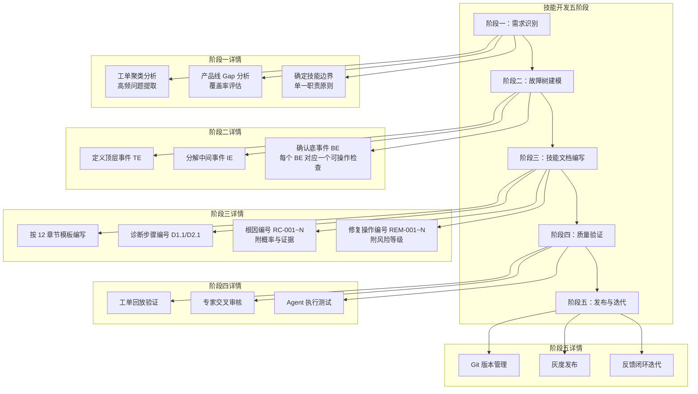
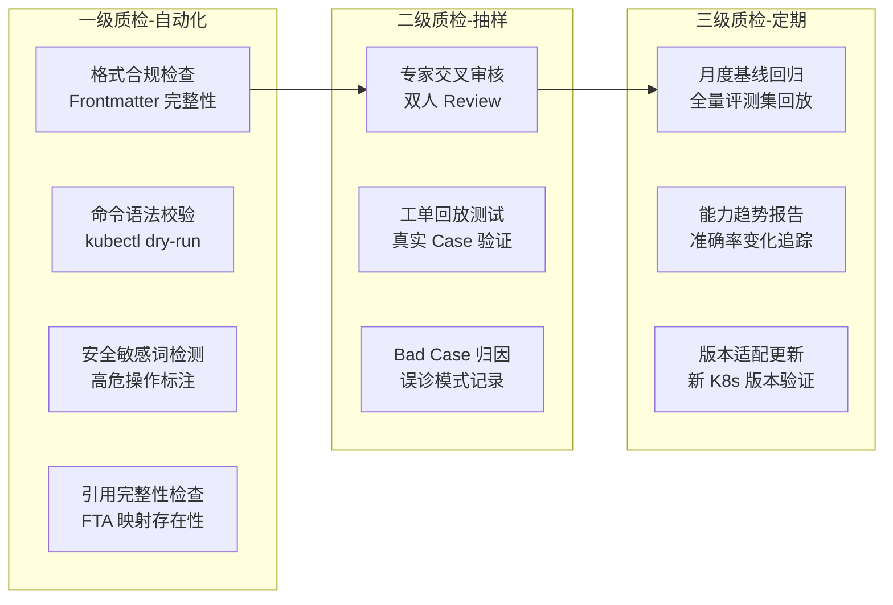
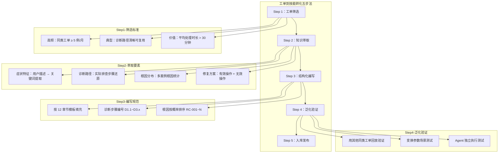

> **生产环境安全提示**
>
> 本文档包含可直接执行的运维命令。执行前请确认：当前目标集群与 Namespace 是否正确；是否具备足够的 RBAC 权限；是否已在非生产环境验证。命令风险等级标注：🔴 高风险（可能造成数据丢失或服务中断）、🟡 中风险（会修改集群状态，但通常可回滚）、🟢 低风险/只读（信息收集，无副作用）。

# 技能建设最佳实践

> **核心理念**：Skill，就像 AI 的药品说明书 — 说明书让药被正确使用，Skill 让 AI 被可靠调用。

---

## 1. 技能文档的本质：AI 的"药品说明书"

技能文档是连接**人类运维经验**与 **AI Agent 执行能力**的桥梁。正如药品说明书确保药物被正确使用，Skill 文档确保 AI Agent 被可靠调用：

| 药品说明书 | Skill 技能文档 | 说明 |
|:---:|:---:|:---|
| **适应症** | **适用任务** | 该 Skill 用于完成特定的信息处理、分析、生成或决策类任务 |
| **用法用量** | **执行步骤** | ① 解析用户需求 → ② 收集与整理信息 → ③ 分析与处理 → ④ 生成输出并校验 |
| **禁忌症** | **禁止事项** | 不得生成违规内容；不得泄露敏感信息；不得执行越权操作 |
| **注意事项** | **边界与风险** | 仅基于提供的信息和工具；存在信息不完整、推理错误或工具失败的风险 |
| **不良反应** | **常见失败** | 信息不足导致无法完成；工具调用失败；输出不符合要求；格式错误 |
| **药效** | **预期输出** | 结构化、清晰、可用的结果，满足任务目标和质量要求 |

**设计原则**：一份优秀的 Skill 文档必须让 AI Agent 读完后明确知道——**什么时候用我、怎么用我、什么不能做、做错了怎么办、做对了输出什么**。

---

## 2. 技能文档标准结构与模板规范

### 2.1 目录组织规范

技能统一存放于根目录 `技能/` 文件夹下，按功能域划分子目录：

```
技能/
├── pod/                          # 按组件域划分的技能集
│   ├── README.md                 # 技能集入口（MOC 导航）
│   ├── 01-pod-crashloop-oomkilled.md
│   ├── 02-pod-pending-scheduling.md
│   ├── 03-pod-imagepull-container.md
│   ├── 04-pod-sop-runbook.md
│   └── reference/                # 参考资料子目录
│       ├── pod-exit-codes.md
│       └── pod-version-differences.md
├── node/                         # 节点域技能集
├── skill-k8s-node-notready-SKILL.md  # 独立技能文件
├── *-fta.md                      # FTA 故障树文件
└── 技能建设最佳实践/              # 本目录：方法论与规范
```

### 2.2 命名规范

| 元素 | 格式 | 示例 |
|------|------|------|
| 文件名 | `{NN}-{kebab-case-scenario}.md` | `01-node-notready.md` |
| Skill ID | `SKILL-{CATEGORY}-{SEQ}` | `SKILL-NODE-001`、`SKILL-POD-003` |
| 根因 ID | `RC-{SEQ}` | `RC-001` |
| 修复操作 ID | `REM-{SEQ}` | `REM-001` |
| 诊断步骤 ID | `D{Phase}.{Seq}` | `D1.1`、`D2.3` |
| 症状 ID | `S{Seq}` | `S1`、`S2` |
| 版本标记 | `**[vX.XX+]**` | `**[v1.30+]**` |

### 2.3 Frontmatter 元数据标准

所有技能文档**必须**包含完整 YAML Frontmatter：

```yaml
---
title: Pod 异常诊断技能集                    # 必填：技能标题
description: 覆盖场景的完整描述               # 必填：一句话说明覆盖范围
summary: 简短摘要（用于检索展示）             # 必填
category: skill                             # 必填：固定为 skill
tags:                                       # 必填：3-10 个标签
- k8s
- pod
- troubleshooting
- fta
sources:                                    # 推荐：知识来源追溯
- 故障诊断/topic-skills/02-pod-crashloop-oomkilled.md
created: '2026-07-23'                       # 必填：创建日期
updated: '2026-07-23'                       # 必填：最后更新日期
lifecycle: active                           # 必填：active / deprecated / draft
tier: core                                  # 必填：core / supporting / peripheral
difficulty: intermediate                    # 必填：beginner / intermediate / advanced
audience:                                   # 必填：目标受众
- SRE
- 运维工程师
- 技术支持
estimated_read_time: 25min                  # 必填：预计阅读时间
intent_queries:                             # 必填：意图查询（供 RAG 检索）
- Pod 异常诊断技能有哪些
- CrashLoopBackOff 怎么排查
trigger_keywords:                           # 必填：触发关键词（供意图分类）
- Pod
- CrashLoopBackOff
- OOMKilled
prerequisites:                              # 推荐：前置知识依赖
- kubectl-basics
- pod-lifecycle
---
```

### 2.4 Skill 文档 12 章节标准结构

每份完整的诊断类技能文档包含以下 **12 个标准章节**：

| # | 章节 | 内容要求 | 药品说明书类比 |
|---|------|---------|:---:|
| 1 | **概述** | 覆盖范围、典型场景、前置条件 | 适应症 |
| 2 | **症状识别** | 症状模式表、工单关键词映射、排除标准 | 适应症 |
| 3 | **快速分级** | 影响评估、严重性分级（P0-P3）、升级触发条件 | 注意事项 |
| 4 | **诊断工作流** | Phase 1 快速检查 → Phase 2 深度检查 → Phase 3 主动探测 | 用法用量 |
| 5 | **根因分类** | 至少 8 个根因，带概率、诊断证据、FTA 映射 | 不良反应 |
| 6 | **修复操作** | 四级风险：低（自动）、中（审批）、高（指导）、严重（高级审批） | 用法用量 |
| 7 | **验证确认** | 即时验证、短期监控、解决标准、回归检测 | 药效 |
| 8 | **升级协议** | 自动升级条件、消息模板、交接信息包 | 注意事项 |
| 9 | **版本兼容矩阵** | K8s 各版本功能/命令/API 差异 | 注意事项 |
| 10 | **知识进化** | 常见误诊模式、深度知识引用、改进记录 | 不良反应 |
| 11 | **云厂商特异性**（可选） | ACK/EKS/GKE/AKS 差异 | — |
| 12 | **自动化集成接口**（可选） | 脚本入口、Webhook 回调、输出规范 | — |

### 2.4.1 症状识别章节编写规范（错误消息与事件强制纳入）

症状识别（第 2 章）是技能的**检索入口与诊断路由器**。表格中**必须包含典型错误消息原文与系统事件名**，禁止只写抽象描述（如"Pod 异常"）而不给出可 grep 的精确文本。

**每个症状条目必须包含四要素**：

| 要素 | 要求 | 反例 → 正例 |
|------|------|------------|
| **症状描述** | 精确的错误消息文本或事件 Reason 名 | "镜像有问题" → `ImagePullBackOff` / `Failed to pull image ... not found` |
| **检测方法** | 观察到该错误/事件的具体命令或数据源 | "看日志" → `kubectl describe pod` Events 段 / `kubectl get events --field-selector reason=Failed` |
| **置信度** | 该症状指示特定根因的可靠性（0-1 数值） | 缺失 → `0.85` |
| **排除条件** | 何种情况下不应匹配此症状（防误诊） | 缺失 → "节点整体 NotReady 时优先排查节点而非镜像" |

**错误消息与事件覆盖清单**（按技能所属域至少覆盖对应行，跨域症状须给出转诊链接）：

| 层级 | 必须纳入的典型错误/事件（示例） | 引导路径 |
|------|------------------------------|---------|
| **Pod 级事件** | `CrashLoopBackOff`、`ImagePullBackOff`/`ErrImagePull`、`Pending`/`FailedScheduling`、`OOMKilled`、`CreateContainerConfigError`、`Evicted` | Pod 技能集 |
| **节点级事件** | `NodeNotReady`、`DiskPressure`、`MemoryPressure`、`PIDPressure`、`NodeHasInsufficientMemory`、`KubeletNotReady` | Node 技能集 |
| **网络类错误** | `connection refused`/`connection timed out`、`no route to host`、CoreDNS `SERVFAIL`/`NXDOMAIN`、`FailedCreatePodSandBox`（CNI）、Service `no endpoints available` | 网络技能集 |
| **存储类错误** | `FailedMount`/`MountVolume.SetUp failed`、`FailedAttachVolume`、`Multi-Attach error`、PVC `Pending`（`waiting for first consumer` / 无匹配 StorageClass）、`timed out waiting for the condition` | 存储技能集 |
| **安全类错误** | `x509: certificate has expired`、`Unauthorized`(401)/`Forbidden`(403 RBAC)、`admission webhook ... denied the request`、`violates PodSecurity`、`OPA/Gatekeeper deny` | 安全/集群技能集 |

**诊断路由要求**：每个症状必须能引导到明确的下一步——本技能内的诊断分支（`→ D{x}.{y}` / `→ RC-XXX`），或跨技能转诊链接（`→ [[对应技能]]`）。不能路由的症状条目视为无效条目。

### 2.5 技能集 README（MOC 入口）规范

技能集入口 README.md 必须包含：

1. **完整 Frontmatter**（含 intent_queries 和 trigger_keywords）
2. **概述** — 技能集覆盖范围与适用场景
3. **技能文件索引表** — 编号、文件链接、覆盖场景、难度、预计阅读时间
4. **快速诊断入口** — 3-5 条 🟢 低风险的首选排查命令
5. **状态速查表** — 症状→常见原因→优先检查项→对应技能 的映射
6. **FTA 故障树路径映射** — 顶层事件→中间事件→底事件→对应技能
7. **版本兼容性矩阵** — 各技能适用版本范围与版本敏感点
8. **相关链接** — FTA 方法论、诊断引擎、相关技能集

### 2.6 可观测性与诊断证据规范

生产级技能的每个诊断结论**必须可溯源到客观证据**，禁止基于经验的无证据推断。技能文档需为每个根因声明"证据三元组"：

| 证据维度 | 采集来源 | 技能中的声明格式 |
|---------|---------|----------------|
| **Metrics（指标）** | Prometheus / Metrics Server / cAdvisor | PromQL 查询语句 + 阈值判据 |
| **Logs（日志）** | kubectl logs / journalctl / 审计日志 | grep 关键字模式 + 期望/异常样本 |
| **Traces / Events（事件链）** | kubectl get events / OpenTelemetry | 事件 Reason + involvedObject + 时间窗 |

**证据链完整性要求**：

```
每个根因 RC-XXX 必须满足：
├── 至少 1 条 Metrics 证据（可量化的阈值判断）
├── 至少 1 条 Logs 或 Events 证据（可定位的文本模式）
└── 证据时间窗对齐（故障发生时刻 ±5 分钟内的数据）
```

**关键指标引用示例**（技能内应直接给出可执行 PromQL）：

```promql
# 🟢 节点内存压力判据（对应 RC MemoryPressure）
(1 - node_memory_MemAvailable_bytes / node_memory_MemTotal_bytes) > 0.90

# 🟢 容器重启频率判据（对应 RC CrashLoopBackOff）
rate(kube_pod_container_status_restarts_total[15m]) > 0
```

---

## 3. 技能开发流程与方法论

### 3.1 FTA 驱动的技能开发流程

技能开发以 **FTA（故障树分析）** 为核心方法论，遵循"自顶向下分解、自底向上验证"的原则：



### 3.2 结构化排查方法论（配置优先）

技能中的诊断工作流必须遵循**配置优先排查原则**——80% 以上的生产故障源于配置变更：

```
诊断优先级排序：
│
├── Phase 1：快速检查（< 2 分钟）
│   ├── D1.1 确认症状：kubectl get/describe 获取状态与事件
│   ├── D1.2 检查最近变更：配置变更记录、发布历史
│   └── D1.3 影响面评估：受影响 Pod/Node/Service 数量
│
├── Phase 2：深度检查（< 10 分钟）
│   ├── D2.1 日志分析：kubectl logs --previous / journalctl
│   ├── D2.2 资源检查：CPU/Memory/Disk/Network 指标
│   └── D2.3 依赖验证：DNS/Service/存储/外部依赖连通性
│
└── Phase 3：主动探测（需审批）
    ├── D3.1 临时调试 Pod：kubectl run --rm -it
    ├── D3.2 节点级排查：crictl / systemctl / 内核日志
    └── D3.3 网络抓包：tcpdump / kubeskoop 诊断
```

### 3.3 技能开发 Checklist

开发新技能时，按以下清单逐项确认：

- [ ] **边界清晰**：一个技能只解决一类问题（单一职责）
- [ ] **症状映射**：工单关键词 → 技能触发条件明确
- [ ] **FTA 对齐**：每个根因可映射到故障树底事件
- [ ] **命令可执行**：所有 kubectl/shell 命令经过实际验证
- [ ] **风险标注**：每条命令标注 🔴🟡🟢 风险等级
- [ ] **根因充分**：至少覆盖 8 个根因，含概率评估
- [ ] **修复闭环**：每个根因有对应修复操作 + 验证方法
- [ ] **版本适配**：标注命令/特性的 K8s 版本兼容范围
- [ ] **输出规范**：定义结构化输出格式（现象→根因→修复→验证→预防）
- [ ] **元数据完整**：Frontmatter 所有必填字段完整

### 3.4 混沌工程验证技能有效性

技能不能只在"纸面正确"，必须通过**主动故障注入**验证其诊断路径真实有效。这是生产级技能与普通文档的核心分水岭。

| 故障注入场景 | 注入方法（测试环境） | 技能应命中的根因 | 验证标准 |
|-------------|-------------------|----------------|---------|
| Pod OOMKilled | 部署内存压测容器超限 `limits.memory` | RC OOMKilled / Exit 137 | 技能 Phase 1 即定位 |
| Node DiskPressure | `fallocate` 填满 `/var/lib/kubelet` | RC DiskPressure / 镜像 GC | 命中驱逐阈值判据 |
| kubelet 崩溃 | `systemctl stop kubelet` | RC kubelet 异常 | Lease 续租超时命中 |
| 网络分区 | iptables DROP apiserver 端口 | RC 网络分区 | NotReady + Lease 判据 |
| 镜像拉取失败 | 引用不存在的 tag/私有仓库 | RC ImagePullBackOff | Events 模式命中 |

**混沌验证准入门槛**：技能评级 ⭐⭐⭐⭐ 及以上，必须提供 ≥ 3 个故障注入场景的验证记录（含注入脚本、Agent 诊断输出、命中截图）。

> ⚠️ 混沌注入仅允许在**专用测试集群**执行，严禁在生产环境验证技能。注入脚本必须包含自动回滚与超时熔断。

---

## 4. 技能质量评估标准与审核流程

### 4.1 质量评估维度

| 维度 | 评估标准 | 量化指标 | 权重 |
|------|---------|---------|------|
| **准确性** | 诊断结论技术正确，命令输出解读无误 | 工单回放诊断准确率 ≥ 85% | 30% |
| **完整性** | 根因覆盖全面，步骤无遗漏 | 根因覆盖率 ≥ 90%（对照 FTA） | 20% |
| **可操作性** | 命令可直接执行，步骤无歧义 | Agent 一次执行成功率 ≥ 80% | 20% |
| **安全性** | 高危操作有明确警告与审批要求 | 安全审查通过率 100%（一票否决） | 15% |
| **时效性** | 版本兼容矩阵准确，内容不过时 | 季度更新率 100% | 15% |

### 4.2 三级质检机制



### 4.3 审核流程

| 阶段 | 责任人 | 动作 | 通过标准 | 时限 |
|------|--------|------|---------|------|
| 自检 | 技能作者 | 按 Checklist 逐项确认 | 全部通过 | 提交前 |
| 格式审核 | 语料工程师 | 自动化 Lint + 元数据校验 | 0 Error | 1 工作日 |
| 技术审核 | 产品线 SME | 技术正确性 + 命令验证 | 双人签字 | 3 工作日 |
| Agent 测试 | Skills 工程师 | Agent 加载技能执行测试工单 | 准确率 ≥ 85% | 2 工作日 |
| 发布审批 | 项目 Owner | 综合评估，批准上线 | 无安全否决项 | 1 工作日 |

### 4.4 技能评级标准

| 等级 | 标准 | 适用场景 |
|------|------|---------|
| ⭐⭐⭐⭐⭐ | 工单验证 ≥ 20 例，准确率 ≥ 95%，含版本矩阵与云厂商差异 | Agent 全自动执行 |
| ⭐⭐⭐⭐ | 工单验证 ≥ 10 例，准确率 ≥ 90%，含版本矩阵 | Agent 执行 + 人工确认 |
| ⭐⭐⭐ | 工单验证 ≥ 5 例，准确率 ≥ 85% | Agent 辅助 + 人工主导 |
| ⭐⭐ | 专家评审通过，未经充分工单验证 | 仅供参考 |
| ⭐ | 初稿，待审核 | 草稿状态 |

### 4.5 CI/CD 自动化质检流水线

一级质检必须**代码化、门禁化**，纳入 Git 提交流水线。技能库仓库应配置如下自动化检查（示例为 GitHub Actions）：

```yaml
# .github/workflows/skill-quality.yml（技能质检门禁）
name: skill-quality-gate
on: [pull_request]
jobs:
  lint:
    runs-on: ubuntu-latest
    steps:
      - uses: actions/checkout@v4
      # 1. Frontmatter 必填字段校验
      - name: frontmatter-check
        run: python 脚本/check_frontmatter.py 技能/
      # 2. 风险等级标注覆盖率（每条 kubectl/shell 命令须带 🔴🟡🟢）
      - name: risk-annotation-check
        run: python 脚本/check_risk_annotation.py 技能/
      # 3. 内部链接可达性（Wiki Link / 相对路径）
      - name: link-integrity
        run: python 脚本/check_links.py 技能/
      # 4. 高危命令敏感词扫描（rm -rf / delete --all / drop 等需显式审批标注）
      - name: dangerous-command-scan
        run: python 脚本/scan_dangerous.py 技能/
```

**门禁判定**：任一检查 Error 阻断合并；风险标注覆盖率 < 100% 阻断合并；高危命令未标注审批要求为一票否决项。

---

## 5. 工单处理场景的技能设计原则

### 5.1 工单类型与技能分类映射

| 工单类型 | 技能类别 | 设计重点 | 示例 |
|---------|---------|---------|------|
| **咨询类** | 知识检索型 | 准确引用、口径统一、边界拒答 | "如何配置 HPA？" |
| **故障类** | 诊断排查型 | FTA 驱动、分阶段排查、根因定位 | "Pod CrashLoopBackOff" |
| **操作类** | 变更执行型 | 风险评估、审批流程、回滚方案 | "扩容节点池" |
| **分析类** | 深度分析型 | 数据驱动、趋势判断、优化建议 | "集群成本优化分析" |

### 5.2 工单场景技能设计六原则

**原则一：症状驱动入口**

技能必须以用户可观察的**症状**为入口，而非以内部原因为入口：

```
✅ 正确：技能入口 = "Pod 处于 CrashLoopBackOff 状态"（用户可见症状）
❌ 错误：技能入口 = "容器退出码 137 的处理"（内部原因，用户无法直接感知）
```

**原则二：窄口径边界**

- 每个技能明确声明**适用场景**和**不适用场景**
- 超出能力范围时主动拒答并引导升级
- 宁可说"不确定，建议升级专家"，也不给错误建议

**原则三：强参考引用**

- 所有诊断结论必须基于实际采集的数据证据
- 修复建议必须引用知识库条目 ID（4K 语料关联）
- 禁止无根据的"自由发挥"式回答

**原则四：分级响应**

| 严重性 | 定义 | 技能响应策略 |
|--------|------|------------|
| P0 | 生产服务完全不可用 | 立即升级 + 止血优先 + 战备群拉起 |
| P1 | 核心功能受损，有降级 | 15 分钟内响应，诊断 + 修复并行 |
| P2 | 非核心功能异常 | 标准诊断流程，4 小时内解决 |
| P3 | 咨询/优化类 | 知识检索 + 标准答复 |

**原则五：闭环验证**

每个修复操作必须附带验证方法：
1. **即时验证**：修复后 1 分钟内可确认的检查命令
2. **短期监控**：15-30 分钟观察期的关键指标
3. **解决标准**：明确定义"问题已解决"的量化条件
4. **回归检测**：防止问题复发的监控建议

**原则六：人机协同分级**

| 自动化等级 | 定义 | 适用条件 |
|-----------|------|---------|
| L1 全自动 | Agent 独立完成诊断 + 修复 | 🟢 低风险操作，置信度 ≥ 0.9 |
| L2 人确认 | Agent 诊断，人工确认后执行 | 🟡 中风险操作，置信度 ≥ 0.8 |
| L3 人主导 | Agent 提供建议，人工决策执行 | 🔴 高风险操作 |
| L4 纯人工 | Agent 仅提供信息收集 | 置信度 < 0.8，超范围场景 |

### 5.3 技术咨询类技能设计规范

```markdown
## 咨询类技能模板骨架

### 适用任务
明确本技能覆盖的咨询范围（白名单制）

### 知识来源
- 4K 语料条目 ID 列表
- 官方文档链接
- 内部最佳实践引用

### 标准答复结构
1. 直接回答（结论先行）
2. 操作步骤（可直接执行）
3. 注意事项（风险与限制）
4. 参考文档（强引用）

### 禁止事项
- 不回答超出白名单范围的问题
- 不做未经验证的性能承诺
- 不提供涉及数据安全的操作指导（需升级）

### 边界与风险
- 信息可能滞后于产品最新版本
- 特殊环境配置可能导致步骤差异

### 预期输出
结构化、可直接执行的操作指导，附知识来源引用
```

### 5.4 问题排查类技能设计规范

```markdown
## 排查类技能模板骨架

### 适用任务
症状描述 + 触发关键词 + 排除标准

### 执行步骤（诊断工作流）
Phase 1 快速检查 → Phase 2 深度检查 → Phase 3 主动探测
每步附：命令、预期输出、判断逻辑

### 禁止事项
- 未收集证据不得下结论
- 🔴 高危操作未经审批不得执行
- 不得跳过验证步骤宣布修复

### 边界与风险
- 跨组件问题可能超出单技能范围
- 部分检查需要节点级权限

### 常见失败
- 日志已轮转导致证据缺失 → 应对：检查日志保留策略
- 间歇性故障无法复现 → 应对：部署持续监控后观察

### 预期输出
现象 → 根因（含证据链）→ 修复方案 → 验证方法 → 预防建议
```

### 5.5 SLO / 错误预算驱动的响应分级

生产级技能应将响应优先级与服务的 **SLO / 错误预算燃烧率**挂钩，而非仅凭主观严重性分级：

| 错误预算燃烧速率 | 含义 | 映射严重性 | 技能响应策略 |
|----------------|------|-----------|------------|
| ≥ 14.4x（1h 窗） | 2% 预算/小时耗尽 | P0 | 立即升级 + 止血优先 |
| ≥ 6x（6h 窗） | 快速燃烧 | P1 | 15 分钟内响应，诊断+修复并行 |
| ≥ 3x（1d 窗） | 中速燃烧 | P2 | 标准诊断流程 |
| < 1x | 预算充足 | P3 | 知识检索 + 已知问题库 |

**关键原则**：技能的升级触发条件应引用服务 SLI 阈值（如可用性 < 99.9%、P99 延迟 > 500ms），而非模糊的"严重/一般"描述，使 Agent 可基于量化指标自动定级。

---

## 6. 技能分类标准与粒度划分

### 6.1 技能四大类别

| 类别 | 定义 | 典型技能 | 工单占比 |
|------|------|---------|---------|
| **诊断类** | 故障定位与根因分析 | 日志分析、指标异常检测、故障树推理 | ~45% |
| **操作类** | 变更执行与恢复操作 | 配置变更、扩缩容、重启恢复、备份回滚 | ~25% |
| **分析类** | 深度分析与优化建议 | 容量规划、性能分析、成本优化 | ~15% |
| **预防类** | 风险识别与主动巡检 | 巡检、风险评估、合规检查、变更影响评估 | ~15% |

### 6.2 粒度划分原则

**单一职责原则**：一个技能只解决一个明确的问题域。

```
粒度判断决策树：
│
├── 问题：一个技能文档是否超过 500 行？
│   ├── 是 → 考虑拆分
│   └── 否 → 继续判断
│
├── 问题：是否覆盖多个独立的症状入口？
│   ├── 是 → 按症状域拆分为多个技能
│   └── 否 → 继续判断
│
├── 问题：诊断流程是否有完全独立的分支？
│   ├── 是 → 各分支可独立为子技能
│   └── 否 → 保持为单一技能
│
└── 参考标准
    ├── 单个技能文件：200-500 行为宜
    ├── 根因数量：8-15 个为宜
    └── 诊断步骤：Phase 总数 ≤ 3，每 Phase 步骤 ≤ 5
```

**领域拆分参考**（以容器产品线为例）：

| 技能域 | 覆盖范围 | 技能数参考 |
|--------|---------|-----------|
| Pod 生命周期 | CrashLoop/Pending/OOM/ImagePull/Evicted | 4-6 |
| Node 状态 | NotReady/资源压力/网络不可用 | 3-5 |
| Service/Ingress | 连通性/DNS/Ingress/Gateway API | 4-6 |
| 存储 PV/PVC | 挂载失败/容量不足/性能问题 | 3-4 |
| 控制面 | APIServer/etcd/Scheduler | 4-6 |
| 网络 CNI | Pod 通信/NetworkPolicy/跨节点 | 3-5 |

### 6.3 技能间关联与引用机制

**纵向关联**（FTA 层级映射）：

```
顶层事件 TE-2 应用服务不可用
└── 中间事件 IE-2.1 Pod 运行异常
    ├── 底事件 BE-2.1 CrashLoopBackOff → 技能/pod/01-pod-crashloop-oomkilled.md
    └── 底事件 BE-2.3 OOMKilled       → 技能/pod/01-pod-crashloop-oomkilled.md
```

**横向关联**（技能间引用规范）：

```markdown
## 相关链接（标准格式）

- [[26-技能/04-工作负载/pod/方法论/FTA Methodology and Core Principles.md|FTA 方法论]] — 方法论基础
- [[26-技能/04-工作负载/pod/02-pod-pending-scheduling.md|Pod 调度失败诊断]] — 上游依赖
- [[26-技能/03-节点/node/01-node-notready-diagnosis.md|Node NotReady 诊断]] — 关联排查
```

**引用规则**：
1. 使用 Obsidian Wiki Link 格式 `[[path|显示名]]`
2. 每个技能至少声明：方法论引用、同域技能引用、跨域关联引用
3. 被引用技能更新时，引用方需同步评估影响

---

## 7. 工单案例转化为结构化技能

### 7.1 转化流程



### 7.2 转化示例：从真实工单到技能

**原始工单摘要**：

> 用户反馈：生产环境 Pod nginx-7d5b8c9f-x2k4j 一直处于 Pending 状态，业务无法扩容。

**转化后的技能片段**：

```markdown
## 症状识别

| 症状 ID | 症状描述（错误消息/事件原文） | 检测方法 | 置信度 | 排除条件 |
|---------|---------------------------|---------|:---:|---------|
| S1 | Pod 长时间处于 `Pending`（无容器启动记录） | `kubectl get pod -o wide` STATUS 列 | 0.90 | 节点整体 NotReady 时转节点技能 |
| S2 | Events 出现 `FailedScheduling: Insufficient cpu/memory` | `kubectl describe pod` Events 段 | 0.95 | 配额类 `exceeded quota` 属 ResourceQuota 分支 |

## 诊断工作流 — Phase 1

### D1.1 确认 Pod 状态与事件

```bash
# 🟢 低风险：只读/信息收集
kubectl get pod <pod-name> -n <namespace> -o wide
kubectl get events --field-selector involvedObject.name=<pod-name> -n <namespace> --sort-by='.lastTimestamp'
```

**判断逻辑**：
- Events 含 `Insufficient cpu` → 转 RC-001（资源不足）
- Events 含 `node(s) didn't match` → 转 RC-002（选择器不匹配）
- Events 含 `had taint` → 转 RC-003（污点未容忍）
```

### 7.3 工单知识萃取要点

| 萃取维度 | 方法 | 产出 |
|---------|------|------|
| 症状词库 | 聚类分析用户描述用语 | trigger_keywords 列表 |
| 根因概率 | 统计 N 例工单的根因分布 | RC 概率标注（高/中/低） |
| 诊断捷径 | 提取专家"第一反应"检查项 | Phase 1 快速检查步骤 |
| 误区记录 | 收集无效排查路径 | "常见误诊模式"章节 |
| 修复验证 | 确认修复的判定标准 | 验证确认章节 |

---

## 8. 基于 4K 语料建设的技能扩展方法

### 8.1 4K 语料与技能的关系

4K 语料（每产品线 4000+ 条结构化知识条目）是技能的**知识底座**：

```
4K 语料体系
│
├── 概念知识（What/Why）     → 支撑咨询类技能
├── 原理知识（How it works） → 支撑分析类技能
├── 配置知识（How to config）→ 支撑操作类技能
└── 排障知识（How to fix）   → 支撑诊断类技能
```

### 8.2 语料驱动的技能扩展流程

| 步骤 | 动作 | 产出 |
|------|------|------|
| 1. Gap 分析 | 对比工单问题分布 vs 现有技能覆盖 | 技能缺口清单 |
| 2. 语料盘点 | 检查 4K 语料中对应知识条目是否充足 | 语料补充需求 |
| 3. 语料先行 | 先补充知识条目，再开发技能 | 结构化知识条目 |
| 4. 技能开发 | 基于语料按模板开发技能 | 技能文档 V1 |
| 5. 关联绑定 | 技能引用语料条目 ID，建立双向链接 | 引用关系图 |
| 6. 评测验证 | 工单回放 + 基线测评 | 评测报告 |

### 8.3 技能覆盖率目标

| 产品线 | 诊断类 | 操作类 | 分析类 | 预防类 | 合计 |
|-------|-------|-------|-------|-------|------|
| IaaS | 8 | 6 | 4 | 4 | 22 |
| PaaS | 6 | 5 | 3 | 3 | 17 |
| 数据库 | 10 | 8 | 5 | 4 | 27 |
| 容器 | 12 | 8 | 5 | 4 | 29 |
| AI | 6 | 4 | 4 | 3 | 17 |

### 8.4 语料质检流水线（技能入库前必经）

```
原始语料 → 去重检测(SimHash/MinHash) → 事实核查(官方文档交叉验证)
→ 格式规范化(Markdown/JSON Schema) → 专家审核(双人交叉审核)
→ 版本管理(Git + 变更追踪) → 语料发布(灰度上线)
```

---

## 9. 技能版本管理与维护策略

### 9.1 版本号规范

采用语义化版本 `{Major}.{Minor}.{Patch}`：

| 变更类型 | 版本升级 | 示例 |
|---------|---------|------|
| 新增根因/修复方案 | Minor | 1.0.0 → 1.1.0 |
| 修正技术错误/命令 | Patch | 1.1.0 → 1.1.1 |
| 结构重组/章节重构 | Major | 1.1.1 → 2.0.0 |
| K8s 新版本适配 | Minor | 1.1.1 → 1.2.0 |
| 安全相关修正 | Patch（紧急发布） | 1.2.0 → 1.2.1 |

### 9.2 生命周期管理

```
draft → active → deprecated → archived
  │        │          │
  │        │          └── 保留文件，Frontmatter 标注 lifecycle: deprecated
  │        └── 正常服务，接受定期审核
  └── 开发中，未经完整审核
```

| 状态 | 触发条件 | 处理动作 |
|------|---------|---------|
| `draft` | 新建技能 | 标注 draft，不进入 Agent 技能库 |
| `active` | 通过全部审核 | 正常发布，Agent 可加载 |
| `deprecated` | K8s 版本淘汰/技能合并 | 标注替代技能，3 个月后归档 |
| `archived` | 完全过时 | 移入归档目录，保留历史追溯 |

### 9.3 定期维护机制

| 频率 | 维护动作 | 责任人 |
|------|---------|--------|
| 每周 | 新工单 Bad Case 归因，更新误诊模式 | 语料工程师 |
| 每月 | 技能使用统计，低效技能分析 | Skills 工程师 |
| 每季度 | K8s 新版本适配验证，版本矩阵更新 | 产品线 SME |
| 每半年 | 全量技能健康度审计，覆盖率评估 | 项目 Owner |

### 9.4 变更追踪规范

每次技能更新必须在文档末尾"知识进化"章节记录：

```markdown
## 知识进化

### 变更记录

| 版本 | 日期 | 变更内容 | 触发原因 | 作者 |
|------|------|---------|---------|------|
| 1.2.0 | 2026-07-23 | 新增 RC-013 SchedulingGates 根因 | K8s 1.34 GA 适配 | xxx |
| 1.1.1 | 2026-06-15 | 修正 D2.3 命令参数错误 | 工单 #12345 Bad Case | xxx |

### 常见误诊模式

| 误诊模式 | 表现 | 正确做法 |
|---------|------|---------|
| 将 OOMKilled 误判为应用 Bug | Exit Code 137 直接归因代码问题 | 先检查 limits 设置与节点压力 |
```

### 9.5 供应链与内容安全基线

技能内容本身也是一种"可执行产物"，必须通过安全基线方可入库：

| 安全维度 | 基线要求 | 一票否决项 |
|---------|---------|-----------|
| **无凭证泄漏** | 禁止内嵌真实密钥/token/kubeconfig/内部域名 | ✅ 是 |
| **无高危默认执行** | `rm -rf`、`kubectl delete --all`、`drop database` 等必须显式标注 🔴 + 审批要求 | ✅ 是 |
| **最小权限原则** | 诊断命令优先只读；写操作需声明所需 RBAC 权限 | 否 |
| **命令可溯源** | 所有 kubectl/shell 命令可追溯到官方文档或已验证工单 | 否 |
| **内容签名与版本溯源** | 技能变更经 Git 提交追踪，关键技能可选 commit 签名 | 否 |

**敏感信息处理**：所有示例中的集群地址、IP、域名、租户 ID 必须脱敏为 `<placeholder>` 占位符。

---

## 10. 与 AI Agent 集成的技能格式要求

### 10.1 SKILL.md 标准格式（Agent 可加载）

供 AI Agent 动态加载的技能目录必须包含 `SKILL.md`：

```
skills/k8s-pod-diagnosis/
├── SKILL.md                      # 必须：技能描述与执行指导
├── diagnosis-checklist.sh        # 可选：一键诊断脚本
├── common-errors.yaml            # 可选：错误代码映射表
└── templates/
    └── incident-report.md        # 可选：报告模板
```

**SKILL.md 格式规范**：

```markdown
---
name: k8s-pod-diagnosis                    # 必须：唯一标识（kebab-case）
description: 一句话描述技能用途              # 必须：用于 Skill Prompt 注入
---

# 技能标题

## 使用场景
何时应该使用这个 Skill（触发条件）...

## 诊断流程
### Step 1：确认状态
（完整可执行的命令）
### Step 2：分支诊断
（按状态分支的判断逻辑）
### Step 3：深度排查
（需要额外权限的操作）

## 输出格式
诊断结果严格按以下格式输出：
1. 现象  2. 根因  3. 修复方案  4. 验证方法  5. 预防建议
```

### 10.2 Skill YAML 定义规范（Workflow 集成）

```yaml
skill:
  name: "k8s-pod-crashloopbackoff-diagnosis"
  version: "1.0.0"
  product_line: "容器"
  category: "诊断类"
  description: "诊断 Pod CrashLoopBackOff 的根因并给出修复建议"

  inputs:
    - name: namespace
      type: string
      required: true
    - name: pod_name
      type: string
      required: true

  steps:
    - action: "kubectl describe pod {pod_name} -n {namespace}"
      extract: ["events", "container_status", "exit_code"]
    - action: "kubectl logs {pod_name} -n {namespace} --tail=100"
      extract: ["error_patterns"]
    - action: "reasoning"
      reference: ["4K 排障知识库", "QA 语料库"]

  outputs:
    - root_cause: "明确根因描述"
    - evidence: "诊断证据链"
    - recommendation: "修复建议（附操作步骤）"
    - reference: "引用的知识条目 ID"

  quality:
    accuracy_threshold: 0.90
    reference_required: true
    human_review_rate: 0.20
```

### 10.3 Agent 集成最佳实践

| 实践 | 说明 |
|------|------|
| **Skill 职责单一** | 每个 Skill 聚焦一类问题（Pod/Node/Network），避免万能 Skill |
| **SKILL.md 结构化** | 使用清晰的 Step 1/2/3 流程，Agent 更容易遵循 |
| **提供具体命令** | 给出完整 kubectl 命令示例，减少 Agent 猜测 |
| **定义输出格式** | 明确要求输出格式（现象→根因→修复→验证→预防） |
| **Skill + Tool 配合** | Skill 提供"知识"（如何做），Tool 提供"能力"（执行命令） |
| **按需动态加载** | 不将全部技能塞入 Prompt，Agent 按需读取 SKILL.md |

### 10.4 Agent 集成反模式

| 反模式 | 问题 | 正确做法 |
|--------|------|---------|
| 将所有知识塞入一个巨大 Skill | Token 消耗大，Agent 容易迷失 | 按问题域拆分为多个小 Skill |
| SKILL.md 只有描述没有命令 | Agent 不知道具体该执行什么 | 提供完整可执行的命令示例 |
| 在 sys_prompt 中重复 Skill 内容 | 浪费 Token，失去动态加载优势 | 让 Agent 按需通过工具读取 |
| 不定义输出格式 | Agent 输出不一致，无法自动化处理 | 严格定义结构化输出模板 |
| 忽略置信度设计 | Agent 对超范围问题强行回答 | 明确拒答条件与升级路径 |

---

## 11. 能力基线与上线标准

技能库支撑的智能体必须通过以下能力基线认证方可上线：

| 指标 | 基线要求 | 测量方式 | 不达标处理 |
|------|---------|---------|-----------|
| **诊断准确率** | ≥ 85% | 工单回放 + 专家盲评 | 阻断上线，补充语料 |
| **建议安全率** | ≥ 98% | 安全审查 + 高危操作检测 | 一票否决 |
| **知识引用率** | ≥ 90% | 强参考检测器 | 回退至强制引用模式 |
| **边界拒答率** | ≥ 95% | 超范围测试集 | 收紧意图分类器阈值 |
| **工单解决率** | ≥ 60% | 端到端工单闭环 | 分析 Gap，迭代语料 |
| **用户满意度** | ≥ 4.0/5.0 | 工单结束后评分 | 分析 Bad Case |
| **平均处理时长** | ≤ 人工的 50% | 工单时间戳对比 | 优化 Workflow 路径 |

### 11.1 技能库能力成熟度模型（SMM）

技能库整体能力按五级成熟度演进，用于评估建设阶段与规划演进路径：

| 级别 | 名称 | 特征 | Agent 自动化程度 |
|------|------|------|----------------|
| **L1** | 初始级 | 文档化知识，无结构化、无验证 | 仅人工参考 |
| **L2** | 结构化 | 12 章模板、风险标注、Frontmatter 完整 | Agent 辅助信息收集 |
| **L3** | 可验证 | FTA 映射、工单回放验证、证据链完整 | Agent 诊断 + 人工确认 |
| **L4** | 自动化 | 混沌验证、CI 门禁、SLO 挂钩、Agent 接口 | 🟢 低风险全自动 |
| **L5** | 自优化 | 基线回归、Bad Case 自动回流、知识自进化 | 闭环自主优化 |

**演进原则**：新建技能至少达到 L2；进入 Agent 技能库需 L3；支撑生产自动执行需 L4。

---

## 12. 附录

### A. 快速参考：技能文档质量自检表

```markdown
□ Frontmatter 完整（title/description/category/tags/created/updated/lifecycle/tier/difficulty/audience/intent_queries/trigger_keywords）
□ 症状识别表包含工单关键词映射
□ 诊断步骤按 Phase 分级，每步有编号（D1.1 格式）
□ 所有命令标注风险等级（🔴🟡🟢）
□ 每个根因含证据三元组（Metrics + Logs/Events + 时间窗对齐）
□ 根因 ≥ 8 个，含概率与 FTA 映射
□ 每个根因有对应 REM 修复操作
□ 修复操作有验证方法
□ 版本兼容矩阵已填写
□ 输出格式已定义（现象→根因→修复→验证→预防）
□ 升级协议明确（P0/P1 自动升级条件，已挂钩 SLO/错误预算）
□ 安全基线通过（无凭证泄漏、高危命令已标注审批、敏感信息已脱敏）
□ 相关链接完整（FTA/同域技能/跨域关联）
□ 知识进化章节已初始化
```

### B. 相关文档索引

| 文档 | 说明 |
|------|------|
| [元数据/projects/kudig-templates-catalog.md](../../../../35-%E5%85%83%E6%95%B0%E6%8D%AE/projects/kudig-templates-catalog.md) | KUDIG 文档模板目录 |
| [技能/工作负载/pod/README.md](../README.md) | Pod 异常诊断技能集（标杆示例） |
| [技能/工作负载/pod/方法论/FTA Methodology and Core Principles.md](FTA%20Methodology%20and%20Core%20Principles.md) | FTA 方法论与核心原则 |
| [技能/工作负载/pod/方法论/FTA Diagnostic Execution Engine.md](FTA%20Diagnostic%20Execution%20Engine.md) | FTA 诊断执行引擎 |
| [技能/工作负载/pod/方法论/Kubernetes Diagnostic Skills Overview.md](Kubernetes%20Diagnostic%20Skills%20Overview.md) | 诊断技能总览 |
| [AI基础设施/AI-Agents/13-trusted-agent-system-fiscal-plan.md](../../../../15-AI%E5%9F%BA%E7%A1%80%E8%AE%BE%E6%96%BD/02-AI-Agents/13-trusted-agent-system-fiscal-plan.md) | 可信智能体体系财年规划 |
| [AI基础设施/AI-Agents/29-agentscope-studio-skill-demo.md](../../../../15-AI%E5%9F%BA%E7%A1%80%E8%AE%BE%E6%96%BD/02-AI-Agents/29-agentscope-studio-skill-demo.md) | AgentScope Skill 实战指南 |

## Related

- [[26-技能/04-工作负载/pod/README.md|Pod 异常诊断技能集]] — 技能集标杆示例
- [[26-技能/03-节点/node/README.md|Node 异常诊断技能集]] — 节点域技能集
- [[26-技能/04-工作负载/pod/方法论/FTA Methodology and Core Principles.md|FTA 方法论]] — 故障树分析方法论
- [[26-技能/04-工作负载/pod/方法论/Kubernetes Diagnostic Skills Overview.md|诊断技能总览]] — 全部诊断技能索引
- [[35-元数据/projects/kudig-templates-catalog.md|KUDIG Templates Catalog]] — 文档模板目录
