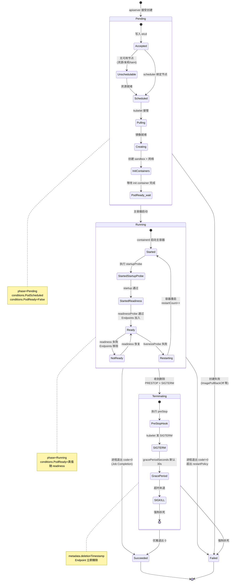

# Pod 生命周期状态机

## 完整状态机图

## Phase 五个值

K8s Pod `status.phase` 仅取五个枚举（不能自定义）：

| Phase | 含义 | 触发 |
|---|---|---|
| **Pending** | 已被接受，容器未全部运行 | 创建后未 Running |
| **Running** | 已绑定节点，所有容器已创建，至少一个运行 | kubelet 报告 |
| **Succeeded** | 所有容器成功退出 code=0，不会重启 | Job 完成典型 |
| **Failed** | 所有容器终止，至少一个失败 | crash / OOM |
| **Unknown** | 无法获取状态（通常节点失联） | kubelet 不上报 |

注意：`phase` 是粗粒度汇总，真实状态藏在 `status.conditions` 与 container `state`。

## Conditions（细粒度信号）

- **PodScheduled**：已绑定节点。
- **Initialized**：所有 init container 完成。
- **ContainersReady**：所有主容器 ready。
- **PodReady**：以上条件的 AND，且 readiness 通过。Service Endpoints 据此加入。
- **PodHasNetwork**（1.27+ alpha）：sandbox 网络已配置。
- **DisruptionTarget**（1.26+）：因驱逐/抢占被标记。

每 condition 含 `status (True/False/Unknown)`、`reason`、`message`、`lastTransitionTime`。

## Container State（每容器独立）

- **waiting**：等待运行（`ImagePullBackOff`、`CrashLoopBackOff`、`ErrImagePull`、`CreateContainerConfigError`）。
- **running**：正在运行，含 startedAt。
- **terminated**：已退出，含 exitCode、reason（OOMKilled、Error、Completed）、signal、finishedAt。

## 三类 Probe 详解

| Probe | 用途 | 失败后果 |
|---|---|---|
| **startupProbe** | 慢启动应用（JVM、模型加载）就绪前屏蔽 liveness/readiness | 不计入 ready |
| **livenessProbe** | 检测死锁 / 僵死，重启容器 | `restartCount++`，按 restartPolicy |
| **readinessProbe** | 检测能否接流量，控制 Endpoints | 摘除流量，但容器不重启 |
| **grpc** probe（1.24+ GA） | 原生 gRPC health protocol | 同上 |

probe 类型：`httpGet`、`tcpSocket`、`exec`、`grpc`。`initialDelaySeconds` 在无 startupProbe 时控制探测启动延迟。

## Init Container

- 顺序执行，前一个成功后才运行下一个。
- 失败按 restartPolicy 重启（Always/OnFailure 重启，Never 则 Pod Failed）。
- 用途：等待依赖、配置初始化、注册服务发现、安全敏感操作（用不同 serviceAccount）。

## restartPolicy

- **Always**（默认）：退出（任意 code）后重启；Deployment/StatefulSet/DaemonSet 必用。
- **OnFailure**：非 0 退出才重启；适合 Job。
- **Never**：不重启；CronJob / 单次任务常用。

指数退避：第 N 次重启延迟 `min(2^N * 10s, 5min)`，10 分钟内成功退出后重置（`CrashLoopBackOff` 状态）。

## Termination（优雅终止）

1. apiserver 收到 `DELETE`，写 `metadata.deletionTimestamp`，Pod 标记 `Terminating`，**Endpoints 立即摘除**。
2. kubelet 检测 deletionTimestamp，并行执行：①`preStop` hook（最多 gracePeriod）；②发送 SIGTERM 给主进程。
3. 等 `terminationGracePeriodSeconds`（默认 30s）。
4. 超时后发 SIGKILL 强制终止。
5. finalizer 全部清除后，对象从 etcd 删除。

要点：preStop 钩子可避免 SIGTERM 早于 Endpoints 摘除生效导致的 503；长任务（数据 flush、长连接 drain）需调大 gracePeriod 或用 Job 退出。

## QoS 与驱逐

K8s 按 `requests/limits` 配置给 Pod 分配 QoS 类：

- **Guaranteed**：每容器 request == limit（CPU/内存），优先级最高，最后被驱逐。
- **Burstable**：至少一个有 request，中等。
- **BestEffort**：无 request/limit，最先被驱逐（OOM、节点压力）。

节点内存压力时 kubelet 按 QoS → 优先级排序驱逐（eviction），BadPod 先死。

## 常见异常状态速查

| 状态 | 含义 | 排查 |
|---|---|---|
| ImagePullBackOff | 镜像拉取失败 | 镜像名/仓库权限/网络 |
| CrashLoopBackOff | 容器反复 crash | 日志、应用错误、依赖 |
| Pending (Unschedulable) | 无可用节点 | 资源/亲和/taint/PVC |
| OOMKilled | 内存超 limit | 调高 limit 或排查泄漏 |
| Evicted | 节点压力被驱逐 | 节点资源、disk pressure |
| Completed | Job 成功 | 正常 |

理解 Pod 生命周期是排障与稳定性优化的基础：readiness 控流量、liveness 控重启、QoS 控存活优先级、preStop 控摘流平滑。
