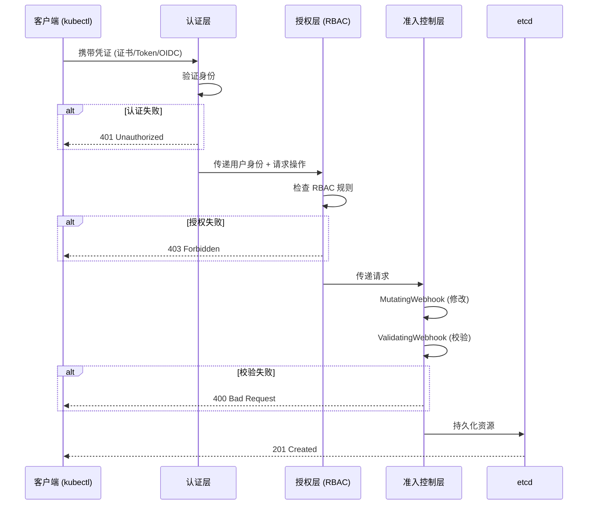
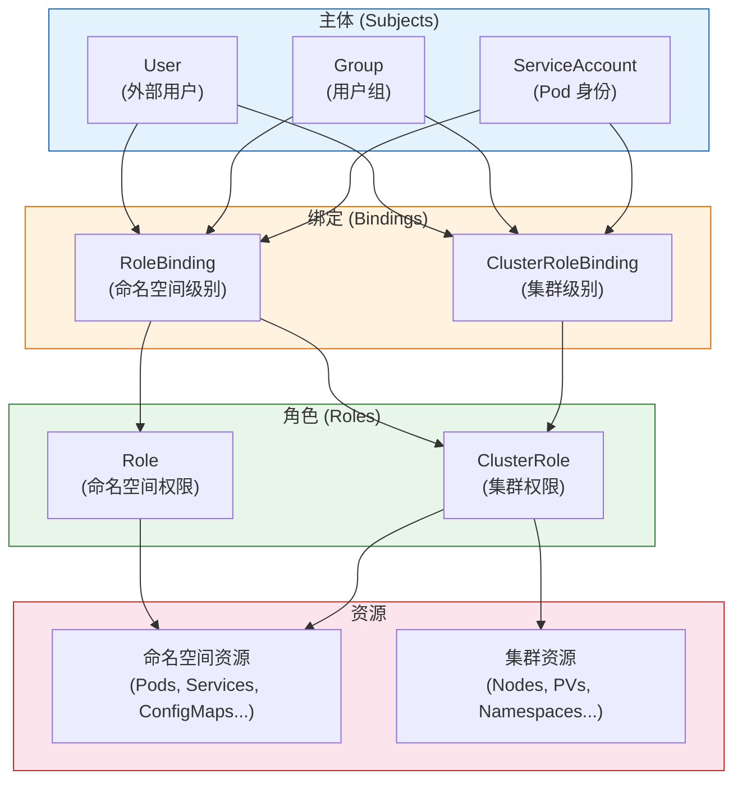
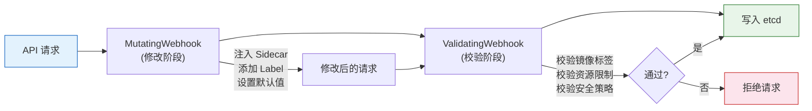

> **生产环境安全提示**
>
> 本文档包含可直接执行的运维命令。执行前请确认：当前目标集群与 Namespace 是否正确；是否具备足够的 RBAC 权限；是否已在非生产环境验证。命令风险等级标注：🔴 高风险（可能造成数据丢失或服务中断）、🟡 中风险（会修改集群状态，但通常可回滚）、🟢 低风险/只读（信息收集，无副作用）。


# [[kubernetes|Kubernetes]] 安全与 RBAC 权限管理全栈培训

> **适用版本**: Kubernetes v1.28 - v1.32 | **文档类型**: 安全治理专项
> **核心原则**: 最小权限原则、零信任架构、多层防御

---

<!-- chunk: 演讲概述 -->## 演讲概述

## 目标受众

- 安全工程师：构建 Kubernetes 安全防御体系
- SRE 工程师：理解 RBAC 配置与安全最佳实践
- 系统管理员：管理集群访问权限和审计

## 预计时长

| 阶段 | 内容 | 时长 |
|------|------|------|
| 第一阶段 | 安全基础与 4C 模型 | 25 分钟 |
| 第二阶段 | 认证与授权机制 | 35 分钟 |
| 第三阶段 | RBAC 深度解析 | 40 分钟 |
| 第四阶段 | 实战演示 | 30 分钟 |
| 第五阶段 | 准入控制与安全加固 | 25 分钟 |
| Q&A | 互动问答 | 15 分钟 |
| **合计** | | **约 2.5 小时** |

## 核心要点

1. 安全 4C 模型：Cloud → Cluster → Container → Code
2. API Server 的三层安全防护：认证 → 授权 → 准入控制
3. RBAC 四个核心对象：Role、ClusterRole、RoleBinding、ClusterRoleBinding
4. 准入控制（Admission Webhook）实现自动化安全策略
5. [[networkpolicy|NetworkPolicy]] 实现 Pod 级网络隔离

---

<!-- chunk: 核心概念讲解 -->## 核心概念讲解

## 安全 4C 模型

Kubernetes 安全遵循从外到内的分层防御策略：

```
┌──────────────────────────────────────────┐
│  Cloud (云基础设施安全)                      │
│  ┌──────────────────────────────────────┐│
│  │  Cluster (Kubernetes 集群安全)          ││
│  │  ┌──────────────────────────────────┐││
│  │  │  Container (容器安全)              │││
│  │  │  ┌──────────────────────────────┐│││
│  │  │  │  Code (代码安全)              ││││
│  │  │  └──────────────────────────────┘│││
│  │  └──────────────────────────────────┘││
│  └──────────────────────────────────────┘│
└──────────────────────────────────────────┘
```

| 层级 | 关注点 | 关键措施 |
|------|--------|---------|
| **Cloud** | 云基础设施安全 | IAM 权限、网络隔离、KMS 密钥管理 |
| **Cluster** | Kubernetes 集群安全 | RBAC、NetworkPolicy、审计日志 |
| **Container** | 镜像与运行时安全 | 镜像扫描、非 root 运行、只读文件系统 |
| **Code** | 代码与应用安全 | 输入验证、TLS 加密、依赖管理 |

## API Server 安全链

每个到达 API Server 的请求都要经过三层安全检查：

```
客户端请求
    ↓
┌──────────────────────────────────┐
│ 第一层: 认证 (Authentication)      │
│ "你是谁？"                         │
│ · 证书 (X.509)                    │
│ · Token (Bearer/ServiceAccount)  │
│ · OIDC (外部身份提供商)            │
└──────────────┬───────────────────┘
               ↓
┌──────────────────────────────────┐
│ 第二层: 授权 (Authorization)       │
│ "你能做什么？"                     │
│ · RBAC (基于角色的访问控制)        │
│ · ABAC (基于属性的访问控制)        │
│ · Node (节点授权器)               │
│ · Webhook (外部授权)              │
└──────────────┬───────────────────┘
               ↓
┌──────────────────────────────────┐
│ 第三层: 准入控制 (Admission)       │
│ "这个操作合规吗？"                 │
│ · MutatingWebhook (修改请求)      │
│ · ValidatingWebhook (校验请求)    │
│ · ResourceQuota (配额检查)        │
│ · LimitRanger (限制检查)          │
│ · PodSecurity (安全策略)          │
└──────────────┬───────────────────┘
               ↓
        写入 etcd
```

## RBAC 深度解析

RBAC（Role-Based Access Control）是 Kubernetes 最常用的授权模式。

**四个核心对象：**

| 对象 | 作用范围 | 说明 |
|------|---------|------|
| **Role** | Namespace 内 | 定义命名空间内的权限规则 |
| **ClusterRole** | 集群范围 | 定义集群级别的权限规则 |
| **RoleBinding** | Namespace 内 | 将 Role/ClusterRole 绑定到主体 |
| **ClusterRoleBinding** | 集群范围 | 将 ClusterRole 绑定到主体 |

**主体 (Subject) 类型：**

| 类型 | 说明 | 典型场景 |
|------|------|---------|
| **User** | 外部用户（由外部认证系统管理） | 开发人员、运维人员 |
| **Group** | 用户组 | 团队级别权限管理 |
| **ServiceAccount** | Pod 内进程访问 API 的身份 | 应用程序访问集群资源 |

**RBAC 权限矩阵：**

```
                │ Role         │ ClusterRole
────────────────┼──────────────┼──────────────
RoleBinding     │ 命名空间权限   │ 命名空间权限
ClusterRoleBinding│ 不适用       │ 集群权限
```

**API 资源与动作：**

| 动作 | 说明 | 示例 |
|------|------|------|
| `get` | 读取单个资源 | `kubectl get pod xxx` |
| `list` | 列出资源 | `kubectl get [[Pods|pods]]` |
| `watch` | 监听变化 | `kubectl get pods -w` |
| `create` | 创建 | `kubectl apply -f pod.yaml` |
| `update` | 更新 | `kubectl edit pod xxx` |
| `patch` | 部分更新 | `kubectl patch pod xxx` |
| `delete` | 删除 | `kubectl delete pod xxx` |
| `deletecollection` | 批量删除 | `kubectl delete pods --all` |

## 准入控制 (Admission Control)

准入控制是 API Server 的最后一道防线，可以在资源持久化到 etcd 之前进行拦截和修改。

**两种 Webhook 类型：**

| 类型 | 作用 | 典型场景 |
|------|------|---------|
| **MutatingWebhook** | 修改请求内容 | 自动注入 Sidecar、添加默认 Label、设置资源限制 |
| **ValidatingWebhook** | 校验请求是否合规 | 禁止使用 `latest` 标签、强制要求资源限制、禁止特权容器 |

**常用准入控制器：**

| 控制器 | 功能 |
|--------|------|
| `NamespaceLifecycle` | 管理命名空间生命周期 |
| `LimitRanger` | 确保资源限制在 LimitRange 范围内 |
| `ResourceQuota` | 检查是否超过 ResourceQuota |

| `PodSecurity` | 替代 PodSecurityPolicy 的安全策略 |
| `DefaultStorageClass` | 自动分配默认 StorageClass |
| `DefaultTolerationSeconds` | 设置默认容忍时间 |

## NetworkPolicy

NetworkPolicy 是 Pod 级别的防火墙，控制 Pod 之间的网络通信：

```yaml
apiVersion: networking.k8s.io/v1
kind: NetworkPolicy
metadata:
  name: default-deny-all
  namespace: production
spec:
  podSelector: {}
  policyTypes:
  - Ingress
  - Egress
---
apiVersion: networking.k8s.io/v1
kind: NetworkPolicy
metadata:
  name: allow-frontend-to-api
  namespace: production
spec:
  podSelector:
    matchLabels:
      app: api
  ingress:
  - from:
    - podSelector:
        matchLabels:
          app: frontend
    ports:
    - protocol: TCP
      port: 8080
  egress:
  - to:
    - podSelector:
        matchLabels:
          app: database
    ports:
    - protocol: TCP
      port: 5432
```

---

<!-- chunk: 架构图 -->## 架构图

## API Server 安全链



## RBAC 对象关系



## 准入控制流程



---

<!-- chunk: 实战演示步骤 -->## 实战演示步骤

## 演示 1：创建 RBAC 权限体系

> ⚠️ **🟡 中危变更** — 变更集群资源状态，建议先 --dry-run 或 diff 确认
> - `kubectl apply/create/replace`：创建/变更集群资源

``` bash
# 🟡 中风险：会修改集群/资源状态，执行前请确认目标、影响范围与授权
# 步骤 1: 创建开发人员角色（只能读 Pod 和查看日志）
cat <<EOF | kubectl apply -f -
apiVersion: rbac.authorization.k8s.io/v1
kind: Role
metadata:
  name: developer
  namespace: production
rules:
- apiGroups: [""]
  resources: ["pods", "pods/log"]
  verbs: ["get", "list", "watch"]
- apiGroups: [""]
  resources: ["pods/exec"]
  verbs: ["create"]
- apiGroups: [""]
  resources: ["services"]
  verbs: ["get", "list"]
- apiGroups: ["apps"]
  resources: ["deployments"]
  verbs: ["get", "list", "watch"]
EOF

# 步骤 2: 创建只读运维角色
cat <<EOF | kubectl apply -f -
apiVersion: rbac.authorization.k8s.io/v1
kind: ClusterRole
metadata:
  name: readonly-ops
rules:
- apiGroups: [""]
  resources: ["pods", "services", "nodes", "namespaces", "events"]
  verbs: ["get", "list", "watch"]
- apiGroups: ["apps"]
  resources: ["deployments", "statefulsets", "daemonsets"]
  verbs: ["get", "list", "watch"]
- apiGroups: [""]
  resources: ["pods/log"]
  verbs: ["get", "list"]
EOF

# 步骤 3: 绑定角色到 ServiceAccount
cat <<EOF | kubectl apply -f -
apiVersion: v1
kind: ServiceAccount
metadata:
  name: developer-sa
  namespace: production
---
apiVersion: rbac.authorization.k8s.io/v1
kind: RoleBinding
metadata:
  name: developer-binding
  namespace: production
subjects:
- kind: ServiceAccount
  name: developer-sa
  namespace: production
roleRef:
  kind: Role
  name: developer
  apiGroup: rbac.authorization.k8s.io
EOF
```
## 演示 2：验证 RBAC 权限

> ⚠️ **🟡 中危变更** — 变更集群资源状态，建议先 --dry-run 或 diff 确认
> - `kubectl apply/create/replace`：创建/变更集群资源

``` bash
# 🟡 中风险：会修改集群/资源状态，执行前请确认目标、影响范围与授权
# 步骤 1: 获取 ServiceAccount Token
SA_TOKEN=$(kubectl create token developer-sa --duration=1h)

# 步骤 2: 测试允许的操作
kubectl --token=$SA_TOKEN get pods -n production
kubectl --token=$SA_TOKEN logs <pod-name> -n production

# 步骤 3: 测试禁止的操作（应该返回 403）
kubectl --token=$SA_TOKEN delete pod <pod-name> -n production
kubectl --token=$SA_TOKEN create deployment test --image=nginx -n production

# 步骤 4: 使用 auth can-i 验证权限
kubectl auth can-i get pods --as=system:serviceaccount:production:developer-sa -n production
kubectl auth can-i delete pods --as=system:serviceaccount:production:developer-sa -n production
kubectl auth can-i create deployments --as=system:serviceaccount:production:developer-sa -n production

# 步骤 5: 列出所有权限
kubectl auth can-i --list --as=system:serviceaccount:production:developer-sa -n production
```
## 演示 3：NetworkPolicy 部署

> ⚠️ **🟡 中危变更** — 变更集群资源状态，建议先 --dry-run 或 diff 确认
> - `kubectl apply/create/replace`：创建/变更集群资源
> - `kubectl exec`：进入容器执行命令，可能改变容器状态

``` bash
# 🟡 中风险：会修改集群/资源状态，执行前请确认目标、影响范围与授权
# 步骤 1: 部署测试应用
kubectl create namespace security-test
kubectl create deployment frontend --image=nginx -n security-test
kubectl create deployment backend --image=nginx -n security-test
kubectl create deployment attacker --image=busybox -n security-test -- sleep infinity

# 步骤 2: 测试默认连通性（应该可以互通）
kubectl exec -it deployment/attacker -n security-test -- wget -qO- backend:80

# 步骤 3: 部署默认拒绝策略
cat <<EOF | kubectl apply -f -
apiVersion: networking.k8s.io/v1
kind: NetworkPolicy
metadata:
  name: default-deny-ingress
  namespace: security-test
spec:
  podSelector: {}
  policyTypes:
  - Ingress
EOF

# 步骤 4: 再次测试（应该超时）
kubectl exec -it deployment/attacker -n security-test -- wget -T5 -qO- backend:80

# 步骤 5: 放通 frontend → backend
cat <<EOF | kubectl apply -f -
apiVersion: networking.k8s.io/v1
kind: NetworkPolicy
metadata:
  name: allow-frontend-to-backend
  namespace: security-test
spec:
  podSelector:
    matchLabels:
      app: backend
  ingress:
  - from:
    - podSelector:
        matchLabels:
          app: frontend
    ports:
    - protocol: TCP
      port: 80
EOF

# 步骤 6: 测试 frontend 可以访问 backend
kubectl exec -it deployment/frontend -n security-test -- wget -qO- backend:80

# 步骤 7: attacker 仍然无法访问
kubectl exec -it deployment/attacker -n security-test -- wget -T5 -qO- backend:80
```
## 演示 4：审计日志配置

``` bash
# 🟢 低风险：只读/信息收集，通常无副作用
# 步骤 1: 创建审计策略文件
cat <<EOF > /etc/kubernetes/audit-policy.yaml
apiVersion: audit.k8s.io/v1
kind: Policy
rules:
- level: RequestResponse
  verbs: ["create", "update", "patch", "delete"]
  resources:
  - group: ""
    resources: ["secrets", "configmaps"]
  - group: "rbac.authorization.k8s.io"
    resources: ["roles", "rolebindings", "clusterroles", "clusterrolebindings"]
- level: Request
  verbs: ["get", "list", "watch"]
  resources:
  - group: ""
    resources: ["secrets"]
- level: Metadata
  omitStages:
  - RequestReceived
EOF

# 步骤 2: 查看 RBAC 绑定审计
kubectl get rolebinding -A -o wide
kubectl get clusterrolebinding -o wide | grep -v system

# 步骤 3: 清理无用绑定
kubectl auth can-i --list --as=system:anonymous
```
## 演示 5：Pod 安全标准

> ⚠️ **🟡 中危变更** — 变更集群资源状态，建议先 --dry-run 或 diff 确认
> - `kubectl apply/create/replace`：创建/变更集群资源

``` bash
# 🟡 中风险：会修改集群/资源状态，执行前请确认目标、影响范围与授权
# 步骤 1: 创建安全标签的命名空间
cat <<EOF | kubectl apply -f -
apiVersion: v1
kind: Namespace
metadata:
  name: secure-ns
  labels:
    pod-security.kubernetes.io/enforce: restricted
    pod-security.kubernetes.io/audit: restricted
    pod-security.kubernetes.io/warn: restricted
EOF

# 步骤 2: 尝试部署特权容器（应该被拒绝）
cat <<EOF | kubectl apply -f -
apiVersion: v1
kind: Pod
metadata:
  name: privileged-pod
  namespace: secure-ns
spec:
  containers:
  - name: app
    image: nginx
    securityContext:
      privileged: true
EOF

# 步骤 3: 部署合规的 Pod
cat <<EOF | kubectl apply -f -
apiVersion: v1
kind: Pod
metadata:
  name: secure-pod
  namespace: secure-ns
spec:
  securityContext:
    runAsNonRoot: true
    seccompProfile:
      type: RuntimeDefault
  containers:
  - name: app
    image: nginx
    securityContext:
      allowPrivilegeEscalation: false
      readOnlyRootFilesystem: true
      runAsUser: 101
      capabilities:
        drop:
        - ALL
EOF
```
---

<!-- chunk: 常见问题与回答 -->## 常见问题与回答

## Q1: User 和 ServiceAccount 的区别是什么？

**回答**: User 是 Kubernetes 外部的身份（如开发人员、运维人员），Kubernetes 本身不管理 User，而是依赖外部认证系统（证书、OIDC）。ServiceAccount 是 Kubernetes 内部管理的身份，用于 Pod 内进程访问 API Server。每个命名空间自动创建一个 `default` ServiceAccount，Pod 默认使用它。

## Q2: RoleBinding 可以绑定 ClusterRole 吗？

**回答**: 可以。RoleBinding 绑定 ClusterRole 时，ClusterRole 中定义的集群级权限会被**缩减**为 RoleBinding 所在命名空间的权限。这在需要为多个命名空间授予相同权限时非常有用——只需定义一个 ClusterRole，然后在每个命名空间创建 RoleBinding 绑定它。

## Q3: 如何防止 ServiceAccount 被赋予 cluster-admin 权限？

**回答**: (1) 禁止为 ServiceAccount 创建 cluster-admin ClusterRoleBinding；(2) 使用 OPA/Gatekeeper 创建策略：禁止 ClusterRoleBinding 的 roleRef 为 cluster-admin；(3) 定期审计：`kubectl get clusterrolebinding -o json | jq '.items[] | select(.roleRef.name=="cluster-admin")'`；(4) 启用审计日志记录所有 RBAC 变更。

## Q4: NetworkPolicy 的默认行为是什么？

**回答**: 如果没有 NetworkPolicy，所有 Pod 之间可以自由通信（允许所有 Ingress 和 Egress）。一旦创建了任何 NetworkPolicy，只有被明确允许的流量才能通过。最佳实践：先部署 default-deny-all 策略，然后逐步添加白名单规则。

## Q5: 如何实现镜像安全扫描？

**回答**: (1) **Trivy**：开源镜像漏洞扫描工具，可集成到 CI/CD；(2) **OPA/Gatekeeper**：通过 ValidatingWebhook 禁止部署有漏洞的镜像；(3) **Kyverno**：策略引擎，可以自动校验镜像来源和签名；(4) **镜像签名**：使用 Cosign/Notary 对镜像签名，确保镜像未被篡改。

## Q6: 如何管理多个团队的 RBAC 权限？

**回答**: 推荐方案：(1) 为每个团队创建专属 Namespace；(2) 创建通用 ClusterRole（如 developer、viewer、admin）；(3) 在每个 Namespace 创建 RoleBinding 绑定到团队 Group；(4) 使用 OIDC Group 同步企业身份系统；(5) 通过 GitOps 管理 RBAC 配置（所有变更走 PR 审批）。

## Q7: Pod Security Standards 的三个级别是什么？

**回答**: (1) **Privileged**：无限制，适合系统和特权级应用（如 CNI 插件）；(2) **Baseline**：最小限制，禁止已知的危险提权（如禁止 hostNetwork、privileged）；(3) **Restricted**：最严格，要求非 root、只读文件系统、丢弃所有 capabilities。生产环境推荐至少 Baseline，核心业务使用 Restricted。

## Q8: 如何审计 Kubernetes 集群的安全状态？

**回答**: (1) **kube-bench**：自动化检查 CIS Kubernetes Benchmark 合规性；(2) **kubectl auth can-i --list**：审查每个 SA 的权限；(3) **审计日志**：记录所有 API 操作；(4) **RBAC 审计**：`kubectl get clusterrolebinding -o json` 查找过度授权；(5) **定期安全扫描**：Trivy + kubeaudit 工具。

## Q9: 如何防止 Secret 泄露？

**回答**: (1) 使用外部密钥管理系统（Vault/AWS Secrets Manager）；(2) 启用 etcd 加密（EncryptionConfiguration）；(3) 使用 RBAC 限制 Secret 访问权限；(4) 禁止在 Pod Spec 中明文写入 Secret；（5) 使用 GitOps 时避免将 Secret 提交到 Git（使用 Sealed Secrets 或 External Secrets Operator）。

## Q10: MutatingWebhook 和 ValidatingWebhook 的执行顺序？

**回答**: 执行顺序是：先执行所有 MutatingWebhook（修改阶段），再执行所有 ValidatingWebhook（校验阶段）。在修改阶段，Webhook 可以修改请求内容（如注入 Sidecar、添加 Label）；在校验阶段，Webhook 只能接受或拒绝请求。这种设计确保校验的是最终状态。

---

<!-- chunk: 要点总结 -->## 要点总结

## 安全防御层级

```
Kubernetes 安全
├── 身份安全
│   ├── 认证 (Authentication)
│   │   ├── X.509 证书
│   │   ├── Bearer Token
│   │   └── OIDC 集成
│   └── 授权 (Authorization)
│       ├── RBAC (核心)
│       ├── ABAC
│       └── Webhook
├── 资源安全
│   ├── 准入控制 (Admission)
│   │   ├── MutatingWebhook
│   │   ├── ValidatingWebhook
│   │   └── Pod Security Standards
│   ├── NetworkPolicy (网络隔离)
│   └── ResourceQuota (资源配额)
├── 数据安全
│   ├── Secret 加密存储
│   ├── etcd 加密
│   └── 审计日志
└── 容器安全
    ├── 镜像扫描
    ├── 非 root 运行
    └── 只读文件系统
```

## SRE 运维红线

| 红线 | 说明 | 违反后果 |
|------|------|---------|
| **红线 1** | 严禁为 ServiceAccount 赋予 `cluster-admin` | 应用被攻破后攻击者获得集群完全控制权 |
| **红线 2** | 严禁将 API Server 暴露在公网且不加 IP 白名单 | 任何人可以尝试暴力破解 |
| **红线 3** | 定期清理无用的 RBAC 绑定 | 权限蔓延导致安全边界模糊 |
| **红线 4** | 生产环境必须启用审计日志 | 安全事件无法追溯 |
| **红线 5** | 核心命名空间必须配置 NetworkPolicy | Pod 间无隔离，横向移动风险 |

---

<!-- chunk: 延伸阅读 -->## 延伸阅读

## 官方文档

| 资源 | 链接 | 说明 |
|------|------|------|
| Kubernetes 安全 | https://kubernetes.io/docs/concepts/security/ | 安全概述 |
| RBAC 文档 | https://kubernetes.io/docs/reference/access-authn-authz/rbac/ | RBAC 详细说明 |
| NetworkPolicy | https://kubernetes.io/docs/concepts/services-networking/network-policies/ | 网络策略 |
| Pod Security | https://kubernetes.io/docs/concepts/security/pod-security-standards/ | 安全标准 |

## 推荐工具

| 工具 | 说明 | 链接 |
|------|------|------|
| kube-bench | CIS Benchmark 检查 | https://github.com/aquasecurity/kube-bench |
| Trivy | 镜像漏洞扫描 | https://github.com/aquasecurity/trivy |
| OPA Gatekeeper | 策略引擎 | https://github.com/open-policy-agent/gatekeeper |
| Kyverno | 策略管理 | https://kyverno.io/ |
| Falco | 运行时安全 | https://falco.org/ |

## 关联培训专题

- `kubernetes-architecture-fundamentals-presentation.md` — API Server 安全链详解
- `kubernetes-networking-presentation.md` — NetworkPolicy 与网络隔离
- `kubernetes-troubleshooting-methodology-presentation.md` — 安全事件响应

---

> **Kusheet Project** | 作者: Allen Galler (allengaller@gmail.com)

---

<!-- chunk: Obsidian 相关文档 -->## Obsidian 相关文档

- topic-presentations MOC
- Topic: Presentations（技术演示文稿）
- Kubernetes 架构与基础概念全栈培训
- Kubernetes CoreDNS 全栈进阶培训 (从入门到专家)
- Kubernetes Ingress 全栈进阶培训 (从入门到专家)
- Kubernetes 可观测性全栈培训 (监控、日志、追踪)
- Kubernetes 调度与编排策略全栈培训
- Kubernetes Service 全栈进阶培训 (从入门到专家)
- Kubernetes 存储体系全栈进阶培训 (从入门到专家)
- Kubernetes Terway (Aliyun) 全栈进阶培训 (从入门到专家)
- Kubernetes 故障排查方法论全栈培训
- Kubernetes Workload 全栈进阶培训 (从入门到专家)

## See Also

- kubernetes-observability-presentation
- kubernetes-scheduling-presentation
- kubernetes-service-presentation
- kubernetes-storage-presentation


<!-- risk-assessed -->
