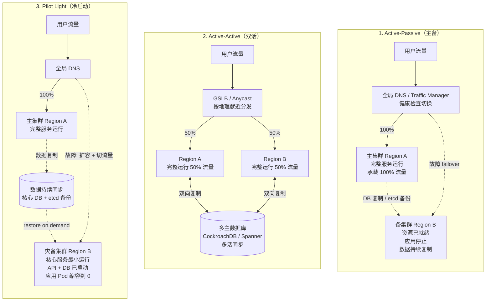

# 灾难恢复架构模式：Active-Passive / Active-Active / Pilot Light

## 三种模式架构图

## RTO / RPO / 成本对比

| 模式 | RTO（恢复时间） | RPO（数据损失） | 资源成本 | 复杂度 |
|---|---|---|---|---|
| Active-Passive | 分钟级（10-30 min） | 秒级（异步复制） | 2x（备集群闲置） | 中 |
| Active-Active | 0（即时） | 0 或近 0 | 2x（全部利用） | 高 |
| Pilot Light | 小时级（30 min - 数小时） | 分钟级（备份周期） | 1.x x（核心 + 闲置扩展） | 中低 |
| Backup-Restore（最基础） | 数小时 - 数天 | 数小时 - 数天 | 1.x x | 低 |

## 1. Active-Passive（主备）

**主集群**承载全部流量；**备集群**资源已就绪（节点、网络、控制器），但应用 Pod 不运行或只运行 read-only 副本；数据通过异步复制（DB binlog、etcd 周期备份恢复）。故障时全局 DNS（Route53 / Cloudflare / Azure Traffic Manager）切换流量，备集群应用启动 + 数据库提升为主。

- **优势**：实现简单、避免双写冲突、容灾切换决策清晰。
- **劣势**：备集群资源闲置（成本高）、切换需人工或编排验证、RTO 取决于应用启动时间。
- **典型场景**：传统企业容灾、合规要求"两地三中心"、避免多活复杂度。

## 2. Active-Active（双活 / 多活）

两个或多个 Region 都承载真实流量，用户按地理就近分发。关键技术挑战：

- **数据一致性**：需多主数据库（CockroachDB、Spanner、YugabyteDB、Cassandra、DynamoDB Global Table）或应用层处理冲突。
- **会话状态**：跨 Region 共享（Redis Global / session-less JWT），避免用户跨区切换丢失 session。
- **流量切换**：GSLB + Locality-weighted LB，单 Region 故障用户自动重路由。
- **配置同步**：GitOps 多集群（ArgoCD ApplicationSet、Flux）保证配置一致。

- **优势**：RTO/RPO 接近 0、资源利用率高、地理就近延迟低、最稳健。
- **劣势**：架构复杂、数据库一致性挑战（CAP 取舍）、成本最高、调试链路长。
- **典型场景**：全球化 SaaS、金融核心系统、对 RTO 极度敏感业务。

## 3. Pilot Light（冷启动 / 引航灯）

介于主备与冷备份之间：核心组件（API server、数据库、身份服务）在备集群**最小运行**，应用 Pod 缩容到 0；数据持续同步到灾备集群。故障时：①扩容应用 Pod；②数据完整性校验；③DNS 切流量。

- **优势**：成本低于主备（多数工作负载冷待机）、核心服务预热快、数据已就位。
- **劣势**：RTO 较长（应用冷启动 + 缓存预热）、首次切换需测试。
- **典型场景**：中等 SLA 业务、预算受限容灾、可接受分钟级中断。

## K8s 容灾要点

- **集群控制面**：云托管（EKS/GKE/AKS）控制面由云厂商托管；自建集群需备份 etcd（`etcdctl snapshot save`）+ Velero 备份资源。
- **应用资源**：**Velero**（含 PV snapshot）或 **Kasten K10** 备份集群资源 + 持久卷快照，跨集群恢复。
- **持久化数据**：DB 层做异步/同步复制（PostgreSQL streaming replication、MySQL GTM、MongoDB replica set）；对象存储跨区复制（S3 CRR）。
- **配置 / Secrets**：Git 仓库存 manifest（GitOps）+ 外部密钥管理（Vault / cloud KMS），不依赖单一集群。
- **DNS 与全局 LB**：Route53 health check、Cloudflare Load Balancer、Azure Traffic Manager 实现 30s-60s 切换。
- **多集群服务发现**：Istio / Cilium ClusterMesh 让流量自动 failover 到健康集群。
- **演练**：定期 GameDay（注入 Region 故障、网络分区、Pod 删除），验证 RTO/RPO 实际值。

## 选型决策

- 监管要求 + 预算充足 + 业务关键 → **Active-Active**。
- 业务关键但可接受分钟级中断 → **Active-Passive**。
- 预算受限 + 可接受小时级中断 → **Pilot Light**。
- 仅需合规备份 + 接受数小时中断 → **Backup-Restore**（定期 Velero 备份）。

实际方案常**按应用分级**：核心支付系统 Active-Active，主要业务 Active-Passive，长尾应用 Pilot Light 或仅备份。
