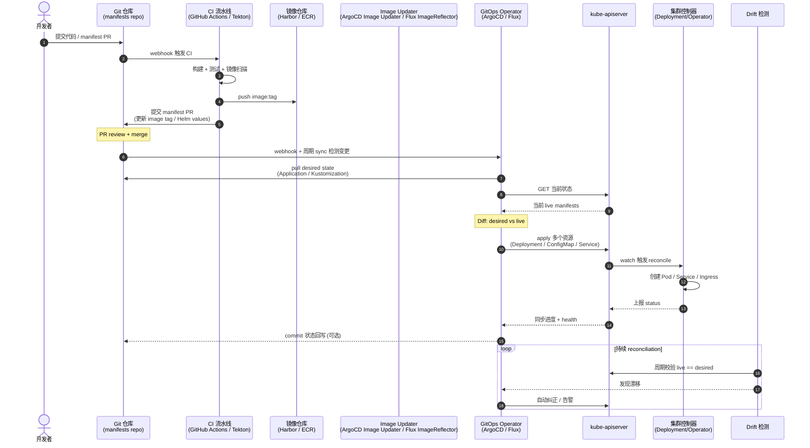

# GitOps 部署流程

## 端到端时序

## 核心原则（GitOps 4 准则）

CNCF OpenGitOps 原则：

1. **声明式**：系统期望状态以声明式描述（YAML/Kustomize/Helm），可版本化。
2. **版本化与不可变**：所有期望状态存储在 Git，Git commit 提供不可变审计日志，这是"唯一真相源"。
3. **自动拉取**：集群中的 Agent 主动从 Git 拉取变更，而非 CI push（Pull vs Push 模式差异）。
4. **持续协调**：Agent 持续对比期望与实际，自动纠正漂移。

## Push vs Pull

| 模式 | 代表 | 鉴权 | 安全 | 回滚 |
|---|---|---|---|---|
| **Push**（CI 直接 kubectl apply） | Jenkins / GitLab CI | CI 持有集群凭证 | 风险高 | 重新跑流水线 |
| **Pull**（GitOps Agent 拉取） | ArgoCD / Flux | 集群内 Agent，Git 只读 | 风险低 | Git revert 即可 |

GitOps 选 Pull：CI 只负责代码 → 镜像 → manifest 提交；集群 Agent 负责部署。这使 CI 不需集群凭证，符合零信任边界。

## 主流工具对比

| 维度 | ArgoCD | Flux |
|---|---|---|
| UI | 丰富 Web UI + CLI | 重 CLI，有 Weave GitOps UI |
| 抽象 | Application / AppProject | Kustomization / HelmRelease / Source |
| 多租户 | AppProject + RBAC | 命名空间隔离 |
| 镜像更新 | Image Updater（独立组件） | ImageReflector + ImageRepository 内建 |
| Helm | 一等公民 | 一等公民 |
| Kustomize | 一等公民 | 一等公民 |
| 事件 | Slack/Teams webhook | Notification controller |
| 生态 | UI 工具丰富 | CNCF Flux 项目族（多组件） |

## 关键实践

**仓库结构**：单仓 vs 多仓（应用 manifest 仓 + 应用代码仓分离）。推荐 **应用代码仓** 与 **配置仓** 分离，CI 跨仓 PR 提交 manifest 变更，便于审计与权限隔离。

**环境分层**：`base/` + `overlays/{dev,staging,prod}`（Kustomize）或 `values-{env}.yaml`（Helm）。生产环境可加 PR approval gate、sign-off（sigstore cosign 验证镜像签名）。

**渐进式发布**：ArgoCD Rollouts / Flux Flagger 实现 Canary / Blue-Green，对接 Prometheus 自动 rollback（基于错误率/延迟 SLO 金丝雀分析）。

**漂移检测与纠正**：`syncPolicy.automated.prune=true` 删除多余资源；`selfHeal=true` 自动覆盖手改；但生产可设为 dry-run + 告警，避免误删。

**镜像更新自动化**：ArgoCD Image Updater 监听镜像新 tag，回写 Git；Flux ImageUpdateAutomation 原生支持。实现"代码合并即生产发布"（前提：通过测试与策略）。

**多集群**：ArgoCD Application Cluster 声明目标集群；Flux 支持多集群（每集群一个 Fleet 或共享 source）。GitOps 天然适配多集群 DR 与多环境一致性。

**安全**：用 sealed-secrets / SOPS / External Secrets Operator 加密敏感数据存入 Git；用 OPA Gatekeeper / Kyverno 在 ArgoCD sync 前做策略校验；用 cosign 验证镜像签名（ImagePolicyWebhook + Kyverno）。
