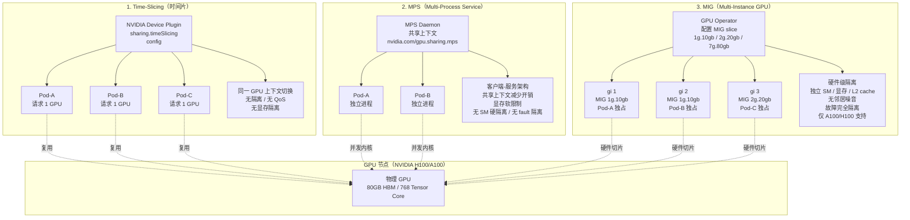

# Kubernetes GPU 共享模型

## 三种模型对比图

## 维度对比

| 维度 | Time-Slicing | MPS | MIG |
|---|---|---|---|
| 隔离级别 | 软件（驱动时分复用） | 软件（共享上下文） | 硬件（GPU 内物理分区） |
| 显存隔离 | ❌ 全局共享 | ⚠️ 软限制（可超额） | ✅ 硬隔离 |
| SM/Cores 隔离 | ❌ | ❌（并发执行） | ✅ |
| L2/Cache 隔离 | ❌ | ❌ | ✅ |
| Fault 隔离 | ❌（一错全停） | ❌（影响 daemon） | ✅（独立） |
| 性能开销 | 高（上下文切换） | 低（共享内核调度） | 极低（硬件直通） |
| QoS 保障 | 无 | 无 | 有 |
| 配置复杂度 | 简单 | 中 | 复杂（需重启 GPU） |
| 支持 GPU | 全部 NVIDIA | 全部 CUDA | 仅 A100 / H100 / H200 |
| K8s 集成 | NVIDIA GPU Operator | NVIDIA GPU Operator | NVIDIA GPU Operator + MIG manager |
| 适用负载 | 低 QoS 推理 / 测试 | 同构训练 / 推理 | 生产强隔离 / 多租户 |

## 各模型详解

### 1. Time-Slicing（时间片）

最早期的共享方式。NVIDIA Device Plugin 配置 `sharing.timeSlicing.resources`，将一张 GPU 暴露为 N 个虚拟设备，每个 Pod 拿到完整 GPU 视图，驱动层时分复用调度。

- **优点**：配置最简单，兼容所有 NVIDIA GPU，无需特殊硬件。
- **缺点**：无显存隔离（一个 Pod OOM 影响全部）、无 QoS（一个 Pod 占满计算资源拖累邻居）、错误隔离最差。
- **典型场景**：开发测试环境、QoS 要求低的批量推理、模型服务推理（如 Triton 多模型）。

### 2. MPS（Multi-Process Service）

CUDA 层的客户端-服务架构。MPS Daemon 持有 GPU 上下文，多个客户端进程的 CUDA 内核通过 daemon 提交，**并发执行**而非时分复用。

- **优点**：内核并发减少调度开销、提升小 batch 利用率、显存软限制（`CUDA_MPS_PINNED_DEVICE_MEM_LIMIT`）。
- **缺点**：客户端崩溃可能影响 daemon、无 SM 硬隔离、显存限制依赖自觉。
- **典型场景**：多副本同构推理服务、相同模型多实例、需要更高吞吐但能接受软隔离。

### 3. MIG（Multi-Instance GPU）

Ampere（A100）/ Hopper（H100）架构的硬件级分区。一张 GPU 在 BIOS/驱动层切分为 1-7 个独立 GPU Instance，每个实例有独立 SM、显存、L2 cache、编码器，互不干扰，故障隔离。

- **优点**：硬件级强隔离、QoS 有保障、故障半径最小、独立故障重启。
- **缺点**：仅高端数据中心 GPU 支持、切片粒度固定（A100: 1g.10gb / 2g.20gb / 3g.40gb / 4g.40gb / 7g.80gb 等 7 种）、切片重新配置需 GPU 重置、运维复杂。
- **典型场景**：生产多租户、AI 平台即服务、强 QoS 推理 + 训练混合负载。

## K8s 集成路径

**NVIDIA GPU Operator** 统一管理三种模式，通过 helm values 切换。Pod 通过 `nvidia.com/gpu: 1` 资源请求，Device Plugin 自动绑定到合适的虚拟设备。MIG 模式需 `mig.strategy=single`（所有 Pod 看到相同切片类型）或 `mixed`（多种切片共存）。Volcano / Kueue 等批调度器配合实现 GPU 配额与队列。

## 演进趋势

- **A100/H100** 主流使 MIG 成为生产默认；MPS + MIG 组合（MIG 内启用 MPS）补充细粒度复用。
- **Intel / AMD GPU** 也推出类似分区（Intel oneAPI tile / AMD MxGPU）。
- **方向**：硬件级隔离 + 软件级弹性调度结合，配合 Kueue / Run:AI 等调度器实现"按需切片 + 抢占队列"。
