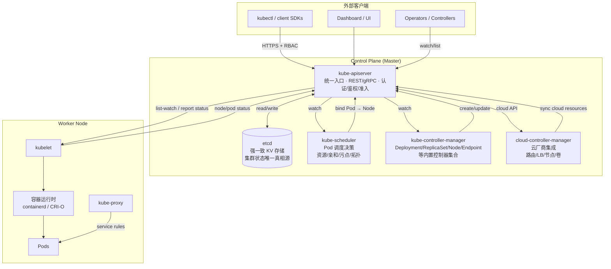

# Kubernetes Control Plane 架构

## 架构图

## 组件职责

**kube-apiserver** 是控制平面的唯一入口，所有组件（kubectl、控制器、kubelet）都必须通过它访问集群状态。它承担认证（Authentication）、授权（Authorization, RBAC/ABAC）、准入控制（Admission: Mutating → Validating）三道关卡，并将所有写操作以 ResourceVersion 实现乐观并发，最终持久化到 etcd。

**etcd** 是分布式强一致 KV 存储（Raft 共识），是集群状态的"唯一真相源"（single source of truth）。它存储 Pod、Service、Secret、ConfigMap、CRD 等所有对象。生产环境推荐 3 或 5 节点奇数部署，跨可用区以容忍故障。所有 etcd 写入都经 apiserver，严禁组件直接写。

**kube-scheduler** 监听未绑定节点的 Pod（`spec.nodeName == ""`），经过两阶段调度：**Filter**（资源、nodeSelector、taint、亲和、volume limits）→ **Score**（优先级打分），最终将 Pod 绑定到最优节点。1.19+ 支持 Scheduler Framework 允许插件扩展。

**kube-controller-manager** 是内置控制器的集合（进程内多控制器）：Node Controller 监控节点心跳并标记 NotReady、Deployment Controller 滚动更新、ReplicaSet Controller 维持副本数、Endpoint/EndpointSlice Controller 维护 Service 后端、ServiceAccount/Token Controller 等。每个控制器遵循"watch → compare → act"的 reconcile 循环。

**cloud-controller-manager** 将云厂商逻辑与核心解耦（KEP-2 KCM 拆分）。Node Controller 初始化节点 label（topology）、Route Controller 配置云路由、Service Controller 创建云负载均衡器、Volume Controller 附加云磁盘。这让 kubelet 不再需要云凭证。

## 交互要点

- 所有组件与 apiserver 都是 **list-watch** 模型：初次 list 全量，随后 watch 增量，避免轮询压力。
- apiserver 与 etcd 之间唯一通道；etcd 性能（fsync 延迟）直接决定集群写入吞吐。
- scheduler 与 controller-manager 是 **leader-elected**（通过 Lease），多副本仅一个活跃。
- kubelet 每隔 `--node-status-update-frequency`（默认 10s）上报状态，node-monitor-grace-period 默认 40s 后判定 NotReady。

## 故障与扩展考量

apiserver 横向扩展（多实例 + LB），但所有实例共享同一 etcd；etcd 是水平扩展瓶颈。大集群（>1000 节点）需要调优 etcd（defrag、quota、SSD/NVMe）、apiserver（max-mutating-requests-inflight、watch-cache）、controller-manager（并发 workers）。控制平面高可用 = apiserver LB + etcd quorum + leader election。
