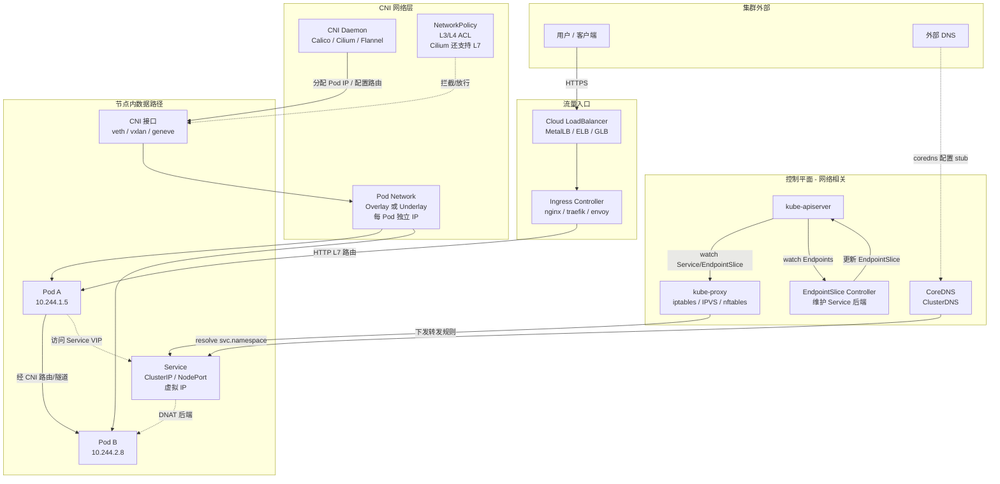

# Kubernetes 网络模型

## 架构图

## 模型核心约束

K8s 网络模型有四条强制约束（Kubernetes Network Model SIG-Network）：

1. **Pod 间无 NAT 通信**：任意 Pod 可直接用对方 IP 互通，不经过 NAT。
2. **节点上 agent 可与所有 Pod 通信**：kubelet、kube-proxy 必须直连 Pod。
3. **容器间端口隔离**：同一节点上不同 Pod 看到自己的端口命名空间。
4. **每 Pod 独立 IP**（flat address space）：一个 Pod 一个 IP，不是一台机器一个 IP。

## 组件职责

**CNI（Container Network Interface）** 负责 Pod IP 分配与节点间互联。主流实现：Calico（BGP 或 VXLAN，支持 NetworkPolicy）、Cilium（eBPF 数据面，L4/L7 策略，性能高）、Flannel（最简 VXLAN）、Antrea（OVS）。CNI 在 Pod 创建时由 kubelet 调用二进制插件（CNI 0.4.0 spec），完成 IPAM + 接口配置。

**kube-proxy** 将 Service 的虚拟 IP 映射到后端 Pod。三种模式：**iptables**（默认，规则数随 Service 线性增长、O(n) 匹配）、**IPVS**（内核哈希表 O(1)，支持多种调度算法 rr/lc/sh）、**nftables**（1.29+ alpha）。kube-proxy watch EndpointSlice 实时更新规则。

**CoreDNS** 是默认 ClusterDNS（替代 kube-dns），通过 `kube-dns` Service 暴露，解析 `<svc>.<ns>.svc.cluster.local`。Pod `/etc/resolv.conf` 默认指向它。CoreDNS 的 `kubernetes` plugin 直接 list-watch Service/Endpoint 生成记录。

**EndpointSlice**（替代 Endpoints，1.21+ GA）将一个 Service 的后端切片存储，每片最多 100 端点，支持拓扑提示（topology hints）实现就近访问，减轻大型 Service 的 watch 压力。

**Ingress** 是 L7 路由抽象（HTTP host/path → Service）。Ingress Controller（nginx-ingress、traefik、envoy-gateway）实际消费 Ingress 资源并配置数据面。Gateway API（1.25+）是其继任者，分离 GatewayClass/Gateway/HTTPRoute。

**NetworkPolicy** 是 L3/L4 命名空间内 Pod 间访问控制，需 CNI 实现（Calico/Cilium）。默认全部放行，需显式写白名单。

## 数据路径示例

外部用户 → LB（公网 IP）→ Ingress Controller（TLS 终止 + host 路由）→ Pod IP（经 CNI 节点间隧道或路由）→ 应用响应。集群内部 Pod 访问 `svc.ns.svc.cluster.local`：CoreDNS 解析 → ClusterIP → kube-proxy 规则 DNAT 到后端 Pod。Cilium 场景下 kube-proxy 被 eBPF 替代，socket-level 重定向跳过 iptables。
