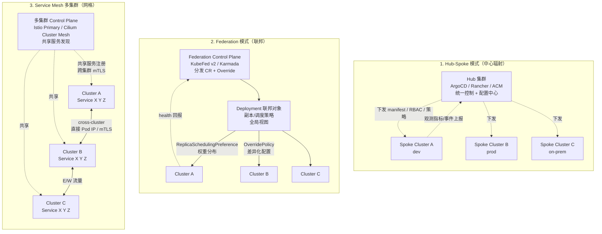

# 多集群架构模式：Hub-Spoke / Federation / Mesh

## 三种模式架构图

## 模式维度对比

| 维度 | Hub-Spoke | Federation | Service Mesh |
|---|---|---|---|
| 抽象层 | 应用部署 | 工作负载调度 | 服务通信 |
| 数据同步方向 | 单向下发 | 单向下发 + 回报 | 双向服务发现 |
| 跨集群流量 | ❌（需外部 LB） | ❌ | ✅（原生 mTLS） |
| 全局调度 | ❌ | ✅（副本权重） | ⚠️（基于 Locality） |
| 主从关系 | 强中心 | 弱中心 | 平等或主从 |
| 代表工具 | ArgoCD / Rancher / ACM | Karmada / KubeFed v2 | Istio / Cilium / Linkerd |
| 典型场景 | 配置合规 / 多租 | 弹性调度 / 多地容灾 | 微服务跨集群互联 |

## 1. Hub-Spoke 详解

**Hub-Spoke**（也称 Centralized Management）以一个管理集群（Hub）为中心，向多个 Spoke 集群下发配置、策略、RBAC、证书。Hub 不参与业务流量，仅做控制。

- **典型工具**：Red Hat Advanced Cluster Management（ACM）、SUSE Rancher、Google Anthos、Azure Arc、ArgoCD ApplicationSet（部署分发）。
- **优势**：模型简单、统一审计与策略、符合企业治理（OPA/Kyverno 全集群生效）、可纳管混合云（云上 + 自建）。
- **劣势**：Spoke 之间无直接通信能力，跨集群流量需外部 LB/Gateway；Hub 故障影响管理面但不影响业务。
- **适用场景**：集团多子公司、多环境（dev/staging/prod）、混合云治理、合规要求（金融/医疗）。

## 2. Federation 详解

**Federation**（联邦）让用户在一个 API 处声明**工作负载**，由联邦控制面决定副本分布、调度策略、故障切换。

- **典型工具**：KubeFed v2（CNCF 已归档）、Karmada（CNCF Incubating，国内华为主导）、Open Cluster Management。
- **核心 CRD**：`PropagationPolicy`（分发策略）、`OverridePolicy`（差异化配置）、`ResourceBinding`（绑定状态）、`Cluster`（成员注册）。
- **关键能力**：副本权重（A 集群 60% / B 集群 40%）、亲和调度（区域感知）、故障自动迁移（集群失联后副本重分布）、应用级多集群部署。
- **劣势**：仅解决"工作负载分布"，不解决跨集群服务通信，仍需 Service Mesh 补足；多集群同名对象元数据冲突需谨慎命名。
- **适用场景**：多地容灾、跨地域负载均衡、弹性容量（云溢出到边缘）、Region-aware 调度。

## 3. Service Mesh 多集群详解

**Service Mesh 多集群**让多个集群的 Pod 在网络层直连，共享服务注册，实现透明跨集群 mTLS 与负载均衡。

- **典型工具**：
  - **Istio Multi-Primary / Primary-Remote**：多控制面或单控制面 + 多数据面，共享 root CA。
  - **Cilium Cluster Mesh**：基于 eBPF，节点级共享服务发现，跨集群 Pod-to-Pod 直连。
  - **Linkerd Multicluster**：轻量 gateway 模型。
- **关键能力**：跨集群 Service `.global` DNS、Locality-weighted LB（优先本集群）、故障切换（集群降级）、统一身份（SPIFFE / mTLS）、透明跨集群调用。
- **劣势**：网络打通复杂（需 Pod CIDR 不冲突 + 跨集群网络可达）、控制面一致性要求高、调试链路长。
- **适用场景**：微服务跨集群互联、容灾切换（流量自动迁移）、Regulatory 分区（数据本地化但服务共享）、混合云统一服务网络。

## 组合策略

三种模式并非互斥，企业级方案常**叠加**：

1. **Hub-Spoke 管理面** + **Federation 调度面** + **Service Mesh 数据面**，分别解决治理、调度、通信。
2. 工程实践：Anthos / Azure Arc 提供 Hub-Spoke；Karmada 提供 Federation；Istio/Cilium 提供 Mesh。
3. **多集群 Ingress / Gateway API**（Multi-cluster Gateway）实现 N/S 流量按权重分配到不同集群。

## 选型决策树

- 仅需统一治理与配置下发 → **Hub-Spoke**。
- 需要工作负载按策略分布、多地容灾 → **Federation（Karmada）**。
- 微服务需要跨集群调用、统一身份 → **Service Mesh（Istio/Cilium）**。
- 全场景 → **三者叠加**，按治理 / 调度 / 通信职责分层。
